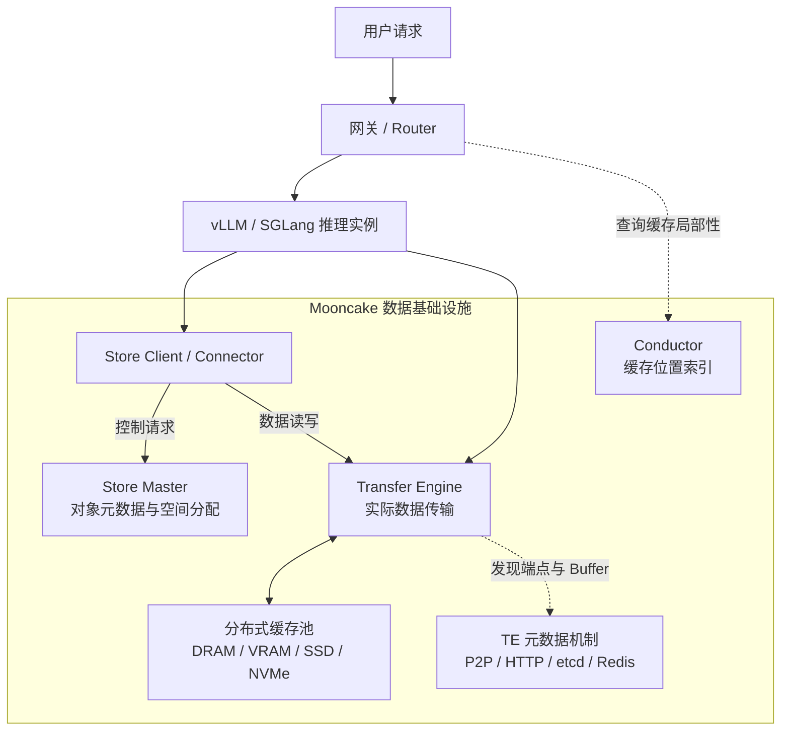
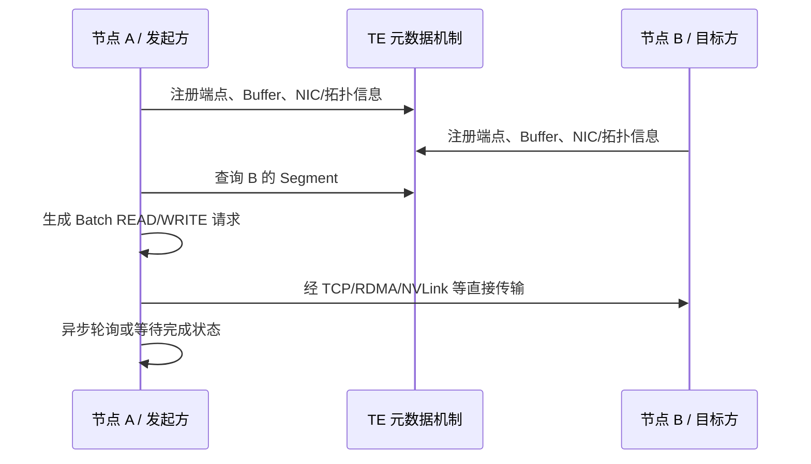
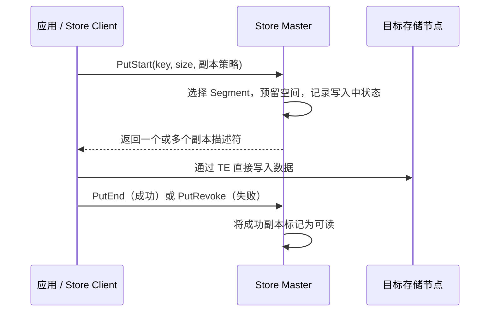
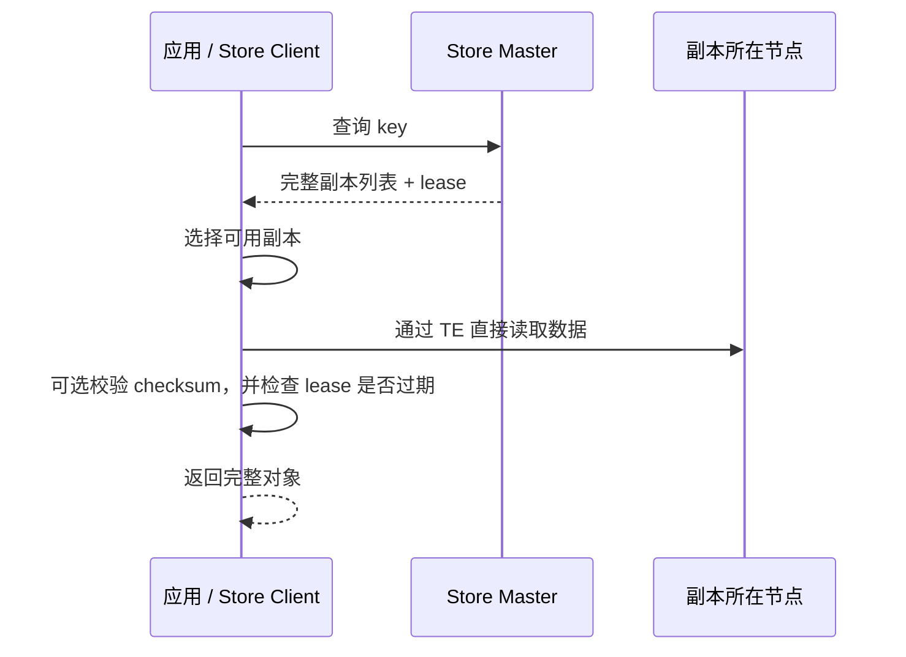
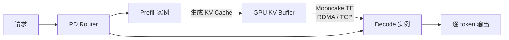
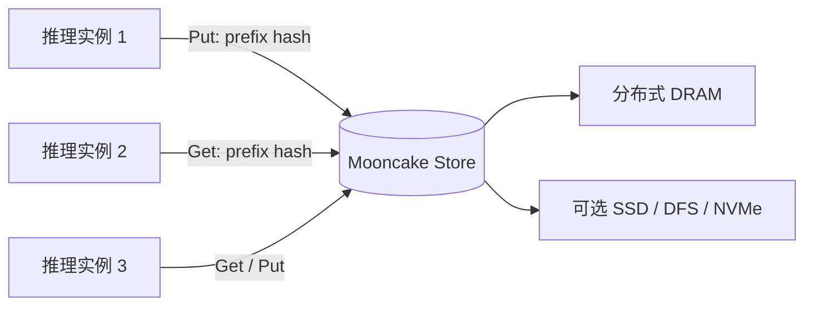

# Mooncake 初学者指南：用法、核心概念与实现原理

> 本文基于当前仓库中的代码、README、设计文档、部署文档和 vLLM/SGLang 集成文档整理，面向第一次接触 Mooncake 的用户。重点是建立整体认识，而不是讲解类、函数和源码细节。
>
> 仓库状态参考日期：2026-08-24。Mooncake 和上层推理框架迭代较快，实际部署时仍应以当前版本的官方集成文档为准。

## 1. 先用几句话认识 Mooncake

Mooncake 是面向大模型推理和训练的**高性能数据基础设施**。它不负责执行 Transformer，也不是 vLLM 或 SGLang 的替代品；它主要解决的是：当 KV Cache、模型权重、隐藏状态等大块 Tensor 需要跨 GPU、跨机器、跨内存层级流动和共享时，怎样搬得更快、存得更多、复用得更好。

初学时先记住两个核心组件：

- **Transfer Engine（TE）**：负责“搬数据”。它统一封装 TCP、RDMA、NVLink、NVMe-oF 等传输方式，并尽量利用零拷贝、多网卡和拓扑感知能力。
- **Mooncake Store**：负责“管数据”。它把多台机器贡献出来的 DRAM，以及可选的 SSD/NVMe 等资源，组织成一个分布式对象缓存；应用通过 key 执行 Put/Get，真正的数据搬运仍由 Transfer Engine 完成。

可以把整个系统类比成物流网络：

| Mooncake 概念 | 生活类比 | 主要职责 |
| --- | --- | --- |
| Transfer Engine | 高速运输网络 | 决定数据怎样从 A 搬到 B |
| Segment / Buffer | 仓库和仓位 | 表示可以被读写的一段内存或存储空间 |
| Mooncake Store | 分布式仓储系统 | 按 key 管理对象、容量、副本和生命周期 |
| Store Master | 仓储调度中心 | 记录对象在哪，决定新对象放在哪 |
| TE 元数据机制 | 地址簿 | 让节点知道对端地址、可访问内存和网络信息 |
| vLLM / SGLang Connector | 物流接入适配器 | 把推理框架的 KV Cache 操作接入 Mooncake |
| Conductor | 缓存导航索引 | 告诉路由器哪个推理实例已有最长的可复用前缀 |

一句话总结：**Mooncake 用 Store 扩大和共享缓存，用 Transfer Engine 缩短数据移动时间，再由 vLLM、SGLang 等框架决定什么时候使用这些数据。**

## 2. Mooncake 为什么有价值

### 2.1 LLM 推理中的 Prefill 与 Decode

一次典型生成请求大致分为两个阶段：

1. **Prefill（预填充）**：一次性处理整段输入 prompt，计算每层注意力所需的 Key/Value，并生成 KV Cache。长 prompt 的 Prefill 计算量很大，更偏向算力吞吐型。
2. **Decode（解码）**：每次生成一个或少量 token，不断读取并追加 KV Cache。Decode 对每步延迟更敏感，也更偏向显存带宽和调度延迟型。

KV Cache 可以理解为模型对已处理上下文生成的“中间计算结果”。保留它以后，模型生成下一个 token 时不必重新计算全部历史上下文。

### 2.2 传统部署的三个浪费

- Prefill 和 Decode 混在同一组 GPU 上，两种负载特性不同，容易互相干扰，也不容易独立扩缩容。
- 每个推理实例只使用自己的本地 KV Cache；相同系统提示词、多轮对话前缀或公共文档前缀可能在不同实例上重复计算。
- GPU 显存很贵且容量有限，而集群里的 CPU、DRAM、SSD 和多张高速网卡经常没有被充分利用。

Mooncake 的思路是“以 KV Cache 为中心做解耦”：

- Prefill 和 Decode 可以部署在不同节点上，KV Cache 由 TE 高速传递。
- KV Cache 可以从单个推理实例中解耦出来，放进集群级 Store，被不同实例复用。
- GPU、CPU、DRAM、SSD/NVMe 形成分层缓存，热数据放快层，容量数据放更大但更慢的层。

最重要的性能判断不是“远程读取是否足够快”，而是：

> **读取并恢复已有 KV Cache 的代价，是否小于重新做一遍 Prefill 的代价。**

长上下文、重复前缀、多轮对话、Agent 工作流通常更容易满足这个条件；短且几乎不重复的请求，收益可能有限。

## 3. 项目边界：Mooncake 是什么，不是什么

### 3.1 它是什么

- 一套支持 DRAM、VRAM、SSD/NVMe 等介质的高性能数据移动和共享机制。
- 一个适合大对象和 Tensor 的分布式 KV 缓存，而不是只面向小字符串的普通 KV 服务。
- vLLM、SGLang、LMCache、LMDeploy 等系统可接入的基础组件。
- 从 KV Cache 扩展到模型权重、隐藏状态、激活值和 RL 数据传输的基础设施。

### 3.2 它不是什么

- **不是模型推理引擎**：模型加载、算子执行、批处理和 token 生成仍由 vLLM、SGLang 等完成。
- **不是开箱即用的完整在线服务**：真实部署还需要路由器、推理实例、模型、监控和容量规划。
- **不是默认强持久、强一致的数据库**：Store 的首要目标是缓存和高速对象访问；需要 SSD、DFS、快照或 HA 时必须显式配置，并理解相应限制。
- **不是只有 RDMA 才能使用**：TCP 适合本地学习和功能验证；RDMA/GPUDirect 是生产高性能路径。

### 3.3 “论文中的 Mooncake”与“仓库里的 Mooncake”

Mooncake 最初描述的是一套完整的 KVCache-centric 推理架构，其中还包括基于缓存位置、负载和 SLO 做决策的调度思想，以及过载时的预测和提前拒绝。

当前开源仓库最成熟、最通用的主体是 Transfer Engine、Mooncake Store 及其框架集成，此外还有 Conductor、EP/PG、TENT、Reshard 等组件。生产中的请求路由、准入和实例编排通常仍由 vLLM/SGLang 的路由器或外部控制平面完成。因此，不要期待存在一条 `mooncake serve model` 命令就启动论文中的完整生产系统。

## 4. 核心组件全景



### 4.1 Transfer Engine：高速数据通道

TE 提供的是比“远程对象存储”更底层的能力：应用注册本地内存，发现远端可访问区域，然后发起一组 READ/WRITE 请求。

它的核心价值包括：

- 为多种网络和设备提供统一传输接口。
- 支持批量、异步和非连续内存区域传输。
- 识别 CPU NUMA、GPU 和网卡之间的拓扑，尽量选择更近的路径。
- 把大传输拆成多个 slice，在多张 NIC 上并行发送以聚合带宽。
- 某条 RDMA 路径暂时失败时，尝试换用其他可用路径。
- 在支持的硬件与协议组合上，让数据直接进入目标 DRAM/VRAM，减少 CPU 参与和中间拷贝。

TE 只知道“从哪段地址搬到哪段地址”，并不知道这段数据是 KV Cache、权重还是图片 embedding。

### 4.2 Mooncake Store：分布式对象缓存

Store 在 TE 上面增加了对象语义。应用不必自己管理远端地址，而是通过 key 使用对象：

- `Put(key, value)`：把对象写入缓存池。
- `Get(key)`：读取对象。
- `Remove(key)`：移除对象。
- 批量、范围读写、零拷贝、Tensor I/O 等是进阶接口。

Store 还负责：

- 对象到副本位置的映射。
- 存储空间分配和回收。
- 多副本、放置偏好与租户配额。
- 近似 LRU 淘汰、软固定和硬固定。
- DRAM 与 SSD/DFS/NVMe 等多层存储。
- 可选的主服务 HA、OpLog、快照和监控。

### 4.3 Store Master：只管调度，不搬大块数据

Master 是 Store 的控制中心，主要保存：

- 哪些客户端和 Segment 还活着。
- 每个对象有哪些完整副本。
- 每个副本位于哪个 Segment 的什么范围。
- 哪些空间空闲，哪些对象可淘汰或被 pin。
- Put 是否完成、Get 的租约何时过期。

**Master 通常不在大块数据的传输路径上。** 客户端先向 Master 询问位置，然后通过 TE 直接读写目标节点。这是 Mooncake 能扩展带宽的重要原因：控制信息走 Master，数据流量不绕 Master。

### 4.4 Store Client / 存储节点

Store Client 可以嵌入 vLLM/SGLang 进程，也可以作为独立服务运行。一个真实 Client 通常同时扮演两种角色：

- 发起 Put/Get 的调用者。
- 向集群贡献一块 DRAM，成为别人可以读写的缓存节点。

当只想使用共享 Store 而不贡献容量时，可以把 `global_segment_size` 设为 0；需要额外扩容时，可以启动专门的 Store 服务节点贡献内存或 SSD。

### 4.5 Conductor：让路由器知道“缓存在哪里”

有多个推理实例时，仅仅共享缓存还不够。若请求被发送到已经持有最长前缀 KV Cache 的实例，通常能少搬数据、少做计算。

Conductor 订阅推理引擎或存储后端产生的 KV Cache 事件，维护全局前缀索引，并回答类似的问题：

> 对于这串 token，哪个实例在 GPU、CPU 或远端层上命中了最长连续前缀？

它是缓存感知路由的辅助索引，不负责实际传输 KV Cache。

当前检出的仓库包含 Conductor 的设计与 HTTP API 文档，但没有文档中所示的 `mooncake-conductor/` 实现目录。因此应把它视为可选的缓存索引能力；准备实际使用时，先确认目标版本是否单独提供了对应实现，而不要把它当作最小 Store 部署的必需进程。

### 4.6 其他进阶组件

| 组件 | 用途 | 初学阶段是否需要 |
| --- | --- | --- |
| Mooncake EP | MoE 专家并行的 dispatch/combine，能感知失效 rank | 通常不需要 |
| Mooncake PG | PyTorch ProcessGroup 后端，支持集合通信、动态成员和故障恢复 | 通常不需要 |
| TENT | 下一代 TE，在异构链路中动态选择传输方式、按 slice 调度和故障切换 | 了解方向即可 |
| Reshard | 规划模型权重在 TP/PP/EP/DP 拓扑变化时怎样重分片 | 训练/弹性推理用户再看 |
| P2P Store | 无 Store Master 的点对点大文件/Checkpoint 分发 | 特定场景使用 |
| Mooncake RL | 用 Mooncake 搬运 rollout、训练等阶段的数据 | 强化学习系统用户再看 |

## 5. 必须理解的核心概念

### 5.1 Segment、Buffer、Slice 与 Object

- **Segment**：一个节点对外表示的逻辑地址空间。对 RAM Segment 来说，它可以包含多段已注册的 DRAM 或 VRAM；TE 进程通常有一个以唯一节点名标识的本地 Segment。
- **Buffer**：Segment 中真正注册并可传输的一段连续内存。RDMA 等协议需要先注册内存，远端才能安全访问。
- **Slice**：一次对象或传输可以由多段不连续的数据组成；每一段可以视为一个 slice。大传输还会在内部进一步切片并行发送。
- **Object**：Store 对用户暴露的逻辑数据，由 key 标识，内部可映射为一个或多个副本和多个 slice。

关系可以简化为：

```text
一个 Store Object
  ├─ Replica 1 -> 节点 A 的 Segment -> 一个或多个 Buffer 范围
  └─ Replica 2 -> 节点 B 的 Segment -> 一个或多个 Buffer 范围

一次 TE BatchTransfer
  └─ 多个 READ/WRITE 请求 -> 每个请求描述本地地址、远端地址和长度
```

### 5.2 控制面与数据面

这是理解 Mooncake 最重要的一组概念。

- **控制面**处理“对象在哪、节点是谁、空间怎样分配、谁还活着”。Store Master 和 TE 元数据机制属于控制面。
- **数据面**处理真正的 GB 级数据流动。Transfer Engine 和各传输后端属于数据面。

控制消息小但要求正确；数据流量大，要求高带宽和低延迟。将二者分开后，Master 不需要承受所有 KV Cache 数据流。

### 5.3 Store Master 与 TE 元数据服务的区别

这两个角色最容易被初学者混淆：

| 角色 | 管理什么 | 典型内容 |
| --- | --- | --- |
| Store Master | Store 对象与空间 | `key -> replicas`、容量、租约、淘汰、pin |
| TE 元数据机制 | 传输端点与内存注册信息 | 节点地址、RPC 端口、Buffer、NIC、拓扑 |

简单部署中，TE 元数据可使用 `P2PHANDSHAKE`，不需要单独启动服务；也可使用 Master 内嵌 HTTP 元数据服务，或外部 etcd/Redis。Store Master 自己仍然要启动。

生产 HA 中使用的 etcd/Redis 还可能承担 Store Master 的选主或日志复制。这与“TE 用 etcd 保存传输元数据”是不同职责，即使实际复用了同一个 etcd 集群也不要在概念上混为一谈。

### 5.4 Replica、副本状态与原子可见性

Store 写对象不是“先登记完成，再慢慢拷数据”，而是两阶段：

1. Master 为对象分配副本位置，副本处于写入中状态。
2. Client 把数据直接写到这些位置。
3. 数据传输成功后，Client 通知 Master 完成；完整副本才对 Get 可见。

因此，读取方不会把写到一半的数据当成完整对象。多副本用于提高可用性或满足放置需求，但具体成功条件取决于配置的副本模式，不能简单理解成所有副本都天然提供强一致、永久持久化。

### 5.5 Lease：读取期间的临时保护

Get 先从 Master 获取副本列表，同时得到一个有时限的读取 lease。lease 有两个作用：

- 在读取期间，避免该对象被 Remove 或 Eviction 回收。
- 如果数据传输结束时 lease 已过期，客户端会把本次读取判为失败，避免返回可能已失效的内容。

默认 lease 很短，适合高速缓存读，不是数据库锁。大对象传输或拥塞环境要关注 lease 与传输耗时。

### 5.6 Eviction、Soft Pin 与 Hard Pin

- **Eviction**：空间紧张时，Store 使用近似 LRU 等策略优先淘汰较冷且没有 lease 的对象。
- **Soft Pin**：重要对象在一段时间内降低被淘汰的优先级；极端内存压力下仍可能被淘汰。
- **Hard Pin**：对象不会被自动淘汰，只能显式强制删除，适合关键权重或元数据，但使用不当会让缓存没有可回收空间。

### 5.7 零拷贝并不是“任何场景都绝对零拷贝”

Mooncake 会在硬件和协议允许时走直接路径，例如 GPUDirect RDMA 可以让远端 NIC 直接访问 GPU 显存。但实际是否零拷贝取决于：

- 源和目标是 DRAM 还是 VRAM。
- 使用 TCP、RDMA、NVLink、NVMe-oF 还是其他后端。
- GPU、NIC、IOMMU、驱动和内核模块配置。
- 用户 Buffer 是否已注册、地址是否满足要求。
- 是否需要 host staging 或协议降级。

更准确的理解是：**Mooncake 尽量减少不必要的 CPU 参与和中间拷贝，并向应用隐藏不同数据路径的差异。**

## 6. 一次数据传输是怎样发生的

### 6.1 直接使用 Transfer Engine



在 RDMA 多网卡场景中，TE 会根据源内存和目标内存的 NUMA/GPU 位置挑选较合适的本地/远端 NIC；较大的请求可以被拆成多个 slice 分配到不同路径。如果路径失败，经典 TE 会尝试其他可达路径，TENT 则进一步把动态路径选择、遥测调度和跨传输后端切换纳入运行时。

### 6.2 Store 的 Put 路径



关键点：Master 决定放在哪里，但数据由 Client 直接写入目标节点。

如果 Client 在 `PutStart` 后崩溃，Master 会通过超时和清理机制处理长期未完成的“僵尸写入”，避免同一个 key 永久被占住。

### 6.3 Store 的 Get 路径



某些场景还会优先使用 Client 本地 hot cache、首选本地 Segment，或把 SSD 命中的对象提升回 DRAM。这些优化不会改变“先问控制面，再走数据面”的基本结构。

## 7. Mooncake 的两种主流用法

### 7.1 用法 A：PD 分离中的 KV Cache 直传

这条路径主要使用 **Transfer Engine**，不一定需要 Mooncake Store。



工作过程：

1. Router 把 prompt 交给 Prefill 实例。
2. Prefill 完成长上下文计算并生成 KV Cache。
3. MooncakeConnector 使用 TE 把对应 KV block 直接传给 Decode 实例。
4. Decode 从这份 KV Cache 开始继续生成，无需重复 Prefill。

适合：

- Prefill 和 Decode 负载差异明显，需要独立扩容。
- KV Cache 只需从本次 Prefill 交给本次 Decode，不强调长期共享。
- 希望尽量缩短跨节点 KV 交接时间。

### 7.2 用法 B：共享的分布式 KV Cache 池

这条路径使用 **Mooncake Store + Transfer Engine**。



推理框架通常把连续 token block 的哈希作为 key。另一个实例遇到相同前缀时，先查询哪些 block 已存在，再读取这些 KV block，只计算未命中的尾部。

适合：

- 多实例之间有大量公共前缀或多轮对话。
- GPU KV Cache 容量不足，希望扩展到 CPU/远端/SSD。
- 推理实例经常重启、滚动升级或动态调度，但希望缓存生命周期与实例解耦。

### 7.3 两条路径可以组合

例如 vLLM 的 `MultiConnector` 可以同时配置：

- `MooncakeConnector`：Prefill 到 Decode 的即时直传。
- `MooncakeStoreConnector`：把可复用 KV block 放入共享 Store。

直传解决“这次请求怎样快速交接”，Store 解决“以后或其他实例怎样复用”。二者不是互相替代的关系。

## 8. 初学者如何开始使用

### 8.1 推荐学习顺序

1. **单机 + TCP + Store Put/Get**：先理解 Master、Client、key 和 Segment，不碰 RDMA。
2. **两节点 + TCP/TE benchmark**：理解 Segment、Buffer 和点对点传输。
3. **切换 RDMA**：验证网卡、memlock、驱动、拓扑和防火墙。
4. **接入 vLLM 或 SGLang**：优先通过框架 Connector 使用，而不是自己操作地址。
5. **最后再做 HA、SSD、HugePage、EP/PG 或 TENT 调优**。

### 8.2 安装包怎么选

PyPI 包名虽然叫 `mooncake-transfer-engine`，但对应 wheel 同时提供 TE、Store Python 绑定；CUDA 版本还包含 EP/PG。一个环境只安装一种匹配运行时的变体。

| 环境 | 包名 |
| --- | --- |
| NVIDIA CUDA 12.1–12.9 | `mooncake-transfer-engine` |
| NVIDIA CUDA 13.0/13.1 | `mooncake-transfer-engine-cuda13` |
| 无 CUDA | `mooncake-transfer-engine-non-cuda` |
| Ascend NPU | `mooncake-transfer-engine-npu` |
| Moore Threads MUSA | `mooncake-transfer-engine-musa` |
| AWS EFA | 选择对应的 EFA CUDA 或 non-CUDA 变体 |

源码构建用于需要特殊硬件后端、定制编译选项或排查 wheel 依赖问题的场景。初学阶段优先使用 wheel。

### 8.3 最小 Store 体验：单机 TCP

先启动 Store Master：

```bash
mooncake_master
```

然后运行一个 Python 进程。这里使用 `P2PHANDSHAKE`，所以不需要额外启动 TE 元数据服务：

```python
from mooncake.store import MooncakeDistributedStore

store = MooncakeDistributedStore()
store.setup(
    local_hostname="localhost",
    metadata_server="P2PHANDSHAKE",
    global_segment_size=512 * 1024 * 1024,
    local_buffer_size=128 * 1024 * 1024,
    protocol="tcp",
    rdma_devices="",
    master_server_addr="127.0.0.1:50051",
)

store.put("hello_key", b"Hello, Mooncake Store!")
data = store.get("hello_key")
print(data.decode())
store.close()
```

这几个参数的含义比代码本身更重要：

| 参数 | 含义 | 常见误区 |
| --- | --- | --- |
| `local_hostname` | 当前节点可被其他节点访问的 host/IP；Store 运行时会为 Client 选择端口形成具体端点 | 多机时不能都写 `localhost` |
| `metadata_server` | TE 如何发现对端 Segment 和 Buffer | 它不是 Store Master 地址 |
| `global_segment_size` | 本进程向共享 Store 贡献的容量 | 设为 0 表示不贡献 Store 容量 |
| `local_buffer_size` | 本地传输工作 Buffer 的容量 | 不等于整个共享缓存池大小 |
| `protocol` | 数据面协议，学习用 `tcp`，生产常用 `rdma` | RDMA 需要硬件、驱动和运行时支持 |
| `rdma_devices` | 限制或指定 RDMA 设备 | TCP 下应为空字符串 |
| `master_server_addr` | Store Master 控制面地址 | 它不承载实际对象数据流 |

### 8.4 接入 SGLang

SGLang 有两条清晰入口：

- PD 直传：启动 prefill、decode 和 router，并设置 `--disaggregation-mode prefill/decode`；KV Cache 通过 Mooncake TE 传递。
- 共享缓存：启用 `--enable-hierarchical-cache --hicache-storage-backend mooncake`，Mooncake Store 作为 HiCache 的 L3 层。

实践中应直接照仓库里的 SGLang 集成文档配置，因为 SGLang 参数变化速度快，不建议从 TE Python API 自己拼接 PD 流程。

### 8.5 接入 vLLM

vLLM 对应的两个 Connector 名称要分清：

| Connector | 作用 |
| --- | --- |
| `MooncakeConnector` | Prefill 与 Decode 之间直接传 KV Cache |
| `MooncakeStoreConnector` | 把 KV Cache 放入共享 Store，支持跨实例前缀复用和 offload |

新部署应优先使用 vLLM V1 文档。Prefill 通常配置为 `kv_producer`，Decode 为 `kv_consumer`，单实例读写共享 Store 时可使用 `kv_both`。复杂部署可通过 `MultiConnector` 组合直传和 Store。

## 9. 常见部署形态

### 9.1 单机开发

```text
Python/vLLM/SGLang 进程
  ├─ Store Client + TE (TCP)
  └─ 本机贡献的 DRAM Segment

mooncake_master
```

优点是依赖少、便于理解；它只能验证功能，不能代表 RDMA 生产性能。

### 9.2 多机 PD 直传

```text
Router
  ├─ Prefill 节点：模型 + MooncakeConnector + TE
  └─ Decode 节点：模型 + MooncakeConnector + TE

数据面：TE/RDMA 直接从 Prefill GPU/内存到 Decode GPU/内存
```

是否需要独立元数据服务取决于具体 Connector 和版本的 bootstrap 方式。应以相应框架版本的集成指南为准。

### 9.3 分布式 Store

```text
                    控制请求
推理实例 / Client  ─────────────> Store Master
       │                              │
       │ TE 直接读写                  │ 管理对象位置
       ▼                              ▼
Store Client A     Store Client B     专用 Store Service C
  DRAM/SSD           DRAM/SSD              DRAM/SSD
```

容量通过增加 Client/Store 服务节点横向扩展，数据带宽也随数据所在节点和 NIC 数量扩展。

### 9.4 生产 HA 与分层存储

生产环境可以进一步启用：

- etcd/Redis/Kubernetes Lease 形式的 Master 选主。
- etcd OpLog、Standby 和实验性的快照恢复。
- DRAM 到本地 SSD 的异步 offload，以及命中后的 promotion。
- DFS、NVMe-oF、CXL 和租户配额等高级能力。

这些能力并不是打开一个开关就自动获得数据库级可靠性。应分别验证故障模式、恢复边界、数据持久性和所用后端的限制。

## 10. 怎样选择适合自己的方案

| 你的问题 | 优先考虑 |
| --- | --- |
| 只想把本次请求的 KV 从 Prefill 交给 Decode | `MooncakeConnector` / TE 直传 |
| 多个实例要共享相同前缀 KV | `MooncakeStoreConnector` / Mooncake Store |
| SGLang 要增加 L3 KV 容量 | HiCache + Mooncake Store |
| 只需要通用的大块 Tensor 点对点搬运 | 直接使用 TE |
| 需要缓存感知路由 | Conductor + 外部 Router |
| 需要大规模传播权重/Checkpoint | TE、P2P Store 或相关生态集成 |
| MoE rank 可能局部失效并恢复 | Mooncake EP + PG |
| TP/PP/EP/DP 拓扑变化，需要规划权重重分片 | Mooncake Reshard |

一个实用的决策顺序是：

```text
需要跨节点搬数据吗？
  ├─ 否：先使用推理框架自己的本地缓存
  └─ 是
      ├─ 数据只为一次上下游交接？ -> TE / MooncakeConnector
      └─ 数据要按 key 长时间共享和复用？ -> Mooncake Store
          └─ 路由还要知道哪个实例命中最多？ -> 再加 Conductor
```

## 11. 性能为什么会提升

### 11.1 用存储换计算

Mooncake 的核心取舍是保留更多 KV Cache，用更多 DRAM/SSD 容量换取更少的 GPU 重计算。对于长 prompt，重新 Prefill 可能比从高速网络读回 KV Cache 贵得多。

### 11.2 PD 分离让资源独立扩缩

Prefill 节点可以偏向大吞吐，Decode 节点可以偏向低时延。两类 GPU 数量可以按实际请求的输入/输出长度比例调整，而不是被固定绑在一起。

### 11.3 条带化和多网卡聚合

KV Cache 往往是 GB 级对象。TE 将大请求拆片，并行使用多张 NIC；如果内存、GPU 与 NIC 的 PCIe/NUMA 关系合适，带宽可以明显高于单网卡或普通 TCP 路径。

### 11.4 数据与控制解耦

Master 只处理较小的元数据请求，不转发大对象；大部分带宽发生在 Client 之间，因此增加存储节点不会要求所有数据都穿过同一个中心节点。

### 11.5 需要关注的指标

- **TTFT**：Time To First Token，首 token 延迟；Prefill、缓存命中和 KV 读回对它影响最大。
- **ITL/TBT**：相邻 token 延迟；Decode 调度和资源干扰对它影响更大。
- **缓存命中率与命中 token 数**：只看“命中了一个 key”不够，还要看连续前缀有多长。
- **有效传输带宽和尾延迟**：平均带宽高不代表 P99 稳定。
- **重算时间与读回时间之比**：这是决定 Store 是否值得使用的核心业务指标。

## 12. 初次部署最容易踩的坑

### 12.1 把两个地址写反

`metadata_server` 用于 TE 端点/Buffer 发现，`master_server_addr` 用于 Store 对象控制。两者都可能出现 etcd 或 HTTP，名字相似但职责不同。

### 12.2 多机仍使用 localhost

`local_hostname`、Master advertised address、框架服务地址都必须能被其他节点访问；直接使用 TE 时，`local_server_name`/Segment 名还必须在集群内唯一。Store Client 会在节点地址基础上选择端口形成具体端点。

### 12.3 TCP 跑通就认为 RDMA 一定能跑

RDMA 还涉及 HCA 名称、GID、RoCE/InfiniBand 网络、memlock、驱动、容器设备透传、防火墙、GPU Direct 和 NUMA 拓扑。应先单独跑 TE benchmark，再接推理框架。

### 12.4 忽略内存注册成本

RDMA Buffer 注册不是免费的。高性能用法通常会复用已注册 Buffer 或使用 BufferPool，而不是每个小对象临时注册和注销。

### 12.5 把缓存容量全部占满

需要为运行时、传输 Buffer、分配器和突发写入留余量。使用 HugePage、mmap arena 或 HiCache 时，还要统一核算 SGLang host cache、Mooncake global Segment 和 arena pool，避免重复预留或系统 OOM。

### 12.6 误以为有副本就一定持久

内存副本会随节点故障消失；软 pin 也不是持久化保证。真正需要恢复的数据，要明确选择 SSD/DFS/快照/上游对象存储等策略，并做故障演练。

### 12.7 前缀哈希不一致

共享 KV Cache 要求模型、Tokenizer、block size、LoRA、cache salt 等上下文一致。vLLM 数据并行部署还要注意固定 `PYTHONHASHSEED`，否则相同 prompt 在不同进程可能得不到一致的 block hash。

### 12.8 只看理论带宽

端到端收益还包括序列化、注册、调度、查询 Master、等待 lease、GPU stream 同步和框架侧 KV 布局转换。应以真实 prompt 分布和完整 TTFT/ITL 为准。

### 12.9 版本错配

Mooncake wheel、CUDA/驱动、PyTorch、vLLM/SGLang 和 Connector API 都可能有版本约束。尤其 EP/PG 扩展按 PyTorch 版本编译，不能把“能 import Mooncake”直接等同于所有组件都兼容。

## 13. 一个完整请求的心智模型

假设多个 SGLang/vLLM 实例共享 Mooncake Store，并采用 PD 分离：

1. Router 收到 prompt，并可通过 Conductor 判断哪个实例具有较长缓存前缀。
2. Prefill 侧查询本地 GPU Cache、CPU Cache 或 Mooncake Store。
3. 已命中的前缀通过 TE 从缓存节点读回；只计算缺失的尾部。
4. Prefill 得到完整 KV Cache 后，通过 TE 直传给 Decode。
5. Decode 开始逐 token 生成，并持续追加 KV Cache。
6. 框架可按策略把新 KV block 回写 Store，供后续轮次或其他实例复用。
7. Store Master 只记录对象位置、状态和租约；大块 KV 数据在各节点之间直接流动。
8. 缓存空间紧张时，普通冷对象先被淘汰；重要前缀可 soft pin，绝不能自动淘汰的对象才 hard pin。

这条链路不是所有部署都必须完整启用。最小 PD 部署可能只有第 4 步的 TE 直传；最小共享缓存部署可能没有 PD，也没有 Conductor。

## 14. 读仓库时应该从哪里开始

建议按下面顺序阅读，避免一开始陷入硬件后端和 API 细节：

1. [项目 README](README.md)：了解项目定位、组件和生态集成。
2. [Quick Start](docs/source/getting_started/quick-start.md)：了解安装、Store smoke test 和框架入口。
3. [Mooncake Store 部署指南](docs/source/deployment/mooncake-store-deployment-guide.md)：理解 Master、Client、元数据服务和部署形态。
4. [Transfer Engine 设计](docs/source/design/transfer-engine/index.md)：理解 Segment、BatchTransfer、拓扑和多网卡。
5. [Mooncake Store 设计](docs/source/design/store/mooncake-store.md)：理解副本、分配、lease、eviction 和多层存储。
6. [SGLang 集成总览](docs/source/deployment/integrations/sglang/index.md) 或 [vLLM 集成总览](docs/source/deployment/integrations/vllm/index.md)：根据自己的框架选择路径。
7. 需要缓存感知路由时再看 [Conductor 设计](docs/source/design/conductor/conductor-architecture-design.md)。
8. 需要异构网络动态调度时再看 [TENT 概览](docs/source/design/tent/overview.md)。
9. 需要弹性 MoE 时再看 [Mooncake PG](docs/source/design/mooncake-backend-pg.md) 和 [Mooncake EP](docs/source/design/mooncake-ep.md)。

源码层面只需先知道这些目录的边界：

| 目录 | 内容 |
| --- | --- |
| `mooncake-transfer-engine/` | TE 抽象、传输后端、拓扑与数据路径 |
| `mooncake-store/` | Master、Client、对象元数据、分配和存储层 |
| `mooncake-wheel/` | Python 包装、CLI 和框架适配代码 |
| `mooncake-integration/` | Store/TE Python 绑定与共享内存等集成 |
| `mooncake-ep/`、`mooncake-pg/` | 弹性专家并行和 PyTorch 通信后端 |
| `mooncake-reshard/` | 权重布局描述与逻辑重分片规划 |
| `FAST25-release/` | 论文、匿名请求 trace 和复现实验输入 |

## 15. 术语速查

| 术语 | 通俗解释 |
| --- | --- |
| KV Cache | 已处理上下文的注意力中间结果，避免后续 token 重算历史 |
| Prefix Cache | 按连续 prompt 前缀复用 KV Cache |
| Prefill | 处理输入 prompt 并生成初始 KV Cache |
| Decode | 基于 KV Cache 逐步生成输出 token |
| PD Disaggregation | 把 Prefill 和 Decode 部署到不同实例/节点 |
| TTFT | 从收到请求到生成首 token 的时间 |
| ITL/TBT | 连续输出 token 之间的延迟 |
| Segment | TE 可寻址的数据空间 |
| Buffer | Segment 内已注册的一段连续内存 |
| Slice | 一次对象或传输中的数据分片 |
| Replica | 同一 Store Object 的一份物理副本 |
| RDMA | 网卡直接访问远端已注册内存的高速网络机制 |
| GPUDirect RDMA | NIC 直接访问 GPU 显存，减少 host staging |
| NUMA | CPU 与内存/设备存在远近关系的服务器拓扑 |
| Lease | Get 期间防止对象被回收的短期保护 |
| Offload | 将热层数据转移到 CPU/SSD 等更大容量层 |
| Promotion | 命中慢层后，把数据提升回更快的内存层 |
| Soft/Hard Pin | 降低淘汰概率 / 完全禁止自动淘汰 |
| XpYd | X 个 Prefill 与 Y 个 Decode 实例的部署拓扑 |
| EP | Expert Parallel，MoE 专家并行 |
| PG | Process Group，分布式集合通信抽象 |

## 16. 最后总结

如果只保留五个认识：

1. Mooncake 位于推理框架下方，核心任务是**移动、存储和复用大块 Tensor/KV Cache**。
2. Transfer Engine 管“怎样搬”，Mooncake Store 管“数据是什么、在哪、活多久”。
3. Store Master 在控制面，真正数据通过 TE 在 Client/存储节点之间直接流动。
4. PD 直传与共享 Store 是两条不同路径：前者优化一次请求的 Prefill→Decode 交接，后者优化跨请求、跨实例的缓存复用。
5. 初学先用单机 TCP 跑通，再进入 RDMA、框架 Connector、HA 和分层存储；否则很容易把网络问题、框架问题和 Store 问题混在一起。
