# Areal

AReal 的 agent 训练，可以做到近乎无感 agent 框架，但是并不是完全无感。


他支持的 RL 包括 batch 级别的常规 RL 和 online rl。online rl 目前可以做到完全无感 agent 框架，但是常规 RL 还做不到。

Online 模式可以支持是因为 **没有 ****`agent`**** 实例**，`OpenAIProxyWorkflow` 等待外部用户连接。而常规模式需要训练引擎准备 batch 个数据，配合自定义 agent 实现。

# Online 和其余模式的区别

在线模式下比较特殊。

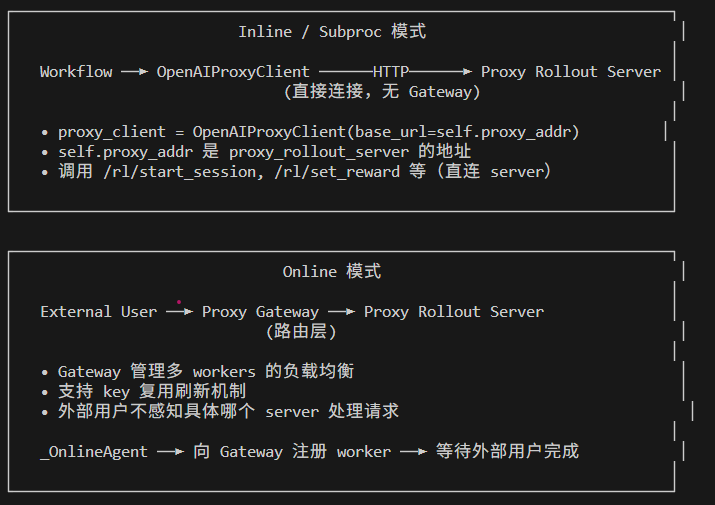

在线模式下，需要启动 proxy\_gateway 来和 server 打交道，因为他需要做一些其余功能。而在常规模式下不需要这么麻烦，只需要一个可复用的 openaiproxyclient 和 server 打交道即可。这是最大区别。

每个 proxy server worker 都绑定了一个 inference engine。

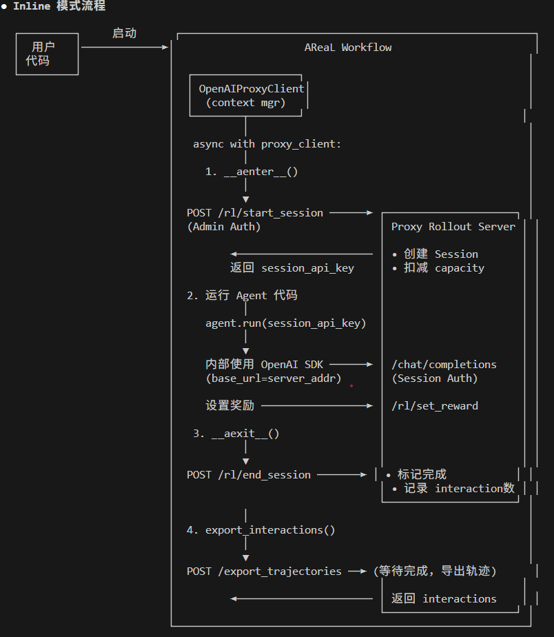

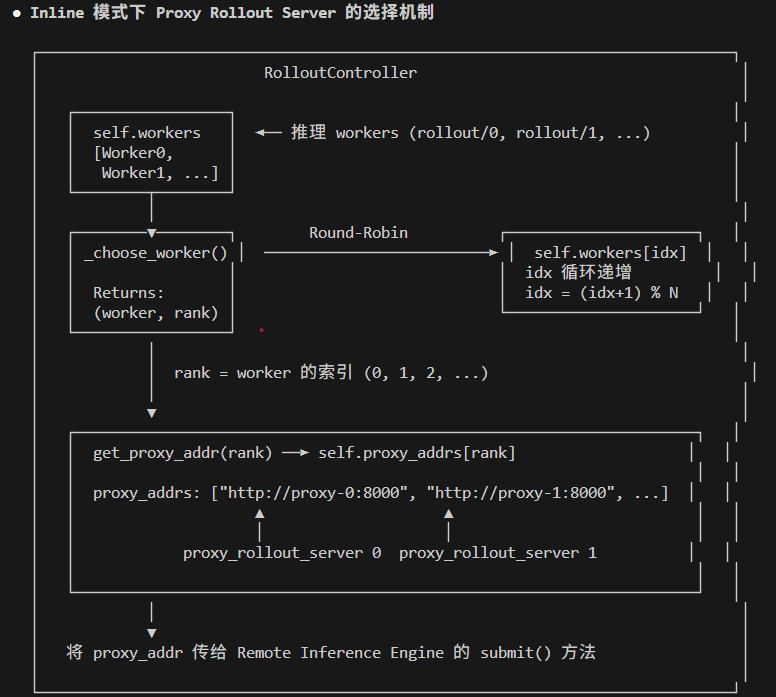

Online 模式

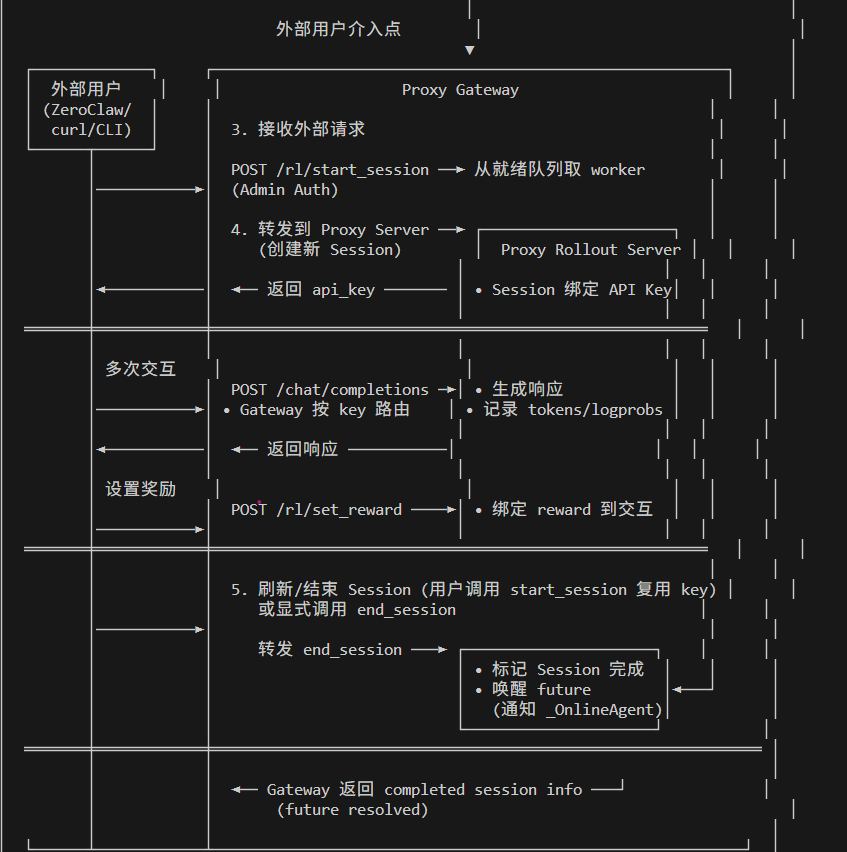

在非 SPMD 模式下，RolloutController 是最外层推理接口。

在支持 OpenAI Proxy  workflow 的场景下（无论 inline 还是 online），RolloutController 都是推理层的最外层控制器，负责调度、管理 proxy workers，以及（online 模式下）启动 Gateway。

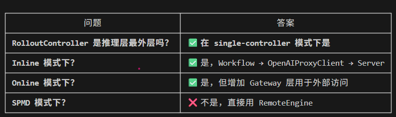


# 常规 RL

自定义 agent，或者有 run 方法的 agent 就行

```Python
class MathAgent:
    async def run(self, data, **extra_kwargs):
        # 可以获取到base_url和 api_key
        # 然后可以执行你自己的任何 agent 代码，不依赖 areal
        http_client = extra_kwargs.get("http_client", None)
        base_url = extra_kwargs.get("base_url", None) or os.getenv("OPENAI_BASE_URL")
        api_key = extra_kwargs.get("api_key", None) or os.getenv("OPENAI_API_KEY")
        # 重要提示：替换 `base_url` 和 `api_key`
        client = AsyncOpenAI(base_url=base_url, api_key=api_key, http_client=http_client, max_retries=0)
        content = data["messages"][-1]["content"]
        run_config = RunConfig(
            model_provider=OpenAIProvider(openai_client=client),
            model="default",  # 不需要传递
            tracing_disabled=True,
        )
        agent = Agent(
            name="RLVR Math with Calculator",
            instructions="Answer the user's math questions using the available calculator tools. Don't give the answer directly, you must use tools to do the mathematical calculation.",
            tools=[add, multiply],
        )
        session = SQLiteSession("math")
        result = await OpenAIRunner.run(
            agent, input=content, session=session, run_config=run_config
        )
        # 返回奖励
        return math_reward_fn(completions=result.final_output, answer=data["answer"])
```

# 在线 RL\- OpenClaw

```Python
loop.create_future()
    │
    ├─→ entry.future ──→ ready_workers 队列
    │                         │
    │                    start_session 消费
    │                         │
    │                    route.pending_future ──→ end_session 调用 set_result()
    │                                                    │
    └─── wait_for_session 的 await 在这里返回 ←──────────┘
```

```Python
prepare_batch()
    │
    ├─ 从 dataloader 取出 batch_size 条 prompts
    │     online 模式下 dataloader 是 _EmptyDataLoader，yield 空 dict
    │
    ├─ 对每条 prompt 调用 rollout.submit(item, workflow, ...)
    │     └─ 提交给线程池异步执行 OpenAIProxyWorkflow.arun_episode()
    │
    └─ rollout.wait(batch_size, timeout=None)  ← 真正的阻塞点
          └─ 等待所有 arun_episode() 完成
                └─ 每个 arun_episode 在等 _OnlineAgent 的 future
                      └─ future 等外部用户调用 start_session refresh
```

```Python
训练主循环（阻塞）
    │
    └─ prepare_batch 阻塞
          │
          ├─ submit × batch_size 个并发 arun_episode
          │     每个都在等 future（等人类 refresh session）
          │
          └─ wait() 等所有 future 完成
                │
                外部用户不断调用：
                python start_session.py --api-key xxx
                    └─ resolve future → 一个 arun_episode 完成
                    └─ 再次 start_session → 下一个 future 进入等待
                │
                直到 batch_size 个 future 全部 resolve
                    └─ prepare_batch 返回
                    └─ 训练继续（PPO update, weight update...）
                    └─ 下一次 prepare_batch 再次阻塞
```

```Python
Gateway 调用 POST /export_trajectories
    └── export_trajectories()  ← 此文件
          └── session_data.export_interactions()  ← server.py 里的 SessionData
                └── serialize_interactions()       ← server.py
                      └── HTTP 返回给 Gateway
                            └── Gateway 传给 RL 训练流水线
```

单用户和 openclaw 对话时候，如果开启第二次 seesion进行对话，假设第一次对话时候修改了 mem 内存系统，第二次对话不会受到影响吗？这时候当前独立轨迹训练没有问题吗？

ZeroClaw 这类 Agent 有**外部状态**（memory、文件系统、工具状态等），而 AReaL 的 proxy 只记录 **LLM 的输入输出**，完全不感知外部状态。

```SQL
episode 1:
    turn1: [user: "记住我叫张三"] → LLM → "好的，我记住了"
    turn2: [user, 回复] → LLM → "你好张三"
    ← memory 系统写入 "name=张三"

episode 2（refresh 后）:
    turn1: [user: "我叫什么"] → LLM → "你叫张三"  ← memory 仍然存在！
```

**proxy 记录的轨迹**：

```YAML
# episode 2 turn1 的训练样本
{
    messages: [{"role": "user", "content": "我叫什么"}],
    output: "你叫张三",
    log_probs: [...],
    reward: 0.8,
}
```

训练时 reference model 重算 log\-probs 时，看到的是**干净的单轮输入**，但实际推理时 LLM 的回答依赖了 memory，**两者语义不一致**。


问题

```SQL
实际推理：LLM + memory("name=张三") → "你叫张三"
训练样本：[user: "我叫什么"] → "你叫张三"

reference model 重算时：
    看到 [user: "我叫什么"] → 认为"你叫张三"概率很低
    → KL divergence 虚高
    → 训练信号错误
```

从代码结构来看，**AReaL 没有处理这个问题**，它假设：

> **Disclaimer**: RL\-finetuned models may exhibit unexpected behaviors\. Please ensure strict permission rules and an **isolated execution environment** for your agent runtime\.
> 
> 

"isolated execution environment" 就是在暗示这个问题。

如果要避免：

```Python
start_session（开启新 episode）
    └─ ZeroClaw 侧需要：
          ├─ 清空 memory 系统
          ├─ 重置工具状态
          ├─ 恢复文件系统快照（如用 Docker/sandbox）
          └─ 重新加载初始 context
```

openclaw demo 是**演示用途**，现实中做 agentic RL 必须在 episode 边界做彻底的环境重置，这是 AReaL 框架之外需要用户自己保证的。

# Agent Workflow

https://inclusionai\.github\.io/AReaL/zh/tutorial/agentic\_rl\.html

他的 agent 支持比较完善。


Workflow 是工作进程实时初始化的，一次 rollout 中假设 batch 是 100，那么会实时初始化 100 个，每个 workflow 会实时初始化 1 个 agent。

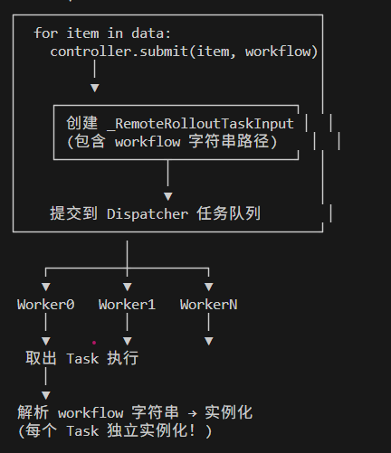

为了方便 agent 运行，areal 对外暴露的是标准的 openai 服务，也就是会告诉 agent 框架 OPENAI\_BASE\_URL 和 OPENAI\_API\_KEY。

以下是一个标准的 agent 运行过程。

```Python
from camel.agents import ChatAgent
from areal.experimental.camel.openai_model import AReaLOpenAICompatibleModel
from areal.experimental.openai import ArealOpenAI

# 创建 AReaL 的 OpenAI 兼容客户端
client = ArealOpenAI(engine=engine, tokenizer=tokenizer)

# 将模型替换为 AReaL 的 OpenAI 兼容模型
agent = ChatAgent(
    system_message="You are a helpful math assistant.",
    model=AReaLOpenAICompatibleModel(
        openai_client=client,
        tokenizer=tokenizer,
        model_type="areal"
    )
)

# 现在客户端（ArealOpenAI）会记录 token 级别的信息
response = await agent.astep("Solve: 2 + 2 = ?")
```

这个的缺点是： 无法做到不修改 agent 代码就可以进行训练。还是需要实现 AReaLOpenAICompatibleModel，并且修改 agent 代码才能正确初始化。只不过由于提供了 OPENAI\_BASE\_URL, 对于 agent 的改动比较小而已。

#### 三进程架构

为啥需要 rpc server？

原因是为了通用， areal 可以脱离 ray 独立使用，可以用 Local/Slurm/Ray。如果是纯粹基于 ray 的方案，则不需要这个 flask rpc server。

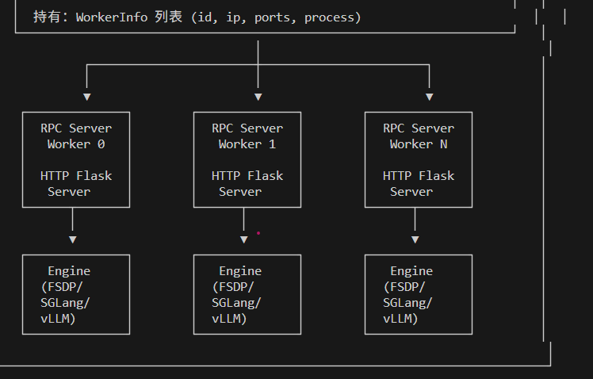


rpc server 和 proxy rollout server 的联系。反正是 1:1 的。

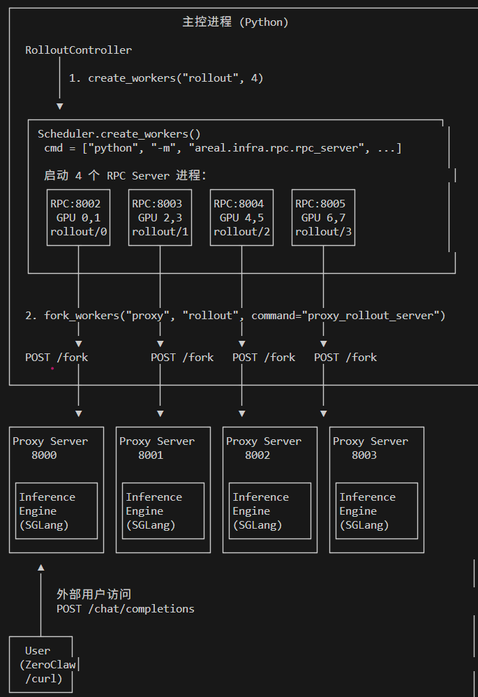

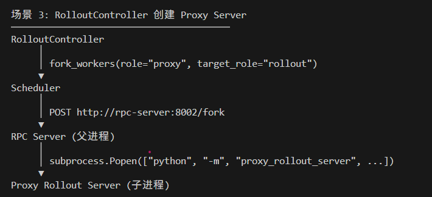

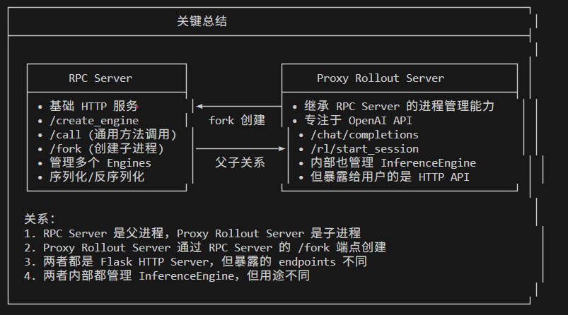


```Python
控制器进程              工作进程（RPC 服务器）         GPU 进程
──────────────────      ───────────────────────────    ───────────
RolloutController       Flask HTTP 服务器（CPU）        SGLang/vLLM
    │                          │                          │
    └─> BatchTaskDispatcher /call 端点                  推理
       （后台线程）               │                          引擎
            │                   └─> 引擎线程                │
            ├─ 提交任务 1           └─> RemoteInfEngine    │
            │  （HTTP POST）            └─> submit() ──────>│
            │                                              生成
            ├─ 提交任务 2                                   token
            │  （HTTP POST）
            │
            ├─ 提交任务 3              HTTP 回调  <──────────┘
            │                        （轨迹）
            │              ┌─────────────┘
            └─ 收集  <──────┘

与此同时（在不同的 GPU 上）...
TrainController           训练工作进程
    │                          │
    └─> ppo_update(batch) ────> 前向/反向

关键：生成和训练在不同 GPU 上同时进行
```


https://inclusionai\.github\.io/AReaL/zh/tutorial/gsm8k\_grpo\.html\#id10

#### 三个并发级别

**级别 1 \- 控制器线程**： [**`BatchTaskDispatcher`**](https://github.com/inclusionAI/AReaL/blob/main/areal/core/workflow_executor.py) 在后台线程中运行，通过 HTTP 持续向工作进程提交 rollout 请求：

- 轮流向 rollout 工作进程提交任务

- 维护 2 个或更多批次inflight 请求以隐藏延迟

- 非阻塞：立即返回 task\_id

因此，**在 AReaL 中 rollout 和训练同时进行**，尽管代码看起来像是同步编排。

**级别 2 \- 工作进程 RPC 服务器**：每个 rollout 工作进程在 **CPU** 上运行 Flask HTTP 服务器 （[**`rpc_server.py`**](https://github.com/inclusionAI/AReaL/blob/main/areal/infra/rpc/rpc_server.py)）：

- 接受并发 HTTP 请求（多线程 Flask）

- **引擎线程**：串行处理引擎操作（NCCL 兼容性）

- 将请求路由到 `RemoteInfEngine`，后者将工作排队到 SGLang/vLLM

**级别 3 \- GPU 子进程**：SGLang/vLLM 作为 **独立子进程在 GPU** 上运行：

- 通过 `backend.launch_server()` 启动（与 RPC 服务器分开）

- 维护自己的请求队列

- 通过连续批处理处理多个并发生成

- 轨迹完成时发送 HTTP 回调

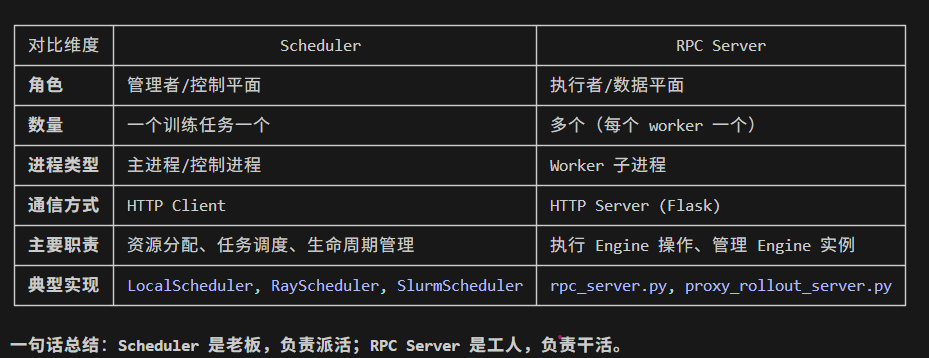

Rpc server 就是我们常说的 worker。每个 worker 都绑定一个推理引擎，注意和 proxy rollout server 区别。


#### 请求流程

```Python
# 1. 控制器调用 prepare_batch
batch = rollout.prepare_batch(
    dataloader,
    workflow="areal.workflow.rlvr.RLVRWorkflow",
    workflow_kwargs=workflow_kwargs,
)

# 2. RolloutController 委托给 BatchTaskDispatcher
# 后台线程提交任务：
for data in dataloader:
    task = _RemoteRolloutTaskInput(data, workflow, workflow_kwargs, task_id)
    dispatcher.submit_task_input(task)  # 非阻塞 HTTP POST

# 3. 工作进程 RPC 服务器接收 HTTP POST /call (method="submit")
# 引擎线程执行：
workflow_instance = import_from_string(workflow)(**workflow_kwargs)
task_id = workflow_executor.submit(data, workflow_instance)
# 立即返回（非阻塞）

# 4. WorkflowExecutor（在工作进程上）在后台运行：
result = await workflow_instance.arun_episode(engine, data)
# 发送 HTTP 回调给控制器，包含轨迹

# 5. 控制器收集结果
# BatchTaskDispatcher 等待 batch_size 个已接受的轨迹
results = dispatcher.wait_results(batch_size)
return concat_padded_tensors(results)  # 形状：[batch_size, seq_len]
```

**过期管理**： [**`StalenessManager`**](https://github.com/inclusionAI/AReaL/blob/main/areal/infra/staleness_manager.py) 限制并发 inflight 请求：

- `max_concurrent_rollouts`：最大 inflight 轨迹数

- `max_head_offpolicyness`：拒绝使用太旧权重生成的样本

- 版本跟踪：每个 token 标记生成时使用的模型版本

## BatchTaskDispatcher 

也是通用模块，和 areal 无关。


它是一个**泛型异步任务调度器**，负责：

- 从输入队列持续提交任务

- 控制并发（staleness 限制）

- 收集结果并通知等待方

```Python
主线程                    后台线程
──────────────────        ──────────────────────────────────────
submit_task_input()       _commit_loop（Producer）
    │                         │ _get_next_task_for_submission()
    └─> _pending_inputs ──────┤ task_factory(input)
        (deque)               └─> runner.submit(task_fn)
                                        │
wait_results()            _fetch_loop（Consumer）
    │                         │ runner.wait(...)
    └─ _pending_results <──────┘
       (dict)
```

和 rolloutcontroller 共进程，他只是在里面开了一个后台线程。

```Python
WorkflowExecutor（业务层）
    │ 封装 AReaL 特定逻辑
    │ - trajectory 格式检查
    │ - staleness 管理初始化
    │ - dump_trajectory
    ▼
BatchTaskDispatcher（通用调度层）
    │ 纯调度，不感知业务
    ▼
AsyncTaskRunner（执行层）
    │ **asyncio event loop**
    ▼
workflow.arun_episode()（用户代码）
```

```Python
控制器进程（RolloutController 所在）
├── 主线程
│   ├── prepare_batch() / wait_results()
│   └── PPOTrainer 训练循环
│
├── BatchTaskDispatcher._commit_loop（后台线程 1 - Producer）
│   └── 从 _pending_inputs 取任务 → submit 到 AsyncTaskRunner
│
├── BatchTaskDispatcher._fetch_loop（后台线程 2 - Consumer）
│   └── 从 AsyncTaskRunner 收结果 → 存入 _pending_results
│
└── AsyncTaskRunner（内部有一个 asyncio event loop 线程）
    └── 真正执行 arun_episode 协程
            │
            │ HTTP 请求
            ▼
工作进程（Flask RPC Server）← 独立进程，不同机器
    └── SGLang/vLLM ← GPU 进程
```

```Python
self._dispatcher = BatchTaskDispatcher[
    _RemoteRolloutTaskInput, _RemoteRolloutResult
](
    max_queue_size=qsize,
    task_factory=self._create_submit_callback, 真正做事对象
    staleness_manager=self._staleness_manager,
    enable_tracing=self.config.enable_rollout_tracing,
)
# Initialize the dispatcher's async task runner
self._dispatcher.initialize(logger=logger)
```


## AsyncTaskRunner

AsyncTaskRunner 是**纯通用组件**，完全不感知 AReaL 业务逻辑，可以独立测试和复用。

它是一个**通用的异步任务执行器**，核心思路是：**用一个后台线程跑 uvloop event loop，主线程通过线程安全队列与之通信**。

```Python
主线程（外部调用者）
├── submit(async_fn, *args, task_id=N)  → input_queue.put()
└── wait(count=N)                       ← output_queue.get()

后台线程（_run_thread）
└── uvloop event loop
    └── _run_async_loop()
        ├── _drain_pending_inputs()     ← input_queue.get_nowait()
        ├── asyncio.wait(running_tasks) → 并发执行所有协程
        └── output_queue.put(result)    → 结果送回主线程
```

```Bash
while not exiting:
    if paused:
        sleep; continue

    _drain_pending_inputs(running_tasks)  # 1. 把队列里的任务全部创建成 asyncio.Task

    if not running_tasks:
        await _wait_for_new_tasks()       # 2. 没任务就等信号，避免 busy-wait
        continue

    done, _ = await asyncio.wait(         # 3. 等任意一个完成（50ms 超时）
        tasks, timeout=0.05,
        return_when=FIRST_COMPLETED
    )

    for task in done:                     # 4. 收割结果，放入 output_queue
        output_queue.put(TimedResult(...))
```

### 跨线程唤醒机制

```Python
# 主线程 submit() 后唤醒 event loop
def _signal_new_input(self):
    loop.call_soon_threadsafe(input_event.set)  # 线程安全地在 event loop 里 set event

# event loop 里等待
async def _wait_for_new_tasks(self):
    self._input_event.clear()
    if self.input_queue.qsize() > 0:  # double-check，防竞态
        return
    await self._input_event.wait()    # 真正挂起，直到 signal
```

```Python
BatchTaskDispatcher                    AsyncTaskRunner
────────────────────                   ───────────────
_commit_loop ──── runner.submit() ──→  input_queue
_fetch_loop  ←─── runner.wait()  ←──  output_queue

BatchTaskDispatcher 负责：            AsyncTaskRunner 负责：
- staleness 检查                      - 纯异步执行
- task_factory 包装                   - 队列管理
- _pending_inputs 业务队列            - pause/resume
- 结果 dispatch 给调用方              - 健康监控
```

```Python
import asyncio
runner = AsyncTaskRunner[int](max_queue_size=100)
runner.initialize()
async def compute(x: int) -> int:
    await asyncio.sleep(0.1)
    return x * 2
# Submit tasks
for i in range(5):
    runner.submit(compute, i)
# Wait for results
results = runner.wait(count=5)
print(results)  # [0, 2, 4, 6, 8] (order may vary)
runner.destroy()
```

```Python
task_fn = self.task_factory(task_input)
try:
    self.runner.submit(task_fn, task_id=task_input.task_id)
    self.staleness_manager.on_rollout_submitted()
```

## 代理工作流

https://inclusionai\.github\.io/AReaL/zh/reference/agent\_workflow\.html

代理工作流允许使用流行的代理框架（OpenAI Agents SDK、CAMEL\-AI、LangChain 等）训练模型，而无需修改其核心逻辑。AReaL 自动捕获 RL 训练所需的 token 级别信息，同时保留代理的原始行为。

主要优势：

- **灵活性**：支持任何使用 OpenAI/Anthropic 消息协议的框架

- **统一开发**：基准测试、评估和 RL 训练使用相同代码

- **算法正确性**：Token 级别跟踪避免训练\-推理不匹配

挑战在于代理框架通过不暴露 token ID 和对数概率的高级 API 与 LLM 交互。AReaL 通过以下方式解决此问题：

1. **拦截 LLM 调用**通过代理服务器或直接客户端

2. **跟踪 token 级别数据**在 `InteractionCache` 中

3. **构建对话树**用于多轮奖励传播

4. **导出训练就绪的张量**并正确归因奖励

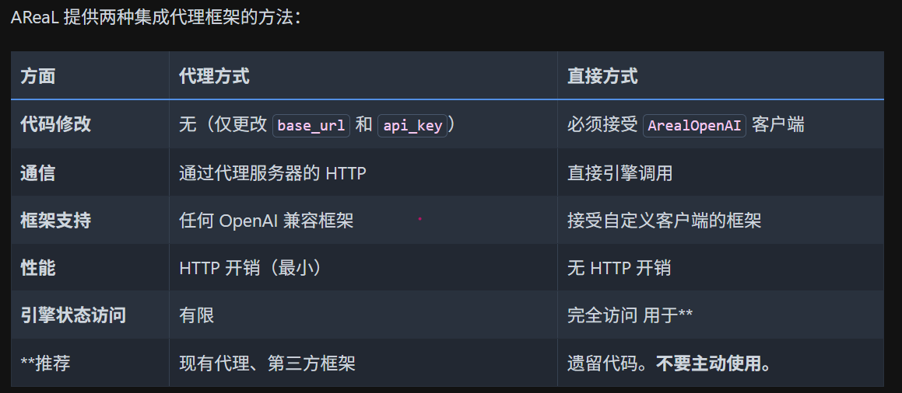

现在官方已经全面转换为代理方式了，不直接修改 agent 代码。


代理方式使代理代码独立于 AReaL。您的代理使用标准的 OpenAI/Anthropic 消息协议，指向 AReaL 代理服务器的定制 `base_url`


**遗留模式**：使用 `ArealOpenAI` 和 `RolloutWorkflow` 的直接方式被视为遗留方式，不应用于新项目。请优先使用上述代理方式，使代理代码独立于 AReaL 内部实现。


核心是说一定要让agent 代码独立于 areal，不绑定 areal 任务代码和类。 


推荐写法：

```Python
class MyAgent:
    async def run(self, data, **extra_kwargs):
        # AReaL 注入这些 kwargs
        http_client = extra_kwargs.get("http_client")
        base_url = extra_kwargs.get("base_url") or os.getenv("OPENAI_BASE_URL")
        api_key = extra_kwargs.get("api_key") or os.getenv("OPENAI_API_KEY")

        # 标准 OpenAI SDK 使用方式
        client = AsyncOpenAI(
            base_url=base_url,
            api_key=api_key,
            http_client=http_client,
            max_retries=0,
        )

        response = await client.chat.completions.create(
            model="default",
            messages=data["messages"],
        )

        # 返回奖励（float）或奖励字典
        return compute_reward(response, data["answer"])
```

不推荐写法：

```Python
from areal.experimental.openai import ArealOpenAI

class MyWorkflow(RolloutWorkflow):
    async def arun_episode(self, engine, data):
        # 创建绑定到引擎的客户端
        client = ArealOpenAI(engine=engine, tokenizer=self.tokenizer)

        # 像标准 OpenAI 客户端一样使用
        response = await client.chat.completions.create(
            model="default",
            messages=data["messages"],
        )

        # 设置奖励并导出
        reward = compute_reward(response, data["answer"])
        client.set_last_reward(reward)
        client.apply_reward_discount(turn_discount=0.9)

        return client.export_interactions(style="individual")
```

### 架构

https://inclusionai\.github\.io/AReaL/zh/reference/agent\_workflow\.html\#id9

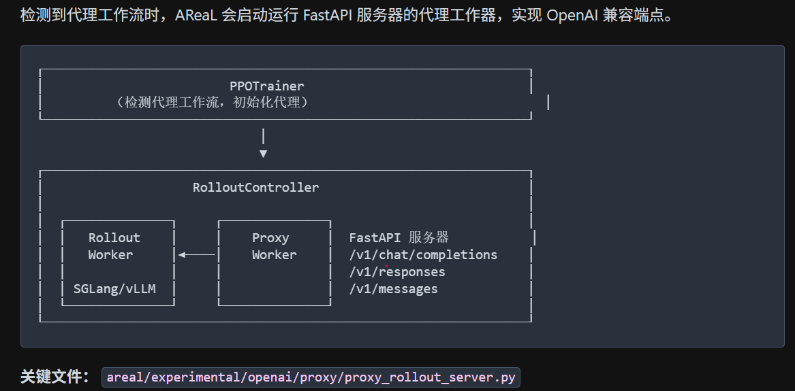

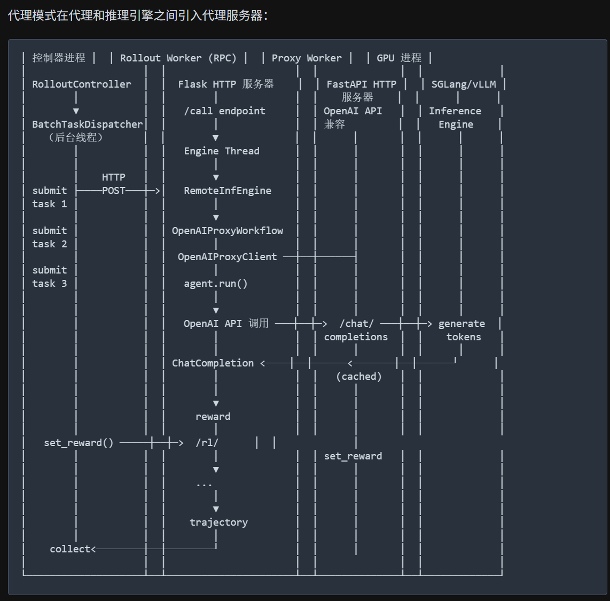

## ArealOpenAI

无需走网络，属于废弃用法。只是模拟了 openai 对外访问接口，实际上内部代码都重写了，不走 http 服务。

**ArealOpenAI 是为"agent 代码和推理引擎在同一进程"场景设计的，完全绕过网络层，性能更高但灵活性较低（agent 代码必须依赖 AReaL）**

```Plain Text
response: ChatCompletion = await client.chat.completions.create(
                messages=messages,
                **self.gconfig.to_openai_args_dict(),
   )   
message = response.choices[0].message
```

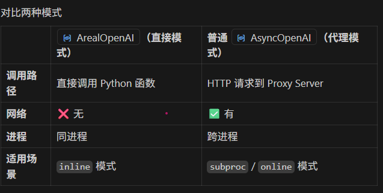

```Plain Text
ArealOpenAI（直接模式）：无需 http 访问
agent.run()
  └── client.chat.completions.create()
        └── AsyncCompletionsWithReward.create()
              └── self.engine.agenerate()     ← 直接 Python 调用
                    └── SGLang Python API
                          └── GPU

普通 AsyncOpenAI + Proxy（代理模式）：
agent.run()
  └── client.chat.completions.create()
        └── HTTP POST /v1/chat/completions   ← 走网络
              └── Proxy Server
                    └── InteractionCache
                          └── HTTP → SGLang
                                └── GPU
```

## OpenAIProxyClient

这个是用于代替 ArealOpenAI 的，目标是可以无缝接入任何 agent，一行代码都不需要修改。

```Plain Text
OpenAIProxyClient：
─────────────────────────────────────────
arun_episode()
  └── async with OpenAIProxyClient:      ← 管理 session 生命周期
        ├── __aenter__: POST /session/start → 获得 session_id, api_key
        ├── _run_agent(session_api_key)
        │     └── agent.run()
        │           └── AsyncOpenAI(base_url=proxy_addr)  ← 标准 OpenAI 客户端
        │                 └── HTTP POST /v1/chat/completions → Proxy Server
        │                       └── Proxy Server → SGLang
        └── __aexit__: POST /session/end


ArealOpenAI ：
────────────────────────────
arun_episode()
  └── agent.run(http_client=..., base_url=proxy_addr)
        └── ArealOpenAI(engine=engine)   ← 直接持有引擎引用
              └── AsyncCompletionsWithReward.create()
                    ├── engine.agenerate()  ← 无 HTTP，直接调用
                    └── _cache 记录 token 级别数据
```

现在推荐用 OpenAIProxyClient。

```Python
async with aiohttp.ClientSession() as http_session:
    # 一旦初始化一个，就会自动生成一个唯一的 session_id，用于当前轨迹
    proxy_client = OpenAIProxyClient(
        session=http_session,
        base_url="http://localhost:8000", # 这个实际上来自 gateway
        task_id="task-1",
        admin_api_key="my-admin-key",
    )
    async with proxy_client:
        # Session API key is available for agents
        api_key = proxy_client.session_api_key
        # 运行 agent 代码
        await **proxy_client.set_last_reward**(1.0)
    # After context exit, export interactions
    interactions = await proxy_client.export_interactions()
```

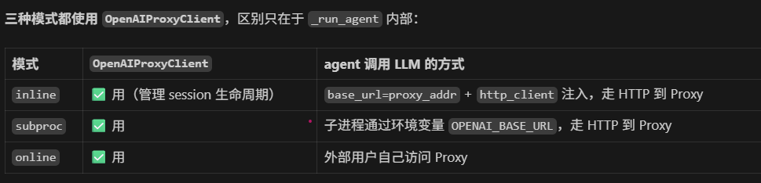

OpenAIProxyClient 这个类的功能是：基于外部传入或者实时获取的 base url，发送各类 http 请求

- set\_reward

- export\_interactions

类似于一个 http 中转代理，内部需要 session\_id 来区分当前是哪条轨迹。

除了上述两个方法外，还有额外的重要上下文方法

```Python
async def __aenter__(self) -> OpenAIProxyClient:
        """Start the RL session via HTTP request."""
        # 发送 srtat_session 请求，得到当前 OpenAIProxyClient 实例的 session_id
        # 才能发送后续接口，否则无法区分轨迹
        data = await _start_session(
            self._session,
            url=f"{self.base_url}{RL_START_SESSION_PATHNAME}",
            payload=StartSessionRequest(task_id=self.task_id),
            headers=self._admin_auth_headers(),
        )
        self.session_id = data["session_id"]
        self._session_api_key = data["api_key"]
        return self

    async def __aexit__(
        self,
        exc_type: type[BaseException] | None,
        exc_val: BaseException | None,
        exc_tb: TracebackType | None,
    ):
        """End the RL session via HTTP request.

        Always attempts to end the session, even on exception, to avoid
        leaving zombie sessions on the server.
        """
        if self.session_id is None:
            return  # Session was never started
         
        # 结束当前轨迹，可以保存了
        # Always try to end the session, even on exception
        try:
            await post_json_with_retry(
                self._session,
                url=f"{self.base_url}{RL_END_SESSION_PATHNAME}",
                headers=self._session_auth_headers(),
            )
        except Exception as e:
            # Raised errors will be properly handled by OpenAIProxyWorkflow
            logger.warning(f"Failed to end session {self.session_id}: {e}")
            raise
```

## **Agent 执行模式**

AReaL 支持两种执行模式，通过 `rollout.openai.mode` 配置：

### **Inline 模式（默认）**

Agent 与 rollout 工作进程在同一进程中运行。推荐用于大多数场景。

```YAML
rollout:
  openai:
    mode: inline
```

**要求**：

- `run` 方法必须是 `async`

- 使用 `extra_kwargs["base_url"]` 进行 LLM 调用

- 可选择使用 `extra_kwargs["http_client"]` 来减少开销

**优势**：

- 无序列化开销

- 直接访问共享 HTTP 客户端，也就是可以共享 aiohttp\.ClientSession TCP 连接池

- 更低的延迟

### **Subprocess 模式**

Agent 在单独进程池中运行。当您的 Agent 代码不兼容 async 或使用与主进程冲突的库时，使用此模式。

```YAML
rollout:
  openai:
    mode: subproc
    subproc_max_workers: 4  # Process pool size
```

**要求**：

- Agent 类必须是可 pickle（可序列化）的

- 从环境变量而不是 `extra_kwargs` 读取 `OPENAI_BASE_URL`

**示例**：

```Python
import os
from openai import OpenAI  # Sync client is OK

class MySyncAgent:
    async def run(self, data, **extra_kwargs):
        # In subproc mode, base_url and api_key come from environment
        client = OpenAI(
            base_url=os.getenv("OPENAI_BASE_URL"),
            api_key=os.getenv("OPENAI_API_KEY"),
            api_key="DUMMY",  # Not used by AReaL
        )

        response = client.chat.completions.create(
            model="default",
            messages=data["messages"],
        )

        return compute_reward(response, data["answer"])
```

**注意**：即使在子进程模式下，方法签名仍然是 \`async def run\(\.\.\.\)\`，但 AReaL 会在内部用 \`asyncio\.run\(\)\`

包装调用。您可以在方法内部使用同步代码。

**权衡**：

- Agent 和数据的 pickle 开销

- 无法访问共享 HTTP 客户端

- 每次调用延迟更高

- 适用于非 async 库或进程隔离

## aiohttp\.ClientSession 和 session\_id 

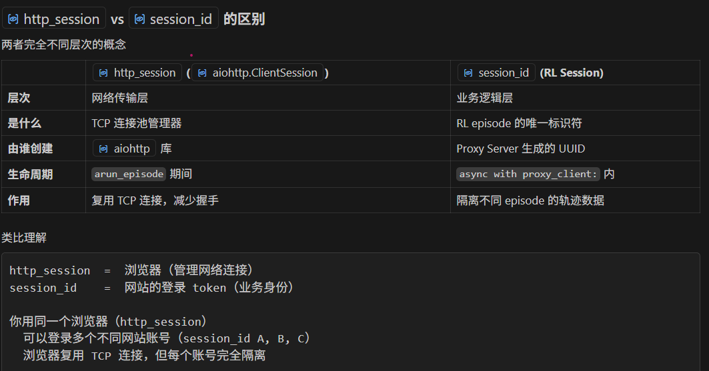

```Python
# http_session：一个连接池，被多个 RL session 共享
async with aiohttp.ClientSession() as http_session:   # 创建连接池

    # RL session 1：用连接池发 HTTP，但 session_id 是独立的
    proxy_client_1 = OpenAIProxyClient(session=http_session, task_id="t1", ...)
    async with proxy_client_1:
        # __aenter__: 用 http_session 发 POST /session/start
        #             server 返回 session_id="uuid-AAA"
        #             所有后续请求 header 带 api_key_AAA
        await proxy_client_1.set_last_reward(1.0)
        # 用 http_session 发 POST /set_reward
        # header: Authorization: Bearer api_key_AAA  ← 标识是哪个 RL session

    # RL session 2：同一个 http_session，但完全不同的 session_id
    proxy_client_2 = OpenAIProxyClient(session=http_session, task_id="t2", ...)
    async with proxy_client_2:
        # session_id="uuid-BBB"，与 AAA 完全隔离
        await proxy_client_2.set_last_reward(0.0)
        # header: Authorization: Bearer api_key_BBB
```

```Plain Text
第一次请求 POST http://proxy:8000/session/start
  http_session: 建立 TCP 连接 proxy:8000 → 放入连接池

第二次请求 POST http://proxy:8000/set_reward
  http_session: 从连接池取出已有 TCP 连接 → 直接发送，无需重新握手 ✓

第三次请求（另一个 proxy_client）POST http://proxy:8000/session/start
  http_session: 继续复用同一个 TCP 连接池 ✓
  但 session_id 是全新的 UUID，业务数据完全隔离
```

http\_session 解决**怎么发 HTTP 请求**（网络层复用），session\_id 解决**发给谁/数据归属哪个 episode**（业务层隔离）。前者是工具，后者是身份。

## AsyncRewardWrapper


