# FSDP 显存分析

# Reduce\-Scatter

对应位置先执行 reduce，然后在均分 split 

假设一共 2 张卡

```Python
*tensor_in = torch.arange(world_size * 2, dtype=torch.int64, device=device)*
*>>> tensor_in*
*tensor([0, 1, 2, 3], device='cuda:0') # Rank 0*
*tensor([0, 1, 2, 3], device='cuda:1') # Rank 1*

*tensor_out = torch.zeros(2, dtype=torch.int64, device=device)*

*dist.reduce_scatter_tensor(tensor_out, tensor_in)*

*>>> tensor_out*
*tensor([0, 2], device='cuda:0') # Rank 0*
*tensor([4, 6], device='cuda:1') # Rank 1*
```

假设输入 shape 是 \(4,\) 先对每张卡上对应位置数值相加，得到 \(4,\)，然后均匀切分到 2 张卡上，每张卡上得到 \(2,\)

相比于 all\-reduce，通信量减少 world\-size 倍。

# 1 纯 FSDP 分析

## 案例1\-naive 切分

https://github\.com/hhaAndroid/awesome\-mm\-chat/blob/main/fsdp/fsdp\_mlp\_profile\.py

```SQL
FSDPMLPForCausalLM(
  (embed_tokens): Embedding(4096, 2048, padding_idx=0)
  (layers): ModuleList(
    (0-5): 6 x FSDPMLPDecoderLayer(
      (up_proj): Linear(in_features=2048, out_features=8192, bias=False)
      (down_proj): Linear(in_features=8192, out_features=2048, bias=False)
    )
  )
  (lm_head): Linear(in_features=2048, out_features=4096, bias=False)
)
```

模型参数个数是 4096x2048x2\+6x\(2048x8192\)x2=218103808=208M


Model 本身是在 meta 上面初始化，因此显存占用为0, 在 fsdp 切分后

```SQL
model.to_empty(device='cuda')
with torch.no_grad():
    model.init_weights()
model.train()
```

这个地方才开始分配显存。本身模型参数个数是 208M，FP32 的话，应该要乘以 4，但是由于 world\_size=4，正好切分为 4 份，所以每张卡上一开始分配的显存就是 208M

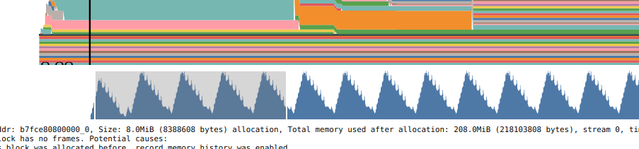


接下来运行

```SQL
requried_grad_params = [
    param for param in model.parameters() if param.requires_grad
]
optimizer = AdamW(
    requried_grad_params,
    lr=1e-5,
    weight_decay=0,
    betas=(0.9, 0.95))
```

不过由于优化器是 lazy 初始化，所以这个地方实际上没有显存分配。在第一次运行 optimizer\.step 时候才真的分配显存。


对于 adamw 而言，优化器所占显存为 参数个数x12/world\_size=208x12/4=624M

然后才是进入 fsdp forward 阶段。


- 首先 all\-gather embediing\+lm\_head，一共 2048x4096x2x2=3325952=32M

- 因为上述两个模块是放到一个 fsdp module 里面因此是一起打包通信，但是 all\-gather 完成后需要映射到每个参数本身，才能进行后续模块计算，因此接下来是两个模块的 foreach\_all\_gather\_copy\_out 操作，都是 16M


- 因此实际上对于峰值显存来说，实际上会同时存在两个 32M 的显存占用。

- All\-gather 参数后开始进行 embeding 计算，计算后输出 hidden\-state，显存为 16384x2048x2=64M

- 开始进行第一层计算，计算前需要先进行 all\-gather，一层的参数个数为 33554432，因此 all\-gather 通信的占用为 64M，每个层里面是 2 个 linear 层，因此还需要额外的 foreach\_all\_gather\_copy\_out，两个 32M


- 然后才是对两个 linear 层进行顺序计算，对于第一个 linear 层，16384x2048 X 2048x4096，所占激活值为 16384x4096x2x2=256M，第二个 linear 是 16384x2048x2x2=64M

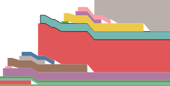

特别注意：在每一层 all\-gather 前，有一个非常小的 16M 的 all\-gather，时间非常短，如上图的橙色和绿色。原则上不应该存在，实际上这是因为用的 all\-gather 是 foreach all\-gather 有优化

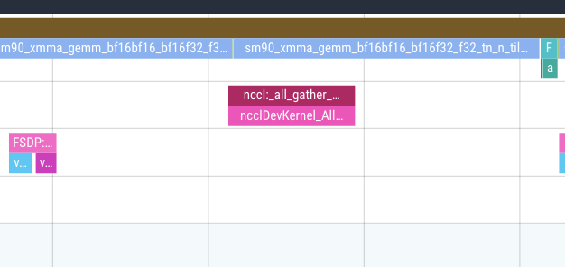

从上图可以看出，每一次 all\-gather 包括 3 个流，实际上也是包括 3 个阶段，第一阶段是一个非常规的 copy 流的 all\-gather，然后是一个常规的 all\-gather，这个是通信流；最后在默认流上执行 copy\_out 操作。

对应到 mem profile 图上，就是一次 all\-gather 有 4 条线：

- 橙色短的是 copy in 显存 16M\(\_get\_param\_all\_gather\_inputs\.\_*foreach\_copy*\)，这个 16M 是单卡的参数量所占显存 2048x8192x2x2/world\-size=16M

- 然后是咖啡色的通信 all\-gather 流，是 64M

- 最后是因为两个模块，所以是2个 copy out，每个是 32M

所以 fsdp 实现时候，一次 all\-gather 实际上对应 3 次操作，2次是通信，一次是 copy out。


- 然后开始计算下一层，算法也是一样。注意由于没有开启 checkpoint，因此每一层的输出都需要缓存到 backward 阶段。也就是说 embeding 输出的 64M, layer 里面的 2 个 linear 输出也要缓存

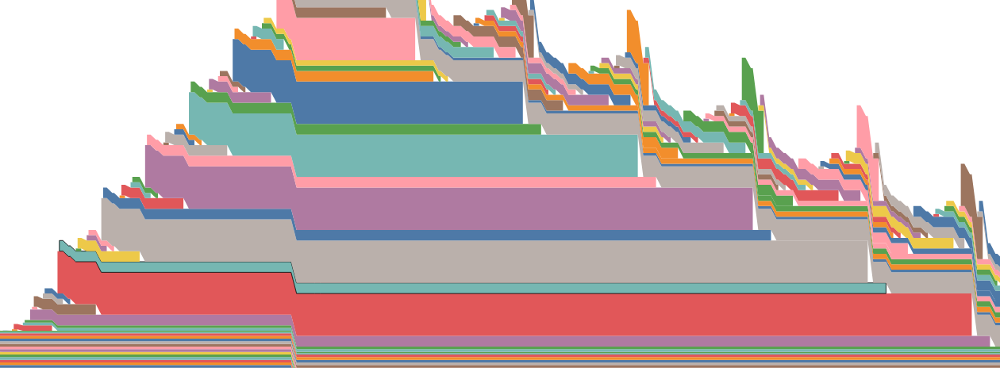

从上图可以看出，layer 输出的值会一直缓存到当前层 backward 完成才释放。

- 最后一个 layer 都算完后开始计算 lm\_head，因此提前已经 all\-gather 好了因此直接算即可 16384x4096x2=128M

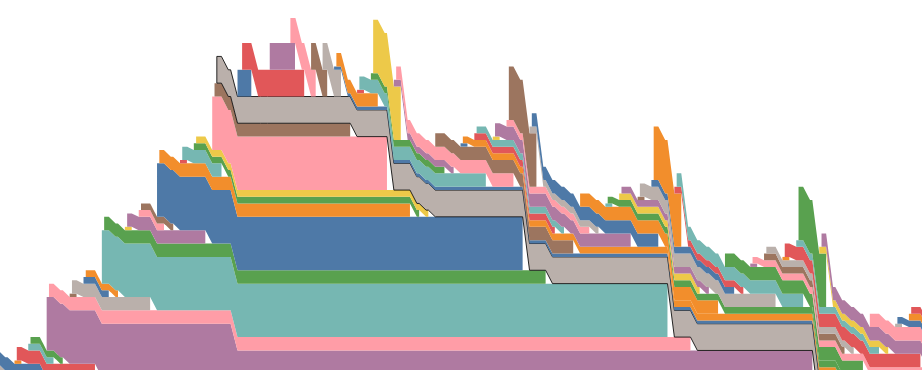

- 然后开始进行 loss 计算，ce loss 实现时候，在 forward 和 backward 中，峰值显存会占据 3 份，也就是 128x3=384M,这个实际上是非常多的。


- 蓝色的块 128 m 是 contiguous 操作导致的重新分配显存；红色的快 128M 是 ce loss forward 计算中的显存；紫色快 128m 是 NllLossBackward0 算需要的；橙色块 128m 是 LogSoftmaxBackward0 所需要的。因此从峰值显存来看，一共有 3 个。

- 后面两个类似菱形是 SliceBackward0，因为我们在 foward 时候有额外的 slice 操作。不过因为此时已经不是峰值显存了，所以还好。

- 后续开始就是 lm\_head 和 layer 的 backward 了。

- lm\_head 的 backward 需要算2个，一个是输入的梯度，一个是参数的梯度； lm\_head 本身参数是 2048x4096x2=16M，因此对参数求梯度需要 16M\(梯度和参数是绑定的，直到 optimizer\.step 后才能释放，所以蓝色线一直在\)，对输入 16384x2048x2 =64M 求梯度需要 64M。下图中的蓝色和橙色块

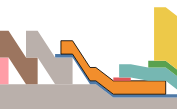

- 如下图所示，橙色块是倒数第一层的 backward 第一个 op，**淡蓝色是提前 all\-gather 前一层的参数**，一共 64M，因为倒数第一层没有释放参数，所以可以直接算，绿色黄色紫色和粉色是 layer 里面的 2 个线性层对输入和参数进行backward的显存。黄色处即为本程序的最大峰值显存，绿色是对参数计算梯度，黄色是对输入计算梯度

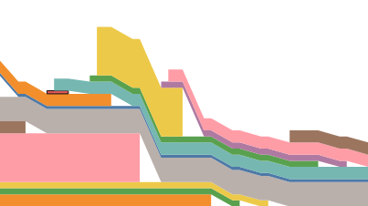

- 最后一层的backward 计算完成后，在开始下一层 backward 计算前，需要对当前层的梯度进行 reduce\-scatter,如下图所示。**2048x8192x2x2=64M **

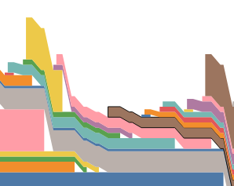

- 和 foreach all\-gather 一样，foreach reduce 也分成了 3 个步骤，对应上图的咖啡色\+蓝色\+橙色，其中咖啡色是参数的 reduce\-scatter，显存是 64M，蓝色的是 提前需要的 16M，橙色的才是核心是被切分后的包括参数和梯度的显存即为 16x2=32M。橙色线要等到 optimizer\.step 后才能释放显示。

- 后续的红色和淡蓝色是当前层 all\-gather copy out，因为在之前就已经 all\-gather 好了，现在要开始 copy out，任何才能算当前层的梯度

- 然后在开始算当前层之前还需要提取 all\-gather下一层的参数，因此后续就是 all\-gather部分。


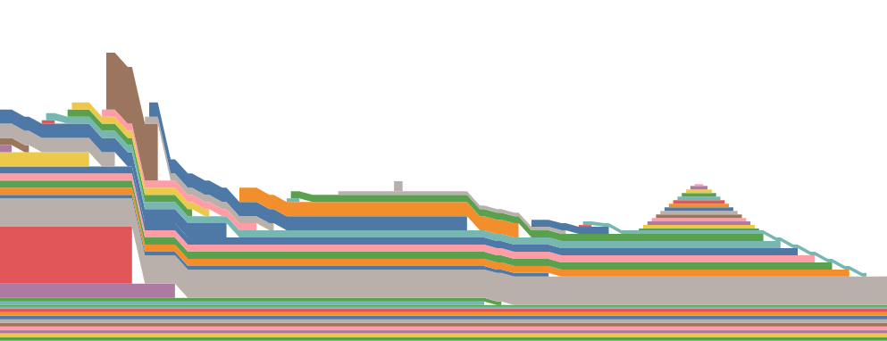

在所有层都算完后，然后是 embeding 的梯度计算，最后是 optimzier\.step，最后是调用了 zero\_grad,中间缓存的变量都开始销毁。


完整图如下所示：

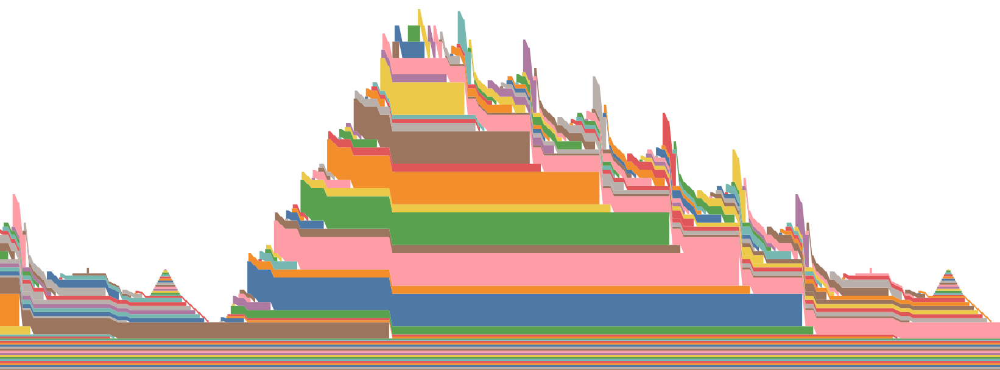

最大峰值显存是 3\.2g

- 切分后模型本身所占显存 208Mx4/world\_size=208M

- 优化器本身所占显存 参数个数x12/world\_size=208x12/4=624M

- Backward 所需要的中间缓存

    - **由于fsdp规则缘故，embeding 和 lm head 聚合后参数无法快速释放 2048x4096x2x2=****32M**

    - embeding 输出缓存\(用于计算梯度\)= 16384x2048x2=64M

    - **6 个 layer 的所有输出= \(16384x8192x2\+ 16384x2048x2\)x6=\(256Mx6\+64Mx5\)=****1856M**

    - **最后一层由于不重新切分，因此该层参数一直在 32M\+32M=****64M**

    - **lm head 输出缓存 logits\(给 ce loss\)= 16384x4096x2=****128M\-****不合理，在开始最后一层 backward 时候不应该还有这个缓存**

    - lm head 参数的梯度=16M

    - 最后一层倒数第一个 linear backward 所占显存\-总共 288 M

        - 参数算梯度 8192x2048x2=32M

        - 输入算梯度 16384x8192x2=256M

    - Backward 倒数第一层时候还需要提前 all\-gather 上一层参数，64M


在 16k 情况下 3344= 模型本身208\+优化器624\+中间缓存2512


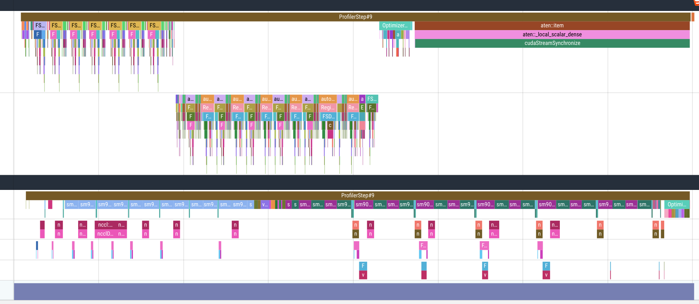


### 分析 profile图

- FSDP::root\_pre\_forward 没有做啥核心事情，只是准备工作

- FSDP::pre\_forward 开始对第一个 fsdp 模块\(embedding\+lm\_head\)进行操作

- embeding 计算

- FSDP::pre\_forward \(layers\.0\)\- all\-gather 第 0 层参数

- layer0 计算

- FSDP::post\_forward \(layers\.0\) 啥也不干

- FSDP::pre\_forward \(layers\.i\)\- all\-gather 第 i 层参数

- layer i 计算

- FSDP::post\_forward \(layers\.i\) 啥也不干

- lm\_head 计算\+ce loss forward\+ce loss backward

- FSDP::pre\_backward\(核心是FSDP::backward\_prefetch for layers\.5\)   lm\-head backward 前操作，因为layer5 并没有释放参数，所以不需要预取，等价于空操作

- lm head backward

- FSDP::pre\_backward \(layers\.5\)\(FSDP::backward\_prefetch for layers\.4\) 在 backward 最后一层前，先启动 layer4 的 all\-gather 通信操作

- layer5 backward

- FSDP::post\_backward\_reduce \(layers\.5\) 在当前层梯度计算完成后，需要把参数和梯度都重新切分回去，执行一次 reduce\-scatter 操作

- FSDP::pre\_backward \(layers\.4\) 实际上包括2个操作，一个是 FSDP::all\_gather\_copy\_out \(layers\.4\) 然后是 FSDP::backward\_prefetch for layers\.3

- layer4 backward

- \.\.\.

- EmbeddingBackward0

- FSDP::post\_backward\_reduce embedding 参数重新切分

- Optimizer\.step\#AdamW\.step


注意以 layer1 forward 为例 FSDP::pre\_forward \(layers\.1\) 中核心包括 

- FSDP::all\_gather \(layers\.1\) all\-gather 所有参数

- FSDP::all\_gather\_copy\_out \(layers\.1\) 将参数 copy 到每个子模块中


而对于 FSDP::all\_gather \(layers\.1\)\-实际上叫做 foreach\_all\_gather，为了实现提高 copy 效率，实际上分成 3 个 op

- aten::\_*foreach\_copy  在额外的 copy 流上执行*

- fsdp::all\_gather\_copy\_in  在额外的 copy 流上执行

- c10d::\_*allgather\_base\_ 在通信流上执行*

而 FSDP::all\_gather\_copy\_out \(layers\.1\) 是在默认流上执行和计算串行。


对于 layer1 的 backward 中FSDP::post\_backward\_reduce \(layers\.1\) 为例，

- fsdp::chunk\_cat 想将属于本 rank 的参数和梯度 chunk 出来，因为可能有很多参数组，并且 cat 成一个大对象

- c10d::*reduce\_scatter\_base 在计算流上执行 reduce\-scatter*

- aten::\_to\_copy 新的 copy 流上将大对象重新 copy 到每个子参数组中


## 案例2\-新切分规则和 del logits

```SQL
for layer_id, transformer_block in enumerate(model.layers):
        fully_shard(
            transformer_block,
            **fsdp_config,
            reshard_after_forward=True,
        )
    fully_shard(model.embed_tokens, **fsdp_config, reshard_after_forward=True)
    fully_shard(model.lm_head, **fsdp_config, reshard_after_forward=True)
    fully_shard(model, **fsdp_config, reshard_after_forward=True)
```

这个切分规则可以去掉：

- **最后一层由于不重新切分，因此该层参数一直在 32M\+32M=****64M，****但是在 backward 最后一层 layer 前还是要重新 all\-gather，这会导致峰值显存又加了 64M**

- **由于fsdp规则缘故，embeding 和 lm head 聚合后参数无法快速释放 2048x4096x2x2=****32M。**

    所以最多节省 32M。

所以最合适的应该是：

```SQL
for layer_id, transformer_block in enumerate(model.layers):
        reshard_after_forward = int(layer_id) < len(model.layers) - 1
        fully_shard(
            transformer_block,
            **fsdp_config,
            reshard_after_forward=reshard_after_forward,
        )
    fully_shard(model.embed_tokens, **fsdp_config, reshard_after_forward=True)
    fully_shard(model.lm_head, **fsdp_config, reshard_after_forward=True)
    fully_shard(model, **fsdp_config, reshard_after_forward=True)
```

核心还是在于 del logist 可以节省 128M。

## 案例3\-新规则下的 checkpoint


# 2\-纯 TP 分析

X\*A=B

## ColwiseParallel 列切分模式

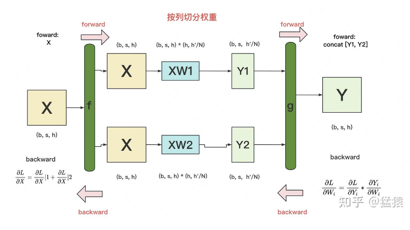

所谓列切分是指的对权重矩阵 A 进行列切分，也就是第1维度切分 \[A1,A2\]

- 输入 X , 然后在每个 tp rank 中进行复制，确保输入完全一样

- X\*A1=B1; X\*A2=B2, 每张卡上激活值和计算量减少 tp 倍

- 经过 all\-gather 变成 \[B1,B2\]=B


f 函数的 forward 是恒等变换；backward 是 all\-reduce

g 函数的 forward 是 all\-gather；backward 是 split

Forward: 恒等变换\+ all\-gather

Backward: split\+ all\-reduce


因此对于 ColwiseParallel，存在一次 all\-gather，和一次 all\-reduce 通信

## RowwiseParallel 行切分模式

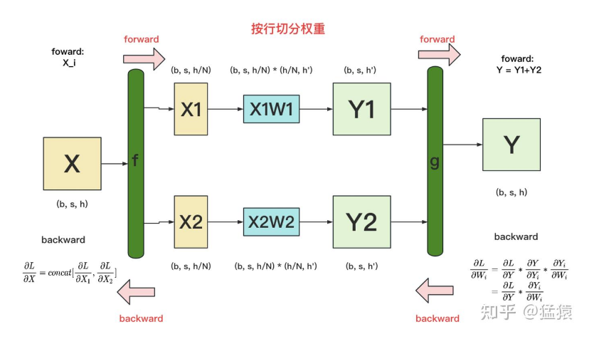

所谓行切分是指的对权重矩阵 A 进行行切分，也就是第 0 维度切分 \[A1; A2\]。为了保证等效性

- 对输入 X 按照最后一个维度切分 \[X1, X2\] 分到不同卡上

- X1\*A1=B1; X2\*A2=B2

- B=B1\+B2 这一步为 all\-reduce 操作


f 函数的 forward 是 spilt；backward 是 all\-gather

g 函数的 forward 是 all\-reduce；backward 是 恒等变换

Forward: split\+ all\-reduce

Backward: 恒等变换\+ all\-gather

因此对于 RowwiseParallel，存在一次 all\-reduce，和一次 all\-gather 通信


## MLP 切分

**可以看到，不管对线性层采用哪一种切分，都会存在 2 次 all 通信\(假设 MLP 里面包括 3 个线性层，那么就有 6 次通信\)，但是根据 MLP 特点和巧妙的切分策略，可以使得 foward\+backward 实际上只有 2 次通信。**

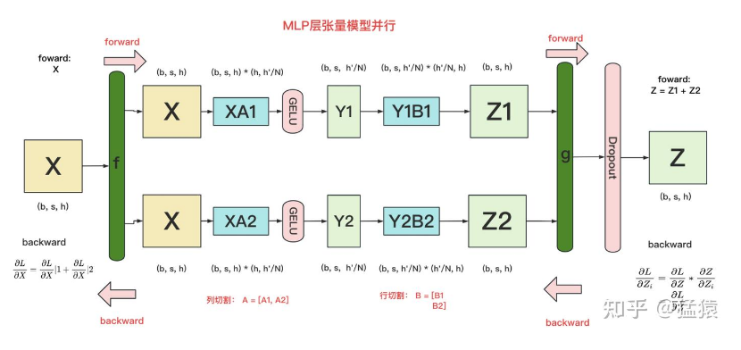


f 函数的 forward 是恒等变换；backward 是 all\-reduce

g 函数的 forward 是 all\-reduce；backward 是 恒等变换

Forward: 恒等变换\+ all\-reduce

Backward: 恒等变换\+ all\-gather


**可以看到，上述切分后，只需要执行 g 的 foward all\-reduce 和 f 的 backward all\-reduce 即可。**


上图中的 GELU 可以换成任何非线性激活函数。

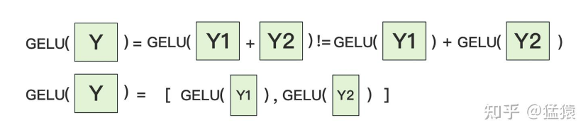

**上述的 MLP 只有 2 个 线性层，现在的 FFN 模块实际上 3 个线性层。**

```SQL
class MLPDecoderLayer(nn.Module):
    def __init__(self, config, layer_idx):
        super(MLPDecoderLayer, self).__init__()
        self.w1 = nn.Linear(config.hidden_size, config.intermediate_size, bias=False)
        self.w2 = nn.Linear(config.intermediate_size, config.hidden_size, bias=False)
        self.w3 = nn.Linear(config.hidden_size, config.intermediate_size, bias=False)

    def forward(self, x):
        return self.w2(F.silu(self.w1(x)) * self.w3(x))
```

```SQL
layer_tp_plan = {
    # 因为 w1 后面要接 silu 因此只能有列切分
    "w1": ColwiseParallel(), # 列切分
    "w2": RowwiseParallel(), # 行切分，输入需要设置为 shard(-1)模式，防止出错
    "w3": ColwiseParallel(), # 列切分
}
```

每个模块输出后都是 local tensor\(dtensor 不可以，因为 f\.silu 和 \* 算子不支持 dtensor 直接计算\)，而不是 dtensor，因此需要对每个模块的输入重新设置正确的切分模式。


## embed\_tokens 和 lm\_head 切分

因为他就是独立的层，因此任何切分方式都行。

## FFN 纯 TP 分析

```Python
layer_tp_plan = {
    # by default ColwiseParallel input layouts is replicated
    # and RowwiseParallel output layouts is replicated
    "w1": ColwiseParallel(),  # 列并行，第一个输入因此输入布局是复制[X,X]，权重在最后的维度切分[A1,A2]，输出为[XA1, XA2]
    "w2": RowwiseParallel(),  # 行并行, 输入是Shard(-1)，输出要确保tp size内的输出都是一样，因此设置为复制
    "w3": ColwiseParallel(),  # 列并行，第一个输入因此输入布局是复制[X,X]，权重在最后的维度切分[A1,A2]，输出为[XA1, XA2]
}

for layer_id, transformer_block in enumerate(model.layers):
    parallelize_module(
        module=transformer_block,
        device_mesh=world_mesh,
        parallelize_plan=layer_tp_plan,
    )

model = parallelize_module(
    model,
    world_mesh,
    {
        "embed_tokens": RowwiseParallel(
            input_layouts=Replicate(),
        ),
        "lm_head": ColwiseParallel(
            output_layouts=Replicate(),
        ),
    }
)
```

Forward

- embed\_tokens 计算完成后执行一次 all\-reduce

- FFN 计算完成后执行一次 all\-reduce

- lm\_head 计算完成后执行一次 all\-gather

总共 6 个 layer 层，因此一共 1\+6=7 次 all\-reduce 外加一次 all\-gather


Backward

- lm\_head 梯度计算完成后执行一次 all\-reduce

- FFN 需要特别注意，因为其是由 2 个 ColwiseParallel 构成，因此实际上 backward 时候会触发两次 all\-reduce

- embed\_tokens 正常来说梯度计算完成后需要对 X 执行一次 all\-gather，但是因为这是第一层不需要这个操作

总共 6 个 layer，因此一共 1 \+ 2\*6 =13 个 all\-reduce

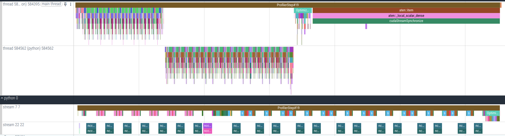

### 问题

对于一个 layer 层，forward 时候会执行一次 all\-reduce，backward 时候居然要执行两次 all\-reduce，这是一个问题。

从理论上来说，可以优化成 backward 也只有一个 all\-reduce


以下应该是 torch 构建的图，每个 copy 节点都会触发一次 all\-reduce，因此是两个。

如果有办法改成如下，应该就只有一次 all\-reduce

因此就可以少一次 all\-reduce

## FFN TP\+SP 分析

SP 是针对 FFN 前的 norm 在序列维度进行切分，从而减少 norm 层占据的峰值显存，但是总的来说应该降不了多少甚至降不了峰值显存，因为后面还是有 all\-gather 还原到原始长度。也就是说只是减少了 norm 部分的峰值显存。

```Python
layer_tp_plan = {
    'ffn_norm': SequenceParallel(),
    # ffn_norm 输出丢给他，sp 输出是在序列维度切分 dtensor ，因此设置 input_layouts=(Shard(1),)
    # 对于 tp 而言，输入给 feed_forward 要一致，因此设置 desired_input_layouts=(Replicate(),)
    "feed_forward": PrepareModuleInput(
        input_layouts=(Shard(1),),
        desired_input_layouts=(Replicate(),),  # shard1 -> replicate 会触发一次序列维度 all-gather
    ),
    "feed_forward.w1": ColwiseParallel(),
    # 因为 feed_forward 输出后就喂给 norm，因此只要设置在序列维度已经切分即可
    "feed_forward.w2": RowwiseParallel(output_layouts=Shard(1)),  # 也只是执行 reduce-scatter 了
    "feed_forward.w3": ColwiseParallel(),
}

for layer_id, transformer_block in enumerate(model.layers):
    parallelize_module(
        module=transformer_block,
        device_mesh=world_mesh,
        parallelize_plan=layer_tp_plan,
    )

model = parallelize_module(
    model,
    world_mesh,
    {
        # 对权重按照第 0 维度切分，即词表维度切分
        # 计算完成后，如果想得到完整输出，需要执行 all-reduce
        # 但是因为后面结合 sp，因此我们不需要完整输出，而是只要当前 rank 的部分序列输出即可，因此设置为 output_layouts=Shard(1)
        # 此时执行的就是 reduce-scatter, 通信量减少 (world_size-1)/world_size
        # 注意，embedding_tokens 输出的序列维度减半了，激活值也减半了
        "embed_tokens": RowwiseParallel(
            input_layouts=Replicate(),
            output_layouts=Shard(1),  # 接下来是 norm，因此设置为在序列维度切分即可，省掉了一个 all-reduce
        ),
        "norm": SequenceParallel(),
        "lm_head": ColwiseParallel(
            input_layouts=Shard(1),
            output_layouts=Replicate()  # 执行一次序列维度的 all-gather 在计算之前
        ),
    }
)
```

Forward

- embeding\_tokens 计算完成后，执行 reduce\-scatter （为何不再是 all\-reduce？ 因为这个模块计算后输出的序列长度依然是除以了 tp 倍, 而不是完整序列，因此只需要自己序列部分的完整值即可），相比于之前的 all\-reduce，计算代价减少 tp\-1 倍

- ffn\_norm 在序列维度减少的情况下计算\(norm 的权重是复制模式\)

- Norm 后**在执行 ffn forward 前需要聚合输入，因此需要执行 all\-gather\(PrepareModuleInput\)，恢复完整序列**

- ffn foward 计算, 内部会将权重切分为 tp 份计算，减少激活值

- 和之前一样\(all\-reduce\)，现在是执行 reduce\-scatter，得到切分后序列的输入

- 重复执行 norm\+ffn forward **\(norm 后 all\-gather\+ ffn 后 reduce\-scatter\)**

- **执行一次外层的 norm 后，在执行 lm\_head 前需要完整序列，因此先有一次 all\-gather**

- lm\_head 执行 foward，输出要恢复为完整序列，因此也有 all\-gather

可以看出，一共 6 层情况下，需要 1\(embedding\)\+6\(layer\) 次 7 reduce\-scatter 和 6\(layer\)\+1\(lm head 前\)\+1\(lmhead 后\) 次 8 all\-gather。

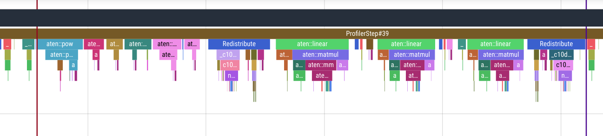

**norm 执行\+all\-gather\+ffn 执行\+ reduce\-scatter**


Backward

- lm\_head foward 后有一个 all\-gather，因此在 loss backward 后会跟着一个 chunk \(对应 lm\_head foward 后的 all\-gather\)，将输入在序列维度切开

- lm\_head 梯度计算，执行一次** ****reduce\-scatter** （对应 lm\_head foward 前的 all\-gather）

- 最外层的 norm 执行梯度计算后，执行一次 all\-gather \(对应 FFN forward 后的 reduce\-scatter\)

- FFN backward 计算后，执行一次 reduce\-scatter \(对应 FFN forward 前的 all\-gather\)

- 重复计算 norm\+ffn 梯度，也就是重复执行 all\-gather\+reduce\-scatter

- embeding token 梯度计算

可以看出，一共 6 层情况下，需要 7 次 reduce\-scatter 和 7 次 all\-gather

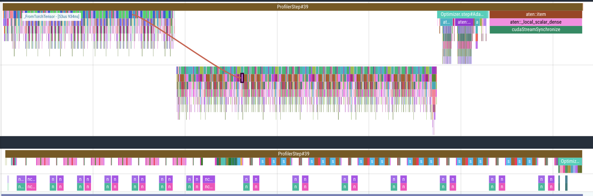


**all\-gather\+ ffn backward\+ reduce\-scatter \+ norm backward**

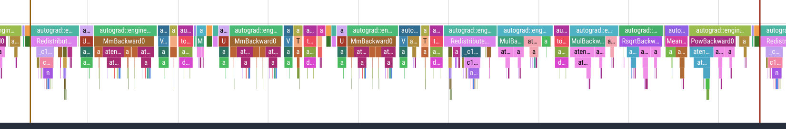

# 3 Async TP

https://discuss\.pytorch\.org/t/distributed\-w\-torchtitan\-introducing\-async\-tensor\-parallelism\-in\-pytorch/209487

https://zhuanlan\.zhihu\.com/p/16594218518 megatron 中实现的 tp overlap 也是完全相同原理。


只能用于 tp\+sp 场合，同时要开启 torch\.compile，否则无效。

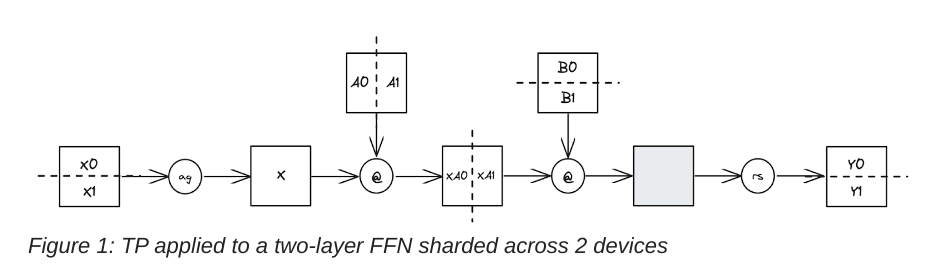

在开启 sp 后，FFN 的输入是切分的，因此

- All\-Gather

- FFN 计算

- Reduce\-Scatter

上述 3 个步骤只能串行，而 Async TP 核心原理是：

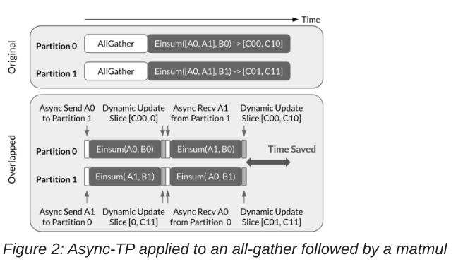

核心是将 all\-gather 算子拆分为 send/recv 算子，发送部分数据后就可以开启 FFN 计算，部分数据计算完成后直接进行 reduce\-scatter，然后采用流水线式方式进行运行。因此上述 3 个步骤变成了 2 个步骤

- fused\_all\_gather\_matmul

- fused\_matmul\_reduce\_scatter

为了更高效，内部会开启多个 streaming 多 batch 并行计算。

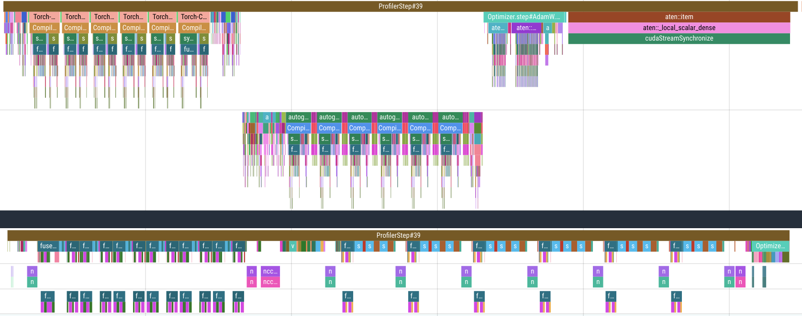

# 4 Qwen3 Dense 8b 显存分析

https://github\.com/zhaochenyang20/Awesome\-ML\-SYS\-Tutorial/blob/main/torch/mem\-snapshot/readme\.md


总训练参数量是 7811 M, 一共 36 层。假设一共 8 卡 fsdp 训练。

[rank0\_memory\_snapshot\.pickle](图片和附件/rank0_memory_snapshot.pickle)

一次 optimizer\.step 后静态显存为：\(模型参数\*4\+优化器参数\*8\+梯度\*4\)/8=模型参数\*16/8=15\.3G

如果在 model forward 前打印下显存占用，因为此时梯度是 None，因此静态显存是 模型参数\*12/8=11\.5G

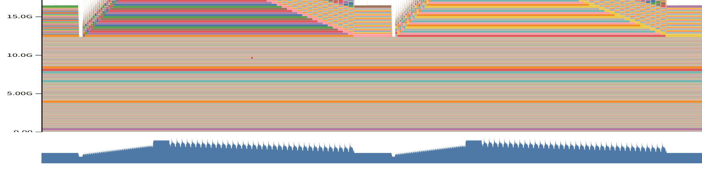

下面开始分析动态显存。假设训练是 32k，假设开启了 checkpoint。

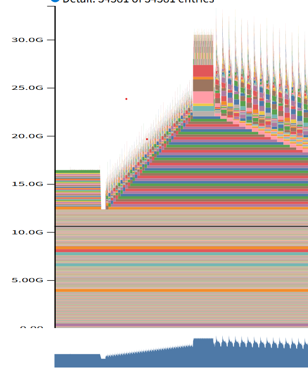

可以看出此时峰值显存在最后一个层 backward 计算期间\(还需要分析为啥在这时候是峰值\)，分析这个时刻就够了。

在序列很长情况下，lm head 计算和 loss 部分会占据非常大的显存，但是因为我们开启了 chunk loss，所以这个地方已经不是峰值显存了。


首先由于 checkpoint 的存在，每个 layer 的输入都需要缓存下来，方便重算。每一层的输入缓存大小是 ： 32k\* hidden\_size\*2= 32k \* 4096 \* 2 = 256M，一共缓存了 36 层，因此 checkpoint 带来的显存是 256M \* 36= 9G。

此时峰值显存最大是 15\.3G\+9G=24\.3G。


在最后一层进行 backward 时候，需要 all\-gather 当前层参数，还是额外的 prefetch 上一层参数，有了参数后需要重新 forward\+backward中间会参数激活值。而且如果 backward 时候会存在全量的梯度，然后再会切片，假设这个也是和参数一样大。

一层参数个数是 208M 个，因此参数加梯度加上额外 prefetch 一层，此时有 208Mx3 个，显存就是 208M X3X2= 1\.2G。

Mem profile 显示峰值大概 31G，因此中间一层的激活值是 31\-24\.3\-1\.2= 5\.5G。至于这个 5\.5G 咋来的，需要手算。

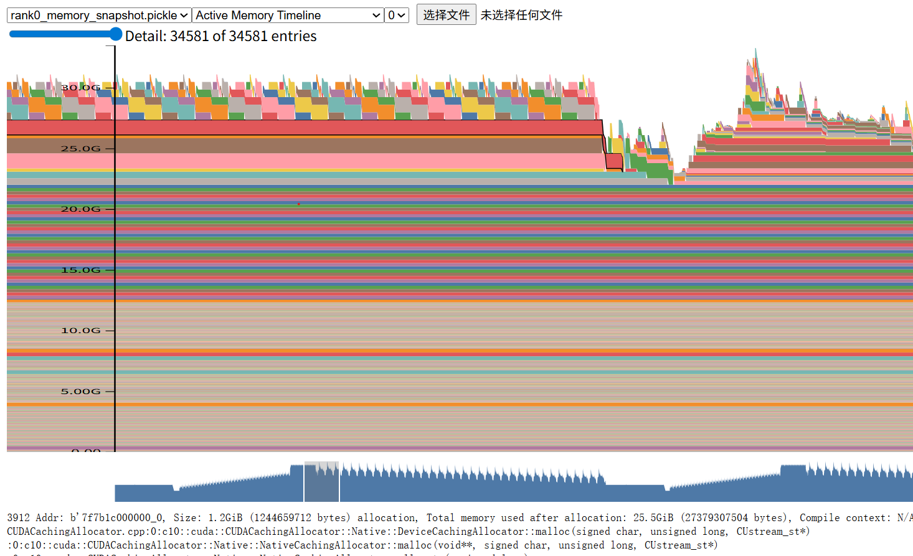


总结来说，峰值显存可以用如下公式简单计算：

\(参数\*4\+优化器\*8\+梯度\*4\)/world\_size\+N 层的 checkpoint 值\*2\+一层的全量参数\*2\+一层 prefetch 的全量参数\*2\+一层的完整梯度\*2\+中间计算激活值。

以 32k qwen3 8b 为例，峰值显存为：

31G= 7811M\*16/8\+36\*\(32768\*4096\)\*2\+208M\*6\+中间激活 5\.5G

# 5 Qwen30b 显存分析

总参数 29117M，一共 48 层，一层参数大概 640M。因此峰值显存为：


29117M\*16/8\+48\*\(32768\*2048\)\*2\+640M\*6\+7G激活

= 58234 M\+6144 M\+3840 M\+7G 激活

= 66\.6G\+7G激活

=73\.6 G


# 6 copy out 两份显存分析

以上述案例中最简单的例子为例。在 forward 情况下

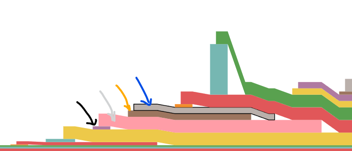

黑色箭头是当前层的 copy\-in 结果，非常小

灰色箭头是当前层的 all\-gather 结果，相比 copy\-in 扩大了4 倍

橙色和蓝色是 copy\-out 到各个线性层参数的结果，两个加起来等于 all\-gather 结果。


理论上，一旦 copy\-out 结果得到了，那么灰色的 all\-gather 显存就要立刻释放，否则会存在两份 all\-gather显存在。但是可以发现，all\-gather 确实释放的很晚。对应代码位置为：

```Python
def wait_for_unshard(self):
        """
        1. In forward with implicit prefetching, to overlap the current copy-out
        with the next all-gather, we save a reference to the current all-gather
        result to free after the next copy-out.
        2. Otherwise (explicit prefetching or in backward), we free the
        all-gather result immediately after the current copy-out since we can
        already overlap the current copy-out with the previous reduce-scatter.
        """
        if not self._all_gather_result:
            return  # no preceding unshard
        async_op = self._all_gather_result.all_gather_work is not None
        if self._training_state == TrainingState.FORWARD:  # implicit prefetch
            if prev_all_gather_state := self.comm_ctx.all_gather_state:
                self._wait_all_gather_streams_on_event(prev_all_gather_state.event)
                self.comm_ctx.all_gather_state = None  # free the all-gather result
        with record_function(self._with_fqn("FSDP::all_gather_copy_out")):
            foreach_all_gather_copy_out(
                self._all_gather_result,
                self.fsdp_params,
                self._all_gather_process_group,
            )
        for fsdp_param in self.fsdp_params:
            fsdp_param.init_unsharded_param()
        self._to_unsharded()
        all_gather_copy_out_event = self.device_handle.Event()
        all_gather_copy_out_event.record()
        if not async_op and self._training_state == TrainingState.FORWARD:
            # Defer free to allow for overlap of this copy-out with next
            # all-gather collective
            self.comm_ctx.all_gather_state = AllGatherState(
                self._all_gather_result, all_gather_copy_out_event
            )
        else:
            self._wait_all_gather_streams_on_event(all_gather_copy_out_event)
        # self._all_gather_result.all_gather_output.untyped_storage().resize_(0)
        self._all_gather_result = None  # free unless saved in `all_gather_state`
```

我们可以通过加 36 行来达到立刻释放的目的，改动后结果如下：


可以发现粉色块确实提前释放了。原则上加了这个代码后，峰值显存会减少的。但是实测发现并没有。原因是峰值显存一般是在 backward 时刻，当时 backward 时刻这个 all\-gather 释放的就是非常快的，无需任何改动就是很快。即使是开了 checkpoint，他在重计算 forward 时候也是释放非常快，因此峰值显存并没有减少。

具体原因不明，需要再执行分析源码。

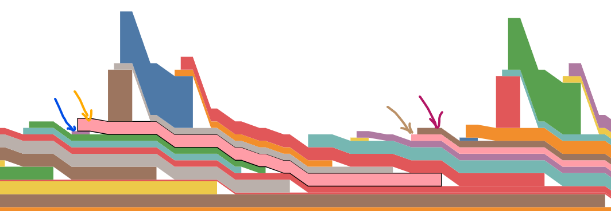

如上所述，橙色箭头释放非常快。


# 其他

对一个 bf16 权重进行 fp8 训练，需要提前计算 scale，也就是说任何一个 fp8 对象都会包括 fp8 value 和 scale。由于 fsdp 后得到的是完整权重，因此 scale 就一个值\(pre tensor 的话\)。在 fsdp 切分逻辑中只需要把 value 切分和 all\-gather 即可，scale 因为本地每张卡都一样，无需进行通信。

**shard 参数似乎一直没有释放，只是会对 all\-gather 的参数进行释放和合并操作。**


