# Qwen3\+Qwen3\.5 chat template 新方案

# 需求

XTuner 对 think 模型支持不够，因此在交付数据中会有大量前处理。一旦换一个新的 chat template 就需要重新刷数据，且为了兼容 think 和 非 think 场景，交付数据格式多样，不利于管理。

因此希望在 XTuner 中原生支持模型本身提供的 jinja 模板并直接调用 apply\_chat\_template\(\)，从而自动支持 think 和 非 think 模式。代码简化且训推一致性可以得到极大提升。

# Qwen3 实现

## 方案1\-刘奎坤提供

核心是通过每次递增 apply\_chat\_template 来找出 diff token。

```Python
def tokenize_fn_slowspeed(tokenizer, messages: List[Dict[str, str]], tools=None, add_vision_id=True, **kwargs):
    """
    终极稳定版 Tokenize：基于 Token 级别的绝对对齐 (椒盐算法升级版)。
    逻辑：
    1. 生成全量 total_ids 作为唯一真实的参考系。
    2. 对于每个 assistant 消息，通过历史截断渲染，提取出它“应该长什么样”的 token 序列。
    3. 在 total_ids 中顺藤摸瓜，精确匹配这些 token 序列。
    4. 完美解决字符偏移错位、模板历史修改、以及特殊 Token 对齐问题。
    """
    full_text = tokenizer.apply_chat_template(messages, tokenize=False, tools=tools,add_vision_id=add_vision_id)
    total_ids = tokenizer.encode(full_text, add_special_tokens=False)
    labels = [-100] * len(total_ids)
    # 记录在 total_ids 中搜索的起始位置，确保不会搜到前面的轮次
    curr_ptr = 0
    for i, msg in enumerate(messages):
        if msg['role'] == 'assistant' and msg.get('loss', True):
            # 1. 获取包含当前消息之前所有内容的“前缀”文本 (带 generation prompt)
            prompt_text = tokenizer.apply_chat_template(messages[:i], tokenize=False, add_generation_prompt=True,add_vision_id=add_vision_id, tools=tools if i==0 else None)
            # 2. 获取包含当前消息的完整“截断”文本
            # 我们通过修改当前消息的内容，强制在末尾加上一个罕见标记，来准确捕获这部分的内容
            # 为什么要加标记？因为我们想知道当前消息的结束符（如 <|im_end|>）被 tokenizer 编成了什么
            temp_msgs = [m.copy() for m in messages[:i+1]]
            # 提取真实内容
            m_text = tokenizer.apply_chat_template(temp_msgs, tokenize=False,add_vision_id=add_vision_id, tools=tools if i==0 else None)
            # 转换为 Token 序列
            p_ids = tokenizer.encode(prompt_text, add_special_tokens=False)
            m_ids = tokenizer.encode(m_text, add_special_tokens=False)
            # 3. 提取当前消息的纯内容 Tokens (包含 reasoning, content, tool_calls, 以及结尾的 im_end)
            # 注意：由于 tokenizer 的特性，m_ids 的前缀可能并不完美等于 p_ids
            # 所以我们要寻找 p_ids 的特征来切分
            # 为了最稳健，我们直接在 m_ids 的末尾倒推。
            # 我们知道 m_ids 是由 p_ids + current_content_ids 组成的
            # 我们直接取差集：
            content_tokens = m_ids[len(p_ids):]
            if not content_tokens:
                continue
            # 4. 在全量 total_ids 中搜索这段 content_tokens
            found = False
            # 从 curr_ptr 开始往后搜
            for s_ptr in range(curr_ptr, len(total_ids) - len(content_tokens) + 1):
                if total_ids[s_ptr : s_ptr + len(content_tokens)] == content_tokens:
                    # 匹配成功！
                    labels[s_ptr : s_ptr + len(content_tokens)] = content_tokens
                    curr_ptr = s_ptr + len(content_tokens)
                    found = True
                    break
            if not found:
                # 如果没找到，说明模板在全量渲染时，修改了这条历史消息的内容（例如删了 thinking）
                # 这是允许的，只要它不是当前轮次（我们不强求历史轮次一定要匹配上，因为我们通常只对最后的 Turn 算 loss）
                # 但如果是最后一条消息还没匹配上，那就一定是出大问题了
                if i == len(messages) - 1:
                    raise ValueError(f"严重错误：最后一条 Assistant 消息无法在全量 Token 中对齐。")
    return total_ids, labels
```

该实现看起来通用性足够，但是需要 tokenize 3 遍，在多轮场景下速度会相比原生慢很多，至少都是慢 3 倍。因此不太适合直接接入。

## 方案2

AI 直接将 jinja 模板自动翻译为 python 代码，并自动实现计算 label 功能。

```Python
def get_offset_mapping(tokenizer, text: str):
    """
    为 slow tokenizer 手动计算 offset_mapping。
    返回与 tokenizer(text, return_offsets_mapping=True) 相同格式的结果。
    """
    encoding = tokenizer(text, add_special_tokens=False)
    input_ids = encoding["input_ids"]
    tokens = tokenizer.convert_ids_to_tokens(input_ids)

    offset_mapping = []
    pos = 0  # 当前在原始字符串中的扫描位置

    for token_id, token in zip(input_ids, tokens):
        # 特殊 token（如 <|im_start|>）：先尝试直接匹配其字符串形式
        # 也可以通过 tokenizer.all_special_tokens 判断
        decoded = tokenizer.decode([token_id], skip_special_tokens=False)
        
        if not decoded:
            # 虚拟/空 token
            offset_mapping.append((pos, pos))
            continue

        # 在当前 pos 开始的位置找 decoded 字符串
        idx = text.find(decoded, pos)
        if idx == -1:
            # fallback：特殊 token 无法在文本中找到，标记为虚拟
            offset_mapping.append((pos, pos))
        else:
            end = idx + len(decoded)
            offset_mapping.append((idx, end))
            pos = end

    return input_ids, offset_mapping

def render_content(content, do_vision_count, image_count, video_count, add_vision_id=False):
    """渲染消息内容，处理文本、图片、视频"""
    if isinstance(content, str):
        return content, image_count, video_count
    else:
        result = ""
        for item in content:
            if 'image' in item or 'image_url' in item or item.get('type') == 'image':
                if do_vision_count:
                    image_count += 1
                if add_vision_id:
                    result += f"Picture {image_count}: "
                result += "<|vision_start|><|image_pad|><|vision_end|>"
            elif 'video' in item or item.get('type') == 'video':
                if do_vision_count:
                    video_count += 1
                if add_vision_id:
                    result += f"Video {video_count}: "
                result += "<|vision_start|><|video_pad|><|vision_end|>"
            elif 'text' in item:
                result += item['text']
        return result, image_count, video_count

def tokenize_fn_fastspeed(
    messages,
    tokenizer=None,          # 传入则返回 input_ids / labels
    tools=None,
    add_generation_prompt=False,
    add_vision_id=False,
    return_labels=False,
):
    image_count = 0
    video_count = 0
    result = ""
    loss_mask = []  # 字符级 bool，True = 算 loss

    def _render(content, do_vision_count):
        nonlocal image_count, video_count
        out, image_count, video_count = render_content(
            content, do_vision_count, image_count, video_count, add_vision_id
        )
        return out

    def _append(text, is_loss):
        nonlocal result
        result += text
        loss_mask.extend([is_loss] * len(text))

    # ── system / tools 块 ────────────────────────────────────────────────
    if tools:
        _append("<|im_start|>system\n", False)
        if messages[0]["role"] == "system":
            _append(_render(messages[0]["content"], False) + "\n\n", False)
        _append(
            "# Tools\n\n"
            "You may call one or more functions to assist with the user query.\n\n"
            "You are provided with function signatures within <tools></tools> XML tags:\n"
            "<tools>",
            False,
        )
        for tool in tools:
            _append("\n" + json.dumps(tool, ensure_ascii=False), False)
        _append(
            "\n</tools>\n\n"
            "For each function call, return a json object with function name and arguments "
            "within <tool_call></tool_call> XML tags:\n"
            "<tool_call>\n"
            '{\"name\": <function-name>, \"arguments\": <args-json-object>}\n'
            "</tool_call><|im_end|>\n",
            False,
        )
    else:
        if messages[0]["role"] == "system":
            _append("<|im_start|>system\n", False)
            _append(_render(messages[0]["content"], False), False)
            _append("<|im_end|>\n", False)

    # ── 计算 last_query_index ────────────────────────────────────────────
    multi_step_tool = True
    last_query_index = len(messages) - 1

    for i in range(len(messages) - 1, -1, -1):
        message = messages[i]
        if multi_step_tool and message["role"] == "user":
            content_str = _render(message["content"], False)
            if not (
                content_str.startswith("<tool_response>")
                and content_str.endswith("</tool_response>")
            ):
                multi_step_tool = False
                last_query_index = i

    # ── 主循环 ──────────────────────────────────────────────────────────
    for idx, message in enumerate(messages):
        is_first = idx == 0
        is_last = idx == len(messages) - 1
        content = _render(message["content"], True)
        role = message["role"]

        if role == "user" or (role == "system" and not is_first):
            _append(f"<|im_start|>{role}\n{content}<|im_end|>\n", False)

        elif role == "assistant":
            reasoning_content = ""
            if isinstance(message.get("reasoning_content"), str):
                reasoning_content = message["reasoning_content"]
            else:
                if "</think>" in content:
                    before_end = content.split("</think>")[0]
                    reasoning_content = (
                        before_end.rstrip("\n").split("<think>")[-1].lstrip("\n")
                    )
                    content = content.split("</think>")[-1].lstrip("\n")

            _append(f"<|im_start|>{role}\n", False)

            if idx > last_query_index:
                # 只有最后一轮或者有 reasoning_content 的非最后轮才算 loss
                # Qwen3 模板对无 reasoning 的中间工具调用轮次不添加 <think> 块，
                # 导致 slowspeed 的内容匹配失败，因此这些轮次不算 loss
                is_loss_turn = is_last or bool(reasoning_content)
                if is_last or (not is_last and reasoning_content):
                    _append(f"<think>\n", False)
                    if reasoning_content:
                        _append(f"{reasoning_content.strip(chr(10))}\n", True)
                    else:
                        _append(f"\n", False)
                    _append(f"</think>\n\n", True)
                    _append(content.lstrip("\n"), True)
                else:
                    _append(content, False)

                if message.get("tool_calls"):
                    for tc_idx, tool_call in enumerate(message["tool_calls"]):
                        if (tc_idx == 0 and content) or tc_idx != 0:
                            _append("\n", is_loss_turn)
                        tc = tool_call.get("function", tool_call)
                        _append('<tool_call>\n{"name": "' + tc["name"] + '", "arguments": ', is_loss_turn)
                        args = tc["arguments"]
                        _append(args if isinstance(args, str) else json.dumps(args, ensure_ascii=False), is_loss_turn)
                        _append("}\n</tool_call>", is_loss_turn)

                _append("<|im_end|>\n", is_loss_turn)
            else:
                # 历史轮次的 assistant 消息，不算 loss
                # Qwen3 模板会剥离历史轮次的 thinking 内容，因此不输出 <think> 块
                _append(content, False)

                if message.get("tool_calls"):
                    for tc_idx, tool_call in enumerate(message["tool_calls"]):
                        if (tc_idx == 0 and content) or tc_idx != 0:
                            _append("\n", False)
                        tc = tool_call.get("function", tool_call)
                        _append('<tool_call>\n{"name": "' + tc["name"] + '", "arguments": ', False)
                        args = tc["arguments"]
                        _append(args if isinstance(args, str) else json.dumps(args, ensure_ascii=False), False)
                        _append("}\n</tool_call>", False)

                _append("<|im_end|>\n", False)  # 历史轮次不算 loss

        elif role == "tool":
            prev_role = messages[idx - 1]["role"] if idx > 0 else None
            if is_first or prev_role != "tool":
                _append("<|im_start|>user", False)
            _append("\n<tool_response>\n", False)
            _append(content, False)
            _append("\n</tool_response>", False)
            next_role = messages[idx + 1]["role"] if not is_last else None
            if is_last or next_role != "tool":
                _append("<|im_end|>\n", False)

    if add_generation_prompt:
        _append("<|im_start|>assistant\n<think>\n", False)

    # ── 不需要 labels，直接返回文本 ─────────────────────────────────────
    if not return_labels:
        return result

    # ── 需要 labels：必须传入 tokenizer ──────────────────────────────────
    assert tokenizer is not None, "return_labels=True 时必须传入 tokenizer"
    
    try:
        encoded = tokenizer(
            result, # len()=603
            return_offsets_mapping=True,
            add_special_tokens=False,   # prompt 里已含所有特殊 token
        )
        input_ids = encoded["input_ids"] # len()=188
        offset_mapping = encoded["offset_mapping"] # len()=188，元素为 (start, end) 字符索引，表示该 token 在原始字符串中的位置范围
    except Exception:
        # slow tokenizer fallback
        input_ids, offset_mapping = get_offset_mapping(tokenizer, result)
    
    labels = []
    for token_id, (start, end) in zip(input_ids, offset_mapping):
        if start == end:
            # 特殊/虚拟 token，不算 loss
            labels.append(-100)
        elif any(loss_mask[i] for i in range(start, end)): # len(loss_mask) == len(result)，每个字符对应一个 bool，表示该字符是否算 loss
            # token 覆盖的字符范围内有任意一个字符算 loss → 该 token 算 loss
            labels.append(token_id)
        else:
            labels.append(-100)

    return input_ids, labels
```

方案优点是速度可控，缺点是：

- 可读性很差

- 需要借助 fast tokenizer 本身提供的 return\_offsets\_mapping=True 功能才能实现计算出 label。如果是 slow 版本暂时是 自定义 get\_offset\_mapping 实现，不确定是否能满足所有需求\(或者可能要自定义 tokenizer 时候实现 return\_offsets\_mapping=True 功能\)

## 总结

**方案1**

- 优点：通用

- 缺点：计算效率很低

**方案2**

- 优点：计算效率高

- 缺点：代码可读性很差，通用性不足。并且非 fast tokenizer 存在可能的风险


**最终采用方案2，并且以 方案1 作为真值。****以方案1和hf 本身作为基准，通过各种 case 来充分验证方案 2 的正确性。目前已经验证所有 case 都通过。**

# Qwen3 结果说明\(废弃，请以 qwen3\.5 结果说明为准\)

红色表示算 loss 部分。

## 单轮无 think

```JSON
{
  "messages": [
    {
      "role": "system",
      "content": "这是单轮无think例子"
    },
    {
      "role": "user",
      "content": "这是第一个问题"
    },
    {
      "role": "assistant",
      "content": "我需要先调用一些工具才能知道"
    }
  ]
}
```

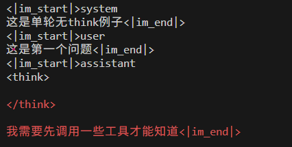

会自动在 assistant 内容前面加 \<think\>\\n\\n\<\\think\>\\n

## 单轮有 think

```JSON
{
  "messages": [
    {
      "role": "system",
      "content": "这是单轮有think例子"
    },
    {
      "role": "user",
      "content": "这是第一个问题"
    },
    {
      "role": "assistant",
      "content": "我需要先调用一些工具才能知道",
      "reasoning_content": "这是 reasoning_content 内容"
    }
  ]
}
```

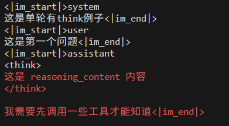

会保留 reasoning\_content，并且前面加 \<think\>\\n 后面加 \\n\</think\>\\n

```JSON
{
  "messages": [
    {
      "role": "system",
      "content": "这是单轮有think例子"
    },
    {
      "role": "user",
      "content": "这是第一个问题"
    },
    {
      "role": "assistant",
      "content": "\n我需要先调用一些工具才能知道",
      "reasoning_content": "\n这是 reasoning_content 内容\n"
    }
  ]
}
```

结果也一样，会有多余 \\n 自动检测。

## 多轮无 think

```JSON
{
  "messages": [
    {
      "role": "system",
      "content": "这是多轮无think例子"
    },
    {
      "role": "user",
      "content": "这是第一个问题"
    },
    {
      "role": "assistant",
      "content": "我需要先调用一些工具才能知道"
    },
    {
      "role": "user",
      "content": "这是第二个问题"
    },
    {
      "role": "assistant",
      "content": "好的，我知道这是第二个问题"
    }
  ]
}
```

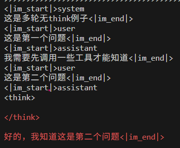

**只有最后一个 assistant 计算 loss。**

## 多轮有 think

```JSON
{
  "messages": [
    {
      "role": "system",
      "content": "这是多轮有think例子"
    },
    {
      "role": "user",
      "content": "这是第一个问题"
    },
    {
      "role": "assistant",
      "content": "我需要先调用一些工具才能知道",
      "reasoning_content": "这是 reasoning_content 内容"
    },
    {
      "role": "user",
      "content": "这是第二个问题"
    },
    {
      "role": "assistant",
      "content": "好的，我知道这是第二个问题"
    }
  ]
}
```

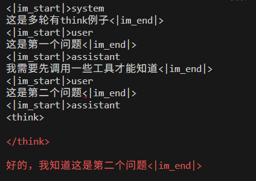

```JSON
{
  "messages": [
    {
      "role": "system",
      "content": "这是多轮有think例子"
    },
    {
      "role": "user",
      "content": "这是第一个问题"
    },
    {
      "role": "assistant",
      "content": "我需要先调用一些工具才能知道",
      "reasoning_content": "这是 reasoning_content 内容 1"
    },
    {
      "role": "user",
      "content": "这是第二个问题"
    },
    {
      "role": "assistant",
      "content": "好的，我知道这是第二个问题"
    },
    {
      "role": "user",
      "content": "这是第三个问题"
    },
    {
      "role": "assistant",
      "content": "好的，我知道这是第三个问题",
      "reasoning_content": "这是 reasoning_content 内容 2"
    }
  ]
}
```

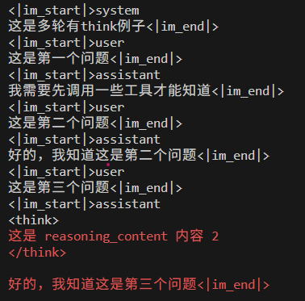

除了最后一轮的 assistant 且有 reasoning\_content 才会保留。中间的 reasoning\_content 全删掉，且 assistant  不算 loss。

## 单轮无 think\+toolcall

```SQL
{
  "messages": [
    {
      "role": "system",
      "content": "这是单轮无think+toolcall例子"
    },
    {
      "role": "user",
      "content": "北京今天的天气如何？"
    },
    {
      "role": "assistant",
      "content": "我需要先调用一些工具才能知道",
      "tool_calls": [
        {
          "id": "call_123",
          "type": "function",
          "function": {
            "name": "get_weather",
            "arguments": "{\"location\": \"Boston\"}"
          }
        },
        {
          "id": "call_456",
          "type": "function",
          "function": {
            "name": "get_weather",
            "arguments": "{\"location\": \"beijing \"}"
          }
        }
      ]
    },
    {
      "role": "tool",
      "content": "35"
    },
    {
      "role": "assistant",
      "content": "基于我的观察，今天北京的天气是35度。"
    }
  ],
  "tools": [
    {
      "type": "function",
      "function": {
        "name": "get_current_temperature",
        "description": "Gets the temperature at a given location.",
        "parameters": {
          "type": "object",
          "properties": {
            "location": {
              "type": "string",
              "description": "The location to get the temperature for"
            }
          },
          "required": [
            "location"
          ]
        }
      }
    },
    {
      "type": "function",
      "function": {
        "name": "get_current_wind_speed",
        "description": "Get the current wind speed in km/h at a given location.",
        "parameters": {
          "type": "object",
          "properties": {
            "location": {
              "type": "string",
              "description": "The location to get the wind speed for, in the format \"City, Country\""
            }
          },
          "required": [
            "location"
          ]
        }
      }
    }
  ]
}
```

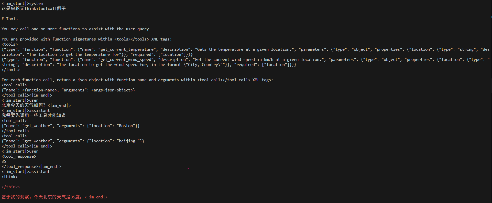

**和单轮无 think 不带 tools 的完全一样处理。**

## 单轮有 think\+toolcall

```SQL
{
  "messages": [
    {
      "role": "system",
      "content": "这是单轮有think+toolcall例子"
    },
    {
      "role": "user",
      "content": "北京今天的天气如何？"
    },
    {
      "role": "assistant",
      "content": "我需要先调用一些工具才能知道",
      "reasoning_content": "这是 reasoning_content 内容",
      "tool_calls": [
        {
          "id": "call_123",
          "type": "function",
          "function": {
            "name": "get_weather",
            "arguments": "{\"location\": \"Boston\"}"
          }
        },
        {
          "id": "call_456",
          "type": "function",
          "function": {
            "name": "get_weather",
            "arguments": "{\"location\": \"beijing \"}"
          }
        }
      ]
    },
    {
      "role": "tool",
      "content": "35"
    },
    {
      "role": "assistant",
      "content": "基于我的观察，今天北京的天气是35度。"
    }
  ], # 省掉 tools 部分
```

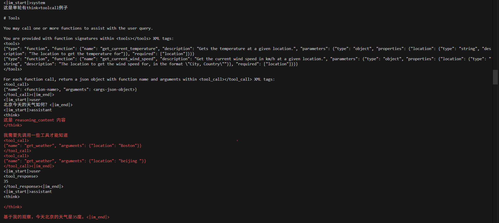

在有 tools 情况下，不管多少轮的 reasoning\_content 都会被保留。并且所有的 assistant部分都会算 loss。区别很大。

## 多轮无 think\+toolcall

```SQL
{
  "messages": [
    {
      "role": "system",
      "content": "这是多轮无think+toolcall例子"
    },
    {
      "role": "user",
      "content": "北京今天的天气如何？"
    },
    {
      "role": "assistant",
      "content": "我需要先调用一些工具才能知道",
      "tool_calls": [
        {
          "id": "call_123",
          "type": "function",
          "function": {
            "name": "get_weather",
            "arguments": "{\"location\": \"Boston\"}"
          }
        },
        {
          "id": "call_456",
          "type": "function",
          "function": {
            "name": "get_weather",
            "arguments": "{\"location\": \"beijing \"}"
          }
        }
      ]
    },
    {
      "role": "tool",
      "content": "35"
    },
    {
      "role": "assistant",
      "content": "基于我的观察，今天北京的天气是35度。"
    },
    {
      "role": "user",
      "content": "这是第二个问题。上海的天气如何"
    },
    {
      "role": "assistant",
      "content": "好的，我知道这是第二个问题。我需要先调用一些工具才能知道",
      "tool_calls": [
        {
          "id": "call_123",
          "type": "function",
          "function": {
            "name": "get_weather",
            "arguments": "{\"location\": \"Boston\"}"
          }
        },
        {
          "id": "call_456",
          "type": "function",
          "function": {
            "name": "get_weather",
            "arguments": "{\"location\": \"beijing \"}"
          }
        }
      ]
    },
    {
      "role": "tool",
      "content": "25"
    },
    {
      "role": "assistant",
      "content": "基于我的观察，今天上海的天气是25度。"
    }
  ], # 省掉 tools
```

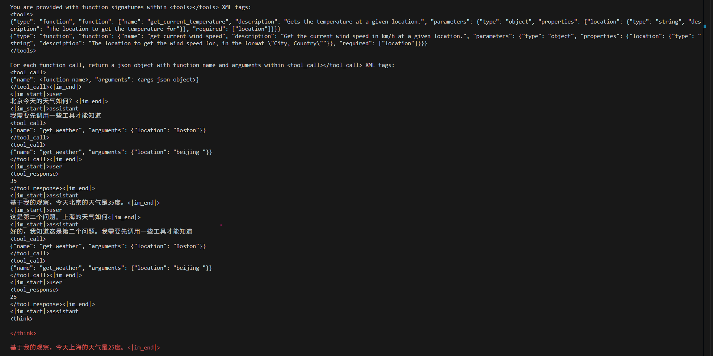

中间都不算 loss。

## 多轮有 think\+toolcall\+单用户输入

```SQL
{
  "messages": [
    {
      "role": "system",
      "content": "这是多轮有think+toolcall例子。只有一个用户 user 输入。只有一次真 user 输入 表示整个对话过程中只有 user message。此时中间的所有 think 过程都会保留"
    },
    {
      "role": "user",
      "content": "北京和上海今天的天气如何？"
    },
    {
      "role": "assistant",
      "content": "我需要先调用一些工具才能知道",
      "reasoning_content": "这是 reasoning_content 内容",
      "tool_calls": [
        {
          "id": "call_123",
          "type": "function",
          "function": {
            "name": "get_weather",
            "arguments": "{\"location\": \"Boston\"}"
          }
        },
        {
          "id": "call_456",
          "type": "function",
          "function": {
            "name": "get_weather",
            "arguments": "{\"location\": \"beijing \"}"
          }
        }
      ]
    },
    {
      "role": "tool",
      "content": "35"
    },
    {
      "role": "assistant",
      "content": "我现在知道北京的天气了，我需要继续知道上海的天气",
      "reasoning_content": "这是 reasoning_content 内容 2",
      "tool_calls": [
        {
          "id": "call_789",
          "type": "function",
          "function": {
            "name": "get_weather",
            "arguments": "{\"location\": \"shanghai\"}"
          }
        }
      ]
    },
    {
      "role": "tool",
      "content": "25"
    },
    {
      "role": "assistant",
      "content": "基于我的观察，今天北京的天气是35度，上海的天气是25度。"
    }
  ],
```

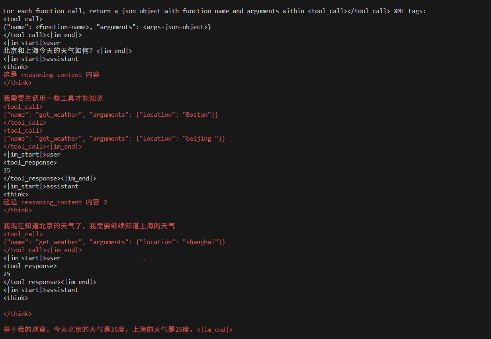

中间过程全保留。

## 多轮有 think\+toolcall\+多用户输入

```SQL
{
  "messages": [
    {
      "role": "system",
      "content": "这是多轮有think+toolcall例子。有多个用户 user 输入。一旦再次来了一个新的真 user 输入，则之前的 think 内容会全部丢掉，因为相当于是一次新的回话"
    },
    {
      "role": "user",
      "content": "北京今天天气如何？"
    },
    {
      "role": "assistant",
      "content": "我需要先调用一些工具才能知道",
      "reasoning_content": "这是 reasoning_content 内容 1",
      "tool_calls": [
        {
          "id": "call_123",
          "type": "function",
          "function": {
            "name": "get_weather",
            "arguments": "{\"location\": \"Boston\"}"
          }
        },
        {
          "id": "call_456",
          "type": "function",
          "function": {
            "name": "get_weather",
            "arguments": "{\"location\": \"beijing \"}"
          }
        }
      ]
    },
    {
      "role": "tool",
      "content": "35"
    },
    {
      "role": "assistant",
      "content": "基于我的观察，今天北京的天气是35度。"
    },
    {
      "role": "user",
      "content": "这是第二个问题。上海的天气如何？"
    },
    {
      "role": "assistant",
      "content": "现在是第二个问题了，我需要先调用一些工具才能知道",
      "reasoning_content": "这是 reasoning_content 内容 2",
      "tool_calls": [
        {
          "id": "call_789",
          "type": "function",
          "function": {
            "name": "get_weather",
            "arguments": "{\"location\": \"shanghai\"}"
          }
        }
      ]
    },
    {
      "role": "tool",
      "content": "25"
    },
    {
      "role": "assistant",
      "content": "基于我的观察，今天上海的天气是25度。"
    }
  ],
```

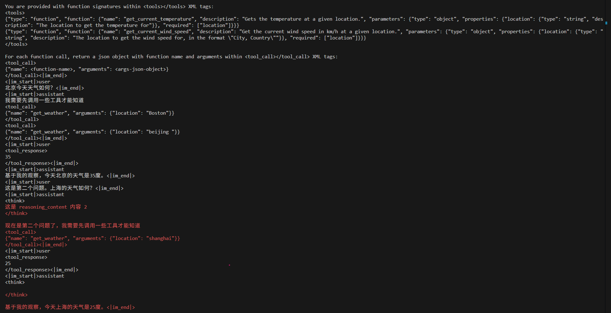

**第一个用户的 reasoning\_content 会清空，第二个用户的会保留。**

## 图片多模态

```JSON
{
  "messages": [
    {
      "role": "system",
      "content": "你是一个专业的图像分析助手，能够理解和分析多张图片。"
    },
    {
      "role": "user",
      "content": [
        {
          "type": "image",
          "image": "https://qianwen-res.oss-cn-beijing.aliyuncs.com/Qwen-VL/assets/demo.jpeg"
        },
        {
          "type": "image",
          "image": "https://qianwen-res.oss-cn-beijing.aliyuncs.com/Qwen-VL/assets/demo.jpeg"
        },
        {
          "type": "text",
          "text": "请描述这两张图片的内容，它们有什么相同点和不同点？"
        }
      ]
    },
    {
      "role": "assistant",
      "content": "我需要仔细对比两张图片的主体、背景、光线等要素。",
      "reasoning_content": "第一张图片和第二张图片的主体都是同一只猫，背景都是室内环境，光线也相似。它们的相同点是都展示了这只猫在窗台上休息的场景。不同点是第一张图片中猫的姿势是侧卧，而第二张图片中猫的姿势是仰卧。"
    },
    {
      "role": "user",
      "content": [
        {
          "type": "image",
          "image": "https://qianwen-res.oss-cn-beijing.aliyuncs.com/Qwen-VL/assets/demo.jpeg"
        },
        {
          "type": "text",
          "text": "这张新图片和之前的图片相比，有什么新的元素出现？"
        }
      ]
    },
    {
      "role": "assistant",
      "content": "与前两张图片相比，这张新图片中出现了不同的构图角度和新的视觉元素。"
    },
    {
      "role": "user",
      "content": [
        {
          "type": "text",
          "text": "综合以上三张图片，你认为它们想表达什么主题？"
        }
      ]
    },
    {
      "role": "assistant",
      "content": "需要从整体角度总结三张图片的共同叙事逻辑和情感表达。",
      "reasoning_content": "这三张图片共同表达了一个主题：猫在室内环境中的不同状态和情感。第一张图片展示了猫的安静和放松，第二张图片展示了猫的舒适和满足，而第三张图片则通过不同的构图和视觉元素，传达了猫在这个环境中的多样性和丰富性。整体上，这些图片共同描绘了猫在室内生活中的多样化表现，表达了对猫的喜爱和对其生活状态的关注。"
    }
  ]
}
```

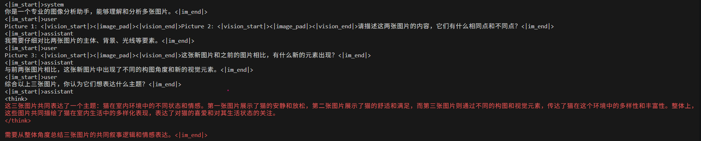

## 视频多模态

```JSON
{
  "messages": [
    {
      "role": "system",
      "content": "你是一个专业的视频分析助手，能够理解和分析多个视频内容。"
    },
    {
      "role": "user",
      "content": [
        {
          "type": "video",
          "video": "https://example.com/video/cooking_tutorial.mp4"
        },
        {
          "type": "video",
          "video": "https://example.com/video/cooking_result.mp4"
        },
        {
          "type": "text",
          "text": "请分析这两个视频，第一个视频是烹饪教程，第二个是最终成品。它们之间有什么联系？"
        }
      ]
    },
    {
      "role": "assistant",
      "content": "我需要仔细对比这两个视频的内容和逻辑关系。",
      "reasoning_content": "首先看第一个烹饪教程视频：视频展示了准备食材的过程，包括切菜、腌制肉类等步骤。然后是烹饪过程，展示了翻炒、调味等操作。最后视频展示了装盘。第二个成品视频展示了最终菜品的摆盘和特写镜头。两个视频的联系在于：第一个视频是制作过程，第二个视频是制作完成后的成品展示。它们共同构成了一个完整的从制作到呈现的叙事链条。"
    },
    {
      "role": "user",
      "content": [
        {
          "type": "video",
          "video": "https://example.com/video/failed_attempt.mp4"
        },
        {
          "type": "text",
          "text": "这里还有一个失败尝试的视频，和前两个相比有什么问题？"
        }
      ]
    },
    {
      "role": "assistant",
      "content": "让我对比分析这个失败案例与之前的成功案例。",
      "reasoning_content": "通过对比可以看出几个关键问题：首先，火候控制不当，视频中可以看到食材有些焦糊。其次，调味顺序有问题，盐放得太早导致食材出水过多。第三，翻炒的频率不够，导致受热不均匀。相比之下，第一个成功视频中火候掌握得当，调味时机准确，翻炒动作连贯。这些细节差异最终导致了截然不同的结果。"
    },
    {
      "role": "user",
      "content": [
        {
          "type": "text",
          "text": "基于这三个视频，总结一下成功烹饪这道菜的关键要点。"
        }
      ]
    },
    {
      "role": "assistant",
      "content": "需要从成功和失败的对比中提炼出关键要点。",
      "reasoning_content": "综合三个视频的分析，成功烹饪这道菜的关键要点包括：第一，火候控制是核心，需要保持中火避免焦糊；第二，调味顺序很重要，盐应在出锅前加入；第三，翻炒要频繁均匀，确保食材受热一致；第四，食材预处理要到位，切块的均匀度影响受热；第五，要有耐心，每个步骤都不能急于求成。失败视频恰恰反证了这些要点的重要性。"
    }
  ]
}
```

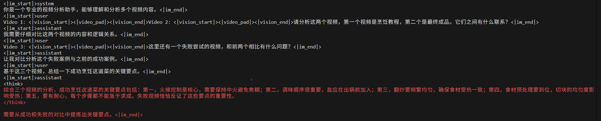

# Qwen3代码和测试数据

[vis\_qwen3\.py](图片和附件/vis_qwen3.py)

[tokenize\_data\_demo\.jsonl](图片和附件/tokenize_data_demo.jsonl)

# Qwen3\.5 结果说明

Toolcalls 里面的 arguments 必须是 dict。

在 toolcall 模式下，如果是非 think，中间的每个 assistant 都会加 \<think\>\\n\\n\</think\>\\n\\n 符号。这和 qwen3 是不一样的。

SFT 数据训练时候必须要和推理时候对齐。这是第一原则。而 Qwen3\.5 是同时支持 thinking 和 非 thinking 模式。因此从推理角度出发，如果这条 sft 数据是非 thinking 模型，那么就必须要用 enable\_thinking=False，否则是 True。这会显著影响哪些算 loss 哪些不算 loss。

**toolcall 场景下行为和非 toolcall 也不一样，需要仔细分析。**

是否一拆多在于区分round和turn这个概念。在多 turn 下都需要拆，最后一个 turn 的 round 下的think 保留。只要有多次真用户输入，那么就是多 turn。如果只有 1 次用户输入，其余都是工具返回输入，那依然是 one turn muilt round。

## 单轮无 think

```JSON
{
  "messages": [
    {
      "role": "system",
      "content": "这是单轮无think例子"
    },
    {
      "role": "user",
      "content": "这是第一个问题"
    },
    {
      "role": "assistant",
      "content": "我需要先调用一些工具才能知道"
    }
  ]
}
```

enable\_thinking=False

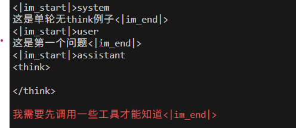

\<think\>\\n\\n\</think\>\\n\\n 是对话模板自动加的，因此不能算 loss。

## 单轮有 think

```JSON
{
  "messages": [
    {
      "role": "system",
      "content": "这是单轮有think例子"
    },
    {
      "role": "user",
      "content": "这是第一个问题"
    },
    {
      "role": "assistant",
      "content": "我需要先调用一些工具才能知道",
      "reasoning_content": "这是 reasoning_content 内容"
    }
  ]
}
```

enable\_thinking=True

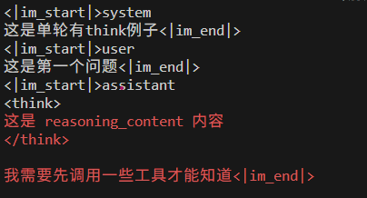

在 thinking 模式下，对话模板会自动加 \<think\>\\n，因此这部分不算 loss。

## 多轮无 think\- 一拆多

```JSON
{
  "messages": [
    {
      "role": "system",
      "content": "这是多轮无think例子"
    },
    {
      "role": "user",
      "content": "这是第一个问题"
    },
    {
      "role": "assistant",
      "content": "我需要先调用一些工具才能知道"
    },
    {
      "role": "user",
      "content": "这是第二个问题"
    },
    {
      "role": "assistant",
      "content": "好的，我知道这是第二个问题"
    }
  ]
}
```

这个 case 比较特殊。全程都是非 thinking 模式。我们需要从模型生成角度思考。


**着色部分是表示模型返回。**

第一轮：

```Python
<|im_start|>system
这是多轮无think例子<|im_end|>
<|im_start|>user
这是第一个问题<|im_end|>
<|im_start|>assistant
<think>

</think>
我需要先调用一些工具才能知道
```


第二轮

```Python
<|im_start|>system
这是多轮无think例子<|im_end|>
<|im_start|>user
这是第一个问题<|im_end|>
<|im_start|>assistant
我需要先调用一些工具才能知道<|im_end|>
<|im_start|>user
这是第二个问题<|im_end|>
<|im_start|>assistant
<think>

</think>
好的，我知道这是第二个问题
```

可以发现，第二轮时候会出现类似压缩的情况。此时对于 SFT 来说，拿到的数据是第二轮的数据。**如果强行训练会出现训推不一致问题。并且会带来一个问题：第一轮的输出要不要算 loss？**


如果要严格对齐，实际训练做法是拆分 2 条数据。也就是上面是 2 条独立数据。每条数据只是着色部分算 loss。

但是这样会产生大量数据，因此需要权衡。


为了灵活，现在支持指定 loss 参数来设定。默认就是都算 loss。因此默认结果如下：

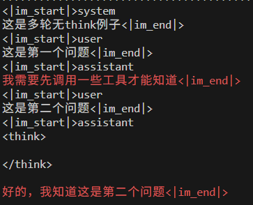

## 多轮有 think\- 一拆多

错误数据

```JSON
{
  "messages": [
    {
      "role": "system",
      "content": "这是多轮有think例子"
    },
    {
      "role": "user",
      "content": "这是第一个问题"
    },
    {
      "role": "assistant",
      "content": "我需要先调用一些工具才能知道",
      "reasoning_content": "这是 reasoning_content 内容"
    },
    {
      "role": "user",
      "content": "这是第二个问题"
    },
    {
      "role": "assistant",
      "content": "好的，我知道这是第二个问题"
    }
  ]
}
```

这个数据在 qwen3\.5 上是不合规的，不可能有这种数据。

```JSON
{
  "messages": [
    {
      "role": "system",
      "content": "这是多轮有think例子"
    },
    {
      "role": "user",
      "content": "这是第一个问题"
    },
    {
      "role": "assistant",
      "content": "我需要先调用一些工具才能知道",
    },
    {
      "role": "user",
      "content": "这是第二个问题"
    },
    {
      "role": "assistant",
      "content": "好的，我知道这是第二个问题"，
      "reasoning_content": "这是 reasoning_content 内容"
    }
  ]
}
```

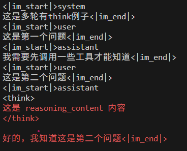

这里也存在1拆多问题。因为既然是 thinking 模式，那么必然会有 reasoning\_content，即使他是空内容。所以上面的数据应该是第2轮的数据。第一轮没有写出来。

**如果中间也有 reasoning\_content 则会清空。**


注意： **如果只是提供上面这种数据，你想 一拆多也做不了，因为中间 reasoning\_content 被删了，你拿不到的。如果 sft 想一拆多，那么必须要中间的 reasoning\_content 内容。**

## 单轮无 think\+toolcall

```SQL
{
  "id": 7,
  "messages": [
    {
      "role": "system",
      "content": "这是单轮无think+toolcall例子"
    },
    {
      "role": "user",
      "content": "北京今天的天气如何？"
    },
    {
      "role": "assistant",
      "content": "我需要先调用一些工具才能知道",
      "tool_calls": [
        {
          "id": "call_123",
          "type": "function",
          "function": {
            "name": "get_weather",
            "arguments": {
              "location": "Boston"
            }
          }
        }
      ]
    },
    {
      "role": "tool",
      "content": "35"
    },
    {
      "role": "assistant",
      "content": "基于我的观察，今天北京的天气是35度。"
    }
  ],
  "tools": [
    {
      "type": "function",
      "function": {
        "name": "get_current_temperature",
        "description": "Gets the temperature at a given location.",
        "parameters": {
          "type": "object",
          "properties": {
            "location": {
              "type": "string",
              "description": "The location to get the temperature for"
            }
          },
          "required": [
            "location"
          ]
        }
      }
    },
    {
      "type": "function",
      "function": {
        "name": "get_current_wind_speed",
        "description": "Get the current wind speed in km/h at a given location.",
        "parameters": {
          "type": "object",
          "properties": {
            "location": {
              "type": "string",
              "description": "The location to get the wind speed for, in the format \"City, Country\""
            }
          },
          "required": [
            "location"
          ]
        }
      }
    }
  ]
}
```

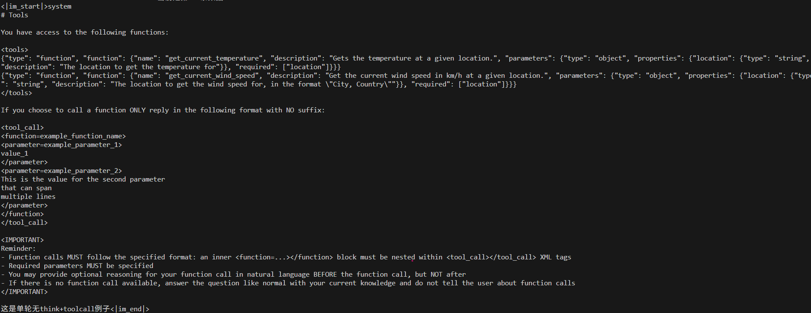

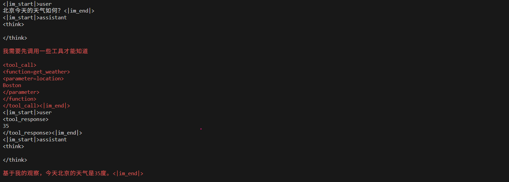

在 toolcall 场景下，单轮无 think 和非 toolcall 是不一样的。实际上应该对比多轮无 think 场合。可以发现中间每一个 assistant 都会加 \<think\>\\n\\n\</think\>\\n\\n。并且是算 loss 的。


这种情况下，默认中间是会算 loss 的，不过也可以配置。

## 单轮有 think\+toolcall

```SQL
{
  "id": 8,
  "messages": [
    {
      "role": "system",
      "content": "这是单轮有think+toolcall例子"
    },
    {
      "role": "user",
      "content": "北京今天的天气如何？"
    },
    {
      "role": "assistant",
      "content": "我需要先调用一些工具才能知道",
      "tool_calls": [
        {
          "id": "call_123",
          "type": "function",
          "function": {
            "name": "get_weather",
            "arguments": {
              "location": "Boston"
            }
          }
        }
      ]
    },
    {
      "role": "tool",
      "content": "35"
    },
    {
      "role": "assistant",
      "content": "基于我的观察，今天北京的天气是35度。",
      "reasoning_content": "这是 reasoning_content 内容"
    }
  ],
  "tools": []
}
```

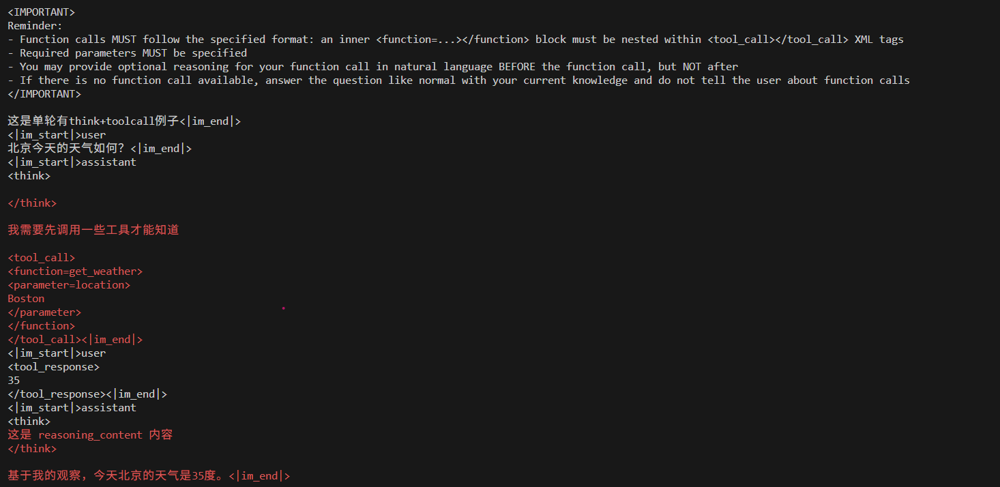

上面数据看起来是错的。因为从 apply\_chat\_template 来看，这个是 think 模式，中间居然穿插了非 think 模式。这种不可能在推理生成时候出现的，但是实际上是对的。因为在 toolcall 情况下，如果中间没有 reasoning\_content 就会当作 "" 字符串填充。所以和下面结果等价。

这么设计应该是和 interleave thinking 相关。训练推理是一致的。

```JSON
{
  "id": 8,
  "messages": [
    {
      "role": "system",
      "content": "这是单轮有think+toolcall例子"
    },
    {
      "role": "user",
      "content": "北京今天的天气如何？"
    },
    {
      "role": "assistant",
      "content": "我需要先调用一些工具才能知道",
      "reasoning_content": ""，
      "tool_calls": [
        {
          "id": "call_123",
          "type": "function",
          "function": {
            "name": "get_weather",
            "arguments": {
              "location": "Boston"
            }
          }
        }
      ]
    },
    {
      "role": "tool",
      "content": "35"
    },
    {
      "role": "assistant",
      "content": "基于我的观察，今天北京的天气是35度。",
      "reasoning_content": "这是 reasoning_content 内容"
    }
  ],
  "tools": []
}
```

如果中间真的有 reasoning\_content，则结果如下：

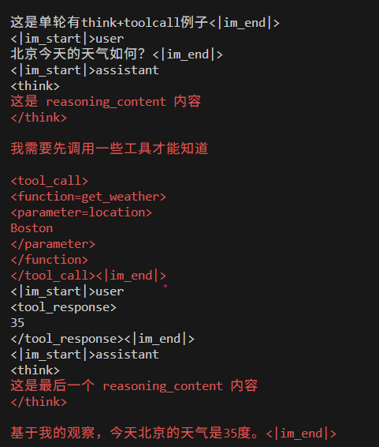

## 多轮无 think\+toolcall\- 一拆多

```JSON
{
  "id": 10,
  "messages": [
    {
      "role": "system",
      "content": "这是多轮无think+toolcall例子"
    },
    {
      "role": "user",
      "content": "北京今天的天气如何？"
    },
    {
      "role": "assistant",
      "content": "我需要先调用一些工具才能知道",
      "tool_calls": [
        {
          "id": "call_123",
          "type": "function",
          "function": {
            "name": "get_weather",
            "arguments": {
              "location": "Boston"
            }
          }
        }
      ]
    },
    {
      "role": "tool",
      "content": "35"
    },
    {
      "role": "assistant",
      "content": "基于我的观察，今天北京的天气是35度。"
    },
    {
      "role": "user",
      "content": "这是第二个问题。上海的天气如何"
    },
    {
      "role": "assistant",
      "content": "好的，我知道这是第二个问题。我需要先调用一些工具才能知道",
      "tool_calls": [
        {
          "id": "call_789",
          "type": "function",
          "function": {
            "name": "get_weather",
            "arguments": {
              "location": "shanghai"
            }
          }
        }
      ]
    },
    {
      "role": "tool",
      "content": "25"
    },
    {
      "role": "assistant",
      "content": "基于我的观察，今天上海的天气是25度。"
    }
  ],
  "tools": [
    {
```

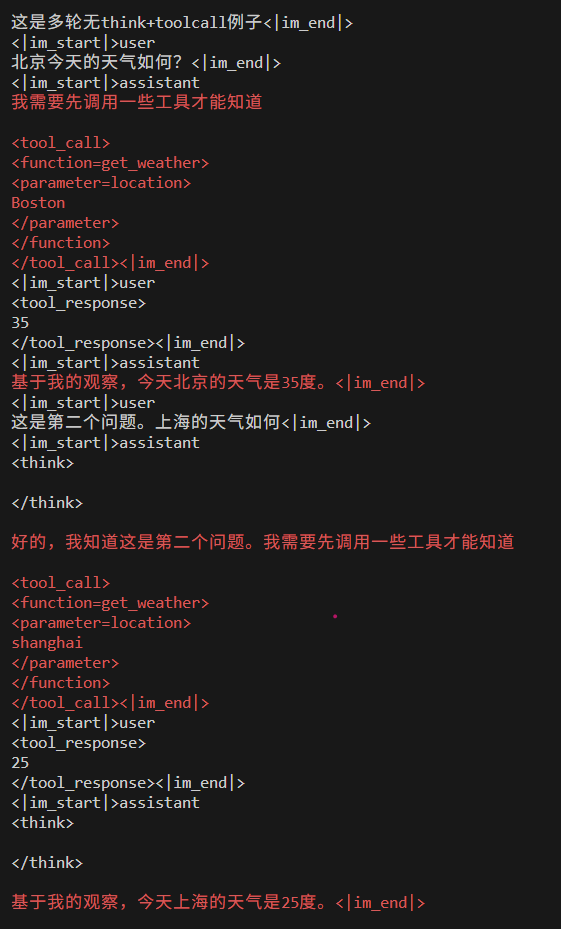

**这个也存在一拆多问题，否则有训练推理不一致问题。**

## 多轮有 think\+toolcall\+单用户输入

```JSON
{
  "id": 11,
  "messages": [
    {
      "role": "system",
      "content": "这是多轮有think+toolcall例子。只有一个用户 user 输入。只有一次真 user 输入 表示整个对话过程中只有 user message。此时中间的所有 think 过程都会保留"
    },
    {
      "role": "user",
      "content": "北京和上海今天的天气如何？"
    },
    {
      "role": "assistant",
      "content": "我需要先调用一些工具才能知道",
      "reasoning_content": "这是 reasoning_content 内容",
      "tool_calls": [
        {
          "id": "call_123",
          "type": "function",
          "function": {
            "name": "get_weather",
            "arguments": {
              "location": "Boston"
            }
          }
        }
      ]
    },
    {
      "role": "tool",
      "content": "35"
    },
    {
      "role": "assistant",
      "content": "我现在知道北京的天气了，我需要继续知道上海的天气",
      "reasoning_content": "这是 reasoning_content 内容 2",
      "tool_calls": [
        {
          "id": "call_789",
          "type": "function",
          "function": {
            "name": "get_weather",
            "arguments": {
              "location": "shanghai"
            }
          }
        }
      ]
    },
    {
      "role": "tool",
      "content": "25"
    },
    {
      "role": "assistant",
      "content": "基于我的观察，今天北京的天气是35度，上海的天气是25度。"
    }
  ],
  "tools": [
    {
```

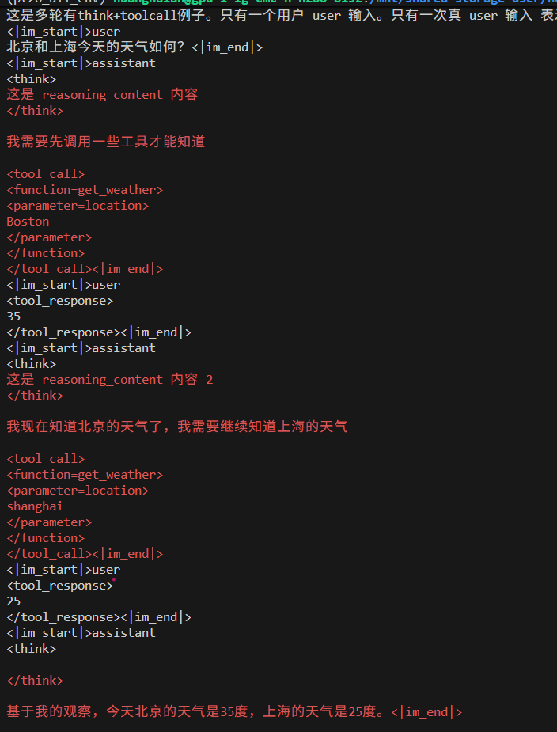

注意：在 toolcall 场景下，reason\_content 不管有没有，都当作有来处理的，只不过是空字符串。


这个没有啥争议，不需要一拆多。

## 多轮有 think\+toolcall\+多用户输入 \- 一拆多

```JSON
{
  "id": 12,
  "messages": [
    {
      "role": "system",
      "content": "这是多轮有think+toolcall例子。有多个用户 user 输入。一旦再次来了一个新的真 user 输入，则之前的 think 内容会全部丢掉，因为相当于是一次新的回话"
    },
    {
      "role": "user",
      "content": "北京今天天气如何？"
    },
    {
      "role": "assistant",
      "content": "我需要先调用一些工具才能知道",
      "reasoning_content": "这是 reasoning_content 内容 1",
      "tool_calls": [
        {
          "id": "call_123",
          "type": "function",
          "function": {
            "name": "get_weather",
            "arguments": {
              "location": "Boston"
            }
          }
        }
      ]
    },
    {
      "role": "tool",
      "content": "35"
    },
    {
      "role": "assistant",
      "content": "基于我的观察，今天北京的天气是35度。"
    },
    {
      "role": "user",
      "content": "这是第二个问题。上海的天气如何？"
    },
    {
      "role": "assistant",
      "content": "现在是第二个问题了，我需要先调用一些工具才能知道",
      **"reasoning_content": "这是 reasoning_content 内容 2",**
      "tool_calls": [
        {
          "id": "call_789",
          "type": "function",
          "function": {
            "name": "get_weather",
            "arguments": {
              "location": "shanghai"
            }
          }
        }
      ]
    },
    {
      "role": "tool",
      "content": "25"
    },
    {
      "role": "assistant",
      "content": "基于我的观察，今天上海的天气是25度。"
    }
  ],
  "tools": [
```

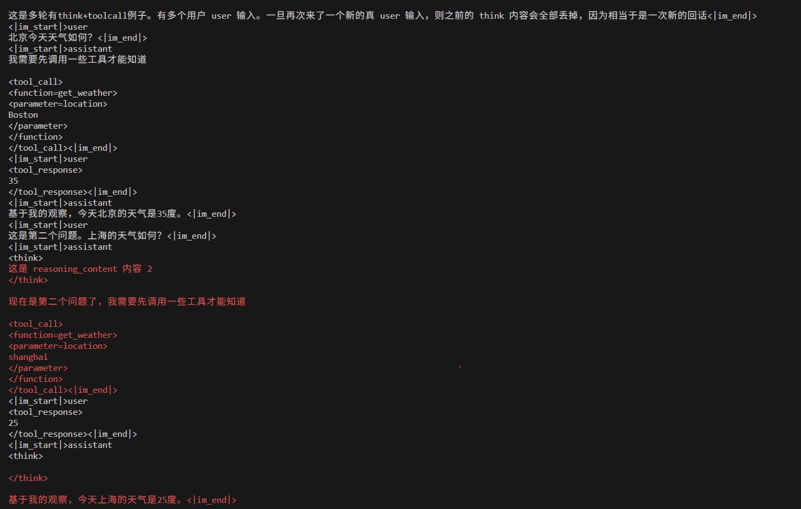

第一个用户的 reason\_content 会去掉。这个要一拆多，否则有不一致问题。

Qwen3\.5 测试数据

[qwen3\_5\_tokenize\_data\.jsonl](图片和附件/qwen3_5_tokenize_data.jsonl)


