# Qwen Image

# Qwen Image

https://qwen\.ai/blog?id=qwen\-image

https://arxiv\.org/abs/2508\.02324

我们引入了一种改进的多任务训练范式，它不仅包含传统的文本到图像（T2I）和文本\-图像到图像（TI2I）任务，还包括图像到图像（I2I）重建任务，从而有效地对齐了 Qwen2\.5\-VL 和 MMDiT 之间的潜在表征。此外，我们将原始图像分别输入到 Qwen2\.5\-VL 和 VAE 编码器中，以分别获得语义表征和重建表征。这种双编码机制使编辑模块能够在保持语义一致性和维持视觉保真度之间取得平衡。


但仍然存在两个关键挑战。首先，对于文本到图像生成，将模型输出与复杂、多方面的提示词对齐仍然是一个重大障碍。我们的评估表明，即使是最先进的商业模型，如 GPT Image 1 \(OpenAI, 2025\) 和 Seedream 3\.0 \(Gao et al\., 2025\)，在面对需要多行文本渲染、非字母语言渲染（例如中文）、局部文本插入或文本与视觉元素无缝集成等任务时也会遇到困难。

其次，对于图像编辑，在编辑输出与原始图像之间实现精确对齐面临双重挑战：\(i\) 视觉一致性，即只应修改目标区域，同时保留所有其他视觉细节（例如，改变头发颜色而不改变面部细节）；\(ii\) 语义连贯性，即在结构变化期间必须保持全局语义（例如，修改人物姿势的同时保持身份和场景的连贯性）。


为了应对图像对齐的挑战，我们提出了一个增强的多任务学习框架，在共享的潜在空间中无缝集成了 T2I、I2I 和 TI2I 目标。具体而言，输入图像被编码为两种不同但互补的特征表征：语义特征通过 Qwen\-VL \(Bai et al\., 2025\) 提取，捕获高层次的场景理解和上下文含义；而重建特征则通过 VAE 编码器获得，保留低层次的视觉细节。然后，这两组特征被联合输入到 MMDiT 架构 \(Esser et al\., 2024\) 中作为条件信号。这种双条件设计使模型能够同时保持语义连贯性和视觉一致性。


为了确保大规模训练的效率和稳定性，我们设计了一个利用 TensorPipe 进行分布式数据加载和预处理的生产者\-消费者框架。生产者处理诸如 VAE 编码和数据 I/O 等预处理任务，而消费者则专注于使用 Megatron \(Shoeybi et al\., 2019\) 框架进行分布式模型训练。我们还实现了广泛的监控工具，以确保在整个大规模训练过程中具有可靠的收敛性和调试能力。

## 架构

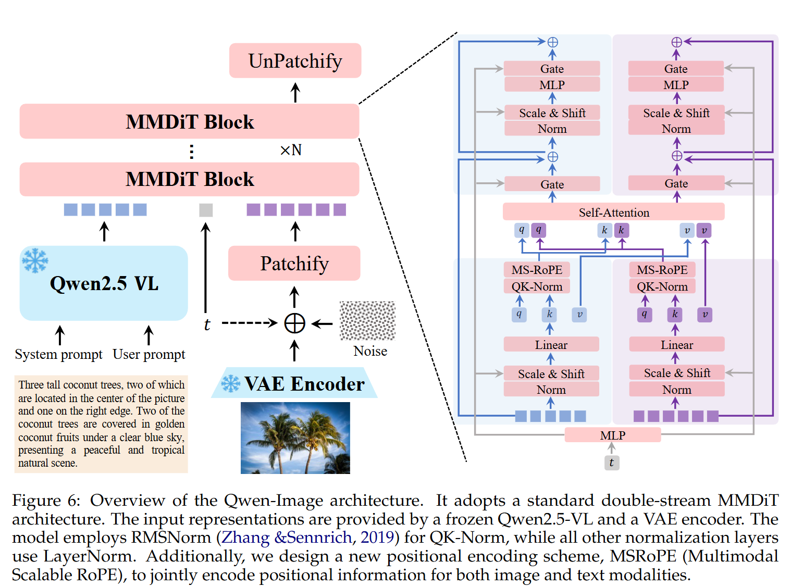

Qwen2\.5 VL 是 7b，而 MMDiT 是 20b，假设其余小的 vae encode 和 decode。

首先，多模态大语言模型（MLLM）作为条件编码器，负责从文本输入中提取特征。其次，变分自编码器（VAE）作为图像分词器，将输入图像压缩为紧凑的潜在表征，并在推理期间将其解码回来。第三，多模态扩散 Transformer（MMDiT）作为主干扩散模型，在文本引导下对噪声和图像潜在表征之间的复杂联合分布进行建模。


Qwen\-Image 采用 Qwen2\.5\-VL 模型 \(Bai et al\., 2025\) 作为文本输入的特征提取模块，基于三个关键原因：

\(1\) Qwen2\.5\-VL 的语言空间和视觉空间已经对齐，这使得它比基于语言的模型更适合文本到图像任务；

\(2\) Qwen2\.5\-VL 保持了强大的语言建模能力，与语言模型相比没有显著退化；

\(3\) Qwen2\.5\-VL 支持多模态输入，从而使 Qwen\-Image 能够解锁更广泛的功能，例如图像编辑 \(Labs et al\., 2025\)。

设 x 和 y 分别表示图像和文本输入。给定用户输入（如提示词和图像），我们采用 Qwen2\.5\-VL 模型来提取特征。为了更好地指导模型生成精细的表征潜变量，同时考虑到不同任务中输入模态的变化，我们分别为纯文本输入和文本\-图像输入设计了不同的系统提示词。最后，我们利用 Qwen2\.5\-VL 语言模型主干最后一层隐藏状态的潜变量作为用户输入的表征。

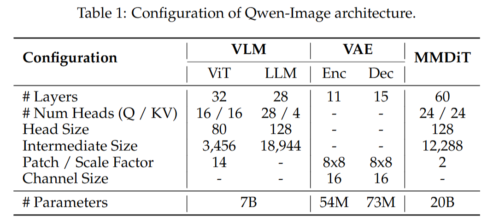

### Variational AutoEncoder

强大的 VAE 表征对于构建强大的图像基础模型至关重要。当前的图像基础模型通常使用 2D 卷积在海量图像数据集上训练图像 VAE，以获得高质量的图像表征。相比之下，我们的工作旨在开发一种与图像和视频都兼容的更通用的视觉表征。然而，现有的图像\-视频联合 VAE，如 Wan\-2\.1\-VAE \(Wan et al\., 2025\)，通常会遭遇性能权衡，导致图像重建能力下降。为此，我们采用单编码器、双解码器架构。这种设计利用了一个与图像和视频都兼容的共享编码器，以及针对每种模态的独立专用解码器，这使得我们的图像基础模型能够作为未来视频模型的主干。具体而言，我们采用 Wan\-2\.1\-VAE 的架构，冻结其编码器，并仅微调图像解码器。


为了增强重建保真度，特别是对于小文本和精细细节，我们在内部文本丰富的图像语料库上训练解码器。该数据集由真实世界的文档（PDF、PowerPoint 幻灯片、海报）以及合成段落组成，涵盖字母文字（如英语）和表意文字（如中文）语言。在训练过程中，我们观察到：

\(1\) 平衡重建损失与感知损失可以有效减少网格伪影，这种伪影经常出现在灌木等重复纹理中。

\(2\) 随着重建质量的提高，对抗损失变得无效，因为判别器无法提供有效的指导。

基于这些观察，我们仅使用重建损失和感知损失，在微调期间动态调整它们的比例。有趣的是，我们发现仅微调解码器就能有效增强细节并改善小文本的渲染，从而为 Qwen\-Image 的文本渲染能力奠定坚实基础。

### Multimodal Diffusion Transformer

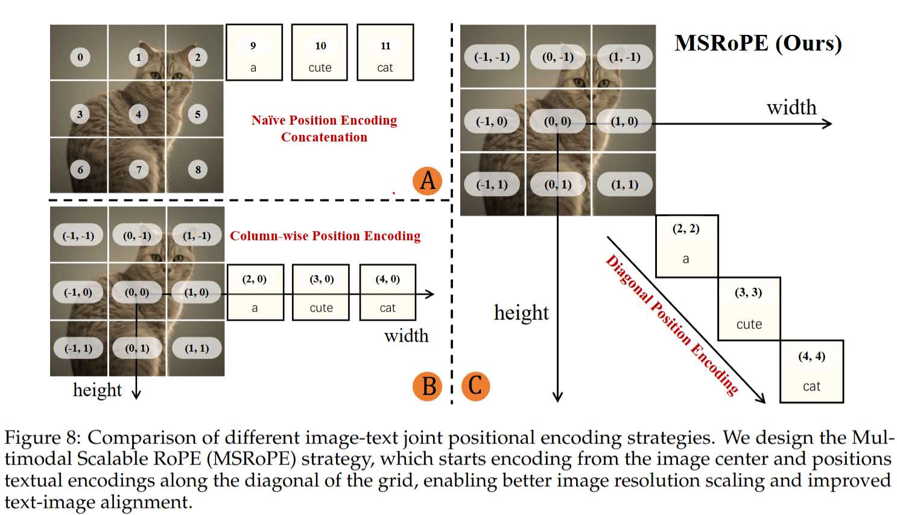

在每个块中，我们引入了一种新颖的位置编码方法：多模态可扩展 RoPE（MSRoPE）。如图 8 所示，我们比较了各种文本\-图像联合位置编码策略。在传统的 MMDiT 块中，文本标记直接连接在展平的图像位置嵌入之后。此外，Seedream 3\.0 \(Gao et al\., 2025\) 引入了缩放 RoPE，其中图像位置编码被移动到图像的中心区域，文本标记被视为形状为 \[1, L\] 的 2D 标记。然后，使用 2D RoPE \(Heo et al\., 2024\) 进行图像\-文本联合位置编码。尽管这种调整有助于分辨率缩放训练，但文本和图像的某些位置编码行（例如，图 8 \(B\) 中第 0 个中间行）变得同构，使得模型更难区分第 0 个中间行中的文本标记和图像潜在标记\(从图片看不出来，因为看起来坐标是不同的，可能和 seedream 算法设计相关\)。然而，确定一个合适的图像行来连接文本标记也并非易事。

为了解决上述挑战，我们引入了多模态可扩展 RoPE（MSRoPE）。在这种方法中，文本输入被视为 2D 张量，在两个维度上应用相同的位置 ID。如图 8 \(C\) 所示，文本在概念上被视为沿图像对角线连接。这种设计使 MSRoPE 能够在图像端利用分辨率缩放优势，同时在文本端保持与 1D\-RoPE 的功能等效性，从而避免了需要确定文本的最优位置编码。我们在表 1 中展示了 Qwen\-Image 的架构和配置。

## Training

We adopt a flow matching training objective to pre\-train Qwen\-Image, which facilitates stable learning
dynamics via ordinary differential equations \(ODEs\) while preserving equivalence to the maximum
likelihood objective


### Flow Matching

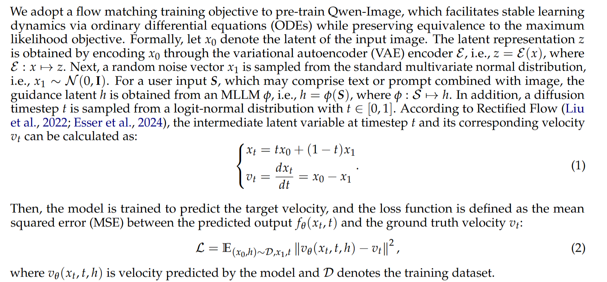

学习的去噪的过程。是时间步反向过程。正向是随着时间步慢慢加噪，训练过程是反向时间步慢慢去噪。模型输出预测的是当前噪声水平下的速度场。

训练过程是： 首先准备真实图片 x\_0，准备一个随机噪声产生器，从 t=0 开始，慢慢加噪，假设加噪 50 步，那么就可以得到 50 个带噪的 x\_t，而且 t 越大加的噪声就越大。训练过程是，给定任何一个 x\_t，预测出上一时刻的 x\_\(t\-1\)，所以对于一个样本，实际训练样本是扩大了 t 倍。实际上预测的是当前时间步相对于真实数据的速度场。

在推理时候，就可以自动从 t 超级大 \-\> 0 过程中慢慢得到真实数据。

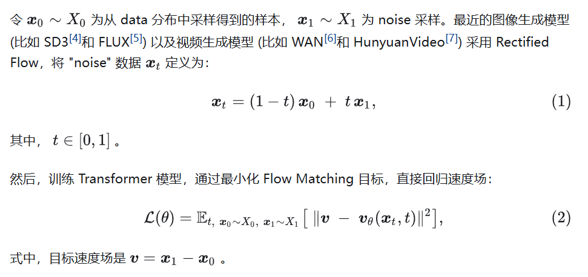


**Flow Matching（流匹配）** 是一种教 AI 怎么把“一团乱糟糟的噪点”变成“一张清晰图像”的高效训练方法。

目前最火的画图模型（比如 **Flux\.1、Stable Diffusion 3**）都在用这个技术。

为了让你听懂，我们用一个 **“星际旅行”** 的例子来打比方。

#### 核心目标：从“废土”到“绿洲”

想象一下：

- **起点（A点）**：是一片混乱的**高斯噪声**（就像电视机的雪花屏），我们叫它“噪声星球”。

- **终点（B点）**：是一张**清晰的图片**（比如一只猫），我们叫它“猫咪星球”。

**图像生成的任务**：就是造一艘飞船，载着数据粒子，从 A 点（噪声）飞到 B 点（图片）。


#### 以前的方法（扩散模型 Diffusion）是怎么飞的？

在 Flow Matching 流行之前，我们主要用**扩散模型**。
扩散模型的逻辑是：先把一张好图一点点加噪声破坏掉（变成A），然后让 AI 学习怎么“反悔”，一步步把噪声去掉回到 B。

- **问题**：扩散模型的飞行路径往往是**弯弯曲曲的**，甚至是抖动的。因为它是通过“去噪”来还原，就像在大雾里摸索，虽然最终能到，但走了很多弯路。

- **后果**：生成图片时需要走很多步（比如 50 步、100 步），速度慢。

#### Flow Matching 是怎么飞的？

Flow Matching 换了一种思路。它不说“去噪”，它说：**“既然我知道起点（噪声）和终点（真图），我为什么不直接画一条直线飞过去？”**

这就是 Flow Matching 的精髓：**拉直路径**。

#### 它是怎么训练的？（三个步骤）


**第一步：确定两头**
系统随机拿出一张真图（猫）作为终点，再随机生成一团噪声作为起点。

**第二步：人为画一条线（Flow）**
我们在数学上强行定义一条路径：从这团噪声到这张图，最简单的路径就是**直线**（或者叫最优传输路径）。这就好比我们在星际地图上画了一条笔直的航线。

- *注意：这时候还不需要 AI 预测，这是我们设定的“标准答案”。*

**第三步：训练 AI 当“领航员” \(Matching\)**
现在，我们把 AI（通常是一个 Transformer 模型）放到这条航线的任意一个位置上，问它：

> “嘿，我现在在这个位置（比如行程的 30% 处），为了沿着这条直线飞到终点，我现在的 **速度和方向（Velocity）** 应该是多少？”
> 
> 

- **训练目标**：让 AI 预测的“飞行方向”，必须和我们刚才画的那条“直线航线”的方向一模一样。这就是 **Matching（匹配）**。


#### 为什么 Flow Matching 更好？

一旦 AI 训练好了，它就学会了在任何位置该往哪里“飞”。

当我们真正要生成图片时（推理阶段）：

1. 我们给 AI 一团随机噪声。

2. AI 说：“根据我学的，往这个方向走就是直线。”

3. 因为路径是**直**的（或者接近直的），AI 只需要走很少的几步（比如 20 步甚至更少），就能非常顺滑地从噪声“流”（Flow）向图片。

#### 总结

- **传统扩散**：像是在森林里迷路了，靠着指南针一步步试探，路线蜿蜒曲折，走得累（步数多）。

- **Flow Matching**：像是修了一条高速公路，训练 AI 记住这条路的方向。开车时直接一脚油门沿着直线跑，又快又稳。

所以，Flow Matching 的最大优势就是：**生成质量高，且生成速度更快（需要的步数更少）。**


其余理解方式：

概率流在物理学里的核心作用就是**它解释了为什么某个地方的概率密度会随时间变化**。 简单说就是：**某个点概率密度的增加或减少，等于流入该点的概率减去流出的概率（考虑方向）。这被称为连续性方程（Continuity Equation）**。举例来说：水管某一段的水位（水量）变化，等于流入这段水管的水减去流出的水。

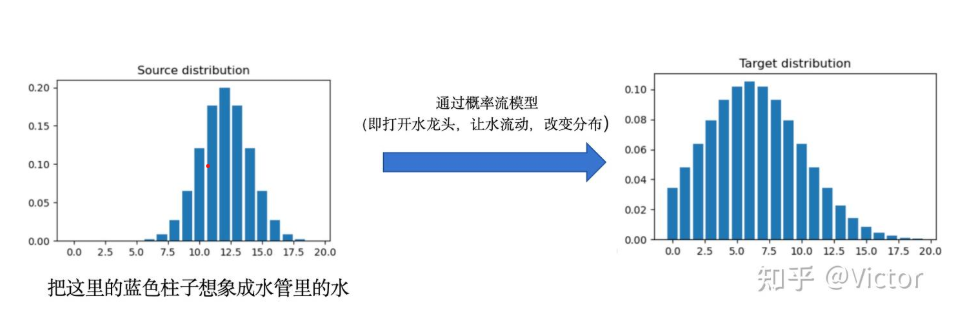

或者简单来说，给定一个正态分布，然后给每个点施加一个随时间 t 改变的速度\(包括方向和速率\)，随着时间流动，最终会将正态分布流动为我们想要的任何分布。


https://zhuanlan\.zhihu\.com/p/28731517852

https://zhuanlan\.zhihu\.com/p/16113190076

假如你学骑自行车，目标是从家里骑到学校（终点）。刚开始你会晃来晃去（随机噪声），但是你不断调整方向和速度（流动的校正），最终找到一条平稳的路径抵达学校。Flow Matching 就是在训练“骑车路径校正器”，让你的骑行过程更加流畅，尽量避免偏离目标路线。

Flow Matching 的目的是让模型学会一个流场（vector field），这个流场定义了数据从起点（比如噪声分布）到终点（目标分布）如何逐步变化的方式。

```Python
import torch
import torch.nn as nn
import matplotlib.pyplot as plt
import numpy as np

# 超参数
dim = 2   # 数据维度（2D点）
num_samples = 1000
num_steps = 50  # ODE求解步数
lr = 1e-3
epochs = 5000

# 目标分布：正弦曲线上的点（x1坐标）
x1_samples = torch.rand(num_samples, 1) * 4 * torch.pi  # 0到4π (1000,1)
y1_samples = torch.sin(x1_samples)                      # y=sin(x)
target_data = torch.cat([x1_samples, y1_samples], dim=1) # shape (1000,2)

# 噪声分布：高斯噪声（x0坐标）
noise_data = torch.randn(num_samples, dim) * 2  # shape (1000,2)

class VectorField(nn.Module):
    def __init__(self):
        super().__init__()
        self.net = nn.Sequential(
            nn.Linear(dim + 1, 64),  # 输入维度: x (2) + t (1) = 3
            nn.ReLU(),
            nn.Linear(64, dim)
        )
  
    def forward(self, x, t):
        # 直接拼接x和t（t的形状需为(batch_size, 1)）
        return self.net(torch.cat([x, t], dim=1))
        
model = VectorField()
optimizer = torch.optim.Adam(model.parameters(), lr=lr)

for epoch in range(epochs):
    # 随机采样噪声点和目标点
    idx = torch.randperm(num_samples)
    x0 = noise_data[idx]  # 起点：噪声 shape (1000,2)
    x1 = target_data[idx] # 终点：正弦曲线

    # 时间t的形状为 (batch_size, 1)
    t = torch.rand(x0.size(0), 1)  # 例如：shape (1000, 1)
  
    # 线性插值生成中间点
    xt = (1 - t) * x0 + t * x1
  
    # 模型预测向量场（直接传入t，无需squeeze）
    vt_pred = model(xt, t)  # t的维度保持不变 shape (1000,2)
  
    # 目标向量场：x1 - x0
    vt_target = x1 - x0 # shape (1000,2)
  
    # 损失函数
    loss = torch.mean((vt_pred - vt_target)**2)
  
    # 反向传播
    optimizer.zero_grad()
    loss.backward()
    optimizer.step()

# 开始生成轨迹
x = noise_data[0:1]  # 选择初始噪声点进行轨迹生成
trajectory = [x.detach().numpy()]

tag = torch.from_numpy(np.array([1]))
# 数值求解ODE（欧拉法）
t = 0
delta_t = 1 / num_steps # 步数太多和太少都可能影响效果
with torch.no_grad():
    for i in range(num_steps):
        vt = model(x, torch.tensor([[t]], dtype=torch.float32))
        t += delta_t
        x = x + vt * delta_t  # x(t+Δt) = x(t) + v(t)Δt
        trajectory.append(x.detach().numpy())

trajectory = torch.tensor(trajectory).squeeze()

print(trajectory[-1] / (torch.pi / 10 * 4))

# 绘制向量场和生成轨迹
plt.figure(figsize=(10, 5))
plt.scatter(target_data[:,0], target_data[:,1], c='blue', label='Target (sin(x))')
plt.scatter(noise_data[:,0], noise_data[:,1], c='red', alpha=0.3, label='Noise')
plt.plot(trajectory[:,0], trajectory[:,1], 'g-', linewidth=2, label='Generated Path')
plt.legend()
plt.title("Flow Matching: From Noise to Target Distribution")
plt.savefig("flow_matching_demo.png")
```

训练过程是希望图片1000 个红色点，都能通过 t 时间步预测到达蓝色点。因为训练数据一开始就随机定好了， 1000 个红点对应 1000 个蓝点，训练目标就是每个红点到蓝点的速度方向。

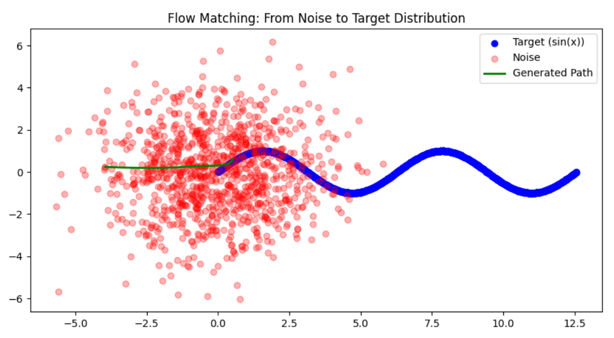

上面例子比较简单，生成时候步数很关键，如下图，可能是步骤不够导致还没有达到蓝色目标点就停止了，也可以是步数太多了，导致过了蓝色点。可以查看当前红点对应的训练正式 target 是哪个来确定。

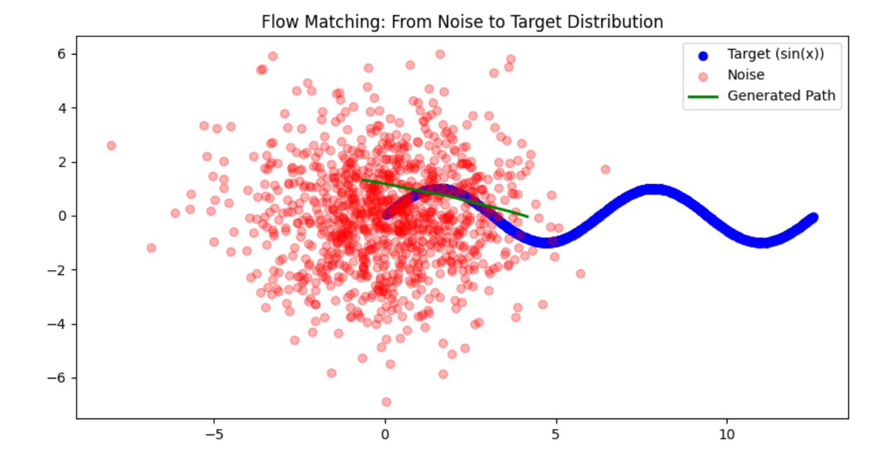

有一个点希望明确：

Flow Matching算法，要学的是一个行驶（修正）的方向，即，如果我有一个点，可以移动，我该怎么走，才能走到目标点上

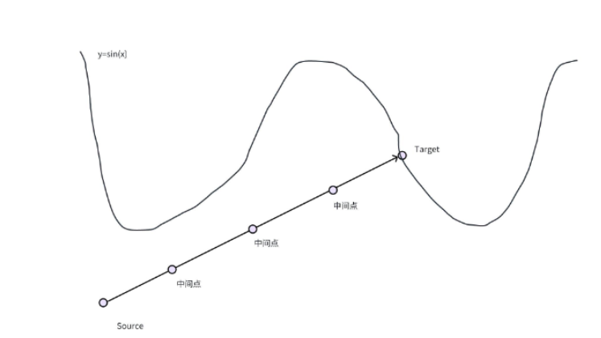

上述这种训练方式会出现某个中间点会在多组 source \-\> target 交叉了。也就是说在训练过程中会出现某个时间步中间点的速度方向有很多方向。那么这种情况下学到的实际上是均值方向。

在推理时候，因为生成本来就是不完全可控的。会导致给定任意一个 source 时候，经过某个中间点，然后中间点的方向是训练时候的均值方向，但是因为训练是收敛的，会导致不管取多少均值方向，最终会越坍缩到某个固定的状态，最终走到某个与目标集相近的样本上。


可以发现这个“理想环境”下，输入确定或者说噪声和 prompt 确定情况下，计算路径确定，**输出结果必然是像素级完全一致的**。这也是为什么我们在网上分享 AI 绘画时，只要发给别人“Seed（种子）”和参数，别人就能复现出一模一样的图。

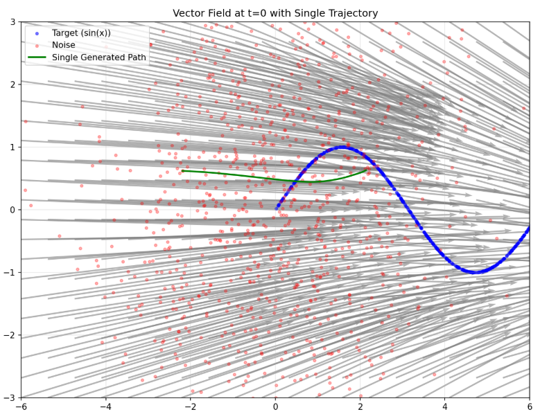

这个图是 t=0 时候红色点到蓝色点的向量场，也就是我们的 target 方向。

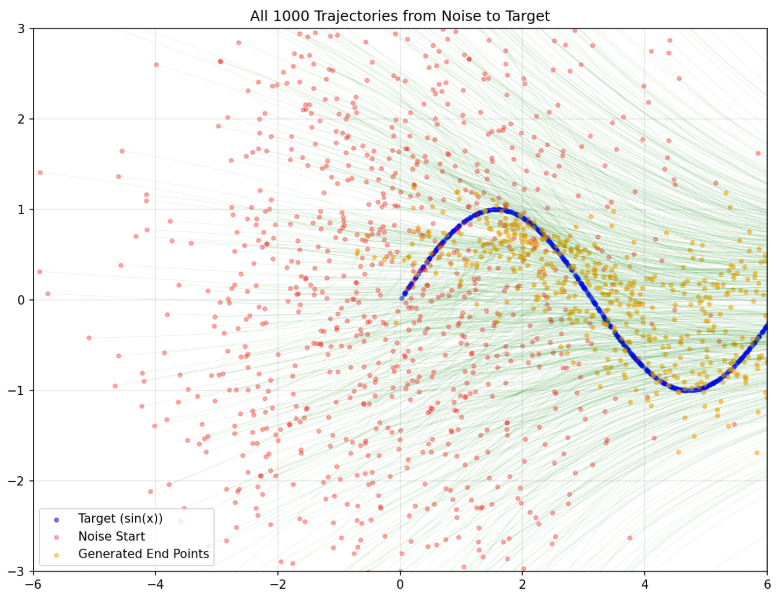

上图是 1000 个红色点在训练完成后实际推理 50 步的轨迹图。可以看出虽然都是训练数据训练和推理，但是实际上最终推理的方向和训练不一样。原因在于中间点会学习均值向量场，导致推理时候会转弯，但是最终还是能收敛的，只不过可能不能收敛到训练时候红色点 \> 蓝色点的真实配对。

```Python
import torch
import torch.nn as nn
import matplotlib.pyplot as plt
import numpy as np

# 超参数
dim = 2   # 数据维度（2D点）
num_samples = 1000
num_steps = 50  # ODE求解步数
lr = 1e-3
epochs = 5000

# 目标分布：正弦曲线上的点（x1坐标）
x1_samples = torch.rand(num_samples, 1) * 4 * torch.pi  # 0到4π (1000,1)
y1_samples = torch.sin(x1_samples)                      # y=sin(x)
target_data = torch.cat([x1_samples, y1_samples], dim=1) # shape (1000,2)

# 噪声分布：高斯噪声（x0坐标）
noise_data = torch.randn(num_samples, dim) * 2  # shape (1000,2)

class VectorField(nn.Module):
    def __init__(self):
        super().__init__()
        self.net = nn.Sequential(
            nn.Linear(dim + 1, 64),  # 输入维度: x (2) + t (1) = 3
            nn.ReLU(),
            nn.Linear(64, dim)
        )
  
    def forward(self, x, t):
        # 直接拼接x和t（t的形状需为(batch_size, 1)）
        return self.net(torch.cat([x, t], dim=1))
        
model = VectorField()
optimizer = torch.optim.Adam(model.parameters(), lr=lr)

for epoch in range(epochs):
    # 随机采样噪声点和目标点
    idx = torch.randperm(num_samples)
    x0 = noise_data[idx]  # 起点：噪声 shape (1000,2)
    x1 = target_data[idx] # 终点：正弦曲线

    # 时间t的形状为 (batch_size, 1)
    t = torch.rand(x0.size(0), 1)  # 例如：shape (1000, 1)
  
    # 线性插值生成中间点
    xt = (1 - t) * x0 + t * x1
  
    # 模型预测向量场（直接传入t，无需squeeze）
    vt_pred = model(xt, t)  # t的维度保持不变 shape (1000,2)
  
    # 目标向量场：x1 - x0
    vt_target = x1 - x0 # shape (1000,2)
  
    # 损失函数
    loss = torch.mean((vt_pred - vt_target)**2)
  
    # 反向传播
    optimizer.zero_grad()
    loss.backward()
    optimizer.step()
    
    if epoch % 1000 == 0:
        print(f"Epoch {epoch}, Loss: {loss.item():.4f}")

# ============ 绘制向量场 ============
# 创建网格点
x_min, x_max = -6, 6
y_min, y_max = -3, 3
grid_density = 20  # 网格密度

x_grid = np.linspace(x_min, x_max, grid_density)
y_grid = np.linspace(y_min, y_max, grid_density)
X, Y = np.meshgrid(x_grid, y_grid)

# 在t=0时刻计算向量场（从噪声开始）
grid_points = torch.tensor(np.stack([X.ravel(), Y.ravel()], axis=1), dtype=torch.float32)
t_grid = torch.zeros(grid_points.shape[0], 1)  # t=0

with torch.no_grad():
    vectors = model(grid_points, t_grid).numpy()

U = vectors[:, 0].reshape(X.shape)  # x方向分量
V = vectors[:, 1].reshape(X.shape)  # y方向分量

# ============ 生成单条轨迹 ============
x = noise_data[0:1]  # 选择初始噪声点进行轨迹生成
trajectory = [x.detach().numpy()]

t = 0
delta_t = 1 / num_steps
with torch.no_grad():
    for i in range(num_steps):
        vt = model(x, torch.tensor([[t]], dtype=torch.float32))
        t += delta_t
        x = x + vt * delta_t
        trajectory.append(x.detach().numpy())

trajectory = np.array(trajectory).squeeze()

# ============ 绘制所有1000个噪声的轨迹 ============
all_trajectories = []
for i in range(num_samples):
    x = noise_data[i:i+1]
    traj = [x.detach().numpy()]
    
    t = 0
    with torch.no_grad():
        for step in range(num_steps):
            vt = model(x, torch.tensor([[t]], dtype=torch.float32))
            t += delta_t
            x = x + vt * delta_t
            traj.append(x.detach().numpy())
    
    all_trajectories.append(np.array(traj).squeeze())

# ============ 绘图 ============
fig, axes = plt.subplots(1, 2, figsize=(18, 7))

# 左图：向量场 + 单条轨迹
ax1 = axes[0]
ax1.quiver(X, Y, U, V, alpha=0.6, scale=20, width=0.003, color='gray')
ax1.scatter(target_data[:,0], target_data[:,1], c='blue', s=10, label='Target (sin(x))', alpha=0.5)
ax1.scatter(noise_data[:,0], noise_data[:,1], c='red', s=10, alpha=0.3, label='Noise')
ax1.plot(trajectory[:,0], trajectory[:,1], 'g-', linewidth=2, label='Single Generated Path')
# 绘制训练数据在 t=0 时候的向量场，当然也可以绘制在 t=1 时候的向量场
ax1.set_xlim(x_min, x_max)
ax1.set_ylim(y_min, y_max)
ax1.legend()
ax1.set_title("Vector Field at t=0 with Single Trajectory")
ax1.grid(True, alpha=0.3)

# 右图：所有1000条轨迹
ax2 = axes[1]
ax2.scatter(target_data[:,0], target_data[:,1], c='blue', s=10, label='Target (sin(x))', alpha=0.5)
ax2.scatter(noise_data[:,0], noise_data[:,1], c='red', s=10, alpha=0.3, label='Noise Start')

# 绘制所有轨迹
for traj in all_trajectories:
    ax2.plot(traj[:,0], traj[:,1], 'green', alpha=0.1, linewidth=0.5)

# 绘制终点
final_points = np.array([traj[-1] for traj in all_trajectories])
ax2.scatter(final_points[:,0], final_points[:,1], c='orange', s=10, alpha=0.5, label='Generated End Points')

ax2.set_xlim(x_min, x_max)
ax2.set_ylim(y_min, y_max)
ax2.legend()
ax2.set_title("All 1000 Trajectories from Noise to Target")
ax2.grid(True, alpha=0.3)

# 绘制 1000 个训练点在推理时候的向量场
plt.tight_layout()
plt.savefig("flow_matching_vector_field.png", dpi=150)

print(f"Final point of first trajectory: {trajectory[-1]}")
print(f"Normalized: {trajectory[-1] / (torch.pi / 10 * 4)}")
```

从无提示词的生成式模型变成带提示词的生成式模型还是比较简单的，提示词不限于文本、语音、数字等任意输入。

一般就是在训练过程中，预测斜率的网络添加一个prompt的输入，其他都不变即可。而对于复杂prompt可能需要一些前置的网络把提示词转成一个比较好的latent表达。


对前述代码简单修改，即可完成把target线分成10段，tag为0时，生成最左边一段上的点，即\[0, 4\*pi/10\)，tag为1时生成左二段上的点，以此类推

```Python
import torch
import torch.nn as nn
import matplotlib.pyplot as plt
import numpy as np

# 超参数
dim = 2         # 数据维度（2D点）
num_samples = 1000
num_steps = 50  # ODE求解步数
lr = 1e-3
epochs = 5000

# 目标分布：正弦曲线上的点（x1坐标）
x1_samples = torch.rand(num_samples, 1) * 4 * torch.pi  # 0到4π
y1_samples = torch.sin(x1_samples)                      # y=sin(x)
target_data = torch.cat([x1_samples, y1_samples], dim=1)
tags = torch.from_numpy(np.array([[int(x1_samples[i] / (4 * torch.pi / 10.0)),] for i in range(num_samples)]))

# 噪声分布：高斯噪声（x0坐标）
noise_data = torch.randn(num_samples, dim) * 2

class VectorField(nn.Module):
    def __init__(self):
        super().__init__()
        self.net = nn.Sequential(
            nn.Linear(dim + 2, 64),  # 输入维度: x (2) + t (1) + tag(1) = 4
            nn.ReLU(),
            nn.Linear(64, dim)
        )
  
    def forward(self, x, t, tag):
        # 直接拼接x和t（t的形状需为(batch_size, 1)）
        return self.net(torch.cat([x, t, tag], dim=1))
        #return self.net(torch.cat([x, t], dim=1))
        
model = VectorField()
optimizer = torch.optim.Adam(model.parameters(), lr=lr)

for epoch in range(epochs):
    # 随机采样噪声点和目标点
    idx = torch.randperm(num_samples)
    x0 = noise_data[idx]  # 起点：噪声
    x1 = target_data[idx] # 终点：正弦曲线

    # 时间t的形状为 (batch_size, 1)
    t = torch.rand(x0.size(0), 1)  # 例如：shape (1000, 1)
  
    # 线性插值生成中间点
    xt = (1 - t) * x0 + t * x1
  
    # 模型预测向量场（直接传入t，无需squeeze）
    vt_pred = model(xt, t, tags[idx])  # t的维度保持不变
  
    # 目标向量场：x1 - x0
    vt_target = x1 - x0
  
    # 损失函数
    loss = torch.mean((vt_pred - vt_target)**2)
  
    # 反向传播
    optimizer.zero_grad()
    loss.backward()
    optimizer.step()

# 从噪声出发，解ODE生成数据
x = noise_data[0:1]  # 初始噪声点
trajectory = [x.detach().numpy()]

tag_num = 1
tag = torch.from_numpy(np.array([tag_num]))

# 数值求解ODE（欧拉法）
t = 0
delta_t = 1 / num_steps
with torch.no_grad():
    for i in range(num_steps):
        vt = model(x, torch.tensor([[t]], dtype=torch.float32), tag.reshape([1,1]))
        t += delta_t
        x = x + vt * delta_t  # x(t+Δt) = x(t) + v(t)Δt
        trajectory.append(x.detach().numpy())

trajectory = torch.tensor(trajectory).squeeze()

print(trajectory[-1] / (torch.pi / 10 * 4))

# 绘制向量场和生成轨迹
plt.figure(figsize=(10, 5))
plt.scatter(target_data[:,0], target_data[:,1], c='blue', label='Target (sin(x))')
plt.scatter(noise_data[:,0], noise_data[:,1], c='red', alpha=0.3, label='Noise')
plt.plot(trajectory[:,0], trajectory[:,1], 'g-', linewidth=2, label='Generated Path')
plt.legend()
plt.title("Flow Matching: From Noise to Target Distribution")
plt.show()
```

另一种理解

https://zhuanlan\.zhihu\.com/p/708691681

所谓图像生成，其实就是让神经网络模型学习一个图像数据集所表示的分布，之后从分布里随机采样。比如我们想让模型生成人脸图像，就是要让模型学习一个人脸图像集的分布。为了直观理解，我们可以用二维点来表示一张图像的数据。比如在下图中我们希望学习红点表示的分布，即我们希望随机生成点，生成的点都落在红点处，而不是落在灰点处。

我们很难表示出一个适合采样的复杂分布。因此，我们会把学习一个分布的问题转换成学习一个简单好采样的分布到复杂分布的映射。一般这个简单分布都是标准正态分布。如下图所示，我们可以用简单的算法采样在原点附近的来自标准正态分布的蓝点，我们要想办法得到蓝点到红点的映射方法。

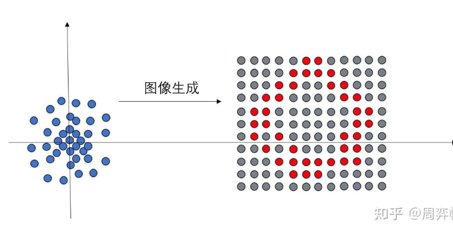

学习这种映射依然是很困难的。而近年来包括扩散模型在内的几类生成模型用一种巧妙的方法来学习这种映射：从纯噪声（标准正态分布里的数据）到真实数据的映射很难表示，但从真实数据到纯噪声的逆映射很容易表示。所以，我们先人工定义从图像数据集到噪声的变换路线（红线），再让模型学习逆路线（蓝线）。让噪声数据沿着逆路线走，就实现了图像生成。

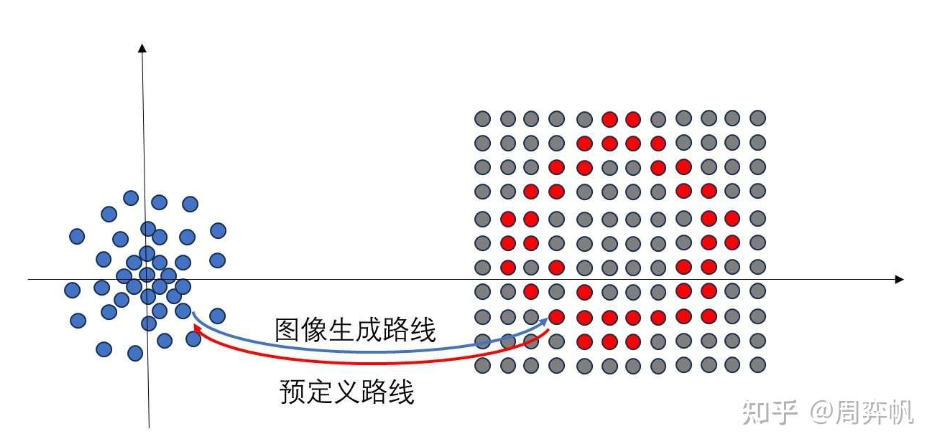

我们又可以用一种巧妙的方法间接学习图像生成路线。知道了预定义的数据到噪声的路线后，我们其实就知道了数据在路线上每一位置的速度（红箭头）。那么，我们可以以每一位置的反向速度（蓝箭头）为真值，学习噪声到真实数据的速度场。这样的学习目标被称为流匹配。

### Producer\-Consumer Framework

为了确保扩展到大规模 GPU 集群时的高吞吐量和训练稳定性，我们采用了一种受 Ray \(Moritz et al\., 2018\) 启发的生产者\-消费者（Producer\-Consumer）框架，将数据预处理与模型训练解耦。这种设计使得两个阶段能够以最佳效率异步运行，同时也支持在不中断当前训练过程的情况下对数据流水线进行即时更新。

在生产者端，原始的图像\-文本对首先根据我们预定义的标准（如图像分辨率和检测算子）进行过滤。筛选后的数据随后使用 MLLM 模型（例如 Qwen2\.5 VL）和 VAE 编码为潜在表征。处理后的图像随后按分辨率分组放入快速访问的缓存桶中，并存储在一个共享的、位置感知的存储系统中，这允许消费者立即获取数据而无需排队等待。

生产者和消费者之间的连接是通过采用特定的 HTTP 传输层实现的，该层原生支持两个端点之间异步、零拷贝（zero\-copy）调度所需的 RPC 语义。消费者部署在 GPU 密集型集群上，专门负责模型训练。通过将所有数据处理卸载给生产者，消费者节点可以将全部计算预算投入到 MMDiT 模型的训练中。MMDiT 参数在 4 路张量并行（4\-way tensor\-parallel）布局下分布在这些节点上，每个数据并行组直接从生产者异步拉取预处理后的批次数据。

### Distributed Training Optimization

**混合并行策略** 

我们采用了一种混合并行策略，结合数据并行和张量并行，以便在大型 GPU 集群上高效扩展训练。具体来说，为了实现张量并行，我们利用 Transformer\-Engine 库构建了 MMDiT 模型，该库允许在不同程度的张量并行之间进行无缝且自动的切换。此外，对于多头自注意力块，我们采用了按头并行（head\-wise parallelism），以减少相比于沿头维度进行张量并行所带来的同步和通信开销。

**分布式优化器与激活检查点** 

为了在反向传播过程中以最小的重计算开销缓解 GPU 显存压力，我们尝试了分布式优化器和激活检查点。然而，激活检查点在反向传播阶段引入了巨大的计算开销，这会显著降低训练速度。通过在 256 多分辨率图像训练设置下的实验对比，我们观察到启用激活检查点虽将单 GPU 显存占用降低了 11\.3%（从每 GPU 71GB 降至 63GB），但代价是单次迭代时间增加了 3\.75 倍（从每次迭代 2 秒增至 7\.5 秒）。基于这种权衡，我们最终决定禁用激活检查点，仅依赖分布式优化器。在训练期间，All\-gather 操作使用 bfloat16 执行，而梯度 Reduce\-scatter 操作则使用 float32，从而同时确保了计算效率和更好的数值稳定性。

## Post\-training

### Supervised Fine\-Tuning \(SFT\)

### Direct Preference Optimization \(DPO\)

**数据准备** 

对于 DPO 训练数据，给定相同的提示词，使用不同的随机初始化种子生成多张图像。然后由人工标注员从这些候选图像中选出最好和最差的图像。数据被分为两类：带有参考（黄金）图像的提示词，以及不带参考图像的提示词。

对于带有参考图像的数据，标注员首先将生成的输出与参考图像进行比较。如果存在显著差异，标注员将被指示将质量最差的生成图像指定为拒绝样本（rejected sample）。

对于没有参考图像的提示词，标注员被要求在生成的图像中选择最好和最差的样本，或者指出是否所有生成的结果质量都不令人满意。

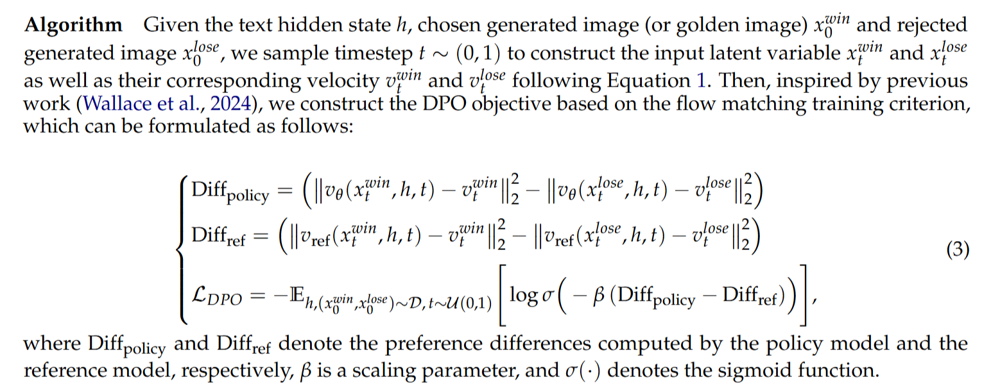

计算过程本质上是 **"Regression\-based DPO"（基于回归的 DPO）**：

1. 它**不再计算生成的概率**（因为在连续空间很难算），而是计算**重建/流匹配的误差（L2 Norm）**。

2. 它惩罚策略模型：如果策略模型在 xlosex^\{lose\}xlose 上的重建误差比 xwinx^\{win\}xwin 低（即模型错误地认为失败样本更好），Loss 就会变大。

3. 它通过对比参考模型的误差，确保模型在学习人类偏好的同时，不会过度偏离原始模型的分布。

### Group Relative Policy Optimization \(GRPO\)

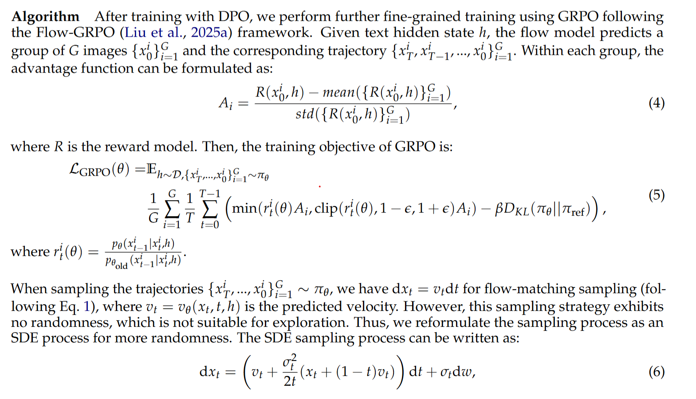

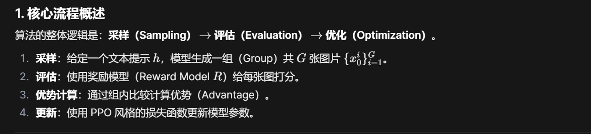

前面说过在推理时候，噪声给定情况下生成过程没有任何随机性，因此需要改一下采样策略

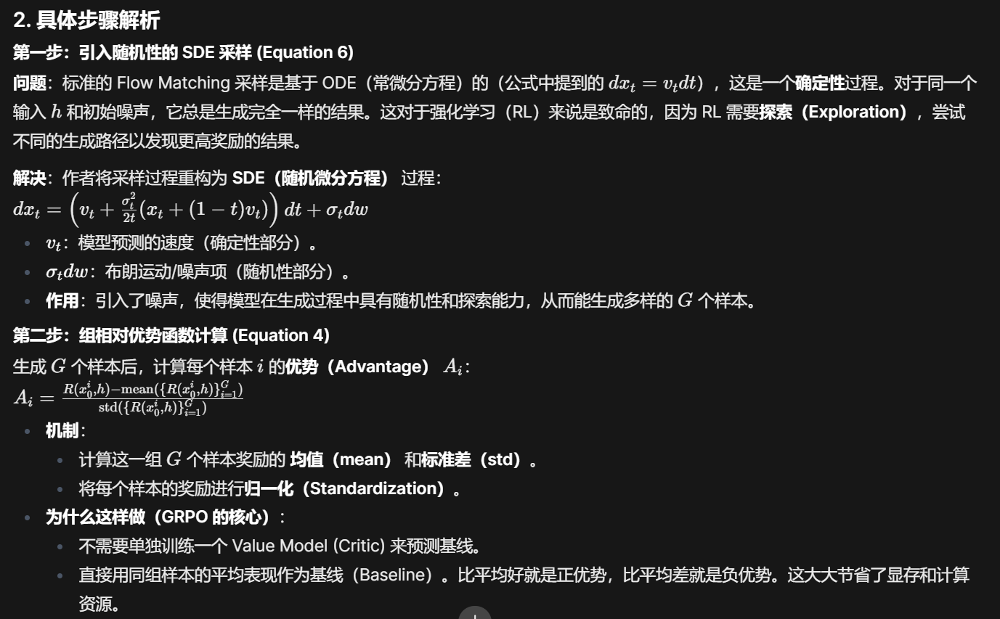

## 图像编辑模型架构

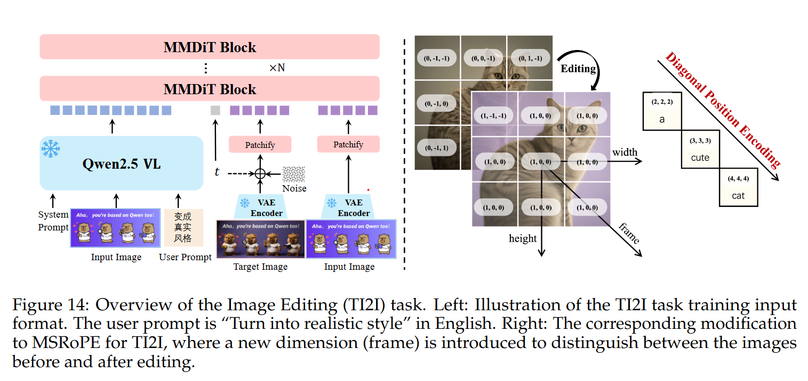

# Cache 方案

最常用的库是 cache\-dit，sglang 等推理框架应该也支持了。

https://zhuanlan\.zhihu\.com/p/711223667

```Plain Text
pipe = DiffusionPipeline.from_pretrained(model_name, torch_dtype=torch_dtype).to(device)

from diffusers import TaylorSeerCacheConfig

config = TaylorSeerCacheConfig(
    cache_interval=5,
    max_order=1,
    disable_cache_before_step=3,
    taylor_factors_dtype=torch.float32,
)
pipe.transformer.enable_cache(config)
```

设置上述 cache 方案后，会给特定 block 注入特定 hook。在触发 forward 时候会自动判断当前模块是否是重算还是跳过。

因为在开启 cfg 引导情况下，模型会 forward 两次，但是 hook 只有一个，因此需要特定的上下文区别，然后不同的 forward 启动同一个 hook 后 cache 是隔离的。

```Python
with            self.transformer.cache_context("cond"):
                    noise_pred = self.transformer(
                        hidden_states=latents,
                        timestep=timestep / 1000,
                        guidance=guidance,
                        encoder_hidden_states_mask=prompt_embeds_mask,
                        encoder_hidden_states=prompt_embeds,
                        img_shapes=img_shapes,
                        txt_seq_lens=txt_seq_lens,
                        attention_kwargs=self.attention_kwargs,
                        return_dict=False,
                    )[0]

                if do_true_cfg:
                    with self.transformer.cache_context("uncond"):
                        neg_noise_pred = self.transformer(
                            hidden_states=latents,
                            timestep=timestep / 1000,
                            guidance=guidance,
                            encoder_hidden_states_mask=negative_prompt_embeds_mask,
                            encoder_hidden_states=negative_prompt_embeds,
                            img_shapes=img_shapes,
                            txt_seq_lens=negative_txt_seq_lens,
                            attention_kwargs=self.attention_kwargs,
                            return_dict=False,
                        )[0]
                    comb_pred = neg_noise_pred + true_cfg_scale * (noise_pred - neg_noise_pred)
```

Cache 的核心逻辑是：同一个 mmdit 会 forward 很多遍，中间有很大特征是类似的，可以不算了。因此可能会出现跳过某些中间时间步的预测。

# Flow\-GRPO

https://arxiv\.org/pdf/2505\.05470


我们提出了  **Flow\-GRPO**，这是第一个将**在线策略梯度强化学习（RL）** 集成到 **流匹配模型**中的方法。我们的方法采用了两个关键策略： 


**\(1\) ODE 到 SDE 的转换**：将确定性的常微分方程（ODE）转换为等价的随机微分方程（SDE），该 SDE 在所有时间步上都与原始模型的边际分布保持一致，从而为强化学习的探索提供统计采样能力； 

**\(2\) 去噪步数削减策略**：在训练时减少去噪步数，同时保持推理时的原始步数不变，从而在不牺牲性能的情况下显著提高采样效率。 


在实验上，Flow\-GRPO 在多个文本到图像的任务中表现出色： 

- **组合生成任务**：经过 RL 微调的 SD3\.5\-M 在物体计数、空间关系和细粒度属性生成上近乎完美，将 GenEval 准确率从  **63% 提升至 95%**。 

- **视觉文本渲染任务**：准确率从  **59% 提升至 92%**，大幅增强了文本生成能力。 

- **人类偏好对齐**：Flow\-GRPO 也实现了显著提升。 

值得注意的是，几乎没有发生  **奖励欺骗（reward hacking）** 现象，即奖励的提升并没有以明显的图像质量或多样性退化为代价。


使用强化学习（RL）训练流模型面临几个关键挑战： 

**\(1\) 确定性与随机性的矛盾**：流模型依赖于基于常微分方程（ODE）  的确定性生成过程，这意味着它们在推理时无法进行随机采样。相比之下，强化学习依赖随机采样来探索环境——通过尝试不同的动作并根据奖励进行改进来学习。强化学习对随机性的需求与流匹配模型的确定性特性相冲突。 

**\(2\) 采样效率问题**：在线强化学习依赖高效采样来收集训练数据，但流模型通常需要许多迭代步骤才能生成每个样本，从而限制了效率。这个问题在大型模型中更为突出。为了使强化学习在图像或视频生成等任务中切实可行，提高采样效率至关重要。


为了应对这些挑战，我们提出了  **Flow\-GRPO**，它将 GRPO   集成到流匹配模型中用于文本到图像（T2I）生成，采用了两个关键策略。 

**首先**，我们采用 **ODE 到 SDE 的转换策略**来克服原始流模型的确定性特性。通过将基于 ODE 的流转换为等价的随机微分方程（SDE）框架，我们在保持原始边际分布的同时引入了随机性。 

**其次**，为了提高在线强化学习中的采样效率，我们应用了**去噪步数削减策略**，该策略在训练期间减少去噪步数，同时在推理期间保持完整的采样计划。我们的实验表明，使用更少的步数可以保持性能，同时显著降低数据生成成本。

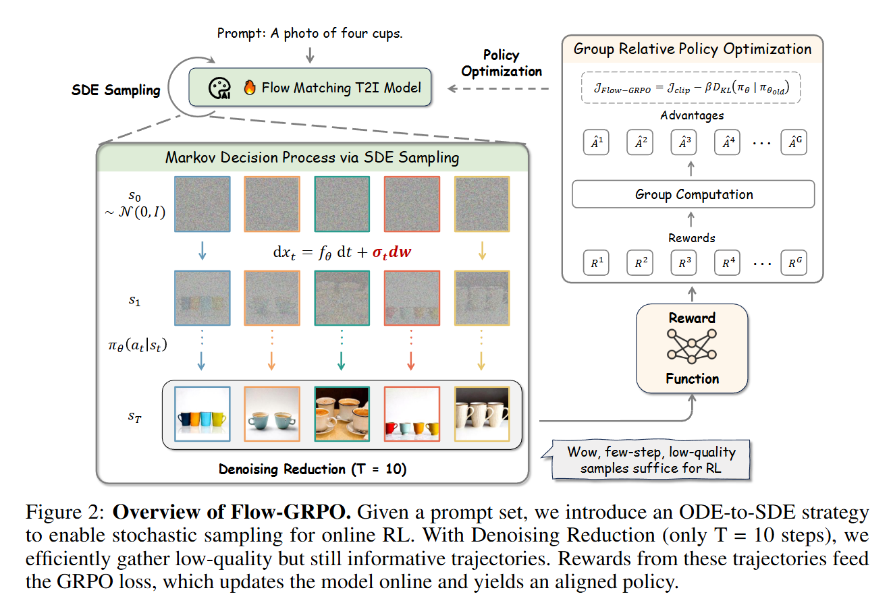

给定同一个 prompt 和噪声系数，总能产生完全一样的输出，没法 GRPO。我们不能换噪声系数来生成不同图片，因为这本质属于不同样本了。

研究者们认识到，任何一个由 ODE 描述的概率流，都存在一个在数学上等价的[随机微分方程](https://zhida.zhihu.com/search?content_id=261880784&content_type=Article&match_order=1&q=%E9%9A%8F%E6%9C%BA%E5%BE%AE%E5%88%86%E6%96%B9%E7%A8%8B&zhida_source=entity)（Stochastic Differential Equation, SDE）表示，该SDE在每个时间步的边缘概率分布与原始ODE完全相同。通过将Flow Matching模型原生的确定性ODE采样过程转换为等价的SDE过程，Flow\-GRPO巧妙地为生成过程注入了可控的随机性（通过SDE中的布朗运动项）。这一转换是实现随机探索的理论基石，使得需要计算策略概率和进行环境探索的在线RL算法（如GRPO）得以应用。


在SDE 框架下带有随机性的生成样本过程如下：

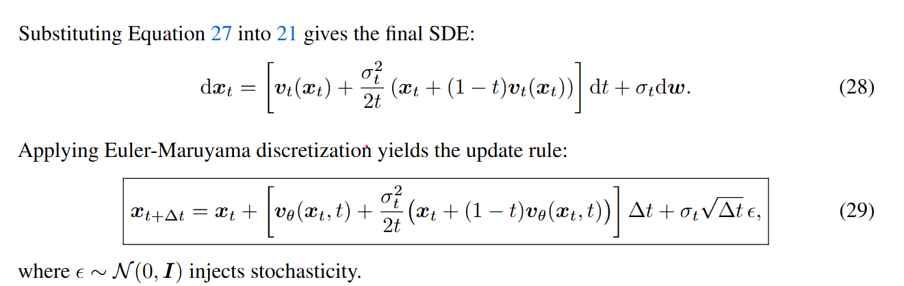

```Plain Text
std_dev_t = torch.sqrt(sigma / (1 - torch.where(sigma == 1, sigma_max, sigma)))*noise_level

prev_sample_mean = sample*(1+std_dev_t**2/(2*sigma)*dt)+model_output*(1+std_dev_t**2*(1-sigma)/(2*sigma))*dt

# 一步去噪后生成的样本
prev_sample = prev_sample_mean + std_dev_t * torch.sqrt(-1*dt) * variance_noise
```

假设 p\(x\_t\|x\_t\+1\) 服从高斯分布，那么 logprob 公式为：

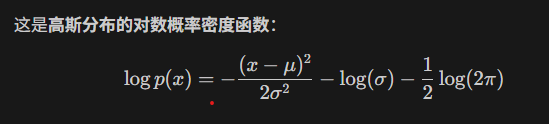

```C++
log_prob = (
            -((prev_sample.detach() - prev_sample_mean) ** 2) / (2 * ((std_dev_t * torch.sqrt(-1*dt))**2))
            - torch.log(std_dev_t * torch.sqrt(-1*dt))
            - torch.log(torch.sqrt(2 * torch.as_tensor(math.pi)))
        )
```

上述步骤不仅仅导致图片多样化，而且可以计算 logp\(x\) 了。


他的训练或者梯度计算是在每一个时间步上进行，也就是可能训练时间步是 10，可能已经参数更新了 5 次了。和 llm rl 有很大区别。因为他的当前状态只和上一状态有关，sft 训练时候就可以并行计算，因此不需要等 forward 10 遍才执行一次 loss 计算，而是可以执行 10 次 loss 计算。

或者说 llm 的序列长度，对应 diffusion 的时间步。


关键是理解 diffusion 的 p\(x\) 概率分布咋算。


既然说到 RL，那么就必须要清楚以下概念：

- 状态 state: 条件prompt，时间步t，和当前预测样本 x\_t

- 动作空间 action: 是连续空间，即为生成 x\_t

- Policy 的定义: 给定当前状态 s 下，模型预测的 action。这里就是给定当前时间步t下，预测出上一个时间步t\-1的图片

- 状态转移过程是确定的

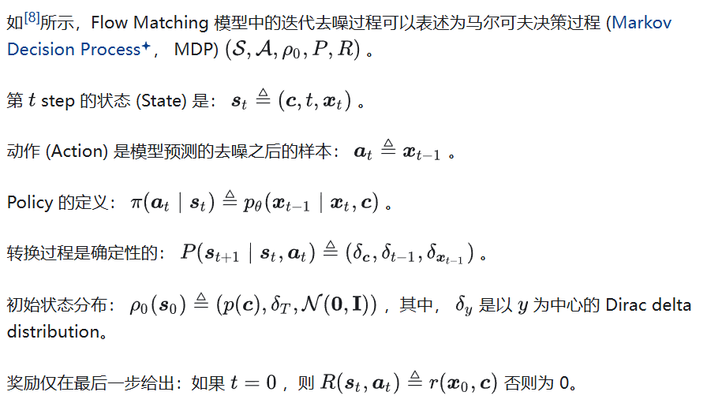

GRPO 优化目标：

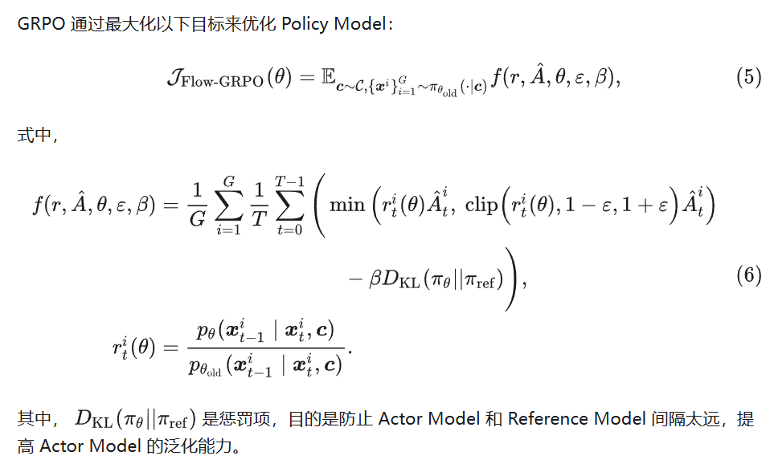

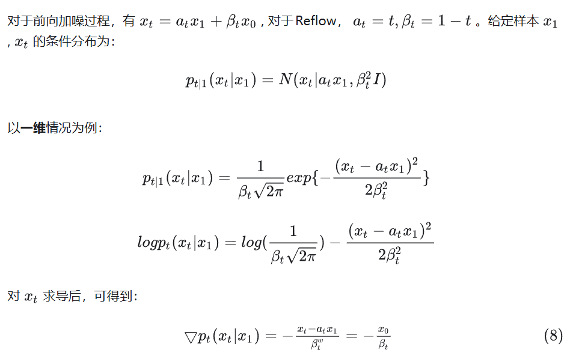

# *DanceGRPO*

# MixGRPO


