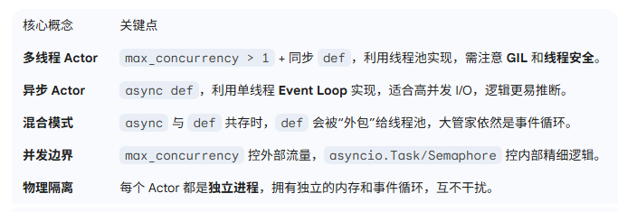
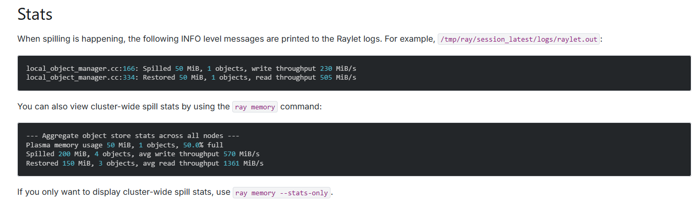
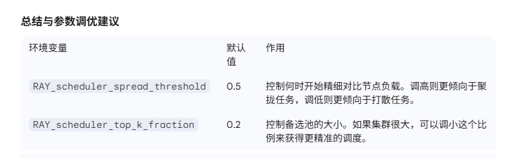
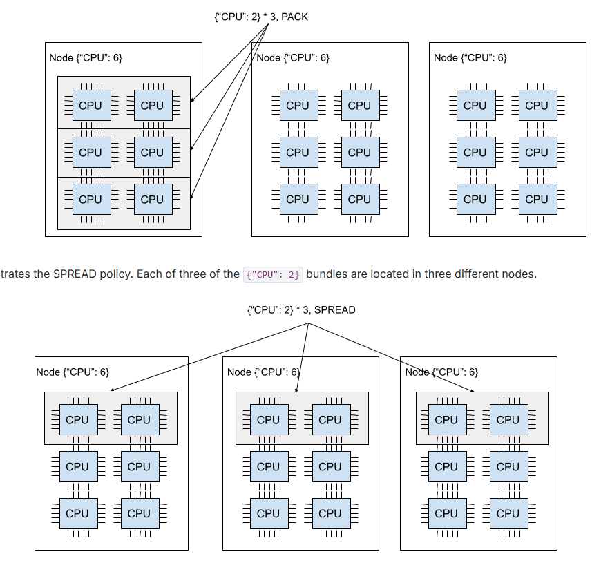
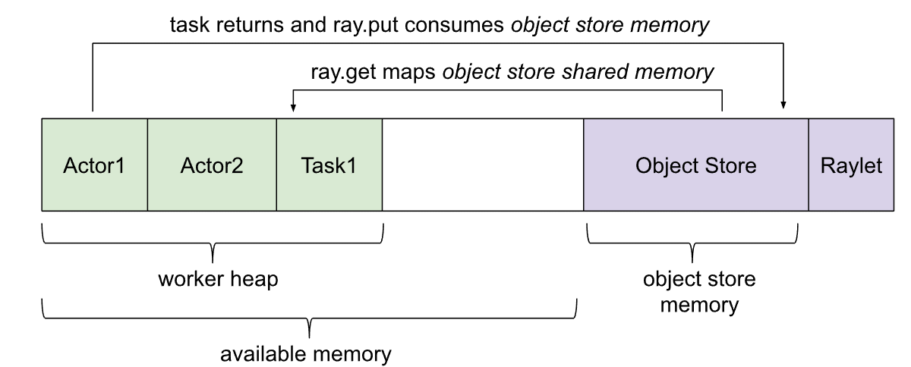
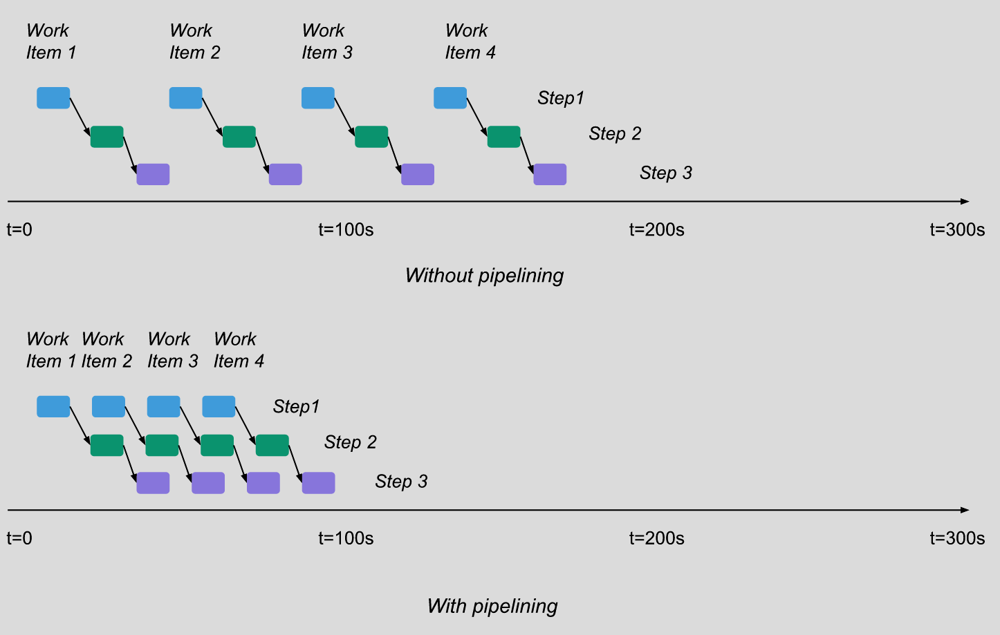
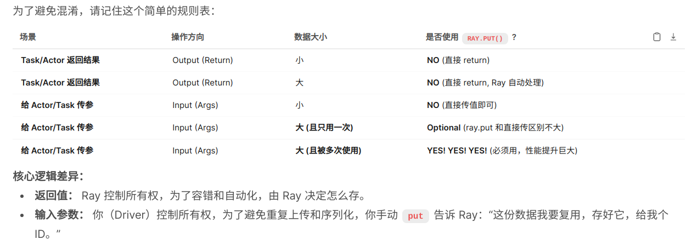
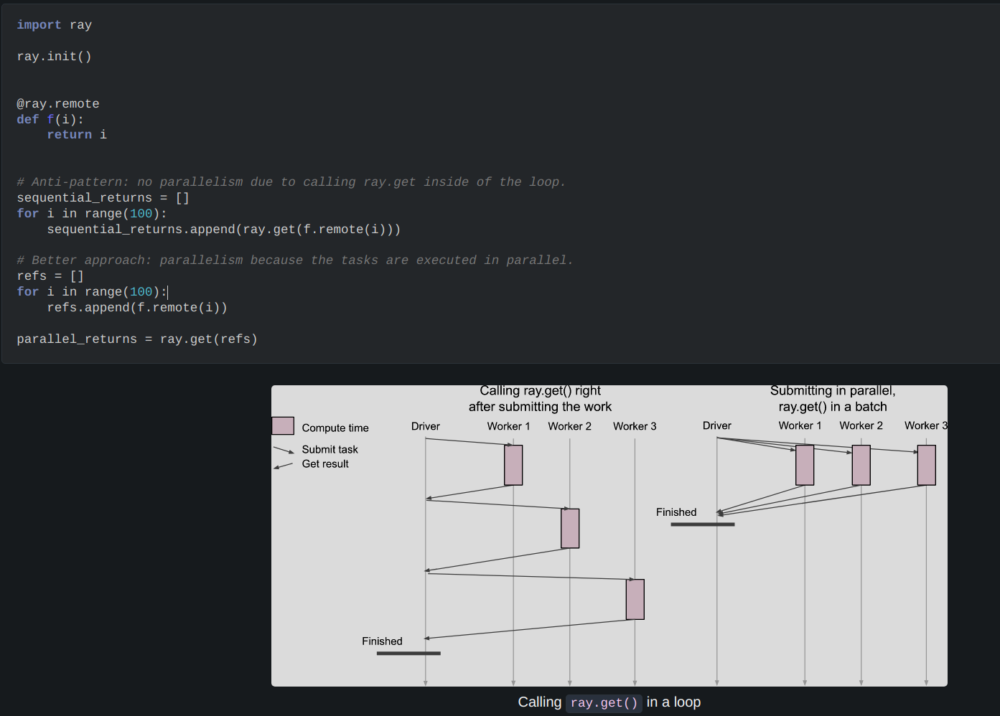
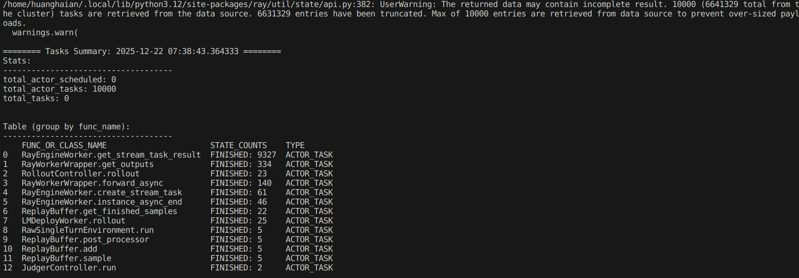
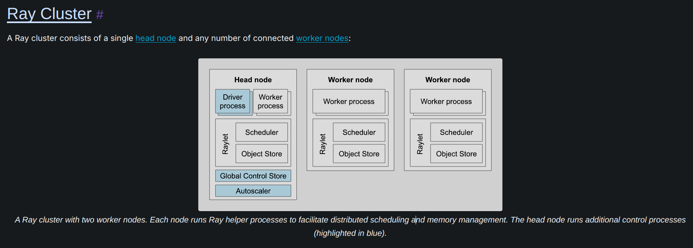

# Ray 基础

https://docs\.ray\.io/en/latest/ray\-core/walkthrough\.html

# Torchrun Rendezvous

`--rdzv-backend` 是 **Rendezvous Backend**（组网/会合后端）的缩写。

简单来说，它的作用就是告诉 PyTorch 的各个训练节点（Node）：**“我们要去哪里开会（交换信息），用什么方式确认人都到齐了？”**

在分布式训练开始前，所有的 Worker 进程互不认识。它们需要一个“中间人”或者“公告板”来做两件事：

1. **节点发现 \(Discovery\)：** 告诉大家“我是 Rank 0，我的 IP 是 1\.2\.3\.4，端口是 9000”。

2. **状态同步 \(Synchronization\)：** 确认“我们要跑 4 个节点，现在来了 3 个，还差 1 个，大家先等等”。

`--rdzv-backend` 就是指定这个“中间人”是用什么技术实现的。


### 常见的 Backend 及其用途

https://github\.com/pytorch/pytorch/blob/main/torch/distributed/run\.py\#L437

#### 1\. `c10d` \(最常用\)

- **实现原理：** PyTorch 自己内置的一个基于 TCP 的轻量级 KV 存储（`TCPStore`）。

- **怎么用：** 只要你有一个主节点（Master Node），大家都连它的 IP 和端口。

- **优点：**

    - **开箱即用：** 不需要安装额外的数据库或服务。

    - **简单：** 只要网络通就行。

- **适用场景：** 99% 的场景。单机多卡、多机多卡（只要机器数量不是特别巨大）。

#### 2\. `etcd` \(大规模生产环境\)

- **实现原理：** 使用外部的 **etcd** 数据库（一个高可用的分布式键值存储，Kubernetes 就在用它）作为“公告板”。

- **怎么用：** 需要额外部署一个 etcd 集群，训练时填 etcd 的地址。

- **优点：**

    - **高可用 \(HA\)：** 如果 Master 节点挂了，训练元数据还在 etcd 里，容易恢复。

    - **解耦：** 状态存储和训练进程分离。

- **适用场景：** 大规模集群（比如几百台机器），或者对容错性要求极高的生产环境。

#### 3\. `static` \(静态/传统模式\)\- torchrun 默认情况

- **实现原理：** 不使用动态的 KV 存储来做“会合”。而是假设所有信息（Rank, World Size, Master Addr）都已经**提前**通过环境变量或者参数写死在每一个进程里了。

- **怎么用：** 每个节点启动时都要手动指定“我是第几号，总共有几号”。

- **优点：** 没有任何额外的网络交互开销，启动极快。

- **缺点：** **没有弹性 \(Elasticity\)**。如果中间死了一个节点，或者你想动态加一个节点，整个任务就崩了，无法自动重连。

- **适用场景：** 极简环境、Slurm 调度系统内部（Slurm 会分配好一切）、或者调试网络问题时。


### 举个通俗的例子

你们团队（分布式训练集群）要去旅游。

- **`rdzv-backend=c10d`**：
大家选了一个队长（Master Node）。大家都给队长打电话报到。队长拿个小本本记下来，人齐了队长喊一声“出发”。
*\(方便，不用额外设施，队长不能挂\)*

- **`rdzv-backend=etcd`**：
大家都在公司的一个**公共在线文档**（etcd）上填自己的名字和车牌号。填满了系统自动通知大家出发。
*\(专业，队长挂了也没事，文档还在\)*

- **`rdzv-backend=static`**：
大家出发前每人发一张纸条，上面写死了：“我们一共有 4 个人，你是 3 号，去 A 地点集合”。
*\(死板，少一个人这事儿就黄了，因为没人知道该怎么办\)*


`rdzv-backend` 负责“组局”（建立连接前的握手），`nccl` 负责“开会”（训练中的数据传输）


### 阶段一：组局 \(Rendezvous / Initialization\)

**主角：****`rdzv-backend`**** \(c10d, etcd, static\)**

在训练代码真正跑起来之前，这些机器（进程）之间是**互不认识**的。它们不知道对方的 IP，不知道对方的端口，甚至不知道一共有多少人要参加训练。

- **rdzv\-backend 的任务：**

    1. **节点发现：** “嗨，我是 Rank 1，我的 IP 是 192\.168\.0\.2，我的 NCCL 端口是 4567。”

    2. **交换名片（Store）：** 所有的进程通过 `rdzv-backend` 提供的一个共享存储（KV Store），把自己的连接信息（主要是 NCCL 的 Unique ID）写进去，并读取别人的信息。

    3. **人齐了没？** 确认 World Size 满了，大家到齐了。

- **在这个阶段，GPU 网卡（NVLink/InfiniBand）还没开始真正干活，走的通常是普通的 TCP 管理网络。**

### 阶段二：开会 \(Collective Communication / Training\)

**主角：****`backend`**** \(nccl, gloo, mpi\)**

一旦大家通过 `rdzv-backend` 互相认识了，交换了 **NCCL Unique ID**（相当于开会的房间号和密码），`rdzv-backend` 的核心使命就完成了（虽然它可能还会维持心跳）。

接下来的重头戏——**梯度同步（AllReduce）、数据广播（Broadcast）**——全部交给 **NCCL**。

- **NCCL 的任务：**

    1. 利用刚才交换的 IP 和 ID，在 GPU 之间建立高速通道（NVLink, PCIe, InfiniBand, RoCE）。

    2. **疯狂传输数据：** 训练过程中，成吨的梯度数据通过 NCCL 飞快地传输。

- **在这个阶段，数据走的是高性能网络，不再经过 ****`rdzv-backend`**** 的那个 TCPStore 了。**


虽然默认值是 `static`，但这里有一个极易混淆的技术细节，导致很多时候大家会误以为它是 `c10d`：

1. **`static`**** 后端的底层实现依然是 TCPStore \(属于 c10d 库\)**
即使你使用了默认的 `static` 后端，PyTorch Elastic 在底层建立连接时，依然是构建了一个 `TCPStore` 来交换信息。

    - **Static Backend:** 逻辑上是“静态”的，它假设拓扑结构固定，必须要你提供确定的 `rdzv_endpoint`（或者通过 Master Addr 环境变量）。它不支持动态扩缩容。

    - **C10d Backend:** 逻辑上是“动态”的，它支持更复杂的动态发现逻辑。


# ray object ref 在有套层对象时候不会直接反序列化

```Python
import numpy as np
import ray


def demo1():
    # Define a task that sums the values in a matrix.
    @ray.remote
    def sum_matrix(matrix):
        print(type(matrix)) # <class 'numpy.ndarray'>
        return 0

    # Put a large array into the object store.
    matrix_ref = ray.put(np.ones((1000, 1000)))
    # Call the task with the object reference as an argument.
    ray.get(sum_matrix.remote(matrix_ref)) # 内部会自动序列化和反序列化


def demo2():
    # Define a task that sums the values in a matrix.
    @ray.remote
    def sum_matrix(matrix):
        print(type(matrix), type(matrix[0]))  # <class 'list'> <class 'ray._raylet.ObjectRef'>
        return 0

    # Put a large array into the object store.
    matrix_ref = ray.put(np.ones((1000, 1000)))

    matrix_ref = [matrix_ref]  # 这种情况不会自动转换为 numpy.ndarray。 dict | list 也不可以
    # Call the task with the object reference as an argument.
    ray.get(sum_matrix.remote(matrix_ref)) # 虽然最内层的对象不会自己 get，但是也会序列化外层对象，因此不是同一个对象。

def demo3():
    # Define a task that sums the values in a matrix.
    @ray.remote
    def sum_matrix(matrix):
        print(type(matrix), type(matrix[0]))  # <class 'list'> <class 'ray._raylet.ObjectRef'>
        matrix = ray.get(matrix[0]) # 需要显式解
        print(type(matrix))  # <class 'numpy.ndarray'>
        return 0

    # Put a large array into the object store.
    matrix_ref = ray.put(np.ones((1000, 1000)))

    matrix_ref = [matrix_ref]  # 这种情况不会自动转换为 numpy.ndarray。 dict | list 也不可以
    # Call the task with the object reference as an argument.
    ray.get(sum_matrix.remote(matrix_ref))


if __name__ == '__main__':
    ray.init()

    demo1()
    demo2()
    demo3()
```

# 概念

Ray 将远程对象缓存在其分布式共享内存 **对象存储（object store）** 中，并在集群中的每个节点上创建一个对象存储。在集群环境中，无论由谁持有对象引用（object ref），远程对象都可以驻留在一个或多个节点上。


Placement groups 允许用户原子性地预留跨多个节点的资源组。你可以利用该功能来调度 Ray 的任务（task）和 Actor，既可以让它们尽可能紧密地打包在一起以优化局部性（PACK 策略），也可以将它们分散开来（SPREAD 策略）。其常见的一个用例是对 Actor 或任务进行帮派调度（gang\-scheduling）

**Gang\-scheduling** 指的是利用 Ray 的 Placement Groups 功能，**一次性原子化地申请到所有需要的资源**，确保相关的任务组（Tasks/Actors）能够**并发地、协同地**开始工作，避免因为资源碎片化导致的死锁或效率低下。意思要么一起跑要么都不跑策略。


# 环境变量

When Ray executes tasks and actors on remote machines, their environment dependencies, such as Python packages, local files, and environment variables, must be available on the remote machines\. To address this problem, you can 1\. Prepare your dependencies on the cluster in advance using the Ray [Cluster Launcher](https://docs.ray.io/en/latest/cluster/vms/getting-started.html#vm-cluster-quick-start) 2\. Use Ray’s [runtime environments](https://docs.ray.io/en/latest/ray-core/handling-dependencies.html#runtime-environments) to install them on the fly\.

# CPU 资源

```Python
# Specify required resources.
@ray.remote(num_cpus=4, num_gpus=2)
def my_function():
    return 1

# Override the default resource requirements.
my_function.options(num_cpus=3).remote()
```

在默认配置下，Ray 的 `num_cpus` 只是一个 **“逻辑记账”** 的限制，而不是 **“物理封锁”** 的限制。

这意味着：

### 调度层面（记账）

Ray **保证**在该节点拥有 4 个空闲 CPU 额度之前，不会启动你的任务。一旦你的任务启动，Ray 会在它的资源账本上把这 4 个 CPU 标记为“已占用”，防止其他任务抢占这些额度。

### 执行层面（物理）

一旦你的 Python 函数开始运行，它就是一个普通的操作系统进程。Ray 默认**不会**使用操作系统级别的技术来强行限制这个进程只能使用 4 个物理核心。

实际占用的 CPU 数量完全取决于你的**代码本身**是怎么写的：

- **情况 A：你用的更少（大部分 Python 代码）**
如果你的 `my_function` 只是普通的 Python 逻辑（受 GIL 全局解释器锁限制），或者是一个简单的循环，它通常**只会占用 1 个 CPU 核心**。

    - *后果*：你声明了 4 个，实际只用了 1 个。你“浪费”了 3 个额度，这 3 个额度本可以让其他任务使用的。

- **情况 B：你用的更多（NumPy, PyTorch, TensorFlow 等）**
如果你的函数里使用了像 `numpy.dot` 这种矩阵运算，或者深度学习库。这些库的底层（通常是 C\+\+/Fortran）会自动检测机器的**所有**物理核心。

    - 假设你的机器有 32 核，你设置 `num_cpus=4`。

    - NumPy 可能会发现有 32 核，于是开启 32 个线程全力计算。

    - *后果*：你的任务实际上占用了 32 个 CPU，导致该节点上的其他任务变慢（资源争抢），尽管 Ray 以为你只用了 4 个。

    

`num_cpus=4` 的意思是告诉 Ray：**“这是一个大家伙，请给我预留 4 个人的座位。”**
但如果这个大家伙坐下后，手伸得太长打到了隔壁桌（占用了更多物理核），或者其实是个瘦子只坐了 1 个座位（只用了 1 核），Ray 默认是不管的。


简单来说，如果你一共 4 个 cpu 核心，每个任务假设设置为 2 个 cpu，那么就只能等前 2 个完成才调度后面 2 个。即使你的任务实际上只用了 1 个 cpu，他也不管这个。他的调度都是逻辑层面的。

或者说如果你设置每个任务是 2 个 cpu，但是每个任务实际上用了 4 个 cpu，那么他也会强行调度 2 个任务，只不过这两个会抢占 cpu 导致运行变慢。


但是如果你提前知道了这个任务需要很多 cpu，那么你可以提前占掉，可以避免一些问题，但是可能上面有别的任务在跑，也快不了。会产生大量的 **Context Switch（上下文切换）**，导致效率急剧下降，比正常排队跑还要慢


把 Ray 想象成一个 **“只管发入场券，不管你怎么坐”** 的管理员就对了。


# 跨机调度

```Python
@ray.remote
def function_with_an_argument(value):
    return value + 1


obj_ref1 = my_function.remote()
assert ray.get(obj_ref1) == 1

# You can pass an object ref as an argument to another Ray task.
obj_ref2 = function_with_an_argument.remote(obj_ref1)
assert ray.get(obj_ref2) == 2
```

- As the second task depends on the output of the first task, **Ray will not execute the second task until the first task has finished\.**

- If the two tasks are scheduled on different machines, the output of the first task \(the value corresponding to `obj_ref1/objRef1`\) will be sent over the network to the machine where the second task is scheduled\.

# Scheduling

For each task, Ray will choose a node to run it and the scheduling decision is based on a few factors like [the task’s resource requirements](https://docs.ray.io/en/latest/ray-core/scheduling/index.html#ray-scheduling-resources), [the specified scheduling strategy](https://docs.ray.io/en/latest/ray-core/scheduling/index.html#ray-scheduling-strategies) and [locations of task arguments](https://docs.ray.io/en/latest/ray-core/scheduling/index.html#ray-scheduling-locality)\. See [Ray scheduling](https://docs.ray.io/en/latest/ray-core/scheduling/index.html#ray-scheduling) for more details\.

# Yielding Resources While Blocked

```Bash
@ray.remote(num_cpus=1, num_gpus=1)
def g():
    return ray.get(f.remote())
```

Ray will release CPU resources when being blocked\. This prevents deadlock cases where the nested tasks are waiting for the CPU resources held by the parent task\.


Ray 在处理 **阻塞调用（Blocking Calls）** 时非常智能的一个资源管理机制，主要是为了**防止死锁（Deadlock）**

当你定义的函数 `g()` 运行时，它申请了 1 个 CPU \(`num_cpus=1`\)。
代码运行到 `ray.get(f.remote())` 这一行时，`g` 必须停下来等待 `f` 的运行结果。

- **如果不释放**：`g` 啥也不干，就在那干等，但手里还死死攥着 1 个 CPU 的名额不放。

- **Ray 的做法**：Ray 监测到 `g` 被 `ray.get` 阻塞（blocked）了，它会**暂时收回** `g` 占用的那 1 个 CPU 额度。此时，这 1 个 CPU 就可以被调度给其他任务（比如 `f`）使用。

当 `f` 跑完，结果返回了，`g` 准备继续往下走时，Ray 会**重新为 ****`g`**** 申请** CPU 资源，拿到资源后继续执行直到结束。

但是如果是 GPU 资源则无法释放。


请注意： 上面说的是 cpu 资源会暂时释放，但是这个代码还是会卡在这的，并不是退出了。


Ray 的智能机制解决了 **“没 CPU 用”** 的问题，但没法解决 **“Actor 正在忙”** 的问题。标准 Actor 只要方法没 return，它就是“忙”的，哪怕它只是在发呆。


# Type hints and static typing for actors

```Python
import ray
from ray.actor import ActorClass, ActorProxy

class Counter:
    def __init__(self):
        self.value = 0

    @ray.method
    def increment(self) -> int:
        self.value += 1
        return self.value

CounterActor: ActorClass[Counter] = ray.remote(Counter)
counter: ActorProxy[Counter] = CounterActor.remote()

# Type checkers and IDEs will now provide type hints for remote methods
obj_ref: ray.ObjectRef[int] = counter.increment.remote()
print(ray.get(obj_ref))
```

# Actors, Workers and Resources

Each “Ray worker” is a python process\.

Ray treats a worker differently for tasks and actors\. For tasks, Ray uses a “Ray worker” to execute multiple Ray tasks\. For actors, Ray starts a “Ray worker” as a dedicated Ray actor\.

- **Tasks**: When Ray starts on a machine, a number of Ray workers start automatically \(1 per CPU by default\)\. Ray uses them to execute tasks \(like a process pool\)\. If you execute 8 tasks with `num_cpus=2`, and total number of CPUs is 16 \(`ray.cluster_resources()["CPU"] == 16`\), you end up with 8 of your 16 workers idling\.

- **Actor**: A Ray Actor is also a “Ray worker” but you instantiate it at runtime with `actor_cls.remote()`\. All of its methods run on the same process, using the same resources Ray designates when you define the Actor\. Note that unlike tasks, Ray doesn’t reuse the Python processes that run Ray Actors\. Ray terminates them when you delete the Actor\.

To maximally utilize your resources, you want to maximize the time that your workers work\. You also want to allocate enough cluster resources so Ray can run all of your needed actors and any other tasks you define\. This also implies that Ray schedules tasks more flexibly, and that if you don’t need the stateful part of an actor, it’s better to use tasks\.


我们可以用 **“公司运营”** 来打比方。

---

### 核心概念：Ray Worker \(员工\)

> *Each “Ray worker” is a python process\.*
> 
> 

- **定义**：每一个“Worker”本质上就是一个 **Python 进程**。

- **比喻**：这就是公司里的 **“员工”** 。每个人就是一个干活的实体。

---

### Ray 如何处理 Task \(任务\)

> *For tasks, Ray uses a “Ray worker” to execute multiple Ray tasks\.\.\. \(like a process pool\)\.*
> 
> 

- **机制（进程池模式）**：
Ray 启动时，会自动根据你的 CPU 数量启动一堆 Worker（默认 1 个 CPU 对应 1 个 Worker）。这些 Worker 就像坐在办公室待命的 **“共享员工池”** 。

    - 当你有任务（Task）来了，Ray 随便抓一个空闲的 Worker 去执行。

    - **关键点**：任务做完后，Worker **不会死**，它会擦干净桌子（清理变量），回到池子里等待下一个任务。**它是被复用的。**

- **关于那段难懂的“8 tasks, 16 CPUs”的解释**：

> - *If you execute 8 tasks with **`num_cpus=2`**, and total number of CPUs is 16\.\.\. you end up with 8 of your 16 workers idling\.*
> 
> 

- 这是 Ray 资源调度最反直觉的地方，请仔细看：

    - **场景**：你有 16 个 CPU，Ray 启动了 16 个 Worker 进程待命。

    - **操作**：你提交了 8 个任务，每个任务要求 `num_cpus=2`。

    - **记账**：Ray 的调度器一看，每个任务要 2 个 CPU 额度。8 个任务 x 2 = 16 个 CPU 额度。额度被占满了！

    - **实际执行**：每个任务虽然要了 2 个 CPU 的名额，但它实际上只需要 **1 个 Worker 进程** 来跑代码。

    - **结果**：

        - 8 个 Worker 正在跑那 8 个任务。

        - 另外 8 个 Worker **无事可做**。为什么？因为虽然它们是空闲的，但由于 CPU 的“逻辑额度”已经被那 8 个任务把 16 个名额分光了，Ray 不允许再给这剩下的 8 个 Worker 派活了。

    - **结论**：这说明 Task 的资源声明主要是为了**逻辑隔离**，可能会导致物理 Worker 的闲置。

简单来说，由于 python 代码默认都是单核心单线程执行\(除非你用了 numpy, torch\)，所以官方默认的 num\_cpus=1。如果你一共 16 个 cpu，ray 会自动准备 16 个 worker，如果用户配置某个 task  num\_cpus=2，那么一次最多只能运行 8 个 task，虽然他们实际上每个 work 只占了 1 个 cpu，浪费了1半。

但是如果每个任务实际上用的是 4 个 cpu，那么就会超负荷。


---

### Ray 如何处理 Actor \(角色\)

> *A Ray Actor is also a “Ray worker” but you instantiate it at runtime\.\.\.*
> 
> 

- **机制（专用模式）**：
Actor 不使用那个预启动的“共享进程池”。

    - 当你写 `Counter.remote()` 时，Ray 会专门启动一个新的 Worker（或者占用资源创建一个），这个 Worker **只为这个 Actor 服务**。

    - **关键点**：它是 **有状态（Stateful）** 的。也就是说，你在里面存的变量（比如 `self.count = 1`）会一直保留。

    - **生命周期**：这个 Worker 进程与 Actor 对象**同生共死**。它不会被复用去跑别人的 Task。当你删掉 Actor，这个进程就被杀掉了。

- **比喻**：
这就像你雇了一个 **“私人助理”** 。他只为你服务，记得你的所有习惯（状态）。你不解雇他，他就一直都在；你解雇他，他就走了，不会回到共享员工池去服务别人。

---

### 总结与最佳实践

> *To maximally utilize your resources\.\.\. implies that Ray schedules tasks more flexibly\.\.\. it’s better to use tasks\.*
> 
> 

这段话给出了性能优化的建议：

1. **Task 更灵活**：
Task 是“用完即走”的。如果某个节点忙，Ray 可以把 Task 扔到另一台空闲机器的 Worker 池里去跑。这叫负载均衡。

2. **Actor 比较重**：
Actor 一旦创建，就占死了一个坑位（进程和资源），直到你手动销毁它。如果 Actor 没事干，资源就浪费了。

3. **何时使用谁？**

    - **用 Actor**：当你需要 **“记忆”** （保存状态，如模型参数、计数器、数据库连接）时。

    - **用 Task**：当你只需要 **“计算”** （无状态的数据处理，输入 \-\> 输出）时。

**一句话总结区别：**

- **Task** 是去**公共进程池**里借一个 Worker，用完还回去（无状态，高并发）。

- **Actor** 是**包养**一个专属的 Worker，随叫随到，直到解雇（有状态，资源占用固定）。

# Defining an Async Actor

https://docs\.ray\.io/en/latest/ray\-core/actors/async\_api\.html 这部分内容很关键。


在 actor 实例内部，Ray 会在单个 Python 事件循环中运行所有方法。请注意，不允许在异步 actor 方法中运行阻塞性的 ray\.get 或 ray\.wait，因为 ray\.get 会阻塞事件循环的执行。

在异步 actor 中，任何时候都只能有一个任务在运行（不过任务可以被多路复用）。AsyncActor 中只会有一个线程！如果您需要线程池，请查看 Threaded Actors。


## ray actor 底层运行逻辑：单 Python 事件循环驱动

Ray 的异步 Actor 本质是靠**单个 Python 事件循环（Event Loop）** 调度所有方法的执行 —— 事件循环是异步编程的核心，负责 “非阻塞地分发任务、处理回调”，但它本身是 “单线程” 调度的，无法并行处理真正的阻塞操作。

## 二、两大关键使用规则

1. **禁止在异步 Actor 方法内调用阻塞式的****`ray.get`****/****`ray.wait`**`ray.get`（获取远程任务结果）和`ray.wait`（等待远程任务完成）是**阻塞操作**—— 一旦调用，会 “卡住” 事件循环，导致其他异步任务无法被调度，彻底破坏异步 Actor 的 “非阻塞特性”，因此 Ray 明确禁止这种用法。

2. **异步 Actor 始终单任务运行，且仅含一个线程 **即使给异步 Actor 提交多个任务，同一时间也只有**一个任务在执行**（任务会被事件循环 “multiplexed （多路复用）”，即按顺序非阻塞调度，而非并行）；且整个异步 Actor 仅依赖 “一个线程”，不存在多线程并行能力。


以 xtuner 中如下 async 代码为例：

```Python
while len(waiting_tasks) < self.config.max_concurrent:
                    # In async mode, we keep spawning. In sync mode, we stop if we have enough tasks in flight.
                    if (
                        not self.config.enable_partial_rollout
                        and self.finished_samples_count + len(waiting_tasks) >= self.target_batch_size
                    ):
                        break
                    task = create_task(self.worker_task())
                    waiting_tasks.add(task)

                _, pending_tasks = await asyncio.wait(waiting_tasks, timeout=0.1, return_when=asyncio.FIRST_COMPLETED)
                self.finished_samples_count = ray.get(self.replay_buffer.get_finished_samples.remote())
                waiting_tasks = pending_tasks
```

在这个 actor 内部只有一个事件循环，上述代码的目的是：一次性提交 max\_concurrent 个任务，然后 async 并行复用切换运行。后续只要有一个任务完成就更新 waiting\_tasks 列表。但是中间有个 ray\.get 函数，导致全部阻塞到这行了，所有的事件循环其实都停了，都在等他返回。导致 `asyncio.wait` 管理的 `waiting_tasks` 无法被调度，违背异步 Actor 的运行规则。

```Python
# 原代码（错误，含阻塞 ray.get）
# _, pending_tasks = await asyncio.wait(waiting_tasks, timeout=0.1, return_when=asyncio.FIRST_COMPLETED)
# self.finished_samples_count = ray.get(self.replay_buffer.get_finished_samples.remote())
# waiting_tasks = pending_tasks

# 修改后代码（正确，非阻塞）
_, pending_tasks = await asyncio.wait(waiting_tasks, timeout=0.1, return_when=asyncio.FIRST_COMPLETED)

# 关键修改：用 await 替代 ray.get，直接等待远程方法结果
# 远程方法调用仍需加 .remote()，但结果通过 await 获取，不阻塞事件循环
self.finished_samples_count = await self.replay_buffer.get_finished_samples.remote()

waiting_tasks = pending_tasks
```

在 Ray 中，**每个异步 Actor（AsyncActor）实例都会拥有一个独立的 Python 事件循环**，且每个实例运行在独立的进程中（Ray Actor 本质是进程级隔离\)。

# Setting concurrency in Async Actors

You can set the number of “concurrent” task running at once using the `max_concurrency` flag\. By default, 1000 tasks can be running concurrently\.


## 同步 actor 理解

```Python
import ray
import time
import random

@ray.remote(max_concurrency=2)
class SyncActor:
    def __init__(self):
        self.count = 0  # 共享状态
    
    def increment(self, task_id):
        current_count=self.count
        rand_ind= random.random()
        self.count += 1
        self.count += 1
        time.sleep(rand_ind)
        self.count += 1
        return (task_id, current_count, self.count)  # 返回任务ID和计数
    
    def reset(self):
        self.count = 0 

# 启动 Actor 并提交 4 个任务
actor = SyncActor.remote()

for _ in range(100):
    tasks = [actor.increment.remote(i) for i in range(4)]
    results = ray.get(tasks)
    ray.get(actor.reset.remote())
    print(results)
```

可能输出：

```Plain Text
[(0, 2, 5), (1, 0, 8), (2, 8, 12), (3, 5, 11)]
[(0, 2, 5), (1, 0, 8), (2, 5, 11), (3, 8, 12)]
[(0, 0, 12), (1, 2, 5), (2, 5, 8), (3, 8, 11)]
[(0, 0, 8), (1, 2, 5), (2, 5, 12), (3, 8, 11)]
[(0, 0, 8), (1, 2, 5), (2, 5, 12), (3, 8, 11)]
[(0, 2, 8), (1, 0, 5), (2, 5, 12), (3, 8, 11)]
[(0, 0, 5), (1, 2, 11), (2, 5, 8), (3, 8, 12)]
[(0, 0, 11), (1, 2, 5), (2, 5, 8), (3, 8, 12)]
[(0, 0, 5), (1, 2, 8), (2, 5, 12), (3, 8, 11)]
```

在 Ray 中，默认情况下 Actor 是**单线程序列化**执行任务的，但当你设置了 `max_concurrency > 1` 时，Ray 会允许**多个任务在同一个 Actor 实例内并发运行**。

原因在于：虽然 `SyncActor` 看起来是同步代码，但在多线程（或并发）环境下，`self.count` 成了**共享的可变状态**，而你的 `increment` 方法并不是**原子性**的。

注意：`ray.get(tasks)` 返回的列表顺序严格按照你提交任务（Task ID）的顺序，而不是任务完成的先后顺序。

任务提交顺序是严格按照调用顺序的。


如果你不希望程序在 `ray.get` 处死等所有任务，而是想“谁先做完就先处理谁”，你应该使用 `ray.wait`。

```Python
# 提交任务
pending_tasks = [actor.increment.remote(i) for i in range(4)]

while pending_tasks:
    # ray.wait 返回两个列表：(已完成的, 未完成的)
    ready_tasks, pending_tasks = ray.wait(pending_tasks, num_returns=1)
    
    # 获取当前刚完成的任务结果
    result = ray.get(ready_tasks[0])
    print(f"某个任务完成了，结果是: {result}")
```

从底层实现来看，当 `max_concurrency > 1` 时，Ray 会将该 Actor 从默认的**单线程模型**切换到**多线程模型（Threaded Actor）**。

---

底层实现：**从单线程到 Python 线程池**

在 Ray 的底层（C\+\+ Core Worker 层），Actor 任务的处理逻辑如下：

- **默认状态 \(****`max_concurrency=1`****\)**： Ray 会维护一个任务队列，所有的任务都在 Actor 进程的主线程中**按顺序执行**。这保证了天然的线程安全，不需要加锁。

- **并发状态 \(****`max_concurrency > 1`****\)**： Ray 内部会启动一个 **Python 线程池（Thread Pool）**。每当有一个新任务到达且当前活动任务数未达到 `max_concurrency` 限制时，Ray 就会在线程池中分配一个新线程来运行该任务。

---

**Python GIL 的影响（关键点）**

虽然底层使用了多线程，但你必须记住 Python 的 **GIL \(Global Interpreter Lock\)** 依然存在：

1. **计算密集型任务**：即使你设置了 `max_concurrency=100`，如果你的任务全是纯 CPU 计算（如大型循环），它们依然会受到 GIL 限制，实际上在宏观上是轮流执行的，并不会获得真正的多核加速。

2. **I/O 密集型任务（如你的例子）**：当代码遇到 `time.sleep()`、网络请求或文件读写时，当前线程会**释放 GIL**。这时，线程池里的其他线程就能立刻接管 CPU。

    - 这就是为什么你的程序中，任务 0 在 `sleep` 时，任务 1、2、3 能够继续跑并修改 `self.count`，导致最终结果看起来“乱了”。

## 异步 actor 理解

在 Ray 中，如果你将 Actor 的方法定义为 `async def`，Ray 就会在 **事件循环 \(Event Loop\)** 中运行这个 Actor，而不是使用线程池。在 Ray 中，每个 Actor 实例都是一个独立的进程，因此每个异步 Actor 都有自己完全独立的事件循环（Event Loop）。进程级隔离 \(Process\-level Isolation\)

---

核心原理：事件循环 \(Event Loop\)

异步 Actor 的底层不再是多个线程在切换，而是**一个单线程**在不断地轮询任务。

- **协作式多任务**：任务不会被强制中断（不像多线程会被 OS 切换）。任务必须“主动”通过 `await` 关键字交出控制权。

- **非阻塞 I/O**：当某个任务在等待 I/O（如网络请求、异步延时）时，它会挂起，事件循环立即去处理队列中的下一个任务。


```Python
import asyncio
import ray
import time

@ray.remote
class AsyncActor:
    async def run_task_async(self):
        print("Started task async ")
        await asyncio.sleep(1)
        print("Finished task async")

actor = AsyncActor.options(max_concurrency=2).remote()

# Only 2 tasks will run concurrently.
# Once 2 finish, the next 2 should run.
ray.get([actor.run_task_async.remote() for _ in range(8)]) # 内部的异步并发被限制为 2，也就是 async def 函数最多 2 个在运行
```

默认是 1000，也就是某个 actor 最多会调度 1000 个 asyncio 事件，虽然每次只有1个在运行。多余的不会被调度。防止任务队列堆积过多，导致内存溢出或调度延迟。

```Python
import asyncio
import ray
import time

@ray.remote
class AsyncActor:
    async def run_task_async(self):
        print("Started task async ")
        await asyncio.sleep(1)
        tasks = []
        for i in range(10):
            # 这些是 Python 原生的 asyncio.Task
            # 它们完全运行在 Python 进程内部的事件循环里
            t = asyncio.create_task(self.sub_logic(i))
            tasks.append(t)
        
        await asyncio.gather(*tasks)
        print("Finished task async")

    async def sub_logic(self, i):
        print(f"start sub_logic of {i}")
        await asyncio.sleep(1)
    

actor = AsyncActor.options(max_concurrency=2).remote()

# Only 2 tasks will run concurrently.
# Once 2 finish, the next 2 should run.
ray.get([actor.run_task_async.remote() for _ in range(8)]) # 内部的异步并发被限制为 2，也就是 async def 函数最多 2 个在运行
```

```SQL
(AsyncActor pid=452061) Started task async 
(AsyncActor pid=452061) Started task async 
(AsyncActor pid=452061) start sub_logic of 0
(AsyncActor pid=452061) start sub_logic of 1
(AsyncActor pid=452061) start sub_logic of 2
(AsyncActor pid=452061) start sub_logic of 3
(AsyncActor pid=452061) start sub_logic of 4
(AsyncActor pid=452061) start sub_logic of 5
(AsyncActor pid=452061) start sub_logic of 6
(AsyncActor pid=452061) start sub_logic of 7
(AsyncActor pid=452061) start sub_logic of 8
```

注意：

**Ray ****`max_concurrency`**：只数 `actor.method.remote()`。

**内部 ****`asyncio.create_task`**：不占名额，对 Ray 隐身


也就是说最大并发数是只看最外层的，每个 async def 调度后，即使内部又创建了上万的 task 他也不管了。


**外部视角（Ray）**：只看到了 1 个任务在运行。

**内部视角（Event Loop）**：事件循环（Event Loop）确实在调度 11 个协程（1 个父任务 \+ 10 个子任务）。


`max_concurrency` 限制的是**外部进入 Actor 的流量**。它像是一个旋转门，只数进来的人头。至于客人在屋子里（Actor 内部）又分身成了多少个影子，旋转门是不管的。


为何会如此设计：

- **Ray 请求**：每个 `remote()` 请求都涉及网络通信、序列化/反序列化、对象存储引用计数等，开销相对较大。

- **asyncio\.Task**：在 Python 内部极其轻量（只是一小块内存对象），一个事件循环跑几万个 Task 都是很正常的。


虽然 ray 不管但是不代表这样是高效的。

- **CPU 瓶颈**：如果这 10 个内部 Task 全是密集的数学计算，它们会互相争夺同一个 CPU 核心（因为是单线程异步），导致大家都变慢。

- **内存瓶颈**：如果内部 Task 太多，内存会溢出


如果你希望严格控制整个 Actor 进程内的总并发（包括内部任务），你需要在代码里手动使用 asyncio\.Semaphore\(10\)。

```Python
import ray
import asyncio
import random

@ray.remote
class ThrottledAsyncActor:
    def __init__(self, internal_limit):
        # 1. 在初始化时创建一个信号量
        # 这个信号量在整个 Actor 进程（即整个事件循环）中共享
        self.semaphore = asyncio.Semaphore(internal_limit)
        self.total_processed = 0

    async def batch_process(self, request_id, num_subtasks):
        """
        这个方法模拟从外部接收到一个大任务，内部拆分为多个小任务
        """
        print(f"请求 {request_id} 进入，尝试拆分 {num_subtasks} 个子任务...")
        
        # 2. 内部创建多个子任务
        sub_tasks = [self.sub_logic(request_id, i) for i in range(num_subtasks)]
        
        # 并发运行所有子任务
        results = await asyncio.gather(*sub_tasks)
        return f"请求 {request_id} 完成，处理了 {len(results)} 个任务"

    async def sub_logic(self, req_id, sub_id):
        # 3. 使用 async with 申请信号量
        # 如果当前已经有 10 个任务在运行，这里会“挂起”等待，直到有人释放
        async with self.semaphore:
            # --- 临界区开始 ---
            processing_time = random.uniform(0.5, 2.0)
            print(f"  [运行中] 请求{req_id}的子任务{sub_id} 正在处理...")
            
            await asyncio.sleep(processing_time) # 模拟实际 I/O 耗时
            
            self.total_processed += 1
            # --- 临界区结束 ---
            return f"Subtask {sub_id} OK"

# 启动 Actor，限制内部总并发为 5
actor = ThrottledAsyncActor.remote(5)

# 模拟同时发送两个大请求，总共会产生 14 个子任务
# 但由于信号量的存在，你会看到屏幕上最多只有 5 个“运行中”的打印
task_ids = [actor.batch_process.remote(i, 7) for i in range(2)]

results = ray.get(task_ids)
print(results)
```

- **外层 \(Ray\)**：`max_concurrency` 负责控制外部 RPC 连接数。

- **内层 \(Semaphore\)**：负责控制实际消耗资源（如 Socket、文件句柄）的逻辑数


## 混合模式

在 Ray 中，**只有当 Actor 类中定义了至少一个 ****`async def`**** 方法时**，`max_concurrency` 的默认值才会变成 **1000**。如果全都是普通的 `def` 方法，它的默认值依然是 **1**。


在混合模式下。运行方法和前面两种有区别。


核心机制：所有的任务都跑在事件循环里

当你定义了异步方法，Ray 会把整个 Actor 切换到 **Asyncio 模式**。

- **对于 ****`async def`**** 方法**：Ray 会直接将它们作为任务（Task）提交到事件循环中运行。

- **对于普通的 ****`def`**** 方法**：为了不阻塞事件循环，Ray 默认会在一个 **线程池** 中执行这些同步方法。

上面这个理解非常关键。首先最大并发是所有 remote 方法的总和。虽然 def 方法是在线程池中执行，但是依然被事件循环管理，而不是独立调度的。


简单来说，当你调用一个同步的 `def` 方法时，为了不让这个同步方法“掐死”整个进程的事件循环（Event Loop），Ray 会通过 `loop.run_in_executor(None, func)` 将其丢进一个**线程池**里。


理解上述过程非常关键。


`max_concurrency` 是如何计数的？

`max_concurrency` 是一个**总上限**。它限制的是**正在执行中（Active）的任务总数**，无论是同步还是异步。

- **计数方式**：每当一个 `remote` 调用进入 Actor 进程，计数器 $\+1$；当该方法返回结果时，计数器 $\-1$。

- **并发冲突**：

    - 如果有 1000 个 `async def` 任务正在 `await` 中，此时即使进来一个 `def` 同步任务，也会被排队等待，因为已经达到了 1000 的上限。

    - 反之，如果有 1000 个同步任务正在线程池里跑，异步任务也会被阻塞在外面。


但是要明白：假设你定义了一个混合 actor，我先假设 async 就没有被调用过，那么即使你设置了最大并发是 1000，那么实际上最大运行的数可能也不是 1000 那么多，原因在于 asyncio 的 ThreadPoolExecutor 本身有一层限制。


当你调用一个同步的 `def` 方法时，为了不让这个同步方法“掐死”整个进程的事件循环（Event Loop），Ray 会通过 `loop.run_in_executor(None, func)` 将其丢进一个**线程池**里。

- **`max_concurrency=1000`**：这只是 Ray 允许进入这个进程的“门票”总数。它意味着 Ray 允许同时有 1000 个请求处于“进行中”状态。

- **线程池瓶颈**：真正限制同步方法并发数的是底层的 **Python ****`ThreadPoolExecutor`**。


线程池的“隐藏限制”

在 Python 的 `asyncio` 中，默认的执行器（Executor）是有上限的。

- 在旧版本 Python 中，默认通常是 `CPU 核心数 * 5`。

- 在较新版本中，默认通常是 `min(32, (os.cpu_count() or 1) + 4)`。


**所以，真相是：** 如果你提交了 1000 个同步任务：

1. Ray 确实会**接收**这 1000 个任务（因为 `max_concurrency` 够大）。

2. 这 1000 个任务都会进入事件循环的待处理队列。

3. 事件循环会尝试把它们丢进线程池。

4. **但是**，由于线程池可能只有 32 个线程，前 32 个任务会开始运行，**剩下的 968 个任务会在内存里排队等待线程池释放空位。**


如果你确实想让这 1000 个同步任务真的\*\*并行（或者说并发）\*\*跑起来（比如它们都在进行阻塞的磁盘 I/O），你需要手动扩大那个线程池。

```Python
import asyncio

@ray.remote
class MixedActor:
    def __init__(self):
        # 手动设置该 Actor 事件循环的线程池上限
        loop = asyncio.get_event_loop()
        loop.set_default_executor(concurrent.futures.ThreadPoolExecutor(max_workers=1000))

    async def i_am_async(self):
        pass

    def i_am_sync(self):
        time.sleep(10) # 现在真的可以同时有 1000 个线程在这里睡觉了
```

为什么要警惕这种做法？

虽然你可以开启 1000 个线程，但在 Python 中这样做通常不是好主意：

1. **GIL 锁竞争**：即使有 1000 个线程，在处理计算逻辑时，由于 Python GIL 的存在，它们依然要排队争夺 CPU。

2. **内存开销**：每个线程都会占用一定的栈内存。1000 个线程可能会消耗数 GB 的内存。

3. **线程切换开销**：当线程过多时，操作系统花在线程上下文切换（Context Switch）上的时间可能比跑代码的时间还多。



# Threaded Actors

有时候，asyncio 并不是（actor）的理想解决方案。例如，你可能有一个方法在执行一些计算密集型任务时会阻塞事件循环，且不会通过 `await` 放弃控制权。这会影响异步角色（Async Actor）的性能，因为异步角色一次只能执行一个任务，并且依赖 `await` 来进行上下文切换。

相反，你可以在不使用任何异步方法的情况下，使用 `max_concurrency` 角色选项，这样就能实现线程并发（类似线程池）。


When there is at least one `async def` method in actor definition, Ray will recognize the actor as AsyncActor instead of ThreadedActor\.


# Limiting Concurrency Per\-Method with Concurrency Groups

除了为一个参与者设置整体的最大并发量外，Ray 还允许将方法划分到**并发组**中，每个并发组都有自己的线程。这使你能够限制每个方法的并发量，例如，允许健康检查方法拥有独立于请求服务方法的并发配额。

```Python
import ray

@ray.remote(concurrency_groups={"io": 2, "compute": 4})
class AsyncIOActor:
    def __init__(self):
        pass

    @ray.method(concurrency_group="io")
    async def f1(self):
        pass

    @ray.method(concurrency_group="io")
    async def f2(self):
        pass

    @ray.method(concurrency_group="compute")
    async def f3(self):
        pass

    @ray.method(concurrency_group="compute")
    async def f4(self):
        pass

    async def f5(self):
        pass

a = AsyncIOActor.remote()
a.f1.remote()  # executed in the "io" group.
a.f2.remote()  # executed in the "io" group.
a.f3.remote()  # executed in the "compute" group.
a.f4.remote()  # executed in the "compute" group.
a.f5.remote()  # executed in the default group.
```

### 核心实现原理：资源分区 \(Resource Partitioning\)

在默认情况下，Actor 只有一个任务队列和一个共享的执行环境（要么是单线程，要么是全局线程池）。

当你定义了并发组时，Ray 的底层调度器（Core Worker）会进行以下操作：

- **创建独立的执行器（Executors）**：Ray 会为每一个定义的并发组（Concurrency Group）创建一个独立的**线程池**（如果是同步模式）或**计数器**（如果是异步模式）。

- **路由分发**：当一个远程请求到达 Actor 时，Ray 会检查该方法属于哪个组。

    - 如果属于 `Group A`，它就被送入 `Executor A`。

    - 如果属于 `Group B`，它就被送入 `Executor B`。

### 同步 Actor vs\. 异步 Actor 的实现差异

并发组在不同类型的 Actor 中，实现逻辑略有不同：

#### **同步 Actor \(Threaded Actor\)**

- **原理**：Ray 为每个组创建一个专用的 `ThreadPoolExecutor`。

- **隔离性**：这是**真正的线程隔离**。如果 `Group A` 的线程全部被死循环卡住，`Group B` 的线程池依然是空闲的，操作系统会调度 `Group B` 的线程继续运行。

#### **异步 Actor \(Async Actor\)**

- **原理**：所有的组依然共享同一个 `asyncio` 事件循环（单线程），但 Ray 会为每个组维护独立的 **Semaphore（信号量）**。

- **隔离性**：这种隔离是**逻辑上的配额隔离**。

    - 它能防止 `Group A` 的请求堆积导致 `Group B` 进不去。

    - **缺点**：如果 `Group A` 里的某个方法写了阻塞代码（如 `time.sleep`），它依然会卡死整个 Actor，因为底层只有一个事件循环线程。

### 为什么要用并发组？（解决“线头阻塞” Head\-of\-Line Blocking）

如果没有并发组，会发生什么？

假设你的 Actor `max_concurrency=10`：

1. 用户发了 10 个非常慢的 `heavy_task`（比如每个跑 1 分钟）。

2. 此时你想调用 `health_check`。

3. **结果**：`health_check` 必须在队列里等那 10 个慢任务跑完一个才能进去。即便 `health_check` 只需要 1 毫秒，你的系统也会认为这个 Actor 挂了。

**有了并发组：** 你可以给 `health_check` 单独分一个组，配额为 1。这样无论 `heavy_task` 组怎么拥堵，`health_check` 永远有属于自己的专用通道和线程。


对于 `asyncio.Queue(maxsize=n)`，答案是：**它会“逻辑挂起”当前协程，但不会“物理阻塞”整个事件循环。**

# Objects

### 生活化的类比

- **传统 Python 程序**：就像你亲手把一本书递给朋友。如果书很重，你会很累，且一次只能给一个人。

- **Ray 的对象存储**：

    1. 你把书放到**公共图书馆的架子**上（`Object Store`）。

    2. 你只给朋友发了一张写着**书架号的便条**（`Object Ref`）。

    3. 朋友拿着便条自己去查。如果他在另一个城市的图书馆，Ray 的“内部物流”会自动把书复印一份传过去。


**如果你在 ****`ray.put(y)`**** 之后修改了原始变量 ****`y`****，Ray 的对象存储（Object Store）中的数据不会受到任何影响。**

这里有三个核心原因，理解了它们，你就能避开分布式开发中 90% 的“数据不一致”坑：

---

### 序列化是“拍快照”（Snapshotting）

当你调用 `ray.put(y)` 时，Ray 并不是直接把变量 `y` 扔进对象存储，而是执行了以下动作：

1. **序列化**：使用 `pickle`（或 Ray 优化的 `cloudpickle`）将 Python 对象 `y` 转化为二进制字节流。

2. **存入内存**：将这个字节流写入共享内存（Object Store）中。

一旦序列化完成，`Object Store` 里的那份数据就和你的原始变量 `y` **彻底切断了联系**。它就像是你给此刻的 `y` 拍了一张照片并存在了云端，你之后给照片里的原型整容，云端的照片也不会变。

### 远程对象的不可变性（Immutability）

Ray 官方文档强调 **Remote objects are immutable**，这包含两层含义：

- **内部不可变**：一旦数据存入共享内存，Ray 会将其标记为 **只读（Read\-only）**。即使你通过 `ray.get()` 拿到了这个对象，如果你尝试修改它（比如修改一个 NumPy 矩阵的某个元素），Python 会直接抛出错误。

- **分发安全**：正是因为不可变，Ray 才可以放心地把这个对象的副本分发到集群的 100 台机器上，而不需要担心“同步”问题。如果对象可变，同步这 100 个副本的开销将是灾难性的。


虽然 `ray.put` 会拷贝数据，但如果你的对象是一个复杂的类实例，且该类引用了外部资源（如打开的文件、数据库连接），那么 `ray.put` 可能会失败，或者在 `ray.get` 时失效。

### 为什么 Ray 要这么设计？

如果 `y` 是一个 10GB 的数组，如果允许修改，Ray 就必须在集群间维护极其复杂的“分布式锁”来保证大家看到的一样。通过\*\*“一旦写入，终身只读”\*\*的策略，Ray 极大地提升了分布式任务的并发性能。


if the object is a numpy array or a collection of numpy arrays, the get call is zero\-copy and returns arrays backed by shared object store memory\. Otherwise, we deserialize the object data into a Python object\.


简单来说，Ray 针对 **NumPy** 做了“特殊优待”，让它在读取时几乎**不消耗时间和 CPU**。


### 普通 Python 对象的待遇：反序列化 \(Deserialization\)

当你对一个普通的列表、字典或自定义类执行 `ray.get()` 时：

1. **找到数据**：Ray 从共享内存（Object Store）中找到那段二进制字节流。

2. **重建对象**：Python 必须在当前进程的堆内存中**开辟一块新空间**。

3. **拷贝数据**：调用 `pickle.loads()` 之类的工具，把字节流重新转化成 Python 对象。

**代价**：如果数据量很大（比如一个包含千万级元素的列表），这个过程会非常慢，且会**翻倍占用内存**（一份在共享内存，一份在当前进程）。

---

### NumPy 数组的优待：零拷贝 \(Zero\-copy\)

NumPy 的数据结构非常特殊，它的数据段（Data Buffer）在内存中是**连续且固定格式**的。Ray 利用了这一点：

1. **内存映射 \(Memory Mapping\)**：当你执行 `ray.get(numpy_ref)` 时，Ray 不会去拷贝数据。

2. **直接指向**：Ray 让 NumPy 的“数据指针”直接指向共享内存中的那块地址。

3. **只读访问**：你会得到一个普通的 NumPy 数组对象，但它的底层数据其实还躺在共享内存里。

**结果**：

- **瞬间完成**：无论数组是 1MB 还是 10GB，`ray.get()` 都在微秒级完成。

- **内存极省**：当前进程几乎不占用额外内存，它只是“看”了一眼共享内存里的数据。


正如之前提到的，因为是零拷贝，这个返回的 NumPy 数组是 **只读 \(Read\-only\)** 的。如果你尝试执行 `arr[0] = 99`，你会收到一个 `ValueError: assignment destination is read-only`。


如果你在用 Ray 处理大量数据，**尽量将数据转化为 NumPy 数组（或者包含 NumPy 的 Pandas/PyTorch Tensor）。**

在高版本的ray 中，可能 torch\.tensor 对象也有这个好处，但是需要进一步确认。或者最保险的肯定是 numpy 对象。但是实际验证发现确实 torch\.tensor 还是会触发 copy，并不是 0 拷贝。

```Python
import ray
import torch
import numpy as np

ray.init(ignore_reinit_error=True)

# 1. 直接创建一个 Tensor
# 注意：一定要创建足够大的数据，否则 Ray 可能直接内联在元数据中
original_tensor = torch.randn(1000, 1000)
original_addr = original_tensor.data_ptr()

@ray.remote
def verify_tensor_ref(received_tensor):
    # 【关键修改】：不需要在这里调用 ray.get(received_tensor)
    # 因为 Ray 在把这个任务派发给 Worker 时，已经自动帮你 get 好了。
    
    # 获取内存地址
    received_addr = received_tensor.data_ptr()
    
    # 检查是否只读
    try:
        # 如果是零拷贝共享内存，底层 numpy 数组通常是不可写的
        is_readonly = not received_tensor.numpy().flags.writeable
    except Exception as e:
        is_readonly = f"Error checking: {e}"
        
    return received_addr, is_readonly, type(received_tensor)

# 外部调用保持不变
tensor_ref = ray.put(original_tensor)
# 当你把 tensor_ref 传进去时，Ray 自动在 Worker 端将其转换成了真正的 Tensor
remote_addr, readonly, obj_type = ray.get(verify_tensor_ref.remote(tensor_ref))

print(f"--- 直接 Put Tensor 验证 ---")
print(f"对象类型: {obj_type}")
print(f"远程内存地址: {remote_addr}")
print(f"是否为只读: {readonly}") # False

if readonly:
    print("\n✅ 结论：直接 put(tensor) 也是零拷贝！")
    print("Ray 自动识别了 Tensor 并将其数据块直接映射到了共享内存。")
```

如果换成 numpy 则是 0 拷贝。说明确实应该优先用 numpy 对象在 ray 进行传递，而不是 tensor。

```Python
import ray
import torch
import numpy as np

ray.init(ignore_reinit_error=True)

# 1. 创建一个大的数据
# 注意：数据一定要够大（比如超过 100KB），太小的数据 Ray 会直接内联在元数据里
original_np = np.random.randn(1000, 1000).astype(np.float32)
original_addr = original_np.ctypes.data

# 2. 显式 put numpy 数组 (这是触发共享内存最稳妥的方式)
ref = ray.put(original_np)

@ray.remote
def verify_zero_copy(received_np):
    # 3. 此时接收到的是 numpy 数组
    # 将其转为 Tensor (torch.from_numpy 是零拷贝的)
    shared_tensor = torch.from_numpy(received_np)
    
    # 检查 numpy 视图是否可写
    is_readonly = not received_np.flags.writeable
    
    # 获取 Tensor 的内存地址
    received_addr = shared_tensor.data_ptr()
    
    return received_addr, is_readonly, type(shared_tensor)

# 执行验证
remote_addr, readonly, obj_type = ray.get(verify_zero_copy.remote(ref))

print(f"--- 强制 NumPy 中转验证 ---")
print(f"原始 NumPy 地址: {original_addr}")
print(f"远程 Tensor 地址: {remote_addr}")
print(f"是否为只读: {readonly}") # true

if readonly:
    print("\n✅ 这一次，它真正进入了共享内存！")
```

**如果你希望在分布式模型训练中省下那几十 GB 的内存，永远记住这个公式：**`Shared Tensor = torch.from_numpy(ray.get(ray.put(tensor.numpy())))`

## Passing Object Arguments

将对象传递给 Ray 任务或方法有两种不同的方式。根据对象的传递方式，Ray 会决定在任务执行前是否对该对象进行**解引用**。


**1 将对象作为顶级参数传递**：当一个对象直接作为顶级参数传递给任务时，Ray 会对该对象进行解引用。这意味着 Ray 会获取所有顶级对象引用参数的底层数据，在对象数据完全可用之前不会执行任务。


**2 将对象作为嵌套参数传递**：当一个对象在嵌套对象中传递时（例如，在 Python 列表中），Ray **不会**对其进行解引用。这意味着任务需要对该引用调用`ray.get()`来获取具体值。不过，如果任务从未调用`ray.get()`，那么该对象的值就无需传输到运行该任务的机器上。我们建议尽可能将对象作为顶级参数传递，但嵌套参数在无需查看数据就能将对象传递给其他任务时会很有用。

# Serialization

Ray 已决定使用定制的[Pickle 协议 5 版本](https://www.python.org/dev/peps/pep-0574/)反向移植来替代原来的 PyArrow 序列化器。这消除了之前的一些限制（例如，无法序列化递归对象）。

Ray 目前与 Pickle 协议 5 版本兼容，同时在 cloudpickle 的帮助下，Ray 支持对更广泛的对象进行序列化（例如，lambda 和嵌套函数、动态类）。


Plasma 对象存储中的所有对象都是**不可变的**，并存储在共享内存中。这样，同一节点上的许多工作进程就可以高效地访问它们。

每个节点都有自己的对象存储。当数据被放入对象存储时，它不会自动广播到其他节点。数据会一直保留在写入者所在的本地，直到其他节点上的任务或执行器请求时才会传输。

### Serializing ObjectRefs

使用 `ray.cloudpickle` 显式序列化 `ObjectRef` 应作为最后的手段。通过 Ray 任务（Task）的参数和返回值传递 `ObjectRef` 才是官方推荐的方法。


Ray 的 `ObjectRef` 可以使用 `ray.cloudpickle` 进行序列化。序列化后的 `ObjectRef` 可以被反序列化，并随后通过 `ray.get()` 进行访问。请注意，必须使用 `ray.cloudpickle`；不保证其他 pickle 工具能够正常工作。此外，反序列化 `ObjectRef` 的进程必须与序列化它的进程属于同一个 Ray 集群。


当 `ObjectRef` 被序列化时，其对应的值将始终被“钉（pinned）”在 Ray 的共享内存对象存储中。必须通过调用 `ray._private.internal_api.free(obj_ref)` 来显式释放该对象。


注意上面说的是自己手段管理序列化对象才需要手动释放。如果用户并没有手段管理，那么 ray 其实会自动释放内存的。


#### 为什么推荐“自动传递”而非“手动序列化”？

Ray 的核心设计理念是**分布式引用计数（Distributed Reference Counting）**。

- **推荐方式：** 当你将 `ObjectRef` 作为参数传递给 `ray_task.remote(obj_ref)` 时，Ray 的后端会自动跟踪这个引用。一旦所有相关的任务执行完毕，且程序中不再持有该引用，Ray 会自动回收内存。

- **手动序列化的问题：** 如果你用 `ray.cloudpickle` 把 `ObjectRef` 变成一段二进制字节流（比如存入数据库或通过非 Ray 通道发送），Ray 的引用计数器就会“失灵”。它不知道你把这个引用藏在了哪里，因此无法自动判断何时可以安全地删除对象。

#### “钉住（Pinned）”内存的风险

当你手动序列化一个 `ObjectRef` 时，Ray 为了保证你以后反序列化时还能找到数据，会将该对象**永久保留**在共享内存（Plasma Store）中。

- **后果： 即使你的代码里已经没有任何变量指向这个对象，只要那个序列化后的字节流还在，Ray 就不会释放内存。**

- **内存溢出：** 如果频繁这样做且不手动清理，Ray 的对象存储空间很快就会被填满，导致程序崩溃。

```Python
import ray
from ray import cloudpickle

FILE = "external_store.pickle"

ray.init()

my_dict = {"hello": "world"}

obj_ref = ray.put(my_dict)
with open(FILE, "wb+") as f:
    cloudpickle.dump(obj_ref, f)

# ObjectRef remains pinned in memory because
# it was serialized with ray.cloudpickle.
del obj_ref

with open(FILE, "rb") as f:
    new_obj_ref = cloudpickle.load(f)

# The deserialized ObjectRef works as expected.
assert ray.get(new_obj_ref) == my_dict

# Explicitly free the object.
ray._private.internal_api.free(new_obj_ref)
```

Ray 通过使用带有带外数据的 Pickle 协议 5 来优化 numpy 数组。numpy 数组被存储为只读对象，同一节点上的所有 Ray 工作进程都可以在不进行复制的情况下读取对象存储中的 numpy 数组（零复制读取）。工作进程中的每个 numpy 数组对象都持有一个指向共享内存中相关数组的指针。对只读对象进行任何写入操作，都需要用户先将其复制到本地进程内存中。


Ray 为只读的 PyTorch 张量提供可选的零拷贝序列化功能。Ray 通过将这些张量转换为 NumPy 数组，并利用 pickle5 的零拷贝缓冲区共享来对其进行序列化。这避免了复制底层的张量数据，在跨任务或角色传递大型张量时，有助于提升性能。不过，PyTorch 本身并不支持只读张量，因此使用这一功能时必须谨慎。


当该功能启用时，Ray 不会复制共享内存，也不允许对共享内存进行写入。如果两个进程位于同一节点上，那么一个进程在`ray.get()`之后对张量所做的修改可能会反映在另一个进程中。此功能在以下条件下效果最佳：

- The tensor has `requires_grad = False` \(i\.e\., is detached from the autograd graph\)\.

- The tensor is contiguous in memory \(`tensor.is_contiguous()`\)\.

- Performance benefits from this are larger if the tensor resides in CPU memory\.

- You are not using Ray Direct Transport\.


This feature is disabled by default\. You can enable it by setting the environment variable `RAY_ENABLE_ZERO_COPY_TORCH_TENSORS`\. Set this variable externally before running your script to enable zero\-copy serialization in the driver process:


说了半天，其实就是暂时 ray 还不推荐用 torch\.tensor 支持零拷贝，可能会出现意想不到的 bug。

## Customized Serialization

- If you want to customize the serialization of a type of objects, and you have access to the code, you can define `reduce` function inside the corresponding class\. This is commonly done by most Python libraries

- If you want to customize the serialization of a type of objects, but you cannot access or modify the corresponding class, you can register the class with the serializer you use

# Object Spilling

当对象存储已满时，Ray 会将对象溢出到本地文件系统的一个目录中。默认情况下，Ray 会将对象溢出到临时目录（例如，`/tmp/ray/session_2025-03-28_00-05-20_204810_2814690`）。



# 内存泄漏案例

```Python
import ray
import numpy as np
import time
from ray import cloudpickle
import psutil
import os
import subprocess
import sys

# 1. 限制对象存储内存为 500MB。
ray.init(object_store_memory=500 * 1024 * 1024,
         _system_config={
           "automatic_object_spilling_enabled": False,  # <--- 禁用磁盘溢写
        }
    )

def print_obj_store_usage():
    """
    计算并打印当前对象存储的使用情况
    计算公式：总容量 - 当前可用 = 已使用
    """
    try:
        # 获取集群总资源
        total_resources = ray.cluster_resources()
        # 获取当前可用资源 (实时变动)
        avail_resources = ray.available_resources()

        # 获取对象存储的总量和可用量
        total_mem = total_resources.get("object_store_memory", 0)
        avail_mem = avail_resources.get("object_store_memory", 0)
        
        used_mem = total_mem - avail_mem
        utilization = (used_mem / total_mem) * 100 if total_mem > 0 else 0
        
        print(f"   >>> [Monitor] ObjStore Used: {used_mem / 1024 / 1024:.2f} MB "
              f"/ {total_mem / 1024 / 1024:.2f} MB ({utilization:.1f}%)")

        actors = ray.state.actors()
        for actor_id, actor_info in actors.items():
            actor_name = actor_info.get("ActorClassName", "Unnamed")
            pid = actor_info.get("Pid")
            process = psutil.Process(pid)
            memory_mb = process.memory_info().rss / 1024 / 1024
            print(actor_name, memory_mb, 'MB')

    except Exception as e:
        print(f"   >>> [Monitor] Error getting stats: {e}")

@ray.remote
class Producer:
    def __init__(self):
        pass

    def produce_and_put(self):
        # 模拟生成一个大对象 (约 50MB)
        # float64 占 8 字节, 6,250,000 * 8 ≈ 50MB
        large_array = np.random.rand(6250000)
        obj_ref = ray.put(large_array)
        
        print(f"[Producer] Put data, generated Ref: {obj_ref.hex()[:6]}...")
        return obj_ref

@ray.remote
class Consumer:
    def __init__(self):
        # 如果在这里 self.cache = [] 并不断 append，就会泄漏
        pass

    def get_and_process(self, input_ref, is_pickle):
        if is_pickle:
            input_ref = ray.cloudpickle.loads(input_ref[0])
            data = ray.get(input_ref)
            # ray._private.internal_api.free(input_ref)
        else:
            data = ray.get(input_ref[0])

        result = np.sum(data)
        print(f"[Consumer] Got data ..., Sum: {result:.2f}")
        return result

producer = Producer.remote()
consumer = Consumer.remote()

is_pickle = True

for i in range(100):
    print(f"--- Iteration {i+1} ---")
        
    # 1. Producer 执行
    # 注意：producer.produce_and_put.remote() 返回的是一个指向“返回值”的引用 (Ref_A)
    # 而函数的“返回值”本身又是我们在 Actor 内部 ray.put 产生的引用 (Ref_B)
    # 所以这里我们得到的是 ObjectRef(ObjectRef(Data))
    outer_ref = ray.get(producer.produce_and_put.remote())
    
    if is_pickle:
        outer_ref = cloudpickle.dumps(outer_ref)
    
    # 3. 将真正的 Data 引用传给 Consumer
    # 此时，Data 的引用计数在 Driver 端持有
    process_ref = consumer.get_and_process.remote([outer_ref], is_pickle)

    # 4. 等待 Consumer 处理完成
    ray.get(process_ref)
    
    # 稍微 sleep 一下让后台 GC 有机会跟上打印日志（实际生产不需要）
    time.sleep(1)

    print_obj_store_usage()

```

需要额外通过  watch \-n 1  ray memory \-\-stats\-only 监控，可以看的一清二楚，只看 pid 内存不是很全面。


结论：ray\.put 是一定不会出现内存泄漏的，因为 ray 的引用计数会生效，一旦对象引用没有了就会自动回收。但是 ray\.pickle 后，对象引用就会实现，这个对象是一定要手动调用 ray\.\_private\.internal\_api\.free 的，否则会出现内存泄漏。


如果开了磁盘溢出功能，会将 500m 以外的对象放到 /tmp/ray 目录下。如果关闭了，则会强制使用内存，因为 500m 是逻辑划分，实际上限制不住。


# 环境依赖

#### 通过 `ray job submit` 提交：全家桶模式

当你使用命令行 `ray job submit` 或 API `submit_job` 时，你是在向集群发送一个“任务包”。

- **生效范围：** `runtime_env` 会在整个作业启动前安装。它不仅对所有的 Task 和 Actor 生效，**最重要的是对你的入口脚本（Entrypoint Script/Driver）也生效**。

- **适用场景：** 如果你的入口脚本本身需要某些特定的 `pip` 依赖或环境变量才能跑起来，必须用这种方式。

#### 通过 `ray.init(runtime_env=...)` 启动：后发模式

这种方式通常出现在你直接在某台机器上运行 `python script.py`，然后在脚本内部连接 Ray。

- **生效范围：** **仅对子级（Children）生效**。这意味着你脚本里的 `ray.remote` 任务和 Actor 会拥有这个环境，但你的脚本本身（Driver 进程）**不享受**这个环境。

- **潜在坑点：** 如果你在 `ray.init` 里定义了 `env_vars={"DEBUG": "1"}`，你在脚本开头写 `os.environ["DEBUG"]` 是拿不到值的，只有在 Task 内部才能拿到。

#### 混合模式：合并（Merge）规则

如果两个地方都设置了 `runtime_env`，Ray 会尝试将它们合并：

- **合并逻辑：** 类似于 Python 的字典 `update()`。

- **冲突处理：** 如果同一个环境变量在 `job submit` 和 `ray.init` 中都有定义，**`ray.init`**** 中的设置通常会覆盖 ****`job submit`**** 中的设置**（因为它更具体、更接近执行端）。

- **补充关系：** 比如 Job 级别定义了 `pip` 依赖，而 `ray.init` 定义了 `env_vars`，那么最终 Task 会同时拥有这两者。


Xtuner 里面的 rl\.sh 为啥环境变量在多节点和ray worker 都是生效的。

https://github\.com/InternLM/xtuner/blob/main/examples/v1/scripts/

这个脚本之所以能让环境变量在**所有节点**和 **Ray Worker** 中生效，是因为它采用了\*\*“Shell 级预注入”\*\*的策略，绕过了 `runtime_env` 的复杂合并逻辑。

在 Linux 中，环境变量的传递遵循 **父进程 \-\> 子进程** 的继承链。你的脚本通过以下步骤实现了全覆盖：

- **节点级覆盖：** 该脚本在每个节点（Head 和 Worker 节点）上都会运行一遍。在运行 `ray start` 之前，脚本先执行了大量的 `export` 命令。

- **Ray 守护进程继承：** 当执行 `ray start` 时，Ray 的核心守护进程（Raylet）被拉起。由于 `ray start` 是脚本的子进程，它**完整继承**了当前 Shell 环境中所有的 `export` 变量。

- **Worker 继承：** 当 Ray 以后在这些节点上创建新的 Worker（执行 Task 或 Actor）时，这些 Worker 是由 Raylet 派生（fork/spawn）出来的，因此它们会继承 Raylet 启动时的初始环境。


run\_rl\_submit\.sh 中的 RUNTIME\_ENV\_JSON 是否一定需要？需要进一步验证？


## working\_dir

ray\.init\(runtime\_env=\{"working\_dir": "/tmp/runtime\_env\_working\_dir"\}\)


### `working_dir` 是你的“分布式工作目录”

在本地运行脚本时，你的文件都在本地磁盘。但在 Ray 集群中，你的任务（Tasks/Actors）可能运行在几十台不同的机器上。**这些机器原本是没有你的代码文件的。**

`working_dir` 的作用就是：**自动打包、同步并设置代码运行路径。**

当你指定 `working_dir="/tmp/runtime_env_working_dir"` 时，Ray 会帮你做这几件事：

#### 打包与分发（Shipping）

Ray 会将你本地机器上 `/tmp/runtime_env_working_dir` 目录下的所有文件打包（通常是压缩成 `.zip`），然后上传到 Ray 的 GCS（全球控制存储）。

#### 自动解压（Unpacking）

当任何一个 Worker 节点（不管是哪台机器）准备运行你的 Task 或 Actor 时，Ray 会先从 GCS 下载这个压缩包，并在该节点的一个临时位置解压。

#### 设置为“当前目录”（CWD）

**这是最关键的一点。** Ray 会把解压后的路径设置为该 Worker 进程的**当前工作目录（Current Working Directory）**。

- 如果你的代码里写了 `with open("data.json")`，它会直接从这个同步过来的目录里找，而不是去那台机器的根目录找。

- 你的 Python 模块（`.py` 文件）也会因此处于 `sys.path` 中，从而可以被正常 `import`。


如果没有 `working_dir`，你会遇到以下麻烦：

- **ImportError**：远端机器没有你的 `.py` 文件，任务启动直接报错。

- **文件找不到**：你的代码读取本地配置文件、模型权重或静态资源时，远端机器的相同路径下可能空空如也。

- **手动同步地狱**：你不需要自己用 `scp` 或 `rsync` 把代码拷贝到每一台服务器。

### 注意事项（避坑指南）

1. **大小限制**： `working_dir` 适合放代码文件、小配置文件。**绝对不要**把几百 GB 的数据集放进去。

    - 默认上限通常是 **100MB**。

    - 如果太大，上传和下载会导致任务启动极慢，甚至撑爆 GCS 内存。

    - 大文件应该放在共享存储（如 NFS、S3、HDFS）中。

2. **相对路径**： 在代码中访问文件时，请使用相对路径。

    - **错误做法**：`open("/tmp/runtime_env_working_dir/config.json")` —— 这在本地行，但在远端解压路径可能变了。

    - **正确做法**：`open("config.json")` —— 因为 Ray 已经把这里设为当前目录了。

3. **忽略文件**： 你可以配合 `.rayignore` 文件（类似于 `.gitignore`），避免把 `.git`、`pycache` 或大型权重文件同步过去。


一般我们用的是共享存储，所以不需要设置这个。

当你从“手动部署”转向“真正自动化”时，`working_dir` 的优势就体现出来了：

- **多机环境动态扩展**：假设你突然想临时增加 10 台空白服务器到集群。你不想在每台机器上都手动下载代码、配路径。设置了 `working_dir`，Ray 会在这些新机器加入时**自动把代码推过去**。

- **代码版本一致性**：如果你在 Head 节点改了代码并立即运行，但 Worker 节点上的代码还是旧版本。如果没有 `working_dir` 强制同步，Worker 可能会运行旧逻辑，导致结果诡异且难以调试。

- **避免绝对路径依赖**：你的代码可能放在 `/home/alice/project`，但 Worker 节点上可能只有 `/root/project`。`working_dir` 会统一工作目录，消除路径差异。

https://docs\.ray\.io/en/latest/ray\-core/handling\-dependencies\.html\#api\-reference

# Scheduling Strategies

Ray 节点间调度策略。

## DEFAULT

```Python
@ray.remote
def func():
    return 1


@ray.remote(num_cpus=1)
class Actor:
    pass


# If unspecified, "DEFAULT" scheduling strategy is used.
func.remote()
actor = Actor.remote()
# Explicitly set scheduling strategy to "DEFAULT".
func.options(scheduling_strategy="DEFAULT").remote()
actor = Actor.options(scheduling_strategy="DEFAULT").remote()

# Zero-CPU (and no other resources) actors are randomly assigned to nodes.
actor = Actor.options(num_cpus=0).remote()
```

“DEFAULT” 是 Ray 使用的默认调度策略。Ray 会将任务或 Actor 调度到一组前 $k$ 个最优节点上。具体来说，Ray 对节点进行排序时，**首先偏好那些已经运行了任务或 Actor 的节点（以保证数据局部性/Locality**），**其次偏好资源利用率较低的节点（以实现负载均衡）。在前 **$k$** 个节点的范围内，Ray 会随机选择节点，以进一步优化负载均衡，并缓解大型集群中因冷启动造成的延迟。**


在实现层面，Ray 根据集群中每个节点的逻辑资源利用率计算评分。如果利用率低于阈值（由环境变量 `RAY_scheduler_spread_threshold` 控制，默认为 0\.5），则评分为 0；否则，评分即为资源利用率本身（评分为 1 表示节点已满载）。Ray 通过从评分最低的前 k 个节点中随机抽取一个，来选择最佳调度节点。


对于不消耗任何资源（即 `num_cpus=0` 且无其他资源要求）的 Actor，Ray 会进行特殊处理：**在集群中随机选择一个节点，而不考虑资源利用率。由于是随机选择，这些不消耗资源的 Actor 实际上是被“打散（SPREAD）”在整个集群中的。**


Ray 的默认调度器不是简单地寻找“最空闲”的机器，而是在**局部性（Locality）**、**负载均衡（Load Balancing）和调度速度**之间寻找微妙的平衡。


#### 核心调度逻辑：双重考量

Ray 在给节点打分时考虑两个维度：

- **局部性优先**：如果一个节点已经运行了你的代码或持有相关数据，Ray 会倾向于把新任务继续放在那里，因为这样可以减少跨节点拉取数据或环境的开销。

- **资源敏感**：它会看节点的 CPU、GPU 等逻辑资源占用情况。

#### “阈值”机制 \(The Threshold\)

这是一个非常聪明的逻辑。默认阈值是 **0\.5**。

- **如果节点很闲（利用率 \< 50%）**：得分全是 **0**。在调度器看来，利用率 10% 的机器和 40% 的机器是一样“好”的。

- **如果节点开始变忙（利用率 \> 50%）**：得分就是它的实际利用率。此时，利用率 60% 的机器比 80% 的机器更具吸引力。

**为什么要这么设计？** 如果不设阈值，调度器会为了追求极其细微的负载均衡（比如 10% vs 11%）而频繁跨节点切换，这会导致严重的冷启动开销。

#### 什么是 Top k 随机选择？

Ray 不会永远选排名第 1 的节点，而是从排名前 20%（即 $k$ 个）的最优节点中**随机抽一个**。

- **防止“排队拥堵”**：**如果所有任务都死盯着唯一的“最空闲节点”，那么在大型集群中，瞬间涌入的任务会把该节点压垮。**

- **冷启动缓解**：随机分配任务可以确保多台机器同时启动环境，而不是一台接一台地排队。

#### 特殊对待：`num_cpus=0` 的 Actor

在分布式系统中，有些 Actor 只是起到“管理”或“路由”的作用，不参与重度计算。

- 如果你设置 `num_cpus=0`，Ray 认为它不占坑。

- **策略变化**：此时不再看资源评分，直接全集群**随机盲选**。

- **结果**：这些管理型 Actor 会像撒胡椒粉一样均匀分布在集群各处，避免全部堆积在 Head 节点或某一台机器上。



### SPREAD

`"SPREAD"` strategy will try to spread the tasks or actors among available nodes\.

```Python
@ray.remote(scheduling_strategy="SPREAD")
def spread_func():
    return 2

@ray.remote(num_cpus=1)
class SpreadActor:
    pass

# Spread tasks across the cluster.
[spread_func.remote() for _ in range(10)]
# Spread actors across the cluster.
actors = [SpreadActor.options(scheduling_strategy="SPREAD").remote() for _ in range(10)]
```


# Physical Resources and Logical Resources

物理资源是机器实际拥有的资源，例如物理 CPU 和 GPU，而逻辑资源是系统定义的虚拟资源。Ray 资源是**逻辑**资源，不需要与物理资源形成一对一的映射。

例如，即使物理上有 8 个 CPU，你也可以通过`ray start --head --num-cpus=0`启动一个具有 0 个逻辑 CPU 的 Ray 头节点（这向 Ray 调度器发出信号，不要在头节点上调度任何需要逻辑 CPU 资源的任务或角色，主要是为了预留头节点来运行 Ray 系统进程）。它们主要用于调度过程中的准入控制。


**资源是“逻辑资源（Logical Resources）”这一事实具有以下几点含义：**

- **任务或 Actor 的资源需求并不会对物理资源的实际使用产生强制限制。** 例如，Ray 不会阻止一个声明 `num_cpus=1` 的任务启动多个线程并使用多个物理 CPU。确保任务或 Actor 使用的资源不超过其声明的资源量是开发者自己的责任。

- **Ray 不为任务或 Actor 提供 CPU 隔离。** 例如，Ray 不会独占性地保留一个物理 CPU 并将 `num_cpus=1` 的任务固定（Pin）在上面。Ray 会让操作系统来负责任务的调度和运行。如果需要，你可以使用操作系统的 API（如 `sched_setaffinity`）来将任务绑定到特定的物理 CPU。

- **Ray 确实以“可见设备（Visible Devices）”的形式提供 GPU 隔离。** 它通过自动设置 `CUDA_VISIBLE_DEVICES` 环境变量来实现，大多数机器学习框架都会遵循该变量进行 GPU 的分配。


如果在 `ray.remote()` 或 `task.options()`/`actor.options()` 中设置了 `num_cpus`，Ray 会自动将环境变量 `OMP_NUM_THREADS` 设置为对应的值。如果未指定 `num_cpus`，Ray 会默认设置 `OMP_NUM_THREADS=1`；这样做是为了避免在多 Worker 环境下出现性能下降（参考 issue \#6998）。你也可以通过显式设置 `OMP_NUM_THREADS` 来覆盖 Ray 的默认设置。


`OMP_NUM_THREADS` 常用于 NumPy、PyTorch 和 TensorFlow 等库来执行多线程线性代数运算。在多 Worker 场景下，我们通常希望每个 Worker 使用单个线程而非多个线程，以避免资源争抢（Contention）。其他库可能有自己的并行配置方式。例如，如果你使用 OpenCV，应手动使用 `cv2.setNumThreads(num_threads)` 来设置线程数（设为 0 则禁用多线程）。

```Python
# 推荐做法
@ray.remote(num_cpus=4)
def my_task():
    # Ray 此时已自动设置 OMP_NUM_THREADS=4
    # NumPy 的矩阵运算会自动使用 4 线程
    import numpy as np
    return np.dot(a, b)
```

很多主流的科学计算库（NumPy, PyTorch）在底层执行矩阵乘法等运算时，使用的是 **OpenMP** 并行标准。

- **默认行为：** 在普通脚本中，OpenMP 通常会探测你的物理 CPU 核心数。如果机器有 64 核，它就会开启 64 个线程。

- **在 Ray 中的灾难：** 假设你有 64 核，你在 Ray 里启动了 64 个 Worker。如果不加控制，每个 Worker 都会试图开启 64 个线程。此时系统中会瞬间产生  4096 个线程。


CPU 争抢（Contention）的后果

当 4096 个线程争抢 64 个物理核心时，会发生以下情况：

- **上下文切换开销（Context Switching）：** CPU 忙于在成千上万个线程间切换，而不是在做有效计算。

- **缓存失效（Cache Thrashing）：** 频繁切换导致 CPU L1/L2 缓存不断被刷新，性能急剧下降。

- **结果：** 你会发现，开启 64 个 Worker 后的总速度竟然比只开 1 个还要慢。


- **Number of logical CPUs** \(`num_cpus`\): Set to the number of CPUs of the machine/container\.

- **Number of logical GPUs** \(`num_gpus`\): Set to the number of GPUs of the machine/container\.

- **Memory** \(`memory`\): Set to 70% of “available memory” when ray runtime starts\. 工作内存

- **Object Store Memory** \(`object_store_memory`\): Set to 30% of “available memory” when ray runtime starts\. Note that the object store memory is not logical resource, and users cannot use it for scheduling\. 共享内存


### 内存 \(memory / Worker Memory\)

这部分通常被称为 **“逻辑内存资源”**。

- **它的用途**：主要是给 Ray 的调度器看的。它代表了普通进程（Worker）运行代码时消耗的堆内存（如 Python 列表、本地变量、加载的模型权重等）。

- **如何生效**：当你设置 `@ray.remote(memory=1024 * 1024 * 1024)` 时，Ray 会找一个拥有至少 1GB **memory 额度**的节点来运行这个任务。

- **物理特性**：它是**逻辑上的限制**（参考你之前提到的逻辑资源概念）。即使你给任务分配了 1GB memory，如果代码写得不好占用了 10GB，Ray 默认不会直接杀掉进程，除非系统内存彻底耗尽（OOM）。

### 对象存储内存 \(object\_store\_memory\)

这部分是 Ray 的核心黑科技：**Plasma Shared Memory Store**。

- **它的用途**：存储所有通过 `ray.put()` 创建的对象，以及分布式任务的**返回值**。

- **核心特性（零拷贝）**：这块内存是在不同进程间**共享**的。如果一个 1GB 的张量存在这里，同一个节点上的 10 个 Actor 可以同时读取它，而不需要在各自的内存里复制一份。

- **限制逻辑**：与 `memory` 不同，`object_store_memory` 是**硬限制**。

    - 它在系统里表现为 `/dev/shm`（共享内存）。

    - 一旦存储的对象超过了这个预设的大小（默认 30%），Ray 就会触发 **对象回收机制 \(Object Eviction\)**，删除旧的对象来腾出空间。如果实在腾不出来，就会报 `ObjectStoreFullError`。


共享内存快不够的，会触发 ray 的 Object Spilling。

简单来说：**会触发，但 Object Spilling（对象溢出）是有条件的，它并不是万能的“内存无限放大器”。**

当共享内存（Object Store Memory）存满时，Ray 确实会尝试将一部分不常用的对象从内存“溢出”到磁盘。

以下是详细的运作逻辑以及为什么你可能仍然会遇到问题：

### 1\. 什么是 Object Spilling？

Object Spilling 是 Ray 1\.0 之后引入的特性。当对象存储达到阈值（默认通常是共享内存利用率达到 80% 左右）时，Ray 会自动将**不活跃**的对象移动到外部存储（如本地磁盘、S3 或 Azure Blob）。

- **优点**：允许任务处理超过物理内存容量的数据集。

- **代价**：磁盘 I/O 速度远慢于内存，会带来显著的性能延迟。

### 2\. 为什么有了 Spilling 还会报错或变慢？

即便有 Spilling 机制，在以下几种情况下，你仍然会感到内存“不够用”：

#### A\. 正在被引用的对象无法溢出 \(Pinned Objects\)

这是最核心的原因。**如果一个对象正被某个 Worker “使用”或“引用”中，它是不能被溢出到磁盘的。**

- 例如，如果你的 Actor 正在读取一个 10GB 的对象，或者这个对象刚被 `ray.get()` 拿到还没处理完，它会被“钉（Pinned）”在共享内存里。

- 如果被“钉住”的对象总量超过了 `object_store_memory` 的上限，Ray 就没有空间存放新对象，此时会抛出 `ObjectStoreFullError`。

#### B\. 写入速度赶不上产生速度

如果你的训练脚本产生的中间结果（如每一步的 Grad 或大量 Observation）极快，而磁盘写入（Spilling）速度很慢，内存会瞬间被填满，导致程序挂起或崩溃。

#### C\. 溢出位置配置不当

默认情况下，Ray 会溢出到 `/tmp/ray/` 目录。

- 如果 `/tmp` 所在的磁盘空间满了，Spilling 就会失败。

- 如果使用的是容器环境，`/tmp` 可能被限制了非常小的大小。


如果频繁触发 obj spilling，可能要调大 /dev/shm，但是应该不本质，肯定是有泄露才会导致的。


**默认情况下，Ray 的任务（Tasks）使用 1 个逻辑 CPU 资源；Ray 的 Actor 使用 1 个逻辑 CPU 用于“调度（Scheduling）”，但使用 0 个逻辑 CPU 用于“运行（Running）”。**

**这意味着，在默认情况下：Actor 无法被调度到 CPU 为 0 的节点上；但是，一旦某个节点 CPU 不为 0，该节点上就可以运行无限数量的默认 Actor。选择这种默认的 Actor 资源需求是出于历史原因。****建议始终为 Actor 显式设置 ****`num_cpus`**** 以避免意外情况。如果显式指定了资源，则在调度阶段和执行阶段都会占用这些资源****。**


这个设计有点诡异。


也就是说如果对于 actor 你没有设置 num\_cpu，那么 actor\.remote 运行前会先看下是否有 1 个逻辑 cpu 空闲，如果有则用这个调度起 remote 方法，但是一旦调度完成后，这个 actor 是没有占 cpu 的，那么就可能出现**运行无限数量的默认 Actor 情况。**


#### “1 CPU 调度，0 CPU 运行”是什么意思？

这可以类比为一个奇怪的餐厅规定：

- **调度（Scheduling / 入门票）**：进门时，你的桌子上必须至少有 1 个空位。如果餐厅（节点）现在一个 CPU 都没有，你进不去。

- **运行（Running / 占位费）**：一旦你坐下了，服务员（调度器）会认为你其实“不占位置”。

- **后果**：因为你“不占位置”，调度器会认为这个座位还是空的，于是又放了第二个、第三个、甚至无数个默认 Actor 进来。

# Placement Groups

https://docs\.ray\.io/en/latest/ray\-core/scheduling/placement\-group\.html



特定 actor 的`placement_group_capture_child_tasks`的值不会从其父级继承。如果您要创建深度大于 1 的嵌套 actor，且所有这些 actor 都应使用相同的放置组，则应在每个 actor 中显式设置`placement_group_capture_child_tasks`。

## Placement Strategy 和 Scheduling Strategies 的联系和区别

首先理解 bundles。bundles 是最小资源包的意思，在 Ray 中，**单个 Bundle（资源包）是资源调度的最小原子单位，它绝对不能跨机。**这意味着：**一个 Bundle 内定义的所有资源，必须完全由“同一台”机器（Node）来满足**

然后 PG 可以管理多个 bundle， 也就是说 PG 肯定可以跨机的。如上所示的两张图可以看出逻辑布局。

Placement Strategy 是用于将这些 bundle 在逻辑层面放置在哪里。如果是 pack 则将这些 bundle 尽量放在一个节点上。这个是静态的，一旦 PG 初始化后就固定了。

**而 Scheduling Strategies 是动态调度。他是节点间动态调度，而不是节点内的调度。**


Placement Strategy 负责“盖房子”（资源的物理布局），而 Scheduling Strategy 负责“住进去”（让任务去哪里运行）。

### Placement Strategy \(占位策略\)

- **主体：** 它是属于 **Placement Group \(PG, 占位组\)** 的属性。

- **时机：** 在 **创建 PG 时** 定义。

- **作用：** 它决定了那堆 **Bundles（资源包）** 在物理集群中是如何分布的。它是在**预占资源**。

- **核心逻辑：**

    - `PACK`: 把所有 Bundles 尽可能塞进同一台（或尽量少的）机器里。

    - `SPREAD`: 把 Bundles 强制打散到不同的机器上。

    - `STRICT_PACK` / `STRICT_SPREAD`: 更加严格的版本（做不到就报错）。

> **比喻：** 你去餐厅订座。
> 
> - Placement Strategy 就是你告诉服务员：“我要订 4 张桌子。请把这 4 张桌子拼在一起（PACK），或者分散在餐厅的四个角落（SPREAD）。”
> 
> - 此时还没人坐下来，只是把桌子（资源）先占住了。
> 
> 

### Scheduling Strategy \(调度策略\)

- **主体：** 它是属于 **Task \(任务\)** 或 **Actor \(角色\)** 的属性。

- **时机：** 在 **提交任务/创建 Actor 时** 定义（`.options(scheduling_strategy=...)`）。

- **作用：** 它告诉 Ray 调度器，这个任务应该去哪里找资源运行。

- **核心选项：**

    - `"DEFAULT"`: Ray 看着办，哪有空位去哪。

    - `"SPREAD"`: 尽量把这个任务发到负载低的机器上。

    - `NodeAffinitySchedulingStrategy`: 必须去指定的某台机器（Node ID）。

    - **`PlacementGroupSchedulingStrategy`**** \(重点！\)**: 必须运行在某个已经建好的 Placement Group 里。

> **比喻：** 客人来了。
> 
> - Scheduling Strategy 就是领班安排客人：“你去坐刚才订好的那些桌子（PlacementGroupStrategy）”，或者“你随便找个空位坐（Default）”。
> 
> 


**Placement Strategy 的 SPREAD:** 是**强制**物理隔离 Bundles。

**Scheduling Strategy 的 SPREAD \(不带 PG\):** 是一种 **尽力而为（Best Effort）** 的负载均衡。它会让调度器尽量把任务往不同的机器上发，但如果集群满了，它还是会把任务塞到同一台机器上。


假设某个 actor 绑定到了某个 placement\_group 并且 placement\_group\_bundle\_index 为 \-1，那么当调用某个 actor 时候，他是如何确定找到哪个 bundle index 跑的？


当你的 Actor（或 Task）绑定到了一个 PG，但 `placement_group_bundle_index` 设置为 **\-1**（这是默认值）时，Ray 的行为遵循 **“Soft Affinity（软亲和性）”** 原则。


**结论：**
它**不会**被死死绑定到某一个特定的 Bundle Index 上。
Ray 调度器会扫描该 Placement Group 中**所有**可用的 Bundles，并选择**当前资源满足要求且负载较优**的那个 Bundle 所在的节点来运行。


假设你有一个 PG，包含 3 个 Bundle：

- Bundle 0 \(Node A\): `{CPU: 1}`

- Bundle 1 \(Node B\): `{CPU: 1}`

- Bundle 2 \(Node C\): `{CPU: 1}`

你的 Actor 只需要 `{CPU: 1}`，并且 `placement_group_bundle_index=-1`。

#### 初始调度（Placement）

当这个 Actor **第一次启动**时：

1. Ray 调度器会看 PG 里的这 3 个 Bundle。

2. 它发现 3 个 Bundle 所在的节点（A, B, C）都有足够的空闲资源。

3. 它会根据当前的全局调度策略（通常是尽可能填满或者负载均衡）随机或启发式地选一个。

    - *假设它选中了 Node B（对应 Bundle 1）。*

4. Actor 进程就在 Node B 上启动了。

#### Actor 方法调用（Execution）

注意！Actor 是有状态的进程。一旦它在 Node B 上启动了，它就 **“落地生根”** 了。

- 当你后续调用 `actor.method.remote()` 时：

    - 这个 Task **必须** 发送到 Actor 所在的那个进程（Node B）去执行。

    - 此时 `placement_group_bundle_index` 已经没有意义了，因为 Actor 的位置已经固定了。

    - Actor 的方法执行消耗的是 Actor 预占的资源（或者该节点上的剩余资源），而不会再去其他 Bundle 找资源。

#### 如果是 Task（无状态任务）呢？

如果不是 Actor，而是一个普通的 `@ray.remote` 函数 `my_task`，绑定了 PG 且 index=\-1：

每次你调用 `my_task.remote()`：

1. Ray 都会重新扫描 PG 里的所有 Bundles。

2. **第一次调用：** 可能会落到 Node A \(Bundle 0\)。

3. **第二次调用：** 可能会落到 Node C \(Bundle 2\)。

4. **第三次调用：** 如果 Node A 忙了，可能会落到 Node B。

**这就是 index=\-1 的含义：** “我只要在这个 PG 的圈子里就行，具体在哪个坑（Bundle）里我不在乎，哪里有空去哪里。”


### 为什么要用 \-1？

- **灵活性（Flexibility）：** 你不需要手动管理复杂的索引映射逻辑（比如 Task 0 \-\> Bundle 0, Task 1 \-\> Bundle 1）。

- **负载均衡（Load Balancing）：** 在 PG 内部实现资源的自动均衡。

- **容错：** 如果 Bundle 0 所在的机器挂了（假设 PG 设置了容错），任务可以自动漂移到 PG 里的其他 Bundle 上（如果资源够的话）

### 何时会用 NodeAffinitySchedulingStrategy

```Python
class RemoteRewardManager(RewardManagerBase):
    *"""*
*    The reward manager.*
*    Some errors exist when using default thread pool to compute reward score, e.g., math-verify.*
*    https://github.com/volcengine/verl/issues/3407*
*    To avoid the above issues, we use a separate process to compute reward score.*
*    Moreover, process may be more suitable for cpu-intensive requests.*
*    """*

*    *def __init__(self, config, tokenizer, compute_score=None, reward_router_address=None, reward_model_tokenizer=None):
        super().__init__(config, tokenizer)
        self.compute_score = compute_score or default_compute_score
        self.is_async_reward_score = inspect.iscoroutinefunction(self.compute_score)
        assert not self.is_async_reward_score, "Async reward score is not supported in remote reward manager. "
        self.reward_router_address = reward_router_address
        self.reward_model_tokenizer = reward_model_tokenizer
        num_reward_workers = config.reward_model.num_workers
        # in the rollout & reward parallel mode
        # the sum of final reward workers will be agent_loop_workers * num_reward_workers
        self.reward_worker = [
            # register the reward worker in the same node
            RewardComputeWorker.options(
                scheduling_strategy=ray.util.scheduling_strategies.NodeAffinitySchedulingStrategy(
                    node_id=ray.get_runtime_context().get_node_id(),
                    soft=True,
                ),
            ).remote(self.compute_score)
            for _ in range(num_reward_workers)
        ]
        self.reward_worker_pool = itertools.cycle(self.reward_worker)
```

以 verl 这个代码为例。verl 的设计中，假设一共有 4 个 rollout worker，那么每个 worker 会配套一个 RemoteRewardManager，在每个 RemoteRewardManager 中假设会创建 3 个 judger worker。此时就适合用节点亲和性调度。因为他会将这三个 judger worker 尽可能分配给当前 rollout worker 所在节点，这样数据传输开销最小，也是负载最平衡的情况。

# Memory Management



**Ray 系统内存（Ray system memory）**：这是 Ray 内部使用的内存。

- **GCS**：用于存储集群中节点和 Actor 列表的内存。这部分的内存占用通常非常小。

- **Raylet**：每个节点上运行的 C\+\+ Raylet 进程所使用的内存。这部分不受用户控制，但通常也很小。

**应用内存（Application memory）**：这是您的应用程序使用的内存。

- **Worker 堆内存（Worker heap）**：您的应用程序（例如 Python 代码或 TensorFlow）使用的内存。最佳测量方法是：应用程序的 **常驻内存大小 \(RSS\)** 减去其在 `top` 等命令中显示的 **共享内存占用 \(SHR\)**。需要减去 `SHR` 的原因是：操作系统会将对象存储的共享内存报告为与每个 Worker 共享。如果不减去 `SHR`，会导致内存占用被重复计算。

- **对象存储内存（Object store memory）**：当您的应用通过 `ray.put` 在对象存储中创建对象，或从远程函数返回值时使用的内存。对象采用引用计数机制，当超出作用域时会被回收。每个节点都运行着一个对象存储服务器。默认情况下，Ray 预留可用内存的 30% 作为对象存储，可以通过 `--object-store-memory` 参数控制。在 Linux 上，这部分内存默认分配给 `/dev/shm`（共享内存）；在 MacOS 上，Ray 使用 `/tmp`（磁盘），这可能比 Linux 性能差。在 Ray 1\.3\+ 版本中，如果对象存储填满，对象会**溢出到磁盘（spilled to disk）**。

- **对象存储共享内存（Object store shared memory）**：当您的应用通过 `ray.get` 读取对象时使用的内存。请注意，如果对象已经存在于该节点上，则不会产生额外的内存分配。这使得大型对象可以在许多 Actor 和任务之间高效地共享。


在 Ray 中，同一个对象在多个 Actor 之间传递时，内存占用情况分为两种截然不同的场景。

### 场景一：如果你先执行了 `ray.put()`（零拷贝场景）

这是 Ray 推荐的高性能做法。如果你先将自定义对象放入对象存储：

Python

```Plain Text
large_obj_ref = ray.put(my_custom_object)
# 然后将这个 ref 传给多个 Actor
[actor.process.remote(large_obj_ref) for actor in actors]
```

- **物理副本数量：1 份。**

- **原理**：对象被存放在 **Ray 共享内存**（Plasma Store）中。当你把 `large_obj_ref` 传给同节点的多个 Actor 时，Ray 只是给这些 Actor 发送了一个“提货券”（引用）。

- **读取机制**：当 Actor 调用 `ray.get(large_obj_ref)` 时，它们通过 **零拷贝（Zero\-copy）** 机制直接读取同一块内存。

- **结论**：不管传给多少个 Actor，在物理内存里只有一份数据。

前提是读取后不会修改数据本身。


### 场景二：如果你直接传递“原始对象”（自动序列化场景）

如果你不手动 `ray.put`，而是直接把对象塞进参数里：

```Plain Text
# 直接传递原始 Python 对象
[actor.process.remote(my_custom_object) for actor in actors]
```

- **物理副本数量：取决于节点分布。**

- **原理**：Ray 在后台会自动帮你做一次 `ray.put()`。

- **关键点**：由于 Python 对象的易变性，如果你在循环中多次调用 `.remote(my_custom_object)`，Ray 可能会根据实现细节为每次调用生成一个新的对象 ID。

- **更重要的是跨节点**：如果这些 Actor 分布在 **不同节点** 上，Ray 必须通过网络将数据拷贝到每个节点的共享内存中。每个节点会有 1 份副本。


对于这种场景，如果是复杂对象，因为每个 actor 本身就是要执行序列化和反序列化操作，因此 copy 就是 n 份。

但是共享内存还是只有一份。如果你没有做修改对象本身，可能 ray 内部会做优化，只需要一次序列化，然后加 n 次反序列化即可。在这种情况下，你会发现总内存占用变成了 **1GB \(共享\) \+ 5GB \(各 Actor 堆内存\)**


### 场景三：你在 Actor 内部“改写”了数据

这是最容易误解的地方。

如果 Actor 拿到数据后，做了类似 `self.data = ray.get(obj_ref)` 的操作，并且随后**修改**了它（例如：`self.data[0] = 99`）：

- **物理副本数量：变为 n 份。**

- **原理（写时复制/Copy\-on\-Write）**：

    1. 最初读取时，大家共享同一块“只读”的共享内存。

    2. 一旦某个 Actor 尝试修改 Python 对象，Python 解释器就会在自己的 **Worker 堆内存** 中创建该对象的一个私有拷贝。

    3. **结果**：修改后的数据只存在于该 Actor 的私有内存里，不再共享。


### 1\. `LOCAL_REFERENCE` \(本地引用\)

这是最常见的类型，意味着该对象在当前进程的 **Python 代码层** 存在一个变量指向它。

### 2\. `USED_BY_PENDING_TASK` \(被待处理任务使用\)

这是一种**系统级引用**，表示该对象正排队等待被某个尚未开始的任务消耗。

你可能执行了类似 `g.remote(obj_ref)` 的操作，但任务 `g` 目前还在等待资源（Pending），或者正在调度中。

### **`3 PINNED_IN_MEMORY`**

对象被“钉”住了\(numpy\)。通常是因为你正在对该对象进行 `ray.get` 操作，或者它是一个正在被反序列化的自定义对象（参考我们之前聊过的“写时复制”）

### **`4 CAPTURED_IN_OBJECT`**

当一个 `ObjectRef` 被嵌套在另一个对象中（例如：你 `ray.put` 了一个列表，列表里包含其他的 `ObjectRef`），外层对象会持有内层对象的这种引用。

# Design Patterns \& Anti\-patterns

## Using ray\.wait to limit the number of pending tasks

如果我们持续提交任务的速度快于其处理时间，未处理的任务队列中就会堆积任务，最终可能导致内存溢出（OOM）。借助`ray.wait()`，我们可以施加背压并限制未处理任务的数量，这样未处理任务队列就不会无限增长而引发内存溢出（OOM）。

如果我们提交有限数量的任务，不太可能遇到上面提到的问题，因为每个任务在队列中仅使用少量内存来进行记录。当我们有无限的任务流需要运行时，这种情况更有可能发生。


**这种方法主要是为了限制同时进行的任务数量。它也可以用来限制能够并发运行的任务数量，但不建议这样做，因为这可能会影响调度性能。Ray 会根据资源可用性自动决定任务的并行度**，因此，调整能够并发运行的任务数量的推荐方法是[修改每个任务的资源需求](https://docs.ray.io/en/latest/ray-core/patterns/limit-running-tasks.html#core-patterns-limit-running-tasks)。

```Plain Text
MAX_NUM_PENDING_TASKS = 100
result_refs = []
for _ in range(NUM_TASKS):
    if len(result_refs) > MAX_NUM_PENDING_TASKS:
        # update result_refs to only
        # track the remaining tasks.
        ready_refs, result_refs = ray.wait(result_refs, num_returns=1)
        ray.get(ready_refs)

    result_refs.append(actor.heavy_compute.remote())

ray.get(result_refs)
```

现在最大运行的并发数。


如果你用的某个 task 需要消耗很多内存，那么也可以通过 memery 方式来限制最大并发数。

```Python
result_refs = []
for i in range(NUM_FILES):
    # Now each task will use 2G memory resource
    # and the number of concurrently running tasks is limited to 8.
    # In this case, setting num_cpus to 2 has the same effect.
    result_refs.append(
        process.options(memory=2 * 1024 * 1024 * 1024).remote(f"{i}.csv")
    )
ray.get(result_refs)
```


以下代码有问题：

```Python
import ray


@ray.remote
class TaskStore:
    def get_next_task(self):
        return "task"


@ray.remote
class TaskExecutor:
    def __init__(self, task_store):
        self.task_store = task_store
        self.num_executed_tasks = 0

    def run(self):
        while True:
            task = ray.get(self.task_store.get_next_task.remote())
            self._execute_task(task)

    def _execute_task(self, task):
        # Executing the task
        self.num_executed_tasks = self.num_executed_tasks + 1

    def get_num_executed_tasks(self):
        return self.num_executed_tasks


task_store = TaskStore.remote()
task_executor = TaskExecutor.remote(task_store)
task_executor.run.remote()
try:
    # This will timeout since task_executor.run occupies the entire actor thread
    # and get_num_executed_tasks cannot run.
    ray.get(task_executor.get_num_executed_tasks.remote(), timeout=5)
except ray.exceptions.GetTimeoutError:
    print("get_num_executed_tasks didn't finish in 5 seconds")
```

上述代码的问题是 35 行代码一定会 timeout，原因是 run 方法一直在运行，其他方法就不会执行。

```Python
@ray.remote
class AsyncTaskExecutor:
    def __init__(self, task_store):
        self.task_store = task_store
        self.num_executed_tasks = 0

    async def run(self):
        while True:
            # Here we use await instead of ray.get() to
            # wait for the next task and it will yield
            # the control while waiting.
            task = await self.task_store.get_next_task.remote()
            self._execute_task(task)

    def _execute_task(self, task):
        # Executing the task
        self.num_executed_tasks = self.num_executed_tasks + 1

    def get_num_executed_tasks(self):
        return self.num_executed_tasks


async_task_executor = AsyncTaskExecutor.remote(task_store)
async_task_executor.run.remote()
# We are able to run get_num_executed_tasks while run method is running.
num_executed_tasks = ray.get(async_task_executor.get_num_executed_tasks.remote())
print(f"num of executed tasks so far: {num_executed_tasks}")
```

## Using pipelining to increase throughput

假设我们需要多个 actor 进行协同工作，一个 actor 返回 work\_item，然后一个 actor 进行计算。在没有流水线情况下

we call [**`ray.get()`**](https://docs.ray.io/en/latest/ray-core/api/doc/ray.get.html#ray.get) immediately after requesting a work item, so we block while that RPC is in flight, causing idle CPU time。

```Python
import ray


@ray.remote
class WorkQueue:
    def __init__(self):
        self.queue = list(range(10))

    def get_work_item(self):
        if self.queue:
            return self.queue.pop(0)
        else:
            return None


@ray.remote
class WorkerWithoutPipelining:
    def __init__(self, work_queue):
        self.work_queue = work_queue

    def process(self, work_item):
        print(work_item)

    def run(self):
        while True:
            # Get work from the remote queue.
            # 本 actor 会卡住，因为要等 work item 返回，这个 actor 啥也不干
            work_item = ray.get(self.work_queue.get_work_item.remote()) 

            if work_item is None:
                break

            # Do work.
            self.process(work_item)


@ray.remote
class WorkerWithPipelining:
    def __init__(self, work_queue):
        self.work_queue = work_queue

    def process(self, work_item):
        print(work_item)

    def run(self):
        # 先非阻塞式预取一份
        self.work_item_ref = self.work_queue.get_work_item.remote()

        while True:
            # Get work from the remote queue.
            # 真的等待，时间会变少
            work_item = ray.get(self.work_item_ref)

            if work_item is None:
                break
            
            # 预取下一个
            self.work_item_ref = self.work_queue.get_work_item.remote()

            # Do work while we are fetching the next work item.
            # 计算
            self.process(work_item)


work_queue = WorkQueue.remote()
worker_without_pipelining = WorkerWithoutPipelining.remote(work_queue)
ray.get(worker_without_pipelining.run.remote())

work_queue = WorkQueue.remote()
worker_with_pipelining = WorkerWithPipelining.remote(work_queue)
ray.get(worker_with_pipelining.run.remote())
```



With pipelining, we instead preemptively request the next work item before processing the current one, so we can use the CPU while the RPC is in flight which increases the CPU utilization。

## Returning ray\.put\(\) ObjectRefs from a task harms performance and fault tolerance

**简而言之：** 避免在任务（Task）的返回值上调用 `ray.put()` 并返回生成的 `ObjectRefs`。如果可能，应直接返回这些值。

返回 `ray.put()` 生成的 `ObjectRefs` 被视为一种**反模式**（anti\-pattern），原因如下：

- **它阻碍了小返回值的内联优化：** Ray 拥有一种性能优化机制，可以将较小的值（\<= 100KB）直接“内联”返回给调用者，从而避免经过分布式对象存储。相反，`ray.put()` 会无条件地将值存入对象存储，这使得针对小返回值的优化无法生效。

- **涉及额外的开销：** 返回 `ObjectRefs` 涉及额外的分布式引用计数协议，这比直接返回值要慢。

- **容错性较差：** 调用 `ray.put()` 的工作进程（Worker）是返回的 `ObjectRef` 的“所有者”（Owner），返回值与所有者“命运共享”（fate shares）。如果该 Worker 进程崩溃，返回值也会丢失。相比之下，如果是直接返回值，调用者进程（通常是 Driver）才是返回值的所有者。在 Ray 中，谁创建了 `ObjectRef`，谁就是“所有者”（Owner）。所有者负责管理该对象的生命周期，并处理该对象丢失时的重建逻辑。


如果是很大的对象返回，也不要返回 obj ref。

即使你返回的是几 GB 的超大对象（比如巨大的 NumPy 数组或 Pandas DataFrame），你依然应该直接编写 `return my_huge_object`，而**不要**使用 `ray.put()`。

这听起来似乎违背直觉（因为我们知道大对象应该进对象存储），但实际上 Ray 的底层机制已经帮你自动处理好了。以下是详细原因：

### Ray 会自动处理大对象（Auto\-put）

Ray 非常智能。当你从一个 Task 中 `return` 一个值时，Ray 会自动检查这个值的大小：

- **小对象**：走 RPC 直接传回去（内联）。

- **大对象**：Ray 会**自动**将其写入分布式的 Plasma 对象存储，然后只把生成的 ID 返回给调用者。


对于 **返回值（Output）**，我们说不要用  `ray.put()`；但对于 **输入参数（Input/Args）**，如果是大对象且会被多次使用， **必须**使用  `ray.put()` 才能获得高性能。




## 我有一个自定义对象

我有一个自定义对象，内部有很多大属性，顺序经过 10 个 actor，在经过每个 actor 时候都会修改一下某个属性，那请问这种情况下，这个代码咋写才是最高效的


这是一个非常经典且极具挑战性的场景。在这个场景下，如果代码写得不够精细，性能会因为 **Ray 对象存储的不可变性（Immutability）** 而遭遇严重的瓶颈。

**核心结论：** 绝对**不要**把这整个大对象直接在 Actor 之间传来传去。你必须采用 **“拆分引用”（De\-coupling via References）** 的策略。


或者说将自定义对象传给 n 个 actor 本身就是不太正确的做法，如果你不需要那没啥，但是修改了这个写法就是不合适的。因为有太多的 copy 操作。


### 为什么直接传对象会很慢？

在 Ray（以及几乎所有分布式系统）中，**存储在对象存储里的数据是不可变的（Immutable）**。

假设你的对象 `BigObject` 有 3 个属性：`A` \(1GB\), `B` \(1GB\), `C` \(1GB\)。

1. **Actor 1** 接收了 `BigObject`，修改了 `A`。

2. 因为对象是不可变的，Actor 1 无法“原地修改”。它必须创建一个**全新的对象**。

3. 这个新对象包含：`新A` \+ `旧B` \+ `旧C`。

4. 当 Actor 1 返回这个新对象给 Actor 2 时，Ray 必须把 `新A`、`旧B` 和 `旧C` **全部重新序列化并写入对象存储**（或者进行昂贵的内存拷贝）。

**后果：** 即使 `B` 和 `C` 根本没变，它们也被迫参与了每一次的“读\-改\-写”循环，浪费了巨大的内存带宽和 CPU。

### 高效方案：引用拆分模式 \(The "Ref\-Holder" Pattern\)

最高效的做法是将大属性**拆解**。你的“自定义对象”不应该持有**大数组本身**，而应该持有**指向大数组的 ****`ObjectRef`**。

#### 代码实现思路

我们不传“重”的对象，只传“轻”的目录（引用列表）。

```Python
import ray
import numpy as np

# 模拟的大属性生成
def create_huge_data():
    return np.zeros((10000, 10000)) # 假设 800MB

@ray.remote
class ProcessorActor:
    def modify_part_a(self, a_val):
        # 这里的 a_val 是具体的 numpy array（Ray 自动解引用）
        # 进行修改...
        a_val[0, 0] = 999 
        # 返回修改后的数据（这会产生一个新的 ObjectRef）
        return a_val

    def modify_part_b(self, b_val):
        b_val[0, 0] = 888
        return b_val

# --- Driver 端逻辑 ---

# 1. 初始化数据：手动 put 到对象存储，只持有 ID
# 这些数据在对象存储里是静止的，直到被替换
ref_a = ray.put(create_huge_data()) 
ref_b = ray.put(create_huge_data())
ref_c = ray.put(create_huge_data())

# 我们可以用一个轻量级的字典或对象来管理这些引用
# 这就是你的“自定义对象”，但它只包含“指针”
context = {
    "A": ref_a,
    "B": ref_b,
    "C": ref_c
}

# 2. 管道处理 (Pipeline)
actors = [ProcessorActor.remote() for _ in range(10)]

for i, actor in enumerate(actors):
    print(f"Step {i}: Actor 修改属性 A")
    
    # 【关键点】：
    # 我们只把需要修改的那部分数据的 Ref 传进去
    # 不需要修改的 B 和 C，根本不用动，甚至不需要传给 Actor
    old_ref_a = context["A"]
    
    # 调用 Actor，传入旧引用，得到新引用
    # Ray 会自动把 old_ref_a 解析成数据传给 modify_part_a
    # Actor 返回的数据会自动存入对象存储，变成 new_ref_a
    new_ref_a = actor.modify_part_a.remote(old_ref_a)
    
    # 更新上下文中的引用
    context["A"] = new_ref_a
    
    # 注意：此时 B 和 C 依然安安静静地躺在对象存储里
    # 没有产生任何网络传输或内存拷贝！

# 最后获取结果
final_result_a = ray.get(context["A"])
```

### 为什么这个方案最高效？

1. **零拷贝 \(Zero\-Copy\) 对于未修改的数据：**
当 Actor 1 修改 `A` 时，`B` 和 `C` 的数据完全没有被触碰。它们不需要序列化，不需要传输。这是性能提升的核心来源。

2. **最小化传输量：**
Actor 1 只需要接收 `A` 的数据，处理完后，只把 `新的 A` 写回对象存储。带宽消耗仅限于“变化的增量”。

3. **引用计数管理：**
当你执行 `context["A"] = new_ref_a` 时，Python 的变量指向了新的 Ref。旧的 `old_ref_a` 引用计数归零，Ray 的后台垃圾回收机制（GC）会自动清理掉旧的 `A` 数据，防止内存爆炸。

### 如果必须封装在自定义类里怎么办？

如果你不想用字典，想保持面向对象的设计，可以写一个**元数据类**（Metadata Class）：

```Python
class MyBigObjectWrapper:
    def __init__(self, ref_a, ref_b, ref_c):
        self.ref_a = ref_a
        self.ref_b = ref_b
        self.ref_c = ref_c
        
    def get_a(self):
        return ray.get(self.ref_a)

# Driver
wrapper = MyBigObjectWrapper(ray.put(data_a), ray.put(data_b), ray.put(data_c))

# 传递时，不要传 wrapper 对象本身进 Actor（否则还是会发生序列化）
# 而是取出需要的 ref 传进去，或者把更新逻辑写在 Driver 侧调度
wrapper.ref_a = actor.modify.remote(wrapper.ref_a)
```

### 总结

对于包含多个大属性且需顺序修改的场景：

1. **不要**把大对象作为一个整体传递。

2. **要**将大属性拆分成独立的 `ObjectRef`。

3. **Driver 作为协调者（Coordinator）：** 由 Driver 持有这些 Ref，每次只把**需要修改的那个 Ref** 传给 Actor，拿到新的 Ref 后更新 Driver 端的记录。

4. 未被修改的属性 Ref 保持不变，从而实现**完美的零开销**。

## Calling ray\.get on task arguments harms performance

如果可能，应将 `ObjectRefs` **直接作为任务参数**传递，而不是传递一个包含引用的列表（List）然后在任务内部调用 `ray.get()`。

当一个任务调用 `ray.get()` 时，它必须阻塞等待，直到 `ObjectRef` 的值准备就绪。如果所有的 CPU 核心都已被占用，这种情况可能导致**死锁**，因为负责生成该 `ObjectRef` 值的任务可能需要占用当前调用者任务所持有的资源才能运行。

为了处理这个问题，如果调用者任务因 `ray.get()` 而阻塞，Ray 会暂时释放调用者的 CPU 资源，以便让等待中的任务得以运行。然而，这种行为会损害性能和稳定性，因为在其他任务运行时，调用者任务仍会占用一个进程和内存来维持其堆栈状态。也就是说 cpu 资源虽然会临时释放，然后卡在这个地方，但是一些内存状态还是维护着的。

因此，如果可能的话，最好的做法始终是将 `ObjectRefs` 直接作为参数传递给任务，并避免在任务内部调用 `ray.get`。


虽然 ray 很智能，但是也可能会出现不合理现象。


假设你有一个集群，只有 **2 个 CPU 核心**。
你需要运行 Task A（消费者），它依赖 Task B（生产者）的结果。

```Python
@ray.remote
def producer_task():
    return 1

@ray.remote
def consumer_task(ref_list):
    # 此时 consumer_task 已经占用了 1 个 CPU 核心开始运行了
    # 然后它在这里停住了，等待 producer 的结果
    result = ray.get(ref_list[0]) 
    return result + 1

# 启动 2 个消费者
# 假设集群只有 2 个 CPU
refs = [producer_task.remote() for _ in range(2)]
consumer_task.remote(refs) 
consumer_task.remote(refs)
```

**问题分析：**

1. **调度器盲区：** 当你把 `[ref]` 作为列表传给 `consumer_task` 时，Ray 的调度器只看到“参数是一个列表”，它认为数据准备好了，于是立即启动 `consumer_task`。

2. **资源死锁（Deadlock）：**

    - 集群有 2 个 CPU。

    - 你启动了 2 个 `consumer_task`。Ray 很高兴地把 2 个 CPU 都分给了这两个任务。

    - 这两个任务运行到 `ray.get(ref)` 时卡住了，开始等待 `producer_task` 的结果。

    - 但是！`producer_task` 想要运行并生成结果，却发现**没有空闲的 CPU 了**（都被那两个傻等的 consumer 占着）。

    - 结果：Consumer 等 Producer，Producer 等 CPU（被 Consumer 占着）。这就是**死锁**。

3. **Ray 的补救措施（性能惩罚）****：**

    - Ray 检测到 consumer 阻塞在 `ray.get()`。为了打破死锁，Ray 会强制 **“释放”**  consumer 占用的 CPU 份额，允许 producer 运行。

    - **代价：** 虽然死锁解开了，但 consumer 进程依然活着，依然占用**内存**（RAM）保存它的函数堆栈。如果你的任务很多，内存会迅速爆炸。而且，上下文切换（Context Switch）非常消耗性能。


正确做法：直接传递 `ObjectRef`

```SQL
@ray.remote
def consumer_task(arg):
    # 注意：这里的 arg 已经是具体的值了，不是 ref！
    return arg + 1

ref = producer_task.remote()

# Ray 调度器看到参数是 ref，它会非常聪明地决定：
# "在 ref 变成具体的值之前，我根本不会启动 consumer_task"
consumer_task.remote(ref)
```

**优势分析：**

1. **依赖解析（Dependency Resolution）：** 当 `ObjectRef` 直接作为参数传递时，Ray 调度器会自动构建依赖图。它会等待 `ref` 指向的值计算完毕、并传输到本地后，才开始调度 `consumer_task`。

2. **避免死锁：** 因为 `consumer_task` 只有在数据准备好后才会占用 CPU。在数据准备好之前，CPU 是空闲的，完全可以用来运行 `producer_task`。

3. **零阻塞：** 任务一旦开始运行，数据已经在内存里了。它不需要暂停、不需要 `ray.get()` 阻塞，一口气跑完。这是最高效的流水线。

### 为什么提到“不要传 List”？

这是因为 Ray 的自动解引用（Automatic De\-referencing）**不具有递归性**。

- `task.remote(ref)`：Ray 知道这是一个依赖，会等待它。

- `task.remote([ref])`：Ray 认为依赖是这个“列表本身”。既然列表已经在 Driver 端创建好了，Ray 就认为依赖已满足，立即启动任务。任务启动后自己在内部解包列表发现里面有个 ref，这就晚了，必须阻塞等待。

```Python
import ray
import time


@ray.remote
def f():
    return 1


@ray.remote
def pass_via_nested_ref(refs):
    print(sum(ray.get(refs)))


@ray.remote
def pass_via_direct_arg(*args):
    print(sum(args))


# Anti-pattern: Passing nested refs requires `ray.get` in a nested task.
ray.get(pass_via_nested_ref.remote([f.remote() for _ in range(3)]))

# Better approach: Pass refs as direct arguments. Use *args syntax to unpack
# multiple arguments.
ray.get(pass_via_direct_arg.remote(*[f.remote() for _ in range(3)]))
```

## Calling ray\.get in a loop harms parallelism




```Python
import random
import time
import ray

ray.init()


@ray.remote
def f(i):
    time.sleep(random.random())
    return i


# Anti-pattern: process results in the submission order.
sum_in_submission_order = 0
refs = [f.remote(i) for i in range(100)]
for ref in refs:
    # Blocks until this ObjectRef is ready.
    result = ray.get(ref)
    # process result
    sum_in_submission_order = sum_in_submission_order + result

# Better approach: process results in the completion order.
sum_in_completion_order = 0
refs = [f.remote(i) for i in range(100)]
unfinished = refs
while unfinished:
    # Returns the first ObjectRef that is ready.
    finished, unfinished = ray.wait(unfinished, num_returns=1)
    result = ray.get(finished[0])
    # process result
    sum_in_completion_order = sum_in_completion_order + result
```

## Fetching too many objects at once with ray\.get causes failure

避免一次性对太多的对象调用 `ray.get()`，因为这会导致 **堆内存溢出（Heap OOM）** 或**对象存储空间不足**。相反，应该分批次获取并处理结果。

如果你有大量希望并行运行的任务，尝试一次性对所有任务结果执行 `ray.get()` 可能会因为堆内存溢出或对象存储空间不足而导致失败，这是因为 Ray 需要将所有对象**同时**拉取到调用者所在的进程中。

取而代之的是，你应该**分批次**获取并处理结果。一旦一个批次处理完成（并且引用被释放），Ray 就会驱逐（Evict）该批次中的对象，从而为后续的批次腾出空间。

```Python
import ray
import numpy as np

ray.init()


def process_results(results):
    # custom process logic
    pass


@ray.remote
def return_big_object():
    return np.zeros(1024 * 10)


NUM_TASKS = 1000

object_refs = [return_big_object.remote() for _ in range(NUM_TASKS)]
# This will fail with heap out-of-memory
# or object store out-of-space if NUM_TASKS is large enough.
results = ray.get(object_refs)
process_results(results)
```

```Python
BATCH_SIZE = 100

while object_refs:
    # Process results in the finish order instead of the submission order.
    ready_object_refs, object_refs = ray.wait(object_refs, num_returns=BATCH_SIZE)
    # The node only needs enough space to store
    # a batch of objects instead of all objects.
    results = ray.get(ready_object_refs)
    process_results(results)
```

## Over\-parallelizing with too fine\-grained tasks harms speedup

Parallelizing or distributing tasks usually comes with higher overhead than an ordinary function call\. Therefore, if you parallelize a function that executes very quickly, the overhead could take longer than the actual function call\!


To handle this problem, we should be careful about parallelizing too much\. If you have a function or task that’s too small, you can use a technique called **batching** to make your tasks do more meaningful work in a single call\.

```Python
import ray
import time
import itertools

ray.init()

numbers = list(range(10000))


def double(number):
    time.sleep(0.00001)
    return number * 2


start_time = time.time()
serial_doubled_numbers = [double(number) for number in numbers]
end_time = time.time()
print(f"Ordinary function call takes {end_time - start_time} seconds")
# Ordinary function call takes 0.16506004333496094 seconds


@ray.remote
def remote_double(number):
    return double(number)


start_time = time.time()
doubled_number_refs = [remote_double.remote(number) for number in numbers]
parallel_doubled_numbers = ray.get(doubled_number_refs)
end_time = time.time()
print(f"Parallelizing tasks takes {end_time - start_time} seconds")
# Parallelizing tasks takes 1.6061789989471436 seconds
```

**Better approach:** Use batching\.

```Python
@ray.remote
def remote_double_batch(numbers):
    return [double(number) for number in numbers]


BATCH_SIZE = 1000
start_time = time.time()
doubled_batch_refs = []
for i in range(0, len(numbers), BATCH_SIZE):
    batch = numbers[i : i + BATCH_SIZE]
    doubled_batch_refs.append(remote_double_batch.remote(batch))
parallel_doubled_numbers_with_batching = list(
    itertools.chain(*ray.get(doubled_batch_refs))
)
end_time = time.time()
print(f"Parallelizing tasks with batching takes {end_time - start_time} seconds")
# Parallelizing tasks with batching takes 0.030150890350341797 seconds
```

对于这种普通的 Ray Task（函数），默认的最大并发数取决于**你集群（或单机）的逻辑 CPU 核心总数**。默认并发数 = Ray 集群可用的总 CPU 核心数。


#### 场景 A：IO 密集型任务（比如爬虫、请求 API）

如果你的 `double` 函数主要是等待网络请求，不怎么费 CPU，你想跑成千上万个并发。

**做法：** 将 `num_cpus` 设置为 0 或很小的数。

```Bash
# 告诉 Ray：这个任务几乎不占 CPU，随便跑
@ray.remote(num_cpus=0) 
def remote_network_request(url):
    return requests.get(url)
```

#### 场景 B：轻量级任务

如果任务很小，你想让一个 CPU 核跑多个任务。

**做法：** 设置分数资源。

```Bash
# 告诉 Ray：这个任务只需要半个 CPU
@ray.remote(num_cpus=0.5)
def remote_small_task(x):
    return x * 2  
```

**结果：** 8 核机器可以并发运行 16 个这样的任务。

## Passing the same large argument by value repeatedly harms performance

Avoid passing the same large argument by value to multiple tasks, use [**`ray.put()`**](https://docs.ray.io/en/latest/ray-core/api/doc/ray.put.html#ray.put) and pass by reference instead\. 即使是 np 对象。

```Python
import ray
import numpy as np

ray.init()


@ray.remote
def func(large_arg, i):
    return len(large_arg) + i


large_arg = np.zeros(1024 * 1024)

# 10 copies of large_arg are stored in the object store.
outputs = ray.get([func.remote(large_arg, i) for i in range(10)])
```

```Bash
# 1 copy of large_arg is stored in the object store.
large_arg_ref = ray.put(large_arg)
outputs = ray.get([func.remote(large_arg_ref, i) for i in range(10)])
```

这似乎和 我们前面说的 np 的  0 拷贝理解冲突了？  并没有


这是因为触及到了 Ray 底层机制中一个容易混淆的盲点： **“零拷贝读取”（Zero\-copy Read）** 与 **“重复序列化/上传”（Repeated Serialization/Upload）** 的区别。


NumPy 对象在 Ray 中确实支持零拷贝读取。**但是**，当你通过值传递（pass by value）写那个循环时，Ray 的 Driver 端并没有做“去重”优化。简单来说：**零拷贝让你读得快，但并没有阻止你存了 10 份重复的数据。**

Ray 的内部处理逻辑是这样的：

1. **循环第 1 次**：调用 `func.remote(large_arg, 0)`。

    - Ray 看到 `large_arg` 是一个实值（不是 `ObjectRef`）。

    - Ray 判定：“这是一个任务参数，我需要把它存到对象存储里，Worker 才能拿到。”

    - Ray 执行隐含的序列化和上传操作（Implicit `ray.put`）。

    - **生成 ID\_1**，存储数据。

2. **循环第 2 次**：调用 `func.remote(large_arg, 1)`。

    - Ray 再次看到 `large_arg`。

    - **关键点：** Ray 的 API 默认是**无状态**的，它不会去检查“嘿，这个内存块我刚才是不是传过？”（这种检查在大规模系统中代价很高）。

    - Ray 再次执行隐含的 `put`。

    - **生成 ID\_2**，再次存储数据。

3. 以此类推\.\.\. 最终对象存储里有 10 个内容一模一样、但 ID 不同的对象。

```Bash
import ray
data = [1, 2, 3]
# 即使内容一样，连续 put 两次，生成的 ID 也是不一样的
id1 = ray.put(data)
id2 = ray.put(data)
print(id1 == id2)  # 输出 False
```

既然 ID 不一样，在 Ray 的眼中，它们就是两个完全不同的对象，自然占了两份内存。


### 什么是你理解的“零拷贝”？

你提到的“NumPy 是零拷贝”指的是**Worker 读取阶段**，而不是 Driver 上传阶段。

- **场景：** 假设对象存储里只有 1 份数据（通过手动 `ray.put` 实现）。

- **零拷贝生效：** 当 10 个 Worker 运行任务时，它们需要读取这份数据。Ray 的 Plasma Store 允许这 10 个进程直接通过 **内存映射（mmap）** 读取共享内存中的同一块物理地址。

- **结果：** 10 个 Worker 进程不需要把数据从共享内存 `memcpy` 到自己的进程内存里。这才是零拷贝的含义。


**Ray 不会自动帮你做“数据去重”。**

如果你把一个大对象作为**值**（Value）传进循环里的 Task，Ray 就会笨笨地每次都重新传一遍。只有当你把它变成**引用**（Reference/ID）传进去，Ray 才知道：“哦，这是同一个东西。”

## Closure capturing large objects harms performance

```Python
import ray
import numpy as np

ray.init()

large_object = np.zeros(10 * 1024 * 1024)


@ray.remote
def f1():
    return len(large_object)  # large_object is serialized along with f1!


ray.get(f1.remote())
```

**Better approach \#1:**

```Python
large_object_ref = ray.put(np.zeros(10 * 1024 * 1024))


@ray.remote
def f2(large_object):
    return len(large_object)


# Large object is passed through object store.
ray.get(f2.remote(large_object_ref))
```

**Better approach \#2:**

```Python
large_object_creator = lambda: np.zeros(10 * 1024 * 1024)  # noqa E731


@ray.remote
def f3():
    large_object = (
        large_object_creator()
    )  # Lambda is small compared with the large object.
    return len(large_object)


ray.get(f3.remote())
```

## Using global variables to share state between tasks and actors

```Python
import ray

ray.init()

global_var = 3


@ray.remote
class Actor:
    def f(self):
        return global_var + 3


actor = Actor.remote()
global_var = 4
# This returns 6, not 7. It is because the value change of global_var
# inside a driver is not reflected to the actor
# because they are running in different processes.
assert ray.get(actor.f.remote()) == 6
```

正确写法

```Python
@ray.remote
class GlobalVarActor:
    def __init__(self):
        self.global_var = 3

    def set_global_var(self, var):
        self.global_var = var

    def get_global_var(self):
        return self.global_var


@ray.remote
class Actor:
    def __init__(self, global_var_actor):
        self.global_var_actor = global_var_actor

    def f(self):
        return ray.get(self.global_var_actor.get_global_var.remote()) + 3


global_var_actor = GlobalVarActor.remote()
actor = Actor.remote(global_var_actor)
ray.get(global_var_actor.set_global_var.remote(4))
# This returns 7 correctly.
assert ray.get(actor.f.remote()) == 7
```

## Serialize ray\.ObjectRef out of band

避免序列化 `ray.ObjectRef`，因为这样 Ray 无法知道何时该对底层对象进行垃圾回收。

Ray 的 `ray.ObjectRef` 采用分布式引用计数机制。Ray 会一直锁定（Pin）底层对象，直到系统中不再使用该引用为止。当锁定对象的所有引用都消失时，Ray 会回收该对象并将其从系统中清除。然而，如果用户代码对 `ray.ObjectRef` 进行了序列化，Ray 就无法追踪这个引用了。

为了防止出现错误行为，如果 `ray.cloudpickle` 序列化了 `ray.ObjectRef`，Ray 会将该对象在**当前 Worker 的整个生命周期内一直锁定**。“锁定”意味着在相应的“所有者” Worker 进程死亡之前，该对象无法从对象存储中被驱逐（Evict）。**这很容易导致 Ray 对象泄漏，进而引发磁盘溢出（Disk Spilling）**。更多详情请参阅此页面。

要检测你的代码中是否存在这种模式，你可以设置环境变量 `RAY_allow_out_of_band_object_ref_serialization=0`。如果 Ray 检测到 `ray.cloudpickle` 序列化了 `ray.ObjectRef`，它会抛出一个包含有用提示信息的异常。


**主要警告开发者：不要让 ****`ObjectRef`**** 变成一串“不可见”的二进制数据（被序列化），否则 Ray 为了安全起见，会让这个对象永生，从而导致内存泄漏。**


一旦 Ray 发现它的序列化器（`ray.cloudpickle`）正在序列化一个 `ObjectRef`（这意味着这个 Ref 即将变成难以追踪的字节流），Ray 就会判定：“这个引用即将进入我无法监控的‘法外之地’。”

为了安全，Ray 决定：**“既然我不知道它什么时候会被用完，那我就永远不删除它指向的数据，直到创造这个引用的 Worker 进程死掉。”**

**代价：** 这就是所谓的 **Object Leak（对象泄漏）**。即使你早就用完了那个数据，只要 Worker 进程还在跑，那块内存（或对象存储空间）就被永久占用了。如果泄漏多了，内存爆满，Ray 就被迫把数据写到硬盘上（Disk Spilling），导致性能断崖式下跌。


我们返回 router 专家的做法就是在 lmdeploy 先计算得到 专家后， ray\.put 得到 obj ref 后，然后调用序列化通过 http 传回来。就是这种情况。如果不做特殊处理，已经会内存泄露。

只能强制调用 ray\.\_private\.internal\_api\.free\(rollout\_routed\_expert\_refs\) 。


调用 `ray._private.internal_api.free()` 是 Ray 中的“核武器”。它是一个 **强制删除（Force Delete）** 指令。

无论对象目前的引用计数是多少，也无论它是否因为被序列化而处于“被锁定（Pinned）”状态，`free` 都会通知 Ray 的底层对象存储（Plasma Store）和分布式引用计数系统：**“立刻销毁这些对象，我不在乎后果。”**

**所以，如果你必须走“HTTP 传输序列化 Ref”这条路，****`ray.internal.free`**** 是你唯一能用来手动管理内存、防止泄漏的手段。**

虽然可以解决但是不是官方推荐方案。


### 使用 Ray 的“命名对象”或“命名 Actor”（推荐用于协调）

如果两个进程都连接到**同一个 Ray 集群**，你可以利用 Ray 的命名空间来交换“句柄”，而不是交换底层的 `ObjectRef` 对象。


**场景：** 进程 A 产生数据，进程 B（通过 HTTP 收到通知）去拿数据。


**实现思路：**
不要直接把 `ref` 序列化发过去，而是把数据寄存在一个**命名 Actor** 里。

```Python
# --- 1. 创建一个公共的“注册中心” Actor ---
@ray.remote
class DataRegistry:
    def __init__(self):
        self.store = {}
    
    def put(self, key, value_ref):
        self.store[key] = value_ref
        
    def get(self, key):
        return self.store.get(key)

# 启动时给 Actor 起个名字
registry = DataRegistry.options(name="GlobalRegistry", lifetime="detached", get_if_exists=True).remote()

# --- 2. 进程 A (HTTP Server 端) ---
def handle_request():
    # 生成大数据
    data_ref = some_heavy_task.remote()
    
    # 生成一个唯一的 Key (比如 UUID)
    data_key = "task_123_result"
    
    # 把 Ref 存入 Actor (这不会导致内存泄漏，因为 Actor 是 Ray 的一等公民)
    registry.put.remote(data_key, data_ref)
    
    # 通过 HTTP 只发送这个 Key 字符串
    return http_response(json={"result_key": data_key})

# --- 3. 进程 B (HTTP Client 端) ---
def on_response(response):
    key = response["result_key"]
    
    # 连接到同一个 Registry Actor
    registry = ray.get_actor("GlobalRegistry")
    
    # 拿回 Ref
    # 注意：这里拿到的 ref 是一个 ObjectRef(ObjectRef(Data)) 的嵌套，或者直接是 Data
    # 这取决于你怎么写，通常最好是 registry.get 返回具体的 Ref
    remote_ref = ray.get(registry.get.remote(key))
    
    # 拿到数据
    real_data = ray.get(remote_ref)
```

## Anti\-pattern: Forking new processes in application code

不要在 Ray 的应用程序代码中（例如在 Driver、Tasks 或 Actors 中）使用 `fork` 创建新进程。相反，应使用 “spawn” 方法来启动新进程，或者直接使用 Ray 的 Tasks 和 Actors 来并行化你的工作负载。

Ray 会为你管理进程的生命周期。Ray 的 Objects（对象）、Tasks（任务）和 Actors（角色）内部维护着与 Raylet 和 GCS（全局控制存储）通信的套接字（Sockets）。如果你在应用程序代码中使用 `fork` 创建新进程，这些子进程可能会在没有任何同步机制的情况下与父进程共享相同的套接字。这会导致消息损坏和不可预期的行为。

解决方案是：

1. 使用 “spawn” 方法启动新进程，这样父进程的内存空间不会被复制到子进程中；

2. 或者，使用 Ray 原生的 Tasks 和 Actors 来并行化你的工作负载，让 Ray 来为你管理进程的生命周期。

# Ray Direct Transport \(RDT\)

https://docs\.ray\.io/en/latest/ray\-core/direct\-transport\.html

Ray objects are normally stored in Ray’s CPU\-based object store and copied and deserialized when accessed by a Ray task or actor\. For GPU data specifically, this can lead to unnecessary and expensive data transfers\. For example, passing a CUDA `torch.Tensor` from one Ray task to another would require a copy from GPU to CPU memory, then back again to GPU memory\.

*Ray Direct Transport \(RDT\)* is a **new feature** that allows Ray to store and pass objects directly between Ray actors\. This feature augments the familiar Ray **`ObjectRef`** API by:

- Keeping GPU data in GPU memory until a transfer is necessary

- Avoiding expensive serialization and copies to and from the Ray object store

- Using efficient data transports like collective communication libraries \([Gloo](https://github.com/pytorch/gloo) or [NCCL](https://docs.nvidia.com/deeplearning/nccl/user-guide/docs/index.html)\) or point\-to\-point RDMA \(via [NVIDIA’s NIXL](https://github.com/ai-dynamo/nixl)\) to transfer data directly between devices, including both CPU and GPUs


**RDT is currently in alpha and doesn’t support all Ray Core APIs yet**

RDT currently supports `torch.Tensor` objects created by Ray actor tasks\. Other datatypes and Ray non\-actor tasks may be supported in future releases。

```Python
import torch
import ray
from ray.experimental.collective import create_collective_group


@ray.remote
class MyActor:
    @ray.method(tensor_transport="gloo")
    def random_tensor(self):
        return torch.randn(1000, 1000)

    def sum(self, tensor: torch.Tensor):
        return torch.sum(tensor)


sender, receiver = MyActor.remote(), MyActor.remote()
group = create_collective_group([sender, receiver], backend="torch_gloo")

**# The tensor will be stored by the `sender` actor instead of in Ray's object**
**# store.**
tensor = sender.random_tensor.remote()
result = receiver.sum.remote(tensor)
print(ray.get(result))
```

当 `ray.ObjectRef` 被传递给另一个任务时，Ray 将使用 **Gloo** 将张量（tensor）直接从源 Actor 传输到目标 Actor，而不经过默认的对象存储。请注意，`@ray.method(tensor_transport)` 装饰器只需添加在**返回**张量的那个 Actor 任务上；一旦添加了这个提示，接收该张量的 Actor 任务（如 `receiver.sum`）将自动使用 Gloo 来接收张量。在这个例子中，**因为 ****`MyActor.sum`**** 没有添加 ****`@ray.method(tensor_transport)`**** 装饰器，所以它将使用默认的 Ray 对象存储传输机制来返回 ****`torch.sum(tensor)`**** 的结果**。


Unlike objects in the Ray object store, RDT objects are *mutable*, meaning that Ray only holds a reference to the tensor and will not copy it until a transfer is requested\. 

```Python
import torch
import ray
from ray.experimental.collective import create_collective_group


@ray.remote(num_gpus=1)
class MyActor:
    @ray.method(tensor_transport="nccl")
    def random_tensor(self):
        return torch.randn(1000, 1000).cuda()

    def sum(self, tensor: torch.Tensor):
        return torch.sum(tensor)


sender, receiver = MyActor.remote(), MyActor.remote()
group = create_collective_group([sender, receiver], backend="nccl")

# The tensor will be stored by the `sender` actor instead of in Ray's object
# store.
tensor = sender.random_tensor.remote()
result = receiver.sum.remote(tensor)
ray.get(result)
```

还有不少限制。

# Ray Compiled Graph \(beta\)

https://docs\.ray\.io/en/latest/ray\-core/compiled\-graph/ray\-compiled\-graph\.html

TODO


# Tips for first\-time users

[Tips for first\-time users \#](https://docs.ray.io/en/latest/ray-core/tips-for-first-time.html)

## Avoid passing same object repeatedly to remote tasks

When we pass a large object as an argument to a remote function, Ray calls `ray.put()` under the hood to store that object in the local object store\. This can significantly improve the performance of a remote task invocation when the remote task is executed locally, as all local tasks share the object store\.

However,** there are cases when automatically calling ****`ray.put()`**** on a task invocation leads to performance issues\. One example is passing the same large object as an argument repeatedly, as illustrated by the program below:**

```Python
import time
import numpy as np
import ray

@ray.remote
def no_work(a):
    return

start = time.time()
a = np.zeros((5000, 5000))
result_ids = [no_work.remote(a) for x in range(10)]
results = ray.get(result_ids)
print("duration =", time.time() - start)
```

**这个原因就是前面说的 ray actor 并不会去重写，只是 0 拷贝读而已。**

正确写法：

```Python
import time
import numpy as np
import ray

ray.init(num_cpus=4)

@ray.remote
def no_work(a):
    return

start = time.time()
a_id = ray.put(np.zeros((5000, 5000)))
result_ids = [no_work.remote(a_id) for x in range(10)]
results = ray.get(result_ids)
print("duration =", time.time() - start)
```

## Pipeline data processing

```Python
import time
import random
import ray

@ray.remote
def do_some_work(x):
    time.sleep(random.uniform(0, 4)) # Replace this with work you need to do.
    return x

def process_results(results):
    sum = 0
    for x in results:
        time.sleep(1) # Replace this with some processing code.
        sum += x
    return sum

start = time.time()
data_list = ray.get([do_some_work.remote(x) for x in range(4)])
sum = process_results(data_list)
print("duration =", time.time() - start, "\nresult = ", sum)
```

正确写法

```Python
import time
import random
import ray

@ray.remote
def do_some_work(x):
    time.sleep(random.uniform(0, 4)) # Replace this with work you need to do.
    return x

def process_incremental(sum, result):
    time.sleep(1) # Replace this with some processing code.
    return sum + result

start = time.time()
result_ids = [do_some_work.remote(x) for x in range(4)]
sum = 0
while len(result_ids):
    done_id, result_ids = ray.wait(result_ids)
    sum = process_incremental(sum, ray.get(done_id[0]))
print("duration =", time.time() - start, "\nresult = ", sum)
```

# Core API

https://docs\.ray\.io/en/latest/ray\-core/api/core\.html

# Exceptions

https://docs\.ray\.io/en/latest/ray\-core/api/exceptions\.html

# \*\*Ray Core CLI

https://docs\.ray\.io/en/latest/ray\-core/api/cli\.html


ray timeline 很有用

ray memory 很有用


ray summary tasks


在 `ray summary tasks` 的输出中，所谓的 **"Task"** 是一个广义的概念，它**同时包含了**：

1. **Normal Tasks（普通任务）：** 由 `@ray.remote` 装饰的普通函数（无状态）。

2. **Actor Tasks（Actor 任务）：** 对 Actor 方法的调用（即 `actor.method.remote()`）



上述这些通过 cli 运行的命令，输出过于简洁，而且可以控制的很少。真要用还得靠 state api


**上面显示的 6641329 是程序运行到目前为止所有的 task，包括已经完成的部分。**


**ray summary objects 神器啊**

The API is recommended when debugging memory leaks。

**默认情况下，输出结果是按照对象的“调用点”（Callsite）进行分组显示的。**

**但请注意，如果未配置环境变量 ****`RAY_record_ref_creation_sites`****，Ray 是不会收集调用点信息的，此时所有数据都会被聚合到一个名为 “disable” 的调用点类别下。**

**要启用调用点信息的收集，请在启动 Ray 时设置该环境变量。**


#### 什么是 "Callsite" \(调用点\)？

Callsite 指的是 **“这行代码是在哪个文件的第几行被执行的”** 。

- 如果 Ray 收集了 Callsite，它能告诉你：“有 500MB 内存是由 `my_script.py` 的第 20 行 `f.remote()` 创建的”。

- 如果没有 Callsite，Ray 只能告诉你：“有 500MB 内存被占用了，但我不知道是谁干的”。

#### 为什么会有这个“坑”？

Ray 默认**关闭**了调用点记录功能。

- **原因：** 记录每一个对象是在哪行代码创建的（获取 Python 堆栈跟踪 Stack Trace）是非常消耗性能的（CPU 和 内存开销大）。

- **现象：** 当你直接运行 `ray memory` 时，因为没记录具体的来源，Ray 只能把所有对象都归类到一个默认的组里，这个组的名字就叫 **"disable"**（意为：调用点记录已禁用）。

```Bash
export RAY_record_ref_creation_sites=1
```

加了这个，非常容易看出哪些代码占了内存的大头，也很容易看出是否有内存泄露。


ray logs 


# \*\*Ray State API

https://docs\.ray\.io/en/latest/ray\-observability/reference/api\.html

https://docs\.ray\.io/en/latest/ray\-observability/user\-guides/cli\-sdk\.html


```Python
from ray.util.state import summarize_actors
print(summarize_actors(raise_on_missing_output=False))
```

下面这个接口啥都有，但是有性能开销。

```Python
from ray.util.state import list_tasks

# 筛选状态为 RUNNING 的任务
running_tasks = list_tasks(filters=[("state", "=", "RUNNING")],raise_on_missing_output=False)

for t in running_tasks:
    print(f"Task {t.name} is running on {t.node_id}")
```


```Bash
from ray.util.state import list_tasks, list_runtime_envs
print(list_runtime_envs(raise_on_missing_output=False))
```


**命令与调度 \(Small messages\):** 走 **gRPC**。稳定、标准、跨语言。

**大数据传输 \(Large objects\):** 走 **共享内存** 或 **原生 TCP\(TCP Socket\)/Gloo/NCCL**。追求极致吞吐和零拷贝。





如果忘记了 dashboard 地址，可以用这个显示出来

```Bash
import ray
context = ray.init()
print(context.dashboard_url)
```

# Debugging Applications

https://docs\.ray\.io/en/latest/ray\-observability/user\-guides/debug\-apps/general\-debugging\.html

## Environment variables aren’t passed from the Driver process to Worker processes

# Debugging Memory Issues

https://docs\.ray\.io/en/latest/ray\-observability/user\-guides/debug\-apps/debug\-memory\.html

## Memory Profiling Ray tasks and actors

```Bash
pip install memray
```

```Python
import memray
import ray


@ray.remote
class Actor:
    def __init__(self):
        # Every memory allocation after `__enter__` method will be tracked.
        memray.Tracker(
            "/tmp/ray/session_latest/logs/"
            f"{ray.get_runtime_context().get_actor_id()}_mem_profile.bin"
        ).__enter__()
        self.arr = [bytearray(b"1" * 1000000)]

    def append(self):
        self.arr.append(bytearray(b"1" * 1000000))


a = Actor.remote()
ray.get(a.append.remote())
```

# Debugging Hangs

https://docs\.ray\.io/en/latest/ray\-observability/user\-guides/debug\-apps/debug\-hangs\.html

# **Raylet**

**Raylet** 是 Ray 架构中**最核心的后台守护进程（Daemon Process）**。

如果不恰当地比喻一下：

- **Driver \(你的 Python 脚本\):** 类似于“甲方客户”，负责提需求（提交任务）。

- **GCS \(Global Control Store\):** 类似于“总部数据库”，存所有人的通讯录和状态。

- **Raylet:** 类似于 **“包工头”兼“本地管家”** 。每一台加入 Ray 集群的机器（Node）上，都必须运行一个 Raylet 进程。


它主要干两件大事：

### 任务调度 \(Node Manager\)

它是本地的**调度器（Scheduler）**。

- **资源管理：** 它知道这台机器有多少 CPU、GPU、内存。

- **任务分配：** 当你有任务要跑时，Raylet 会看：“我有空闲 CPU 吗？有的话就让本地 Worker 跑；没空的话，我帮你去问问其他机器的 Raylet 谁有空。”

- **Worker 监管：** 它负责启动、杀死、监控执行你代码的 Python Worker 进程。

### 对象管理 \(Object Manager\)

它是本地数据的**搬运工**。

- **对象存储交互：** 它管理本地的 Plasma Store（共享内存）。

- **跨节点传输：** 如果你的任务需要的数据在另一台机器上，本机的 Raylet 会和那台机器的 Raylet 通信，把数据拉过来（Pull）。

### 总结

你写的 Python 代码（Worker）是干具体活的工人，而 **Raylet** 就是站在工人旁边指挥、给工人递数据、向总部汇报进度的那个**包工头**。

如果 Raylet 挂了（或者被你 `kill -STOP` 了），这台机器上的所有 Worker 都会变成“没头苍蝇”，整个节点就瘫痪了。

# grpc\.RpcError

```Bash
message = (
    f"Cannot reach the node, {node_id}, after timeout "
    f" {timeout}. This node may have been overloaded, "
    "terminated, or the network is slow."
)
```

试图采用如下代码进行复现，发现复现不了

```Python
import asyncio
import ray
import time

@ray.remote(num_cpus=1)
class AsyncActor:
    async def run_task_async(self):
        print("Started task async ")
        time.sleep(100) # 故意卡死
        print("Finished task async")

actor = AsyncActor.options(max_concurrency=1).remote()
ray.get([actor.run_task_async.remote() for _ in range(8)]) 
```

当你运行这段代码时：

1. **Actor 进程（Python Worker）会卡死：** 因为你在 `async def` 里用了 `time.sleep(100)`。这会阻塞 Actor 的主线程（Event Loop）。

    - **后果：** 这个 Actor 在 100秒 内**无法处理任何其他请求**（包括其他 task，或者 `ray.get` 查询该 Actor 状态）。

    - **Dashboard 显示：** Dashboard 会显示这个 Actor 处于 `ALIVE` 状态，但是如果你去查它的“排队数”，可能会发现更新不了，或者一直不动。

2. **Raylet 进程（C\+\+ 守护进程）依然健康：**

    - **隔离性：** Raylet 和你的 Actor 是两个完全独立的操作系统进程。

    - **心跳机制：** Raylet 监控 Actor 的死活通常是通过**父子进程信号**或**Socket连接状态**。即使 Actor 的 Python 线程卡死在 `sleep`，只要进程没崩，操作系统依然会让 Actor 进程响应 Raylet 的某些低级信号。

    - **最关键点：** `GetNodeStats` 是 Dashboard 发给 **Raylet** 的请求，而不是发给 **Actor** 的。**Actor 的死活/卡顿，不会阻止 Raylet 回复 Dashboard 说：“嘿，我（Raylet）还活着，但我管辖的那个 Actor 好像很忙。”**


要让 Raylet 超时，你必须攻击 **Raylet 本身**，而不是攻击 Worker。


当 Actor 的 Python 主线程卡死在 `time.sleep(100)` 时，它确实**无法**再发送应用层的心跳了。但是 Raylet 依然判定它“活着”，主要依靠的是**操作系统的被动感知机制**。

### 核心机制：Unix Domain Socket \(UDS\) 的连接状态

Raylet 和每一个 Worker（Actor 进程）之间都维护着一条 **Unix Domain Socket** 长连接。这条连接是 Actor 的生命线。

- **Raylet 侧：** 监听这个 Socket。

- **Worker 侧：** 连接这个 Socket。


**当 Worker 处于 ****`sleep`**** 卡死状态时：**

- **应用层：** Worker 没法往 Socket 里写数据（比如“我还在干活”的消息）。

- **OS 层：** 但是！**Socket 连接本身依然是 ESTABLISHED（已建立）状态。**

    - 只要 Worker 进程没崩溃（Crash/Segfault/OOM Kill），操作系统内核就会帮它维护这个文件描述符（File Descriptor）。

    - Raylet 在读取这个 Socket 时，既不会读到 `EOF`（连接关闭），也不会收到 `RST`（连接重置）。

**Raylet 的判断逻辑：**

> “虽然这个 Worker 半天没说话了（没发应用层消息），但电话线（Socket）还没断，说明进程还在，只是可能在忙着算东西（或者在睡觉）。那我先不杀它。”
> 
> 

### 辅助机制：父子进程信号 \(SIGCHLD\)

在 Ray 中，Worker 进程通常是由 Raylet 进程（或者中间的 raylet\_monitor）`fork/exec` 出来的。

- **Linux 信号机制：** 当一个子进程死亡（退出）时，操作系统内核**一定会**向其父进程发送一个 **`SIGCHLD`** 信号。

- **这是内核级的铁律：** 哪怕你的 Python 解释器彻底烂掉了，只要进程终止，内核就会发信号。

**当 Worker 处于 ****`sleep`**** 卡死状态时：**

- 进程还在运行表中（Running state `S` or `R`）。

- 因此内核**不会**发送 `SIGCHLD`。

- Raylet 收不到信号，自然认为：“嗯，它还活着。”


只要进程不退，Socket 连接不断，操作系统就不发 `SIGCHLD` 信号，也不发 `EOF`。Raylet 就通过“没有坏消息就是好消息”的原则，判定 Actor 依然存活。


### 什么代码会让 Raylet 挂掉？

要让 Raylet 超时，你必须攻击 **Raylet 本身**，而不是攻击 Worker。

以下几种“作死”代码可能会间接导致 Raylet 负载过高从而超时：

#### 场景 A：疯狂创建/销毁任务 \(Task Spamming\)

如果你的代码在一秒钟内提交了 10 万个**极短**的任务（每个任务 0\.1ms），或者创建了 1 万个 Actor。

- **后果：** Raylet 的主线程会忙于处理这 10 万次调度请求（分配资源、启动 Worker、清理元数据）。

- **现象：** Raylet 忙得满头大汗，处理不过来 Dashboard 的 `GetNodeStats` 请求，导致超时。

```Bash
# 可能搞挂 Raylet 的代码
@ray.remote
def tiny_task():
    return 1

# 瞬间发射 100万个任务，轰炸 Raylet
[tiny_task.remote() for _ in range(1000000)]
```

#### 场景 B：对象存储压力 \(Object Store Pressure\)

如果你的任务疯狂地创建大对象（`ray.put`），导致本地 Plasma Store 爆满，Raylet 需要疯狂地进行对象驱逐（Eviction）和跨节点溢出（Spilling）。

- **后果：** 磁盘 IO 飙升，Raylet 处理 Object Manager 的逻辑变慢，可能导致心跳超时。

#### 场景 C：资源耗尽 \(Resource Starvation\)

如果你启动了 1000 个 Worker 进程（`num_cpus=0.01`），并且这 1000 个进程都在疯狂抢占 CPU。

- **后果：** 机器的 Load Average 飙升到 1000\+。Raylet 进程虽然想工作，但操作系统调度器不给它 CPU 时间片。

# 中心控制器问题

假设我有一个中心控制器 actor，分布在节点 a，然后还有额外的 4 个节点分布了 actor worker。为了减少数据传输时间，我在中心 actor 里面一直 ray\.put 数据，然后在每个 worker 中按需读取。

这个做法在 xtuner 中比较典型，以图片为例，图片仅仅在 replay buffer 控制器上读取，然后 ray\.put。会有潜在问题。


它的确比直接在 RPC 调用中传大参数（Pass by Value）要高效，但**并不意味着传输时间消失了**，只是传输的时机和方式变了。

### 核心瓶颈：Node A 的出站带宽（Outbound Bandwidth）

这是最大的物理瓶颈。

- **现象**：当你执行 `ray.put(data)` 时，数据实际上**只存在于 Node A 的共享内存（Object Store）中**。

- **问题**：当 4 个 Worker（分布在 B, C, D, E）同时尝试 `ray.get(ref)` 时，它们发现本地没有数据，会同时向 Node A 发起拉取请求。

- **后果**：Node A 瞬间变成流量热点（Hotspot）。由于网络带宽是有限的（例如 10Gbps），Node A 必须分流传输给 4 个节点。这会导致 Worker 等待数据的时间变长。

    - *对比*：如果是直接传参，数据也是从 A 传到 B/C/D/E，这方面物理开销是一样的。

    - *优势*：如果多个 Worker 在**同一台**机器上，它们可以共享一份数据（零拷贝），这是 `ray.put` 最大的优势。但你的 Worker 在**不同**节点，这个优势就没了。

### 内存爆炸风险（Reference Counting）

你提到了“**一直** `ray.put` 数据”。这非常危险，取决于你如何管理 `ObjectRef` 的生命周期。

- **机制**：Ray 使用引用计数（Reference Counting）和分布式垃圾回收（Distributed GC）。只要代码中还有变量持有这个 `ObjectRef`，或者有任务正在使用它，Ray 的 Object Store 就不会释放这块内存。

- **风险**：

    - 如果你在 Controller 里把生成的 `ref` 存进了一个列表里没有删除，或者 Worker 处理速度慢于 Controller 的生产速度。

    - Node A 的内存（`/dev/shm`）会迅速被填满。

    - **后果**：触发 **Object Spilling**（对象溢出），Ray 会把内存里的数据强制写入磁盘。这会导致严重的性能抖动，读取速度从微秒级（内存）掉到毫秒/秒级（磁盘 IO）。

### 首字延迟（First\-Access Latency）

Ray 的对象传输是 **Lazy（惰性）** 的。

- **现象**：`ray.put` 瞬间完成（因为它只写了本地内存）。

- **问题**：Worker 拿到 `ref` 时，数据**并没有**预先传输到 Worker 节点。只有当 Worker 执行 `ray.get(ref)` 或者将 `ref` 作为参数传给实际执行的函数时，传输才开始。

- **后果**：Worker 在计算开始前，会有一段“阻塞”时间用来等待网络传输。如果数据很大（比如几百 MB），这个阻塞会很明显。

### 元数据开销（Small Object Bottleneck）

如果你 `ray.put` 的数据非常小（比如只是几个 int 或小字符串），但频率极高：

- **问题**：Ray 管理每个 ObjectRef 都有元数据开销（跟 GCS 全局控制服务通信、通过 Raylet 调度传输）。

- **瓶颈**：对于碎小数据，Ray 的内部调度和握手开销可能远大于数据本身的传输时间。

- **建议**：如果是小数据，直接通过 RPC 参数传递（Pass by Value）反而更快；如果是大数据，才用 `ray.put`。


以 xtuner 这种中心控制器写法，假设 dataset item 一次返回一张 1000x1000x3x4 字节的图片，一次 forward 需要 8192 张图片，那么这个 ray\.put 就会占 92G，已经非常大了，如果是 video RL 那就更多了。


