# RL 论文

# 一些文章

https://zhuanlan\.zhihu\.com/p/27699656438

https://zhuanlan\.zhihu\.com/p/30261822063

# ReMax

ReMax: A Simple, Effective, and Efficient Reinforcement Learning Method for Aligning Large Language Models

https://arxiv\.org/abs/2310\.10505v4

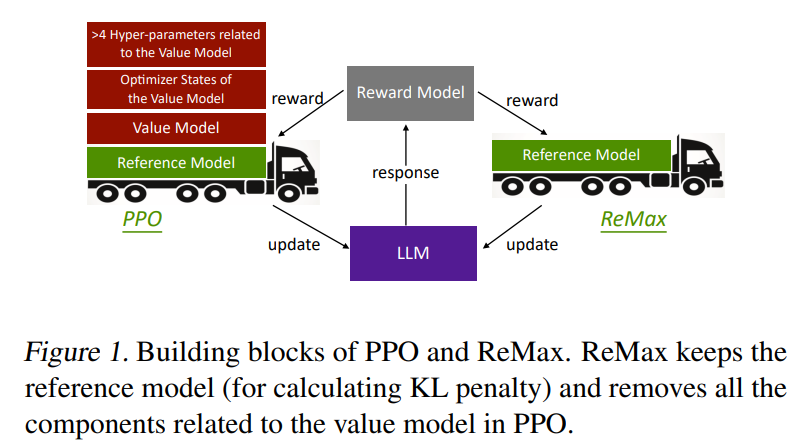

**移除 value model。**


我们识别出 RLHF 的三个重要特性，这些特性与一般的强化学习任务非常不同：快速模拟、确定性转移和轨迹级奖励。第一个特性意味着，可以在最小的时间开销下快速获得一条轨迹（即 LLM 的完整响应）。第二个特性表明，文本上下文仅依赖于过去的标记和当前生成的标记。最后，第三个特性意味着奖励模型仅在响应完成时提供一个单一的值。请参考图 3 进行说明。这三个特性在 PPO 中未被利用，因此我们认为 PPO 并不适合用于 LLM 中的 RLHF。

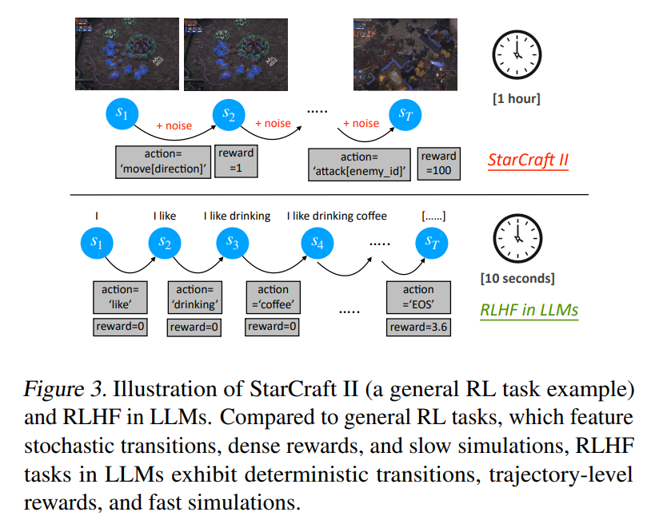

ReMax is built upon the well\-known REINFORCE algorithm。

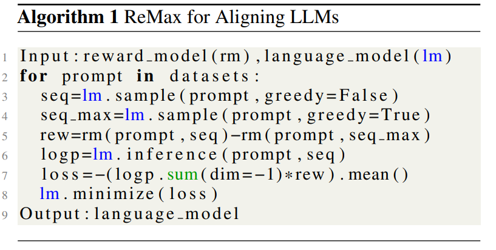

经典的 REINFORCE 算法

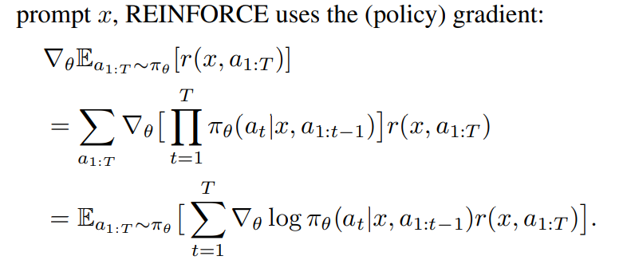

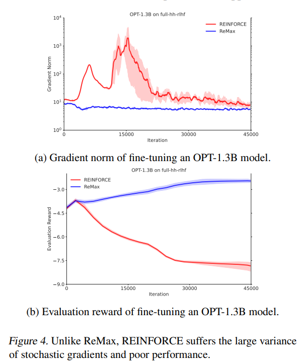

## Why does REINFORCE exhibit a large variance?

众所周知，REINFORCE 算法在随机梯度中存在较大的方差（Sutton \& Barto, 2018）。理论上，这种方差可以归因于两个主要来源：MDP 转移中固有的外部随机性和语言模型的策略决策所带来的内部随机性（即标记生成）。前者常常被用来批评 REINFORCE 在通用强化学习任务中的表现。然而，在 LLM 中的 RLHF 应用中，由于转移是确定性的且奖励函数是已知的，外部随机性被消除了。因此，REINFORCE 在小规模语言模型应用中表现出有效性（Ranzato et al\., 2016; Li et al\., 2016）。然而，当扩展到大规模语言模型时，如我们论文中测试的那样，内部随机性就成为了一个问题。

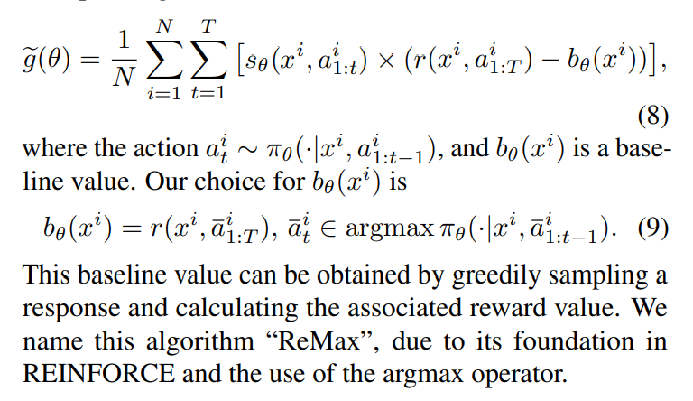

所提出的基线值通过将随机响应的奖励与贪婪响应的奖励进行比较，起到了一种归一化的作用。它有助于减少梯度估计中的方差，并平衡不同提示之间的奖励幅度。我们稍后将展示，尽管引入了基线值，梯度估计器仍然保持无偏。


# RLOO

Back to Basics: Revisiting REINFORCE Style Optimization for Learning from Human Feedback in LLMs

https://arxiv\.org/abs/2402\.14740v2

REINFORCE Leave One\-Out \(RLOO\) 

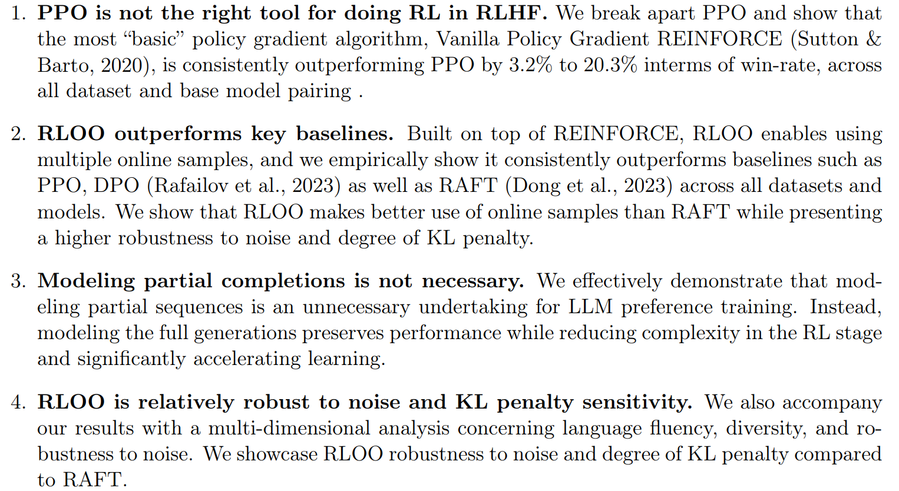

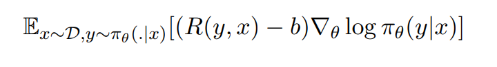

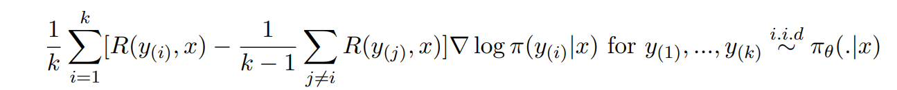

第一个公式是带 baseline 的 REFINFORE 算法，第二个公式是 RLOO，核心是修改了计算 baseline 的方式。

Where k refers to the number of online samples generated, RLOOk considers each y\(i\) individually and uses the remaining k − 1 samples to create an unbiased estimate of the expected return for the prompt。


# GRPO

https://arxiv\.org/abs/2402\.03300v3

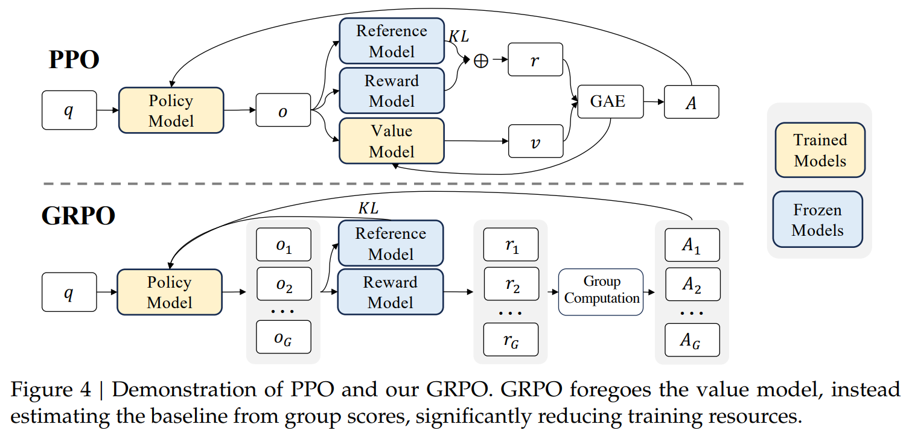

PPO 最大化如下目标：

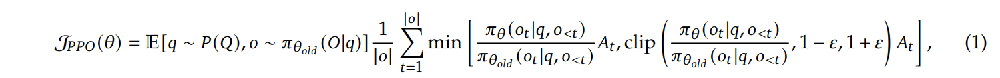

其中每个 token 的即时 reward 计算如下：

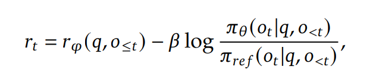

前面项是 reward model 的打分，后面一项是 kl loss。

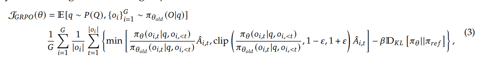

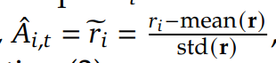

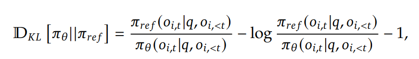

i表示第i组,t 是时刻

有两个主要改进：

1. kl loss 不再是和 reward 合并计算，这样可以简化 A 优势函数计算。而且 kl loss 计算也换成其他形式

2. 优势计算 A 是基于相同 prompt 采样得到的一组响应的 reward 计算得来，而且已经不是每个输出 token 一个 A，而是整个输出只有一个 A， 变成逐样本了。

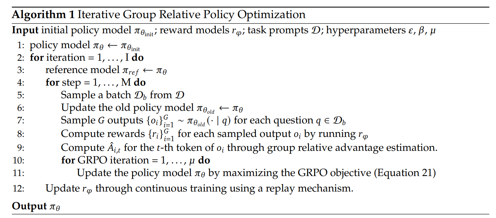

## 实验

基于 DeepSeekMath\-Instruct 7B，RL 的训练数据是与 GSM8K 和 MATH 相关的链式思考格式问题，这些问题来自 SFT 数据，包含大约 144K 个问题。我们排除了其他 SFT 问题，以研究 RL 阶段缺乏数据对基准的影响。我们根据 \(Wang et al\., 2023b\) 构建奖励模型的训练集。我们基于 DeepSeekMath\-Base 7B 训练初始奖励模型，学习率设置为 2e\-5。对于 GRPO，我们将策略模型的学习率设置为 1e\-6，KL 系数为 0\.04。对于每个问题，我们采样 64 个输出。最大长度设置为 1024，训练批量大小为 1024。策略模型在每个探索阶段后仅进行一次更新。我们在基准上评估 DeepSeekMath\-RL 7B，基于 DeepSeekMath\-Instruct 7B。对于 DeepSeekMath\-RL 7B，带有链式思考推理的 GSM8K 和 MATH 可以视为领域内任务，而所有其他基准可以视为领域外任务。


在本文中作者发现： 强化学习通过使输出分布更具鲁棒性来提升模型的整体性能。换句话说，似乎这种改进归因于提升了 TopK 中正确响应的概率，而不是增强了基本能力。

# REINFORCE\+\+

REINFORCE\+\+: An Efficient RLHF Algorithm with Robustness to Both Prompt and Reward Models

https://arxiv\.org/abs/2501\.03262v3

基于 REINFORCE 的方法，如 REINFORCE Leave One\-Out \(RLOO\)、ReMax 和 Group Relative Policy Optimization \(GRPO\)，通过消除评论网络来解决这一限制。然而，这些方法在准确优势估计方面面临挑战。具体来说，它们独立地对每个提示的响应进行优势估计，这可能导致在较简单的提示上过拟合，以及对奖励操控的脆弱性。为了解决这些挑战，我们引入了 REINFORCE\+\+，一种新的方法，它去除了评论模型，同时使用 batch 内的归一化奖励作为基线。我们的实证评估表明，REINFORCE\+\+ 在各种奖励模型中表现出强大的性能，而无需截断提示集。此外，与基于 REINFORCE 的方法相比，它在 RLHF 和长链式思维（CoT）设置中实现了更优的泛化能力。


在没有评论网络的情况下，基于 REINFORCE 的方法通常难以准确估计单个标记的优势。为了解决这一限制，提出了各种基于 REINFORCE 的基线方法，但每种方法都有显著缺点。ReMax 使用贪婪搜索为每个提示生成响应，并将其奖励作为基线，这种方法低效地消耗模型响应，仅用于基线计算。RLOO 和 GRPO 采用不同的方法，通过每个提示生成多个响应：RLOO 使用其他响应的平均奖励作为基线，而 GRPO 则利用所有响应的归一化奖励。这些方法提高了优势估计的准确性，但优化每个提示的多个响应的做法加剧了奖励操控的风险。此外，这些方法为每个提示单独计算奖励基线，导致在优化过程中对特定训练提示的过拟合和不稳定。因此，这些方法需要针对每个任务精心策划提示集。

为了解决这些挑战，我们提出了 REINFORCE\+\+，一种新的基于 REINFORCE 的方法，它去除了 PPO 中的评论模型，并使用全局批次的平均奖励作为基线。这种方法防止了对特定训练提示的过拟合，并在 Bradley\-Terry 和基于规则的奖励模型中表现出稳健性。值得注意的是，REINFORCE\+\+ 消除了对提示集截断的需求，并在 RLHF 和长链式思维（CoT）强化学习设置中实现了强大的泛化性能。

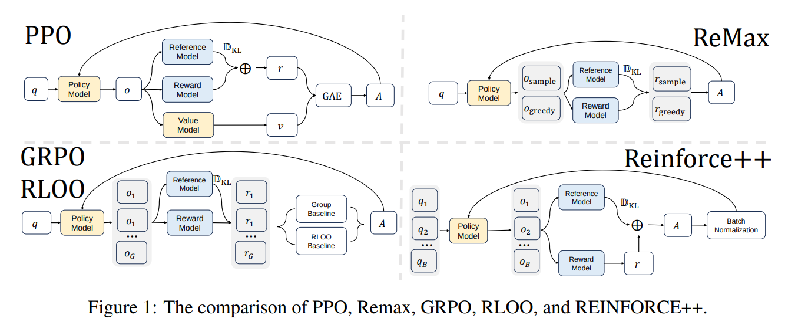

作者分析了 remax/grpo/rloo 等无 value model 的方法，

然而，考虑到数据集的多样性，我们认为在 RLHF 设置中，每个提示的基线奖励并不是必需的。尽管每个提示的基线奖励可以为每个训练提示提供相对准确的优势估计，并帮助模型学习在特定提示下获得最高奖励的响应，但它也加速了奖励操控和过拟合问题。值得注意的是，RLHF 与传统强化学习问题有两个关键区别：

- 在传统的强化学习问题中，我们在同一环境中训练 RL 策略并进行测试。而 RLHF 方法则训练一个提示集，并在另一个数据集上进行测试，甚至是在分布外（OOD）数据集上。

- 在传统的强化学习问题中，总有一个黄金奖励。相比之下，RLHF 方法总是使用奖励模型或基于规则的奖励，这可能会遇到奖励操控的问题。

因此，奖励操控和过拟合问题可能会降低模型性能。具体而言，使用 RLOO 和 GRPO 等方法在一个批次中优化多个响应时，往往会对特定简单提示下的最佳响应进行过拟合，最终降低模型的泛化能力。此外，在单个批次中优化一个提示的多个响应会减少模型输出的多样性，导致标记级优势分布的低多样性，从而在这些标记上造成过拟合。相比之下，PPO 并未显著受到此问题的影响，因为价值网络持续训练并保留已学到的优势，从而支持更具泛化性的标记级优势。因此，为了避免对特定提示的过拟合并增加训练批次中的提示多样性，REINFORCE\+\+ 可以为每个提示抽样一个响应，并在全局批次大小中归一化标记级优势，以提高训练的稳定性。

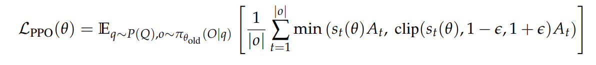

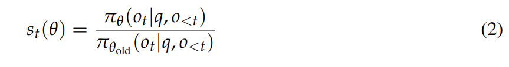

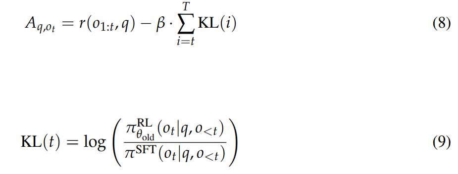

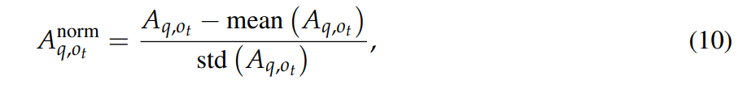

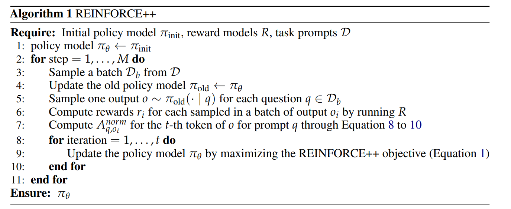

## PPO

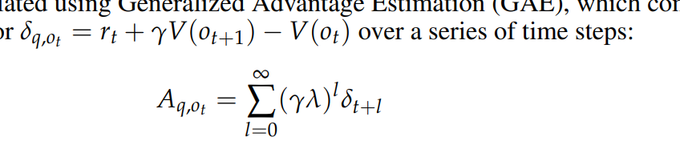

## ReMax

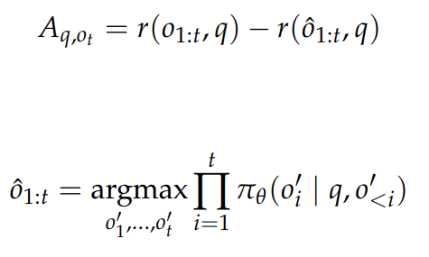

## RLOO

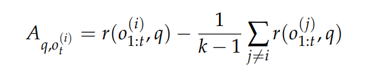

## GRPO

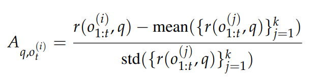


# DAPO

https://arxiv\.org/abs/2503\.14476v1

DAPO: An Open\-Source LLM Reinforcement Learning System at Scale

Decoupled Clip and Dynamic sAmpling Policy Optimization \(DAPO\) algorithm

## Why need dapo

The naive GRPO baseline suffers from several key issues such as entropy collapse, reward noise, and training instability。In our initial GRPO run, we achieved only 30 points on AIME — a performance significantly below DeepSeek’s RL \(47 points\)\.

## 核心改进

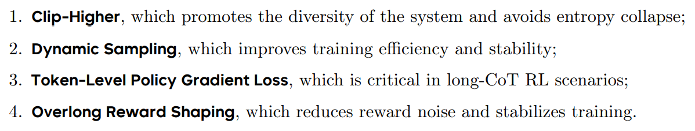

## 原理

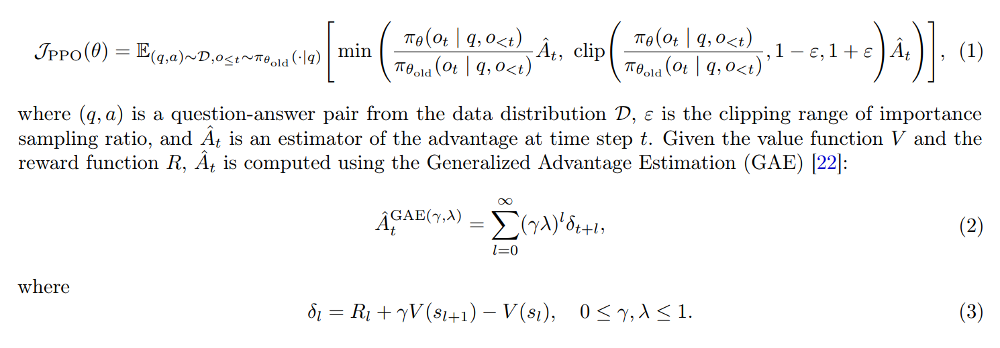

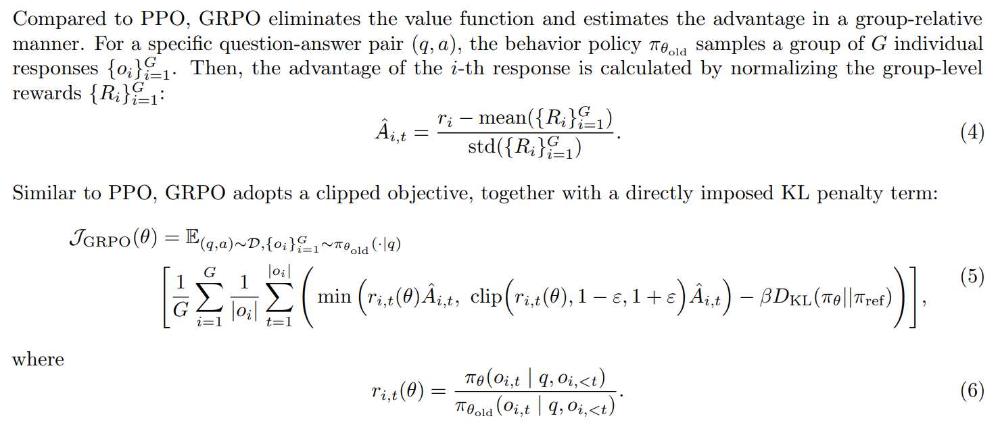

It is also worth noting that GRPO computes the objective at the sample\-level\. To be exact, GRPO first calculates the mean loss within each generated sequence, before averaging the loss of different samples\. As we will be discussing in Section 3\.3, such difference may have an impact on the performance of the algorithm。


### **1 Removing KL Divergence**

KL 惩罚项用于调节在线策略与冻结参考策略之间的差异。在 RLHF 场景中，强化学习的目标是使模型行为一致，而不与初始模型偏离太远。然而，在训练长链式思考推理模型时，模型分布可能与初始模型显著偏离，因此这个限制并不是必要的。因此，我们将从我们提出的算法中排除 KL 项。


### **2 Rule\-based Reward Modeling**

只关注最终答案是否正确，格式是否正确也不管了。换句话来说，如果答案提取不出来，也算错。

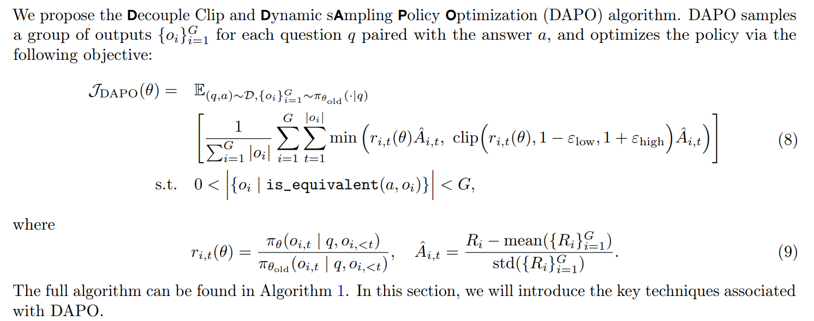

### 3 Raise the Ceiling: Clip\-Higher

In our initial experiments using naive PPO \[21\] or GRPO \[38\], we observed the entropy collapse phenomenon: the entropy of the policy decreases quickly as training progresses \(Figure 2b\)\. The sampled responses of certain groups tend to be nearly identical\. This indicates limited exploration and early deterministic policy, which can hinder the scaling process\.

我们发现，上限裁剪会限制策略的探索。在这种情况下，使“利用token”的概率更高要比提升一个不太可能的“探索代币”的概率容易得多。

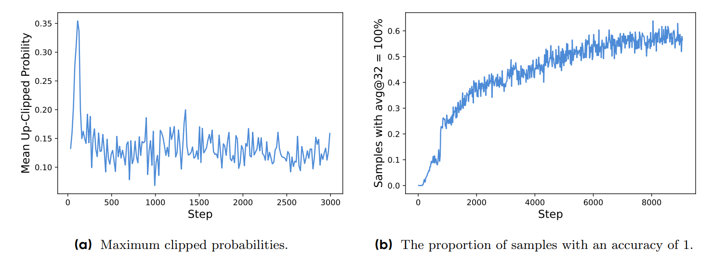

暂时没有理解，clip\-low 和 clip\-high 对更新的影响，还需要仔细思考？


We increase the value of ε\-high to leave more room for the increase of low\-probability tokens\.

We opt to keep ε\-low relatively small, because increasing it will suppress the probability of these tokens to 0, resulting in the collapse of the sampling space。

### 4 The More the Merrier: Dynamic Sampling

Existing RL algorithm suffers from the gradient\-decreasing problem when some prompts have accuracy equal to 1\. For example for GRPO, if all outputs \{oi\} G i=1 of a particular prompt are correct and receive the same reward 1, the resulting advantage for this group is zero\. A zero advantage results in no gradients for policy updates, thereby reducing sample efficiency\. Empirically, the number of samples with accuracy equal to 1 continues to increase。

This means that the effective number of prompts in each batch keeps decreasing, which can lead to larger variance in gradient and dampens the gradient signals for model training\.


we propose to over\-sample and filter out prompts with the accuracy equal to 1 and 0。leaving all prompts in the batch with effective gradients and keeping a consistent number of prompts。Before training, we keep sampling until the batch is fully filled with samples whose accuracy is neither 0 nor 1。

注意，这种策略并不一定会妨碍训练效率，因为如果 RL 系统是同步的且生成阶段没有流水线处理，生成时间通常会被长尾样本的生成所主导。

### 5 Rebalancing Act: Token\-Level Policy Gradient Loss

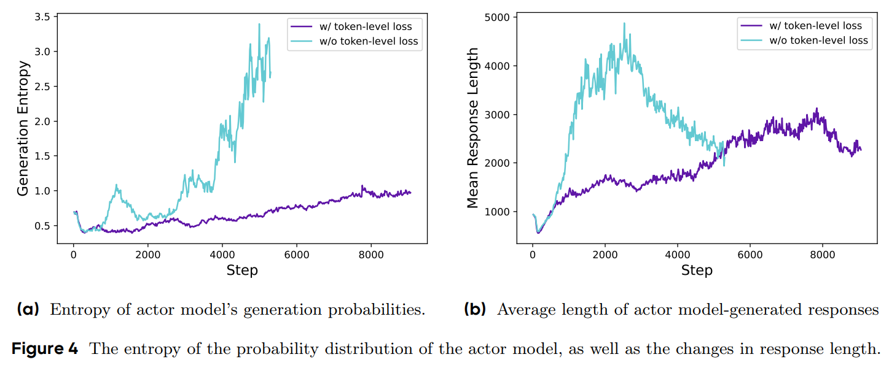

The original GRPO algorithm employs a sample\-level loss calculation, which involves first averaging the losses by token within each sample and then aggregating the losses across samples\. In this approach, each sample is assigned an equal weight in the final loss computation\. However, we find that this method of loss reduction introduces several challenges in the context of long\-CoT RL scenarios\.Since all samples are assigned the same weight in the loss calculation, tokens within longer responses \(which contain more tokens\) may have a disproportionately lower contribution to the overall loss, which can lead to two adverse effects

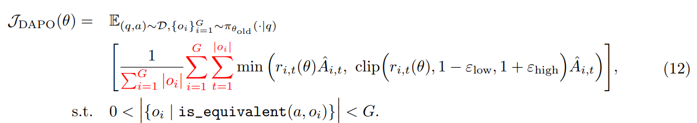

对照

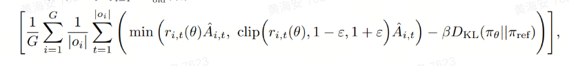

### 6 Hide and Seek: Overlong Reward Shaping

在强化学习训练中，我们通常为生成设置一个最大长度，对于过长的样本进行相应截断。我们发现，对截断样本的不当奖励塑造会引入奖励噪声，显著干扰训练过程。

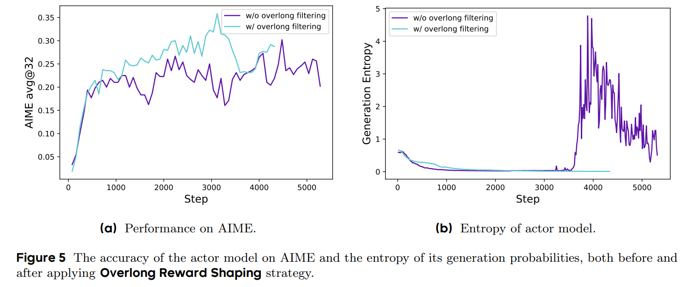

默认情况下，我们对截断样本分配惩罚性奖励。这种方法可能会给训练过程引入噪声，因为一个合理的推理过程可能仅因其过长而受到惩罚。这种惩罚可能会使模型对其推理过程的有效性产生困惑。

为了研究这种奖励噪声的影响，我们首先应用了一种过长过滤策略，该策略屏蔽了截断样本的损失\(也就是过长的样本直接丢掉，不算 loss\)。我们发现这种方法显著稳定了训练并提升了性能。

此外，我们提出了软过长惩罚，这是一种考虑长度的惩罚机制，旨在为截断样本塑造奖励。具体来说，当响应长度超过预定义的最大值时，我们定义了一个惩罚区间。在这个区间内，响应越长，受到的惩罚就越大。这个惩罚将添加到原有的基于规则的正确性奖励中，从而向模型发出信号，提醒其避免过长的响应。

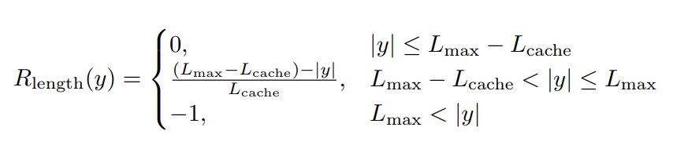

y 应该指的是生成长度。如果长度小于 max\-cache 则没有惩罚，如果长度大于 max 则最大惩罚 \-1，否则就是一个渐进式惩罚。


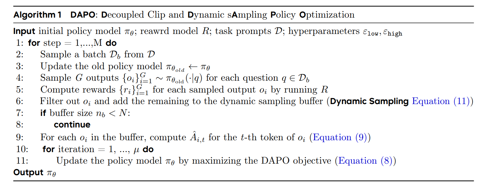

## 实验

For hyper\-parameters, we utilize the AdamW \[39\] optimizer with a constant learning rate of 1 × 10−6 , incorporating a linear warm\-up over 20 rollout steps\. For rollout, the prompt batch size is 512 and we sample 16 responses for each prompt\. For training, the mini\-batch size is set to 512, i\.e\., 16 gradient updates for each rollout step\. For Overlong Reward Shaping, we set the expected maximum length as 16,384 tokens and allocate additional 4,096 tokens as the soft punish cache\. Therefore, the maximum number of tokens for generation is set to 20,480 tokens\. As for the Clip\-Higher mechanism, we set the clipping parameter εlow to 0\.2 and εhigh to 0\.28, which effectively balance the trade\-off between exploration and exploitation\. For evaluation on AIME, we repeat the evaluation set for 32 times and report avg@32 for results stability\. The inference hyperparameters of evaluation are set to temperature 1\.0 and topp 0\.7\.

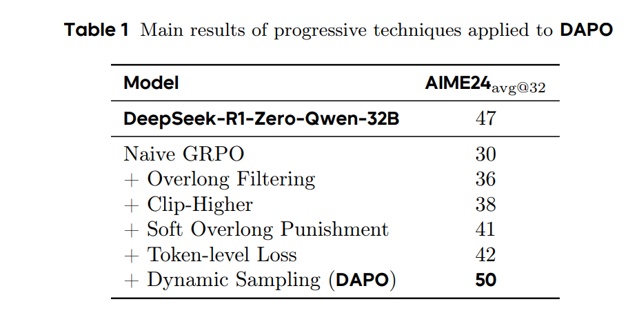

## Training Dynamics

作者还贴心的指出在训练过程中必须要关注以下指标，对于问题非常关键。

- The Length of Generated Responses

- The Dynamics of Reward

- The Entropy of the Actor Model and Generation Probability

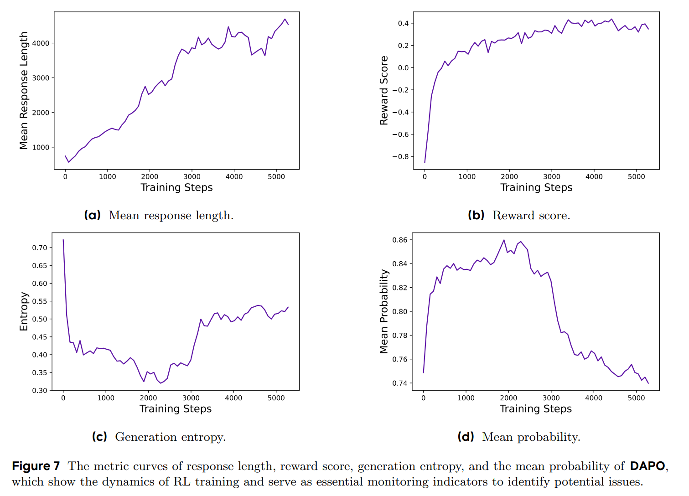

熵 和 mean probability 应该是正好是反的。熵应该维持一个正常范围，太低和太高都不行。

# Dr GRPO

Understanding R1\-Zero\-Like Training: A Critical Perspective

https://arxiv\.org/abs/2503\.20783


为了实现 better token efficiency，而不是无脑的增加响应长度

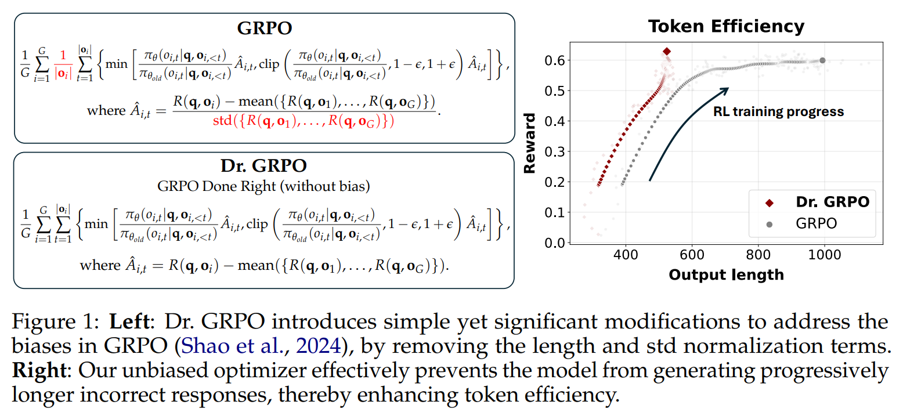

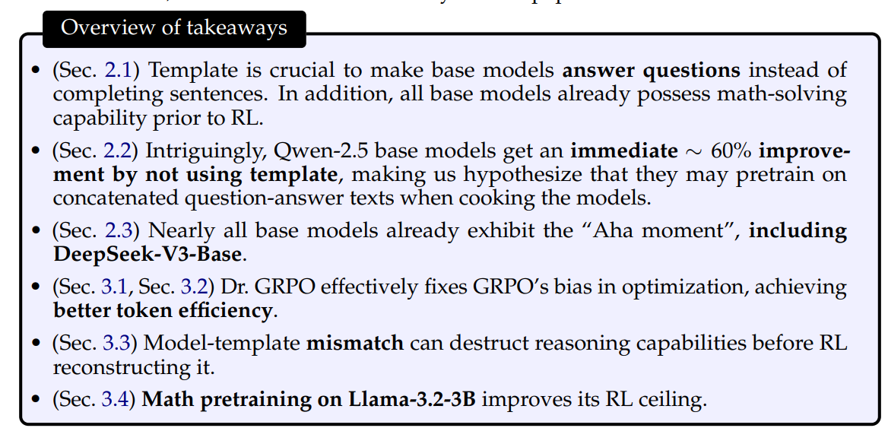

先确定最佳 base 模型的模板，方便后面实验

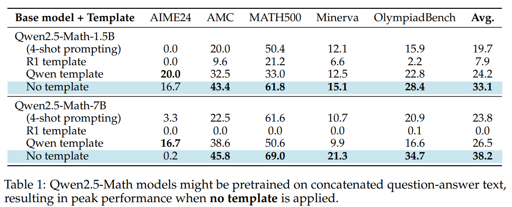

## GRPO Leads to Biased Optimization

GRPO 训练过程中会不断增加响应长度，作者观察到的响应长度增加也可能归因于 GRPO 目标函数中固有的偏差。

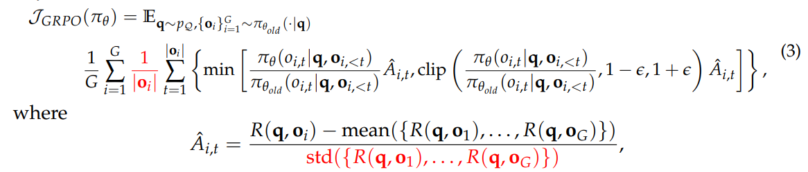

- 响应级别长度偏差：对正的 advantage，这种偏差导致**较短的响应获得更大的梯度更新**，从而使策略倾向于在正确答案中**优先选择更简洁的表达**。相反，对于负的advantage，由于较长的响应具有更大的 \|oi\|，因此它们受到的惩罚较小，这导致策略在错误答案中倾向于选择**较长的响应**。 这个对于的是第一个红色标记，本质上还是因为  advantage计算是基于完整的响应，而不是 token,但是 loss 计算时候是会除以样本长度，导致正A，更长的响应，每个 token 的梯度更小。

- 问题难度级别偏差\(对应第二个红色标记\)：标准差较低的问题（例如，太简单或太困难的问题，结果奖励几乎全为 1 或 0）在策略更新时会被赋予更高的权重，因为 A 偏大。**问题级归一化**导致不同问题在目标函数中的权重不同，从而在优化过程中产生了**难度偏差**。

这两个发现和DAPO的其中两个发现不谋而合，非常类似（注意是类似，实际上两者是有明显区别的），**前者对应的是Token级别的策略梯度损失，后者对应的是动态采样。**


作者的做法就是直接移除这两个红色标记。对于第一个红色标记，是引入一个常数 MAX\_TOKENS 来代替，代表最大生成长度。

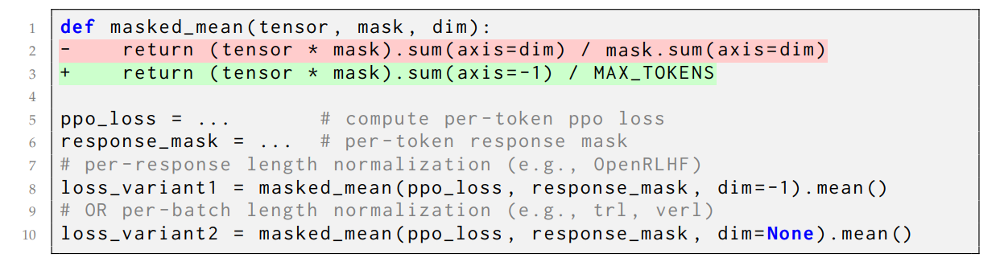

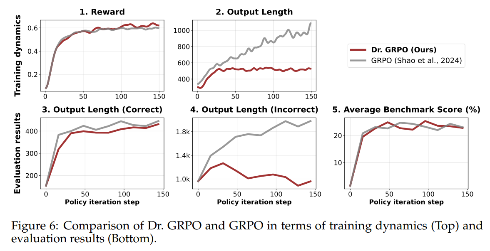

https://zhuanlan\.zhihu\.com/p/1891850600238519595

其他人验证后的主要结论：

1. [Response\-level length bias](https://zhida.zhihu.com/search?content_id=256018946&content_type=Article&match_order=1&q=Response-level+length+bias&zhida_source=entity) 的优化，计算loss时，将 \|oi\| 替换为一个固定值 MAX\_TOKENS 是合理的。且*要比 DAPO 中除以 group 内总 token 数量的方法效果更好*；

2. [Question\-level difficulty bias](https://zhida.zhihu.com/search?content_id=256018946&content_type=Article&match_order=1&q=Question-level+difficulty+bias&zhida_source=entity)，将计算 advantage 时的 std 去掉则就没有必要了，反而会降低原始 GRPO 对困难样本学习的权重。

## GRPO\-PLUS: 在 response\-level 进行权重修正 进一步优化 GRPO

基于 dr grpo 的小改进。

https://zhuanlan\.zhihu\.com/p/1892537040454803732

核心：在计算 advantage 时，可以根据其采样结果中正确结果所占的比例作为 prompt 难易程度判断的标准，进而为不同难度的 prompt 分配不同的权重大小，对 GRPO 算法进行优化。

*是否有什么方法，可以在 *[*response\-level*](https://zhida.zhihu.com/search?content_id=256083667&content_type=Article&match_order=1&q=response-level&zhida_source=entity)*，也就是对同一个 prompt 内部不同的 response 进行学习权重的调整，从而进一步优化 GRPO 呢？*


我们现在训练 GRPO 基本都是在 math/code 场景，使用 rule\-based 进行 0\-1 打分，在计算一个 group 内的 advantage 时，把所有的 response 只简单的分为 “错误 or 正确” 两类，而对于“正确”或者“错误”的相对程度是不加区分的。我们以一个 prompt 采样 8 次结果，其中 4 个正确，4 个错误的 case 为例：

1. Prompt 采样生成 8 个 response；

2. Rule\-based model 打完分后 8个 response 的 scores 为：\[\-1, \-1, \-1, \-1, 1, 1, 1, 1\]；

3. 求 group 内的均值和标准差，0\.0 和 1\.0；

4. 然后以标准 GRPO 的方式计算 response 的 advantage，得到 \[\-0\.99999 \-0\.99999 \-0\.99999 \-0\.99999 0\.99999 0\.99999 0\.99999 0\.99999\]；

也就是说，GRPO 对所有的正确 response 进行相同幅度的奖励，同样的，对所有错误的 response 进行相同幅度的惩罚。这显然是不合理的 —— 正确的结果内部或许会包含错误的推理步骤，且包含的比例各不相同；错误的结果，也分过程错误和结果错误，错误的程度也各有不同。

可以通过比较 response 的 label 和 log\_prob 的偏序关系来进行权重调整

可以从训练的最终优化目标出发，间接将模型在 response 上的 log\_prob 作为当前模型的 predict label，rule\-based 得到的 0\-1 打分作为 true label，通过比较模型在\(正确 response，错误 response\) pair 上两种 label 的偏序关系是否一致，来调整不同 response 的学习力度，即强化逆序样本的学习，进而优化 GRPO 的学习效率呢？

常识上来讲：一个好的模型，对于*正确 response 得到的 log\_prob*，应该是要比在 *错误 response 上得到的 log\_prob *更大的，反之则不对。

那么一个最朴素的优化方案就是 —— 当模型在某个 prompt 下采样得到的 *正确 response 的 log\_prob* 比在 *错误 response 上的 log\_prob *还小的时候，我们就可以加大对两者的奖励/惩罚力度。进一步的，还可以引入 排序学习中 rank\_loss 的 margin，设置一个正确 response 相对 错误 response 的最小 log\_prob 间隔。


# VAPO

https://arxiv\.org/abs/2504\.05118v3

VAPO: Efficient and Reliable Reinforcement Learning for Advanced Reasoning Tasks


Value\-model\-based Augmented Proximal Policy Optimization

作者强调 value\-base model 的好处。

然而，在长链式思考（Long COT）任务中训练一个完美的价值模型面临着重大挑战。首先，由于长轨迹和基于自举方式学习价值的不稳定性，学习一个低偏差的价值模型并非易事。其次，同时处理短响应和长响应也很具挑战性，因为它们在优化过程中可能对偏差\-方差权衡表现出截然不同的偏好。最后，由于长链式思考模式的稀疏奖励信号，进一步加剧了探索与利用之间的平衡需求，这本质上需要更好的机制来应对。

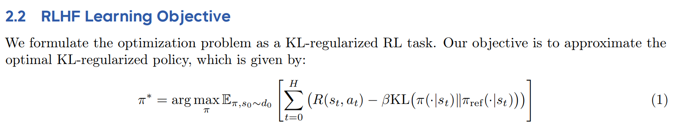

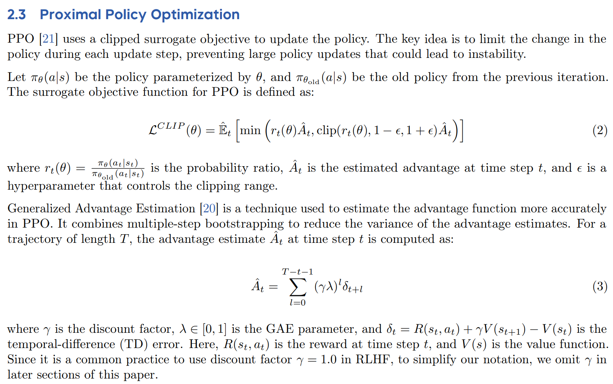

## Challenges in Long\-CoT RL for Reasoning Tasks

### 1 Value Model Bias over Long Sequences

正如 VC\-PPO 中所指出的，用奖励模型初始化价值模型会引入显著的初始化偏差。这种正偏差源于两个模型之间的目标不匹配。奖励模型被训练为对 `<EOS>` 标记进行评分，这促使它对早期标记分配较低的分数，因为它们的上下文不完整。相比之下，价值模型则是在给定策略下，估计所有在 `<EOS>` 之前的标记的预期累积奖励。在早期训练阶段，由于 GAE 的反向计算，在每个时间步 t 上都会存在沿着轨迹累积的正偏差。

使用 GAE 且 λ = 0\.95 的另一种标准做法可能会加剧这个问题。在终止标记 `<EOS>` 处的奖励信号 R\(sT, `<EOS>`\) 以 λ^\(T−t\)R\(sT, `<EOS>`\) 的形式向回传播到第 t 个标记。对于长序列来说，当 T − t ≫ 1 时，这种折扣会将有效奖励信号降低到接近零。因此，价值更新几乎完全依赖自举，依赖于高度偏差的估计，这削弱了价值模型作为可靠的方差减少基线的作用。

### 2 Heterogeneous Sequence Lengths during Training

在复杂推理任务中，长链式思考（CoT）对得出正确答案至关重要，因此模型生成的响应长度往往具有很高的变异性。这种变异性要求算法足够稳健，以管理长度从非常短到极长的序列。因此，常用的固定 λ 参数的 GAE 方法面临显著挑战。

即使价值模型是完美的，静态的 λ 可能也无法有效适应不同长度的序列。对于短长度响应，通过 GAE 获得的估计往往会受到高方差的影响。这是因为 GAE 代表了偏差与方差之间的权衡。在短响应的情况下，估计偏向于方差主导的一侧。另一方面，对于长长度响应，GAE 通常由于自举而导致高偏差。GAE 的递归特性依赖于未来状态值，在长序列中积累错误，加剧了偏差问题。这些限制深深根植于 GAE 计算框架的指数衰减特性中。

### 3 Sparsity of Reward Signal in Verifier\-based Tasks

奖励信号的稀疏性在长链式推理中进一步加剧。由于链式思考显著延长了输出长度，这不仅增加了计算时间，还减少了获得非零奖励的频率。在策略优化中，带有正确答案的采样响应可能极为稀缺且具有很高的价值。

这种情况带来了明显的探索与利用困境。一方面，模型必须保持相对较高的不确定性，以便能够采样多样化的响应，从而增加为给定提示生成正确答案的可能性。另一方面，算法需要有效利用通过艰苦探索获得的正确采样响应，以提高学习效率。如果未能在探索与利用之间找到合适的平衡，模型可能会因过度利用而陷入次优解，或在无效的探索中浪费计算资源。

## 改进

### 1 Mitigating Value Model Bias over Long Sequences


**\(1\) Value\-Pretraining**

值预训练（Value\-Pretraining）被提出来减轻价值初始化偏差。简单地将 PPO 应用于长链式推理任务会导致输出长度崩溃和性能下降等问题。原因在于，价值模型是从奖励模型初始化的，而奖励模型与价值模型之间存在目标不匹配的现象。这个现象在 VC\-PPO 中首次被识别并解决。在本文中，我们遵循值预训练技术，具体步骤如下：

1. 通过从固定策略（例如，sft）中采样持续生成响应，并**使用蒙特卡洛回报更新价值模型**。

2. 训练价值模型，直到关键训练指标（包括价值损失和解释方差）达到足够低的值。

3. 保存价值检查点，并在后续实验中加载该检查点。


**\(2\) Decoupled\-GAE**

解耦 GAE（Decoupled\-GAE）在 VC\-PPO 中被证明是有效的。这项技术将价值和策略的优势计算解耦。对于价值更新，建议使用 λ = 1\.0 计算价值更新目标。这个选择带来了无偏的梯度下降优化，有效地解决了长链式推理任务中的奖励衰减问题。

However, for policy updates, using a smaller λ is advisable to accelerate policy convergence under computational and time constraints\. In VC\-PPO, this is achieved by employing different coefficients in advantage computation: λ critic = 1\.0 and λ policy = 0\.95\. In this paper, we adopt the core idea of decoupling GAE computation\.

### 2 Managing Heterogeneous Sequence Lengths during Training

This method dynamically adjusts the parameter in GAE according to the sequence length, enabling adaptive advantage estimation for sequences of varying lengths\. Additionally, to enhance the training stability of mixed\-length sequences, we replace the conventional sample\-level policy gradient loss with a token\-level policy gradient loss

**\(1\) Length\-Adaptive GAE**

在 VC\-PPO 中，λ policy 被设置为常数值 λ policy = 0\.95。然而，在考虑 GAE 计算时，对于长度超过 100 的较长输出序列，对应于奖励的 TD 误差系数为 0\.95^100 ≈ 0\.006，这实际上接近于零。因此，使用固定的 λ policy = 0\.95，GAE 计算变得受到潜在偏差的自助法 TD 误差的主导。这种方法可能并不适合处理极长的输出序列。

we propose Length\-Adaptive GAE for policy updates\. Our method aims to ensure a more uniform distribution of TD\-errors across both short and long sequences\. 

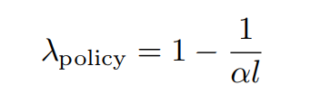

l 输出长度，a 是超参。

**\(2\) Token\-Level Policy Gradient Loss**

Following DAPO, all tokens within a single training batch are assigned uniform weights, thereby enabling the problems posed by long sequences to be addressed with enhanced efficiency\.

### 3 Dealing with Sparsity of Reward Signal in Verifier\-based Tasks

**\(1\) Clip\-Higher**

Following DAPO

**\(2\) Positive Example LM Loss**

Positive Example LM Loss 旨在提高在强化学习（RL）训练过程中对正样本的利用效率。在复杂推理任务的 RL 背景下，一些任务的准确率极低，大多数训练样本产生错误答案。传统的策略优化策略通过抑制错误样本的生成概率，在 RL 训练中效率低下，因为试错机制会带来较高的计算成本。鉴于这一挑战，最大化正确答案的利用率在策略模型采样时显得尤为重要。为了解决这个问题，我们采用了一种模仿学习的方法，通过为 RL 训练过程中采样的正确结果引入额外的负对数似然（NLL）损失\.

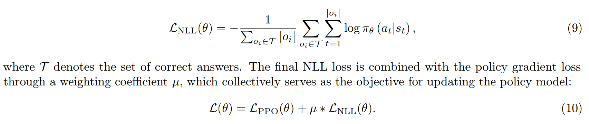

**\(3\) Group\-Sampling **

组采样（Group\-Sampling）用于在同一提示下采样具有区分性的正负样本。在固定的计算预算下，有两种主要的方法来分配计算资源。第一种方法尽可能多地使用提示，每个提示仅采样一次。第二种方法减少每批次的不同提示数量，将计算资源重新分配给重复生成。我们观察到，后者的方法带来了边际上更好的性能，这归因于它引入了更丰富的对比信号，从而增强了策略模型的学习能力\.

## 实验

该算法对标的是 ppo，不是基于 rlue\-base 的 grpo 算法，因此需要 reward model。

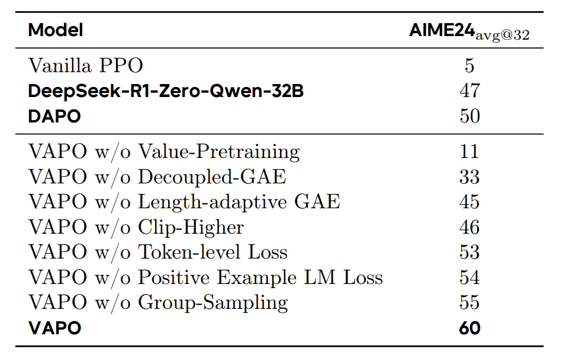

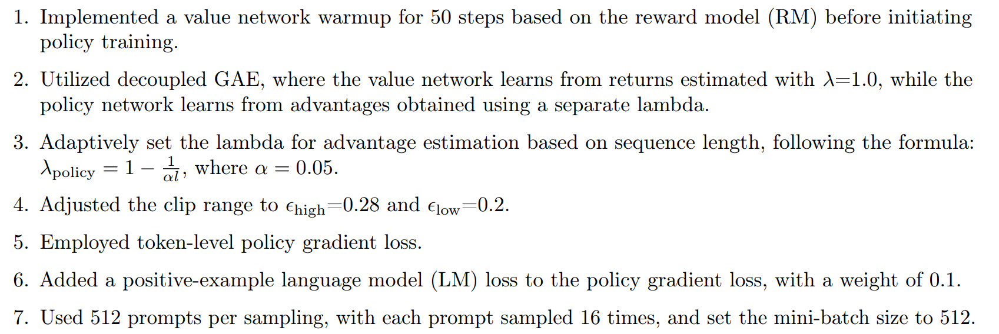

1. Without Value\-Pretraining, the model experiences the same collapse as Vanilla PPO during training, converging to a maximum of approximately 11 points\.

2. Removing the decoupled GAE causes reward signals to exponentially decay during backpropagation, preventing the model from fully optimizing long\-form responses and leading to a 27\-point drop\.

3. Adaptive GAE balances optimization for both short and long responses, yielding a 15\-point improvement\.

4. \.Clip higher encourages thorough exploration and exploitation; its removal limited the model’s maximum convergence to 46 points\. 

5. Token\-level loss implicitly increased the weight of long responses, contributing to a 7\-point gain\.

6. Incorporating positive\-example LM loss boosted the model by nearly 6 points\. 

7. Using Group\-Sampling to generate fewer prompts but with more repetitions also resulted in a 5\-point improvement\.

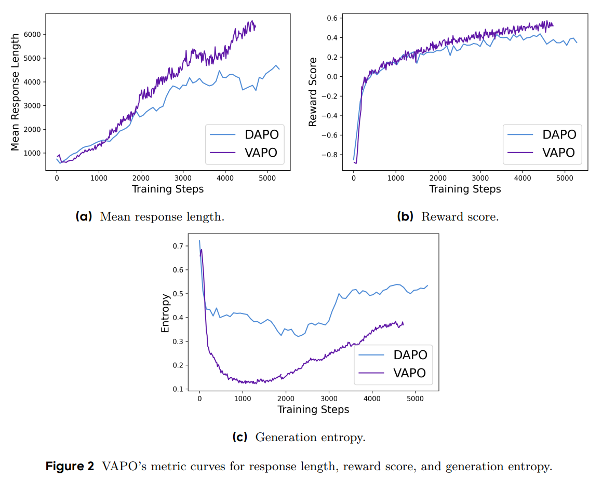

# DeepSeek\-R1

DeepSeek\-R1: Incentivizing Reasoning Capability in LLMs via Reinforcement Learning

https://arxiv\.org/abs/2501\.12948v1

https://zhuanlan\.zhihu\.com/p/19868935152

我们介绍了我们的第一代推理模型，DeepSeek\-R1\-Zero 和 DeepSeek\-R1。DeepSeek\-R1\-Zero 是通过大规模强化学习（RL）训练的模型，未进行监督微调（SFT），展现出了卓越的推理能力。通过 RL，DeepSeek\-R1\-Zero 自然展现出许多强大且引人入胜的推理行为。然而，它也面临着可读性差和语言混合等挑战。为了解决这些问题并进一步提升推理性能，我们引入了 DeepSeek\-R1，该模型在 RL 之前结合了多阶段训练和冷启动数据。DeepSeek\-R1 在推理任务上的表现可与 OpenAI\-o1\-1217 相媲美。为了支持研究社区，我们将 DeepSeek\-R1\-Zero、DeepSeek\-R1 以及基于 Qwen 和 Llama 从 DeepSeek\-R1 中提取的六个密集模型（1\.5B、7B、8B、14B、32B、70B）开源。

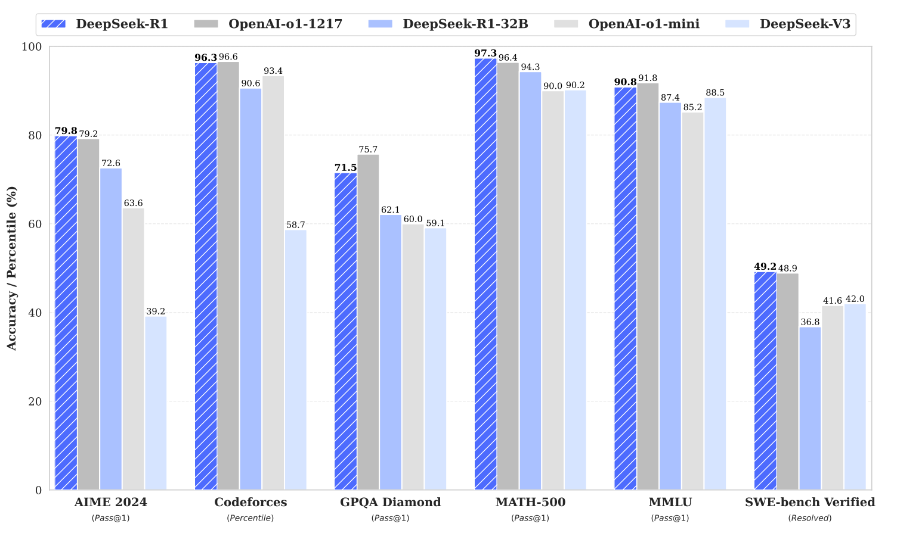

we use DeepSeek\-V3\-Base as the base model and employ GRPO \(Shao et al\., 2024\) as the RL framework to improve model performance in reasoning\. During training, DeepSeek\-R1\-Zero naturally emerged with numerous powerful and interesting reasoning behaviors\. After thousands of RL steps, DeepSeek\-R1\-Zero exhibits super performance on reasoning benchmarks\. For instance, the pass@1 score on AIME 2024 increases from 15\.6% to 71\.0%, and with majority voting, the score further improves to 86\.7%, matching the performance of OpenAI\-o1\-0912\.

然而，DeepSeek\-R1\-Zero 面临着可读性差和语言混合等挑战。为了解决这些问题并进一步提升推理性能，我们引入了 DeepSeek\-R1，该模型结合了一小部分冷启动数据和多阶段训练流程。具体而言，我们首先收集了数千条冷启动数据，以微调 DeepSeek\-V3\-Base 模型。随后，我们进行类似于 DeepSeek\-R1\-Zero 的以推理为导向的强化学习（RL）。在 RL 过程接近收敛时，我们通过对 RL 检查点进行拒绝采样创建新的监督微调（SFT）数据，并结合来自 DeepSeek\-V3 的监督数据，涵盖写作、事实问答和自我认知等领域，然后对 DeepSeek\-V3\-Base 模型进行再训练。在用新数据微调后，该检查点经历了额外的 RL 过程，考虑了来自所有场景的提示。经过这些步骤，我们获得了一个称为 DeepSeek\-R1 的检查点，其性能与 OpenAI\-o1\-1217 相当。

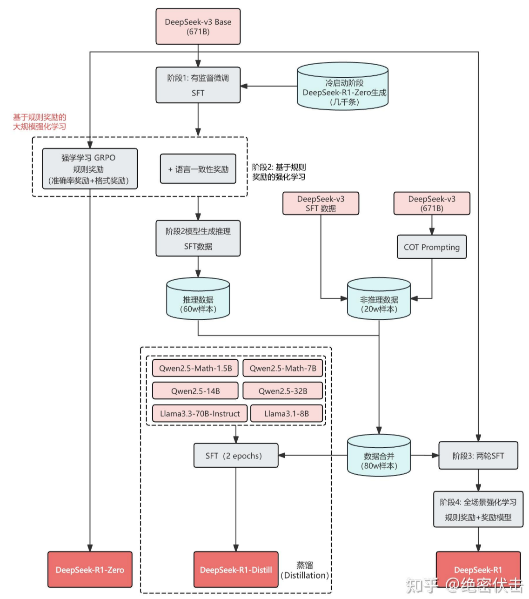

## 1 DeepSeek\-R1\-Zero

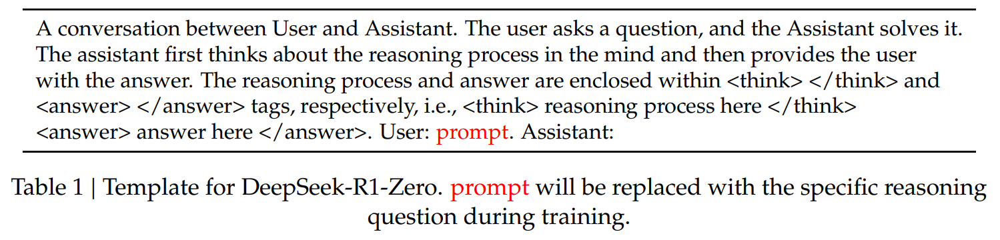

DeepSeek\-R1\-Zero 直接在基础模型上应用强化学习，不使用任何 SFT 数据。 为了训练 DeepSeek\-R1\-Zero，deepseek 采用了一种基于规则的奖励系统，该系统主要由两种奖励组成：

- **准确率奖励**：准确率奖励模型评估响应是否正确。例如，在具有确定性结果的数学问题中，模型需要以指定的格式（box）提供最终答案，从而能够通过基于规则的验证来可靠地确认正确性。同样，对于 LeetCode 问题，可以使用编译器根据预定义的测试用例生成反馈。

- **格式奖励**: 除了准确性奖励模型，还采用了一种格式奖励模型，要求模型将其思考过程放在 ‘think’ 和 ‘/think’ 标签之间。

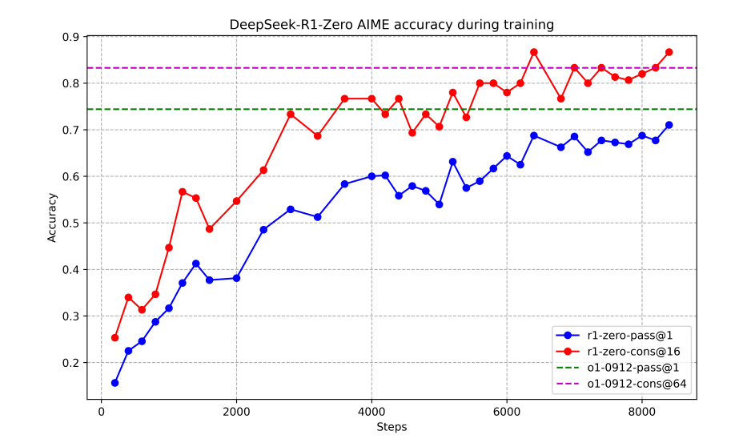

随着 RL 训练的持续推进，DeepSeek\-R1\-Zero 的性能呈现出稳步提升的趋势。尤为引人注目的是，其 AIME 2024 的 pass@1 分数实现了显著飞跃，从最初的 15\.6% 飙升至 \*\*71\.0%\*\*，达到了与 OpenAI\-o1\-0912 相媲美的性能水平\.

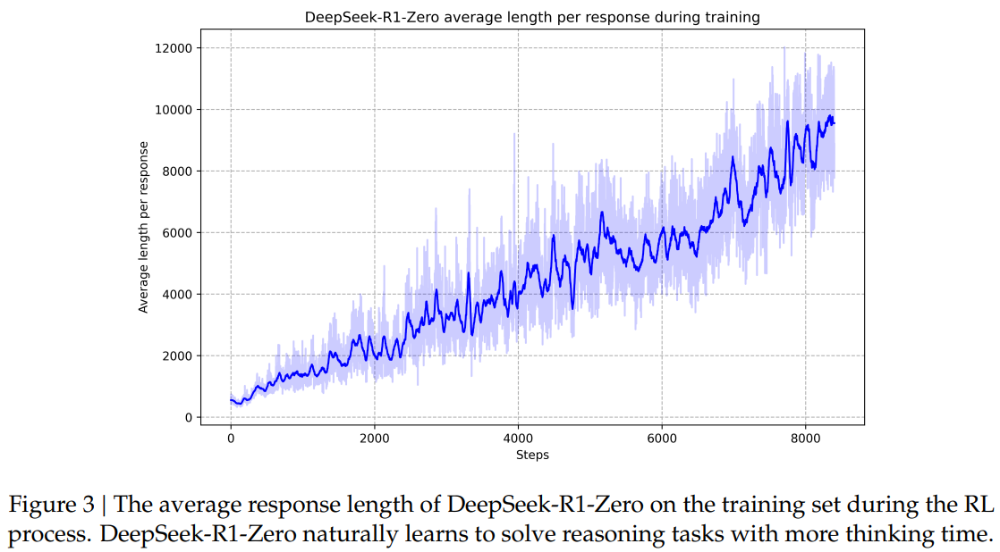

通过延长测试时间的计算，DeepSeek\-R1\-Zero 自然而然地获得了解决更复杂推理任务的能力，从生成数百个 token 到数千个 token，模型得以更深入地探索和优化其思维过程。


在 DeepSeek\-R1\-Zero 的训练历程中，出现了一个特别引人注目的现象——“顿悟时刻”（aha moment）。如下图所示，这一关键时刻发生在模型的中间发展阶段。在这个阶段，DeepSeek\-R1\-Zero 通过重新审视其初始策略，学会了为问题分配更多思考时间。这一行为不仅彰显了模型推理能力的显著提升，也是强化学习如何催生意外且复杂成果的一个生动例证。

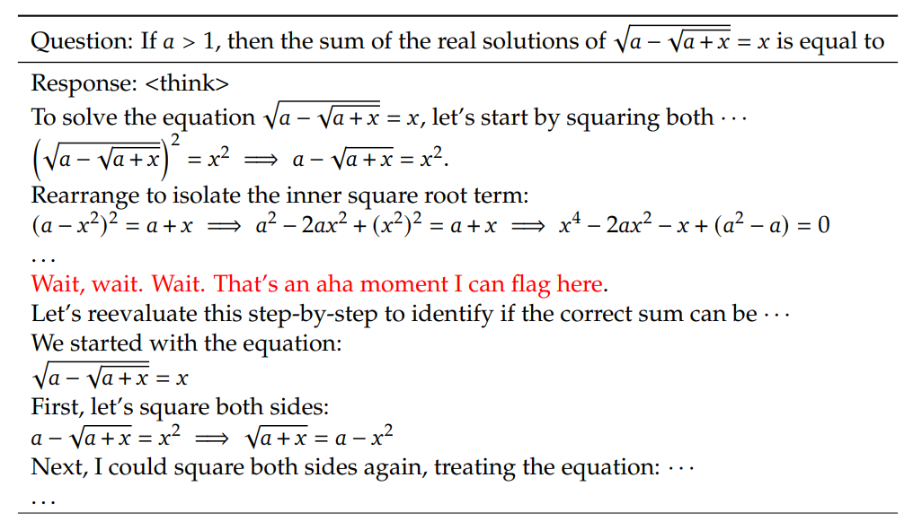

在大规模强化学习中，模型的「思考过程」会不断与最终的正确率奖励相互作用。当模型最初得出的答案并未得到较高奖励时，它会在后续的推理中「回头反省」，尝试补充或修正先前的思路，从而获得更高的奖励。随着强化学习的迭代，这种「主动回溯、推翻先前想法并重新推理」的行为逐渐巩固，便在输出中表现为所谓的「aha moment」。本质上，这是 RL 为模型「留出了」足够的思考和试错空间，当模型自行发现更优思路时，就会出现类似人类「恍然大悟」的瞬间。

## 2 DeepSeek\-R1: 冷启动强化学习

DeepSeek\-R1 使用了冷启动 \+ 多阶段训练的方式：

- 阶段1：使用少量高质量的 CoT 数据进行冷启动，预热模型。

- 阶段2：进行面向推理的强化学习，提升模型在推理任务上的性能。

- 阶段3：使用拒绝采样和监督微调，进一步提升模型的综合能力\(微调的对象是最开始的 base 模型\)。

- 阶段4：再次进行强化学习，使模型在所有场景下都表现良好。


DeepSeek\-R1 使用冷启动数据的主要目的是为了解决 DeepSeek\-R1\-Zero 在训练早期出现的训练不稳定问题。相比于直接在基础模型上进行 RL，使用少量的 SFT 数据进行冷启动，可以让模型更快地进入稳定训练阶段：

- 可读性：冷启动数据使用更易于理解的格式，输出内容更适合人类阅读，避免了 DeepSeek\-R1\-Zero 输出的语言混乱、格式混乱等问题。

- 潜在性能：通过精心设计冷启动数据的模式，可以引导模型产生更好的推理能力。

- 稳定训练：使用 SFT 数据作为起始点，可以避免 RL 训练早期阶段的不稳定问题。

### 阶段1: 冷启动

冷启动阶段使用少量高质量的 CoT 数据对基础模型进行微调，作为 RL 训练的初始起点。侧重点是让模型掌握基本的 CoT 推理能力，并使模型的输出更具可读性。

为了获取这些数据，deepseek 探索了几种策略：利用长思维回答作为 few\-shot 示例，直接提示模型生成包含反思和验证步骤的详细答案，以及收集 DeepSeek\-R1\-Zero 的输出并通过人工标注者进行细化。最终收集了数千条冷启动数据，用以微调 DeepSeek\-V3\-Base 作为 RL 训练的起点。DeepSeek\-R1 创建的冷启动数据采用了一种可读模式，明确将输出格式定义为：\|special\_token\|\<reasoning\_process\>\|special\_token\<summary\>。

### 阶段2: 推理导向的强化学习

在冷启动模型的基础上进行 RL 训练，侧重点是提升模型在推理任务上的性能。在这个阶段，会引入语言一致性奖励，该奖励根据思维链（CoT）中目标语言单词的比例来计算，以减少推理过程中的语言混合问题。

尽管消融实验表明，语言一致性奖励会导致模型性能略有下降，但它更符合人类的偏好，提高了内容的可读性。最终，通过将推理任务的准确性与语言一致性奖励直接相加，形成了综合的奖励函数。随后，对微调后的模型进行了强化学习（RL）训练，直至其在推理任务上达到收敛。

### 阶段3: 拒绝采样和 SFT

使用上一阶段的 RL 模型进行拒绝采样，生成高质量的推理和非推理数据，并用这些数据对原始的 base 模型进行微调。侧重点是提升模型的综合能力，使其在写作、事实问答等多种任务上表现良好。

当 RL 训练接近收敛时，使用中间的 checkpoint 来采样监督微调（SFT）数据。与初期主要关注推理能力的冷启动数据不同，这一阶段加入了其他领域的数据，旨在增强模型在写作、角色扮演以及其他通用任务上的表现。具体的数据生成和模型微调步骤如下：

- 对于推理数据，构建推理 prompt，并从上述 RL 训练的 checkpoint 中进行拒绝采样，以生成推理轨迹。在之前的阶段，仅使用了基于规则的奖励来评估数据。然而，在这个阶段，通过添加其他数据来丰富数据集，其中部分数据使用了生成奖励模型，通过将真实值和模型预测输入 DeepSeek\-V3 进行判断。同时，为了提升数据质量，过滤掉混合语言、长段落和代码块的思维链。对于每个提示，采样多个响应，并仅保留正确的响应。最终，收集了大约60万个与推理相关的训练样本。

- 对于非推理数据，如写作、问答、翻译等任务，使用 DeepSeek\-V3 SFT 数据集的一部分。对于简单的 query，如“你好”，不使用思维链作为回答。经过筛选和整理，最终收集了大约20万个与推理无关的训练样本。

最终，使用大约80万个样本（60w推理\+20w通用）对 DeepSeek\-v3\-Base 模型进行了两轮的 SFT。

### 阶段4: 所有场景下的强化学习

在上一阶段 SFT 模型的基础上进行 RL 训练，侧重点是使模型在所有场景下都能表现良好，包括推理任务和非推理任务，并且保证模型的安全性和无害性。

具体而言，我们使用奖励信号和多样化的提示分布组合来训练模型。对于推理数据，我们遵循 DeepSeek\-R1\-Zero 中概述的方法，利用基于规则的奖励来指导数学、代码和逻辑推理领域的学习过程。对于一般数据，我们采用奖励模型来捕捉复杂和细微场景中的人类偏好。我们基于 DeepSeek\-V3 流程，并采用类似的偏好对和训练提示分布。在有用性方面，我们专注于最终总结，确保评估强调响应对用户的实用性和相关性，同时最小化对基础推理过程的干扰。在无害性方面，我们评估模型的整个响应，包括推理过程和总结，以识别和缓解生成过程中可能出现的任何潜在风险、偏见或有害内容。最终，奖励信号和多样化数据分布的结合使我们能够训练出在推理方面表现卓越，同时优先考虑有用性和无害性的模型。

也就是说要想做到通用，作者对于有精确答案的场景例如 math code 等采用 rule\-base 的 reward，通用问题直接采用 reward model 进行训练。

## 3 蒸馏小模型

为了获得更高效的小模型，并使其具有 DeekSeek\-R1 的推理能力，直接对 Qwen 和 Llama 等开源模型进行了微调，使用的是上面 SFT DeepSeek\-R1 的80万数据。研究结果表明，这种直接蒸馏方法显著提高了小模型的推理能力。在这里使用的基座模型是 Qwen2\.5\-Math\-1\.5B、Qwen2\.5\-Math\-7B、Qwen2\.5\-14B、Qwen2\.5\-32B、Llama\-3\.1\-8B 和 Llama\-3\.3\-70B\-Instruct。

对于蒸馏模型，只进行 SFT，不包括 RL 阶段，尽管加入 RL 可以显著提高模型性能。


为什么在蒸馏到小模型时\(32b 也算小模型\)，直接用 RL 在小模型上训练不如先做大模型再蒸馏？

大模型在 RL 阶段可能出现许多高阶推理模式。而小模型因为容量和表示能力有限，很难在无监督或纯 RL 情境下学到相似水平的推理模式。

蒸馏可将「大模型的推理轨迹」直接转移给小模型，小模型只需要模仿大模型相对完备的推理流程，可以在较小训练/推理开销下取得远胜于自身独立强化学习的效果。

在蒸馏模型的实现中，仅采用了 SFT 阶段，而未包含 RL 阶段，尽管 RL 的加入能显著提升模型性能。按照 deepseek 的说法，本工作的核心目的在于展示蒸馏技术的有效性，而将 RL 阶段的深入探索留给更广泛的研究社群去完成。

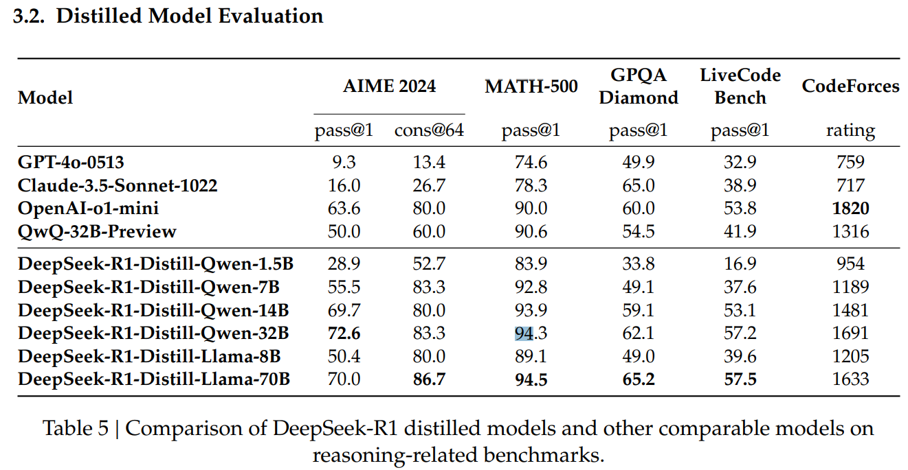

在图 5 中，我们观察到，通过蒸馏 DeepSeek\-R1，小模型取得了显著成效。然而，这引发了一个疑问：小模型是否能在不依赖蒸馏的情况下，仅凭大规模强化学习训练就达到类似的性能水平？

为了解答这一疑问，deepseek 对 Qwen\-32B\-Base 进行了超过 10,000 步的大规模强化学习训练，最终得到了DeepSeek\-R1\-Zero\-Qwen\-32B。如图 6 所示，经过大规模强化学习训练后，其性能与 QwQ\-32B\-Preview 相当。然而，通过蒸馏 DeepSeek\-R1 得到的 DeepSeek\-R1\-Distill\-Qwen\-32B 在所有基准测试中的表现均明显优于DeepSeek\-R1\-Zero\-Qwen\-32B。这表明，在 Qwen\-32B\-Base 上，直接进行强化学习训练的效果不如通过蒸馏DeepSeek\-R1。那在 sft 的模型上进行 rl 应该有提升的，只不过提升多大还不清楚。

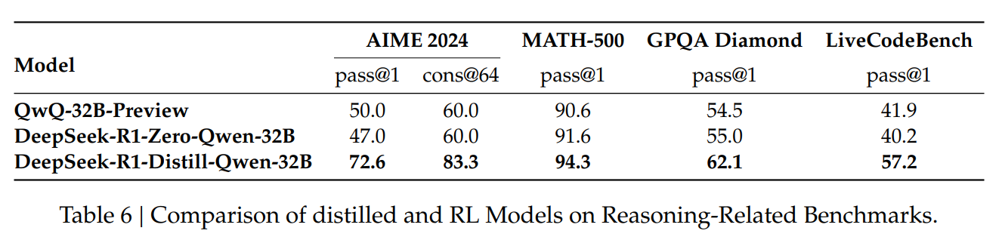


**不过全文并没有说 RL 的数据量，估计是非常大的量。**

# Kimi k1\.5

Kimi k1\.5: Scaling Reinforcement Learning with LLMs

https://arxiv\.org/abs/2501\.12599v2


- 长上下文扩展。我们将强化学习的上下文窗口扩展到 128k，并观察到随着上下文长度的增加，性能持续改善。我们方法的一个关键思想是使用部分回滚来提高训练效率——即通过重用大量之前的轨迹来采样新的轨迹，避免从头生成新轨迹的成本。我们的观察表明，上下文长度是与大型语言模型（LLMs）继续扩展强化学习的关键维度。

- 改进的策略优化。我们推导了长链式思维（CoT）下的强化学习公式，并采用了一种在线镜像下降的变体进行稳健的策略优化。该算法通过我们的有效采样策略、长度惩罚和数据配方优化进一步改进。

- 简单框架。长上下文扩展结合改进的策略优化方法，建立了一个简单的强化学习框架，以便与 LLMs 进行学习。由于我们能够扩展上下文长度，学习到的 CoT 显示出规划、反思和纠正的特性。增加的上下文长度有助于增加搜索步骤的数量。因此，我们展示了在不依赖更复杂技术（如蒙特卡洛树搜索、价值函数和过程奖励模型）的情况下，仍然可以实现强大的性能。

- 多模态性。我们的模型在文本和视觉数据上进行联合训练，具备对这两种模态进行联合推理的能力。

Moreover, we present effective long2short methods that use long\-CoT techniques to improve short\-CoT models\. Specifically, our approaches include applying length penalty with long\-CoT activations and model merging\.

## Reinforcement Learning with LLMs

The development of Kimi k1\.5 consists of several stages: pretraining, vanilla supervised fine\-tuning \(SFT\), long\-CoT supervised fine\-turning, and reinforcement learning \(RL\)\. 

### 1 RL Prompt Set Curation

the quality and diversity of the RL prompt set play a critical role in ensuring the effectiveness of reinforcement learning\.

- 多样化覆盖：提示应涵盖广泛的学科，如 STEM、编程和一般推理，以增强模型的适应性，并确保其在不同领域的广泛适用性。

- 平衡难度：提示集应包括易、中、难问题的良好分布，以促进逐步学习，并防止模型对特定复杂度水平的过拟合。

- 准确可评估性：提示应允许验证者进行客观和可靠的评估，确保模型性能基于正确推理进行测量，而不是表面模式或随机猜测。

论文里面详细写了如何得到符合这些数据的做法，可以参考下。

### 2 Long\-CoT Supervised Fine\-Tuning

通过精炼的强化学习提示集，我们采用提示工程构建一个小而高质量的长链式思维（CoT）热身数据集，包含针对文本和图像输入的准确验证推理路径。这种方法类似于拒绝采样（RS），但专注于通过提示工程生成长 CoT 推理路径。生成的热身数据集旨在 encapsulate 关键的认知过程，这些过程对类人推理至关重要，例如：规划，即模型在执行前系统地列出步骤；评估，涉及对中间步骤的批判性评估；反思，使模型能够重新考虑和完善其方法；以及探索，鼓励考虑替代解决方案。通过在这个热身数据集上进行轻量级的监督微调，我们有效地使模型内化这些推理策略。因此，微调后的长 CoT 模型在生成更详细和逻辑连贯的响应方面表现出更强的能力，从而提高了其在各种推理任务中的表现。

### 3 RL

我们在训练系统中排除了价值网络，这在之前的研究中也曾被利用（Ahmadian 等，2024）。虽然这一设计选择显著提高了训练效率，但我们也假设传统的价值函数用于经典强化学习中的信用分配可能不适合我们的上下文。考虑一个场景，模型生成了部分链式思维（CoT）（z1, z2, \.\.\. , zt），并且有两个潜在的下一个推理步骤\(就是说下一个 t 时刻可能选择任何一个\)：zt\+1 和 z′t\+1。假设 zt\+1 直接导致正确答案，而 z′t\+1 包含一些错误。如果能够访问到一个完美的价值函数，它将表明 zt\+1 相较于 z′t\+1 保持更高的价值。根据标准的信用分配原则，选择 z′t\+1 将受到惩罚，因为相对于当前策略它具有负优势。

然而，探索 z′t\+1 对于训练模型生成长 CoT 是极其有价值的。通过将从长 CoT 得出的最终答案的理由作为奖励信号，模型可以学习从 z′t\+1 进行试错的模式，只要它能够成功恢复并到达正确答案。从这个例子中可以得出的关键要点是，我们应该鼓励模型探索多样的推理路径，以增强其解决复杂问题的能力。这种探索性的方法生成了丰富的经验，有助于关键规划技能的发展。我们的主要目标不仅限于在训练问题上获得高准确率，而是专注于为模型提供有效的问题解决策略，最终提高其在测试问题上的表现。

上面写的比较难以理解，我个人理解应该是说要保持足够的探索，如果用 value model，其天然就会抑制这种看似错误但是实际上可能有利于探索。


**Length Penalty**

We observe an overthinking phenomenon that the model’s response length significantly increases during RL training\. Although this leads to better performance, an excessively lengthy reasoning process is costly during training and inference, and overthinking is often not preferred by humans\.To address this issue, we introduce a length reward to restrain the rapid growth of token length, thereby improving the model’s token efficiency

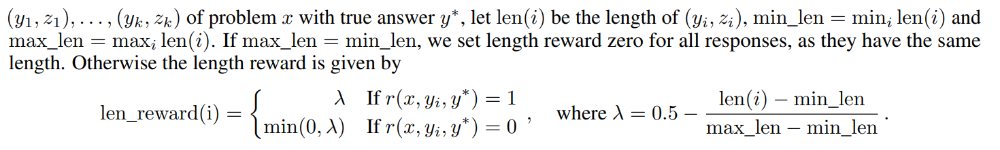

本质上，我们鼓励较短的回答，并对正确的较长回答进行惩罚，同时明确对错误答案的长回答进行惩罚。然后，将这种基于长度的奖励与原始奖励通过加权参数相加。

在我们的初步实验中，长度惩罚可能会在训练初期减慢训练速度。为了解决这个问题，我们建议在训练过程中逐渐增加长度惩罚。具体而言，我们在没有长度惩罚的情况下进行标准的策略优化，然后在剩余的训练中施加一个恒定的长度惩罚。


**Sampling Strategies**

尽管强化学习（RL）算法本身具有相对良好的采样特性（更困难的问题提供更大的梯度），但它们的训练效率仍然有限。因此，一些定义明确的先验采样方法可能会带来更大的性能提升。我们利用多个信号来进一步改善采样策略。

首先，我们收集的 RL 训练数据自然带有不同的难度标签。例如，数学竞赛问题比小学数学问题更难。其次，由于 RL 训练过程对同一问题进行了多次采样，我们还可以跟踪每个问题的成功率作为难度的指标。我们提出了两种采样方法，以利用这些先验知识来提高训练效率。

**课程采样**：我们从较简单的任务开始训练，逐渐过渡到更具挑战性的任务。由于初始的 RL 模型性能有限，在非常困难的问题上花费有限的计算预算往往会导致正确样本很少，从而降低训练效率。同时，我们收集的数据自然包含年级和难度标签，使得基于难度的采样成为提高训练效率的直观有效的方法。

**优先采样**：除了课程采样，我们还使用优先采样策略，重点关注模型表现不佳的问题。我们跟踪每个问题的成功率 si，并按 1 − si 的比例进行采样，这样成功率较低的问题将获得更高的采样概率。这将模型的努力引导到其薄弱环节，从而加速学习并提高整体表现。

### 4 More Details on Training Recipe

## Long2short: Context Compression for Short\-CoT Models

虽然长链式思维（long\-CoT）模型表现优异，但与标准的短链式思维（short\-CoT）大型语言模型相比，它在测试时消耗了更多的标记。然而，可以将长 CoT 模型的思维先验转移到短 CoT 模型上，从而在有限的测试时标记预算下也能提高性能。

作者提出了 4 种解决办法：

- **模型融合**：将长文本 CoT 模型和短文本 CoT 模型的权重进行平均，得到一个新的模型。不用训练。

- **最短拒绝采样**：从多个采样结果中选择最短且正确的答案，然后进行 sft

- **DPO（Direct Preference Optimization）**：使用长文本 CoT 模型生成的答案作为偏好数据来训练短文本 CoT 模型。

- **Long2short RL**：在标准 RL 训练后，使用长度惩罚对模型进行微调，进一步提高短文本 CoT 模型的效率。

## RL Infrastructure

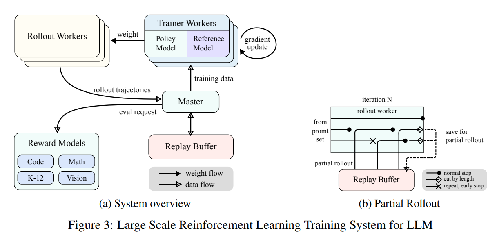

每次迭代包括一个 rollout 阶段和一个训练阶段。在rollout阶段，由中央主控协调的rollout工作者通过与模型交互生成rollout轨迹，产生对各种输入的响应序列。这些轨迹随后存储在重放缓冲区中，通过打乱时间相关性来确保训练数据集的多样性和公正性。在随后的训练阶段，训练工作者访问这些经验以更新模型的权重。这个循环过程使模型能够不断从其行动中学习，随着时间的推移调整其策略以提高性能。

中央主控充当数据流和通信的核心管理者，协调 rollout 工作者、训练工作者、使用奖励模型进行评估以及重放缓冲区之间的交互。它确保系统和谐运行，平衡负载并促进高效的数据处理。


训练工作者访问这些rollout轨迹，无论是在单次迭代中完成还是跨多个迭代进行，以计算梯度更新，从而优化模型的参数并提高其性能。这个过程由奖励模型监督，奖励模型评估模型输出的质量，并提供必要的反馈以指导训练过程。奖励模型的评估在确定模型策略的有效性和引导模型朝向最佳性能方面尤为关键。

此外，系统还包含一个代码执行服务，专门处理与代码相关的问题，并与奖励模型密切相关。该服务在实际编码场景中评估模型的输出，确保模型的学习与真实世界的编程挑战紧密对接。通过对模型的解决方案进行实际代码执行验证，这个反馈循环对于优化模型策略和提升其在代码相关任务中的表现至关重要。


**Partial Rollouts for Long CoT RL**

我们工作的主要理念之一是扩展长上下文的强化学习（RL）训练。部分回滚是一种关键技术，能够有效应对处理长链式思维（long\-CoT）特征的挑战，通过管理长短轨迹的回滚。这项技术建立了一个固定的输出标记预算，限制每个回滚轨迹的长度。如果在回滚阶段某个轨迹超出了标记限制，未完成的部分将保存到重放缓冲区，并在下一次迭代中继续。这确保没有单个的长轨迹垄断系统的资源。此外，由于回滚工作者是异步操作的，当某些工作者处理长轨迹时，其他工作者可以独立处理新的较短回滚任务。这种异步操作最大化了计算效率，确保所有回滚工作者都积极参与训练过程，从而优化系统的整体性能。

如图3b所示，部分回滚系统通过将长响应分解为跨迭代的多个段来工作（从迭代 n\-m 到迭代 n）。重放缓冲区充当中心存储机制，维护这些响应段，其中只有当前迭代（迭代 n）需要进行在线计算。之前的段（迭代 n\-m 到 n\-1）可以高效地从缓冲区重用，消除了重复回滚的需要。这种分段方法显著减少了计算开销：系统不是一次性rollout整个响应，而是逐步处理和存储段，使得能够生成更长的响应，同时保持快速的迭代时间\(**一定全部生成完成才能用于后续训练，否则一直存储在 buffer 中**\)。在训练过程中，可以排除某些段的损失计算\(我估计是因为前面生成的数据来自非常 old 的 policy，不适合当前 policy 训练，因此可以把前部分响应屏蔽，只计算当前 policy 生成的部分即可\)，以进一步优化学习过程，使整个系统既高效又可扩展。

部分回滚的实现还提供了重复检测。系统识别生成内容中的重复序列，并提前终止这些序列，减少不必要的计算，同时保持输出质量。


目前 rollout 阶段，rollout engine 主要采用 data parlllesim 的方式，每个 rollout worker 负责一部分的采样任务，各自维护并且完成自身的全部 requests。每个 worker 上需要处理的 requests 数量是相近的，但是 requests 之间的 decode length 差距显著。然而，requests 被更上层的 DP Manager 发送到各个 worker 后，worker 之间不会再交换这些 requests。比如将 10 万条 prompt 分给 8 个 worker，每个 worker 平均而言各自处理 1\.25 万条。这种完全割裂的结构使得一旦某个 shard 内部存在“慢任务”，整个训练就会被这个 shard 拖住，GPU 资源无法充分利用。如此以来，decode length 的不均衡直接导致了 rollout 阶段可能会出现严重的长尾阻塞问题：在严格 on\-policy 的前提下——用于当前 iteration 训练的 tracjories 必须由当前 iteration 的 policy model rollout 得到——一些 requests 完成 rollout 很快，另一些却需要很长时间，导致整个 rollout 阶段的流水线被处理慢任务的 worker 阻塞，资源利用率显著下降。且随着多任务训练的数据量加大，这种阻塞越发显著。

更加严重的是，目前的 dp manager 采用的 routing 策略多以 prefix maximum 为主，也即发送到每个 worker 上的 request 彼此尽可能存在 shared prefix。这种 prefix maximum 的 routing policy 会将具有相似 prefix 的任务分配到同一个 worker 上，而与 long decode 任务相似 prefix 的任务也更大概率是 long decode 任务。prefix maximum 虽然节省了 prefill 开销，但它可能会将大量的 long decode request 都发到了同一个 worker 上，这加剧了我们先前描述的情况。

总结一下，现有的 Rollout 流程的 imbalance 来自于以下几个方面：

- Rollout 同步：因为严格 on\-policy 要求，全部的 rollout 请求完成后，才能统一进入训练阶段；

- 长尾任务拖慢整体：部分计算资源完成短任务后空等，资源浪费；

- DP 设置下任务隔离，无法跨 worker 调度等待队列；

- 主流 routing policy 在节约 prefill 开销的同时忽略了 decode\-heavy 任务造成的影响。

为了解决上述问题，近期出现了一种广受关注的优化方案——Partial Rollout。这个策略的核心思想是在一定程度上牺牲 on\-policy 要求，不再等待所有 prompt 全部完成推理，而是增大采样量，挑选出已经完成 rollout 的部分先进行训练，剩下的未完成的样本延后处理。

举个简单例子：

- 每轮训练仅需 128 个样本，但同时启动 512 个 requests 进行推理；

- 当有 128 个 prompt rollout 完成时，立即进入训练流程；

- 剩余 384 个未完成 rollout 的 prompt：

- 继续使用当前 policy 异步完成（如果训练和推理互不干扰）；或中止并缓存当前生成状态，在后续迭代中恢复，继续推理或重头开始。

使用 Partial Rollout 需要考虑一个 policy model 的选择问题：这些样本是继续使用它们最初启动时的旧模型（旧 policy）继续推理，还是使用当前已经更新的模型（新 policy）重新开始。无论采取何种具体补全策略，一旦允许先训练已完成的部分、而后处理剩余未完成任务，就不可避免地引入了训练数据的策略不一致性——即训练数据不再严格来源于当前最新的 policy，可能夹杂了部分旧 policy 生成的轨迹。这种非一致性并非偶然，而是 Partial Rollout 设计带来的必然，它是对训练效率做出的主动妥协。我们需要在（非）严格 on\-policy、训练效果、推理吞吐量之间进行取舍。

回到 partial rollout 本身，对未在当前 iteration 完成采样的样本，如果使用参数更新后模型继续完成 rollout，那么这部分数据的生成过程会跨越多个 policy 的阶段，不再是完全的“on\-policy”训练数据。这节省了时间和算力，提升了整体训练效率，不过效果没有严格保证。如果丢弃 rollout 未完成的样本，坚持使用最新 policy 从头来生成全部训练数据，虽然保证了训练的严谨性，但之前未采用的样本的推理推理开销就被浪费了，影响了资源利用率。

Partial Rollout 的核心问题不可回避，它必然在训练效率和策略一致性之间做出权衡：它以牺牲一部分策略新鲜度为代价，显著提升了训练的吞吐率，并减少了资源浪费。目前虽然缺乏明确的理论证据证明其负面影响，但我们应当正视它对策略学习带来的潜在影响，并在工程效率与算法严谨性之间做出理性取舍。

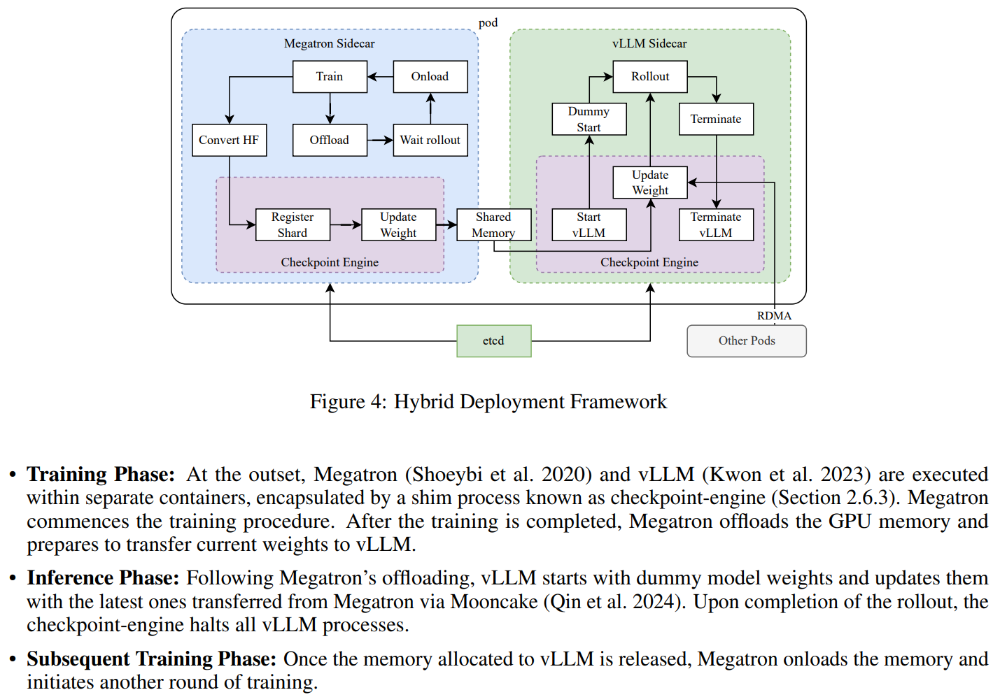

# Seed\-Thinking\-v1\.5

Seed1\.5\-Thinking: Advancing Superb Reasoning Models with Reinforcement Learning

https://arxiv\.org/abs/2504\.13914v3


# Light\-R1

Light\-R1: Curriculum SFT, DPO and RL for Long COT from Scratch and Beyond

https://arxiv\.org/abs/2503\.10460v3

Our curriculum training progressively increases data difficulty, combined with multi\-staged post\-training\. Our LightR1\-32B model, trained from Qwen2\.5\-32BInstruct, outperforms DeepSeek\-R1\-DistillQwen\-32B in math reasoning\.

通过使用来自我们课程数据集的 3,000 个具有挑战性的示例对 DeepSeek\-R1\-Distilled 模型（由 DeepSeek 团队在专有数据上进行预调优）进行微调，我们获得了最先进的 7B 和 14B 模型，而 32B 模型 Light\-R1\-32B\-DS 的表现与 QwQ\-32B 和 DeepSeek\-R1 相当。此外，我们通过在长推理模型上应用 GRPO 扩展了我们的工作。我们的最终模型 Light\-R1\-14B\-DS 在数学方面的 14B 模型中实现了最先进的性能，AIME24 和 AIME25 的得分分别为 74\.0 和 60\.2，超越了许多 32B 模型和 DeepSeek\-R1\-Distill\-Llama70B。

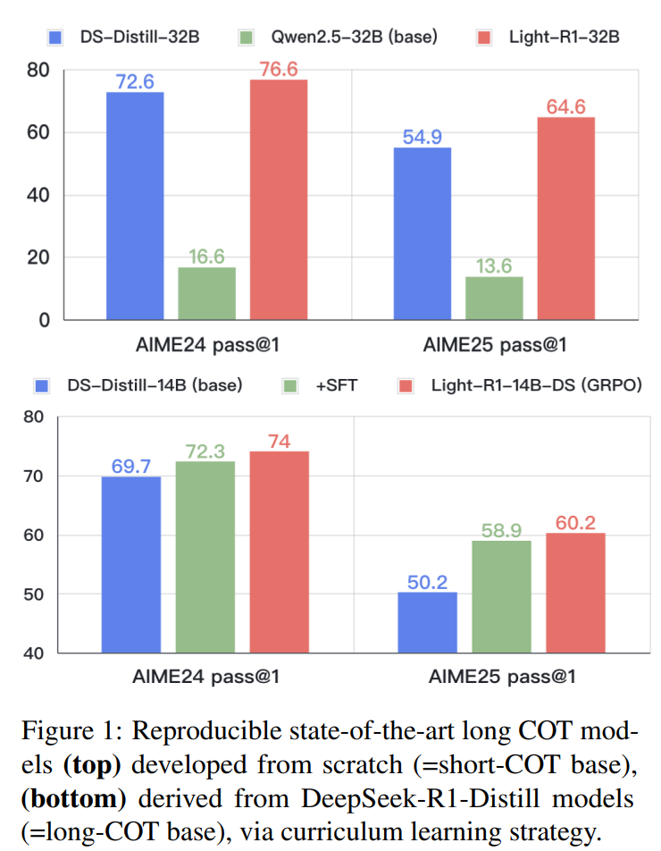


# GRPO\-LEAD

GRPO\-LEAD: A Difficulty\-Aware Reinforcement Learning Approach for Concise Mathematical Reasoning in Language Models

https://arxiv\.org/abs/2504\.09696v1

https://github\.com/aeroplanepaper/GRPO\-LEAD


一个关键问题是由二元和基于规则的准确度指标引起的固有奖励稀疏性，这显着阻碍了有效的模型训练。具体来说，当对给定问题的所有生成的响应要么均匀正确，要么不正确时，得到的均匀奖励信号提供了最小的区分，导致学习梯度较弱，模型收敛较慢。为了详细说明，如果问题组中的所有输出都正确，则每个输出都会收到相同的正反馈，稀释有意义的策略改进所需的信息梯度。相反，一致不正确的响应不会产生有用的信息来指导策略细化\.

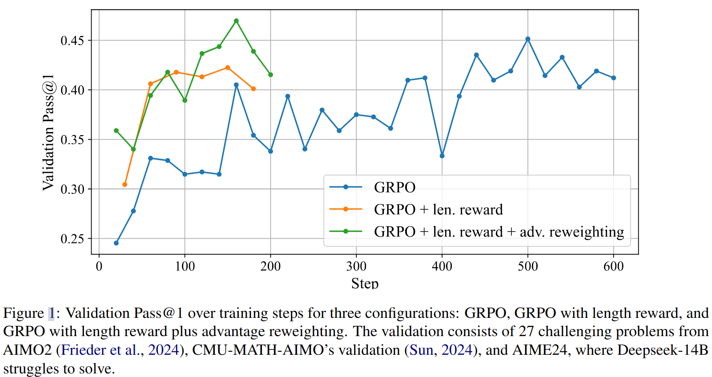

看起来只是收敛快一点，实际上效果没有好多少。

## 1 Length\-Dependent Accuracy Reward

我们首先单独计算正确响应的子集并计算其令牌长度的平均 μ 和标准偏差 σ

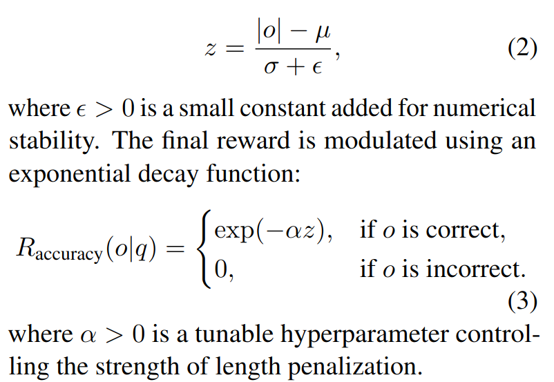

这个公式确保了过长的正确响应被系统地惩罚，而相对简洁的响应被放大了。与静态或绝对长度约束不同，我们的方法利用了标准化偏差，允许动态适应每个问题的分布属性。

## 2 Explicit Penalty for Incorrect Answers

为了解决这个问题，我们提出了一种修订的奖励结构，明确惩罚错误响应，从而强化正确输出与错误输出之间更清晰的决策边界。

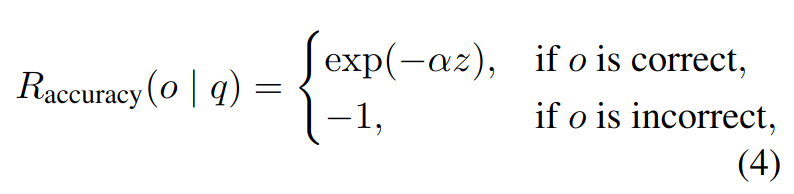

## 3 Advantage Reweighting for Difficulty\-Aware Training

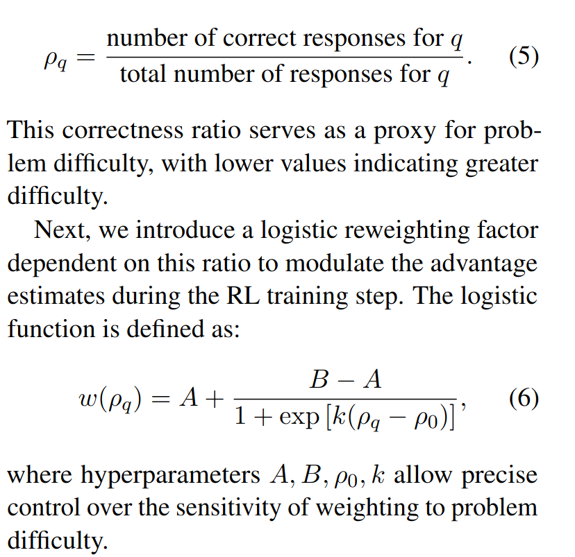

超参也太多了吧。

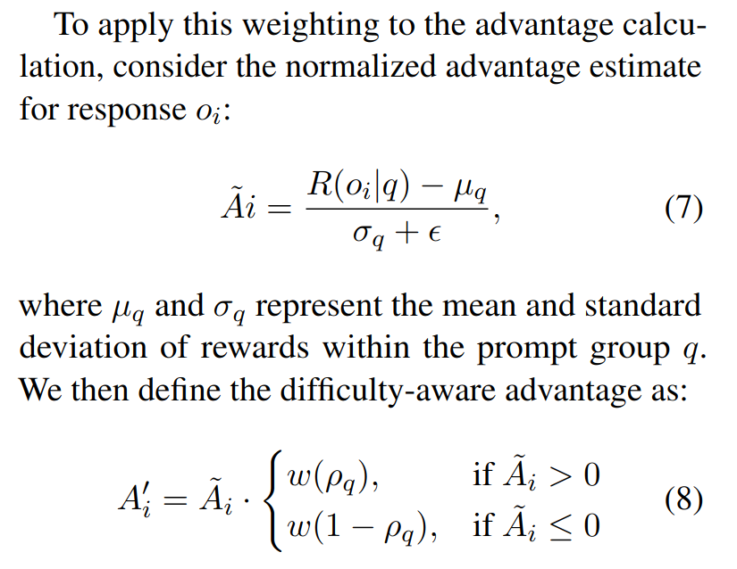

这种公式确保在困难问题（低 ρq）中，正确响应（因其稀少而极具价值）由于加权 w\(ρq\) 的增加而获得更大的更新。相反，对于较简单的问题（高 ρq），错误响应受到更强的惩罚，从而加大了在高性能应被期待的问题上的决策边界。

上述公式的通俗理解是： 

- 在整个组内，如果正确的样本很少，说明很难，低 q，此时对于整个组内所有正确的响应都乘上一个更大的权重，对于整个组内所有错误的响应乘上一个相对较小的权重，突出正样本

- 在整个组内，如果正确的样本很多，说明都很简单，高 q，此时对于整个组内所有正确的响应都乘上一个较小的权重，对于整个组内所有错误的响应乘上一个相对较大的权重，因为都是简单样本都能学错。突出负样本

**但是我感觉这么做还是有问题，可能要用类似 focal loss 的做法比较好。**

## 4 Impact of Model Scale and Data Quality on Reinforcement Learning Effectiveness

首先，我们的实验揭示了模型规模与强化学习（RL）改进之间的明确依赖关系。尽管 RL 微调显著提升了 Deepseek Distilled 7B 模型在相对简单问题上的表现，但在复杂推理任务上仍然难以取得实质性进展。7B 模型往往过早地收敛到错误的推理路径，并且经常忽视关键的边缘情况。相反，我们观察到 Deepseek Distilled 14B 模型本身的表现优于经过 RL 增强的 7B 变体，尤其是在需要全面推理或列举多种情况的问题上。这些发现表明，较小模型在高级推理能力上的固有限制，强调了更大规模基础模型在 RL 微调中有效应对复杂问题的重要性。

为了进一步研究增强模型能力的方法，我们生成了一个针对性的 dataset，包含 13,000 个数学推理问题，来源于 DeepScaler 提供的数据集（Luo 等，2025），其中包括历史 AMC、AIME 和 OmniMath 考试，附带使用 QwQ32B（Team，2025）生成的解决方案，这是一种最先进的小规模推理模型。在使用这个专业数据集进行监督微调（SFT）后，我们应用了我们提出的 RL 策略。尽管在 SFT 阶段初期出现了过拟合的迹象，但我们观察到后续的 RL 微调迅速缓解了这些问题，相较于直接对原始模型进行 RL 微调，显示出更快的收敛速度以及在 pass@1 准确率和整体精度上的显著提升。

我们的结果进一步突显了数据质量和课程策略在持续强化学习（RL）改进中的关键作用。首先，我们在大约 7,000 个具有挑战性的问题子集上应用 RL（难度评级 ≥ 4，来自 DeepScaler 数据集），获得了一个稳健的初始策略检查点。随后，我们使用由第一阶段正确性分布中识别出的最具挑战性问题（正确率低于 50%）组成的课程来细化这一策略，并补充了来自 Light\-R1 第二阶段数据集的高难度示例（Wen 等，2025）。实证评估表明，这种两阶段课程显著增强了模型在复杂任务上的持续改进能力。

最后，我们解决了一个持续存在的格式问题——重复的 n\-gram 模式，这可能是由于在初始 SFT 阶段缺乏明确的序列结束（EOS）信号所导致的。通过暂时移除与长度相关的奖励，并引入对重复 n\-gram 的显式负奖励（−1\.5），我们在精度和 pass@1 指标上实现了进一步的改进。这一干预展示了有针对性的奖励修改在缓解特定输出格式异常方面的有效性。总之，我们的实验确认了初始模型能力、数据集质量和有针对性的奖励工程对基于 RL 的微调结果的重大影响。这些发现共同为增强语言模型在不同复杂任务中生成简洁、准确且结构良好的响应提供了系统化的方法。

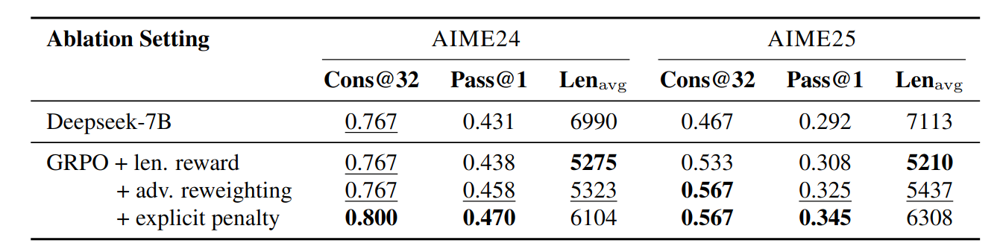

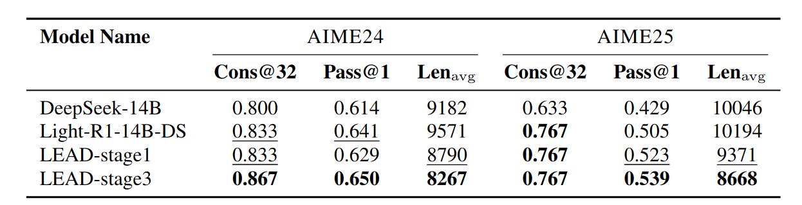

# Logic\-RL

Logic\-RL: Unleashing LLM Reasoning with Rule\-Based Reinforcement Learning

https://arxiv\.org/abs/2502\.14768


https://zhuanlan\.zhihu\.com/p/25355823769

https://zhuanlan\.zhihu\.com/p/21290410831


受到 DeepSeek\-R1 成功的启发，我们探索了基于规则的强化学习（RL）在大型推理模型中的潜力。为了分析推理动态，我们使用合成逻辑难题作为训练数据，因为它们具有可控的复杂性和简单的答案验证。我们做出了一些关键的技术贡献，从而实现了有效且稳定的 RL 训练：一个强调思考和回答过程的系统提示，一个严格的格式奖励函数，惩罚走捷径的输出，以及一个实现稳定收敛的简单训练方案。我们的 7B 模型发展出了高级推理技能——如反思、验证和总结——这些在逻辑语料库中是缺失的。值得注意的是，在仅用 5K 逻辑问题训练后，它在具有挑战性的数学基准 AIME 和 AMC 上展示了泛化能力。

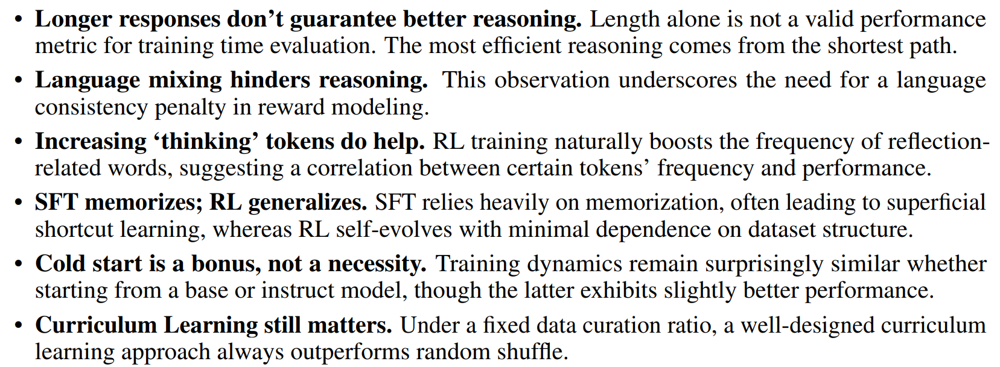

## 1 Data Synthesis

骑士与骗子（K\&K）难题构成了一个算法生成的推理数据集。在这些难题中，角色要么是骑士，永远说真话，要么是骗子，永远说谎。目标是根据他们的陈述确定每个角色的性质。

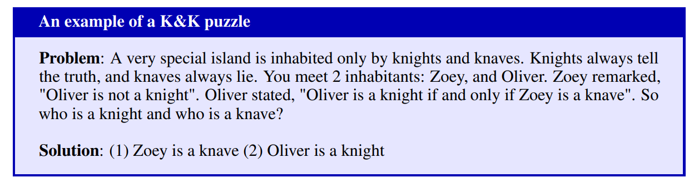

## 2 Rule Based Reward Modeling

Format Reward and Answer Reward

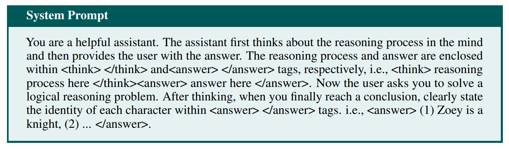

格式奖励：我们使用正则表达式提取来强制响应的结构化格式。模型需要将其推理过程放在 `<think></think>` 标签内，并在 `<answer></answer>` 标签内提供最终结论。此外，我们建议在提示的末尾直接包含一个 `<think>` 标签，这显著降低了基础模型遵循我们指示的难度。在我们早期不完善的规则设计下，我们持续观察到奖励黑客现象，以下是其中一些现象：

- 跳过 `<think></think>` 过程，直接给出答案。

- 将推理放在 `<answer></answer>` 标签内。

- 在没有适当推理的情况下反复猜测答案。

- 除了提供答案外，还包含无关的废话。

- 以错误的方式组织正确答案以便提取。

- 在已经输出 `<answer>` 后因推理不足而重新回到思考阶段。

- 重复原问题或使用“此处的思考过程”等短语以避免真正的推理。

因此，我们对规则设计进行迭代优化。例如，每个标签应恰好出现一次并按照正确的顺序排列，思考过程必须包含真实的推理，结论应以可提取和可读的方式呈现。通过强制这些约束，我们确保不同的行为根据其对格式的遵守程度获得适当的奖励。格式分数（Sformat）计算如下：

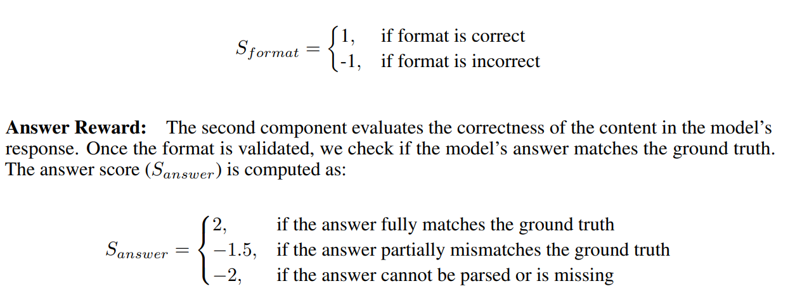

## 3 RL Algorithm

We adopt a modified version of REINFORCE\+\+ as our baseline algorithm, which has demonstrated superior performance compared to GRPO in our experimental setup。

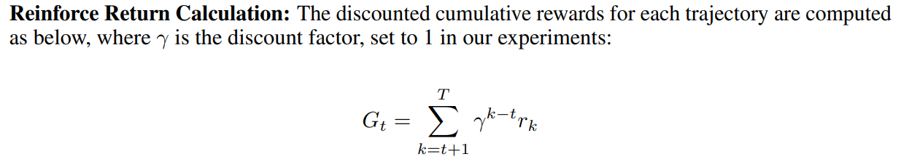

**还有其他基于 grpo 的改进**


**\(1\) Use KL Loss**

原始的 ppo 将 kl loss 当做 reward，grpo 说可以简单点，直接当做 loss 约束即可，本文采用 grpo 做法。

**\(2\) KL Estimation**

也采用 grpo 中的 kl 估计方法。

## 4 实验

我们直接训练模型3600步，学习率保持在4 × 10⁻⁷，温度参数为0\.7。在训练过程中，模型直接接触到复杂度混合的逻辑难题，参与人数从3到7人不等。这种简单的训练方案取得了竞争力的表现，如最终结果表所示。通过使用这些固定超参数进行持续训练，模型发展出稳定的推理模式，表现为逻辑探索、中间验证和系统总结，最终得出答案。这些新兴行为展示了模型有效处理复杂逻辑推理任务的能力。

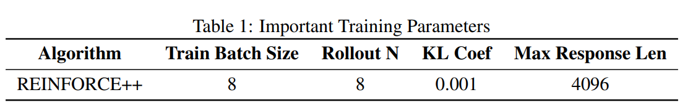

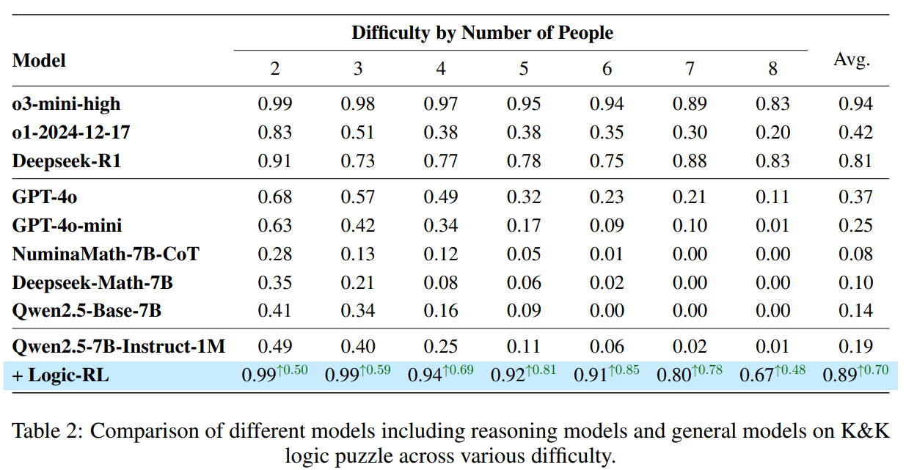

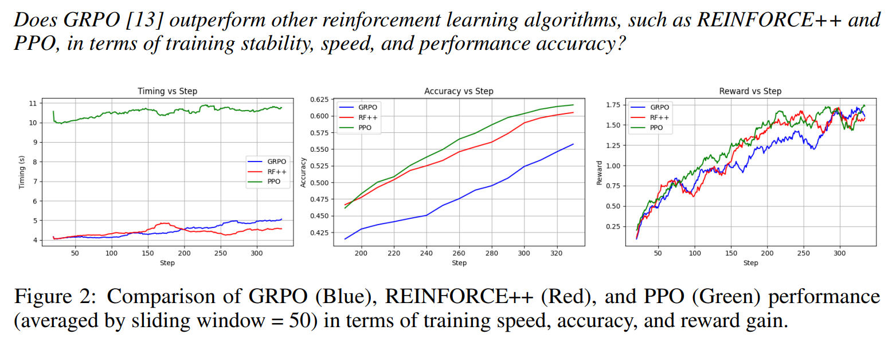

# Short\-RL

和 logic\-rl 是同一组人做的。

**Short RL**: Controlling the Dynamics of Training Length with better performance

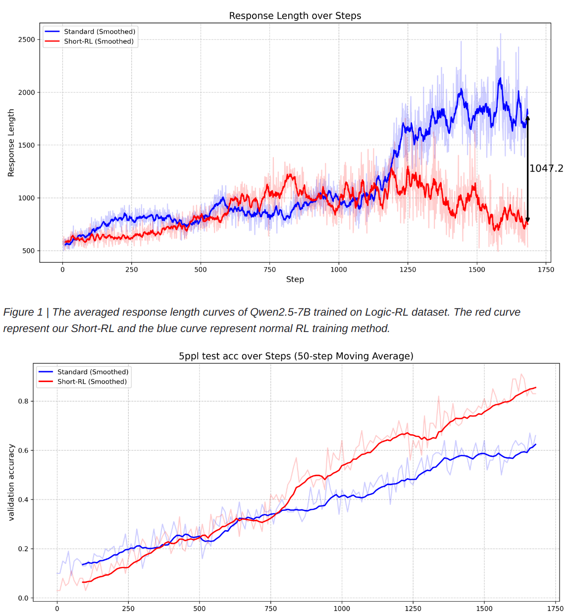

用了验证不是长度越长，性能就一定越好。

https://rustic\-somersault\-180\.notion\.site/Short\-RL\-Controlling\-the\-Dynamics\-of\-Training\-Length\-with\-better\-performance\-1b298c6782a281059383edd683ab16c0

This blog introduces a simple yet effective technique to reduce response length during the RL training process of R1\-like models, all while maintaining stable performance\. Our experiments on the logic reasoning domain dataset show impressive results, with a 54% reduction in response tokens and improved performance\. In the math domain dataset, we achieve a 35% reduction in response tokens while maintaining similar performance levels\.

现有的缩短响应长度的方法通常是在监督微调（SFT）设置中实现的，除了 Kimi 1\.5 提出的一个方法。他们在后期强化学习过程中引入了长度奖励。

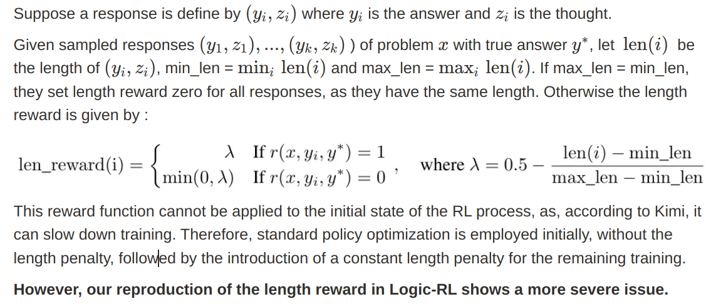

对于同一个 prompt 的 n 个响应，如果所有回复长度都一样，那么就不加长度惩罚，否则计算出一个自适应的 lambda 参数，如果回复正确的，长度惩罚是 lambda，长度越长，lambda 越小，reward 越小；如果回复是错误的，那么取 min\(0, lambda\)。


这个奖励函数不能应用于强化学习过程的初始状态，因为根据 Kimi 的说法，这可能会减慢训练。因此，最初采用标准策略优化，没有长度惩罚，然后在后续训练中引入恒定的长度惩罚。

**然而，我们在 Logic\-RL 中重现长度奖励时出现了更严重的问题。**


在 Logic\-RL 实验中，当我们训练模型一个周期后，再应用 Kimi 长度奖励进行另一个周期时，观察到测试准确率急剧下降。

此外，当长度奖励直接应用于强化学习过程的初始状态仅一个周期时，准确率曲线变得不稳定，并保持在低水平。


因此 Can we devise a method that not only reduces the response length of the model but also maintains strong performance throughout the RL process?


为了能够成功训练，作者进行了如下几个修改和尝试：

## Modification 1 : Right Only Reward

Kimi 定义的 min\_len 和 max\_len 是基于一个问题 $x$ 的所有响应计算得出的。当答案错误时，他们应用长度奖励 = $\\min\(0,\\lambda\)$。这意味着较长的错误响应可能会受到比短错误答案更大的惩罚。

在初始训练阶段，我们认为对长错误响应施加额外惩罚是没有必要的，因为这可能会阻碍探索。因此，我们建议仅对正确响应计算基于长度的奖励。具体来说，长度奖励应仅适用于正确答案。min\_len 和 max\_len 仅在每个问题对应的正确答案上计算。

## Modification 2 : Length Tolerance

通过**修改 1**，我们观察到在强化学习过程的初始阶段，准确率曲线有了改善的趋势。然而，最终仍然遇到了与 Kimi 奖励相同的问题。这种长度奖励的核心问题在于，它促使所有响应趋向于尽可能短的响应，从而降低了多样性并抑制了探索。

因此，我们在这里提出**修改 2：长度容忍度**。

我们定义了一个超参数 length\_tolerance。对于正确响应，长度奖励的确定如下：

- 如果响应的长度 $\text{len}(i)$ 满足 len\(i\)\<=min\_len\+length\_tolerance，则长度奖励设置为 **0\.5**，与最短的正确响应相同。

- 对于超过此阈值的响应，长度奖励设置为上面定义的值 $\\lambda$。

长度容忍度在平衡响应长度和模型性能方面起着关键作用。过小的长度容忍度可能导致平均长度过短和性能不佳。如果将长度容忍度设置为 0，就退化为 Kimi 长度奖励。我们未来可能的改进可以是“动态长度容忍度”。

## Modification 3 : Accuracy Tolerance

在训练过程中，我们观察到长度奖励有时可以帮助提高模型性能，而有时又会限制模型的探索能力。因此，在训练过程稳定时（批次准确率不断上升）施加长度奖励是至关重要的。

我们定义了一个超参数 acc\_tolerance。在对一个数据批次施加长度奖励之前，我们首先计算该批次的准确率（记作 acc）。我们记录 max\_acc，以记录训练过程中的最高准确率。

只有当 acc \>= max\_acc\-acc\_tolerance 时，我们才施加长度奖励。

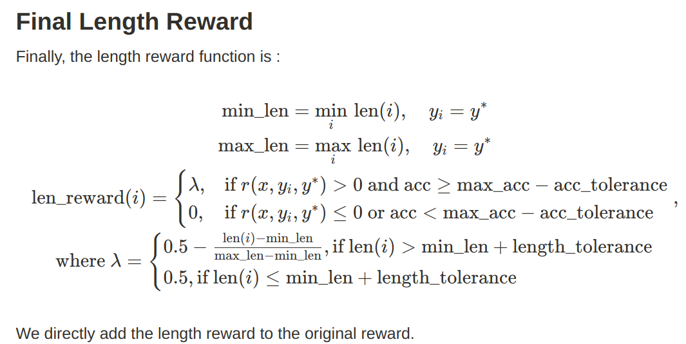

实验结果：

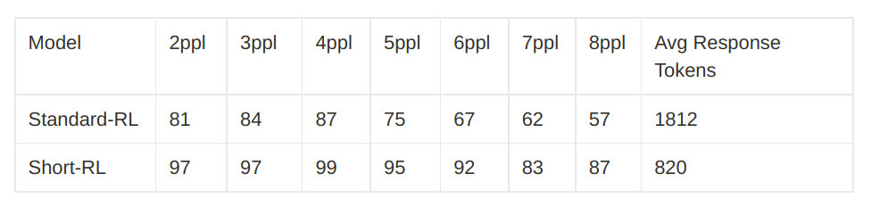

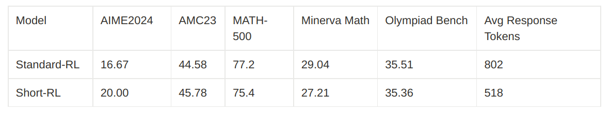

# ADORA

Training Reasoning Model with Dynamic Advantage Estimation on Reinforcement Learning

https://five\-stetson\-b51\.notion\.site/Training\-Reasoning\-Model\-with\-Dynamic\-Advantage\-Estimation\-on\-Reinforcement\-Learning\-1a830cc0904681fa9df3e076b6557a3e

Advantage Dynamics via Online Rollout Adaptation

这篇博客介绍了 ADORA（在线回滚适应下的优势动态），这是一个强化学习框架，能够根据模型的 rollout 分布动态调整优势值。我们展示了 ADORA 如何通过在逻辑谜题和几何问题上的训练，显著增强大型语言模型（LLMs）和视觉语言模型（VLMs）在长链式思维（CoT）推理和反思能力方面的表现。此外，该框架具有即插即用的兼容性，理论上适用于任何基于优势的强化学习方法。值得注意的是，我们已将训练代码和实现细节完全开源，以期激发后续研究的更多进展。

对于 LLMs，我们在 Logic\-RL 框架中实现的 ADORA 在仅 100 次训练步骤下达到了 40 AMC，而原论文在 1200 步骤下的 AMC 为 39，同时保持了可比 AIME 性能。对于 VLMs，我们在 Qwen2\.5\-VL\-7B\-Instruct 的基础上，仅使用 Geometry3K 训练集中的 2K 样本，达到了 MathVista 上 73\.5% 的准确率，并且响应长度的进展保持一致，建立了在重现 DeepSeek\-R1\-Zero 的多模态版本中的最新性能。


ADORA 可以通过修改单个函数在 verl 或 OpenRLHF 中实现。不过，根据您的具体训练目标，您需要定义一种方法，从演员rollout的结果中生成优势权重。此外，您还可以选择仅在强化学习训练的某些阶段引入 ADORA。值得注意的是，ADORA 显示了兼容性和独立性，能够与冷启动场景以及最近提出的 DAPO 无缝集成。我们欢迎反馈、改进建议和合作机会，以进一步探索 ADORA 的潜在实现。

## 实现

核心挑战在于将强化学习训练目标与目标能力的提升进行对齐。目前的方法在优化 KL 散度和优势近似时，对所有训练提示应用统一的权重。然而，这种同质的做法忽视了不同提示类型在整个训练过程中的动态重要性。具体而言，某些提示在特定能力发展阶段可能具有更大的意义，而其他提示在基础技能建立后则更适合作为验证检查。有效的强化学习对齐应实施自适应加权机制，根据提示与模型不断发展的能力的当前相关性来优先考虑提示，而不是在所有训练实例之间保持静态均衡。

ADORA 通过对 rollout 响应分析以每个prompt为粒度动态调整优势值来解决这个问题。我们将 ADORA 抽象为以下核心实现：

```Bash
advantages *= weight_func(sequences_per_prompt, rewards, **aux_metrics)
```

该操作将计算得出的权重应用于原始优势值，强调了在训练过程中对提示特定优势分布的调整。

为了增强模型在长链式思维（CoT）推理和反思方面的能力，我们实施了一种简单但有效的方法，通过响应长度区分暂时有利和不利的样本，直接将这种优势动态融入现有的 GRPO 框架。我们的伪代码实现如下：

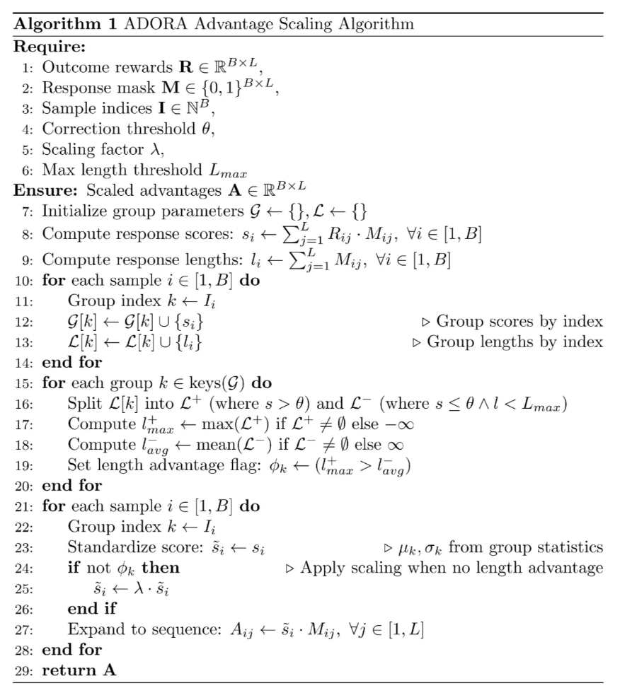

https://github\.com/ShadeCloak/ADORA/blob/main/ADORA/verl/trainer/ppo/core\_algos\.py\#L110

核心逻辑是：

1. 计算每个样本的总奖励和响应长度。

2. 按组统计正向和负向样本，评估长度优势。正向样本是分数高于 correct\_score（默认 1\.01）的样本。负向样本是分数低于或等于 correct\_score 且长度低于 max\_length\_threshold（默认 4054）的样本。

3. 对组内分数标准化，并对不满足长度优势的组施加惩罚\(正向样本中最长长度小于负向样本中平均长度的施加惩罚，说明这个组不太好，在同一个 prompt 生成的 n 个响应中，正确答案的都是短的，错误答案都是长的\)。

4. 输出 token 级别的标准化奖励。


最终目标是给每一条输出的优势A tensor 值上全部乘以一个不同的 score 值，相当于动态加权。

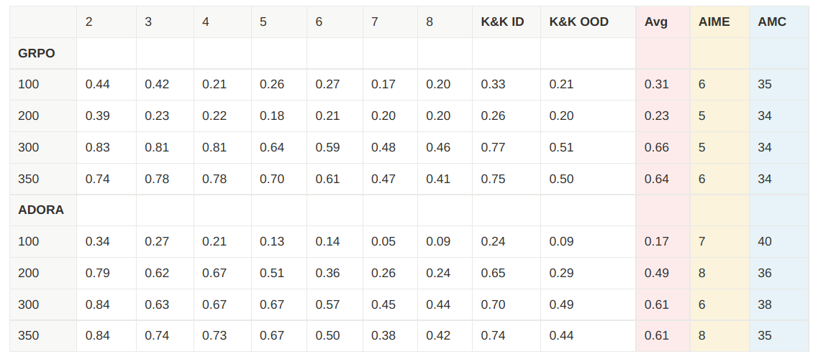

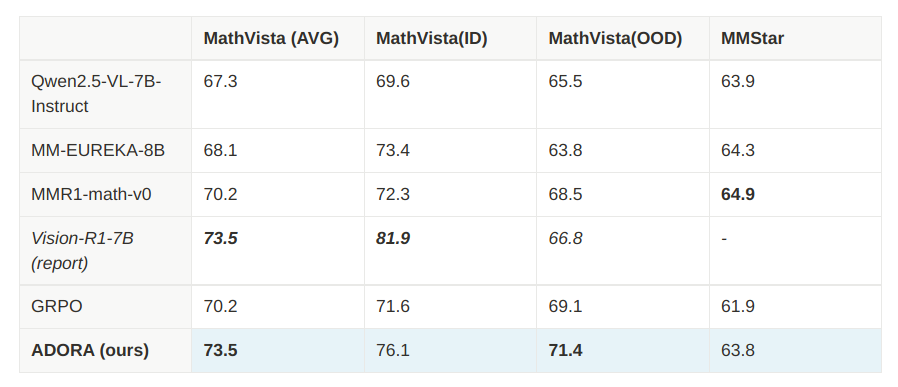

从分数来看，好像只是稍微好一点点而已。


1. **为什么关注响应长度来区分暂时有利和不利的样本？**

我们选择长度作为区分因素，因为它是一个简单但有效的指标。正如我们在 Logic\-RL 中提到的，较长的响应并不总是能保证更好的推理。我们最希望看到的是，模型首先具备生成长链式思维（CoT）的能力，然后在面对不同任务时能够优雅地产生适当长度的响应。鉴于生成长 CoT 的能力是前提，它自然成为我们选择的第一个指标。

2. **为什么对暂时不利样本乘以 0\.1 而不是 0？**

我们也尝试过乘以 0，但结果不如乘以 0\.1 好。我们推测这是因为乘以 0\.1 可以减轻暂时不利样本对优势估计的影响，同时不影响批次更新中使用的样本数量。或许这些暂时不利的样本仍然包含对模型改进有用的信息，例如提供上下文或负学习信号。

3. **为什么 ADORA 的奖励和准确率较低？**

ADORA 在批次优势计算中进行减法，试图减弱噪声响应对梯度更新的影响。这可能会略微降低奖励和测试准确率，但它促进了长度增长和推理能力。如果您担心 ID 准确率表现，可以尝试将 ADORA 作为第一阶段，然后进行正常训练。这可能会产生一些良好的结果。

# PF\-PPO

Policy Filtration for RLHF to Mitigate Noise in Reward Models

https://arxiv\.org/abs/2409\.06957v4

# Skywork Open Reasoner 1 \*\*\*

https://arxiv\.org/abs/2505\.22312v2

有一些经验性 trick。

# MinMax\-M1

MiniMax\-M1: Scaling Test\-Time Compute Efficiently with Lightning Attention

https://github\.com/MiniMax\-AI/MiniMax\-M1

我们提出了 CISPO，一种新颖的强化学习算法，以进一步增强强化学习的效率。CISPO 剪切重要性采样权重，而不是 token 更新，从而优于其他竞争的强化学习变体。


在我们对 zero\-r1 设置下的混合架构进行的初步实验中，我们观察到GRPO算法对训练性能产生了负面影响，未能有效促进长链推理行为的出现。通过一系列控制的消融研究，我们最终确定了原始PPO/GRPO损失中的不理想剪切操作是导致学习性能下降的主要因素。具体而言，我们发现与反思行为相关的令牌（例如，然而、重新检查、等待、啊哈），通常作为推理路径中的“分叉”，在我们的基础模型中通常较为稀少，并被分配低概率。在策略更新过程中，这些令牌可能会表现出高 𝑟𝑖,𝑡 值。因此，这些令牌在第一次在线策略更新后被剪切，阻止了它们对后续离线梯度更新的贡献。这个问题在我们的混合架构模型中尤为明显，并进一步阻碍了强化学习的可扩展性。

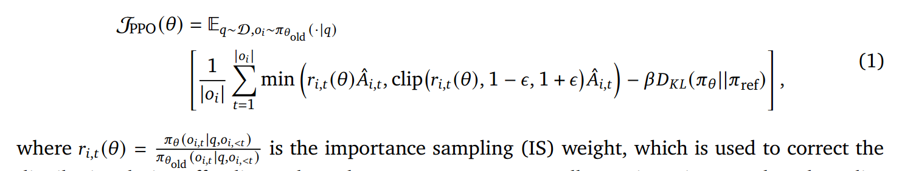

简单来说：作者发现在混合架构里面或者说和他们 base 模型相关，使用 grpo 进行训练时候发现效率不高，最终定位到时候裁剪操作不合理。具体表现为在 rollout 过程中最核心的反思词： However, Recheck, Wait, Aha，概率比较低，但是从推理角度，这种词是非常重要的，因为他会促使思维发散，从而提高性能。

这些反思词在 rollout 时候概率很低，经过参数更新后，概率会大幅提升，但是因为 grpo 的裁剪策略比较保守会抑制这种 token 概率大幅上升。虽然经过大规模训练可以稳步提升但是效率太低了。因此本文希望进行改进。

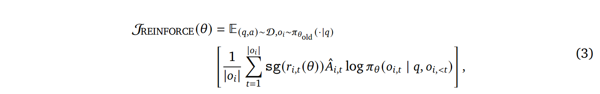

作者从最原始的带有重要性采样的 reinforce 入手，而不是 ppo 或者 grpo。 Sg 表示停止梯度，也就是说只是作为系数。A 优势计算和 GRPO 完全一样。


为了便于理解，可以先看看 grpo 中的策略 loss

```Python
def forward_per_token(self, logprobs, old_logprobs, advantages, loss_factor=None):
    ratio = (logprobs - old_logprobs).exp()
    pg_loss1 = -ratio * advantages
    pg_loss2 = -ratio.clamp(1 - self.clip, 1 + self.clip) * advantages
    pg_loss_max = torch.max(pg_loss1, pg_loss2)

    assert loss_factor is not None
    pg_loss = torch.sum(pg_loss_max) * loss_factor
    return pg_loss
```

- ratio 重要性比率是有梯度的，A 没有梯度

- 会对可学习的 ratio 进行裁剪，防止某些 token 偏离太大

上述操作是直接对 token 的 logprobs 进行裁剪，会抑制前面说的 However 等反思词的概率提升，从而效率不高。


作者基于最原始的 reinforce 入手，不再对 logprobs 进行裁剪，而仅仅裁剪没有梯度的比率值，可以解除上面的 token 限制。

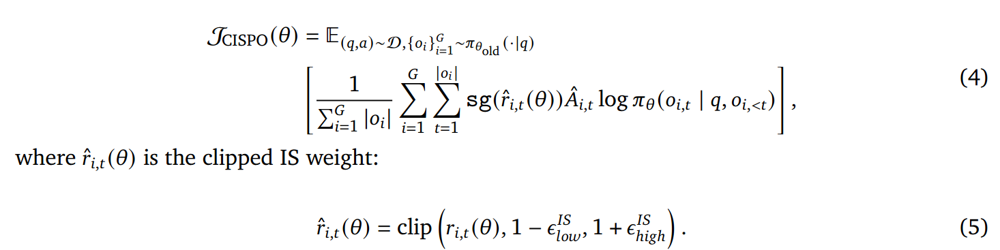

为了防止梯度不稳定，作者写了一个更通用的公式：

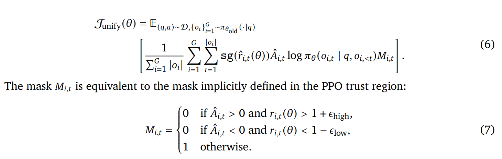

**Computational Precision Mismatch in Generation and Training**

强化学习训练对计算精度高度敏感。在我们的强化学习训练中，我们观察到**训练模式和推理模式之间的令牌概率存在显著差异**。这种差异源于训练和推理内核之间的精度不匹配。这个问题对实验有害，阻碍了奖励的增长。有趣的是，这个问题在较小的、密集的具有 softmax 注意力的模型中并未出现。通过逐层分析，**我们发现输出层中语言模型（LM）头部的高幅度激活是错误的主要来源。为了解决这个问题，我们将 LM 输出头的精度提高到 FP32，从而重新对齐这两个理论上相同的概率。**


**Early Truncation via Repetition Detection**

在强化学习训练过程中，我们发现复杂的提示可能会引发病态的长而重复的响应，其大梯度威胁到模型的稳定性。我们的目标是预先终止这些生成循环，而不是惩罚已经重复的文本。由于简单的字符串匹配对各种重复模式无效，我们开发了一种基于令牌概率的启发式方法。我们观察到，**一旦模型进入重复循环，每个令牌的概率会急剧上升。因此，我们实施了一条早期截断规则：如果 3000 个连续令牌的概率均高于0\.99，则停止生成。这种方法成功地防止了模型不稳定，并通过消除这些病态的长尾情况提高了生成吞吐量。**

# GSPＯ

https://arxiv\.org/abs/2507\.18071v2

Unlike previous algorithms that adopt token\-level importance ratios, GSPO defines the importance ratio based on sequence likelihood and performs sequence\-level clipping, rewarding, and optimization\. We demonstrate that GSPO achieves superior training efficiency and performance compared to the GRPO algorithm, notably stabilizes Mixtureof\-Experts \(MoE\) RL training, and has the potential for simplifying the design of RL infrastructure\. These merits of GSPO have contributed to the remarkable improvements in the latest Qwen3 models\.

为了能够持续拓展 RL，我们提出了** Group Sequence Policy Optimization \(GSPO\) **算法。不同于过去的 RL 算法，GSPO 定义了序列级别的重要性比率，并**在序列层面执行裁剪、奖励和优化**。相较于 GRPO，GSPO 在以下方面展现出突出优势：

- **强大高效**：GSPO 具备显著更高的训练效率，并且能够通过增加计算获得持续的性能提升；

- **稳定性出色**：GSPO 能够保持稳定的训练过程，并且根本地解决了混合专家（[Mixture\-of\-Experts](https://zhida.zhihu.com/search?content_id=260892381&content_type=Article&match_order=1&q=Mixture-of-Experts&zhida_source=entity)，MoE）模型的 RL 训练稳定性问题；

- **基础设施友好**：由于在序列层面执行优化，GSPO 原则上对精度容忍度更高，具有简化 RL 基础设施的诱人前景。


我们发现，当采用 GRPO 算法时，MoE 模型的专家激活波动性会使得 RL 训练无法正常收敛。为了解决这一挑战，我们过去采用了**路由回放（Routing Replay）**训练策略，即缓存 πθold 中激活的专家，并在计算重要性比率时在 πθ  中“回放”这些路由模式。Routing Replay 对于 GRPO 训练 MoE 模型的正常收敛至关重要。然而，Routing Replay 的做法会产生额外的内存和通信开销，并可能限制 MoE 模型的实际可用容量。


我们发现，GRPO 算法的不稳定性源于其设计中重要性采样权重的根本性误用与失效。这一问题会引入高方差训练噪声，且该噪声会随着生成响应长度的增加而持续累积，最终在裁剪机制的放大作用下导致模型崩溃。


以前没有意识到**重要性权重使用token级别感觉**一定会引入高方差噪声的。

**首先重要性权重的作用是抵消当前模型和旧模型的分布的差异，但是使用token级别的确实是很难实现“分布修正”这件事。反而会引入高方差噪声。**

比如，两个模型对某个token的概率差异可能是偶然的（如旧模型认为“苹果”概率0\.3，新模型认为0\.5），但单个样本无法区分“偶然差异”和“真实分布差异”。所以就引入了高方差噪声，处理长序列（如代码生成、数学推理）每个token的噪声会**累积放大。**

用序列级的[重要性比率](https://zhida.zhihu.com/search?content_id=260896988&content_type=Article&match_order=1&q=%E9%87%8D%E8%A6%81%E6%80%A7%E6%AF%94%E7%8E%87&zhida_source=entity)确实更接近修正“当前模型的分布和旧模型的分布差异”的目标。


- GRPO每个token的梯度被其自身的重要性权重加权。如果重要性权重波动大，[梯度方向](https://zhida.zhihu.com/search?content_id=260896988&content_type=Article&match_order=1&q=%E6%A2%AF%E5%BA%A6%E6%96%B9%E5%90%91&zhida_source=entity)会混乱。

- GSPO所有token的梯度是被统一的序列权重（s\_i）加权。序列级权重稳定，梯度方向更一致。

但是，梯度方向一致，会不会被整个带偏呢？会更偏向 sft loss 了吧。

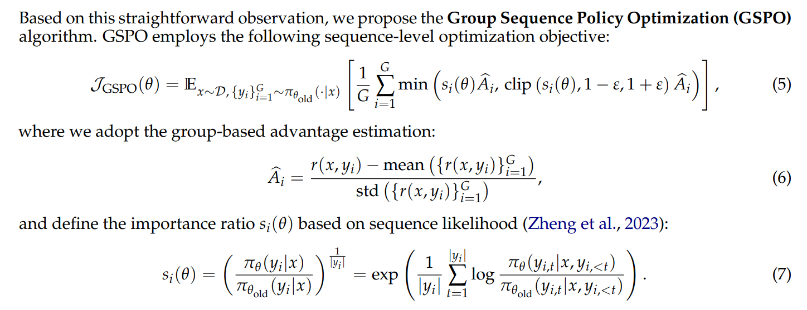

Token\-level 版本

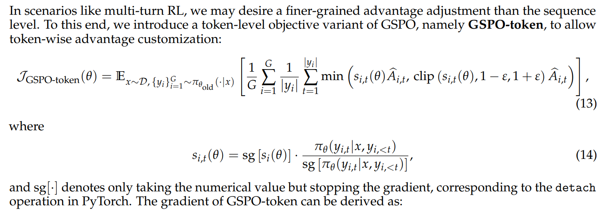

考虑到训练引擎（如Megatron）与推理引擎（如SGLang和vLLM）之间的数值精度差异，实践中我们通常需要使用训练引擎重新计算旧策略πθold下采样响应的似然值。然而，GSPO仅使用序列级（而非词元级）似然值进行优化，从直观上看，前者对精度差异的容忍度要高得多。因此，GSPO使得直接使用推理引擎返回的似然值进行优化成为可能，从而避免了重新调用训练引擎进行计算的必要性。这一特性在部分轨迹展开（partial rollout）、多轮强化学习等场景，以及训推分离框架中尤其具有优势。


# AGPO

# SimpleTIR

https://simpletir\.notion\.site/report


通过分析多轮和单轮会话的训练日志，我们发现了端到端强化学习不稳定的一个主要原因：一种我们称之为“无效轮次”的现象。这些轮次既未产生可执行的工具调用（即完整的代码块），也未生成最终答案，属于非生产性步骤。此类轮次通常包含零散的代码或重复性语句，且往往由过早生成的序列结束标记（`eos`）触发。

我们认为，这一失效机制通过两种相互关联的方式运作：

1. 外部工具输出导致的分布偏移。当模型接受代码执行结果时（这一现象在单轮方法中并不存在），生成的上下文模式会偏离原有数据分布。这种分布不匹配会显著提高序列提前终止和生成畸形内容的概率。

2. 多轮错误累积效应。这些无效轮次会嵌入后续训练上下文，形成破坏性反馈循环，逐步削弱模型维持多轮连贯推理的能力。

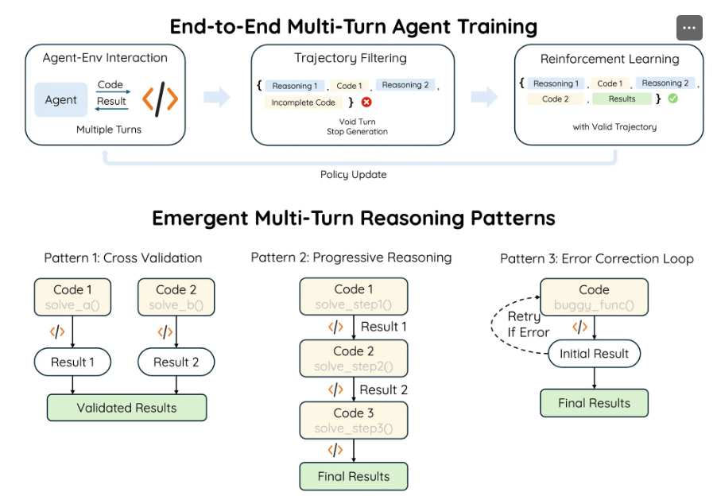

我们提出SimpleTIR——一种简单却高效的算法，用于稳定多轮工具交互式推理（TIR）的训练过程。如图5所示，其核心改进在于过滤掉包含中间无效轮次的训练轨迹。我们在具有挑战性的数学推理任务上进行了训练与评估：SimpleTIR不仅实现了当前最优的零样本强化学习（Zero RL）性能（图1左及详细结果表所示），还显著超越了非TIR方法。得益于零样本强化学习框架，训练后的模型在推理过程中展现出两大特征：密集的代码执行调用与多样化的推理行为模式。

# GMPO

# Your Efficient RL Framework Secretly Brings You Off\-Policy RL Training

https://fengyao\.notion\.site/off\-policy\-rl

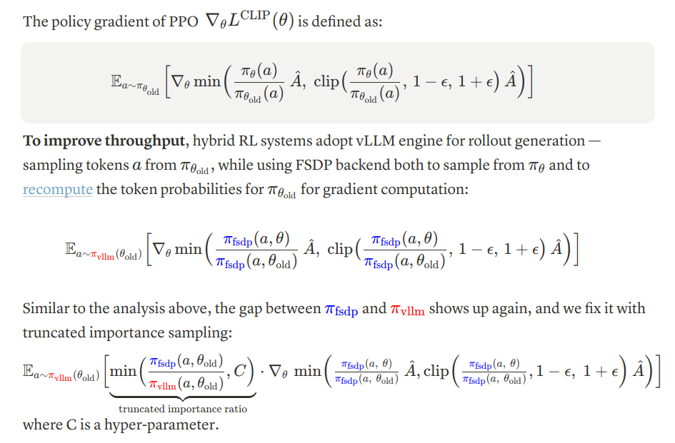

# FlashRL

https://fengyao\.notion\.site/flash\-rl

https://github\.com/yaof20/Flash\-RL

和上面文章是同一个作者。


int8 rollout 的话，需要做校准，fp8 可以在线做。int8 在线校准需要准备校准数据集，非常慢。没法实时做，因此作者是提前离线校准一次，后面一直用这个校准系数。


# agent\_loop

https://verl\.readthedocs\.io/en/latest/advance/agent\_loop\.html

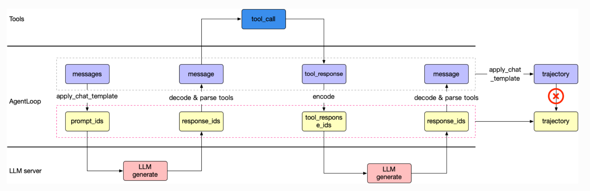

LLM Rollout 引擎必须要支持 token ids 进， token ids 出。


# Agent Lightning

https://arxiv\.org/abs/2508\.03680

https://github\.com/microsoft/agent\-lightning

[zhuanlan\.zhihu\.com](https://zhuanlan.zhihu.com/p/1937109083623782314)

# ReTool

ReTool: Reinforcement Learning for Strategic Tool Use in LLMs

https://arxiv\.org/pdf/2504\.11536

https://www\.xiaoqiedun\.com/posts/2025\-04\-19\-retool/

# A Deep Dive into RL for LLM Reasoning

https://arxiv\.org/abs/2508\.08221

# ProRLv2

长周期训练

https://research\.nvidia\.com/labs/lpr/prorlv2/


过去社区一直有一个争论：大语言模型（LLM）经过长时间的RL训练，是否还能持续提升，还是最终会走到“性能天花板”？很多现有方法（例如 CoT、Tree Search）本质上是在更好地利用模型已有的知识，而不是促成真正的新能力诞生。短期RL（几百步）往往很快收益递减，被称为“温度蒸馏”，而不是边界扩展。


我们在ProRL的基础上，推出了ProRLv2，实现了以下效果：\(1\) 长周期训练：在数学、代码、推理等五大领域累计 3,000\+ RL steps，刷新了 1\.5B 推理模型的性能记录 \(2\) 稳定性增强：KL正则化信任域、周期性参考策略重置、余弦调度长度惩罚 \(3\) 全可验证奖励：每个奖励信号均可程序化验证，无漂移风险 \(4\) 输出简洁化：调度式长度惩罚确保在高精度的同时保持token效率。


ProRLv2做了以下技术上的改进: \(1\) PPO\-Clip \+ REINFORCE\+\+ 基线\. 引入全局批归一化（Global Batch Norm）消除小组规模带来的不稳定性 \(2\) Clip\-Higher \+ 动态采样\. 上调PPO裁剪上界，延缓熵崩塌\. 丢弃奖励全1/全0的prompt，降低梯度噪声 \(3\) 调度式余弦长度惩罚\. 周期性开启/关闭，平衡信息量与简洁性 \(4\) KL正则 \& 参考策略重置\. 每200\~500步（或监测到KL飙升/验证集停滞）重置参考策略，防止被过时策略限制探索空间。


基于ProRLv2, 我们训练3000步的模型ProRL\-3k 在 Pass@1、Pass@k 上持续爬升，推理边界不断扩展。并且它能解出 base model 无论怎么采样都完全失败的题目，且表现稳定。同时，我们观察到缩短context长度（16k → 8k）依然全面提升精度，计算成本大幅下降。


总结来说，我们观察到LLM在长期RL下不仅可以持续进步，还能在困难和OOD任务中显著扩展推理能力。这一结果意味着：更多计算（延长RL步数）可能比单纯扩大模型规模更有效。


模型已开源，欢迎大家验证和讨论！


