# ROPE

# ROPE

## 二维向量旋转

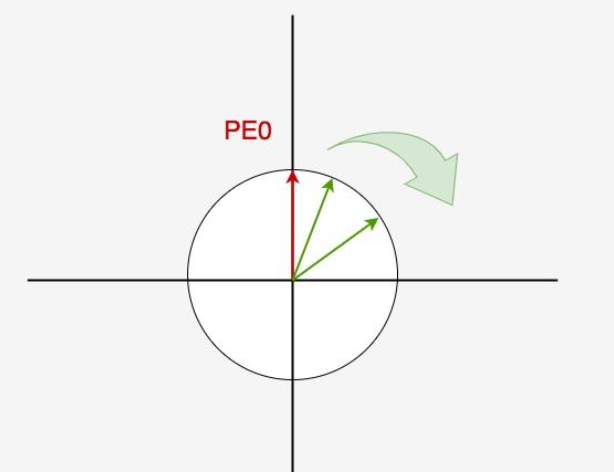

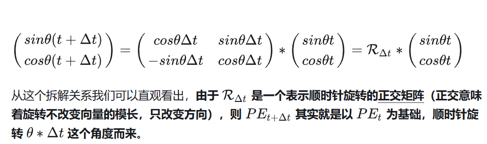

一个二维向量从 $\theta t$ 旋转  $\delta t$ 角度 后，可以用如上旋转矩阵表示。旋转矩阵是正交矩阵，模长不变。

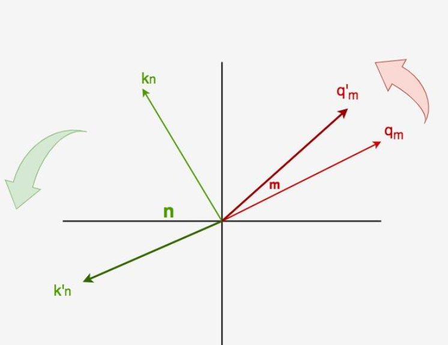

如上所述，k 和 q 是两个不同的 2 维向量，计算 q k 的关联度就是计算内积。如果分别采用不同的旋转角度，如上所述。

可以发现，旋转过后，随着\|n\-m\|差值的变大表示相对位置变大了，在保持向量模长不变的情况下，我们拉远了 q k两者之间的距离，也即降低了它们的内积，最后达到降低（惩罚）attention score的效果。

从而通过旋转矩阵实现了相对位置编码功能，相对距离越远，叠加上位置编码后，内积越小，attention score 越小。

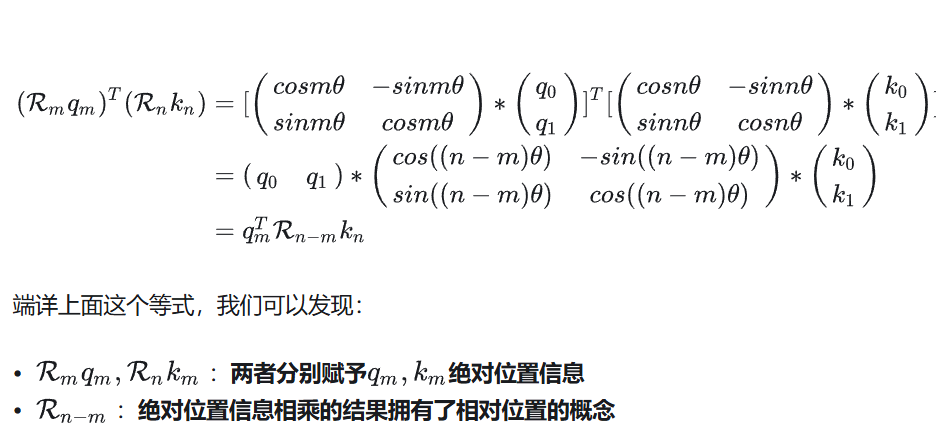

上面的意思是：

- **给每个位置加上一个位置 embeding 向量，这个赋予了绝对位置信息**

- **通过由于旋转矩阵的特性，还附带了相对位置功能。相同相对位置的内积值是一样的。**

这个算是 rope 比较大的优势。既有绝对位置信息，又有相对位置信息。

## 二维 rope

前面讨论的都是 2 维向量的旋转。只能给 dim=2 的 hidden state 加上旋转信息。如果是高维的呢？


高维做法很简单，直接按照 2 维独立旋转，每个 2 维一组，并且采用不同的旋转角度从而区分 dim 维度。

理解高维的旋转过程，可以用 6 维来理解，分成 3 组，并且以钟表。对于一块钟表：

- 秒针：走得最快

- 分针：走得中等

- 时针：走得最慢

6 维分成 3 组，第 1 组对应秒钟，旋转频率快，最后一组对应时钟，旋转频率最慢。

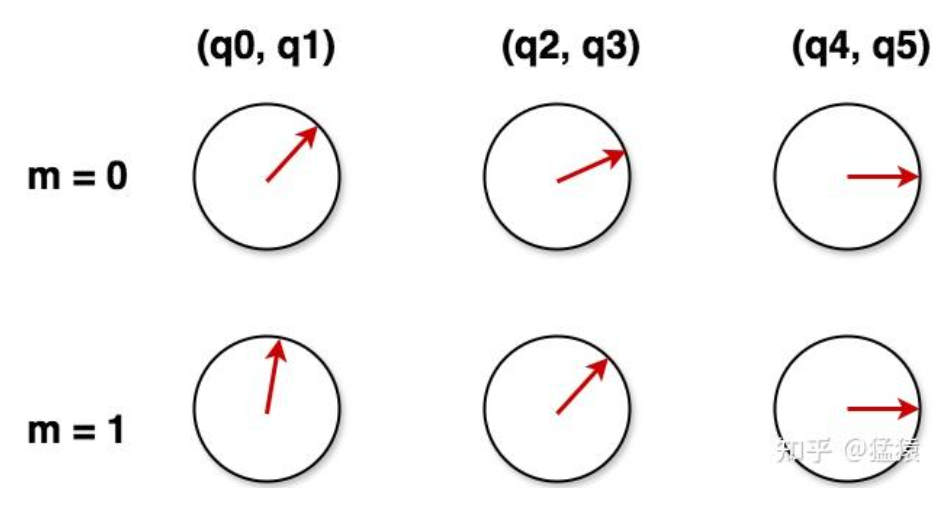

m 是序列 index， q 是 dim。可以看出通过这种方式，可以确保序列的某个位置的某个 dim 旋转角度都是不一样的。dim 0 位置的所有序列共享一个旋转频率，dim 1 位置的所有序列共享另一个旋转频率。并且 dim 索引越大的旋转频率越小，角度走的越慢。

所以可以看出实现上述功能的核心参数是 rope\_theta 旋转基数和 dim 维度。

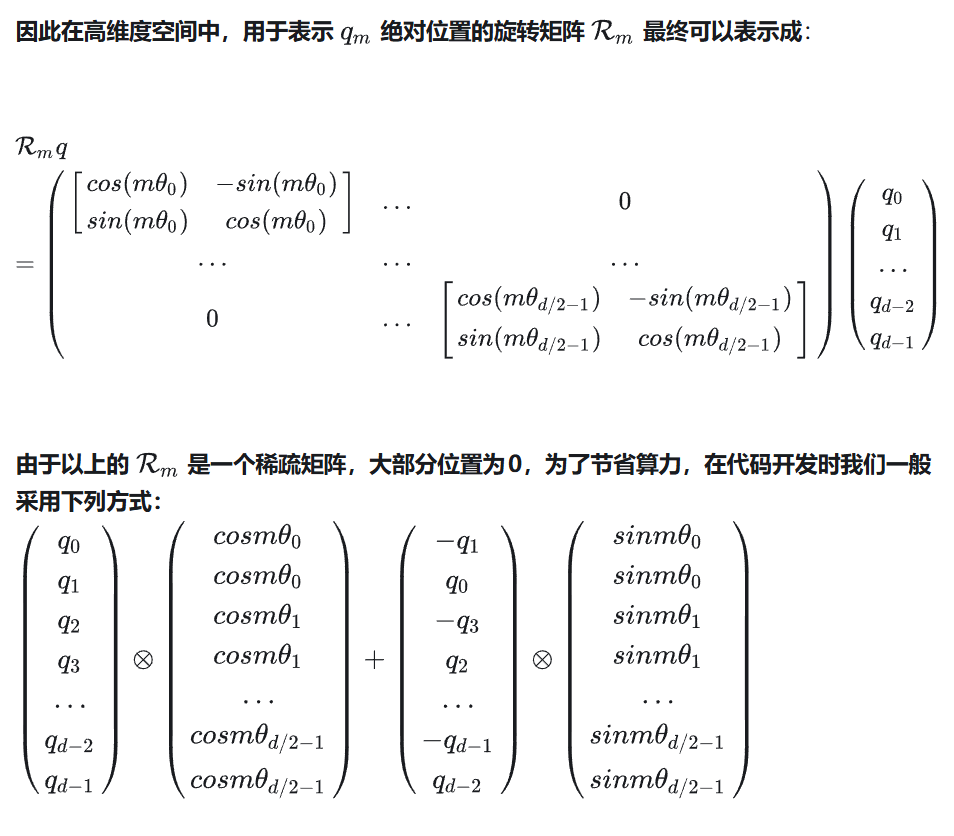

以 qwen3 30b 模型配置为例：

```Plain Text
"rope_theta": 1000000.0
"head_dim": 128,
"max_position_embeddings": 40960
```

qwen3 30b think

```Plain Text
"rope_theta": 10000000,
"head_dim": 128,
"max_position_embeddings": 262144
```

qwen3vl 30b think

```Plain Text
"rope_theta": 5000000,
"head_dim": 128,
"max_position_embeddings": 262144
```

基于可视化代码，我们可以得到：

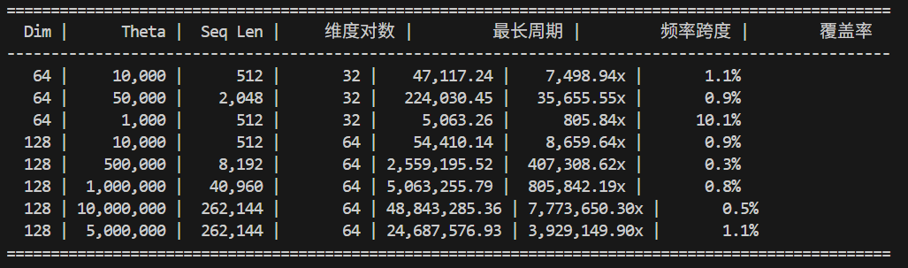

```Markdown
说明：
  - Dim: 嵌入维度
  - Theta: RoPE基础频率参数
  - Seq Len: 可视化的序列长度
  - 维度对数: dim/2，每对共享一个频率
  - 最长周期: 最后一个维度对完成一个完整旋转所需的位置数
  - 频率跨度: 最高频率/最低频率的比值
  - 覆盖率: 当前序列长度占最长周期的百分比（>100%表示完成了多个周期）
```

在恒定 dim 情况下，theta 值越大，旋转的就越慢，能表示的序列长度就越多。但是相对位置的可区分度也会下降，所以不是 theta 越大越好。而且 theta 很大，你需要的训练数据就越长，我们知道越长的数据肯定越少，这些相对位置学习的就不充分，效果也不一定好。可以想象为一个大圆圈。

假设 theta 等于 100000，那么这个圆圈上就可以放置 5063255 个点\(theta 越大，圆圈越大，放的点就越多\)。每一个不同长度的序列数据，都表示在圆圈上面的一个点。我们希望各种位置编码位置都学的很充分。这时候 theta 的取值就很关键了。

太小的话，可能周期一下就满了，而且没有任何外推能力。太大的话，训练的点太稀疏，即使不外推也不一定效果很好。

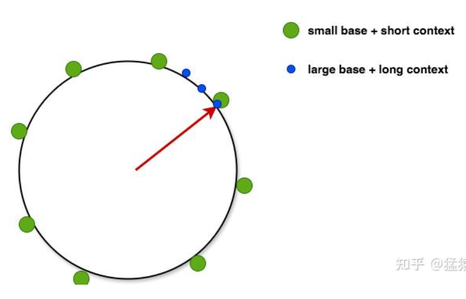

上面绘制的图，表示圆圈大小固定，但是 base 越小，每个圆圈上面的点所占位置更多，所能放下的位置数就变小，似乎短上下文，反之是长上下文。


把这个思想用于实践，就得到了目前训练长文本的一个常用方法：

- 现用“小基数 \+ 短数据”做训练（让每个圆盘都尽量转满一圈）

- 再用“大基数 \+ 长文本”做微调（弥补圆盘上的空隙）


后面 3 个是 qwen3 不同模型的配置。可以发现主流的设置，周期覆盖率都非常低，不超过 2%。以倒数第 3 个举例。

Theta 是 100000，dim=128，在这个设置下，最大能够表示长度是 5063255 也就是只有达到这个序列长度才会所有角度都遍历了一次。在 40k 训练场景下，周期覆盖率才 0\.8%，不知道基于啥原因设置的？

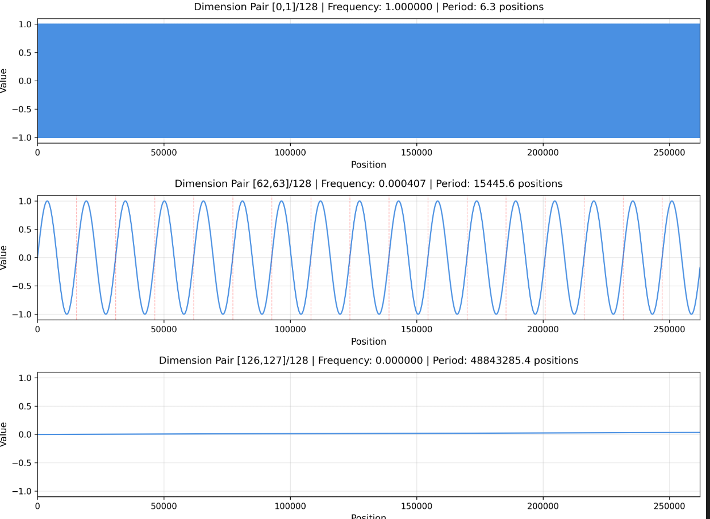

上图是最后一个 case 在 dim=0, 62 和最后的波形图，序列长度是 256k。以上图为例，实际训练长度是 256k 最长，实际上大量数据也达不到 256k。因此后面的序列长度位置编码学的肯定不充分。


当评测时候超过 256k 的话，虽然位置编码是唯一的，但是因为没有训练过这种相对关系，效果就会比较差，需要外推技巧。

## 外推

注意，目前 hf 代码中，只有 rope\_type 是 dynamic 和 longrope 才会触发动态外推。动态外推是指的随着推理长度的不断增加，达到一定长度后，会触发新的 rope 频率计算逻辑。

而其余 rope\_type 是没有上述特性的，或者说这些 rope 是静态外推，超过长度就直接外推，不需要改变基频。包括 yarn。

所以在 sft 训练中需要避免 rope\_type 是 dynamic 和 longrope这两种情况，其余情况无需做任何担心。正常训练就行。

如果对于 yarn 这种 rope 上下文长度还是不够，可以在模型初始化时候就修改 base 来实现。他不支持动态外推，只能静态外推。

https://qwen\.readthedocs\.io/zh\-cn/latest/deployment/vllm\.html

以 qwen3\-8b 为例。

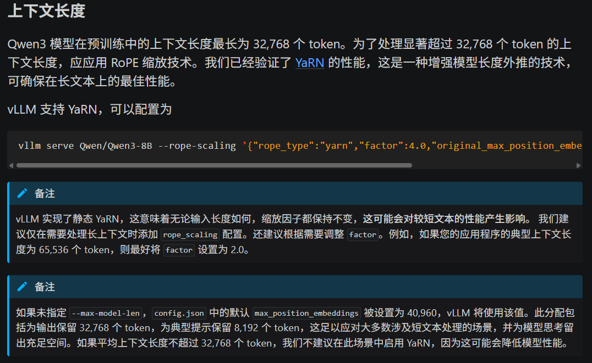

```Plain Text
vllm serve Qwen/Qwen3-8B --rope-scaling '{"rope_type":"yarn","factor":4.0,"original_max_position_embeddings":32768}' --max-model-len 131072
```

### default

```Plain Text
inv_freq, self.attention_scaling = self.rope_init_fn(self.config, device)
```

无需考虑 max\_position\_embeddings 和实际训练长度，直接基于 theta 和 dim 计算出任意长度下的旋转频率，直接推理。这个算直接外推。

当长度超过预设训练长度时候，会触发到没有训练过的位置编码值，效果会下降不少。正常情况下 theta 不要特别离谱，那么不管多长序列长度，肯定都不会触发相同的位置编码的。因为 dim=128 情况下，最大能表示的序列长度非常大。

### linear 内插

```Markdown
inv_freq, attention_factor = _compute_default_rope_parameters(config, device, seq_len)

# Then applies linear scaling to the frequencies.
# NOTE: originally, scaling was applied to the position_ids. However, we get `embs = inv_freq @ position_ids`, so
inv_freq /= factor
```

在训练完成后，如果想推理更长的，可以直接先计算原先的旋转频率，然后直接全部除以 factor。这样频率全部变慢 factor 倍。这样就不会触发没有见过的位置编码，但是相应的分辨率会降低。

这种情况下，效果也不太好，但是只要一点数据微调下效果就可以恢复。

之前 xtuner 的训练代码如下：

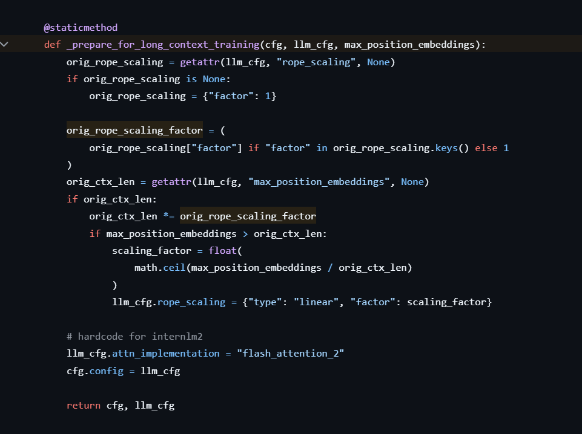

如果训练长度过大会自动切换为线性内插，在进行训练的。但是现在 xtuner 代码完全不管了，始终采用 default 模式训练。

### dynamic NTK 动态外推

动态调整 RoPE 的频率（ `inv_freq`），以适应不同长度的序列，同时兼顾 **精度**和 **扩展性。**

长序列时扩展频率范围，短序列时用回原始频率，确保不同长度输入都有最佳性能。

```Python
def dynamic_frequency_update(self, position_ids, device):
        """
        dynamic RoPE layers should recompute `inv_freq` in the following situations:
        1 - growing beyond the cached sequence length (allow scaling)
        2 - the current sequence length is in the original scale (avoid losing precision with small sequences)
        """
        seq_len = torch.max(position_ids) + 1
        if seq_len > self.max_seq_len_cached:  # growth
            # 重算 factor 得到新的
            inv_freq, self.attention_scaling = self.rope_init_fn(self.config, device, seq_len=seq_len)
            self.register_buffer("inv_freq", inv_freq, persistent=False)  # TODO joao: may break with compilation
            self.max_seq_len_cached = seq_len

        if seq_len < self.original_max_seq_len and self.max_seq_len_cached > self.original_max_seq_len:  # reset
            # This .to() is needed if the model has been moved to a device after being initialized (because
            # the buffer is automatically moved, but not the original copy)
            self.original_inv_freq = self.original_inv_freq.to(device)
            self.register_buffer("inv_freq", self.original_inv_freq, persistent=False)
            self.max_seq_len_cached = self.original_max_seq_len
```

### YaRN

https://arxiv\.org/pdf/2309\.00071

YaRN \(Yet another RoPE extensioN method\), a compute\-efficient method to extend the context window of such models, requiring 10x less tokens and 2\.5x less training steps than previous methods

先扩展长度，然后简单训练\(也要训练效果才好\)。


低维的高频分量非常关键，最好不要动。


YaRN 通过**分段调整不同频率分量的缩放策略**，使模型能更好地外推到训练时未见过的长序列。

YaRN 将 RoPE 的频率分量分为三个区域

```Markdown
# 假设 dim=64, factor=4, beta_fast=32, beta_slow=1
# original_max_position_embeddings=8192

# 维度索引:  0   4   8   12  16  20  24  28  32
# 频率:      高→→→→→→→→→→→→→→→→→→→→→→→低
# 处理策略:  [外推区] [过渡区] [插值区]
#           factor=1  线性混合  factor=0
#           不缩放    渐变缩放  完全缩放
```

**高频分量（快速旋转）**

- 在原始训练长度内已经旋转很多圈

- 对长度变化不敏感

- **不缩放**，保持外推能力

**低频分量（慢速旋转）**

- 旋转缓慢，携带长距离信息

- 对长度变化敏感

- **缩放**，通过插值适应新长度

**中频分量**

- 线性混合，平滑过渡

```Python
# 训练长度: 32K (factor=1.0)
# 目标长度: 128K (factor=4.0)

# 低频维度 (dim_idx=0):
inv_freq[0] = 1.0 / (4.0 * 10000^(0/64))    # 完全缩放
            = 1.0 / 40000                    # 频率降低 4 倍

# 高频维度 (dim_idx=32):
inv_freq[32] = 1.0 / 10000^(32/64)          # 不缩放
             = 1.0 / 100                     # 保持原频率

# 中频维度 (dim_idx=16):
inv_freq[16] = 0.5 * (1/(4*10000^(16/64))) + 0.5 * (1/10000^(16/64))
             # 50% 插值 + 50% 外推
```

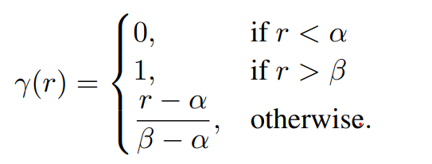

a 是 beta\_slow，belta 是 beta\_fast

### longrope\-动态外推


## 代码

全局看下代码：

```Python
class Qwen3RotaryEmbedding(nn.Module):
    inv_freq: torch.Tensor  # fix linting for `register_buffer`

    def __init__(self, config: Qwen3Config, device=None):
        super().__init__()
        # BC: "rope_type" was originally "type"
        if hasattr(config, "rope_scaling") and isinstance(config.rope_scaling, dict):
            self.rope_type = config.rope_scaling.get("rope_type", config.rope_scaling.get("type"))
        else:
            self.rope_type = "default"
        self.max_seq_len_cached = config.max_position_embeddings
        self.original_max_seq_len = config.max_position_embeddings

        self.config = config
        self.rope_init_fn = ROPE_INIT_FUNCTIONS[self.rope_type]

        inv_freq, self.attention_scaling = self.rope_init_fn(self.config, device)
        self.register_buffer("inv_freq", inv_freq, persistent=False) # 很关键
        self.original_inv_freq = self.inv_freq

    @torch.no_grad()
    @dynamic_rope_update  # power user: used with advanced RoPE types (e.g. dynamic rope)
    def forward(self, x, position_ids):
        inv_freq_expanded = self.inv_freq[None, :, None].float().expand(position_ids.shape[0], -1, 1).to(x.device)
        position_ids_expanded = position_ids[:, None, :].float()

        device_type = x.device.type if isinstance(x.device.type, str) and x.device.type != "mps" else "cpu"
        with torch.autocast(device_type=device_type, enabled=False):  # Force float32
            freqs = (inv_freq_expanded.float() @ position_ids_expanded.float()).transpose(1, 2)
            emb = torch.cat((freqs, freqs), dim=-1)
            cos = emb.cos() * self.attention_scaling
            sin = emb.sin() * self.attention_scaling

        return cos.to(dtype=x.dtype), sin.to(dtype=x.dtype)
```

这个类是算出后续需要的每个位置的旋转角度的正余弦值。后续用这些值算位置编码

```Python
def apply_rotary_pos_emb(q, k, cos, sin, position_ids=None, unsqueeze_dim=1):
    cos = cos.unsqueeze(unsqueeze_dim)
    sin = sin.unsqueeze(unsqueeze_dim)
    q_embed = (q * cos) + (rotate_half(q) * sin)
    k_embed = (k * cos) + (rotate_half(k) * sin)
    return q_embed, k_embed
```

```Python
def rotate_half(x):
    """Rotates half the hidden dims of the input."""
    # 分成 2 维一组，分别进行旋转
    x1 = x[..., : x.shape[-1] // 2]
    x2 = x[..., x.shape[-1] // 2 :]
    return torch.cat((-x2, x1), dim=-1)
```

这个代码对应的就是上面的简化公式。

如果要扩展

```Python
def dynamic_rope_update(rope_forward):
    def longrope_frequency_update(self, position_ids, device):
        """Longrope uses long factor if sequence is larger than original pretraining length, short otherwise."""
        seq_len = torch.max(position_ids) + 1
        if hasattr(self.config, "original_max_position_embeddings"):
            original_max_position_embeddings = self.config.original_max_position_embeddings
        else:
            original_max_position_embeddings = self.config.max_position_embeddings
        if seq_len > original_max_position_embeddings:
            if not hasattr(self, "long_inv_freq"):
                self.long_inv_freq, _ = self.rope_init_fn(
                    self.config, device, seq_len=original_max_position_embeddings + 1
                )
            self.register_buffer("inv_freq", self.long_inv_freq, persistent=False)
        else:
            # This .to() is needed if the model has been moved to a device after being initialized (because
            # the buffer is automatically moved, but not the original copy)
            self.original_inv_freq = self.original_inv_freq.to(device)
            self.register_buffer("inv_freq", self.original_inv_freq, persistent=False)

    def dynamic_frequency_update(self, position_ids, device):
        """
        dynamic RoPE layers should recompute `inv_freq` in the following situations:
        1 - growing beyond the cached sequence length (allow scaling)
        2 - the current sequence length is in the original scale (avoid losing precision with small sequences)
        """
        seq_len = torch.max(position_ids) + 1
        if seq_len > self.max_seq_len_cached:  # growth
            inv_freq, self.attention_scaling = self.rope_init_fn(self.config, device, seq_len=seq_len)
            self.register_buffer("inv_freq", inv_freq, persistent=False)  # TODO joao: may break with compilation
            self.max_seq_len_cached = seq_len

        if seq_len < self.original_max_seq_len and self.max_seq_len_cached > self.original_max_seq_len:  # reset
            # This .to() is needed if the model has been moved to a device after being initialized (because
            # the buffer is automatically moved, but not the original copy)
            self.original_inv_freq = self.original_inv_freq.to(device)
            self.register_buffer("inv_freq", self.original_inv_freq, persistent=False)
            self.max_seq_len_cached = self.original_max_seq_len

    @wraps(rope_forward)
    def wrapper(self, x, position_ids):
        if "dynamic" in self.rope_type:
            dynamic_frequency_update(self, position_ids, device=x.device)
        elif self.rope_type == "longrope":
            longrope_frequency_update(self, position_ids, device=x.device)
        return rope_forward(self, x, position_ids)

    return wrapper
```

下面的关键是理解上面 3 个核心参数，以及如何设置这三个参数。

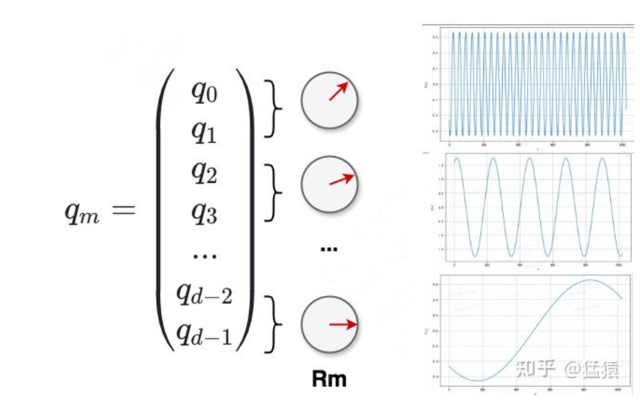


完整可视化代码：

```Python
import numpy as np
import matplotlib.pyplot as plt
import os

def visualize_rope(dim=64, rope_theta=10000, max_seq_length=512, num_dims_to_plot=3, 
                   output_prefix='rope'):
    """
    可视化 RoPE 的频率曲线
    
    参数:
        dim: 嵌入维度
        rope_theta: RoPE 的基础频率参数
        max_seq_length: 最大序列长度
        num_dims_to_plot: 要绘制的维度数量
        output_prefix: 输出文件名前缀
    """
    
    # 计算每个维度对的频率
    # freq_i = 1 / (theta ^ (2i/dim)) for i in [0, dim/2)
    # RoPE 是成对工作的：(dim_0, dim_1), (dim_2, dim_3), ..., (dim_62, dim_63)
    num_pairs = dim // 2
    pair_indices = np.arange(num_pairs)  # 0, 1, 2, ..., 31 (for dim=64)
    freqs = 1.0 / (rope_theta ** (2 * pair_indices / dim))
    
    # 计算周期
    periods = 2 * np.pi / freqs
    
    # 找到最大周期（最后一个维度对，频率最低）
    max_period = periods[-1]
    min_freq = freqs[-1]
    
    # 生成位置序列
    positions = np.arange(max_seq_length)
    
    # 打印周期信息
    print(f"\n{'='*80}")
    print(f"RoPE 周期分析 - {output_prefix}")
    print(f"{'='*80}")
    print(f"总维度数 (dim): {dim}")
    print(f"维度对数量: {num_pairs} 对 (每对2个维度共享同一频率)")
    print(f"Theta: {rope_theta}")
    print(f"可视化序列长度: {max_seq_length}")
    print(f"\n💡 说明：RoPE 中每2个维度组成一对，应用相同频率的旋转")
    print(f"   例如：Dim[0,1] 共享频率0, Dim[2,3] 共享频率1, ..., Dim[{dim-2},{dim-1}] 共享频率{num_pairs-1}")
    print(f"\n{'维度对':>10} | {'频率索引':>8} | {'频率值':>12} | {'周期(positions)':>18}")
    print(f"{'-'*10}-+-{'-'*8}-+-{'-'*12}-+-{'-'*18}")
    
    # 打印前5个维度对
    for i in range(min(5, num_pairs)):
        dim_pair = f"[{i*2:2d},{i*2+1:2d}]"
        print(f"{dim_pair:>10} | {i:>8d} | {freqs[i]:12.8f} | {periods[i]:18.2f}")
    
    if num_pairs > 10:
        print(f"{'...':>10} | {'...':>8} | {'...':>12} | {'...':>18}")
        # 打印最后5个维度对
        for i in range(max(5, num_pairs-5), num_pairs):
            dim_pair = f"[{i*2:2d},{i*2+1:2d}]"
            print(f"{dim_pair:>10} | {i:>8d} | {freqs[i]:12.8f} | {periods[i]:18.2f}")
    elif num_pairs > 5:
        for i in range(5, num_pairs):
            dim_pair = f"[{i*2:2d},{i*2+1:2d}]"
            print(f"{dim_pair:>10} | {i:>8d} | {freqs[i]:12.8f} | {periods[i]:18.2f}")
    
    print(f"\n{'='*80}")
    print(f"⭐ 关键信息：")
    print(f"{'='*80}")
    print(f"最高频率 (Dim[0,1]):        {freqs[0]:.8f}")
    print(f"最低频率 (Dim[{dim-2},{dim-1}]):      {freqs[-1]:.8f}")
    print(f"\n最短周期 (Dim[0,1]):        {periods[0]:.2f} positions")
    print(f"最长周期 (Dim[{dim-2},{dim-1}]):      {periods[-1]:.2f} positions")
    print(f"\n🔄 触发所有维度周期重复所需的序列长度: {max_period:.2f} positions")
    print(f"   (即最后一个维度对 Dim[{dim-2},{dim-1}] 旋转一周所需的长度)")
    
    if max_seq_length < max_period:
        print(f"\n⚠️  当前可视化长度 ({max_seq_length}) < 最长周期 ({max_period:.2f})")
        print(f"   最后的维度对在当前序列中只完成了 {max_seq_length/max_period*100:.1f}% 的周期")
    else:
        print(f"\n✓ 当前可视化长度 ({max_seq_length}) >= 最长周期 ({max_period:.2f})")
        print(f"  最后的维度对在当前序列中完成了 {max_seq_length/max_period:.2f} 个完整周期")
    
    # 计算频率比（最高频率/最低频率）
    freq_ratio = freqs[0] / freqs[-1]
    print(f"\n📊 频率跨度: {freq_ratio:.2f}x (最高频/最低频)")
    print(f"{'='*80}\n")
    
    # 创建图形
    fig, axes = plt.subplots(num_dims_to_plot, 1, figsize=(12, 3*num_dims_to_plot))
    if num_dims_to_plot == 1:
        axes = [axes]
    
    # 为不同的维度对绘制曲线
    pairs_to_visualize = np.linspace(0, num_pairs-1, num_dims_to_plot, dtype=int)
    
    for idx, (ax, pair_idx) in enumerate(zip(axes, pairs_to_visualize)):
        freq = freqs[pair_idx]
        period = periods[pair_idx]
        # 计算该维度在不同位置的角度值
        angles = positions * freq
        # 绘制正弦曲线（RoPE 使用 sin 和 cos）
        values = np.sin(angles)
        
        ax.plot(positions, values, linewidth=1.5, color='#4A90E2')
        ax.grid(True, alpha=0.3)
        ax.set_xlabel('Position', fontsize=11)
        ax.set_ylabel('Value', fontsize=11)
        
        dim_range = f"[{pair_idx*2},{pair_idx*2+1}]"
        ax.set_title(f'Dimension Pair {dim_range}/{dim} | Frequency: {freq:.6f} | Period: {period:.1f} positions', 
                    fontsize=12, pad=10)
        ax.set_xlim(0, max_seq_length)
        ax.set_ylim(-1.1, 1.1)
        
        # 标记完整周期
        num_complete_cycles = int(max_seq_length / period)
        if num_complete_cycles > 0 and num_complete_cycles < 20:  # 避免标记太多
            for cycle in range(1, num_complete_cycles + 1):
                cycle_pos = cycle * period
                if cycle_pos <= max_seq_length:
                    ax.axvline(x=cycle_pos, color='red', linestyle='--', alpha=0.3, linewidth=0.8)
    
    plt.tight_layout()
    waveform_filename = f'{output_prefix}_waveforms.png'
    plt.savefig(waveform_filename, dpi=300, bbox_inches='tight')
    print(f"📁 波形图已保存为 {waveform_filename}")
    plt.close()
    
    # 额外绘制：所有维度的频率分布
    fig2, ax2 = plt.subplots(1, 1, figsize=(10, 6))
    pair_dim_indices = pair_indices * 2  # 转换为实际维度索引显示
    ax2.plot(pair_dim_indices, freqs, marker='o', linewidth=2, markersize=4, color='#4A90E2', label='Frequency')
    ax2.set_xlabel('Dimension Index (每对的第一个维度)', fontsize=12)
    ax2.set_ylabel('Frequency', fontsize=12)
    ax2.set_title(f'RoPE Frequencies across Dimension Pairs (theta={rope_theta}, {num_pairs} pairs)', 
                 fontsize=14, pad=15)
    ax2.grid(True, alpha=0.3)
    ax2.set_yscale('log')
    ax2.legend()
    plt.tight_layout()
    freq_filename = f'{output_prefix}_frequencies.png'
    plt.savefig(freq_filename, dpi=300, bbox_inches='tight')
    print(f"📁 频率分布图已保存为 {freq_filename}")
    plt.close()
    
    # 绘制周期分布图
    fig3, ax3 = plt.subplots(1, 1, figsize=(10, 6))
    ax3.plot(pair_dim_indices, periods, marker='s', linewidth=2, markersize=4, color='#E94B3C', label='Period')
    ax3.axhline(y=max_seq_length, color='green', linestyle='--', linewidth=2, 
                label=f'Current seq_length ({max_seq_length})')
    ax3.axhline(y=max_period, color='orange', linestyle='--', linewidth=2, 
                label=f'Max period ({max_period:.1f})')
    ax3.set_xlabel('Dimension Index (每对的第一个维度)', fontsize=12)
    ax3.set_ylabel('Period (positions)', fontsize=12)
    ax3.set_title(f'RoPE Periods across Dimension Pairs ({num_pairs} pairs)', fontsize=14, pad=15)
    ax3.grid(True, alpha=0.3)
    ax3.set_yscale('log')
    ax3.legend()
    plt.tight_layout()
    period_filename = f'{output_prefix}_periods.png'
    plt.savefig(period_filename, dpi=300, bbox_inches='tight')
    print(f"📁 周期分布图已保存为 {period_filename}\n")
    plt.close()
    
    return {
        'dim': dim,
        'theta': rope_theta,
        'max_seq_length': max_seq_length,
        'max_period': max_period,
        'min_period': periods[0],
        'max_freq': freqs[0],
        'min_freq': freqs[-1],
        'num_pairs': num_pairs,
        'all_periods': periods,
        'all_freqs': freqs
    }

# 使用示例
if __name__ == "__main__":
    results = []
    
    # 对比不同的 theta 值
    print("\n" + "🔵" * 40)
    print("实验 1: 标准配置")
    print("🔵" * 40)
    result1 = visualize_rope(dim=64, rope_theta=10000, max_seq_length=512, 
                             num_dims_to_plot=3, output_prefix='rope_dim64_theta10000')
    results.append(result1)
    
    print("\n" + "🔵" * 40)
    print("实验 2: 长上下文配置")
    print("🔵" * 40)
    result2 = visualize_rope(dim=64, rope_theta=50000, max_seq_length=2048, 
                             num_dims_to_plot=3, output_prefix='rope_dim64_theta50000')
    results.append(result2)
    
    print("\n" + "🔵" * 40)
    print("实验 3: 短上下文配置")
    print("🔵" * 40)
    result3 = visualize_rope(dim=64, rope_theta=1000, max_seq_length=512, 
                             num_dims_to_plot=3, output_prefix='rope_dim64_theta1000')
    results.append(result3)
    
    print("\n" + "🔵" * 40)
    print("实验 4: 高维度配置")
    print("🔵" * 40)
    result4 = visualize_rope(dim=128, rope_theta=10000, max_seq_length=512, 
                             num_dims_to_plot=3, output_prefix='rope_dim128_theta10000')
    results.append(result4)
    
    print("\n" + "🔵" * 40)
    print("实验 5: LLaMA风格长上下文")
    print("🔵" * 40)
    result5 = visualize_rope(dim=128, rope_theta=500000, max_seq_length=8192, 
                             num_dims_to_plot=3, output_prefix='rope_dim128_theta500000')
    results.append(result5)
    
    print("\n" + "🔵" * 40)
    print("实验 6: Qwen3 30b 风格长上下文")
    print("🔵" * 40)
    result6 = visualize_rope(dim=128, rope_theta=1000000, max_seq_length=40960, 
                             num_dims_to_plot=3, output_prefix='rope_dim128_theta1000000')
    results.append(result6)

    print("\n" + "🔵" * 40)
    print("实验 6: Qwen3 30b think 风格长上下文")
    print("🔵" * 40)
    result7 = visualize_rope(dim=128, rope_theta=10000000, max_seq_length=262144, 
                             num_dims_to_plot=3, output_prefix='rope_dim128_theta10000000')
    results.append(result7)

    print("\n" + "🔵" * 40)
    print("实验 6: Qwen3vl 30b think 风格长上下文")
    print("🔵" * 40)
    result8 = visualize_rope(dim=128, rope_theta=5000000, max_seq_length=262144, 
                             num_dims_to_plot=3, output_prefix='rope_dim128_theta5000000')
    results.append(result8)

    # 总结对比
    print("\n" + "="*100)
    print("📊 所有实验对比总结")
    print("="*100)
    print(f"{'Dim':>5} | {'Theta':>10} | {'Seq Len':>8} | {'维度对数':>8} | {'最长周期':>12} | {'频率跨度':>12} | {'覆盖率':>10}")
    print("-"*100)
    for result in results:
        freq_span = result['max_freq'] / result['min_freq']
        coverage = result['max_seq_length'] / result['max_period'] * 100
        print(f"{result['dim']:>5d} | {result['theta']:>10,d} | {result['max_seq_length']:>8,d} | "
              f"{result['num_pairs']:>8d} | {result['max_period']:>12,.2f} | "
              f"{freq_span:>11,.2f}x | {coverage:>9.1f}%")
    print("="*100)
    print("\n说明：")
    print("  - Dim: 嵌入维度")
    print("  - Theta: RoPE基础频率参数")
    print("  - Seq Len: 可视化的序列长度")
    print("  - 维度对数: dim/2，每对共享一个频率")
    print("  - 最长周期: 最后一个维度对完成一个完整旋转所需的位置数")
    print("  - 频率跨度: 最高频率/最低频率的比值")
    print("  - 覆盖率: 当前序列长度占最长周期的百分比（>100%表示完成了多个周期）")
    print("="*100 + "\n")
```

# FOPE

https://arxiv\.org/pdf/2412\.17739

核心代码：

```Plain Text
inv_freq_idx_selected = torch.ones_like(inv_freq, dtype=torch.bool)
 inv_freq_idx_selected = inv_freq > (2.0 * torch.pi / max_position_embeddings)
 inv_freq = inv_freq[inv_freq_idx_selected]
 
self.input_dim = self.inv_freq.shape[-1]
self.output_dim = self.inv_freq.shape[-1]
sin_coef = torch.randn(self.input_dim, self.output_dim).to(self.inv_freq.device)
cos_coef = torch.randn(self.input_dim, self.output_dim).to(self.inv_freq.device)
# 在进行特定初始化
```

```Python
with torch.autocast(device_type=device_type, enabled=False):
            freqs = (inv_freq_expanded.float() @ position_ids_expanded.float()).transpose(1, 2)
            pos_cos = freqs.cos()
            pos_sin = freqs.sin()
            sin = torch.einsum("bhtD, hDd -> bhtd", pos_sin, self.sin_coef.float())
            cos = torch.einsum("bhtD, hDd -> bhtd", pos_cos, self.cos_coef.float())

            sin = F.pad(input=sin, pad=(0, self.head_dim // 2 - sin.size(-1)), mode="constant", value=1)
            cos = F.pad(input=cos, pad=(0, self.head_dim // 2 - cos.size(-1)), mode="constant", value=1)

            sin = torch.cat((sin, sin), dim=-1)
            cos = torch.cat((cos, cos), dim=-1)
```

FOPE 的核心是对高频位置编码进行随机加噪声，而且 inv\_freq\_idx\_selected = inv\_freq \> \(2\.0 \* torch\.pi / max\_position\_embeddings\) 会确保一定不会对没有运行过整周期的 dim 进行加噪。所有会挑选前面的 inv\_feq 才进行加噪操作。

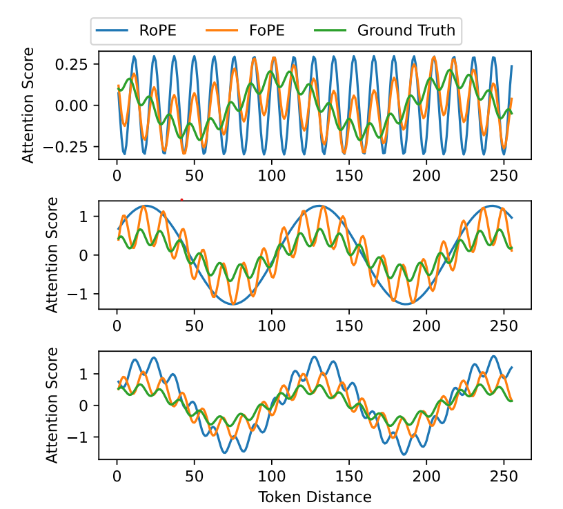

通过加噪后，FOPE 在某个 dim 下\(ROPE 是固定周期\)可以训练到更多样的周期频率。这样就可以加强外推泛化性。

相当于在一次训练时候学到了更多周期的相对位置信息。为了防止低频成分学坏了，因为低频 dim 数据本来就少，加了噪声了由于数据太小学不好可能变差，因此会进行截断。只有在指定序列长度下达到整周期的位置才保留，没有达到一个周期的不做任何处理，还是走 rope 逻辑。

结果表明，比如是 8k 训练，rope 直接用 32k 推理效果比较差，但是 fope 性能损失很小。

# 3D ROPE

以常用的 dim=128 为例，由于旋转矩阵特性，dim 实际上只有 64。

```Python
self.mrope_section = config.rope_scaling.get("mrope_section", [24, 20, 20])
```

为了简单方便处理 3d position\_ids，**将 64 个 dim 分成 24/20/20。其中 T=24, H=20, W=20**。


qwen3vl 改成了交错式格式，之前的编码方式是 TTTTHHHHWWWW 这种格式会导致高频分量被 T 占据了，明显是不合理的。

因此现在是交错式编码 THWTHWTHWTTTT：

```Python
# 位置:  0  1  2  3  4  5  6  7  8  9 10 11 12 13 14 ...
# 维度:  T  H  W  T  H  W  T  H  W  T  H  W  T  H  W ...
#       |--组1--| |--组2--| |--组3--| |--组4--| |--组5--|
```


