# Scaling Law 总结版

# 需求

- 已经训练了一个 10b 模型，想知道训练一个 100b 模型，大概性能能够提升到多少？

- 部门已经收集到了 1T 的数据，想知道能训练一个多大的模型？

- 计划训练一个 100B 的模型，想知道至少需要多大的数据？

- 准备 1 个月后开发布会，给的资源是 100 张 A100，大概能训练出啥性能的模型？

- 准备 1 个月后开发布会，给的资源是 100 张 A100，应该用多少数据训多大的模型效果最好？最划算？


上述是几个非常典型的实际需求，需求复杂度也是逐步提升。Scaling Law 实验就是为了基于大量小成本的实验，然后建模得到模型性能与参数量，训练总 token 数和计算成本之间的关系，从而在开始训练超大模型前外推解决上述实际问题，节省人力物力。

# 前言

目前 Scaling Law 主要是建模模型性能\(验证集 loss 或者评测指标\) 与模型参数量，训练总 token 数和计算成本之间的关系。

除了上述主流的 Scaling Law，一些机构也对训练中的核心超参例如 batch size 和 lr 进行建模，也有一些论文会对数据配比进行建模，这些都有比较大的参考价值。

但是由于这些参数之间的相互依赖的，超参也是相互耦合，因此现在大家做的 Scaling Law 实验可能都是相对片面的结果\(冰山一角\)，迫切需要一个能够全面建模的 Scaling Law 实践。


在正式分析 scaling law 之前，需要对一些概念有一定了解。

# 核心概念

## C=6ND

- **L**：验证集上 ce loss 或者验证集上 ppl 分数，用于表示预训练后的模型性能。 Loss 越小就认为性能越好

- **D**：训练完成消耗的总 token 数

- **N**：模型可训练参数量，**一般是不包括 embeding 层的参数量**\(原因是本身占比不大，并且在 tie\_embeding 情况下会和 output layer 层共享参数，有点不方便算\)

- **C**：计算代价，通常是一次完整实验的 FLOPs


首先要明确，C 和 ND 之间是固定关系的，对于给定的架构， C N D 之间的关系是可以提前算出来的，不需要进行实验，以 openai 论文中的标准的 Decoder\-Only Transformer 为例

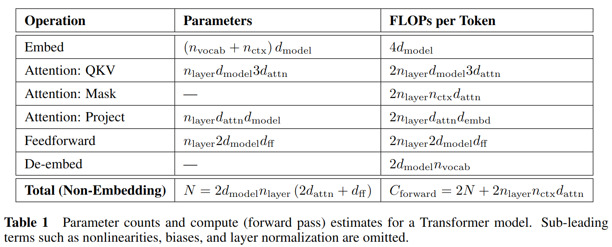

> N\(不包括 embeding,也没有包括输出层参数\) 
> 
> = attention 层 qkv 层参数\+ attention 层 o\_proj 层参数\+ ffn 层参数\(包括输入和输出\)
> 
> = n\_layer \* d\_model \* 3 \*d\_atten \+ n\_layer \* d\_model \* d\_atten \+ n\_layer \* d\_model \* 2 \*d\_ffn
> 
> = 2 \* d\_mode \* n\_layer \(2 \* d\_atten \+ d\_ff\)
> 
> 通常 d\_atten = 1/4 d\_ff = d\_model
> 
> = 12 \* n\_layer \* d\_model ^2
> 
> 


注意上述计算：

- 忽略掉了 embeding 层和 output 层的参数

- n\_ctx 是上下文长度，假设是 1024，由于这个模型还是绝对位置编码，并不是现在主流的旋转位置编码，因此位置编码是有可学习参数的

- 但是由于序列长度不是很大，计算量可以省略

所以一般设置下假设是 1B 模型，那么就是 20 层，d\_model 是 2048，对应的 FLOPs 也可以算出来

其中因子 2 来自于矩阵乘法中使用的乘法累加运算。由于** d\_model  远远大于 nctx/12，因此后半部分可以忽略**，因此这个公式可以得到

C\_forward= 2\* N，加上两倍的 backward 成本，那么每个 token 大概就是 C = 6N，考虑整个数据集则得到

C 约等于 6 \* N \* D  

\# N 是参数量，D 是训练总token 量，C 表示训练总的计算代价，且不考虑 embeding 层

通过推导，我们就得到了 C=6ND 这个公式。

注意上述的公式针对特定的结构计算的，不同的设置和架构会有点区别，如果想特别精确，那最好基于自己设计的模型重新计算，后续才会得到更准的 scaling law 公式。

上述公式非常容易理解，计算代价与模型参数量、训练总 token 数成正比。也就是说给定了其中两个参数，其实第三个参数就已经固定了。

## 幂律关系

幂律是一种数学方程，用于描述一个特定量随另一个量的幂变化的关系。在幂律中，一个量的变化与另一个量的变化的幂\(指数\)成比例。

幂律方程 y = bx^a 表示 y 的变化量与 x 的变化量的 a 次方成正比。如果 a 是 2，那么当 x 翻倍时，y 将增加 4 倍。现实世界中的一个例子是圆的面积与半径的关系。

幂律 y = bx^a。取两边的对数,幂律变为 log\(y\) = alog\(x\) \+ log\(b\)。这是一个线性方程\(在对数空间中\),其中 a 是斜率,log\(b\) 是 y 轴截距。因此，幂律关系在对数\-对数图上会呈现为一条直线，直线的斜率对应于幂律中的指数。

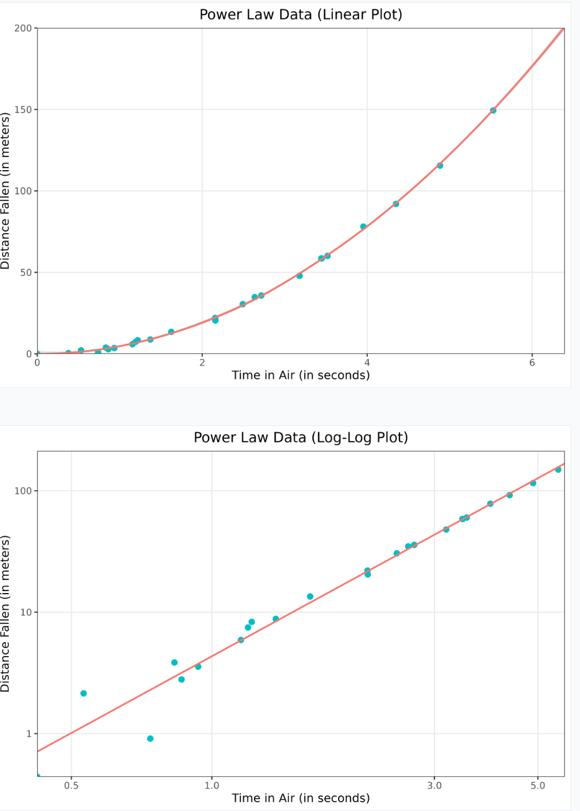

第二条曲线是对方程两边取 log\-log 绘制的结果。这就是所谓的幂律关系，实验表明 scaling law for llm 也是幂率关系。

# OpenAI Scaling Laws

Scaling Laws for Neural Language Models

https://arxiv\.org/abs/2001\.08361

## 全局实验设置

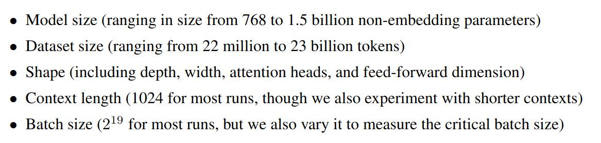

Batch size 那一栏应该是写错了，是 2^9 而不是 2^19

- Decoder\-only Transformer 结构，**模型参数量从 768 到 1\.5B** \(768 ? 为何这么小\)

- BPE 编码，**词表大小是 50257**

- 训练数据是 WebText2，长下文是 2k \(n\_ctx\)，准备的数据** token 从 22M 到 23B**

- **Adam, global bs 512，seq\_len 是 2048\( 每个 iter 消耗的 token 数是 1M\)，训练 step 是 250k**

- 由于内存限制，超过 1B 参数的模型使用的是 Adafactor 优化器

准备了 66M 的 token 作为同分布的验证集，并且还准备了**类似分布的 Books Corpus, Common Crawl, English Wikipedia 等作为评测集**


## 实验 1：学习率调度策略无关

在实验中发现：收敛的结果在很大程度上与学习率调度策略无关。除非另有说明，我们数据中包含的所有训练运行都使用具有 3000 步线性预热的学习率计划，然后是余弦衰减为零。

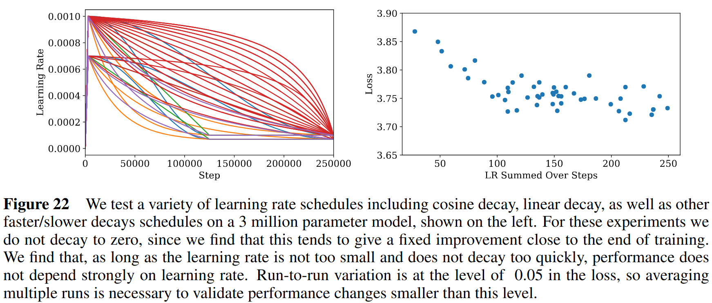

只要学习率不是太小并且不会太快衰减，性能就不会强烈依赖于学习率。运行到运行的变化在损失中的 0\.05 级别。

## 实验 2： 架构的 shape 无关

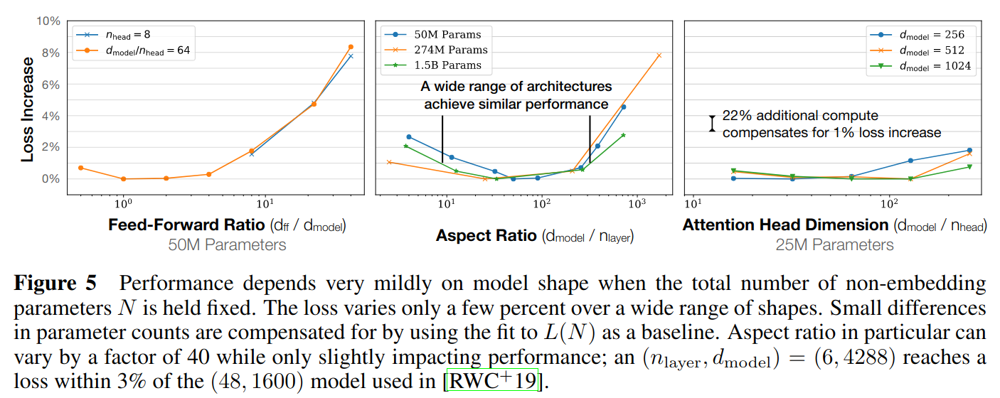

- 最左边图可以看出，在大部分范围内，参数量固定，不断调整 d\_ff 和 d\_model 比例， loss 差别不大，dff 是 2\~6 倍于 d\_model 就行了

- 中间图是在固定参数量情况下，在一个比较宽泛的范围内调整 d\_model 和 n\_layer 比例，也是差不多结论，但是出了范围就不对了

- 最右边是固定参数量情况下，调整 n\_head 个数，发现影响更小。


众所周知，层数这个参数是很重要的，因此有必要单独研究下

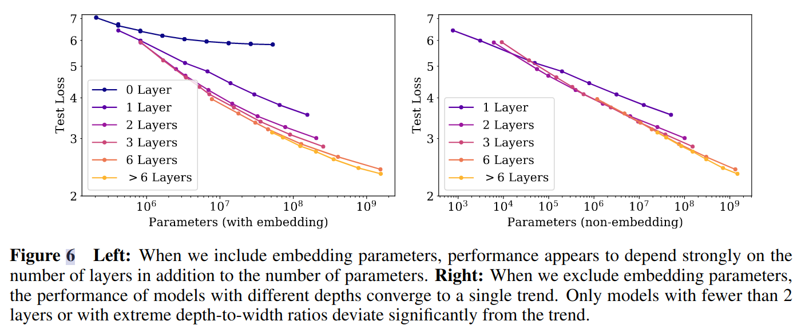

- 在包括 embedding 参数情况下，模型参数量固定，增加层数，则说明 d\_model 变小，可以发现层多一点性能总是好一点，也就是说深一点的网络比浅一点的好

- **但是当层数大于 6 后，其实层数增加和减少一旦对最终性能影响也比较小了，**也就是说层数不要小于 6 就行了

## 实验 3： 性能和参数量之间的幂律关系

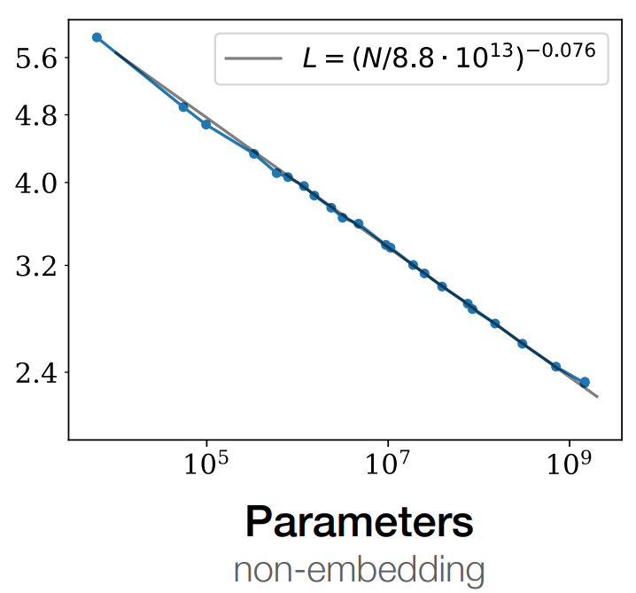

在给定大量不同参数量的模型情况下，**其余超参全部固定进行训练**，记录每次实验收敛时刻的验证 loss。

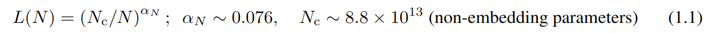

假设其满足如上的幂律公式，可以通过实验所得值，然后曲线拟合得到系数，并且在 log\-log 坐标下进行绘制可以得到上述斜线。

通过上述公式可以解决：已经训练了一个 10b 模型，想知道训练一个 100b 模型，大概性能能够提升到多少？


但是上述结论成立的条件如下：

- 在不考虑计算成本和数据量不够情况下也就是计算成本和数据总量不做任何限制，不管多大的模型必须要确保已经收敛，如果模型已经出现过拟合现象\(理论上只有数据足够多就不能过拟合\)，那么也应该记录的过拟合前的 val loss，也就是始终记录的是最好值。

- 思路 scaling law 曲线的适用性，这个曲线是否可以外推到 100b 甚至 1000b 模型上。从目前 llama3 400b 模型来看，至少这个量级是没有问题的，因此现阶段不用担心 scaling law 的外推性

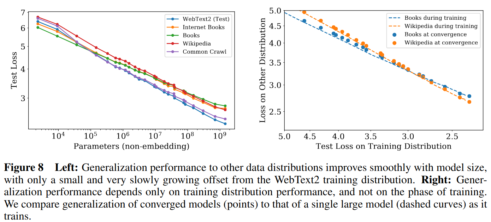

**为了防止验证集选择不合适导致的结论偏差，作者还采用其他几个和训练分布不一样的数据进行评测**，发现也是基本上符合这个曲线，但是如果分布不同会出现一个**恒定的 loss 偏差**，这也算验证了这种做法的泛化性，你不用特别担心只在训练和验证分布完全相同情况下才有效。

## 实验 4： 性能和训练总 token 之间的幂律关系

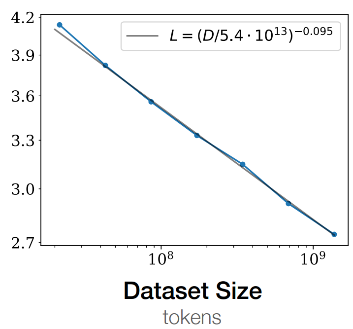

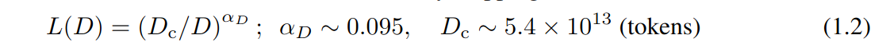

这个要跑的实验有点多，**在给定总训练 token 情况下，需要不断改变模型参数量进行训练，然后记录在不同模型参数量情况下 val loss 情况下，然后找最小值才能得到上述曲线。**

在实践上由于 token 总量固定，对于比较大的模型可能并不需要这么多数据就收敛了，此时可以采用早停策略，节省成本。

为何要不断改变模型参数量，原因是上述公式要成立需要满足计算成本和模型参数量不做任何限制。

## 实验 5： 性能和计算成本之间的幂率关系

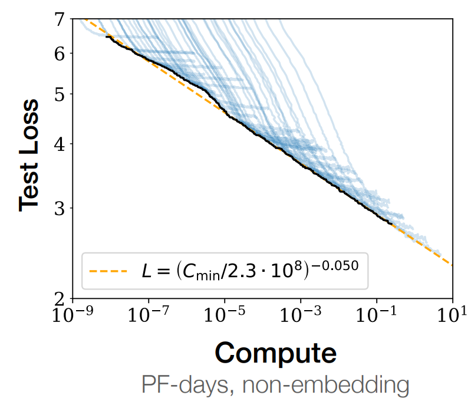

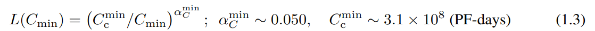

注意是 C\_min 而不是 C，原因这个幂律公式是**建模最小代价情况下达到最佳 loss，此时训练效率最高。**

具体实验上是在给定计算代价情况下，不断更改模型参数量和训练总 token 数据\(**实际上可改的只是模型参数量，一旦确定了模型参数量，那么训练总 token 数就确定了**\)，然后将模型训练到收敛状态，记录此时最佳的 test loss。

上述曲线可以解决： 准备 1 个月后开发布会，给的资源是 100 张 A100，大概能训练出啥性能的模型？

## 实验 6：性能和模型参数量、训练总 token 之间的联合关系

有了上述大量实验结果，其实还可以建模性能和模型参数量、训练总 token 之间的联合关系

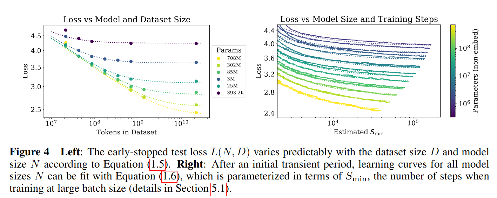

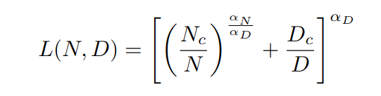

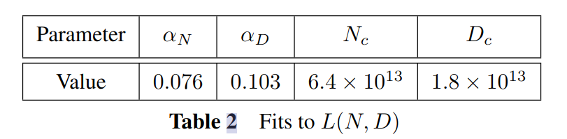

- 左图每一条线都代表在给定模型参数量情况下，不断增加数据量，所能达到的收敛 loss。可以预见在给定模型参数量情况下，一直加数据，必然不会过拟合，val loss 开始会快速下降，后续趋于平稳或者下降非常缓慢。虽然继续加数据性能肯定会涨，但是此时就不是本文追求的性能\-效率最优点。比如在固定参数量情况下，你加了 5 倍数据， val loss 只降了 0\.01，那么就划不来了。

- 同样的，如果训练总 token 数固定，理论上不断加大模型性能会越来越好，但是也面临错过性能\-效率最优点。比如在固定数据量情况下，你加了 5 倍模型， val loss 只降了 0\.01，那么就也划不来了，而且其实还可以出现过拟合现象。

要明白：Scaling law 追求的是性能\-效率或者性能\-代价最优平衡点，而不是一味追求性能。


从左图还能得到一个重要结论： 越大的模型在消耗更少数据情况下就可以收敛到小模型大数据同样甚至更好的性能\(画一条水平线表示相同 loss水平，可以发现越大的模型越早达到这个 loss\)。这指导我们：在给定计算代价情况下或者说训练时间下\(虽然总的训练成本没有变，但是需要的高质量数据少了，相当于成本更低了\)，尽量选择更大的模型，训练收益才是最高。

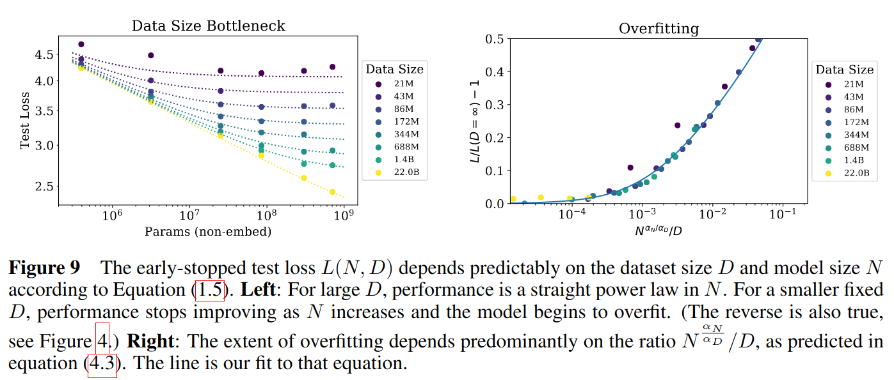

并且我们也知道了：要达到性能\-效率最优平衡点，我们要同时缩放训练总 token 和模型参数量，不能单一缩放。

从上述公式可以看出：**模型缩放比例应该比数据规模缩放比例大一点，每当我们增加模型大小 8x 时，我们只需要将数据增加大约 5x。 **

**但是不同的论文有不同的看法，这个缩放比是一个关键。而且我们通俗理解肯定和数据质量和分布有关系的，所以这个缩放比需要基于自己的数据质量来确定，无法直接套用。**


有了上述联合公式，其实很多需求都能直接解决了

- 部门已经收集到了 1T 的数据，想知道能训练一个多大的模型？ **只需要把 D 带入到公式，然后求在 L 最小的情况下所对应的模型参数量**

- 准备 1 个月后开发布会，给的资源是 100 张 A100，应该用多少数据训多大的模型效果最好？最划算？ **只需要先计算出 1 个月\+ 100 张 A 100 的 FLOPs 是多少，然后找到最小的 val loss 是多少，然后利用这个 val loss 找到最佳的模型参数量/训练总 token 数。实际操作上可能存在多组参数符合需求，此时可以再从训练速度和推理速度角度考虑最佳值。**


上述曲线也可以反推出在当前模型参数量情况下，最少需要多少数据才不会过拟合\(可以解决：计划训练一个 10B 的模型，想知道至少需要多大的数据？\)。分母表示在数据量无限情况理论的收敛 loss，在无限数据集下我们认为模型一定不会过拟合，当左边的值越大表示过拟合越严重，等于0 表示完美情况。假设**误差在 0\.02**，那么**可以算出最小的 D 是多少。**

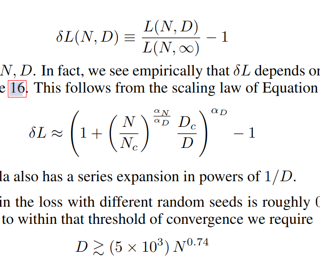

论文还有非常多的公式没有介绍，有兴趣的可以看原文。


# DeepMind Scaling Laws

Training Compute\-Optimal Large Language Models

https://arxiv\.org/pdf/2203\.15556

也叫作 Chinchilla Scaling Laws。**这个 scaling law 应用更广泛，因为他的做法更直接，更直观，可操作性更强。**

同时相比于 openai 结论，一个重要区别是他：对于计算最优训练，模型大小和训练令牌的数量应该相等地缩放。

## 概述

在实践中，分配的训练计算预算通常是预先知道的：**有多少卡可用，以及我们想要使用它们的时间**。我们需要的是给定预算下最佳模型大小和训练 token 总数。这是一个更加实际的问题，因此本文的 Scaling Laws 才是实际上用的最多的，包括 llama3 等都是用的这套做法。

给定一个固定的 FLOPs 预算，一个权衡模型大小和训练令牌的数量应该如何？

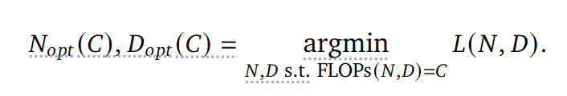

N 是模型参数量，D 是训练总 token 数，C 是计算代码 FLOPs。

具体实验上作者根据超过 400 个模型的损失经验估计这些函数，范围从 70M 到超过 16B 参数，并在 5B 到超过 400B 标记上进行训练——**每个模型配置针对几种不同的训练范围进行训练，确保严谨**。

基于估计的计算最优边界，我们预测对于用于训练 Gopher 的计算预算，最优模型应该小 4 倍，同时在 4 倍的标记上进行训练。我们通过训练一个更通用的 **70B** 模型（称为 Chinchilla）来验证这一点，该模型在 1\.4 万亿 个令牌上。Chinchilla 不仅优于其更大的对应物 Gopher，而且其减小的模型大小大大降低了推理成本，极大地促进了较小硬件上的下游使用。

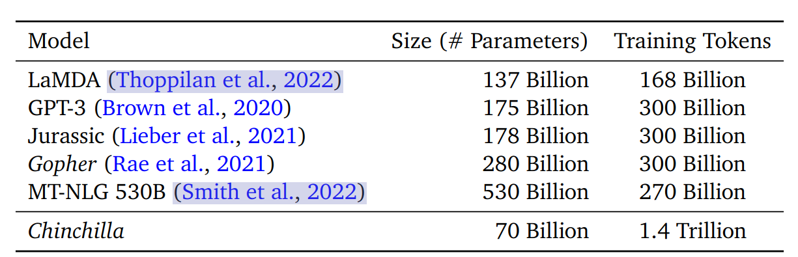

从现在眼光来看，这些模型其实依然还是欠训练的，数据量太少了。


有一个注意点： openai 做 scaling law 实验时候，是不管多大模型，按最大步数=25万来设置 cosine schedule，最终decay 到零来实验的。如果模型比较大提前收敛了，则直接停止，也就是不一定真的训练完成。这可能会有问题

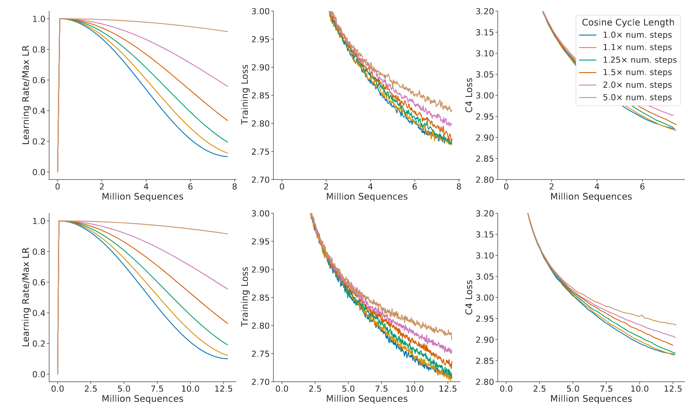

如果设置为 25w 步，但是实际上只训练了 1w 步，那么 lr 实际上偏高，此时性能并不是最优的\(虽然看起来收敛了\)，可能会影响后续结论\(高估训练步数超过 25% 性能会影响很大\)，本文作者觉得该训到多少 step，cosine schedule 衰减的最低点就应该止步于多少 step，也就是说不同的训练 token 总数，要配备不同的 lr 学习率调度策略。不应该设置 step =25w，然后训练一半就停掉，这个做法会影响后面结论。


为了进行合理的 scaling law，作者一共提出了 3 种办法。在所有三个方法中，我们首先训练一系列同时改变模型大小和训练令牌数量的模型，并使用生成的训练曲线来拟合它们应该如何缩放的经验估计公式，同时依然假设计算和模型大小之间存在幂律关系。

## Approach 1: Fix model sizes and vary number of training tokens

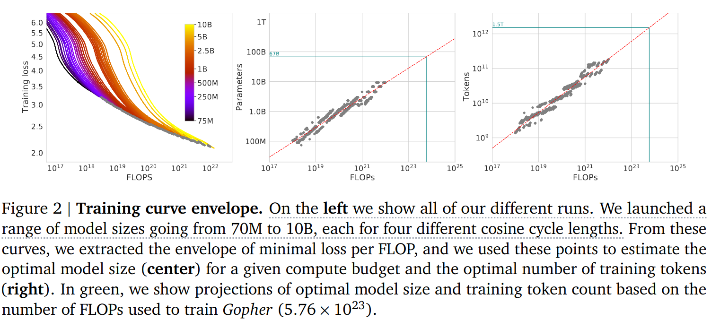

- 对于每个固定参数量的模型，我们训练了 4 个不同参数组合的模型，每个具体模型使用不同的 token 数进行训练，不同的 token 数要匹配不同的学习率策略，min lr 要衰减到 0\.1 倍，token 总数可能差距 16x，也就是说**每个参数的模型一共有 16条学习曲线，也就是每个参数模型有 16 个点**

- 以左图的黄色 10b 模型曲线为例，实际上应该是 16 个 loss 点\(可以拟合出一条平滑曲线\)，每个点代表一次实验，表示在当前计算代价情况下，训练特定 token 数所得到的训练 loss，可以发现如果训练成本越小但是模型参数量一定，那么训练 loss 必然越大；对于 10b 和 5b 模型，在计算代价一样但是比较少情况下，10b 模型训练的 token 数少一半，loss 也大一些，但是如果训练代价多一点，那么 10b 模型就和 5b 模型 loss 一样了，可以预计，如果训练代价持续增加，那么 10b 模型性能必然好于 5b 模型

- 上述大量的曲线就可以构造左图，对这些曲线计算包偌，就可以得到上图中的灰色曲线。这条曲线就表示在固定FLOPs 的条件下，对应的最小 Training loss

- 然后利用这条灰色曲线，我们可以得到两个非常有价值的曲线，第一个是在给定计算代价情况下，最优的模型参数量\(也就是在给定计算代价情况下，哪些尺寸的模型达到了最小 loss\)

- 同样的，我们可以得到在给定计算代价情况下，最优的训练 token 数\(也就是在给定计算代价情况下，哪些 token 总数达到了最小 loss\)

- 由于这个关系是幂率曲线，所以可以很容易计算出公式。有了这两个公式就可以解决问题了

## \*\*\*Approach 2: IsoFLOP profiles

作者设定了 9 种不同的算力规模，然后在每种算力规模下分别训练多种参数规模的模型，来尝试直接回答最开始的问题（即给定算力条件下，最优的参数规模是怎样的）。这是最直接的实验做法，也是目前最普遍采用的方案。

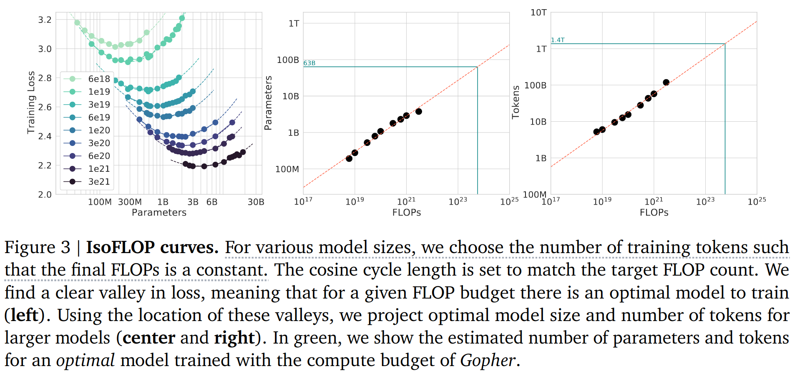

- 提前确定一共 9 种不同大小的计算代价，然后设置大量的不同尺寸的模型\(此时训练的总 token 数是固定了，学学习率调度策略也可以确定\)，最大模型到 16b，最小模型是 75m

- 每个实验都是记录训练的最终 loss，最终得到左图曲线

- 以某一个计算代价为例，曲线是 U 形，说明在给定计算代价情况下，模型并不是越大越好，因为**模型越大则训练 token 越小，loss 可能就很高**

- 通过上述曲线，找到每个 U 形曲线的最低点，此时可以得到计算代价和最优训练参数的关系，也可以得到计算代价和最优 token 数的关系了

- 从上述曲线可以得到在给定计算代价情况下，最优参数量和最优训练 token总数的关系，可以得到和 openai 不一样的结论：模型参数和训练总 token 数同等重要。

## Approach 3: Fitting a parametric loss function

最后，作者基于前面的所有实验数据，同时结合其他研究结果和 ML 中经典期望风险分析分解的方式，提出了一个训练 Loss 与模型参数规模和训练数据规模的关系，利用实验数据进行拟合分析，得出了模型规模，训练数据规模以及Loss三者之间的关系

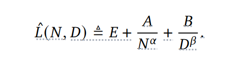

其中 N 代表模型参数规模， D 代表训练数据规模,其余参数是待求解的。E可以认为是无法估计的必然损失。

求解上述方程作者采用的是 **Huber loss（对异常点的鲁棒性更好）和 L\-BFGS 优化算法进行拟合求解**，同时还可以得到如下公式：

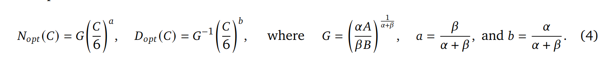

𝑎 = 0\.46 and 𝑏 = 0\.54

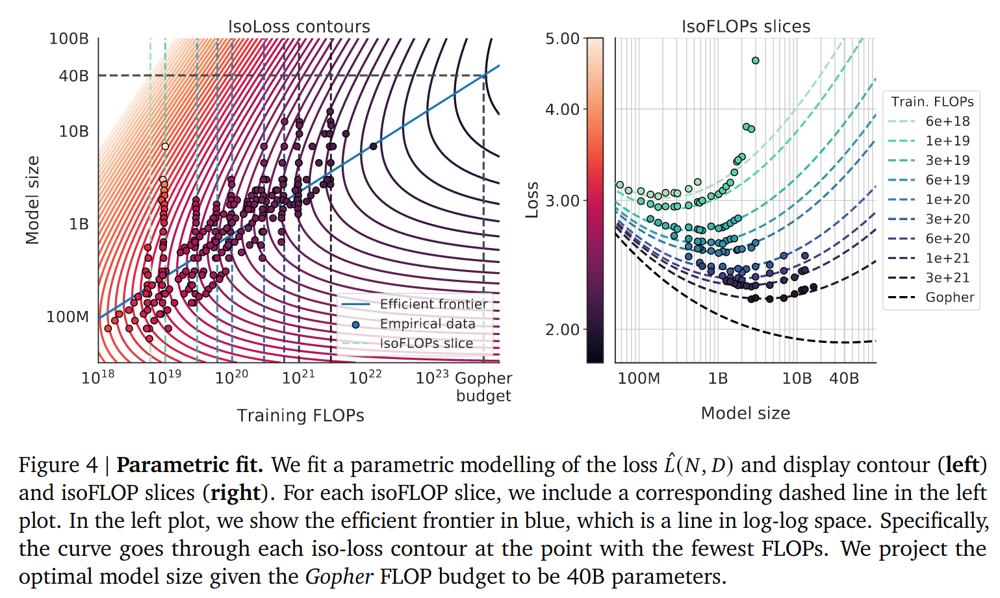

上述公式拟合得到的等高线图如上所示。

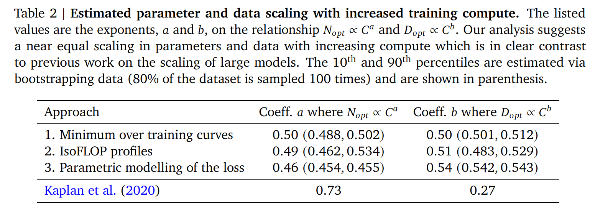

三种方法都可以得到类似的结果，验证了准确性。

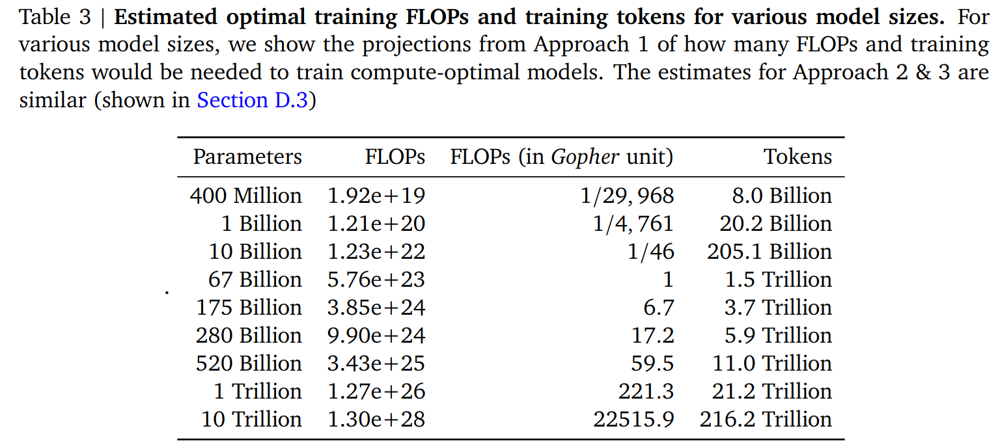

注意上述是给定计算代价下的最优的训练参数和 token，**假设对于 1b 模型，如果计算代价可以增加，那么性能可能会更好。**


为了进一步验证文章的想法，作者选择以 Gopher\-280B 为对照目标，使用同样的算力条件下，根据文章方法，估计的最优模型规模在 40B\-70B 之间，作者选择以模型参数上界 70B 进行实验，同时选择了**1\.4T 的 tokens 量级进行训练**，简单讲，就是模型规模缩小为 Gopher\-280B 的 1/4，但是训练数据是其的4倍多，该模型就是 Chinchilla 模型。

# DeepSeek Scaling Laws

https://arxiv\.org/pdf/2401\.02954

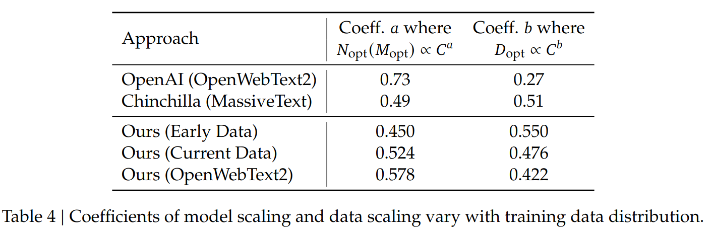

Deepseek 在不同的数据上使用 openai 提出的方法进行 scaling law 实验发现不同数据得到的系数差别有点大，这说明数据质量对 scaling law 的结论有很大影响。

从上述可以看出不同数据会显示出不同的结论，对scaling law 的一般适用性提出了质疑。此外，这些研究往往缺乏对超参数设置的完整描述，从而不确定不同计算预算下的模型是否达到了最佳性能，也就是说透明度不够。


为了确保不同计算预算下的模型可以达到最佳性能，我们首先研究了超参数的缩放规律。根据经验，据观察，当计算预算不同时，**训练期间大多数参数的最佳值不会改变**。然而w为了保证严谨性，依然重新检查了对性能影响最大的超参数，即批量大小和学习率。 

然后再研究模型参数和训练数据量的关系，采用的方法是 IsoFLOP profile approach from Chinchilla，为了更准确地表示模型尺度，我们使用了一种新的模型尺度表示，不包括嵌入的 FLOPs/token M，取代了早期使用的模型参数 N。

从而将之前的 C=6ND 表示成 C=MD。

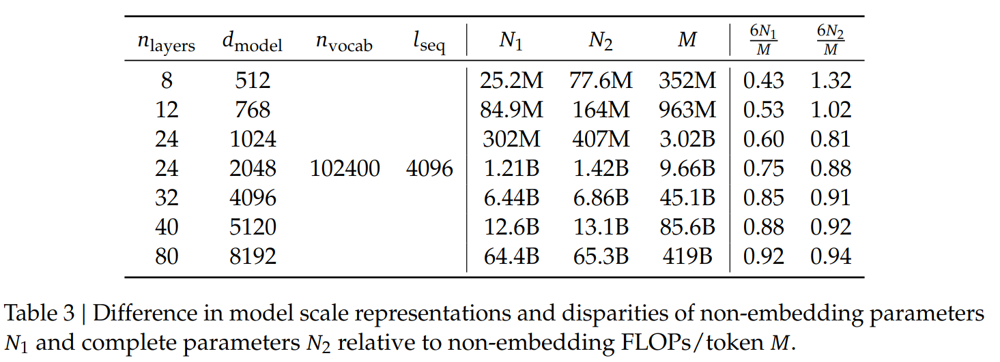

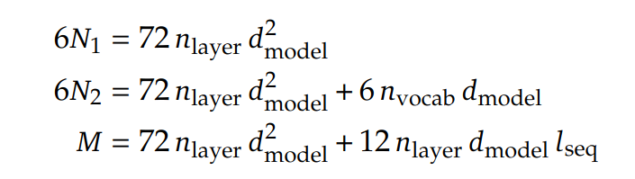

- N1 是 openai 里面推导 C=6ND 的计算中的，不包括 embeding 计算

- N2 是加了 embeding 计算量

- **M 是不包括 embeding 层的计算量，M  不是代表参数量**

C=6ND 这个是存在大量约简操作得到的，目的是简单好用，因为 N 和 D 都是非常好算的，但是 DeepSeek 通过实验发现这个公式其实不够准确，不应该存在大量约简过程，而是直接应该用 **FLOPs per Token \(M\)来表示， 12 ndl 是 attention 部分的计算量。**

之前 C=6ND 时候是假设 d\_model 远远大于 l\_seq/12 所以后面这项可以越掉，但是如果序列很长其实是不能约掉的。


话说如果要估计特别准确的话，旋转位置编码的乘法不用考虑吗？


从上表可以看出，当模型比较小的时候，其实 6N1 和 M 差距比较大，因此不能暴力的约掉。


此外，在探索缩放定律的过程中，我们使用的数据经过多次迭代，不断提高质量。我们尝试在各种数据集上拟合缩放曲线，发现**数据质量显着影响最佳模型/数据放大分配策略**。数据质量越高，计算预算应该分配给模型缩放的次数就越多。这意味着高质量的数据可以驱动给定相同数据尺度的较大模型的训练。最优模型/数据放大分配策略的差异也可以作为评估数据质量的间接方法。


下面开始详细说明。

## Scaling Laws for Hyperparameters

设置计算代价为从 1e17 到 2e19, M 模型参数量为 177M FLOPs/token 到 xxx，然后对 bs 和 lr 进行网格搜索，然后统计训练结束后的最终 loss

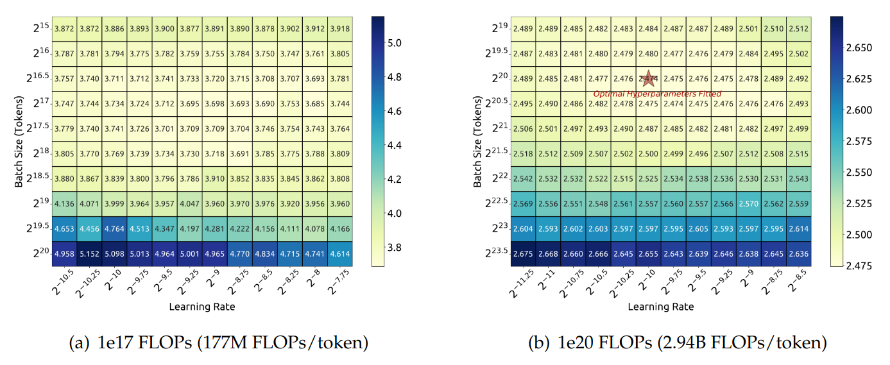

loss 越小越好，也就是颜色越浅越好。可以看到 lr 和 bs 在很宽范围内都是最优的。通过大量实验拟合后的公式如下：

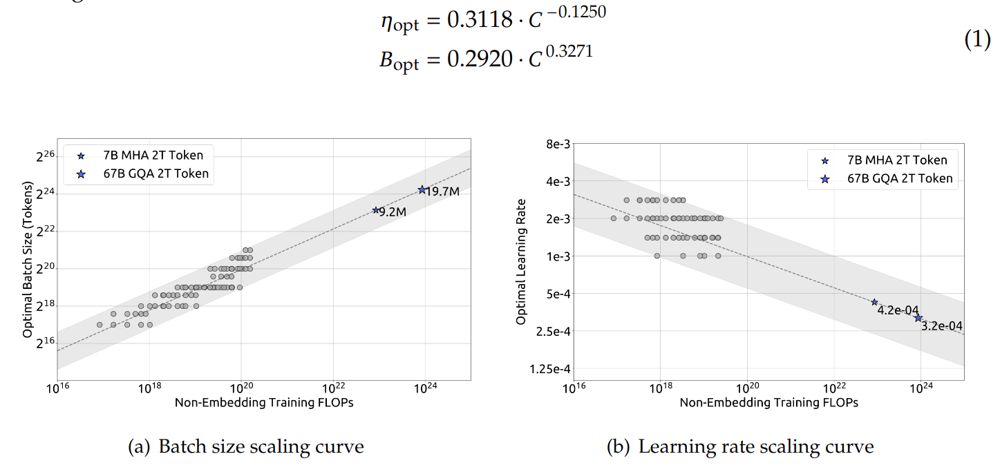

- 首先最优的 bs 和 lr 范围比较宽，超参比较好选择

- 最优 bs 随着计算代价的增加而增加，而 lr 正好相反。正常来说计算代价增加，对应的是模型参数和训练总 token 数增加，此时按照我们经验，应该 global batch size 也要相应增加，lr 要相应减少


1M 是  2^20，1B 是  10^9，1T 是 10^12，假设 7B 模型训练 2T 数据，那么 Non\-Embedding Trainging FLOPs 是 6\*7 \* 2 \* 10 ^21 次方= 8\.4 \* 10 ^22 \~= 10 ^23，对应的最优 global bach size 应该是 9\.2M，对应的最优 lr 是 4\.2e\-04。


反算下，如果我们训练 0\.5B 模型 \+ 120B token，此时粗略估计 FLOPS 是 3\.6 \* 10 ^18，看上图大概范围应该是 5×2^17 ～ 2^19 = 0\.07m \~0\.1m 之间，lr 大概是 7e\-4 ～ 3\.5e\-3 很合理。


然而，重要的是要注意，我们尚未考虑计算预算以外的因素对最优超参数的影响。在计算预算相同但模型/数据分配不同的模型中，最优参数空间略有不同。这表明需要进一步研究以了解超参数的选择和训练动态。

## Estimating Optimal Model and Data Scaling

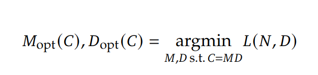

现在要解决的问题如上。采用的办法是 the IsoFLOP profile approach from Chinchilla。选择 8 个不同的计算代价，每个代价选择 10 种不同的模型和数据总量配比实验，每个预算的超参数由之前的公式确定，泛化误差是在独立验证集上计算的，类似于训练集包含 100M 个标记。

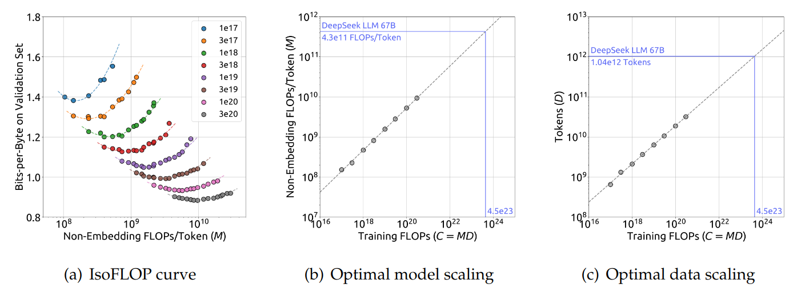

M 其实就是等价于模型参数量。

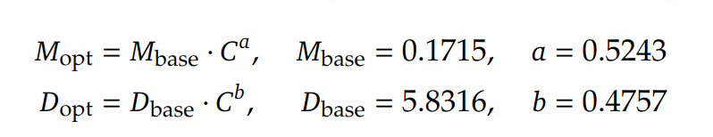

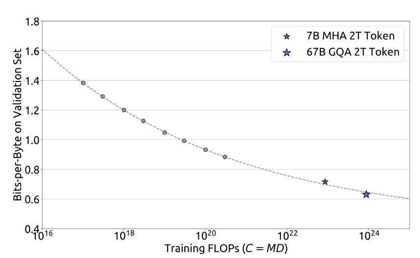

基于上述经验，就可以知道如果是 7b 模型\+2T token 最终性能如何？ 发现和拟合曲线很接近。

# Dataset Scaling laws

RegMix: Data Mixture as Regression for Language Model Pre\-training

https://arxiv\.org/abs/2407\.01492

## 概述

大型语言模型预训练中的数据配比对性能有显著影响，但如何确定有效的配比仍不明确。

论文提出 REGMIX，通过将数据配比问题形式化为回归任务，自动识别高性能的数据配比。

REGMIX包括使用多种数据配比训练一组小型模型，并拟合一个回归模型来预测给定各自配比的模型的性能。利用拟合的回归模型，外推得到排名最高的配比，并使用它来训练一个大规模模型。

为了实证验证 REGMIX，论文训练了512个具有1M参数的模型，用于1B个不同配比的token，以拟合回归模型并找到最佳配比。使用这种配比，论文训练了一个1B参数的模型，用于25B个token（即比之前大1000倍，长25倍\)

论文还发现：

- 数据配比显著影响下游性能，导致单任务性能差异高达14\.6%；

- 通用网络语料库（如CommonCrawl），而非维基百科，与下游任务性能提升的正相关性最强；

- 领域间的交互复杂且常常与直觉相悖，突显了像REGMIX这样的自动化方法的必要性；

- 数据配比也可以应用到 scaling law 中，实现自动化


一共包括 4 个步骤：

- 生成随机数据配比并在此基础上训练小规模代理模型

- 使用表1：Pile数据集概览，其中因版权问题不再可用的数据集以灰色标记。在论文的实验中，论文使用可获得的17 个领域来研究语言模型预训练的数据配比作为特征，拟合一个线性回归模型

- 在更大规模上模拟数据配比空间，并利用回归模型识别目标值的最佳配比

- 使用模拟的最佳数据配比训练一个大规模模型

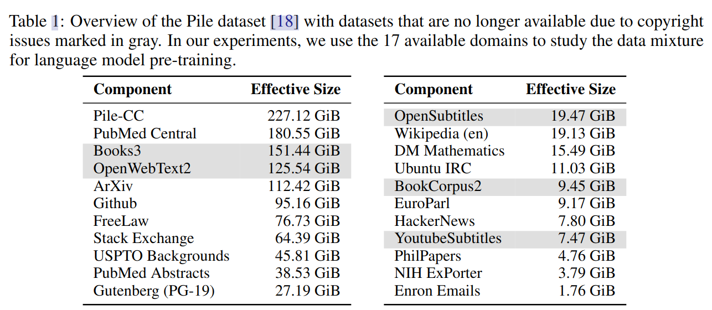

## **训练小规模代理模型**

在多个不同的数据配比上训练一组小规模代理模型。为了减少所需的运行次数，论文的目标是选择一系列涵盖每个领域从 0% 到 100% 极端权重的多样化数据配比。

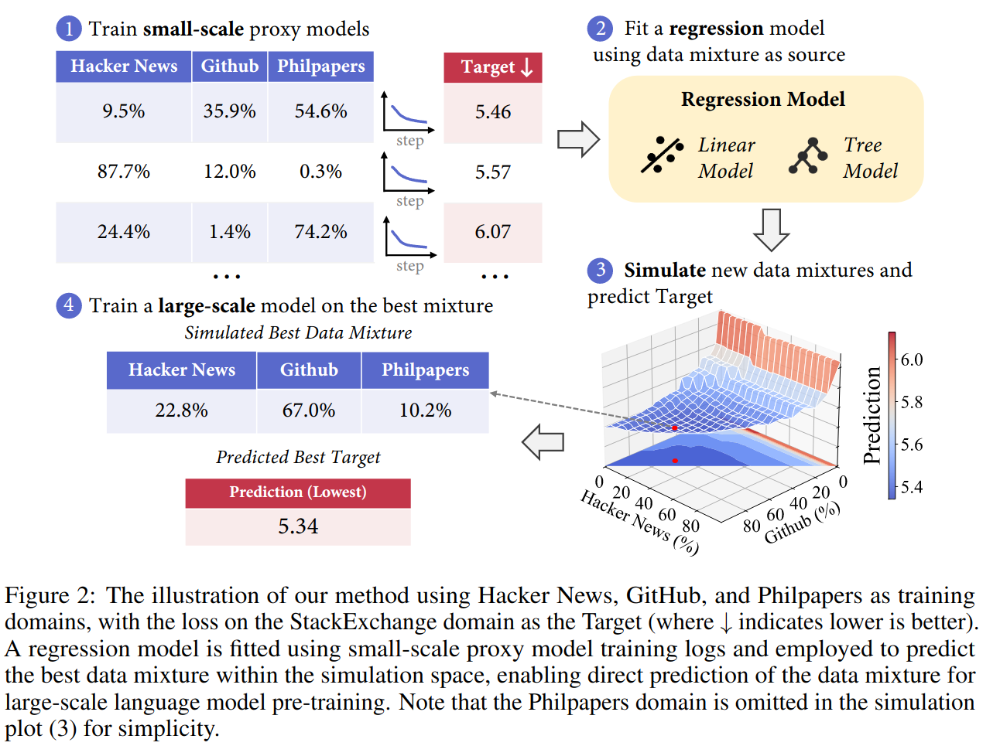

## 拟合线性回归模型

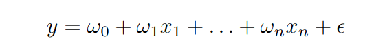

可以直接使用普通最小二乘法等技术进行估计，也可以使用 LightGBM  建模。

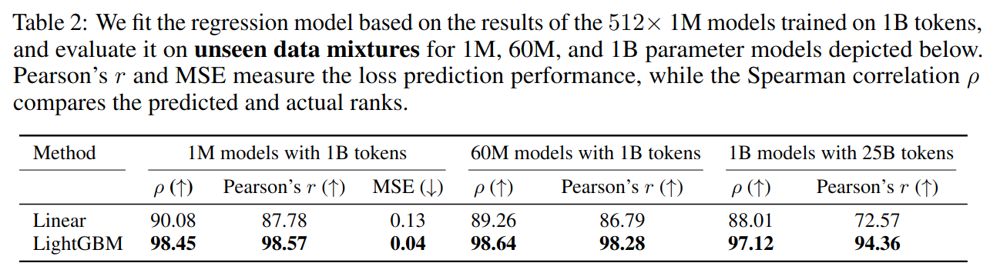

上述展示了论文基于512x 1M模型在1Btoken上训练的结果来拟合回归模型，并在未见过的数据配比上评估1M、60M和1B参数模型的表现\(应该是预测值和实际训练后的值进行对比\)。皮尔逊相关系数 r 和均方误差（MSE）衡量损失预测性能，而斯皮尔曼相关系数 rho 比较预测值与实际值的排名。


一旦论文训练了回归模型，论文就可以高效地探索整个可能的数据配比空间。通过使用训练好的模型预测每个潜在数据配比的目标值，论文可以快速识别产生最佳目标值的输入。在通过模拟识别出最佳数据配比后，论文将排名靠前的数据配比推广到包含更多token的大规模模型训练中。


总体来看，这个论文做法非常简单直接，但是存在训练的模型太小，实际上是否真的有效还不确定。

# Vocabulary Scaling laws

Scaling Laws with Vocabulary: Larger Models Deserve Larger Vocabularies

https://arxiv\.org/pdf/2407\.13623v2

Scaling laws 主要集中在模型参数和训练数据规模上，忽略了词汇量大小的作用。通过在高达 500B 个字符的数据上训练从33M到3B参数的各种模型，研究了词汇量大小如何影响LLM扩展规律。

提出了三种互补的方法来预测计算最优的词汇量大小:IsoFLOPs分析、导数估计和损失函数的参数拟合。我们的方法都得出了同样的结果,即最优词汇量大小取决于可用的计算预算,并且更大的模型应该有更大的词汇量。然而,大多数LLM使用的词汇量太小。例如,我们预测Llama2\-70B的最优词汇量应该至少为216K,是其32K词汇量的7倍。我们通过训练3B参数的模型来验证我们的预测,结果在不同的FLOPs预算下一致地优于通常使用的词汇量大小。通过将词汇量从常规的32K增加到43K,我们在ARC\-Challenge上的性能从29\.1提高到32\.0,使用的FLOPs为2\.3e21。我们的工作强调了在有效扩展中同时考虑模型参数和词汇量大小的必要性。

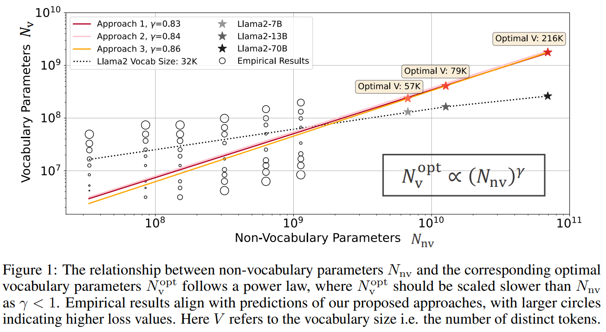

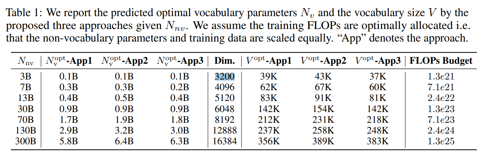

不过正常来说，词表都是固定的，不会不同模型训练一个不同的词表，所以感觉本文不是很有参考价值，故没有细看。

# Performance Scaling laws

Performance Law of Large Language Models

https://arxiv\.org/pdf/2408\.09895

这篇文章是两个独立的研究者做的，风格非常随意，因此阅读时候也要抱着随意的态度阅读。


Scaling law 只给出了损失的定性估计，这受到模型架构、数据分布、tokenizer和计算精度等各种因素的影响。因此，在不同的训练设置直接估计精度更有价值\(不理解如果我估计 val loss 有啥不一样的地方吗？\)。作者建议直接用 MMLU Score 作为性能分数就可以。

首先明确几个名词：

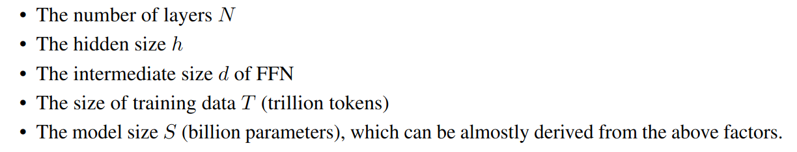

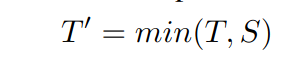

代表有效的 token 数，而训练总 token 数。因为考虑到有些模型训练的总 token 数特别多，但是实际上很多都是低效的，如果直接全部考虑会严重带来偏差\(但是上面公式是合理的吗？ T S 暴力取最小值？ 那不是 1b 模型有效 token 就 1b？\)。

基于前人经验，模型越深越难训练，此时就会存在一个损失折扣 u \(越大越好，比如损失打个 9 折和打个 5 折，那必然是 5 折损失更多\)。


γ 表示大模型训练中存在的必然精度损失，默认是 1。可以看出，N 模型层数越大，u 越小。上述公式的意思是：在给定参数量模型前提下，越深越细长的模型 u 越小，损失越大。最终的 Performance Law 公式如下所示：


- w1 = 13\.95018, w2 = 0\.23072, w3 = −0\.48523, w4 = 5\.39802, b = 9\.19541

- N,h,d,t 越大，性能都是越好

- 但是 N 太大，u 就会越小，性能也会出现折中


因为 MMLU 分数大部分模型都是公开的，因此作者直接从所有已知的开源模型里面提取数据，然后直接拟合这个方差。考虑到  MMLU 最大是 100 分，但是上述预测值可能超过 100，因此再进行简单变换下

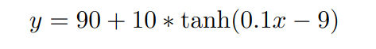

作者还对 MOE 模型进行了类似估计。

有了这个公式，你就可以估计模型性能了

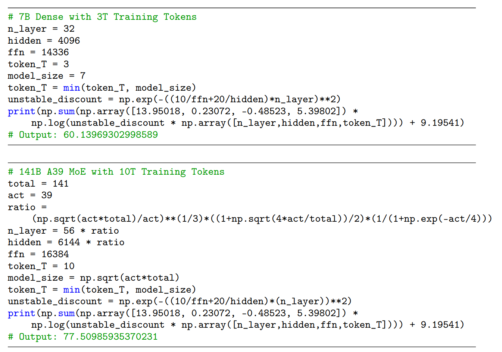

这个 scaling law 甚至连实验都不用做\.\.\.

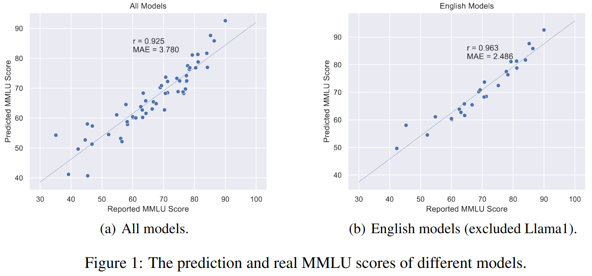

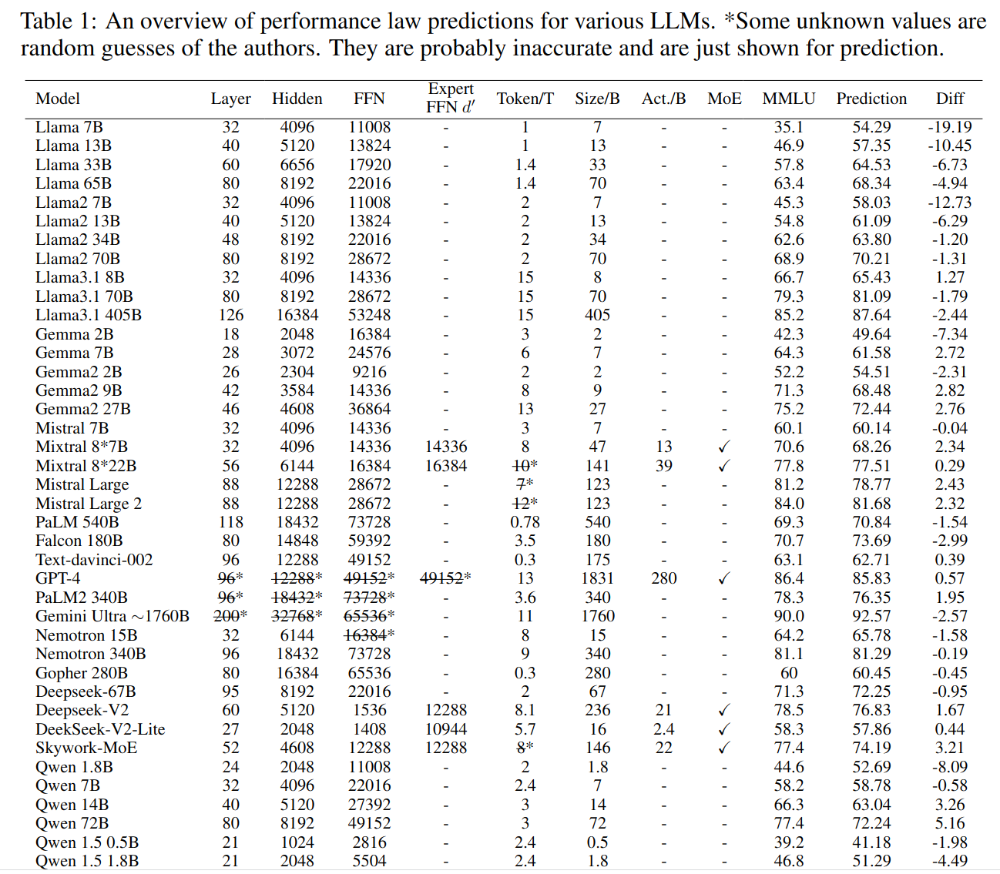

可以发现有些模型其实估计偏差很大，有些比较准确。

虽然这个 scaling law 好像价值不大，但是基于这个公式有一些 Insights 蛮好。

## 模型深度是一个双刃剑

根据回归系数，层数对模型性能的影响最大。这是直观的，因为增加模型深度可以快速引入更多的非线性。然而，与scaling law 的理想预测不同，在实践中，层深度不是一切。深度模型训练的不稳定性阻碍了开发人员增加模型深度。如果训练基础设施具有计算精度问题（不幸的是很常见），深度模型的质量将严重损坏。

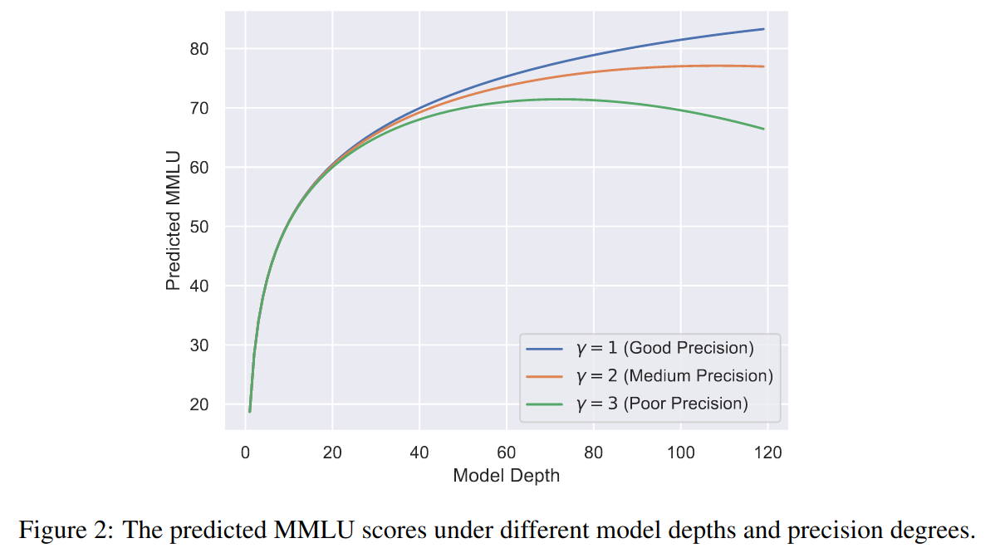

上图显示了不同精度系数 γ 下的预测性能。在这里，我们将隐藏维度设置为 8192，FFN 大小设置为 28672。当训练基础设施具有良好的精度（γ = 1 可以通过领先公司实现）时，可以在不影响其性能的情况下训练超过 100 层的模型。不幸的是，如果精度不令人满意，预测性能会迅速衰减，这与工业中常见的实际经验一致。

此外，在相同的尺寸下，更深的模型通常具有较低的推理速度、训练速度和更大的KV缓存内存消耗。因此，如果开发人员更关注推理效率，或者对训练稳定性和精度没有信心，建议使用相对较浅的模型结构来降低不良精度的负面影响\(但是从这里来看，应该要到 40 层以上才有差别\)。

## 隐藏大小（有时）比 FFN 大小更重要

再次看看公式

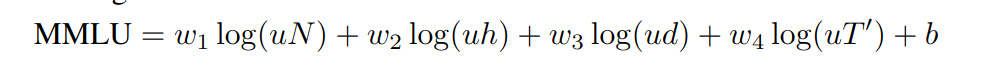

w1 = 13\.95018, w2 = 0\.23072, w3 = −0\.48523, w4 = 5\.39802, b = 9\.19541

w3 居然是负数。这说明如果模型是从头开始训练的，而不是从另一个模型扩展，那么最好使用相对较大的 hidden size 而不是 FFN 大小，这可能是因为大型 FFN 矩阵中参数的高度冗余。

然而，性能与 FFN 大小没有简单的负相关，因为它有助于控制不稳定的折扣 u。例如，Llama 405B \(3\.25\) 和 Mistral Large \(2\.33\) 中的 FFN 大小与隐藏大小h 的比率不是太大。这与我们自己的实践的实验结果非常一致。

然而，由于推理成本和模型训练的精度的限制，增加 FFN 的大小可能是一个折衷方案。因此，为LLM设计人员选择适度的 FFN 大小可能是可行的。

## 主流注意力架构似乎具有相似的性能

标准注意力架构有许多不同的变体，例如 GQA  和 MLA 。FFN的设计也从 bottleneck network 变为GLU。然而，我们假设，鉴于对性能定律的准确预测，它们可能具有相似的性能，尽管它们在实践中可能具有较小的性能差距。例如，根据 Gemma 2 报告，GQA 可能具有类似于 MHA 的性能。这表明我们仍然找不到“捷径”来显着提高基于 Transformer 的模型在相同但足够的计算能力下的性能。

## 顶级玩家具有相似的数据质量

数据质量和分布通常在很大程度上影响模型质量。然而，即使性能定律没有考虑数据质量和分布，预测精度仍然令人满意。这意味着**顶级LLM玩家可能具有相似的数据质量和分布\(尽管某些语言的比例可能会增加\)。**

所有主流 llm 通常使用书籍、论文、新闻文章、考试练习和代码库等来源。还共享一些常见的数据过滤和处理技术。这些原因导致不同组织使用的数据的固有同质性。一些领先的组织可能比竞争对手拥有明显更高和更高质量的数据。这将使超过性能定律的预测成为可能。

另一方面，我们需要承认知识密集型数据（例如考试问题）的影响。与常见的网页和书籍相比，这些形式的数据与 MMLU 评估更相关，对这些知识密集型数据进行训练可能会导致 MMLU 分数的增加。这解释了为什么第一代 Llama 的性能远低于预测。然而，我们可以看到更大的模型可能会缩小这一差距，如 Llama 65B、Text\-Davinci、Gopher 和 PaLM 所示。此外，我们可以看到大多数中文增强模型比预测表现更好。这可能是因为中文模型数据混合物中考试和练习数据的比例明显更高。

## MoE 很有前景，但难以训练

根据我们的分析，MoE 模型可以以更少的训练和推理成本与更大的密集模型实现相当的性能。此外，由于 FFN 大小的缩小，Deepseek V2 和 Qwen 57B\-A14B 等细粒度 MoE 可能比粗粒度 MoE 略有优势。基于我们的性能规律，设计者可以根据 MoE 模型的要求灵活调整配置。然而，基于moe的LLM的成功案例数量有些有限，MoE的训练MFU通常比密集模型差得多。在另一个视图中，MoE可以从现成的密集模型中向上循环或转换，而无需从头开始训练。因此，在预算有限的MoE和密集模型之间做出决定时，开发人员可能需要谨慎。

# 其他

https://arxiv\.org/pdf/2408\.11029 Scaling Law with Learning Rate Annealing

https://arxiv\.org/pdf/2402\.04177 Scaling Laws for Downstream Task Performance of Large Language Models

# Transfomer FLOPs 计算

对于一个 A\_mxk \* B\_kxn 的矩阵乘法，FLOPs 是 2𝑚 ×𝑘 ×𝑛 ，其中 2 是因为有乘法，然后加的操作。


假设有 hidden size h, sequence length s, vocabulary size V, and training batch size B


对于一个 Attention Layer，其包括 qkv 三个线性层\+ o 输出层，那么 FLOPs 是 2 \* \(3\* B \*s \* h \*h\+ B \*s \* h \*h\)=8 B s h^2

对于内部的自注意力计算，FLOPs 是 2\*B \* s^2 \* h


对于 MLP 层，一般包括 3 层，up\_proj \+ down\_proj \+ gate\_proj， 以 llama 为例一般中间层的 size 是 hidden size 的 8/3 倍，那么 FLOPs 为 2 \* \( B \*s \* h^2 \* 8/3\)\*3 个=16 B \*s \* h^2


输出层比较好算： 2 B \* s \* h \* V


因此一个标准的不包括 embeding 层的 transformer 层 FLOPs 为 2\*B \* s \* h \* V\+ n\_l \* \(8 B s h^2\+2\*B \* s^2 \* h\+16 B \*s \* h^2\)


然后反向传播是前向的两倍，因此上面的结果要直接乘以 3。


考虑到 checkpoint 会多一次 forward，因此此时要直接乘以 4。

```Python
flops_qkvo_proj = 8 * batch_size * sequence_len * self.hidden_size**2
flops_attn = 4 * batch_size * sequence_len**2 * self.hidden_size * \
    sequence_parallel_size / (int(self.is_casual) + 1)
flops_mlp = 4 * self.mlp_ratio * batch_size * sequence_len * \
    self.hidden_size**2
flops_wo_head = (3 + int(self.use_activation_checkpointing)) * (
    flops_qkvo_proj + flops_attn + flops_mlp) * self.num_layers
flops_head = 3 * 2 * batch_size * sequence_len * self.hidden_size * \
    self.vocab_size
flops_per_iteration = flops_wo_head + flops_head

avg_tflops_per_gpu = flops_per_iteration / 1e12 / (iter_time + 1e-12)
```


# 详细版本

[Scaling Law 总结与详述](https://aicarrier.feishu.cn/wiki/QnLKwIvxBiDQD2kd5y1ce759nrh)

