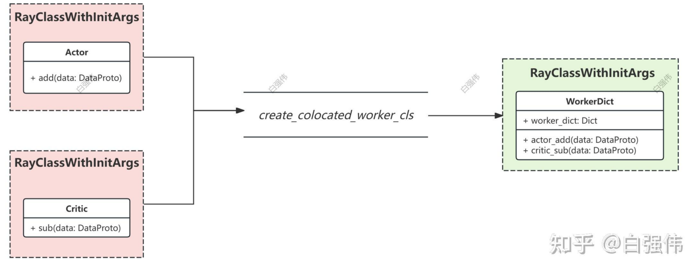
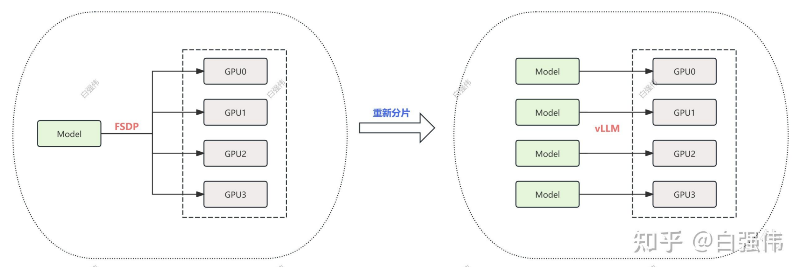
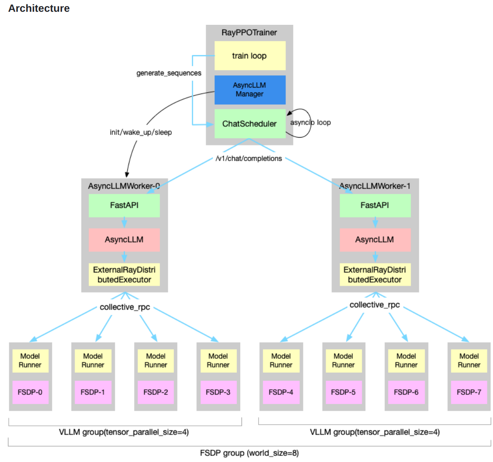
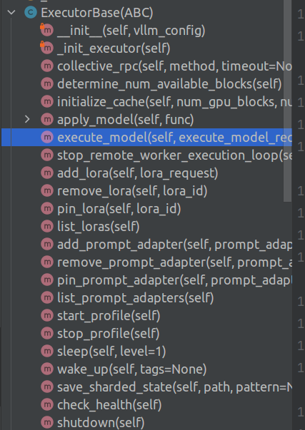
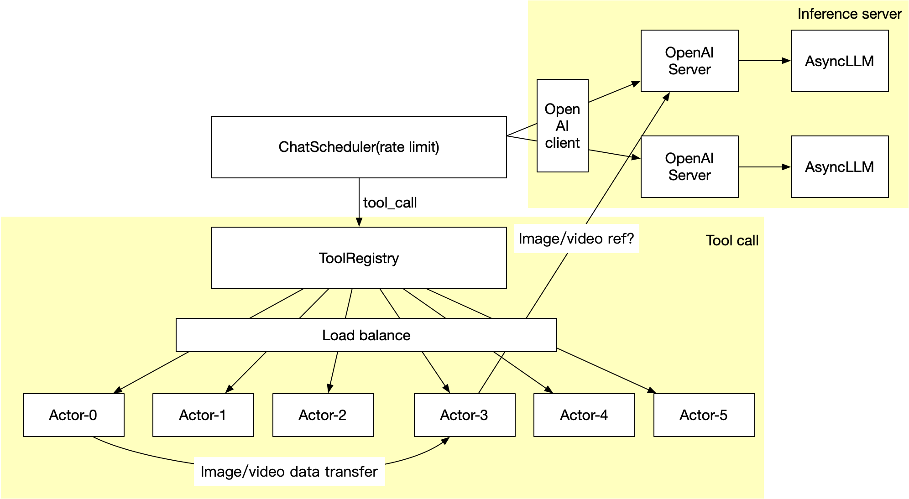
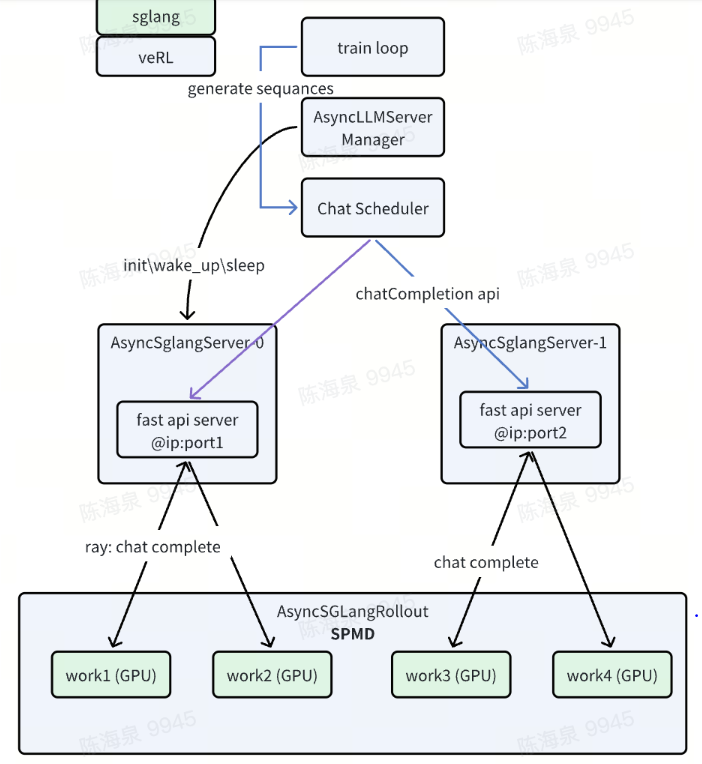
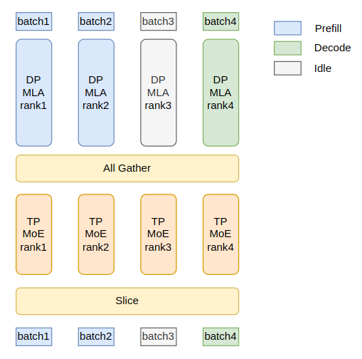
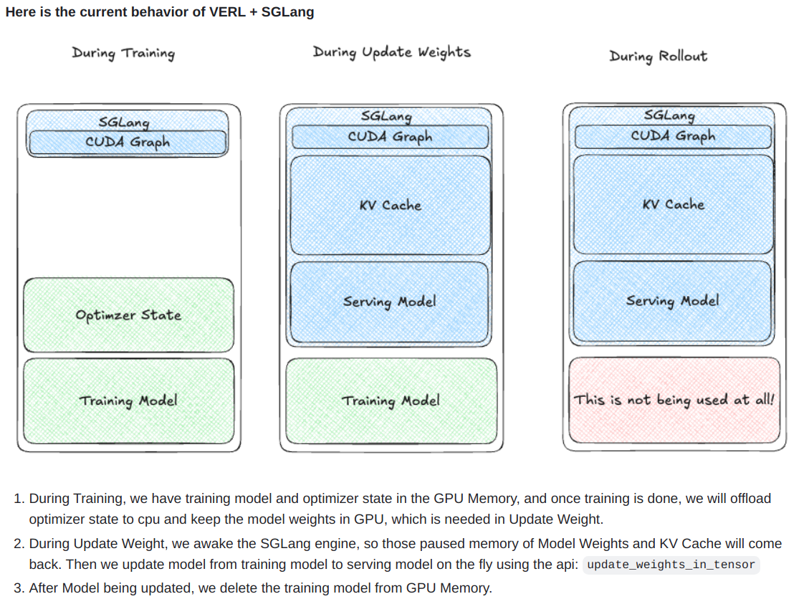
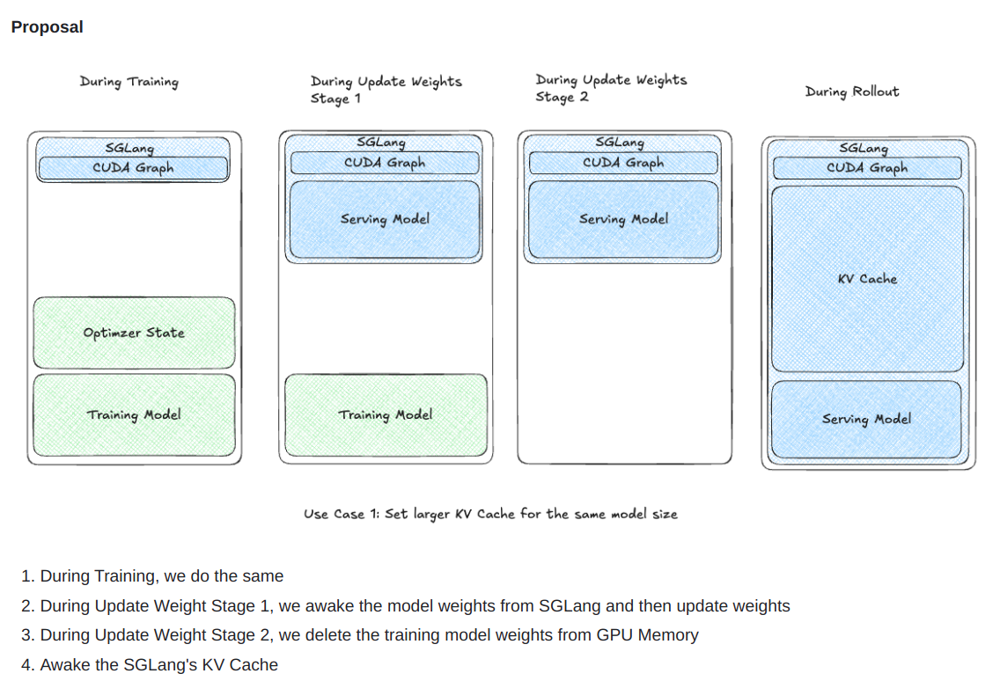

# Verl 理解

# 相关链接

https://fy2462\.github\.io/2024/10/vllm\-diagram\-executor/

# 最简例子

```python
from verl.single_controller.base import Worker
from verl.single_controller.ray.base import RayClassWithInitArgs, RayResourcePool, RayWorkerGroup
import ray
import torch
import warnings
from verl.single_controller.base.decorator import Dispatch, Execute, register

warnings.filterwarnings("ignore")

ray.init()

# [4] 表示要启动 4 个 worker
# max_colocate_count 表示每个 worker 最多占用的 cpu 核数
resource_pool = RayResourcePool([4], use_gpu=False, max_colocate_count=2)

@ray.remote
class GPUAccumulator(Worker):
    def __init__(self) -> None:
        super().__init__()
        # The initial value of each rank is the same as the rank
        self.value = torch.zeros(size=(1,), device="cpu") + self.rank

    def add(self, x):
        self.value += x
        print(f"rank {self.rank}, value: {self.value}")
        return self.value

class_with_args = RayClassWithInitArgs(cls=GPUAccumulator)
worker_group = RayWorkerGroup(resource_pool, class_with_args)
print(worker_group.execute_all_sync("add", x=[1, 1, 1, 1]))
```

## RayResourcePool

**定义资源相关的内容，**

\[4\] 存入 self\.\_store 内部是通过 sum\(self\.\_store\) 来判断当前资源池包括几个资源，这里表示整个资源池分成 4 部分，每个部分分配 2 个 cpu 核心。


**核心方法 get\_placement\_groups**

基于 self\.\_store 构建 placement\_group 代表最终的资源分配组。

采用的默认策略是 strategy="STRICT\_PACK"，表示一定要放到单个节点内。


RayResourcePool先将机器资源切分为若干 bundle，每个bundle包含1块 gpu。然后在worker调度时，就可以指定将当前worker调度在哪一个bundle上，这样就能实现多个模型共存同一个gpu

```Shell
for gpu_idx in range(num_gpus):    
    ray_options = {"placement_group": pg, "placement_group_bundle_index": gpu_idx, 'num_gpus': 0.5}     
    rst = run.options(**ray_options).remote(x)

```

**不能直接设置 num\_gpu=0\.5 这种代码，因为这样本质上是将两个 actor 都放到了 gpu0 上，而不是两个 actor 分布放置于 gpu0 和 gpu1 上。**


## Worker

被 @ray\.remote 装饰后，会直接触发 worker 的 \_\_new\_\_ 方法


真正执行的 worker，一共有 4 个。

重点关注 init 初始化方法。注意这个类是在远程初始化的，所以 debug 进不去。

在初始化方法里面会获取当前 worker 的 world size 和 rank

```json
store = {
    "_world_size": world_size,
    "_rank": rank,
    "_local_world_size": local_world_size,
    "_local_rank": local_rank,
    "_master_addr": master_addr,
    "_master_port": master_port,
}
```

**这些信息是 RayWorkerGroup 里面对 worker 远程初始化时候传入的，具体是 \_init\_with\_resource\_pool 方法。**

## RayClassWithInitArgs

只是简单对 ray 类初始化参数的简单封装，比较简单，

每个 worker 都是属于 RayClassWithInitArgs 的参数传入，所以 worker 初始化时候，实际上是这个类帮忙初始化的

```python
def __call__(self, placement_group, placement_group_bundle_idx, use_gpu: bool = True, num_gpus=1, sharing_with=None) -> Any:
*    ...*
    return self.cls.options(**options).remote(*self.args, **self.kwargs)
```

## RayWorkerGroup

最重要的类。各个 worker 实际上的初始化是这个类控制。

```python
def __init__(
    self,
    resource_pool: RayResourcePool = None,
    ray_cls_with_init: RayClassWithInitArgs = None,
    bin_pack: bool = True,
    name_prefix: str = None,
    detached=False,
    worker_names=None,
    worker_handles: List[ray.actor.ActorHandle] = None,
    ray_wait_register_center_timeout: int = 300,
    **kwargs,
) -> None:
*    *super().__init__(resource_pool=resource_pool, **kwargs)
    self.ray_cls_with_init = ray_cls_with_init
    
    # 初始化 worker
    self._init_with_resource_pool(resource_pool=resource_pool, ray_cls_with_init=ray_cls_with_init, bin_pack=bin_pack, detached=detached)

    # 给 worker 绑定 dispatch 方法，语法糖
    self._bind_worker_method(self.ray_cls_with_init.cls, func_generator)

    self.wg_dict = None
    self.method_names = []
```

```python
def _init_with_resource_pool(self, resource_pool, ray_cls_with_init, bin_pack, detached):
    *"""Initialize the worker group by creating new workers from a resource pool.*

*    Args:*
*        resource_pool: Resource pool for worker allocation*
*        ray_cls_with_init: Class with initialization arguments for workers*
*        bin_pack: Whether to use strict bin packing for resource allocation*
*        detached: Whether workers should be detached*
*    """*
*    *use_gpu = resource_pool.use_gpu

    strategy = "PACK"
    if bin_pack:
        strategy = "STRICT_PACK"
    # 初始化资源组
    pgs = resource_pool.get_placement_groups(strategy=strategy)
    world_size = resource_pool.world_size # 4
    self._world_size = world_size
    # cia.add_kwarg("_world_size", world_size)
    num_gpus = 1 / resource_pool.max_colocate_count

    rank = -1
    local_world_size = resource_pool.store[0] # 4
    for pg_idx, pg in enumerate(sort_placement_group_by_node_ip(pgs)):
        # 对每个 worker 设置必备的环境变量
        for local_rank in range(local_world_size):
            rank += 1

            # we pass in environment variable at option so that Worker can use environment variable to set
            env_vars = {
                "WORLD_SIZE": str(world_size),
                "RANK": str(rank),
                "WG_PREFIX": self.name_prefix,
                "WG_BACKEND": "ray",
                "RAY_LOCAL_WORLD_SIZE": str(local_world_size),
                "RAY_LOCAL_RANK": str(local_rank),
            }
            if rank != 0:
                env_vars["MASTER_ADDR"] = self._master_addr
                env_vars["MASTER_PORT"] = self._master_port

            import re

            cia_name = type(ray_cls_with_init.cls).__name__
            match = re.search(r"ActorClass\(([^)]+)\)", cia_name)  # ray.remote(Obj) -> "ActorClass(Obj)"
            cia_name = match.group(1) if match else cia_name  # "ActorClass(Obj)" -> "Obj"
            name = f"{self.name_prefix}{cia_name}_{pg_idx}:{local_rank}"  # e.g. Worker_2:5
            
            # 这么设置后，worker 类初始化时候就可以获取这些环境变量
            ray_cls_with_init.update_options({"runtime_env": {"env_vars": env_vars}, "name": name})

    
            # 真正 worker 初始化时刻
            worker = ray_cls_with_init(placement_group=pg, placement_group_bundle_idx=local_rank, use_gpu=use_gpu, num_gpus=num_gpus)
            self._workers.append(worker)
            self._worker_names.append(name)
            
            # 在 rank0 worker 初始化后，内部会调用 _configure_before_init 注册 centor
            # 用于获取 master id 和 port，不知道用于干啥的？
            if rank == 0:
                register_center_actor = None
                # 可以肯定是在 worker初始化调用 _configure_before_init 注册的
                actor_name = f"{self.name_prefix}_register_center" 
                start_time = time.time()

                while time.time() - start_time < self._ray_wait_register_center_timeout:
                    if actor_name in list_named_actors():
                        register_center_actor = ray.get_actor(actor_name)
                        break

                    elapsed = int(time.time() - start_time)
                    if elapsed % 30 == 0:
                        logging.warning(
                            "Waiting for register center actor %s to be ready. Elapsed time: %s seconds out of %s seconds.",
                            actor_name,
                            elapsed,
                            self._ray_wait_register_center_timeout,
                        )
                    time.sleep(1)

                if register_center_actor is None:
                    raise TimeoutError(
                        f"Failed to get register_center_actor {actor_name} "
                        f"in {list_named_actors(all_namespaces=True)} "
                        f"for {self._ray_wait_register_center_timeout} seconds. "
                        "Ensure that any lingering Ray resources from previous "
                        "runs are cleaned up (e.g., by restarting the Ray cluster), "
                        "or adjust the waiting time by modifying the config "
                        "`trainer.ray_wait_register_center_timeout`."
                    )

                rank_zero_info = ray.get(register_center_actor.get_rank_zero_info.remote())
                self._master_addr, self._master_port = rank_zero_info["MASTER_ADDR"], rank_zero_info["MASTER_PORT"]
                # print(f"rank_zero_info: {rank_zero_info}")
                # print(f"master_addr: {self._master_addr}, master_port: {self._master_port}")
```

## Dispatch 机制

先看一个比较麻烦的例子

```python
@ray.remote
class GPUAccumulator(Worker):
    def __init__(self) -> None:
        super().__init__()
        # The initial value of each rank is the same as the rank
        self.value = torch.zeros(size=(1,), device="cpu") + self.rank

    # @register(Dispatch.ONE_TO_ALL)
    def add(self, x):
        self.value += x
        print(f"rank {self.rank}, value: {self.value}")
        return self.value

class_with_args = RayClassWithInitArgs(cls=GPUAccumulator)
worker_group = RayWorkerGroup(resource_pool, class_with_args)
print(worker_group.execute_all_sync("add", x=[1, 1, 1, 1]))
```

最后一行代码的意思是： 

对每个 worker 异步并行调用 add 方法，并且把 x 切分为 4 份发给每个 worker，异步运行完成后再收集每个 worker 信息返回。

作者觉得这种调用方法非常不方便，因此改成了装饰器模式

```python
@ray.remote
class GPUAccumulator(Worker):
    def __init__(self) -> None:
        super().__init__()
        # The initial value of each rank is the same as the rank
        self.value = torch.zeros(size=(1,), device="cpu") + self.rank

    @register(Dispatch.ONE_TO_ALL)
    def add(self, x):
        self.value += x
        print(f"rank {self.rank}, value: {self.value}")
        return self.value

class_with_args = RayClassWithInitArgs(cls=GPUAccumulator)
worker_group = RayWorkerGroup(resource_pool, class_with_args)
# print(worker_group.execute_all_sync("add", x=[1, 1, 1, 1]))
print(worker_group.add(x=10))
```

通过装饰器方法实现了类似功能。


装饰器原理是： 给这个 add 方法新增一个 "attrs\_3141562937" 属性，这个属性是写死的。

属性的值为： attrs = \{"dispatch\_mode": dispatch\_mode, "execute\_mode": execute\_mode, "blocking": blocking\}

第一个是采用哪一种 dispatch 模式，第二个参数是在哪个 rank 执行，第三个是是否异步。


然后会在 RayWorkerGroup 的 self\.\_bind\_worker\_method\(self\.ray\_cls\_with\_init\.cls, func\_generator\) 里面进行处理

核心原理是：获取 wokrer 类的 全部属性 dir\(user\_defined\_cls\)，然后遍历

```Bash
if hasattr(method, MAGIC_ATTR):
    # this method is decorated by register
    attribute = getattr(method, MAGIC_ATTR)
    
    dispatch_mode = attribute["dispatch_mode"]
    execute_mode = attribute["execute_mode"]
    blocking = attribute["blocking"]
    
    # 生成一个新的函数
    func = func_generator( # 也是一个装饰器，返回新函数
        self,
        method_name,
        dispatch_fn=dispatch_fn,
        collect_fn=collect_fn,
        execute_fn=execute_fn,
        blocking=blocking,
    )
    setattr(self, method_name, func)
```

这样原先的 add 方法就会变成带有各种默认参数的新方法了。原先的 add 函数最终会变成如下函数运行模式：

```python
def func(*args, **kwargs):
    args, kwargs = dispatch_fn(self, *args, **kwargs)
    padding_count = kwargs.pop(_padding_size_key, 0)
    output = execute_fn(method_name, *args, **kwargs)
    if blocking:
        output = ray.get(output)
    output = collect_fn(self, output)
    if padding_count > 0:
        if isinstance(output, DataProto):
            indices = [i for i in range(len(output))][:-padding_count]
            output = output.select_idxs(indices)
        elif isinstance(output, list):
            output = output[:-padding_count]
    return output
```

# 两个模型共进程部署

https://zhuanlan\.zhihu\.com/p/31595392436

```Python
from verl.single_controller.base import Worker
from verl.single_controller.ray.base import RayResourcePool, RayClassWithInitArgs, RayWorkerGroup, create_colocated_worker_cls
import ray
import torch
import warnings
from verl.single_controller.base.decorator import Dispatch, Execute, register
import os
warnings.filterwarnings("ignore")

ray.init()

# [4] 表示要启动 4 个 worker
# max_colocate_count 表示每个 worker 最多占用的 cpu 核数
resource_pool = RayResourcePool([4], use_gpu=False, max_colocate_count=1)

@ray.remote
class GPUAccumulator(Worker):
    def __init__(self) -> None:
        super().__init__()
        # The initial value of each rank is the same as the rank
        self.value = torch.zeros(size=(1,), device="cpu") + self.rank

    @register(Dispatch.ONE_TO_ALL)
    def add(self, x):
        self.value += x
        print(f"[GPUAccumulator] rank {self.rank}, value: {self.value}")
        return self.value


@ray.remote
class GPU2Accumulator(Worker):
    def __init__(self) -> None:
        super().__init__()
        # The initial value of each rank is the same as the rank
        self.value = torch.zeros(size=(1,), device="cpu") + self.rank

    @register(Dispatch.ONE_TO_ALL)
    def add(self, x):
        self.value -= x
        print(f"[GPU2Accumulator] rank {self.rank}, value: {self.value}")
        return self.value

# 假设一共 4 张卡, class_with_args 在 4 张卡上均匀切分，class2_with_args 也在 4 张卡上均匀切分
class_with_args = RayClassWithInitArgs(cls=GPUAccumulator)
class2_with_args = RayClassWithInitArgs(cls=GPU2Accumulator)

# 通过如下操作，不仅colocated 而且实际上两个 class 在同一个进程
cls_dict = {'actor': class_with_args, 'critic': class2_with_args}
ray_cls_with_init = create_colocated_worker_cls(cls_dict)

wg_dict = RayWorkerGroup(resource_pool=resource_pool, ray_cls_with_init=ray_cls_with_init)
# 对外假装变成 2 个独立的 worker group,方便用户调用
spawn_wg = wg_dict.spawn(prefix_set=cls_dict.keys())
colocated_actor_wg = spawn_wg['actor']
colocated_critic_wg = spawn_wg['critic']

print(colocated_actor_wg.add(x=10))
print(colocated_critic_wg.add(x=10))
```



`spawn`的作用就是保证可以像非colocate那么的方式来执行具体的功能。

# vllm sync rollout

https://zhuanlan\.zhihu\.com/p/1888310042580743730



目前采用的是训推一体化模式，即 actor model 所处于的 worker，同时存在 vllm model。

```Python
class ActorRolloutRefWorker(Worker):
    # 每张卡都会实例化
    def __init__(self, config: DictConfig, role: str):
       if not torch.distributed.is_initialized():
            rank = int(os.environ.get("RANK", 0))
            world_size = int(os.environ.get("WORLD_SIZE", 1))
            torch.distributed.init_process_group(backend="cpu:gloo,cuda:nccl" if is_cuda_available else "cpu:gloo,npu:hccl", rank=rank, world_size=world_size)
        # 其余一些参数验证
      
     # 核心方法
     @register(dispatch_mode=Dispatch.ONE_TO_ALL)
     def init_model(self):
        self._build_model_optimizer() # 构建 actor fsdp 模型和优化器
        if self._is_actor:
            # 实际上 fsdp actor model 对象
            **self.actor = DataParallelPPOActor(config=self.config.actor, actor_module=self.actor_module_fsdp, actor_optimizer=self.actor_optimizer)**
         
        # 构建 vllm rollout 引擎    
        if self._is_rollout:
            self.rollout, self.rollout_sharding_manager = self._build_rollout(trust_remote_code=self.config.model.get("trust_remote_code", False))
```

可以看出，如果每个模型通过 fsdp 切分到 4 张卡上，那么在构建好 fsdp model 后会实例化 vllm 引擎。如果 dp=4，那么每张卡上面都实例化一个 vllm，如果 tp=2，那么每两张卡上面部署一个 vllm 引擎。

在构建 vllm 时候，因为现在还没有真是运行，因此 vllm 是通过离线 offload 的模式加载的。

## \_build\_rollout

```Python
infer_tp = self.config.rollout.tensor_model_parallel_size
dp = self.world_size // infer_tp
rollout_device_mesh = init_device_mesh(device_name, mesh_shape=(dp, infer_tp), mesh_dim_names=["dp", "infer_tp"])

vllm_rollout_cls = vLLMRollout
rollout = vllm_rollout_cls(
    model_path=local_path,
    config=self.config.rollout,
    tokenizer=self.tokenizer,
    model_hf_config=self.actor_model_config,
    device_mesh=rollout_device_mesh,
    trust_remote_code=trust_remote_code,
    **lora_kwargs)
    
# 用于管理 fsdp 到 vllm 权重转换过程
rollout_sharding_manager = FSDPVLLMShardingManager(
    module=self.actor_module_fsdp,
    inference_engine=rollout.inference_engine,
    model_config=self.actor_model_config,
    full_params=full_params,
    device_mesh=rollout_device_mesh,
    offload_param=self._is_offload_param,
    load_format=self.config.rollout.load_format,
    layered_summon=self.config.rollout.get('layered_summon', False),
)
```

Vllm 0\.6\.5 后版本就原生支持了 spmd 启动方式，因此 verl 不需要 hack 掉 vllm 启动部分功能。

```Python
class vLLMRollout(BaseRollout):
    def __init__(self, model_path: str, config: DictConfig, tokenizer, model_hf_config, **kwargs):
        super().__init__()
        self.config = config

        tensor_parallel_size = self.config.get("tensor_model_parallel_size", 1)
        max_num_batched_tokens = self.config.get("max_num_batched_tokens", 8192)

        max_model_len = int(config.max_model_len or config.prompt_length + config.response_length)

        trust_remote_code = kwargs.get("trust_remote_code", False)
        load_format = "dummy" if config.load_format.startswith("dummy") else config.load_format

        limit_mm_per_prompt = None
        if config.get("limit_images", None):  # support for multi-image data
            limit_mm_per_prompt = {"image": config.get("limit_images")}

        engine_kwargs = {} if "engine_kwargs" not in config or "vllm" not in config.engine_kwargs else OmegaConf.to_container(deepcopy(config.engine_kwargs.vllm))
        # For each vLLM engine parameter,
        # - `None` means not setting it, so we pop it, and leave it to vLLM default value
        #    (which can vary across different vLLM versions);
        # - Otherwise it's the desired value we want to explicitly set.
        engine_kwargs = {key: val for key, val in engine_kwargs.items() if val is not None}
        self.inference_engine = LLM(
            model=model_path,
            enable_sleep_mode=True, # 核心
            tensor_parallel_size=tensor_parallel_size,
            distributed_executor_backend="external_launcher",  # 重要
            dtype=config.dtype,
            enforce_eager=config.enforce_eager,
            gpu_memory_utilization=config.gpu_memory_utilization,
            disable_custom_all_reduce=True,
            disable_mm_preprocessor_cache=True,
            limit_mm_per_prompt=limit_mm_per_prompt,
            skip_tokenizer_init=False,
            max_model_len=max_model_len,
            load_format=load_format,
            disable_log_stats=config.disable_log_stats,
            max_num_batched_tokens=max_num_batched_tokens,
            enable_chunked_prefill=config.enable_chunked_prefill,
            enable_prefix_caching=True,
            trust_remote_code=trust_remote_code,
            seed=config.get("seed", 0),
            **lora_kwargs,
            **engine_kwargs,
        )

        # Offload vllm model to reduce peak memory usage
        self.inference_engine.sleep(level=1)

    @GPUMemoryLogger(role="vllm rollout spmd", logger=logger)
    @torch.no_grad()
    def generate_sequences(self, prompts: DataProto, **kwargs) -> DataProto:
        # rebuild vllm cache engine
        idx = prompts.batch["input_ids"]  # (bs, prompt_length)
        # left-padded attention_mask
        attention_mask = prompts.batch["attention_mask"]
        position_ids = prompts.batch["position_ids"]

        # used to construct attention_mask
        eos_token_id = prompts.meta_info["eos_token_id"]

        batch_size = idx.size(0)

        non_tensor_batch = prompts.non_tensor_batch
        if "raw_prompt_ids" not in non_tensor_batch:
            non_tensor_batch["raw_prompt_ids"] = np.array([_pre_process_inputs(self.pad_token_id, idx[i]) for i in range(batch_size)], dtype=object)

        if batch_size != len(non_tensor_batch["raw_prompt_ids"]):
            raise RuntimeError("vllm sharding manager is not work properly.")

        if "multi_modal_data" in non_tensor_batch:
            vllm_inputs = []
            for raw_prompt_ids, multi_modal_data in zip(non_tensor_batch.pop("raw_prompt_ids"), non_tensor_batch.pop("multi_modal_data")):
                vllm_inputs.append({"prompt_token_ids": raw_prompt_ids, "multi_modal_data": multi_modal_data})
        else:
            vllm_inputs = [{"prompt_token_ids": raw_prompt_ids} for raw_prompt_ids in non_tensor_batch.pop("raw_prompt_ids")]

        # ensure the type of `prompt_token_ids` passed to vllm is list[int]
        # https://github.com/volcengine/verl/pull/772
        for input_data in vllm_inputs:
            if isinstance(input_data["prompt_token_ids"], np.ndarray):
                input_data["prompt_token_ids"] = input_data["prompt_token_ids"].tolist()
            elif not isinstance(input_data["prompt_token_ids"], list):
                raise TypeError(f"prompt_token_ids must be a list or numpy array, got {type(input_data['prompt_token_ids'])}")

        do_sample = prompts.meta_info.get("do_sample", True)
        # users can customize different sampling_params at different run
        with self.update_sampling_params(**kwargs):
            # vllm 内部采用的是 left padding 模式
            outputs = self.inference_engine.generate(
                prompts=vllm_inputs,  # because we have already convert it to prompt token id
                sampling_params=self.sampling_params,
                lora_request=lora_requests,
                use_tqdm=False,
            )

            response = []
            for output in outputs:
                for sample_id in range(len(output.outputs)):
                    response_ids = output.outputs[sample_id].token_ids
                    response.append(response_ids)

            response = pad_2d_list_to_length(response, self.pad_token_id, max_length=self.config.response_length).to(idx.device)
            seq = torch.cat([idx, response], dim=-1)

        response_length = response.size(1)
        delta_position_id = torch.arange(1, response_length + 1, device=position_ids.device)
        delta_position_id = delta_position_id.unsqueeze(0).expand(batch_size, -1)
        if position_ids.dim() == 3:  # qwen2vl mrope
            delta_position_id = delta_position_id.view(batch_size, 1, -1).expand(batch_size, 3, -1)

        # *TODO(sgm): fix position_ids on right_pad*
*        *# prompt: left pad + response: right pad
        # attention_mask: [0,0,0,0,1,1,1,1, | 1,1,1,0,0,0,0,0]
        # position_ids:   [0,0,0,0,0,1,2,3, | 4,5,6,7,8,9,10,11]
        response_position_ids = position_ids[..., -1:] + delta_position_id
        position_ids = torch.cat([position_ids, response_position_ids], dim=-1)
        response_attention_mask = get_response_mask(response_id=response, eos_token=eos_token_id, dtype=attention_mask.dtype)
        attention_mask = torch.cat((attention_mask, response_attention_mask), dim=-1)

        # all the tp ranks should contain the same data here. data in all ranks are valid
        batch = TensorDict(
            {
                "prompts": idx,
                "responses": response,
                "input_ids": seq,  # here input_ids become the whole sentences
                "attention_mask": attention_mask,
                "position_ids": position_ids,
            },
            batch_size=batch_size,
        )
        return DataProto(batch=batch, non_tensor_batch=non_tensor_batch)
```

每个 worker 的最外层调用接口

```Python
@register(dispatch_mode=Dispatch.DP_COMPUTE_PROTO)
def generate_sequences(self, prompts: DataProto):
    # Support all hardwares
    prompts = prompts.to(get_torch_device().current_device())

    assert self._is_rollout

    meta_info = {
        "eos_token_id": self.generation_config.eos_token_id if self.generation_config is not None else self.tokenizer.eos_token_id,
        "pad_token_id": self.generation_config.pad_token_id if self.generation_config is not None else self.tokenizer.pad_token_id,
    }
    prompts.meta_info.update(meta_info)
    with self.rollout_sharding_manager:
        log_gpu_memory_usage("After entering rollout sharding manager", logger=logger)
        
        **# 如果没有开 tp，则啥也不做，否则 tp mesh 处要把数据从 dp 变成 tp 模式进行推理**
        prompts = self.rollout_sharding_manager.preprocess_data(prompts)
        output = self.rollout.generate_sequences(prompts=prompts)
        output = self.rollout_sharding_manager.postprocess_data(output)

    output = output.to("cpu")

    # clear kv cache
    get_torch_device().empty_cache()
    return output
```

```Python
# RayPPOTrainer 最外层调用接口 
if not self.async_rollout_mode:
    test_output_gen_batch_padded = self.actor_rollout_wg.generate_sequences(test_gen_batch_padded)
else:
    pass
```

# vllm async rollout

https://github\.com/zhaochenyang20/Awesome\-ML\-SYS\-Tutorial/issues/131


在启动 async rollout 后，整个流程有比较大的变化，虽然对外接口看起来没有变化。

首先最里面的 \_build\_rollout 变了，因为此时 llmengine 实例化是通过 server 启动，因此这个地方不需要实例化

```Python
from verl.workers.rollout.vllm_rollout import vLLMAsyncRollout
vllm_rollout_cls = vLLMRollout if self.config.rollout.mode == "sync" else vLLMAsyncRollout
rollout = vllm_rollout_cls( # 返回一个没有任何 vllm 实例的类，因为不需要
    model_path=local_path,
    config=self.config.rollout,
    tokenizer=self.tokenizer,
    model_hf_config=self.actor_model_config,
    device_mesh=rollout_device_mesh,
    trust_remote_code=trust_remote_code,
    **lora_kwargs)
```

```Python
class vLLMAsyncRollout:
    *"""vLLMAsyncRollout is a thin wrapper of WorkerWrapperBase,*
    *which is **engine in single worker process.*
    *"""*

# 可以看出，这个方式的初始化啥也没有干
def __init__(self, *args, **kwargs):
    # Engine is deferred to be initialized in init_worker
    self.inference_engine: WorkerWrapperBase = None
    self.sharding_manager = None
    self.is_sleep = False

def init_worker(self, all_kwargs: List[Dict[str, Any]]):
    *"""Initialize worker engine."""*
*    *all_kwargs[0]["rank"] = int(os.environ["RANK"])
    all_kwargs[0]["local_rank"] = 0

    self.vllm_config = all_kwargs[0]["vllm_config"]
    self.inference_engine = WorkerWrapperBase(vllm_config=self.vllm_config)
    self.inference_engine.init_worker(all_kwargs)

def load_model(self, *args, **kwargs):
    self.inference_engine.load_model(*args, **kwargs)

    # inference engine is intialized now, update sharding manager
    self.sharding_manager.inference_engine = self.inference_engine
    self.sharding_manager.model_runner = self.inference_engine.worker.model_runner

def sleep(self, *args, **kwargs):
    *"""Offload model weights and discard kv cache."""*
*    *if self.is_sleep:
        return
    self.sharding_manager.__exit__(None, None, None)
    self.is_sleep = True

def wake_up(self, *args, **kwargs):
    *"""Load model weights and build kv cache."""*
*    *if not self.is_sleep:
        return
    self.sharding_manager.__enter__()  # pylint: disable=C2801
    self.is_sleep = False

def execute_method(self, method: Union[str, bytes], *args, **kwargs):
    if method == "init_worker":
        return self.init_worker(*args, **kwargs)
    elif method == "load_model":
        return self.load_model(*args, **kwargs)
    elif method == "sleep":
        return self.sleep(*args, **kwargs)
    elif method == "wake_up":
        return self.wake_up(*args, **kwargs)
    else:
        return self.inference_engine.execute_method(method, *args, **kwargs) # 推理
```

Worker 类也变了

```Python
class AsyncActorRolloutRefWorker(ActorRolloutRefWorker):
    def _build_rollout(self, trust_remote_code=False):
        rollout, rollout_sharding_manager = super()._build_rollout(trust_remote_code)

        # NOTE: rollout（推理模块）并没有在当前代码中被实际初始化，而是延迟到由 AsyncvLLMServer（异步推理服务器）来完成初始化。这通常用于异步或分布式系统中，模块的初始化被推迟到特定的服务或流程中，以便更好地管理资源或支持异步操作
        self.vllm_tp_size = self.config.rollout.tensor_model_parallel_size
        self.vllm_dp_rank = int(os.environ["RANK"]) // self.vllm_tp_size
        self.vllm_tp_rank = int(os.environ["RANK"]) % self.vllm_tp_size

        # used for sleep/wake_up
        rollout.sharding_manager = rollout_sharding_manager

        return rollout, rollout_sharding_manager

    @register(dispatch_mode=Dispatch.DP_COMPUTE_PROTO)
    def generate_sequences(self, prompts: DataProto):
        raise NotImplementedError("AsyncActorRolloutRefWorker does not support generate_sequences")

    @register(dispatch_mode=Dispatch.DIRECT_ROLLOUT_METHOD)
    def execute_method(self, method: Union[str, bytes], *args, **kwargs):
        *"""Called by ExternalRayDistributedExecutor collective_rpc."""*
*        *if self.vllm_tp_rank == 0 and method != "execute_model":
            print(f"[DP={self.vllm_dp_rank},TP={self.vllm_tp_rank}] execute_method: {method if isinstance(method, str) else 'Callable'}")
        return self.rollout.execute_method(method, *args, **kwargs)

    @register(dispatch_mode=Dispatch.DIRECT_ROLLOUT_METHOD)
    def resume(self):
        return self.rollout.resume()

    @register(dispatch_mode=Dispatch.DIRECT_ROLLOUT_METHOD)
    def offload(self):
        return self.rollout.offload()
```


异步模式推理一定是单条请求跑的。但是最终的 asyncllm 里面肯定还是组成 batch算的，内部会有吞吐率和第一个 token 延时的权衡设置。

https://github\.com/volcengine/verl/pull/1138



异步 rollout 的核心是为了支持多轮对话和 agent/tool 异步工具调用。此时推理引擎的生成变成了请求级别而不是 batch 级别。

## AsyncLLMServerManager

对应上面的 AsyncLLMManager 类，用于管理一系列 vllm 或者 sglang 的异步推理引擎实例，这些实例现在都做成了 sverver 通过 api 访问模式

最外层

```Python
self.actor_rollout_wg = all_wg["actor_rollout"]
self.actor_rollout_wg.init_model()

self.async_rollout_manager = AsyncLLMServerManager( # 最重要的类，可以算是最完成的管理类
    config=self.config.actor_rollout_ref, # 相关配置
    worker_group=self.actor_rollout_wg, # 传入了 actor 的 wg 实例
)

with _timer("gen", timing_raw):
    if not self.async_rollout_mode:
        gen_batch_output = self.actor_rollout_wg.generate_sequences(gen_batch)
    else:
        self.async_rollout_manager.wake_up()
        gen_batch_output = self.async_rollout_manager.generate_sequences(gen_batch)
        self.async_rollout_manager.sleep()
```

最外层核心功能

```Python
class AsyncLLMServerManager:
    *"""AsyncLLMServerManager manage a group of vllm instances, i.e AsyncvLLMServer."""*

*    *def __init__(self, config: DictConfig, worker_group: RayWorkerGroup, *, scheduler_kwargs: Dict[str, Any] = None):
        *"""Initialize AsyncLLMServerManager.*

*        Args:*
*            config: DictConfig, actor_rollout_ref config.*
*            worker_group: RayWorkerGroup, worker group of AsyncActorRolloutRefWorker.*
*            scheduler_kwargs: Dict[str, Any], kwargs for chat scheduler.*
*        """*
*        *self.config = config
        self.worker_group = worker_group
        self.scheduler_kwargs = scheduler_kwargs if scheduler_kwargs else {}

        self.rollout_tp_size = self.config.rollout.tensor_model_parallel_size
        self.rollout_dp_size = self.worker_group.world_size // self.rollout_tp_size

        register_center = ray.get_actor(f"{self.worker_group.name_prefix}_register_center")
        workers_info = ray.get(register_center.get_worker_info.remote())
        assert len(workers_info) == self.worker_group.world_size

        self.async_llm_servers = [None] * self.rollout_dp_size
        self.server_addresses = [None] * self.rollout_dp_size

        # AsyncvLLMServer or AsyncSglangServer
        # 每路 dp 都有一个 vllmserver 实例，每2路 dp 里面再切分 tp
        server_class = async_server_class(
            rollout_backend=self.config.rollout.name,
        )

        # Start all server instances, restart if address already in use.
        unready_dp_ranks = set(range(self.rollout_dp_size))
        while len(unready_dp_ranks) > 0:
            # 初始化 vllm server 实例
            servers = {
                rollout_dp_rank: server_class.options(
                    # make sure AsyncvLLMServer colocates with its corresponding workers
                    scheduling_strategy=ray.util.scheduling_strategies.NodeAffinitySchedulingStrategy(
                        node_id=workers_info[rollout_dp_rank * self.rollout_tp_size],
                        soft=False,
                    ),
                    name=f"async_llm_server_{rollout_dp_rank}",
                ).remote(config, self.rollout_dp_size, rollout_dp_rank, self.worker_group.name_prefix)
                for rollout_dp_rank in unready_dp_ranks
            }

            for rollout_dp_rank, server in servers.items():
                try:
                    address = ray.get(server.get_server_address.remote())
                    self.server_addresses[rollout_dp_rank] = address
                    self.async_llm_servers[rollout_dp_rank] = server
                    unready_dp_ranks.remove(rollout_dp_rank)
                except Exception:
                    ray.kill(server)
                    print(f"rollout server {rollout_dp_rank} failed, maybe address already in use, restarting...")

        # All server instances are ready, init AsyncLLM engine.
        # 初始化 vllmserver 内部推理引擎
        ray.get([server.init_engine.remote() for server in self.async_llm_servers])

        # Init user provided chat scheduler in sperate thread.
        self.chat_scheduler: ChatCompletionScheduler = None
        self.chat_scheduler_loop = None
        self.chat_scheduler_ready = threading.Event()
        self.chat_scheduler_thread = threading.Thread(target=self._init_chat_scheduler, daemon=True)
        self.chat_scheduler_thread.start()
        self.chat_scheduler_ready.wait()

    # 初始化请求调度器，目前 verl 的实现比较简单，应该后续可以扩展
    def _init_chat_scheduler(self):
        self.chat_scheduler_loop = asyncio.new_event_loop()
        asyncio.set_event_loop(self.chat_scheduler_loop)

        module_path, class_name = self.config.rollout.chat_scheduler.rsplit(".", 1)
        module = importlib.import_module(module_path)
        scheduler_cls = getattr(module, class_name)
        self.chat_scheduler = scheduler_cls(
            config=self.config.rollout,
            model_path=self.config.model.path,
            server_addresses=self.server_addresses,
            **self.scheduler_kwargs,
        )

        self.chat_scheduler_ready.set()
        self.chat_scheduler_loop.run_forever()

    # 唤醒所有 vllm 实例
    def wake_up(self):
        *"""Wake up all vllm instances."""*
*        *ray.get([server.wake_up.remote() for server in self.async_llm_servers])

    # 休眠所有 vllm 实例
    def sleep(self):
        *"""Sleep all vllm instances."""*
*        *ray.get([server.sleep.remote() for server in self.async_llm_servers])

    # 生成一个请求的响应
    def submit_chat_completions(
        self,
        callback: Callable[[ChatCompletion, Dict[str, Any], Exception], None],
        callback_additional_info: Dict[str, Any],
        **chat_complete_request,
    ):
        *"""Submit a chat completion request to chat scheduler and wait until it is done.*
*        To submit multiple requests in parallel, please use `generate_sequences` instead.*

*        Args: same as ChatCompletionScheduler.submit_chat_completions.*
*        """*
*        *assert self.chat_scheduler is not None, "chat scheduler is not initialized."
        future = asyncio.run_coroutine_threadsafe(
            self.chat_scheduler.submit_chat_completions(
                callback=callback,
                callback_additional_info=callback_additional_info,
                **chat_complete_request,
            ),
            self.chat_scheduler_loop,
        )
        future.result()

    # 生成 batch 个响应，注意这个地方还在主进程，并不是每个 dp 进程
    def generate_sequences(self, prompts: DataProto, **sampling_params) -> DataProto:
        *"""Generate multiple sequences in parallel via chat scheduler."""*
*        *assert self.chat_scheduler is not None, "chat scheduler is not initialized."

        # 给定 n 个请求，由 chat_scheduler 来调度请求到不同的 vllm server 实例上执行。在 chat_scheduler_loop eventloop 中执行。
        future = asyncio.run_coroutine_threadsafe(self.chat_scheduler.generate_sequences(prompts, **sampling_params), self.chat_scheduler_loop)
        return future.result()
```

## NaiveChatCompletionScheduler

先看最简单的 scheduler 策略

```Python
class NaiveChatCompletionScheduler(ChatCompletionScheduler):
    *"""*
*    A very naive implementation of ChatCompletionScheduler for demo purpose,*
*    only do single-turn chat completion.*
*    """*

*    *# 只支持单轮
    async def generate_sequences(self, batch: DataProto, **sampling_params) -> DataProto:
        kwargs = dict(
            n=self.config.n,
            max_completion_tokens=self.config.response_length,
            temperature=self.config.temperature,
            top_p=self.config.top_p,
        )

        do_sample = batch.meta_info.get("do_sample", True)
        is_validate = batch.meta_info.get("validate", False)
        if not do_sample or is_validate:
            kwargs["n"] = 1
            kwargs["temperature"] = 0

        kwargs.update(sampling_params)
        print(f"[NaiveChatCompletionScheduler] generate_sequences sampling params: {kwargs}")

        async def callback(completions: ChatCompletion, info: Dict[str, Any], exception: Exception):
            assert exception is None, f"exception: {exception}"
            conversation, batch_conversations, batch_index = (
                info["conversation"],
                info["batch_conversations"],
                info["batch_index"],
            )

            conversations = []
            for choice in completions.choices:
                chat = conversation.copy()
                chat.append({"role": choice.message.role, "content": choice.message.content})
                conversations.append(chat)
            batch_conversations[batch_index] = conversations

            # NOTE: we can call tools and resubmit chat completions here.
            # call_tools(completions, info)
            # await self.submit_chat_completions(callback2, ...)

        # *TODO: we may need to control max concurrent requests here, or it will harm prefix cache hit rate.*
*        *tasks, batch_conversations = [], [None] * len(batch)
        for batch_index, conversation in enumerate(batch.non_tensor_batch["raw_prompt"]):
            # raw_prompt: [{"role": "user", "content": ""}, ["role": "assistant", "content"], ...]
            tasks.append(
                asyncio.create_task(
                    self.submit_chat_completions(
                        callback=callback,
                        callback_additional_info={
                            "batch_conversations": batch_conversations,
                            "batch_index": batch_index,
                            "conversation": list(conversation),
                        },
                        model=self.model_name,
                        messages=conversation.tolist(),
                        **kwargs,
                    )
                )
            )
        await asyncio.gather(*tasks)
        print("[NaiveChatCompletionScheduler] generate_sequences done")

        return self._postprocess(batch, batch_conversations, kwargs["n"])

    # 实现了最简单的调度功能：将当前请求发给负载最小的服务器。
    async def submit_chat_completions(
        self,
        callback: Callable[[ChatCompletion, Dict[str, Any], Exception], None],
        callback_additional_info: Dict[str, Any],
        **chat_complete_request,
    ):
        *"""*
*        Submit a chat completion request to the server with the least number of requests.*
*        """*
*        *if "extra_headers" not in chat_complete_request:
            chat_complete_request["extra_headers"] = {}

        #  self.weighted_addresses 应该不用考虑线程安全问题？ 因为这些代码实际上只会有一个线程在执行。不是 await 对象
        extra_headers = chat_complete_request["extra_headers"]
        request_id = extra_headers.get("x-request-id", None)
        if request_id: # 单轮情况下，默认是 none
            # 在多轮情况下，如果 request_id 已经存在，则将当前请求发给相同的服务器地址，确保结果一致
            if request_id.startswith("chatcmpl-"):
                request_id = request_id[len("chatcmpl-") :]
                extra_headers["x-request-id"] = request_id

            address = self.request_id_to_address.pop(request_id)
        else:
            # 对服务器地址进行加权轮询，发送给某个服务器地址最小的，此刻发给他情况
            address = self.weighted_addresses[0][1]
            self.weighted_addresses[0][0] += 1
            heapq.heapreplace(self.weighted_addresses, self.weighted_addresses[0])

        # use new request_id to avoid duplicate request_id problem
        request_id = uuid4().hex
        self.request_id_to_address[request_id] = address
        chat_complete_request["extra_headers"]["x-request-id"] = request_id

        completions, exception = None, None
        try:
            # NOTE: OpenAI client uses httpx, seems to have performance issue in high concurrency requests.
            completions = await self._chat_completions_aiohttp(address, **chat_complete_request)
        except Exception as e:
            # Let user handle the exception
            exception = e

        # 将生成结果放到这个 callback_additional_info 中
        await callback(completions, callback_additional_info, exception)

    def _postprocess(self, batch: DataProto, batch_conversations: List[List[List[Dict[str, str]]]], n: int) -> DataProto:
        # NOTE: consistent with batch version of generate_sequences in vllm_rollout_spmd.py
        # prompts: left pad
        # responses: right pad
        # input_ids: prompt + response
        # attention_mask: [0,0,0,0,1,1,1,1, | 1,1,1,0,0,0,0,0]
        # position_ids:   [0,0,0,0,0,1,2,3, | 4,5,6,7,8,9,10,11]

        ...

        return DataProto(batch=batch)
```

可以实现一个带工具调用反馈的 scheduler

```Python
class ToolChatCompletionScheduler(NaiveChatCompletionScheduler):
    *"""This is a demo chat completion scheduler that supports sandbox code execution*
*    described in ReTool paper: **https://arxiv.org/pdf/2504.11536*
*    """*

*    *def __init__(self, config, model_path, server_addresses, sandbox_address, system_prompt, **kwargs):
        super().__init__(config, model_path, server_addresses, **kwargs)
        self.sandbox_address = sandbox_address
        self.system_prompt = system_prompt

    async def sandbox_code_execution(self, code: str) -> Dict[str, Any]:
        *"""Execute python code in sandbox."""*
*        *try:
            session = aiohttp.ClientSession()
            async with session.post(
                url=f"http://{self.sandbox_address}/code/execution",
                json={"code": code},
            ) as resp:
                return await resp.json()
        finally:
            await session.close()

    async def generate_sequences(self, batch: DataProto, **sampling_params) -> DataProto:
        kwargs = dict(
            n=self.config.n,
            max_completion_tokens=self.config.response_length,
            temperature=self.config.temperature,
            top_p=self.config.top_p,
            extra_body={
                "include_stop_str_in_output": True,
                "stop": ["</answer>", "</code>"],
            },
        )

        do_sample = batch.meta_info.get("do_sample", True)
        is_validate = batch.meta_info.get("validate", False)
        if not do_sample or is_validate:
            kwargs["n"] = 1
            kwargs["temperature"] = 0

        kwargs.update(sampling_params)
        print(f"[ToolChatCompletionScheduler] generate_sequences sampling params: {kwargs}")

        max_turns = 3

        async def callback(completions: ChatCompletion, info: Dict[str, Any], exception: Exception):
            batch_conversations, batch_index, turn = (
                info["batch_conversations"],
                info["batch_index"],
                info["turn"],
            )
            role, content = completions.choices[0].message.role, completions.choices[0].message.content
            batch_conversations[batch_index].append({"role": role, "content": content})

            # STEP 0: check if we reach max turns
            if turn == max_turns:
                print(f"[id={completions.id},turn={turn}] Reach max turns {max_turns}, done!")
                return

            # STEP 1: check if we got answer
            matches = re.findall(r"<answer>(.*?)</answer>", content, re.DOTALL)
            if matches:
                print(f"[id={completions.id},turn={turn}] Got answer: {matches[0]}, done!")
                return

            # STEP 2: check if we got code block
            matches = re.findall(r"<code>\s*```python(.*?)```\s*</code>", content, re.DOTALL)
            if not matches:
                print(f"[id={completions.id},turn={turn}] No code block found, done!")
                return

            # STEP 3: execute code block in sandbox
            code = matches[0].strip()
            result = await self.sandbox_code_execution(code)
            stdout, stderr = result["stdout"], result["stderr"]
            batch_conversations[batch_index].append({"role": "tool", "content": f"{stdout}{stderr}"})
            print(f"[id={completions.id},turn={turn}] Code block executed, continue...")

            # STEP 4: resubmit chat completions with code block output
            extra_headers = {"x-request-id": completions.id}
            await self.submit_chat_completions(
                callback=callback,
                callback_additional_info={
                    "batch_conversations": batch_conversations,
                    "batch_index": batch_index,
                    "turn": turn + 1,
                },
                model=self.model_name,
                messages=batch_conversations[batch_index],
                extra_headers=extra_headers,
                **kwargs,
            )

        tasks, batch_conversations = [], [None] * len(batch)
        for batch_index, conversation in enumerate(batch.non_tensor_batch["raw_prompt"]):
            # raw_prompt: [{"role": "user", "content": ""}, ["role": "assistant", "content"], ...]
            batch_conversations[batch_index] = [{"role": "system", "content": self.system_prompt}] + list(conversation)
            tasks.append(
                asyncio.create_task(
                    self.submit_chat_completions(
                        callback=callback,
                        callback_additional_info={
                            "batch_conversations": batch_conversations,
                            "batch_index": batch_index,
                            "turn": 1,
                        },
                        model=self.model_name,
                        messages=batch_conversations[batch_index],
                        **kwargs,
                    )
                )
            )

        await asyncio.gather(*tasks)
        print("[NaiveChatCompletionScheduler] generate_sequences done")

        # _postprocess assumes n>=1
        batch_conversations = [[conversation] for conversation in batch_conversations]
        return self._postprocess(batch, batch_conversations, kwargs["n"])
```

## AsyncvLLMServer

```Python
servers = {
    rollout_dp_rank: server_class.options(
        # make sure AsyncvLLMServer colocates with its corresponding workers
        scheduling_strategy=ray.util.scheduling_strategies.NodeAffinitySchedulingStrategy(
            node_id=workers_info[rollout_dp_rank * self.rollout_tp_size],
            soft=False,
        ),
        name=f"async_llm_server_{rollout_dp_rank}",
    ).remote(config, self.rollout_dp_size, rollout_dp_rank, self.worker_group.name_prefix)
    for rollout_dp_rank in unready_dp_ranks
}
```

先看下 base 类

```Python
class AsyncServerBase(ABC):
    *"""Base class for AsyncServer."""*

*    *def __init__(self):
        self.address = ray._private.services.get_node_ip_address()
        self.port = None
        self.server_ready = asyncio.Event()
        asyncio.create_task(self._start_fastapi_server()) # 当前 worker 启动 api server

    async def _start_fastapi_server(self):
        @asynccontextmanager
        async def lifespan(app: fastapi.FastAPI):
            print("FastAPI startup")
            self.server_ready.set()
            yield

            # There's no way to gracefully restart uvicorn server if port is already in use,
            # so we exit the process directly and let AsyncLLMServerManager restart it.
            print("FastAPI shutdown, maybe address already in use, exit process immediately.")
            os._exit(-1)

        app = fastapi.FastAPI(lifespan=lifespan)
        app.router.add_api_route("/v1/chat/completions", self.chat_completion, methods=["POST"])

        self.port = _get_free_port()
        config = uvicorn.Config(app, host=["::", "0.0.0.0"], port=self.port, log_level="warning")
        server = uvicorn.Server(config)
        await server.serve()

    async def get_server_address(self) -> Tuple[str, int]:
        *"""Get FastAPI server address."""*
*        *await self.server_ready.wait()
        return f"{self.address}:{self.port}"
    
    # POST 请求绑定到这个方法
    @abstractmethod
    async def chat_completion(self, raw_request: Request):
        *"""OpenAI chat completion API.*

*        API reference: https://platform.openai.com/docs/api-reference/chat/create*
*        """*
*        *raise NotImplementedError

    @abstractmethod
    async def init_engine(self):
        *"""Init async LLM engine."""*
*        *raise NotImplementedError

    @abstractmethod
    async def wake_up(self):
        *"""Wake up engine to load model weights and build kv cache."""*
*        *raise NotImplementedError

    @abstractmethod
    async def sleep(self):
        *"""Sleep engine to offload model weights and discard kv cache."""*
*        *raise NotImplementedError
```

### AsyncvLLMServer 必须要绑定到 wg 相同的 AsyncActorRolloutRefWorker worker

```Python
servers = {
    rollout_dp_rank: server_class.options(
        # make sure AsyncvLLMServer colocates with its corresponding workers
        scheduling_strategy=ray.util.scheduling_strategies.NodeAffinitySchedulingStrategy(
            node_id=workers_info[rollout_dp_rank * self.rollout_tp_size],
            soft=False,
        ),
        name=f"async_llm_server_{rollout_dp_rank}",
    ).remote(config, self.rollout_dp_size, rollout_dp_rank, self.worker_group.name_prefix)
    for rollout_dp_rank in unready_dp_ranks
}
```

假设 AsyncActorRolloutRefWorker 分在了 4 张 gpu 上，对应 rollout 阶段初始化

- 如果 tp=1，那么 node\_id= 0 1 2 3，此时 async\_llm\_server 会实例化 4 个，并且通过 ExternalRayDistributedExecutor 来实现和 AsyncActorRolloutRefWorker 共享进程

- 如果 tp=2，那么 noid\_id=0 2，然后也是在 ExternalRayDistributedExecutor 里面特殊处理


通过 NodeAffinitySchedulingStrategy 确保 AsyncvLLMServer 与其对应的 worker 在同一个节点上运行。具体逻辑如下：  

- 节点亲和性调度策略： 使用 ray\.util\.scheduling\_strategies\.NodeAffinitySchedulingStrategy 指定调度策略，其中 node\_id 是目标节点的唯一标识，soft=False 表示强制要求在指定节点上运行。  

- 节点信息获取： workers\_info 包含所有 worker 的节点信息，通过 rollout\_dp\_rank \* self\.rollout\_tp\_size 计算对应节点的 node\_id。  

- 服务器实例创建： 每个 rollout\_dp\_rank 都会创建一个 AsyncvLLMServer 实例，并通过 NodeAffinitySchedulingStrategy 确保该实例运行在对应的节点上。  

这样可以保证 AsyncvLLMServer 与其对应的 worker 在同一节点上协同工作。


上述初始化 worker server 代码后\(只是建立了 n 个 fastapi server，其余还没有开始\)。开始初始化内部引擎

```Python
ray.get([server.init_engine.remote() for server in self.async_llm_servers])
```

```Python
async def init_engine(self):
    *"""Init vLLM AsyncLLM engine."""*
*    *config = self.config
    model_path = config.model.path
    model_name = "/".join(model_path.split("/")[-2:])
    local_path = copy_to_local(model_path)
    trust_remote_code = config.model.get("trust_remote_code", False)
    config = config.rollout

    tensor_parallel_size = config.get("tensor_model_parallel_size", 1)

    engine_args = AsyncEngineArgs(
        model=local_path,
        enable_sleep_mode=True,
        override_generation_config=kwargs,
        tensor_parallel_size=tensor_parallel_size,
        distributed_executor_backend=ExternalRayDistributedExecutor,
        dtype=config.dtype,
        enforce_eager=config.enforce_eager,
        gpu_memory_utilization=config.gpu_memory_utilization,
        disable_custom_all_reduce=True,
        disable_mm_preprocessor_cache=True,
        skip_tokenizer_init=False,
        max_model_len=max_model_len,
        load_format="auto",
        disable_log_stats=config.disable_log_stats,
        max_num_batched_tokens=max_num_batched_tokens,
        enable_chunked_prefill=config.enable_chunked_prefill,
        enable_prefix_caching=True,
        trust_remote_code=trust_remote_code,
        seed=self.vllm_dp_rank,
    )

    # init async llm engine
    vllm_config = engine_args.create_engine_config()
    namespace = ray.get_runtime_context().namespace
    vllm_config.instance_id = f"{namespace}:{self.wg_prefix}:{self.vllm_dp_size}:{self.vllm_dp_rank}"
    # 构建 vllm async engine，内部逻辑非常复杂
    # 2. Initialize AsyncLLM with ExternalRayDistributedExecutor. 这个可以确保 AsyncLLM 和 AsyncActorRolloutRefWorker 共进程
    # 3. AsyncLLM spawn EngineCore in subprocess.
    # 4. EngineCore initialize ExternalRayDistributedExecutor.
    # 5. ExternalRayDistributedExecutor lookup its corresponding actors by name.
    # 6. ExternalRayDistributedExecutor init executor: init_worker, init_device, load_model.
    self.engine = AsyncLLM.from_vllm_config(vllm_config)

    # build serving chat
    model_config = self.engine.model_config
    BASE_MODEL_PATHS = [BaseModelPath(name=model_name, model_path=model_path)]
    # vllm async engine 进一步封装为 openai_serving_chat，方便通过 api 调用其方法
    models = OpenAIServingModels(self.engine, model_config, BASE_MODEL_PATHS)
    self.openai_serving_chat = OpenAIServingChat( # 注意这个是 server
        self.engine,
        model_config,
        models,
        "assistant",
        request_logger=RequestLogger(max_log_len=4096),
        chat_template=None,
        chat_template_content_format="auto",
    )
```

此时就基本上都完成了。

```Python
# 这里类似于客户端发起请求
def generate_sequences(self, prompts: DataProto, **sampling_params) -> DataProto:
    *"""Generate multiple sequences in parallel via chat scheduler."""*
*    *assert self.chat_scheduler is not None, "chat scheduler is not initialized."

    future = asyncio.run_coroutine_threadsafe(self.chat_scheduler.generate_sequences(prompts, **sampling_params), self.chat_scheduler_loop)
    return future.result()
```

**外部采用 asyncio 方法异步调用，但是全局返回。**

```Python
# 客户端最终发起的请求
async def _chat_completions_aiohttp(self, address: str, **chat_complete_request) -> ChatCompletion:
    try:
        extra_headers = chat_complete_request.pop("extra_headers")
        timeout = aiohttp.ClientTimeout(total=None)
        session = aiohttp.ClientSession(timeout=timeout)
        async with session.post(
            url=f"http://{address}/v1/chat/completions",
            headers={"Authorization": "Bearer token-abc123", **extra_headers},
            json=chat_complete_request,
        ) as resp:
            data = await resp.json()
            return ChatCompletion(**data)
    finally:
        await session.close()
```

最终是发送当前请求给特定 ip。发送的请求会被 AsyncvLLMServer 收到

```Python
# 服务端接受到请求，可以异步处理 verl/workers/rollout/vllm_rollout/vllm_async_server.py
async def chat_completion(self, raw_request: Request):
    *"""OpenAI-compatible HTTP endpoint.*

*    API reference: https://docs.vllm.ai/en/latest/serving/openai_compatible_server.html*
*    """*
*    *request_json = await raw_request.json()
    request = ChatCompletionRequest(**request_json)
    # vllm 最复杂逻辑，模型在异步生成，可以流式返回
    generator = await self.openai_serving_chat.create_chat_completion(request, raw_request)

    if isinstance(generator, ErrorResponse):
        return JSONResponse(content=generator.model_dump(), status_code=generator.code)
    if request.stream:
        return StreamingResponse(content=generator, media_type="text/event-stream")
    else:
        assert isinstance(generator, ChatCompletionResponse)
        return JSONResponse(content=generator.model_dump())
```

### ExternalRayDistributedExecutor

```Python
class ExternalRayDistributedExecutor(Executor):
    *"""An executor that engines are launched by external ray actors."""*

*    *uses_ray: bool = False

    def _init_executor(self) -> None:
        assert self.vllm_config.instance_id is not None, "instance_id must be set for external ray actors."

        fields = self.vllm_config.instance_id.split(":")
        assert len(fields) == 4, f"instance_id: {self.vllm_config.instance_id} must be in the format of <namespace>:<wg_prefix>:<vllm_dp_size>:<vllm_dp_rank>."
        namespace, wg_prefix, vllm_dp_size, vllm_dp_rank = fields[0], fields[1], int(fields[2]), int(fields[3])

        # Make sure subprocess in same namespace as parent actor.
        # actor name format: {name_prefix}WorkerDict_{pg_idx}:{local_rank}
        ray.init(namespace=namespace)
        actor_names = [actor_name for actor_name in ray.util.list_named_actors() if actor_name.startswith(f"{wg_prefix}WorkerDict")]

        vllm_tp_size = self.vllm_config.parallel_config.tensor_parallel_size
        assert len(actor_names) == vllm_dp_size * vllm_tp_size, f"instance_id: {self.vllm_config.instance_id} has {len(actor_names)} actors, but vllm_dp_size: {vllm_dp_size} * vllm_tp_size: {vllm_tp_size} = {vllm_dp_size * vllm_tp_size} is expected."

        def get_pg_index_and_local_rank(actor_name) -> Tuple[int, int]:
            fields = actor_name.split(":")
            assert len(fields) == 2, f"invalid actor name: {actor_name}"
            pg_index, local_rank = int(fields[0].split("_")[-1]), int(fields[1])
            return pg_index, local_rank

        # sort actor names by pg_index and local_rank
        actor_names = sorted(actor_names, key=get_pg_index_and_local_rank)
        actor_names = actor_names[vllm_dp_rank * vllm_tp_size : (vllm_dp_rank + 1) * vllm_tp_size]
        self.workers: List[WorkerWrapperBase] = [ray.get_actor(actor_name) for actor_name in actor_names]
        print(f"instance_id: {self.vllm_config.instance_id} intializes with external actors: {actor_names}")

        kwargs = dict(
            vllm_config=self.vllm_config,
            local_rank=None,
            rank=None,
            distributed_init_method="env://",
            is_driver_worker=True,
        )
        # 同时调用这些方法
        self.collective_rpc("init_worker", args=([kwargs],))
        self.collective_rpc("init_device")
        self.collective_rpc("load_model")
        print(f"instance_id: {self.vllm_config.instance_id} intializes finished.")

    def collective_rpc( # 通过 rpc 实现类似广播执行特定方法的功能，然后将结果聚合
        self,
        method: Union[str, Callable],
        timeout: Optional[float] = None,
        args: Tuple = (),
        kwargs: Optional[Dict[str, Any]] = None,
    ) -> List[Any]:
        # *TODO(wuxibin): support ray compiled graph*
*        *if isinstance(method, str):
            sent_method = method
        else:
            sent_method = cloudpickle.dumps(method)
        del method

        # ~3ms overhead per schedule step due to SchedulerOutput/ModelRunnerOutput serialization/deserialization.
        outputs = ray.get([worker.execute_method.remote(sent_method, *args, **(kwargs or {})) for worker in self.workers])
        return outputs

    def check_health(self):
        return
```

Executor 是 vllm 内部最底层模型执行类，功能非常丰富。



为了方便采用不同的方式执行模型，例如 ddp、单卡、ray 等方式，vllm 提供了可扩展的 Executor，verl 里面为了实现 ray 启动 vllmserver 实例并且让这些实例和之前的 AsyncActorRolloutRefWorker colocate，所以进行了重写。

```Python
class ExternalRayDistributedExecutor(Executor):
    *"""An executor that engines are launched by external ray actors."""*

*    *uses_ray: bool = False

    def _init_executor(self) -> None:
        assert self.vllm_config.instance_id is not None, "instance_id must be set for external ray actors."

        fields = self.vllm_config.instance_id.split(":")
        assert len(fields) == 4, f"instance_id: {self.vllm_config.instance_id} must be in the format of <namespace>:<wg_prefix>:<vllm_dp_size>:<vllm_dp_rank>."
        namespace, wg_prefix, vllm_dp_size, vllm_dp_rank = fields[0], fields[1], int(fields[2]), int(fields[3])

        # Make sure subprocess in same namespace as parent actor.
        # actor name format: {name_prefix}WorkerDict_{pg_idx}:{local_rank}
        ray.init(namespace=namespace)
        actor_names = [actor_name for actor_name in ray.util.list_named_actors() if actor_name.startswith(f"{wg_prefix}WorkerDict")]

        vllm_tp_size = self.vllm_config.parallel_config.tensor_parallel_size
        assert len(actor_names) == vllm_dp_size * vllm_tp_size, f"instance_id: {self.vllm_config.instance_id} has {len(actor_names)} actors, but vllm_dp_size: {vllm_dp_size} * vllm_tp_size: {vllm_tp_size} = {vllm_dp_size * vllm_tp_size} is expected."

        def get_pg_index_and_local_rank(actor_name) -> Tuple[int, int]:
            fields = actor_name.split(":")
            assert len(fields) == 2, f"invalid actor name: {actor_name}"
            pg_index, local_rank = int(fields[0].split("_")[-1]), int(fields[1])
            return pg_index, local_rank

        # sort actor names by pg_index and local_rank
        actor_names = sorted(actor_names, key=get_pg_index_and_local_rank)
        actor_names = actor_names[vllm_dp_rank * vllm_tp_size : (vllm_dp_rank + 1) * vllm_tp_size]
        # 通过这个代码，直接获取到已经初始化的 worker，而不重写创建
        self.workers: List[WorkerWrapperBase] = [ray.get_actor(actor_name) for actor_name in actor_names]
        print(f"instance_id: {self.vllm_config.instance_id} intializes with external actors: {actor_names}")

        kwargs = dict(
            vllm_config=self.vllm_config,
            local_rank=None,
            rank=None,
            distributed_init_method="env://",
            is_driver_worker=True,
        )
        # 实例化后，开始调用 vllm server 方法初始化和加载模型
        self.collective_rpc("init_worker", args=([kwargs],))
        self.collective_rpc("init_device")
        self.collective_rpc("load_model")
        print(f"instance_id: {self.vllm_config.instance_id} intializes finished.")

    def collective_rpc(
        self,
        method: Union[str, Callable],
        timeout: Optional[float] = None,
        args: Tuple = (),
        kwargs: Optional[Dict[str, Any]] = None,
    ) -> List[Any]:
        # *TODO(wuxibin): support ray compiled graph*
*        *if isinstance(method, str):
            sent_method = method
        else:
            sent_method = cloudpickle.dumps(method)
        del method

        # ~3ms overhead per schedule step due to SchedulerOutput/ModelRunnerOutput serialization/deserialization.
        outputs = ray.get([worker.execute_method.remote(sent_method, *args, **(kwargs or {})) for worker in self.workers])
        return outputs

    def check_health(self):
        return
```

# Vllm async rollout 新版

从上面代码实现可以看到，虽然 aync 功能实现了，但是要做多轮工具调用还需要重写 ChatCompletionScheduler，代码量还是比较大的，没法开箱即用。

新版本对这块部分进行优化，原始就支持多轮工具调用，和 sglang async 实现了完全相同功能。


tests/workers/rollout/test\_vllm\_chat\_scheduler\.py


tool call 借助了 vllm 本身支持传入 tool\_parser=config\.multi\_turn\.format 参数，从而让大模型自动调用工具，在每一轮返回时候，vllm 会返回 tool choice，用户需要自己对响应进行解析，自动进行工具调用。


外面的 generate\_sequences 内容没有改变。

```Python
def generate_sequences(self, prompts: DataProto, **sampling_params) -> DataProto:
    *"""Generate multiple sequences in parallel via chat scheduler."""*
*    *assert self.chat_scheduler is not None, "chat scheduler is not initialized."

    future = asyncio.run_coroutine_threadsafe(self.chat_scheduler.generate_sequences(prompts, **sampling_params), self.chat_scheduler_loop)
    return future.result()
```

只不过 chat\_scheduler 已经实现了更丰富的功能。ChatCompletionScheduler

## ChatCompletionScheduler

大体功能比较好理解，不过增强了监控信息，还引入了信号量。

```Python
class ChatCompletionScheduler:
    def __init__(
        self,
        config: DictConfig,
        server_addresses: List[str],
        max_cache_size: int = 10000,
    ):
        # Least requests load balancing
        self.weighted_addresses = [[0, address] for address in server_addresses]
        heapq.heapify(self.weighted_addresses)

        # LRU cache to map request_id to address
        self.request_id_to_address = LRUCache(maxsize=max_cache_size)

        self.background_tasks = set()  # 应该是用于监控后台有多少任务在运行
        if self.config.multi_turn.completion_callback is None:
            # 处理模型返回的响应，如果有工具则调用，没有直接返回
            self.completion_callback = ToolCompletionCallback(config, self)

    def submit_chat_completions(self, *, messages: List[Dict[str, str]], request_id: str, info: Dict[str, Any]):
        *"""Submit chat completion request without wait, completion_callback will be called when the request is done.*

*        Args:*
*            messages: List of messages.*
*            request_id: Request id.*
*            info: Any other auxiliary information pass across multi-turn.*
*        """*
*        *info["__depth__"] += 1
        task = asyncio.create_task(self._submit_chat_completions_and_callback(messages, request_id, info))

        # “fire-and-forget” background tasks
        self.background_tasks.add(task)
        task.add_done_callback(self.background_tasks.discard)

    async def _submit_chat_completions_and_callback(
        self,
        messages: List[Dict[str, str]],
        request_id: str,
        info: Dict[str, Any],
    ):
        *"""Submit chat completion request, wait request finish and do callback."""*
*        *if request_id: # 是第二轮或者后面的请求
            request_id = request_id.removeprefix("chatcmpl-")
            assert request_id in self.request_id_to_address
            address = self.request_id_to_address.pop(request_id)
        else: # 第一次
            address = self.weighted_addresses[0][1]
            self.weighted_addresses[0][0] += 1
            heapq.heapreplace(self.weighted_addresses, self.weighted_addresses[0])

        # use new request_id to avoid duplicate request_id problem
        request_id = uuid4().hex
        self.request_id_to_address[request_id] = address

        completions, exception = None, None
        try:
            # NOTE: OpenAI client uses httpx, seems to have performance issue in high concurrency requests.
            # 发送请求
            completions = await self._chat_completions_aiohttp(
                address,
                messages=messages,
                tools=self.completion_callback.tool_schemas,  # 带了工具信息给 vllm
                extra_body=self.completion_callback.extra_body,
                extra_headers={"x-request-id": request_id},
                **info["__sampling_params__"],
            )
        except Exception as e:
            # Let user handle the exception
            exception = e

        info["__depth__"] -= 1

        # 对响应调用工具
        await self.completion_callback(messages, completions, info)

        # No more ongoing completion requests
        if info["__depth__"] == 0:
            info["__done__"].set()  # 改请求完成，设置信号量为 done

    async def _chat_completions_aiohttp(self, address: str, **chat_complete_request) -> ChatCompletion:
        try:
            extra_body = chat_complete_request.pop("extra_body", {})
            chat_complete_request.update(extra_body or {})
            extra_headers = chat_complete_request.pop("extra_headers")
            timeout = aiohttp.ClientTimeout(total=None)
            session = aiohttp.ClientSession(timeout=timeout)
            async with session.post(
                url=f"http://{address}/v1/chat/completions",
                headers={"Authorization": "Bearer token-abc123", **extra_headers},
                json=chat_complete_request,
            ) as resp:
                data = await resp.json()
                return ChatCompletion(**data)
        finally:
            await session.close()

    # 对外接口
    async def generate_sequences(self, batch: DataProto) -> DataProto:
        # NOTE: For multi-turn rollout, repeat raw_prompt n times and process each prompt independently,
        # validation dataset has already been repeated in `PPOTrainer._validate`.
        n = 1 if batch.meta_info.get("validate", False) else self.config.n
        tasks, batch_conversations = [], [None] * len(batch) * n
        for batch_index, conversation in enumerate(batch.non_tensor_batch["raw_prompt"].repeat(n, axis=0)):
            # raw_prompt: [{"role": "user", "content": ""}, ["role": "assistant", "content"], ...]
            batch_conversations[batch_index] = conversation.tolist()

            tasks.append(
                asyncio.create_task(
                    self._submit_chat_completions_semaphore(  # 每个请求异步提交
                        messages=batch_conversations[batch_index],
                        request_id=None,
                        sampling_params=kwargs,
                    )
                )
            )

        await asyncio.gather(*tasks)
        print("[ChatCompletionScheduler] generate_sequences done")

        # 对最终响应组装为 dataproto 格式返回
        return self.completion_callback.postprocess(batch, batch_conversations, n=n)

    async def _submit_chat_completions_semaphore(self, messages: List[Dict[str, str]], request_id: str, sampling_params: Dict[str, Any]):
        done = asyncio.Event()

        info = {
            "__done__": done,
            "__depth__": 0,  # indicate how many ongoing completion requests
            "__sampling_params__": sampling_params,
        }

        self.submit_chat_completions(messages=messages, request_id=request_id, info=info)

        # Wait until all completion requests are done
        await done.wait() # 一旦内部完成会设置，从而这个步骤完成
```

## ToolCompletionCallback

```Python
class ToolCompletionCallback(CompletionCallback):
    def __init__(self, config: DictConfig, scheduler: "ChatCompletionScheduler"):
        super().__init__(config, scheduler)

        # *TODO: add reward manager to calculate reward score once a sample finish*

*    *async def __call__(self, messages: List[Dict[str, str]], completions: ChatCompletion, info: Dict[str, Any]):
        message = completions.choices[0].message.model_dump(exclude_unset=True, exclude_none=True)
        if "content" not in message:
            message["content"] = ""
        messages.append(message)
        finish_reason = completions.choices[0].finish_reason

        # STEP 0: check if we reach max turns
        if self.max_turns and len(messages) >= self.max_turns:
            print(f"[id={completions.id},turn={len(messages)},finish_reason={finish_reason}] Reach max turns, done!")
            return

        # STEP 1: check if the model called tools
        if finish_reason != "tool_calls":
            print(f"[id={completions.id},turn={len(messages)},finish_reason={finish_reason}] No tool called, done!")
            return

        # STEP 2: call tools
        tool_calls = completions.choices[0].message.tool_calls
        print(f"[id={completions.id},turn={len(messages)},finish_reason={finish_reason}] Call {len(tool_calls)} tools")
        tasks = []
        for tool_call in tool_calls:
            tasks.append(self._call_tool(tool_call))
        tool_responses = await asyncio.gather(*tasks)
        if any(isinstance(item, Exception) for item in tool_responses):
            print(f"[id={completions.id},turn={len(messages)},finish_reason={finish_reason}] Error when calling tools, done!")
            return
        messages.extend(tool_responses)

        # STEP 3: resubmit completion request with tool responses
        self.scheduler.submit_chat_completions(messages=messages, request_id=completions.id, info=info)

    async def _call_tool(self, tool_call) -> Dict[str, str]:
        *"""Call tool and return tool response."""*
*        *tool_name = tool_call.function.name
        tool_args = json.loads(tool_call.function.arguments)
        tool = self.tools[tool_name]

        instance_id = await tool.create()
        try:
            tool_response, tool_reward_score, tool_metrics = await tool.execute(instance_id, tool_args)
        except Exception as e:
            logger.exception(f"Error when executing tool: {e}")
            return e
        finally:
            await tool.release(instance_id)

        return {
            "role": "tool",
            "content": tool_response,
            "tool_call_id": tool_call.id,
        }

    def postprocess(self, batch: DataProto, batch_conversations: List[List[Dict[str, str]]], n: int) -> DataProto:
        # NOTE: consistent with batch version of generate_sequences in vllm_rollout_spmd.py
        # prompts: left pad
        # responses: right pad
        # input_ids: prompt + response
        # attention_mask: [0,0,0,0,1,1,1,1, | 1,1,1,0,0,0,0,0]
        # position_ids:   [0,0,0,0,0,1,2,3, | 4,5,6,7,8,9,10,11]

        # prompts: [prompt] from input dataset
        prompts = [self.tokenizer.apply_chat_template(prompt, tools=self.tool_schemas, add_generation_prompt=True, tokenize=False) for prompt in batch.non_tensor_batch["raw_prompt"]]
        assert len(batch_conversations) == len(prompts) * n

        # sequences: [prompt + response]
        sequences = [self.tokenizer.apply_chat_template(conversation, tools=self.tool_schemas, add_generation_prompt=False, tokenize=False) for conversation in batch_conversations]

        # responses: [response]
        responses = [sequence[len(prompts[i // n]) :] for i, sequence in enumerate(sequences)]

        prompts = self.tokenizer(prompts, return_tensors="pt", padding="longest", padding_side="left")
        responses = self.tokenizer(responses, return_tensors="pt", padding="longest", padding_side="right")
        if n > 1:
            prompts["input_ids"] = prompts["input_ids"].repeat_interleave(n, dim=0)
            prompts["attention_mask"] = prompts["attention_mask"].repeat_interleave(n, dim=0)

        # response_mask: response mask with tools calling masked out
        response_mask = self._mask_out_tools_calling_tokens(batch.non_tensor_batch["raw_prompt"].repeat(n, axis=0), batch_conversations, responses["input_ids"], responses["attention_mask"])

        input_ids = torch.cat([prompts["input_ids"], responses["input_ids"]], dim=1)
        attention_mask = torch.cat([prompts["attention_mask"], responses["attention_mask"]], dim=1)
        position_ids = (attention_mask.cumsum(dim=1) - 1) * attention_mask

        batch = TensorDict(
            {
                "prompts": prompts["input_ids"],  # [bsz, prompt_length]
                "responses": responses["input_ids"],  # [bsz, response_length]
                "response_mask": response_mask,  # [bsz, response_length]
                "input_ids": input_ids,  # [bsz, prompt_length + response_length]
                "attention_mask": attention_mask,  # [bsz, prompt_length + response_length]
                "position_ids": position_ids,  # [bsz, prompt_length + response_length]
            },
            batch_size=len(input_ids),
        )

        num_turns = np.array([len(conversation) for conversation in batch_conversations], dtype=np.int32)
        return DataProto(batch=batch, non_tensor_batch={"__num_turns__": num_turns})

    def _mask_out_tools_calling_tokens(
        self,
        raw_prompts: List[List[Dict[str, str]]],
        batch_conversations: List[List[Dict[str, str]]],
        input_ids: torch.Tensor,
        attention_mask: torch.Tensor,
    ) -> torch.Tensor:
        *"""Mask out tools calling tokens in the responses.*

*        Args:*
*            raw_prompts: [prompt] from input dataset*
*            batch_conversations: [prompt + response]*
*            input_ids: responses tokens*
*            attention_mask: responses attention mask*

*        Returns:*
*            mask: (batch_size, response_length)*
*        """*
*        *batch_size = input_ids.size(0)
        assert len(raw_prompts) == batch_size, f"{len(raw_prompts)} != {batch_size}"
        assert len(batch_conversations) == batch_size, f"{len(batch_conversations)} != {batch_size}"

        # Deduplicate adjacent tool calls, since they're merged into one turn.
        # [user, assistant, tool, tool, assistant] -> [user, assistant, tool, assistant]
        # *TODO: it's chat_template specific, find a more generic way to do this.*
*        *def deduplicate_adjacent_tool_calls(roles):
            result = []
            for role, group in itertools.groupby(roles):
                if role == "tool":
                    result.append(role)
                else:
                    result.extend(group)
            return result

        loss_mask = attention_mask.clone()
        for i in range(batch_size):
            responses = batch_conversations[i][len(raw_prompts[i]) :]
            assert len(responses) > 0, f"responses is empty: {responses}"

            roles = deduplicate_adjacent_tool_calls([response["role"] for response in responses])
            # Each turn should be: [BOS]...[EOS]
            eos_indices = input_ids[i].eq(self.tokenizer.eos_token_id).nonzero().squeeze(1)[: len(roles)]
            for j in range(len(roles)):
                if roles[j] == "tool":
                    bos = eos_indices[j - 1] + 1 if j > 0 else 0
                    eos = eos_indices[j]
                    loss_mask[i, bos : eos + 1] = 0

        return loss_mask
```

作者加了一个 todo，一旦某个请求生成好了，就可以直接计算 reward 了，因为如果 reward 是工具或者 server 其实可以开始发请求了，不用等全部完成再发。



Chatscheduler 统筹请求

- 首先通过 openai client 发送 api 请求，openaiserver 接收到后发送给 asyncllm 进行处理，生成响应

- 然后可能触发一次工具调用，再次发送请求

- 直到完成

# Sglang sync rollout

```Python
if rollout_name == "sglang_async":
    warnings.warn(
        "'sglang_async' has been deprecated and merged into 'sglang'. Please use 'sglang' going forward.",
        DeprecationWarning,
        stacklevel=2,
    )
```

```Python
rollout = SGLangRollout(
    actor_module=local_path,
    config=self.config.rollout,
    tokenizer=self.tokenizer,
    model_hf_config=self.actor_model_config,
    trust_remote_code=trust_remote_code,
)

rollout_sharding_manager = FSDPSGLangShardingManager(
    module=self.actor_module_fsdp,
    inference_engine=rollout._engine,
    model_config=self.actor_model_config,
    full_params="hf" in self.config.rollout.load_format,
    device_mesh=rollout_device_mesh,
    offload_param=self._is_offload_param,
)
```

sglang 写的比较通用，即使在同步模式下也可以使用工具调用，因为不管是异步还是同步 rollout，内部实现都是异步接口。

```Python
@GPUMemoryLogger(role="sglang rollout", logger=logger)
@torch.no_grad()
def generate_sequences(self, prompts: DataProto, **kwargs) -> DataProto:
    if self.config.multi_turn.enable: # 多轮工具调用场景，必须单个请求发送
        return self._req_level_generate_sequences(prompts, **kwargs)
    return self._batch_level_generate_sequences(prompts, **kwargs) # 打包发送，单轮请求
```

单轮对话情况下：

```Python
@torch.no_grad()
def _batch_level_generate_sequences(self, prompts: DataProto, **kwargs) -> DataProto:
    *"""Generates sequences for a batch of prompts.*
*    For single-turn generation, all prompts are processed in one request.*
*    仅仅用于单轮对话。如果是多轮对话，不是调用这个接口*
*    involves:*
*    1.  Extracting and pre-processing prompt token IDs from the input*
*        `prompts`. This includes handling padding and preparing raw*
*        token ID lists.*
*    2.  Preparing inputs for the SGLang engine, including multi-modal*
*        data if present.*
*    3.  Invoking the SGLang engine (`self._engine.async_generate`,*
*        an async coroutine) with the batch of processed inputs and*
*        specified sampling parameters on the master TP rank.*
*    4.  Broadcasting the results from the master TP rank to all*
*        other TP ranks.*
*    5.  Post-processing the engine's output to format the generated*
*        token IDs and (if applicable) log probabilities.*
*    6.  Constructing the final sequences by concatenating original*
*        prompts with the generated responses.*
*    7.  Updating attention masks and position IDs to reflect the full*
*        concatenated sequences.*
*    8.  If `self.config.free_cache_engine` is true, the SGLang engine's*
*        KV cache is flushed after generation on the master TP rank.*

*    Note that when `n > 1`, each prompt generates multiple sequences,*
*    so we need to replicate its non-tensor data (i.e. raw prompts,*
*    messages, reward scores, etc.) n times to match the expanded*
*    tensor data. This is done in the `_non_tensor_batch` dictionary.*
*    """*
*    *# input ids: (bs, prompt_length), left-padded
    idx = prompts.batch["input_ids"]
    # attention_mask: (bs, seq_length), left-padded
    attention_mask = prompts.batch["attention_mask"]
    position_ids = prompts.batch["position_ids"]

    # used to generate attention mask for the
    # response based on EOS token position
    eos_token_id = prompts.meta_info["eos_token_id"]

    batch_size = idx.size(0)

    # Extract non-tensor data
    non_tensor_batch = prompts.non_tensor_batch
    if "raw_prompt_ids" not in non_tensor_batch:
        non_tensor_batch["raw_prompt_ids"] = np.array(
            [_pre_process_inputs(self.pad_token_id, idx[i]) for i in range(batch_size)],
            dtype=object,
        )

    if "multi_modal_data" in non_tensor_batch:
        sglang_inputs = []
        for raw_prompt_ids, multi_modal_data in zip(
                non_tensor_batch.pop("raw_prompt_ids"),
                non_tensor_batch.pop("multi_modal_data"),
        ):
            sglang_inputs.append(
                {
                    "prompt_token_ids": raw_prompt_ids,
                    "multi_modal_data": multi_modal_data,
                    "image_data": (multi_modal_data.get("image", None) if isinstance(multi_modal_data, dict) else None),
                }
            )
    else:
        sglang_inputs = [{"prompt_token_ids": raw_prompt_ids} for raw_prompt_ids in
                         non_tensor_batch.pop("raw_prompt_ids")]

    # Extract token IDs and image data for SGLang Engine
    idx_list = [input_data["prompt_token_ids"] for input_data in sglang_inputs]
    image_list = [input_data.get("image_data", None) for input_data in sglang_inputs]

    do_sample = prompts.meta_info.get("do_sample", True)
    is_validate = prompts.meta_info.get("validate", False)
    
    # users can customize different sampling_params at different run
    with self.update_sampling_params(**kwargs):
        # 如果是 tp 场景，说明 tp 组内数据都一样，只需要在 tp0 上面发送请求
        if self._tp_rank == 0:
            loop = asyncio.get_event_loop()
            output = loop.run_until_complete(
                self._engine.async_generate(
                    prompt=None,  # because we have already convert it to prompt token id
                    sampling_params=self.sampling_params,
                    return_logprob=True,
                    input_ids=idx_list,  # 打包发送给异步请求接口
                    image_data=image_list,
                )
            )
        else:
            output = None

        # Most naive implementation, can extract tensor and send via gloo if too slow
        dist.barrier()
        [output] = broadcast_pyobj(
            data=[output],
            rank=self._rank,
            dist_group=self._device_mesh_cpu["tp"].get_group(),
            src=self._device_mesh_cpu["tp"].mesh[0].item(),
            force_cpu_device=False,
        )
        out = _post_process_outputs(self.tokenizer, output)

    ...

    # free cache engine
    if self.config.free_cache_engine and self._engine is not None:
        loop = asyncio.get_event_loop()
        loop.run_until_complete(self._engine.flush_cache())

    return DataProto(batch=batch, non_tensor_batch=_non_tensor_batch)
```

如果是多轮工具调用场景，也可以是同步接口。

```Python
@torch.no_grad()
def _req_level_generate_sequences(self, prompts: DataProto, **kwargs) -> DataProto:
    # Async rollout with tools support
    do_sample = prompts.meta_info.get("do_sample", True)
    is_validate = prompts.meta_info.get("validate", False)
    tgt_device = prompts.batch["input_ids"].device
    if self._tp_rank == 0:
        # 对 prompt 进行前处理，封装为 sglang 能接受的格式
        req_list = self._preprocess_prompt_to_async_rollout_requests(
            prompts,
            n=1 if is_validate else self.config.n,
        )
        loop = asyncio.get_event_loop()
        # 异步调用
        output_req_list = loop.run_until_complete(
            asyncio.gather(
                *[self._async_rollout_a_request(req, do_sample, is_validate, **kwargs) for req in req_list],
            )
        )
        sorted_output_req_list = sorted(output_req_list, key=lambda x: (x.batch_data_id, x.rollout_offset))
    else:
        sorted_output_req_list = None
    
    # tp 组内广播数据
    dist.barrier()
    [sorted_output_req_list] = broadcast_pyobj(
        data=[sorted_output_req_list],
        rank=self._rank,
        dist_group=self._device_mesh_cpu["tp"].get_group(),
        src=self._device_mesh_cpu["tp"].mesh[0].item(),
        force_cpu_device=False,
    )
    
   ...

    # free cache engine
    if self.config.free_cache_engine and self._engine is not None and self._tp_rank == 0:
        loop = asyncio.get_event_loop()
        loop.run_until_complete(self._engine.flush_cache())

    return DataProto(
        batch=batch,
        non_tensor_batch={
            "messages": np.array(messages),
            "reward_scores": np.array(reward_scores),
        },
    )
```

单条请求处理

```Python
async def _async_rollout_a_request(
        self,
        req: AsyncRolloutRequest,
        do_sample: bool = True,
        is_validate: bool = False,
        **kwargs,
) -> AsyncRolloutRequest:
    assert self._tp_rank == 0, "only the master process can call this function"
    _req = deepcopy(req)
    finish_reason_type = None
    output = None
    
    # 内部采用状态机实现
    current_turns = 0
    while current_turns < self.config.multi_turn.max_turns:
        if _req.state == AsyncRolloutRequestStateEnum.PENDING:
            # pending 转 running
            await self._handle_pending_state(_req)
            _req.state = AsyncRolloutRequestStateEnum.RUNNING
        elif _req.state == AsyncRolloutRequestStateEnum.TOOL_CALLING:
            # 工具调用
            if _req.messages[-1].tool_calls is not None:
                parsed_tool_calls = _req.messages[-1].tool_calls
                tool_call_results = await asyncio.gather(
                    *[
                        self._tool_map[tool_call.function.name].execute(
                            _req.request_id,
                            tool_call.function.arguments,
                            **_req.tools_kwargs[tool_call.function.name].get("execute_kwargs", {}),
                        )
                        for tool_call in parsed_tool_calls  # 并行调用多个工具
                    ]
                )
                for i, (tool_call, (resp, reward, metrics)) in enumerate(zip(parsed_tool_calls, tool_call_results)):
                    _req.add_tool_response_message(
                        self.tokenizer,
                        resp,
                        (i == len(parsed_tool_calls) - 1),
                        format=self.config.multi_turn.format,
                    )
                    _req.update_metrics(metrics, tool_call.function.name)
                    if len(_req.input_ids) >= self.config.max_model_len:
                        break
                if len(_req.input_ids) >= self.config.max_model_len:
                    finish_reason_type = FinishReasonTypeEnum.STOP
                    break
                _req.state = AsyncRolloutRequestStateEnum.RUNNING
            else:
                raise ValueError(f"Unexpected tool calling last message state: {_req.messages[-1]}")
        elif _req.state == AsyncRolloutRequestStateEnum.RUNNING:
            # 运行状态
            output = await self._handle_engine_call(_req, do_sample, is_validate, **kwargs)
            content = output["text"]
            finish_reason_type = FinishReasonTypeEnum.from_str(output["meta_info"]["finish_reason"]["type"])
            current_turns += 1
            if finish_reason_type == FinishReasonTypeEnum.LENGTH:
                _req.add_assistant_message(
                    self.tokenizer,
                    content,
                    already_over_long=True,
                    format=self.config.multi_turn.format,
                )
                break
            else:
                if self._function_call_parser and self._function_call_parser.has_tool_call(content):
                    finish_reason_type = FinishReasonTypeEnum.TOOL_CALL
                    _req.state = AsyncRolloutRequestStateEnum.TOOL_CALLING
                    try:
                        normed_content, tool_calls = self._function_call_parser.parse_non_stream(content)
                    except JSONDecodeError:
                        normed_content = content
                        tool_calls = []
                    except AttributeError:
                        normed_content = content
                        tool_calls = []
                    parsed_tool_calls = []
                    for tool_call in tool_calls:
                        function, has_decode_error = OpenAIFunctionCallSchema.from_openai_function_parsed_schema(
                            OpenAIFunctionParsedSchema(
                                name=tool_call.name,
                                arguments=tool_call.parameters,
                            )
                        )
                        # Drop the tool call if its arguments has decode error
                        if has_decode_error:
                            continue
                        parsed_tool_calls.append(
                            OpenAIFunctionToolCall(
                                id=str(tool_call.tool_index),
                                function=function,
                            )
                        )
                    if len(parsed_tool_calls) > 0:
                        _req.add_assistant_message(
                            self.tokenizer,
                            normed_content,
                            tool_calls=parsed_tool_calls,
                            format=self.config.multi_turn.format,
                        )
                    else:
                        _req.add_assistant_message(
                            self.tokenizer,
                            content,
                            format=self.config.multi_turn.format,
                        )
                        finish_reason_type = FinishReasonTypeEnum.STOP
                        _req.state = AsyncRolloutRequestStateEnum.COMPLETED
                        break
                else:
                    _req.add_assistant_message(
                        self.tokenizer,
                        content,
                        format=self.config.multi_turn.format,
                    )
                    break

    if current_turns >= self.config.multi_turn.max_turns:
        finish_reason_type = FinishReasonTypeEnum.STOP

    # Calculate the reward for each tool
    async def calc_reward_and_release_fn(name: str, tool: BaseTool):
        reward = await tool.calc_reward(_req.request_id, **_req.tools_kwargs[name].get("calc_reward_kwargs", {}))
        await tool.release(_req.request_id, **_req.tools_kwargs[name].get("release_kwargs", {}))
        return name, reward
    
    # 还可以对工具异步调用工具计算 reward
    tool_reward_tasks = []
    for name in _req.tools_kwargs.keys():
        tool = self._tool_map[name]
        tool_reward_tasks.append(calc_reward_and_release_fn(name, tool))
    tool_reward_scores = await asyncio.gather(*tool_reward_tasks)
    tool_reward_scores = dict(tool_reward_scores)
    _req.finalize(self.tokenizer, tool_reward_scores, finish_reason_type)

    return _req
```

内部全部用状态机处理，比较合理。

# Sglang async rollout

从上面的例子可以看到，其实对于 sglang 来说， sync rollout 就已经实现了异步以及工具调用功能了，也就是说上面已经可以满足异步需求了，实际上对于 sglang 上面也是官方推荐用法。


而从 vllm async 上面来看，他是必须要借助 api server 来实现的，因为为了统一接口，slang async rollout 也可以和 vllm 一样采用 api server 来实现。不过好像官方例子不是很推荐，可能是因为不需要那么复杂就可以实现同样功能。

https://github\.com/zhaochenyang20/Awesome\-ML\-SYS\-Tutorial/blob/main/rlhf/verl/multi\-turn/release\_log/verl\-multiturn\-rollout\-Release\_ZH\.md

```Python
actor_rollout_ref:
  rollout:
    name: "sglang_async" # 等价于 sglang
    multi_turn:
      enable: True
```

这部分和 vllm async rollout 部分非常类似，只是后端换了 AsyncvLLMServer 换成 AsyncSglangServer

## AsyncSglangServer

第一步也是建立 fast api 并绑定到 chat\_completion 接口

```Python
@ray.remote(num_cpus=1)
class AsyncSglangServer(AsyncServerBase):
    def __init__(self, config: DictConfig, dp_size: int, dp_rank: int, wg_prefix: str):
        super().__init__()
        self.config = config
        rollout_config = config.get("rollout", {})
        self._tp_size = rollout_config.get("tensor_model_parallel_size", 1)
        self._dp_size = dp_size
        self._dp_rank = dp_rank
        self.wg_prefix = wg_prefix
        self.workers = []
        self.master_worker = None

    async def init_engine(self):
        if self.workers:
            # avoid init twice
            return
        all_actors = ray.util.list_named_actors(all_namespaces=True)
        # 绑定相同 worker
        matched_actors = [actor for actor in all_actors if actor.get("name", None).startswith(self.wg_prefix + "WorkerDict_")]

        for matched_actor in matched_actors:
            fields = matched_actor["name"].split(":")
            assert len(fields) == 2, f"invalid actor name: {matched_actor['name']}"
            pg_index, local_rank = int(fields[0].split("_")[-1]), int(fields[1])

            if (self._dp_size * pg_index + local_rank) // self._tp_size == self._dp_rank:
                worker = ray.get_actor(**matched_actor)
                self.workers.append(worker)
                if (self._dp_size * pg_index + local_rank) / self._tp_size == self._dp_rank:
                    self.master_worker = worker
    
    # 客户端发送 api 请求，这个接口作为服务端接受到请求，然后发给引擎执行
    async def chat_completion(self, raw_request: Request):
        request = await raw_request.json()

        # only send request to master worker in tp rank 0
        output_future = self.master_worker.chat_completion.remote(request)
        [outputs] = await asyncio.gather(output_future)
        return JSONResponse(outputs)

    def wake_up(self):
        futures = []
        for worker in self.workers:
            futures.append(worker.wake_up.remote())
        ray.get(futures)

    def sleep(self):
        futures = []
        for worker in self.workers:
            futures.append(worker.sleep.remote())
        ray.get(futures)
```

可以发现 sglang 的 server 非常简单，核心在于

output\_future = self\.master\_worker\.chat\_completion\.remote\(request\)

为了不需要像 vllm 一样那么复杂？ 要初始化两个 api？

**原因还是在于 sglang 推理时候就不需要注册为 server，直接调用接口就可以满足所有需求，vllm 应该也可以，但是估计比较麻烦？**

上述代码的 master\_worker 其实就是 AsyncActorRolloutRefWorker，内部接口如下

```Python
@register(dispatch_mode=Dispatch.DIRECT_ROLLOUT_METHOD, blocking=False)
async def chat_completion(self, json_request):
    ret = await self.rollout.chat_completion(json_request)
    return ret
```

他又调用了 rollout 接口，这个 rollout 就是 SGLangRollout，因此请求就又发给他了，后续流程和上面同步接口一致。

注意 sglangrollout 的 chat\_completion 接口只负责一次响应返回，不负责工具具体调用，也不用啥状态机。因为类似状态机的维护是在  ChatCompletionScheduler 实现，目的是为了和 vllm 接口对齐。


https://github\.com/volcengine/verl/pull/1698 详细的设计文档



上述 pr 有 https://github\.com/volcengine/verl/issues/1721 这个问题

https://github\.com/volcengine/verl/pull/1769 对上面 pr 和 issue 进行改进，更快。


可以发现在采用 api server 模式下，sglang 后端做的事情非常少，大部分功能都是在外面的调度器完成。

不知道作者最终会采用哪一种方式统一不同后端调用方式。

# Megatron\-core

# sglang

https://docs\.sglang\.ai/

https://github\.com/zhaochenyang20/Awesome\-ML\-SYS\-Tutorial/tree/main/sglang/code\-walk\-through

## 分布式启动

Sglang 支持类似 vllm 提供了离线 batch infer 功能，不过 server 功能用的更多。其所有功能都需要通过 server 启动，并且即使是多机场景也并没有借助 torchrun 或者 ray 进行启动，而是类似裸机

```Bash
# node 1
python3 -m sglang.launch_server --model-path deepseek-ai/DeepSeek-V3 --tp 16 --dist-init-addr 10.0.0.1:5000 --nnodes 2 --node-rank 0 --trust-remote-code

# node 2
python3 -m sglang.launch_server --model-path deepseek-ai/DeepSeek-V3 --tp 16 --dist-init-addr 10.0.0.1:5000 --nnodes 2 --node-rank 1 --trust-remote-code

```

通过指定 master addr 和 port 进行分布式启动，内部会自动建立通讯组。


对于单机则比较简单

```Bash
python3 -m sglang.launch_server --model-path meta-llama/Llama-4-Scout-17B-16E-Instruct --tp 8 --context-length 1000000
```

## 离线batch 推理

同步处理：

```Bash
llm = sgl.Engine(model_path="qwen/qwen2.5-0.5b-instruct")

prompts = [
    "Hello, my name is",
    "The president of the United States is",
    "The capital of France is",
    "The future of AI is",
]

sampling_params = {"temperature": 0.8, "top_p": 0.95}

outputs = llm.generate(prompts, sampling_params)
for prompt, output in zip(prompts, outputs):
    print("===============================")
    print(f"Prompt: {prompt}\nGenerated text: {output['text']}")

```

异步：

```Python
prompts = [
    "Write a short, neutral self-introduction for a fictional character. Hello, my name is",
    "Provide a concise factual statement about France’s capital city. The capital of France is",
    "Explain possible future trends in artificial intelligence. The future of AI is",
]

sampling_params = {"temperature": 0.8, "top_p": 0.95}

print("\n=== Testing asynchronous batch generation ===")


async def main():
    outputs = await llm.async_generate(prompts, sampling_params)

    for prompt, output in zip(prompts, outputs):
        print(f"\nPrompt: {prompt}")
        print(f"Generated text: {output['text']}")


asyncio.run(main())
```

流式异步：

```Python
prompts = [
    "Write a short, neutral self-introduction for a fictional character. Hello, my name is",
    "Provide a concise factual statement about France’s capital city. The capital of France is",
    "Explain possible future trends in artificial intelligence. The future of AI is",
]

sampling_params = {"temperature": 0.8, "top_p": 0.95}

print("\n=== Testing asynchronous streaming generation (no repeats) ===")


async def main():
    for prompt in prompts:
        print(f"\nPrompt: {prompt}")
        print("Generated text: ", end="", flush=True)

        # Replace direct calls to async_generate with our custom overlap-aware version
        async for cleaned_chunk in async_stream_and_merge(llm, prompt, sampling_params):
            print(cleaned_chunk, end="", flush=True)

        print()  # New line after each prompt


asyncio.run(main())
```

## Router for Data Parallelism

https://docs\.sglang\.ai/router/router\.html

## slime\+sglang tp2 逻辑

假设一共 8 张卡，tp=2，那么一共需要启动 4 个 server engine， 4 个 server 完全独立运转，如果有一个启动失败或者挂了，依然可以推理，因为 router 可以发现哪个 tp 组挂了。


注意如果一共 32 卡， tp=16，不是启动 2 个 server engine 而是 4 个，也就是说对外一共有 4 个 server ip，但是 rollout\_engines 只有 2 个，也就是 node 0 才会发送数据，内部应该会广播给其余 node。

```Python

# ray 独立进程运行
class RolloutGroup:
    def __init__(self, args, pg):
        self.args = args
        self.start_router()
        self.all_rollout_engines = create_rollout_engines(args, pg)
        nodes_per_engine = max(1, args.rollout_num_gpus_per_engine // 8)
        # 假设一共 8 卡，tp=2，那么 nodes_per_engine=1, 一共会返回 4 个 引擎，然后 self.rollout_engines 也是 4 个
        # 假设一共 32 卡，tp=16，那么 nodes_per_engine=2，但是一共会返回 4 个引擎，
        # 然后 self.rollout_engines 是 2 个，也就是只有 tp_rank0 才发送数据
        # 逻辑是这样的：从命令行启动是：
        # 在 node0 上启动 python3 -m sglang.launch_server  --tp 16 --dist-init-addr 10.0.0.1:5000 --nnodes 2 --node-rank 0 --port 1 --nccl-port 2
        # 在 node1 上启动 python3 -m sglang.launch_server  --tp 16 --dist-init-addr 10.0.0.1:5000 --nnodes 2 --node-rank 1 --port 1 --nccl-port 2
        # 在 node2 上启动 python3 -m sglang.launch_server  --tp 16 --dist-init-addr 10.0.0.2:5001 --nnodes 2 --node-rank 0 --port 3 --nccl-port 4
        # 在 node3 上启动 python3 -m sglang.launch_server  --tp 16 --dist-init-addr 10.0.0.2:5001 --nnodes 2 --node-rank 1 --port 3 --nccl-port 4
        # 发送数据时候，只需要给 node0 和 node2 发送即可，并且 node0+node1 内部的 ncc1 port 啥都应该是一样
        self.rollout_engines = self.all_rollout_engines[::nodes_per_engine]

    def start_router(self):
        if self.args.sglang_router_ip is not None:
            return

        from sglang_router.launch_router import RouterArgs

        self.args.sglang_router_ip = get_host_info()[1]
        self.args.sglang_router_port = find_available_port(random.randint(3000, 4000))

        router_args = RouterArgs(
            host=self.args.sglang_router_ip,
            port=self.args.sglang_router_port,
            balance_abs_threshold=0,
        )

        if hasattr(router_args, "log_level"):
            router_args.log_level = "warn"

        # 单独开一个进程启动 router server 用于进行数据分发
        process = multiprocessing.Process(
            target=run_router,
            args=(router_args,),
        )
        process.daemon = True  # Set the process as a daemon
        process.start()
        # Wait 3 seconds
        time.sleep(3)
        assert process.is_alive()
        # If router ip is specified, use the specified launched router
        print(f"SGLang router launched at {self.args.sglang_router_ip}:{self.args.sglang_router_port}")
```

在启动 router server 后，需要启动 server，然后将其注册到 router 中

```Python
@ray.remote
class RolloutRayActor(RayActor):
    def __init__(self, args, rank: int):
        self.args = args
        self.rank = rank

    def init(self, dist_init_addr, port, nccl_port):
        # build infer engine
        self.infer_engine = SglangEngine(
            args=self.args,
            rank=self.rank,
            dist_init_addr=dist_init_addr,
            port=port,
            nccl_port=nccl_port,
        )

        if self.args.offload:
            # offload the engine to the CPU
            self.infer_engine.sleep()
```

```Python
nnodes = max(1, args.rollout_num_gpus_per_engine // 8)
node_rank = rank % nnodes

# server 启动核心参数，需要仔细看看
kwargs = {
    "model_path": args.hf_checkpoint,
    "trust_remote_code": True,
    "random_seed": args.seed + rank,
    # memory
    "enable_memory_saver": args.offload,
    # distributed
    "host": get_host_info()[1],
    "port": port,
    "nccl_port": nccl_port,
    "nnodes": nnodes,
    "node_rank": node_rank,
    "dist_init_addr": dist_init_addr,
    "gpu_id_step": 1,
    "base_gpu_id": get_base_gpu_id(args, rank),
    # parallel
    "tp_size": args.rollout_num_gpus_per_engine,
    "dp_size": args.sglang_dp_size,
    "pp_size": args.sglang_pp_size,
    "ep_size": args.sglang_ep_size,
    # always skip warmup to prevent warmup timeout.
    "skip_server_warmup": True,
}
```

HttpServerEngineAdapter 对象只是做一个简单的封装

```Python
class HttpServerEngineAdapter:
*    *def __init__(self, router_ip=None, router_port=None, **kwargs):
        self.router_ip = router_ip
        self.router_port = router_port
        self.server_args = ServerArgs(**kwargs)
        self.node_rank = self.server_args.node_rank
        print(f"Launch HttpServerEngineAdapter at: {self.server_args.host}:{self.server_args.port}")
        self.process = launch_server_process(self.server_args)
        # 启动后，注册到 router ip 中
        if self.node_rank == 0 and self.router_ip and self.router_port:
            requests.post(
                f"http://{self.router_ip}:{self.router_port}/add_worker?url=http://{self.server_args.host}:{self.server_args.port}"
            )
```

### 权重同步

在 slime 端 all\-gather 得到完整参数后，利用 cuda ipc 序列化为字符串对象，注意对于 tp 组，需要在 tp rank0 进行 garher，并发送 ipc handle

```Python
def update_weights_from_tensor(self):
    rank = dist.get_rank()
    if rank == 0:
        ray.get([engine.reset_prefix_cache.remote() for engine in self.rollout_engines])
    dist.barrier(group=megatron_utils.get_gloo_group())
    
    for param_infos in self.param_info_buckets:
        # init params:
        params = []
        for info in param_infos:
            if dist.get_rank() == info.src_rank:
                params.append(
                    torch.nn.Parameter(self.weights["actor"][info.name].to(device=torch.cuda.current_device()))
                )
            else:
                params.append(torch.empty(info.shape, dtype=info.dtype, device=torch.cuda.current_device()))

        converted_named_tensors = []
        for info, param in zip(param_infos, params):
            # set tp attrs
            for key, value in info.attrs.items():
                setattr(param, key, value)
            # gather param
            param = update_weight_utils.all_gather_param(info.name, param)
            param = update_weight_utils.remove_padding(info.name, param, self.vocab_size)
            converted_named_tensors.extend(
                update_weight_utils.convert_to_hf(
                    self.args, self.model_name, info.name, param, self.quantization_config
                )
            )
        self._update_converted_params_from_tensor(converted_named_tensors)

    def _update_converted_params_from_tensor(self, converted_named_tensors):
        # 将权重序列化
        ipc_handle = MultiprocessingSerializer.serialize(converted_named_tensors, output_str=True)
        # tp rank0 内进行 gather 得到了 [tp0 ipc, tp1 ipc]
        ipc_handles = (
            [None] * dist.get_world_size(self._ipc_gather_group) if self._ipc_gather_src == dist.get_rank() else None
        )
        dist.gather_object(
            ipc_handle,
            object_gather_list=ipc_handles,
            dst=self._ipc_gather_src,
            group=self._ipc_gather_group,
        )
        
        # 只在 tp rank0 上发送权重，其余 tp rank sglang 内部会自动处理
        if dist.get_rank() == self._ipc_gather_src:
            ref = self._ipc_engine.update_weights_from_tensor.remote(
                ipc_handles=ipc_handles,
            )
            ray.get(ref)

        converted_named_tensors.clear()
        torch.cuda.empty_cache()
```

然后发送 post 请求给各个 server

```Python
def update_weights_from_tensor(
    self,
    serialized_named_tensors: List[str],
    load_format: Optional[str] = None,
    flush_cache: bool = False,
):
    *"""*
*    Update model weights from tensor data. The HTTP server will only post meta data, and the real weights will be copied directly from GPUs.*

*    Note: The model should be on GPUs rather than CPU for this functionality to work properly.*
*    If you encounter issues, ensure your model is loaded on GPU devices rather than CPU.*
*    """*

*    *return self._make_request(
        "update_weights_from_tensor",
        {
            "serialized_named_tensors": serialized_named_tensors,
            "load_format": load_format,
            "flush_cache": flush_cache,
        },
    )
```

sglang/srt/entrypoints/http\_server\.py 此时就可以接收到权重同步请求

```Python
@app.post("/update_weights_from_tensor")
async def update_weights_from_tensor(
    obj: UpdateWeightsFromTensorReqInput, request: Request
):
    *"""Update the weights from tensor inplace without re-launching the server.*
*    Notes:*
*    1. Ensure that the model is on the correct device (e.g., GPU) before calling this endpoint. If the model is moved to the CPU unexpectedly, it may cause performance issues or runtime errors.*
*    2. HTTP will transmit only the metadata of the tensor, while the tensor itself will be directly copied to the model.*
*    3. Any binary data in the named tensors should be base64 encoded.*
*    """*

*    *success, message = await _global_state.tokenizer_manager.update_weights_from_tensor(
        obj, request
    )
    content = {"success": success, "message": message}
    return ORJSONResponse(
        content, status_code=200 if success else HTTPStatus.BAD_REQUEST
    )
```

Sglang 有一个全局主进程的 tokenizer\_manager 来处理所有接收到的请求

sglang/srt/managers/tokenizer\_manager\.py

```Python
async def update_weights_from_tensor(
    self,
    obj: UpdateWeightsFromTensorReqInput,
    request: Optional[fastapi.Request] = None,
) -> Tuple[bool, str]:
    self.auto_create_handle_loop()
    assert (
        self.server_args.dp_size == 1 or self.server_args.enable_dp_attention
    ), "dp_size must be 1 or dp attention must be enabled for update weights from tensor"

    if obj.abort_all_requests:
        self.abort_request(abort_all=True)

    # This means that weight sync
    # cannot run while requests are in progress.
    async with self.model_update_lock.writer_lock:
        result = (await self.update_weights_from_tensor_communicator(obj))[0]
        return result.success, result.message
```

```Bash
self.update_weights_from_tensor_communicator = _Communicator(
    self.send_to_scheduler, server_args.dp_size
)

self.send_to_scheduler = get_zmq_socket(
    context, zmq.PUSH, port_args.scheduler_input_ipc_name, True
)
```

在 tokenizer\_manager 中会注册一个 send\_to\_scheduler zmq 发送对象，一旦调用 update\_weights\_from\_tensor\_communicator 后就会把接收到的 obj 通过 zmq 发送给 scheduler。注意在 tp2 的情况下，scheduler 也有 2 个，分布在 2 个子进程。


而在 scheduler 中，只有 tp rank0 才会注册接收器，也就是说实际上只有 tp rank0 才能接收到前面发过来的消息。

```Python
if self.pp_rank == 0 and self.attn_tp_rank == 0:
    self.recv_from_tokenizer = get_zmq_socket(
        context, zmq.PULL, port_args.scheduler_input_ipc_name, False
    )
    self.send_to_tokenizer = get_zmq_socket(
        context, zmq.PUSH, port_args.tokenizer_ipc_name, False
    )
    self.send_metrics_from_scheduler = get_zmq_socket(
        context, zmq.PUSH, port_args.metrics_ipc_name, False
    )
```

在 schedule 内部会 loop 运行如下，用于接收请求并分发

```Python
@DynamicGradMode()
def event_loop_normal(self):
    *"""A normal scheduler loop."""*
*    *while True:
        recv_reqs = self.recv_requests()
        self.process_input_requests(recv_reqs)

        batch = self.get_next_batch_to_run()
        self.cur_batch = batch

        if batch:
            result = self.run_batch(batch)
            self.process_batch_result(batch, result)
        else:
            # When the server is idle, do self-check and re-init some states
            self.check_memory()
            self.new_token_ratio = self.init_new_token_ratio
            self.maybe_sleep_on_idle()

        self.last_batch = batch
```

```Python
def recv_requests(self) -> List[Req]:
    *"""Receive results at tp_rank = 0 and broadcast it to all other TP ranks."""*
*    *if self.pp_rank == 0:
        if self.attn_tp_rank == 0:
            recv_reqs = []

            while True:
                try:
                    recv_req = self.recv_from_tokenizer.recv_pyobj(zmq.NOBLOCK)
                except zmq.ZMQError:
                    break
                recv_reqs.append(recv_req)

            while True:
                try:
                    recv_rpc = self.recv_from_rpc.recv_pyobj(zmq.NOBLOCK)
                except zmq.ZMQError:
                    break
                recv_reqs.append(recv_rpc)
        else:
            recv_reqs = None

    # tp rank0 广播到其余 tp rank
    elif self.tp_size != 1:
        recv_reqs = broadcast_pyobj(
            recv_reqs,
            self.tp_group.rank,
            self.tp_cpu_group,
            src=self.tp_group.ranks[0],
        )
    return recv_reqs
```

接收到请求后，开始 self\.process\_input\_requests\(recv\_reqs\)

```Bash
output = self._request_dispatcher(recv_req)
```

这个对象会基于请求类型分发调用具体的处理函数

```Python
def update_weights_from_tensor(self, recv_req: UpdateWeightsFromTensorReqInput):
    *"""Update the online model parameter from tensors."""*
*    *success, message = self.tp_worker.update_weights_from_tensor(recv_req)
    # *TODO extract common code b/t update_weights_from_distributed and update_weights_from_tensor later*
*    *if success:
        if recv_req.flush_cache:
            flush_cache_success = self.flush_cache()
            assert flush_cache_success, "Cache flush failed after updating weights"
    else:
        logger.error(message)
    barrier(group=self.tp_cpu_group)
    return UpdateWeightsFromTensorReqOutput(success, message)
```

一个 schudle 会绑定一个 tp\_worker 对象，然后内部绑定一个 model\_runner 对象，然后绑定一个 model 对象。他们都是在同一个进程。

```Bash
def update_weights_from_tensor(self, recv_req: UpdateWeightsFromTensorReqInput):
    success, message = self.model_runner.update_weights_from_tensor(
        named_tensors=MultiprocessingSerializer.deserialize(
            recv_req.serialized_named_tensors[self.tp_rank]
        ),
        load_format=recv_req.load_format,
    )
    return success, message
```

在每个 tp worker 内部，只需要获取自己的 cuda 显卡数据部分 ipc handle 即可。

```Python
def update_weights_from_tensor(
    self,
    named_tensors: List[Tuple[str, Union[torch.Tensor, "LocalSerializedTensor"]]],
    load_format: Optional[str] = None,
):
    named_tensors = [
        (name, _unwrap_tensor(tensor, tp_rank=self.tp_rank))
        for name, tensor in named_tensors
    ]
    self.model.load_weights(named_tensors) # 最底层逻辑
    return True, "Success"
```

load\_weights 时候，sglang 会根据运行模式自动选择最合适的 load 器，如果是 tp 则会调用 shard\_load 器，从而只加载自己部分即可。


## Data Parallelism Attention




# slime

## 同步模式

对于的脚本是 train\.py

目前已经支持了多轮工具调用。

## 全异步模式

**全异步是指的非共卡模式，rollout 和 train engine 独立一直运行，不会停止。中间通过 rollout buffer 进行 server 交互。**

两个 engine 初始化方式和同步模式没有任何区别

```Bash
pgs = create_placement_groups(args)

actor_model = create_actor_group(args, pgs["actor"])

# create the rollout generator, with sglang engines inside.
rollout_generator = create_rollout_group(args, pgs["rollout"])
```

假设一共 8 张卡，rollout engine 会启动 8 个 sglang server 和 1 个 router server。

在全异步模式情况下，为了简化代码，还需要在独立终端启动 rollout buffer server，用于和两个独立 engine 交互。**slime\_plugins/rollout\_buffer/buffer\.py**

```Bash
generation_handles = rollout_generator.async_generate(args.start_rollout_id)
```

这个代码比较重要，在第一次运行时候会给 rollout buffer 发送开始 rollout 命令，然后 rollout buffer 才启动 rollout。第二次调用时候就是获取数据了，不会再发送开始 rollout 命令，因为此时 rollout engine 已经在运行了。

```Bash
data = generate_rollout(self.args, rollout_id, self, evaluation=evaluation)
```

generate\_rollout 此时变成了 slime/rollout/agent\_rollout\.py/generate\_rollout 函数

```Python
async def generate_agent_rollout(
    args, rollout_id: int, data_buffer: Buffer, evaluation: bool = False
) -> Dict[str, Any]:

    global START_ROLLOUT  # 默认是 true，第一次运行后会设置为 false

    if START_ROLLOUT:
        metadata = data_buffer.get_metadata()
        # 给 rollout buffer server 发送 start_rollout 请求
        start_inform = start_rollout(args.agent_rollout_buffer_url, args, metadata)
        print(f"start rollout with payload: {start_inform}")
        print(f"start rollout id: {rollout_id}")
        START_ROLLOUT = False
    
    # 开始查询数据，符合条数则返回，否则一直循环
    data_number_to_fetch = (args.rollout_batch_size - data_buffer.get_buffer_length()) * args.n_samples_per_prompt
    if data_number_to_fetch <= 0:
        # 数据已经够了，采样后返回
        print(
            f"❕buffer length: {data_buffer.get_buffer_length()}, buffer has enough data, return {args.rollout_batch_size} prompts"
        )
        return data_buffer.get_samples(args.rollout_batch_size)

    print(f"INFO: buffer length: {data_buffer.get_buffer_length()}, data_number_to_fetch: {data_number_to_fetch}")
    base_url = args.agent_rollout_buffer_url
    tokenizer = AutoTokenizer.from_pretrained(args.hf_checkpoint, trust_remote_code=True)
    retry_times = 0
    results = []
    all_meta_info = []

    while args.fetch_trajectory_retry_times == -1 or retry_times < args.fetch_trajectory_retry_times:
        try:
            while len(results) < data_number_to_fetch:
                time.sleep(5)
                # 给 rollout buffer server 发请求，查询 rollout data 有多少
                data, meta_info = await get_rollout_data(api_base_url=base_url)
                results.extend(data)
                if meta_info:
                    all_meta_info.append(meta_info)
                print(f"get rollout data with length: {len(results)}")
            break
        except Exception as err:
            print(f"[get_rollout_data] Failed to get rollout data: {err}, retry times: {retry_times}")
            retry_times += 1

    # 选择合适的数据
    results = select_rollout_data(args, results, data_number_to_fetch // args.n_samples_per_prompt)

    if len(all_meta_info) > 0 and "finished_groups" in all_meta_info[0]:
        finished_groups_instance_id_list = []
        for item in all_meta_info:
            finished_groups_instance_id_list.extend(item["finished_groups"])

        data_buffer.update_metadata({str(rollout_id): finished_groups_instance_id_list})

    print("finally get rollout data with length: ", len(results))
    sample_results = []
    for i, record in enumerate(results):
        oai_messages = record["messages"]
        
        # 组成可以用于训练的 sampler 返回
        mask_generator = MultiTurnLossMaskGenerator(tokenizer, tokenizer_type=args.loss_mask_type)
        token_ids, loss_mask = mask_generator.get_loss_mask(oai_messages)
        response_length = mask_generator.get_response_lengths([loss_mask])[0]

        loss_mask = loss_mask[-response_length:]

        sample_results.append(
            Sample(
                index=record["instance_id"],
                prompt=record["uid"],
                tokens=token_ids,
                response_length=response_length,
                reward=record["reward"],
                status=Sample.Status.COMPLETED,
                loss_mask=loss_mask,
                metadata={**record["extra_info"], "raw_reward": record["raw_reward"]},
            )
        )

    # 设置到 data buffer 中
    data_buffer.add_samples(sample_results)
    final_return_results = data_buffer.get_samples(args.rollout_batch_size)
    
    # 返回数据
    return final_return_results
```

注意高亮位置，这个请求需要把 router server ip 发过去，方便 rollout buffer 来调用 sglang server。同时发送了 input\_file，也就是说其实 rollout buffer 中的 prompt 不是 data buffer 给的，而是直接管理的，非常 trick

```Python
def start_rollout(api_base_url: str, args, metadata):
    url = f"{api_base_url}/start_rollout"
    if args.rollout_input_file is None:
        raise ValueError("rollout_input_file is required")
    print(f"metadata: {metadata}")
    finished_groups_instance_id_list = [item for sublist in metadata.values() for item in sublist]
    payload = {
        "num_process": str(getattr(args, "rollout_num_process", 100)),
        "num_epoch": str(getattr(args, "rollout_num_epoch", 3)),
        "remote_engine_url": f"http://{args.sglang_router_ip}:{args.sglang_router_port}",
        "remote_buffer_url": args.agent_rollout_buffer_url,
        "task_type": args.rollout_task_type,
        "input_file": args.rollout_input_file, # 
        "num_repeat_per_sample": str(args.n_samples_per_prompt),
        "max_tokens": str(args.rollout_max_response_len),
        "sampling_params": {
            "max_tokens": args.rollout_max_response_len,
            "temperature": args.rollout_temperature,
            "top_p": args.rollout_top_p,
        },
        "tokenizer_path": args.hf_checkpoint,
        "skip_instance_ids": finished_groups_instance_id_list,
    }
    print("start rollout with payload: ", payload)

    while True:
        try:
            resp = requests.post(url, json=payload, timeout=10)
            resp.raise_for_status()
            data = resp.json()
            print(f"[start_rollout] Success: {data}")
            return data
        except Exception as e:
            print(f"[start_rollout] Failed to send rollout config: {e}")
```

调用接口查询 rollout\_data

```Python
async def get_rollout_data(
    api_base_url: str, num: Optional[int] = None, timeout: float = 100.0
) -> tuple[List[Dict[str, Any]], Dict[str, Any]]:

    url = f"{api_base_url}/get_rollout_data"
    payload = {}

    if num is not None:
        payload["batch_size"] = num
    print(url)
    try:
        start_time = time.time()
        async with aiohttp.ClientSession() as session:
            while True:
                async with session.post(url, json=payload, timeout=aiohttp.ClientTimeout(total=timeout)) as response:
                    response.raise_for_status()
                    resp_json = await response.json()
                    if resp_json["success"]:
                        break
                await asyncio.sleep(3)
                if time.time() - start_time > 30:
                    print("rollout data is not ready, have been waiting for 30 seconds")
                    # Reset start_time to continue waiting or handle timeout differently
                    start_time = time.time()  # Or raise an exception, or return empty list

            data = resp_json["data"]
            meta_info = {}
            if type(data) is list:
                if "data" in data:
                    data = [item["data"] for item in data]
            elif type(data) is dict:
                if "data" in data:
                    meta_info = data["meta_info"]
                    data = data["data"]
            print(f"Meta info: {meta_info}")
            required_keys = {"uid", "instance_id", "messages", "reward", "extra_info"}
            for item in data:
                if not required_keys.issubset(item.keys()):
                    raise ValueError(f"Missing required keys in response item: {item}")

            return data, meta_info

    except aiohttp.ClientError as e:
        print(f"[ERROR] Request failed: {e}")
        raise
    except ValueError as ve:
        # print(f"[ERROR] Invalid data format: {ve}")
        raise
    except asyncio.TimeoutError:
        print(f"[ERROR] Request timed out after {timeout} seconds")
        raise
```

在获取到数据后，在训练前调用 **actor\_model\.get\_rollout\_data\(rollout\_id\)** 从 data\_buffer 中获取本轮需要的数据即可进行训练。


所以可以理解为： rollout buffer 是包括所有脏数据的池子，而 data buffer 是仅包括过滤后用于训练的干净数据池。


在全异步模式下，一旦给 sglang 发送同步权重功能，那么 sglang engine 内部会自动停止生成，转而进行同步权重，完成后应该就是把所有当前请求去掉了，等待新的请求即可。在 slime 中会 reset\_prefix\_cache。


所以一切其实都是在 rollout buffer 中。

### rollout buffer

slime\_plugins/rollout\_buffer/buffer\.py

```Python
@app.post("/start_rollout")
async def start_rollout(request: Request, background: BackgroundTasks):
    payload = await request.json()
    background.add_task(run_rollout, payload)
    return {"message": "Rollout started"}
```

```Python
def run_rollout(data: dict):
    global buffer
    # 基于规则找到合适的生成器
    # generator_dir = pathlib.Path(__file__).parent / "generator"
    # 
    # Find all files ending with _generator.py
    # generator_files = glob.glob(str(generator_dir / "*_generator.py"))
    # 其实就是找到当前文件路径 ../generator/下 包括 _generator 的文件
    # slime_plugins/rollout_buffer/generator/base_generator.py
    generator_map = discover_generators()

    task_type = data["task_type"]
    generator_info = generator_map[task_type]
    print(f"Using generator: {generator_info['file_path']} for task_type: {task_type}")

    # Extract processing functions from generator
    normalize_func = generator_info.get("normalize_group_data")
    pad_func = generator_info.get("pad_group_data")
    is_valid_func = generator_info.get("is_valid_group")
    get_meta_info_func = generator_info.get("get_group_data_meta_info")
    filter_item_func = generator_info.get("filter_item")
    
    # 初始化 buffer 
    buffer = RolloutBuffer(
        max_size=MAX_SIZE,
        group_size=int(data["num_repeat_per_sample"]),
        min_valid_group_size_ratio=data["min_valid_group_size_ratio"],
        min_valid_item_size_ratio=data["min_valid_item_size_ratio"],
        min_timeout_group_size_ratio=min_timeout_group_size_ratio,
        task_type=task_type,
        normalize_group_data_func=normalize_func,
        pad_group_data_func=pad_func,
        is_valid_group_func=is_valid_func,
        get_group_data_meta_info_func=get_meta_info_func,
        filter_item_func=filter_item_func,
        group_timeout_seconds=group_timeout_seconds,
    )

    try:
        # Call the run_rollout function from the appropriate generator module
        # run_rollout 对于的就是 slime_plugins/rollout_buffer/generator/base_generator.py/run_rollout 函数
        generator_info["run_rollout"](data)
        print(f"Rollout completed successfully for task_type: {task_type}")
    except Exception as e:
        print(f"Error running rollout for task_type '{task_type}': {str(e)}")
        import traceback

        traceback.print_exc()
    finally:
        # Save the visualization when rollout is complete
        buffer.close()
```

```Python
def run_rollout(data: dict):

    print(f"Starting math rollout with data: {data}")

    rollout_func = query_single_turn
    reward_func = get_rule_based_math_reward

    print(f"Waiting for 10 seconds for buffer server to start")
    time.sleep(10)
    global SAMPLING_PARAMS
    for k, v in data["sampling_params"].items():
        SAMPLING_PARAMS[k] = v
        print(f"Set {k} to {v}", type(v))

    generator = BaseGenerator(
        data["remote_engine_url"],
        data["remote_buffer_url"],
        num_repeat_per_sample=int(data["num_repeat_per_sample"]),
        queue_size=1000000,
        max_tokens=int(data["sampling_params"]["max_tokens"]),
        num_process=int(data.get("num_process", 100)),
        task_type=data["task_type"],
        skip_instance_ids=data.get("skip_instance_ids", None),
    )

    generator.entry(data["input_file"], rollout_func, reward_func, int(data.get("num_epoch", 1)))
```

这个 generator 就是一个调用 remote url 的 rollout 生成器。内部会创建 task\_queue, done\_queue，也会创建两个进程\(还是一个主进程\)。

read\_data\_into\_queue 读取 json file 读取数据并存入 task\_queue，然后 worker\_process 进程会读取 task\_queue 从而开始 rollout。

主进程会不断查询 done\_queue

```Python
num_finished = 0
while num_finished < self.num_process:
    item = done_queue.get()
    if item == "COMPLETE": # 如果当前进程所有数据都完成了，则这个进程可以停了
        num_finished += 1
    else:
        # print(f'save {num_save} examples to {output_file}', end='\r')
        assert "reward" in item, f"reward not in item: {item}"
        assert "instance_id" in item, f"instance_id not in item: {item}"
        self.send_data_to_buffer(item) # 如果数据完成了一条，则给 rollout buffer 发消息，存入 rollout buffer
        progress_bar.update(1)
```

如果这个 while 退出了，其实是说明整个 dataset 都 rollout 完成了。

```Python
def worker_process(task_queue, done_queue, rollout_func, reward_func, client, sampling_params):

    for line in iter(task_queue.get, "STOP"):
        if isinstance(line, str):
            item = json.loads(line)
        else:
            item = line

        # 对单条数据进行 rollout ,rollout_func = query_single_turn
        messages = rollout_func(client, item["prompt"], sampling_params)

        item["uid"] = str(uuid.uuid4())
        item["messages"] = messages
        reward = reward_func(item) # reward_func = get_rule_based_math_reward
        item["rollout_index"] = 1
        item["reward"] = reward
        item["extra_info"] = {}
        item.update(sampling_params)
        item["timestamp"] = str(time.time())
        item["round_number"] = len([_ for _ in item["messages"] if _["role"] == "assistant"])

        output_item = {
            "uid": item.pop("uid"),
            "messages": messages,
            "reward": reward,
            "instance_id": item.pop("instance_id"),
            "extra_info": item,
        }

        done_queue.put(output_item)

    done_queue.put("COMPLETE")
```

某一条数据 rollout 完成了立刻调用 reward\_fun。query\_single\_turn 就是基于给定的 router ip 给他发消息即可，reward\_func 是一个函数直接调用即可。

```Python
@app.post("/get_rollout_data", response_model=BufferResponse)
async def get_rollout_data(request: Request):
    # 从 rollout buffer 里面返回指定 batch size 的数据
    data = await request.json()
    current_size = buffer.count()

    if not "batch_size" in data.keys():
        data["batch_size"] = -1

    if data["batch_size"] > 0 and current_size < data["batch_size"]:
        return BufferResponse(
            success=False,
            message=f"Not enough data. Requested {data['batch_size']} items but only {current_size} available.",
            data={"data": [], "meta_info": {}},
        )

    try:
        # Clear temp_data only for get_rollout_data operations
        items = buffer.read(batch_size=data["batch_size"], timeout=600)
    except TimeoutError as e:
        print(f"TimeoutError: {e}")

    if not items["data"]:
        return BufferResponse(
            success=False,
            message="No data available to read",
            data={"data": [], "meta_info": items["meta_info"]},
        )

    if items["data"]:
        print(f"return {len(items['data'])} items and save them to local")
        save_data_to_local(items["data"])
        buffer.buffer.temp_data = {}

    return BufferResponse(
        success=True,
        message=f"Successfully read {len(items['data'])} items",
        data=items,
    )
```

# Ray

https://docs\.ray\.io/en/latest/ray\-core/scheduling/resources\.html

**任务或参与者的资源需求规格并不会限制实际物理资源使用量**。例如，Ray 不会阻止某个指定 num\_cpus=1 的任务启动多条线程并使用多个物理 CPU。用户需**自行确保**任务或参与者的实际资源消耗不超过其声明的资源需求规格。

在代码中声明的资源参数（如 num\_cpus=1），属于**声明式约束**而非强制限制。程序运行时真实占用的资源量（如多线程可能突破声明的 CPU 核心数，框架本身不强制拦截超额资源使用，需开发者通过代码逻辑（如线程池控制）或监控工具主动约束。

简单来说 若声明 num\_cpus=1 的任务启动 10 个计算密集型线程，实际可能占用 10 个物理核心；

- Ray doesn’t provide CPU isolation for tasks or actors\. For example, Ray won’t reserve a physical CPU exclusively and pin a `num_cpus=1` task to it\. Ray will let the operating system schedule and run the task instead\. If needed, you can use operating system APIs like `sched_setaffinity` to pin a task to a physical CPU\.

- Ray does provide [GPU](https://docs.ray.io/en/latest/ray-core/scheduling/accelerators.html#gpu-support) isolation in the form of *visible devices* by automatically setting the `CUDA_VISIBLE_DEVICES` environment variable, which most ML frameworks will respect for purposes of GPU assignment\.


https://docs\.ray\.io/en/latest/ray\-core/compiled\-graph/ray\-compiled\-graph\.html

使用传统的 Ray Core 时，演员之间传递 torch\.Tensors 可能会变得昂贵，特别是当这些数据在不同设备间传输时。这是因为 Ray Core 本身并不了解张量的最终目标设备。因此，可能会发生除了源设备和目标设备之外的其他设备上的不必要的复制操作。而 Ray 编译图（Ray Compiled Graph）提供了原生支持，用于在不同设备上执行的演员之间传递 torch\.Tensors。现在，开发者可以在编译图声明中使用类型提示注解来指定 torch\.Tensor 的最终目标设备。这样可以优化设备间的数据传输，避免额外的复制开销。


## Placement Groups

https://docs\.ray\.io/en/latest/ray\-core/scheduling/placement\-group\.html

bundles 中文意思是资源包，核心就是对 ray 已经管理的所有的资源进行打包分组，如果某个 actor 指定了 bundles，那么这个 actor 就只能占用这么多资源，其余资源不能用。

如果你申请的资源比本身所有的资源更多，代码不会报错，但是会变成 pending pg，类似卡死。一旦有新的资源进来就可能好了，支持弹性调度。

```Python
import ray
from ray.util.placement_group import placement_group
from ray.util.scheduling_strategies import PlacementGroupSchedulingStrategy

# 整个资源池占了 2 个 cpu
ray.init(num_cpus=2)

# Create a placement group.
pg = placement_group([{"CPU": 2}])
ray.get(pg.ready())


@ray.remote(num_cpus=1)
def child():
    import time

    time.sleep(5)


@ray.remote(num_cpus=1)
def parent():
    # The child task is scheduled to the same placement group as its parent,
    # although it didn't specify the PlacementGroupSchedulingStrategy.
    ray.get(child.remote())

# parent 使用了 pg 组，但是只占了一个 cpu，还剩一个，在
# child.remote() 中会公用 pg，从而占掉另一个 cpu
# Since the child and parent use 1 CPU each, the placement group
# bundle {"CPU": 2} is fully occupied.
ray.get(
    parent.options(
        scheduling_strategy=PlacementGroupSchedulingStrategy(
            placement_group=pg, placement_group_capture_child_tasks=True
        )
    ).remote()
)
```


https://docs\.ray\.io/en/latest/ray\-core/tips\-for\-first\-time\.html

Tip 3: Avoid passing same object repeatedly to remote tasks

Tip 4: Pipeline data processing


https://docs\.ray\.io/en/latest/ray\-core/user\-guide\.html

https://docs\.google\.com/document/d/1tBw9A4j62ruI5omIJbMxly\-la5w4q\_TjyJgJL\_jN2fI/preview?tab=t\.0\#heading=h\.iyrm5j2gcdoq


# PR 记录

## 1 单节点启动加速

https://github\.com/volcengine/verl/pull/2154

可以通过设置  DIST\_INIT\_METHOD='file:///tmp/torch\_dist' 采用文件共享的方式来加速分布式单节点启动加速。

## 2 Support Multi\-stage Awake for SGLang

https://github\.com/volcengine/verl/pull/1911

In RL Ecosystem which use colocate design like [verl](https://github.com/volcengine/verl/tree/main), we need to offload training model and load serving model \& KV Cache frequently\.

在切换到 rollout 时候要 load model 好理解，为何要 load kv cache？ 原因是 sglang 会始终将 cuda graph 保留，避免重建开销，但是 cuda graph 会和显存的虚拟地址绑定，因此在 kv cache 销毁后重建时可能虚拟地址不一样\(cuda graph 重点是需要相同首地址\)，导致 cuda graph 没有用了。

但是 kv cache 很大，如果频繁进行 cpu 到 gpu 间更改，开销也很大。



上述的常规逻辑，会导致有部分显存没有用到，浪费了。



上面是改进后方案，等 serving model 权重同步后，把 train model 删掉，然后再恢复 kv cache 虚拟地址或者第一次运行时候可以设置更大的 kvcache \(之前就可以开辟更大的 kvcache\)，就可以使用更多的 kv cache 了。


With above feature, we can train larger model with same GPU, we can also make training/rollout more efficient given we can allocate larger KV Cache。


实现上述功能的核心是：

- [torch\_memory\_saver](https://github.com/fzyzcjy/torch_memory_saver) is a open source repo that provided easy to use api to hack **cudaMalloc** and **cudaFree** to make sure the virtual address could be consistent after pause and resume, which is critical to ensure CUDA Graph work\.

- CUDA Graph is critical to make sure SGLang runs faster in decoding phases\.

# Agents RL

## DeepScaleR

https://pretty\-radio\-b75\.notion\.site/DeepScaleR\-Surpassing\-O1\-Preview\-with\-a\-1\-5B\-Model\-by\-Scaling\-RL\-19681902c1468005bed8ca303013a4e2

## DeepCoder

https://pretty\-radio\-b75\.notion\.site/DeepCoder\-A\-Fully\-Open\-Source\-14B\-Coder\-at\-O3\-mini\-Level\-1cf81902c14680b3bee5eb349a512a51

## DeepSWE

https://pretty\-radio\-b75\.notion\.site/DeepSWE\-Training\-a\-Fully\-Open\-sourced\-State\-of\-the\-Art\-Coding\-Agent\-by\-Scaling\-RL\-22281902c1468193aabbe9a8c59bbe33

## rLLM

上述 3 个工作都是在这个框架中完成。

https://github\.com/agentica\-project/rllm

https://rllm\-project\.readthedocs\.io/en/latest/


Agent首先是“运动”在“环境”（Enviroment）中的，环境描述了Agent所在的状态空间，运动则是一个抽象概念，可以将其理解为Agent所有行为的总和。Agent的一切都是和这个环境相关联的：包括其感知（输入），大脑（各种类型的内部处理）和行动（输出）。Agent也是环境的一部分，因而Agent的行动改变环境时也可以改变Agent自身。


Python profile

https://github\.com/joerick/pyinstrument


