# verl 记录和异步 RL 

# 同步训练

```Bash
data.train_batch_size=1024 \
actor_rollout_ref.actor.ppo_mini_batch_size=256 \
actor_rollout_ref.actor.ppo_micro_batch_size_per_gpu=32 \
actor_rollout_ref.rollout.n=5 \

trainer.total_epochs=15 # 表示最外层 dataloader 的总 epcoh 数
actor_rollout_ref.actor.ppo_epochs=1 # 表示采样得到一组轨迹后，循环 epoch 数
```

假设一共 8 张卡，dp size=8

gsm8k dataset 长度是 7473

use\_remove\_padding=True 是指的 xpuyu 中的 batch packing 策略，例如 batch size =8，那么将 \(8,seq\) 维度先去掉每个 seq 的 pad token，然后变成 \(1,seq\) 进行 forward。


use\_dynamic\_bsz 默认是 False，是指的 xpuyu 中的 soft packing 策略。在这个设置下，需要配合 `actor_rollout_ref.actor.ppo_max_token_len_per_gpu `参数，而且 forward\_only 时候也可以单独设置。

在开启该设置情况下，上述的第 7 步骤将不同（第 6 步还是没有改变），他会将每张卡数据尽可能填充为指定的 seq 长度，此时梯度累加数将不确定。

# test\_dapo\_7b\_math\.sh

on policy pipeline 模式

```Bash
data.train_batch_size=512 \
actor_rollout_ref.actor.ppo_mini_batch_size=32 \ # 这个是所有卡的总和,不是单卡
actor_rollout_ref.rollout.n=16 \

actor_rollout_ref.actor.ppo_epochs=1 # 表示采样得到一组轨迹后，循环 epoch 数
trainer.total_training_steps=200

gen_tp=4
sp_size=4
```

假设一共 8 卡训推共卡模式。总共训练 200 步，**每一步 global size 是 512x16=8192 条数据**。在 rollout 出 8192 条数据后，每张卡会均分 1024 条进行训练。其中会将 1024 条分成 1024/\(32\*16/实际卡数\)= 16 份，每份样本是 64 条。也就是说每次训练 optim\_step=16，一次训练 64 条，这 64 条会基于 pack\_max\_len 计算出总共应该梯度累加多少次。


假设 8 张卡训练, 那么一次梯度更新处理总共 32\*16 个样本, 分到每张卡上是 32 \*16 /8 =64 个样本。


如果是 8 卡，dp=8 训练，那么 optim\_step=16 mini\_batch=64

如果是 8 卡,  sp=2 训练，那么 optim\_step=32 mini\_batch=32

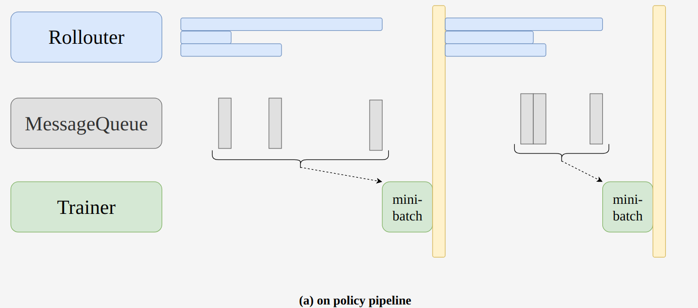

共卡模式。rollout 完成后就会释放卡，然后启动训练。在rollout阶段，如果存在长尾的样本，但是rollout样本数较少时，较短的样本无法填充到空闲的资源中，会造成一定的资源浪费。


假设 sp=1，一次总共 rollout 512\*16=8192 条，8张卡每张卡分 1024 条，每张卡的 optim\_step 数等于 1024/\(32\*16/训练实际卡数\)=16，一次优化 step batch size 是 1024/16=64 条。


# dapo\_7b\_math\_fsdp2\_4\_4\.sh

https://github\.com/volcengine/verl/blob/main/recipe/fully\_async\_policy/README\_zh\.md

采用非共卡, 4:4  async stream pipeline with partial rollout 模式

```Bash
n_gpus_rollout=4
n_gpus_training=4

train_prompt_bsz=0
gen_prompt_bsz=1
n_resp_per_prompt=16
train_prompt_mini_bsz=32 # 这个是所有卡的总和,不是单卡
total_rollout_steps=$(((512*100)))
test_freq=10
staleness_threshold=0.1
trigger_parameter_sync_step=4
require_batches=4
partial_rollout=True

```

上述是 4 卡训练，忽略 require\_batches 和 trigger\_parameter\_sync\_step，表示一次 optim step 需要 32\*16= 512 条样本。然后总共 4 卡，也就是每张卡分到 128 条样本, 这 128 条样本可能分成多次梯度累加计算。


在同步模式下，Rollouter 一次生产`require_batches*ppo_mini_batch_size*trigger_parameter_sync_step` 的samples，Trainer每获取`require_batches*ppo_mini_batch_size` 就进行一次本地训练，训练trigger\_parameter\_sync\_step次后，Trainer和Rollouter之间进行一次参数同步


简单理解：

- `require_batches` 表示一次训练至少要达到的 batch 数，假设是 4，则表示至少要全局达到 4\*32\*16 个样本后才会启动一次训练，并且因为正好是 4 卡训练，也就是说一次训练会 optim step 4 次

- `trigger_parameter_sync_step` 表示启动多少次训练后要进行参数同步，假设是 4 ，则表示启动 4 次训练后进行一次同步，也就是实际上 optim step 16 次后同步一次参数


为了和 test\_dapo\_7b\_math\.sh 对齐，如果是 stream off policy pipeline 场景（**trigger\_parameter\_sync\_step\>1，staleness\_threshold=0**）

- Rollout 总共要全局生成 require\_batches\*ppo\_mini\_batch\_size\*trigger\_parameter\_sync\_step 个样本后才会空闲

- Rollout 每次生成 require\_batches\*ppo\_mini\_batch\_size 样本后就启动一次训练，一次训练会 optim step 4 次

- 一旦启动了 trigger\_parameter\_sync\_step 训练步数后就进行一次参数同步，然后重新开始。

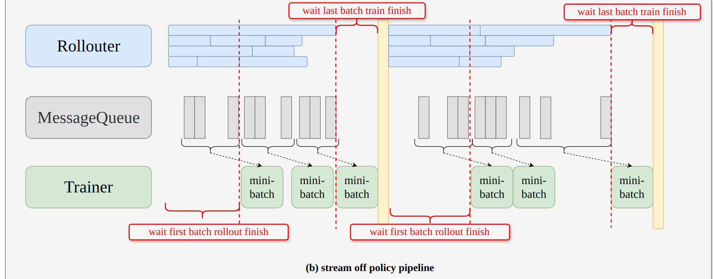

1 相较于上图，由于一次生成的样本更多，资源的空闲会更低。

2 在一次step训练中，会存在两次资源闲置的时间，分别是在第一次获取样本时，train等待`require_batches*ppo_mini_batch_size` 个样本生产，以及最后一次参数更新时，rollout等待训练完成。


上述设置可以和同步超参对齐。同步模式下是总共生成 **512x16=8192 条数据，每张卡分 1024 条，一次 optim step 是 64 条样本，总共 optim step =16\(如果不考虑 sp 的话\)**


在rollout阶段，如果存在长尾的样本，但是rollout样本数较少时，较短的样本无法填充到空闲的资源中，会造成一定的资源浪费。


## stream off policy pipeline

在  stream off policy pipeline 模式下，如果要和共卡完全等价，需要设置 

```Bash
train_prompt_bsz=0
gen_prompt_bsz=1
n_resp_per_prompt=16
train_prompt_mini_bsz=32
total_rollout_steps=$(((512*400)))
test_freq=10
staleness_threshold=0
trigger_parameter_sync_step=16
partial_rollout=False
```

假设是 4:4 训练模式。

- 一次总共会 rollout  512x16=8192 条，每张卡分 8192/4=2048 条

- 但是会等到 1x32x16=512 条样本 rollout 完成就启动一次训练，512 条数据分给 4 张卡，每张卡拿 128 条，优化器 step 等于 128/\(32\*16/训练卡数\)=1，也就是这 128 条数据只优化一次，** batch size =128**，相比于共卡模式，梯度累加次数应该是翻了一倍

- 连续训练完成 trigger\_parameter\_sync\_step 个 512 后进行参数更新


```Bash
n_resp_per_prompt=16
train_prompt_mini_bsz=32
total_rollout_steps=$(((512*100)))
trigger_parameter_sync_step=4
require_batches=4
```

假设是 4:4 训练模式

- 一次总共会 rollout  512x16=8192 条，每张卡分 8192/4=2048 条

- 等到 4x32x16=2048 条样本 rollout 完成就启动一次训练，2048 条数据分给 4 张卡，每张卡拿 512 条，**优化器 step 等于 512/\(32\*16/训练卡数\)=4**，也就是这 128 条数据只优化一次，** batch size =128**，相比于共卡模式，梯度累加次数应该是翻了一倍

- 连续训练完成 trigger\_parameter\_sync\_step 4 个 512 后进行参数更新。**总的 optim step 也是 16**。


在流式训练中，require\_batches 应该设置为1，表示生产够ppo\_mini\_batch\_size样本后，就进行训练。 在实际测试中，我们发现，如果单次下发的样本较少，由于数据分发的顺序，会导致训练不稳定，response 长度变长。 在这里，我们额外提供 require\_batches 进行流式分发，单次参与训练的样本数量控制。


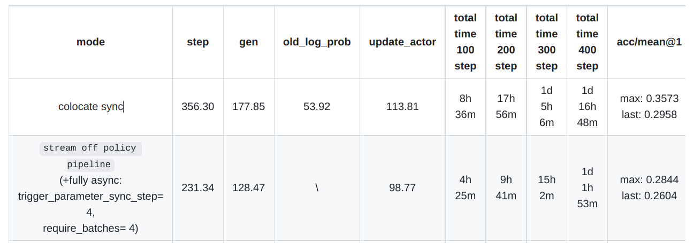

结果如上。**因为在全异步情况下，强制 use\_rollout\_log\_probs，所以少了一个模型的 forward 计算。不太公平。而且这么整后重要性采样也用不了了。**

上述l两个实验原则上是等价的，区别在于启动训练的次数不一样，整体训练速度应该差不多吧。 从上述表格来看 rollout 加速比为 \(177\-128\)/177= 27%。


在一次step训练中，会存在两次资源闲置的时间，分别是在第一次获取样本时，train 等待`require_batches*ppo_mini_batch_size` 个样本生产，以及最后一次参数更新时，rollout等待训练完成。


## async stream pipeline with staleness samples

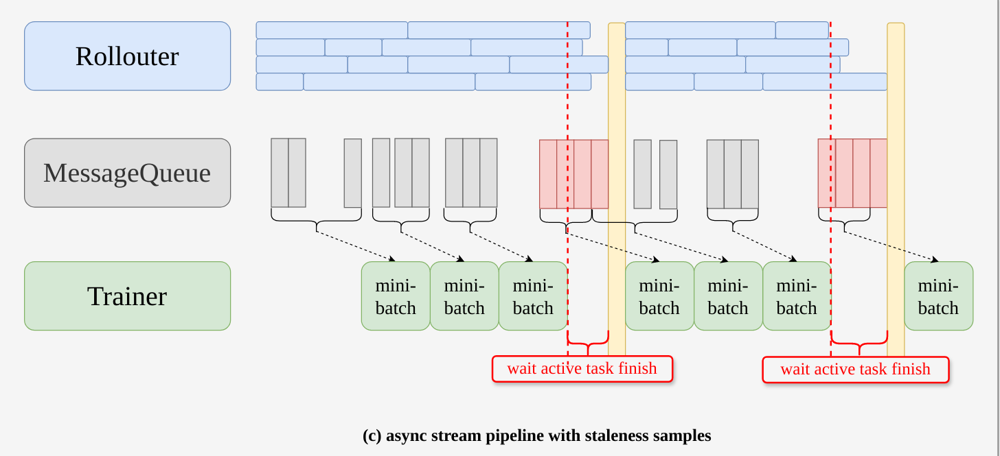

```Bash
train_prompt_bsz=0
gen_prompt_bsz=1
n_resp_per_prompt=16
train_prompt_mini_bsz=32
total_rollout_steps=$(((512*400)))
test_freq=10
staleness_threshold=0.1
trigger_parameter_sync_step=16
partial_rollout=False
```

相比于上一个 case，额外开启了 staleness\_threshold 参数。可以减少第一次获取样本时，train 等待`require_batches*ppo_mini_batch_size` 个样本生产耗时。


rollout\_num = \(1\+staleness\_threshold\)*\(trigger\_parameter\_sync\_step\**require\_batches\*ppo\_mini\_batch\_size\) \- num\_staleness\_sample


- 假设刚开始训练，此时 num\_staleness\_sample 等于 0

- 当前 rollout 数最大是 1\.1 倍样本数，也就是 1\.1 \* 16\* 32 \* 16=9011 条。实际 rollout 数可能小于这个数值

- 训练引擎侧，等到 1x32x16=512 条样本 rollout 完成就启动一次训练，512 条数据分给 4 张卡，每张卡拿 128 条，优化器 step 等于 128/\(32\*16/训练卡数\)=1，也就是这 128 条数据只优化一次，** batch size =128**，相比于共卡模式，梯度累加次数应该是翻了一倍

- 连续训练完成 trigger\_parameter\_sync\_step  个 512 后进行准备进行参数更新。**总的 optim step 也是 16**。

- 因为前面有超发数据，假设 rollout 特别快，在准备进行参数更新时候，所有超发样本都完成了，此时不会给 rollout 下发新数据，必须要等到参数更新完成才开始

- 假设 rollout 比训练慢，在准备进行参数更新时候，还有部分已经下发的任务没有 rollout 完成，此时参数更新不会立即开始，而是将会等待任务完成，同时不会添加新的任务。完成后才进行下一次下发。从这可以看出，如果 rollout 比训练慢，那么超发比例不能太大，否则这一步等待时间会很久。

- 可以看出，num\_staleness\_sample 此时一定等于 0\.1 的比例值= 819 条

- 在下一轮 rollout 中，num\_staleness\_sample \> 1x32x16=512，因此可以将其中的 512 条直接发给训练引擎，不会有wait first batch rollout finish的时间，但是会有wait active task finish的时间。剩下的数据给下一个启动训练的 mini batch，数据一点都不浪费。

Verl 是一次性下发所有任务的。Rollouter有正在生产的任务。这个正在生成的意思应该是已经下发给 vllm 的请求，而不管是否排队中。


作者没有提供这个版本的速度，需要自己跑。

## async stream pipeline with partial rollout

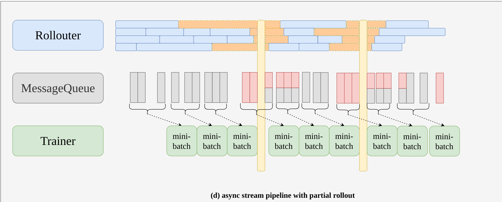

红色表示 staleness sample 全过时样本

一半红一半灰表示 partial sample


也就是文章中的 Fully Async Policy。

```Bash
train_prompt_bsz=0
gen_prompt_bsz=1
n_resp_per_prompt=16
train_prompt_mini_bsz=32
total_rollout_steps=$(((512*400)))
test_freq=10
staleness_threshold=0.1
trigger_parameter_sync_step=16
partial_rollout=True
```

partial\_rollout只会在 staleness\_threshold\>0 时才实际上起作用。partial\_rollout 的含义是可中断的 rollout。


rollout\_num = \(1\+staleness\_threshold\)*\(trigger\_parameter\_sync\_step\**require\_batches\*ppo\_mini\_batch\_size\) \- num\_staleness\_sample


- 假设刚开始训练，此时 num\_staleness\_sample 等于 0

- 当前 rollout 数最大是 1\.1 倍样本数，也就是 1\.1 \* 16\* 32 \* 16=9011 条。实际 rollout 数可能小于这个数值

- 训练引擎侧，等到 1x32x16=512 条样本 rollout 完成就启动一次训练，512 条数据分给 4 张卡，每张卡拿 128 条，优化器 step 等于 128/\(32\*16/训练卡数\)=1，也就是这 128 条数据只优化一次，** batch size =128**，相比于共卡模式，梯度累加次数应该是翻了一倍

- 连续训练完成 trigger\_parameter\_sync\_step  个 512 后立即进行参数更新。**总的 optim step 也是 16**。

- 因为前面有超发数据，假设 rollout 特别快，在进行参数更新时候，所有超发样本都完成了，此时不会给 rollout 下发新数据\(应该是这样吧\)，必须要等到参数更新完成才开始。这种情况下和 上一种情况效率没有任何区别。

- 假设 rollout 比训练慢，在进行参数更新时候，还有部分已经下发的任务没有 rollout 完成，此时打断这些进行中的样本，直接进行参数同步，被中断的 sample 会在参数同步后继续生成。减少了 wait active task finish 的时间。

- 这种模式下任务是如何下发的？是先超发，被打断，参数同步后，再次下发 rollout\_num 个样本，始终保持不会超发特别多。


作者强调，当 staleness\_threshold\>0 时候， Rollouter两次参数更新之间将会最多生成的样本数为： $$rollout\_num = \(1\+staleness\_threshold\)*\(trigger\_parameter\_sync\_step*require\_batches\*ppo\_mini\_batch\_size\) \- num\_staleness\_sample $$。也就是说如果 rollout 特别快，那么也不会额外下发数据的，此时异步作用就不大了，实际上很难出现这种情况。大概率是 rollout 慢于训练，此时再参数更新时候有部分样本没有 rollout 完成，此时会打断样本生成，等参数更新后重新继续 rollout。优先将上一轮的继续 rollout 可以避免过时太严重。假设有 n 条特别慢，可能会出现跨越多个版本的，因为他这个异步没有版本控制。


被打断的样本也算 num\_staleness\_sample 吗？ 应该算。从而确保下一次发送的数据会少一些。


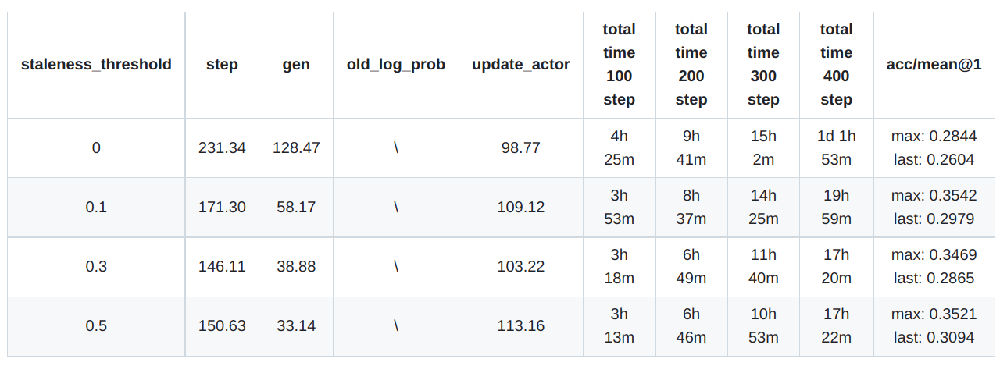

staleness 越大，最终取得的收益越明显，因为在下一次 rollout 中所需要生成的样本变少了，从 fully\_async/count/staleness\_samples 可以看出，官方 log 中打印的值没有乘以 repeat\_k，假设是 381\.5，那么之前每隔 128 就开始训练，381\.5 已经够 3 个 batch 后，因此这个时间段内的 gen 时间实际上zhi包括了 512\-381=131 条数据，生成时间肯定短了。


当rollout 足够快时，staleness\_threshold设置为1，基本上等价于 one\_step\_off policy。 为了避免过期样本太多影响训练精度，建议该值设置小于1。


## 关键指标

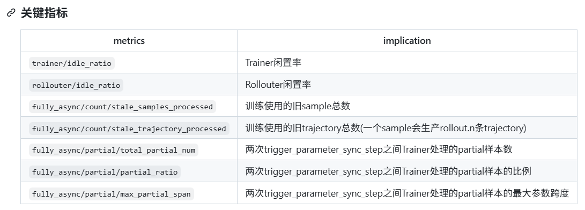

### rollouter/idle\_ratio 

在某一次参数同步后立即记录为 version\_start\_time = time\.time\(\)，在生成一段时间后触发了暂停生成，记为 idle\_start\_time=time\.time\(\)，两者相减为 rollout\_active\_time。暂停后要进行参数同步，同步后重新记录 rollout\_version\_time = time\.time\(\) \- version\_start\_time。

此时 idle\_ratio = 1 \- rollout\_active\_time / rollout\_version\_time。表示是暂停生成到参数更新完毕后的这段时间即为 rollout 空闲时间。

注意，这个空闲感觉偏小，因为当触发暂停后，在非 partial 场景下还要等已经下发的任务完成，要等到这个完成才开始算  idle\_start\_time，也就是只要有一条样本在跑就不算空闲。


## 实验 log 分析

这个实验其实没有发挥 partial rollout 效果。因为他这个实验设置是 rollout 远远快于 train，导致 partial rollout 没有生效。

```Bash
fully_async/partial/total_partial_num:0.0 - fully_async/partial/partial_ratio:0.0
```

在这种情况下加速比是恒定的。


- 第一次 rollout 应该发送 1\.1\*4\*32\*4=563 条，最大并发请求数是 64 条，此处不考虑 repeat 16 这个数。

- 一旦请求达到 128 就会启动训练，因为 rollout 太快了，在 0 1 2 次训练中就已经 563 条生成好了。此时 rollout 会触发暂停，然后处于空闲状态

- 在训练完成 512 条数据后\(此时有 563\-512=51 条过时样本没有被训练\)，进行参数同步，然后 rollout 恢复，此时会重新计算这一轮应该发送多少数据： 563\-51=512 条。然后立即启动 rollout

- 在启动第一个 128 训练前，过时样本只有 51 条，还需要等 rollout 生成 77 条才够训练。

- 由于 rollout 比较快，因此在这一轮考虑和训练的重叠时间，实际上只需要生成 77 条，所以这一轮开始生成时间会非常短。

- 后续都是重复上述流程。


## 参数同步

他这个参数同步特别快。7b 模型只需要 0\.2s，而我们同步代码需要 12s。

docs/advance/one\_step\_off\.md

> **sync\_rollout\_weights**：The time for synchronizing parameters from actor to rollout is extremely fast and can almost be ignored because it is implemented with nccl\.
> 
> 

```Python
# drive process call the actor and rollout respectively to sync parameters by nccl
def sync_rollout_weights(self):
   self.actor_wg.sync_rollout_weights()
   ray.get(self.rollout_wg.sync_rollout_weights())


# fsdp model parameter sync
@register(dispatch_mode=Dispatch.ONE_TO_ALL, blocking=False)
def sync_rollout_weights(self):
   params = self._get_actor_params() if self._is_actor else None
   if self._is_rollout:
      inference_model = (
         self.rollout.inference_engine.llm_engine.model_executor.driver_worker.worker.model_runner.model
      )
      from verl.utils.vllm.patch import patch_vllm_moe_model_weight_loader
      patch_vllm_moe_model_weight_loader(inference_model)
   # Model parameters are broadcast tensor-by-tensor from actor to rollout
   for key, shape, dtype in self._weights_info:
      tensor = torch.empty(shape, dtype=dtype, device=get_torch_device().current_device())
      if self._is_actor:
         assert key in params
         origin_data = params[key]
         if hasattr(origin_data, "full_tensor"):
            origin_data = origin_data.full_tensor()
         if torch.distributed.get_rank() == 0:
            tensor.copy_(origin_data)
      from ray.util.collective import collective

      collective.broadcast(tensor, src_rank=0, group_name="actor_rollout")
      if self._is_rollout:
         inference_model.load_weights([(key, tensor)])
```
```

核心逻辑在于，他没有走 server 发送请求，只需要建立通信组，然后从 train worker0 通过 nccl 广播发送给所有 rollout worker 就可以了，没有其余开销。没有 http 请求，没有 ipc 发送，也没有序列化和反序列化开销。但是他这个实现有点类似 hardcode，直接访问了 inference model，侵入性比较大，不够优雅。

# Verl 0\.7

## FusedLinearForPPOFunction

https://github\.com/volcengine/verl/pull/1212

```Python
class FusedLinearForPPOFunction(torch.autograd.Function):
    @staticmethod
    def forward(
        ctx,
        hidden_states: torch.FloatTensor,
        vocab_weights: torch.FloatTensor,
        input_ids: torch.LongTensor,
        temperature: float = 1.0,
        chunk_size: int = 512,
    ) -> tuple[torch.FloatTensor, torch.FloatTensor]:
**        # 显存优化，这个代码会返回2个 tensor**
**        # 默认值是 True, 意思是如果两个返回的 tensor 后续有一个没有参与实际梯度计算，那么也是返回全 0**
**        # 设置为 false 后，如果没有梯度，那就返回的就是 none，我们在 backward 时候可以跳过一些计算**
**        # 更省显存**
        ctx.set_materialize_grads(False)

        # Cast to a 2D tensor of the shape [T, D] for ease of working
        orig_ndim = hidden_states.ndim
        assert orig_ndim in (2, 3), f"Invalid hidden_states shape, received {hidden_states.shape}"

        orig_batch_size = -1
        if orig_ndim == 3:
            assert input_ids.ndim == 2, f"input_ids shape doesn't match, {hidden_states.shape} {input_ids.shape}"
            orig_batch_size = hidden_states.shape[0]
            hidden_states = hidden_states.flatten(0, 1)
            input_ids = input_ids.flatten(0, 1)

        T = hidden_states.shape[0]

        # Allocate memory for outputs
        output_requires_grad = hidden_states.requires_grad or vocab_weights.requires_grad
        log_probs = hidden_states.new_zeros(T, requires_grad=output_requires_grad)
        entropy = hidden_states.new_zeros(T, requires_grad=output_requires_grad)

        # Perform forward one chunk at a time
        for chunk_start in range(0, T, chunk_size):
            chunk_end = min(chunk_start + chunk_size, T)

            chunk_log_probs, chunk_entropy = _fused_linear_for_ppo_fwd(
                hidden_states=hidden_states[chunk_start:chunk_end],
                vocab_weights=vocab_weights,
                input_ids=input_ids[chunk_start:chunk_end],
                temperature=temperature,
            )
            log_probs[chunk_start:chunk_end] = chunk_log_probs
            entropy[chunk_start:chunk_end] = chunk_entropy

        # Cast the output back to the original input dimension
        if orig_ndim == 3:
            log_probs = log_probs.view(orig_batch_size, -1)
            entropy = entropy.view(orig_batch_size, -1)

        ctx.save_for_backward(hidden_states, vocab_weights, input_ids)
        ctx.orig_batch_size = orig_batch_size
        ctx.orig_ndim = orig_ndim
        ctx.temperature = temperature
        ctx.chunk_size = chunk_size

        return log_probs, entropy

    @staticmethod
    def backward(ctx, dlog_probs: Optional[torch.FloatTensor], dentropy: Optional[torch.FloatTensor]):
        assert dlog_probs is not None or dentropy is not None

        hidden_states, vocab_weights, input_ids = ctx.saved_tensors
        orig_batch_size = ctx.orig_batch_size
        orig_ndim = ctx.orig_ndim
        temperature = ctx.temperature
        chunk_size = ctx.chunk_size

        # Here orig_ndim refers to the orig_ndim of hidden_states
        if orig_ndim == 3:
            if dlog_probs is not None:
                dlog_probs = dlog_probs.flatten()
            if dentropy is not None:
                dentropy = dentropy.flatten()

        T = hidden_states.shape[0]

        # Allocate memory for outputs
        dhidden_states = None
        if hidden_states.requires_grad:
            dhidden_states = torch.zeros_like(hidden_states)
        dvocab_weights = None
        if vocab_weights.requires_grad:
            dvocab_weights = torch.zeros_like(vocab_weights)

        # Perform backward one chunk at a time
        for chunk_start in range(0, T, chunk_size):
            chunk_end = min(chunk_start + chunk_size, T)
            chunk_dlog_probs = None
            if dlog_probs is not None:
                chunk_dlog_probs = dlog_probs[chunk_start:chunk_end]
            chunk_dentropy = None
            if dentropy is not None:
                chunk_dentropy = dentropy[chunk_start:chunk_end]

            h, v = _fused_linear_for_ppo_bwd(
                dlog_probs=chunk_dlog_probs,
                dentropy=chunk_dentropy,
                hidden_states=hidden_states[chunk_start:chunk_end],
                vocab_weights=vocab_weights,
                input_ids=input_ids[chunk_start:chunk_end],
                temperature=temperature,
            )

            if hidden_states.requires_grad:
                dhidden_states[chunk_start:chunk_end] += h
            if vocab_weights.requires_grad:
                dvocab_weights += v

        # Cast the output back to the original input dimension
        if orig_ndim == 3 and hidden_states.requires_grad:
            hidden_size = hidden_states.shape[-1]
            dhidden_states = dhidden_states.view(orig_batch_size, -1, hidden_size)

        return (
            dhidden_states,  # hidden_states
            dvocab_weights,  # vocab_weights
            None,  # input_ids
            None,  # temperature
            None,  # chunk_size
        )

def _fused_linear_for_ppo_fwd(
    hidden_states: torch.FloatTensor,
    vocab_weights: torch.FloatTensor,
    input_ids: torch.LongTensor,
    temperature: float = 1.0,
) -> tuple[torch.FloatTensor, torch.FloatTensor]:
    logits = (hidden_states @ vocab_weights.t()) / temperature
    orig_dtype = logits.dtype
    logits = logits.to(torch.float32)

    # Slower but more numerically stable to do log_softmax than probs.log()
    probs = logits.softmax(dim=-1)
    log_probs = logits.log_softmax(dim=-1)

    token_log_probs = log_probs.gather(-1, input_ids.unsqueeze(-1)).squeeze(-1)
    entropy = torch.logsumexp(logits, dim=-1) - torch.sum(probs * logits, dim=-1)

    return token_log_probs.to(orig_dtype), entropy.to(orig_dtype)
  
 
def _fused_linear_for_ppo_bwd(
    dlog_probs: Optional[torch.FloatTensor],
    dentropy: Optional[torch.FloatTensor],
    hidden_states: torch.FloatTensor,
    vocab_weights: torch.FloatTensor,
    input_ids: torch.LongTensor,
    temperature: float = 1.0,
) -> tuple[torch.FloatTensor, torch.FloatTensor]:
    logits = (hidden_states @ vocab_weights.t()) / temperature
    orig_dtype = logits.dtype
    logits = logits.to(torch.float32)

    probs = logits.softmax(dim=-1)

    dlogits = 0

    # Gradient from log_probs
    if dlog_probs is not None:
        one_hot_input = torch.zeros_like(logits).scatter_(-1, input_ids.unsqueeze(-1), 1)
        dlogits += dlog_probs.to(torch.float32).unsqueeze(-1) * (one_hot_input - probs)

    # Gradient from entropy
    if dentropy is not None:
        log_probs = logits.log_softmax(dim=-1)
        entropy = torch.logsumexp(logits, dim=-1) - torch.sum(probs * logits, dim=-1)
        dlogits += probs * (log_probs + entropy.unsqueeze(-1)) * (-dentropy.unsqueeze(-1))

    dlogits = dlogits.to(orig_dtype) / temperature

    dhidden_states = dlogits @ vocab_weights
    dvocab_weights = dlogits.t() @ hidden_states

    return dhidden_states, dvocab_weights        
```

## tiled\_mlp\.py

https://github\.com/volcengine/verl/pull/4649

对 mlp 层采用类似 liger\-kernel 中的 chunk seqlen 方式来减少峰值显存。


**用计算换内存**（类似于 Gradient Checkpointing），将大的输入切分成小块（Tiles/Shards）串行处理，从而降低显存峰值。同时，它通过自定义的 `GradientAccumulator` 处理了分块计算时的**权重梯度累加**问题。

```Python
class GradientAccumulator:
    *"""Gradient accumulator for TiledMLP (FSDP compatible).*

*    This class manages gradient accumulation across multiple shards during*
*    the backward pass of TiledMLP. It ensures correct gradient computation*
*    when processing input in chunks.*
*    """*
     
    # 假设某个 mlp层包括 3 个线性层，那么 params 这个长度就是 3
*    *def __init__(self, params: list[torch.nn.Parameter], total_shards: int, dtype: torch.dtype = None):
        self.params = params
        self.total_shards = total_shards
        self.grad_accumulation_dtype = dtype or torch.float32
        self.accumulated_grads = {}
        self.hooks = []
        self.lock = threading.Lock()

        for param in self.params:
            if param.grad is not None:
                self.accumulated_grads[param] = param.grad.to(self.grad_accumulation_dtype)
                param.grad = None
            else:
                self.accumulated_grads[param] = torch.zeros_like(param, dtype=self.grad_accumulation_dtype)

    def install_hooks(self, is_last_shard: bool):
        *"""Install gradient hooks for the current shard."""*
*        *self._remove_hooks()

        def create_hook(param):
            def hook(grad):
                with self.lock:
                    grad_to_accum_dtype = grad.to(self.grad_accumulation_dtype)
                    # 触发了某个参数的梯度计算，则只更新这个参数
                    self.accumulated_grads[param] += grad_to_accum_dtype
                    
                    **# 最后一次才返回最终的 grad，否则外面会自动累加**
                    if is_last_shard:
                        param.grad = None  # Critical: prevent double accumulation
                        final_grad = self.accumulated_grads[param].to(param.dtype)
                        return final_grad
                    return None

            return hook

        for param in self.params:
            if param.requires_grad:
                # 每一次参数的 backward 触发了都会调用一次
                # 每次 chunk 的序列 x 计算 forward 后 backward 都会触发一次
                hook = param.register_hook(create_hook(param)) # backward hook，返回是梯度
                self.hooks.append(hook)

    def _remove_hooks(self):
        *"""Remove all registered hooks."""*
*        *for hook in self.hooks:
            hook.remove()
        self.hooks.clear()

    def cleanup(self):
        *"""Cleanup hooks and resources."""*
*        *self._remove_hooks()
```


```Python
class TiledMLP(torch.autograd.Function):
    *"""TiledMLP implementation for memory-efficient MLP computation.*

*    This autograd function processes MLP forward/backward in tiles (chunks)*
*    to reduce peak memory usage. Compatible with FSDP2.*
*    """*
    
    # fn 就是 mlp 的 forward 函数，module 是类实例，x 是输入序列，shards 表示切分多少短
    # compute_params 是 mlp 层的总训练参数列表
*    *@staticmethod
    def forward(ctx, fn, module, x, shards, compute_params):
        ctx.fn = fn
        ctx.module = module
        ctx.shards = shards
        ctx.compute_params = [p for p in compute_params if p.requires_grad]
        ctx.save_for_backward(x)

        # Split on dim=-2 (seqlen dimension) following Liger Kernel style
        x_shards = list(torch.chunk(x, chunks=shards, dim=-2))
        with torch.no_grad():
            output_shards = [fn(module, x_shard) for x_shard in x_shards]
        output_unsharded = torch.cat(output_shards, dim=-2)
        return output_unsharded

    @staticmethod
    def backward(ctx, *grads):
        fn = ctx.fn
        (x,) = ctx.saved_tensors
        module = ctx.module
        shards = ctx.shards
        compute_params = ctx.compute_params
        
        # 下面要基于子图重新 backward，因此需要先断图，否则应该会报错
        # 构建一个新的、局部的、临时的计算图，以便手动计算出输入 x 的梯度
        x_requires_grad = x.requires_grad
        x = x.detach()
        x.requires_grad_(x_requires_grad)

        # Flatten to [bs*seqlen, hidden_size]
        hidden_size = x.shape[-1]
        x_shape_orig = x.shape
        x = x.view(-1, hidden_size)
        incoming_grad = grads[0].view(-1, hidden_size)

        # Pre-allocate input gradient
        x_grad = torch.zeros_like(x)

        # Split on dim=0
        x_shards = list(torch.chunk(x, chunks=shards, dim=0))
        
        # 参数本身梯度会在这个类中处理，所以不需要返回参数梯度
        grad_accumulator = GradientAccumulator(compute_params, shards, dtype=x.dtype)

        for i, x_shard in enumerate(x_shards):
            # 可以这么跑
            x_shard.requires_grad_(x_requires_grad)

            shard_step = x_shards[i].shape[0]
            shard_offset = i * x_shards[0].shape[0]

            # narrow(0, ...) creates a contiguous view that can receive gradients
            # 省去了最后 concat 的过程
            x_shard.grad = x_grad.narrow(0, shard_offset, shard_step)
            incoming_grad_shard = incoming_grad.narrow(0, shard_offset, shard_step)

            is_last_shard = i + 1 == shards
            grad_accumulator.install_hooks(is_last_shard)

            with torch.enable_grad():
                output = fn(module, x_shard)
            torch.autograd.backward(output, incoming_grad_shard) # 重算

        grad_accumulator.cleanup()
        del grad_accumulator

        # Restore original shape
        x_grad = x_grad.view(x_shape_orig) if x_requires_grad else None
        return (None, None, x_grad, None, None)
```

## Refactor RLHFDataset for multi\-modal data

https://github\.com/volcengine/verl/pull/4759

XTuner 这种单控制器读取所有图片或者视频，然后发给各个 worker 的做法会存在瓶颈。虽然通过 ray\.put 减轻了，但是中心控制器的根本问题没有解决。

假设 dataset item 一次返回一张 1000x1000x3x4 字节的图片，一次 forward 需要 8192 张图片，那么这个 ray\.put 就会占 92G，已经非常大了，如果是 video RL 那就更多了。


Verl 修改了这个逻辑。

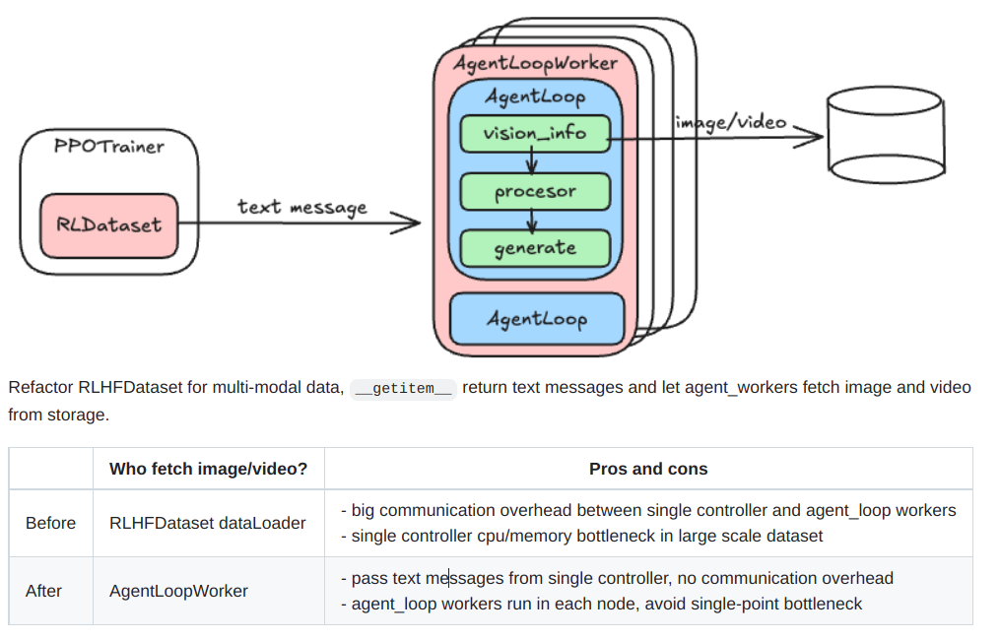

Dataloader 只输出 text message，在真正用的时候再每个 worker 读图和处理图。

```Python
@classmethod
async def process_vision_info(
    cls,
    messages: list[dict],
    image_patch_size,
    config: DictConfig,
) -> tuple[list[Image.Image], list[tuple[torch.Tensor, dict]]]:
    *"""Extract images and videos from messages.*

*    **This method is called by AgentLoop** (e.g SingleTurnAgentLoop) before apply_chat_template to*
*    the `raw_prompt` from dataset. User may customize RLHFDataset and override this method to*
*    support custom vision extraction.*
*    """*
*    *from qwen_vl_utils import process_vision_info

    images, videos = process_vision_info(messages, image_patch_size=image_patch_size, return_video_metadata=True)
    return images, videos
```

## AsyncDoubleBufferGroupOffloadHandler

Activation offload

## TransferQueue

https://zhuanlan\.zhihu\.com/p/1930244241625449814


定义 n 个存储单元，每个存储单元分布在不同节点。然后由中心控制器也可以初始化几个控制器统一管理，对外接口简单。

通过 batch\_meta=client\.put\(data\_proto\) 实现，也可以只更新部分字段，返回 meta，然后将 meta 在各个 actor 之间传递信息。需要获取真正数据时候 client\.get\(batch\_meta\) 即可拿到。


目前实现的还是比较简单，可能性能上相比于 ray 没有很大优势。


## checkpoint\-engine

https://github\.com/verl\-project/verl/pull/5031

好像还没有支持 kimi 的 checkpoint\-engine


## Reward Loop

https://verl\.readthedocs\.io/en/latest/advance/reward\_loop\.html\#reward\-loop

**VERL 通过暴力定制化 reward 接口，然后让用户传入自定义函数，比较好支持各种场景下的 reward 计算和混合打分问题。**


Reward Loop supports multiple execution modes for reward training:

- **Colocate Mode**: The reward model shares the same resource pool as the actor/rollout/reference models\. In this setup, all rollouts must complete first, after which the reward model is awakened to perform inference\.

- **Standalone Mode**: The reward model runs on a separate resource pool, independent from the actor/rollout/reference models\. In this setup, each sample is evaluated by the reward model immediately after its rollout finishes\.

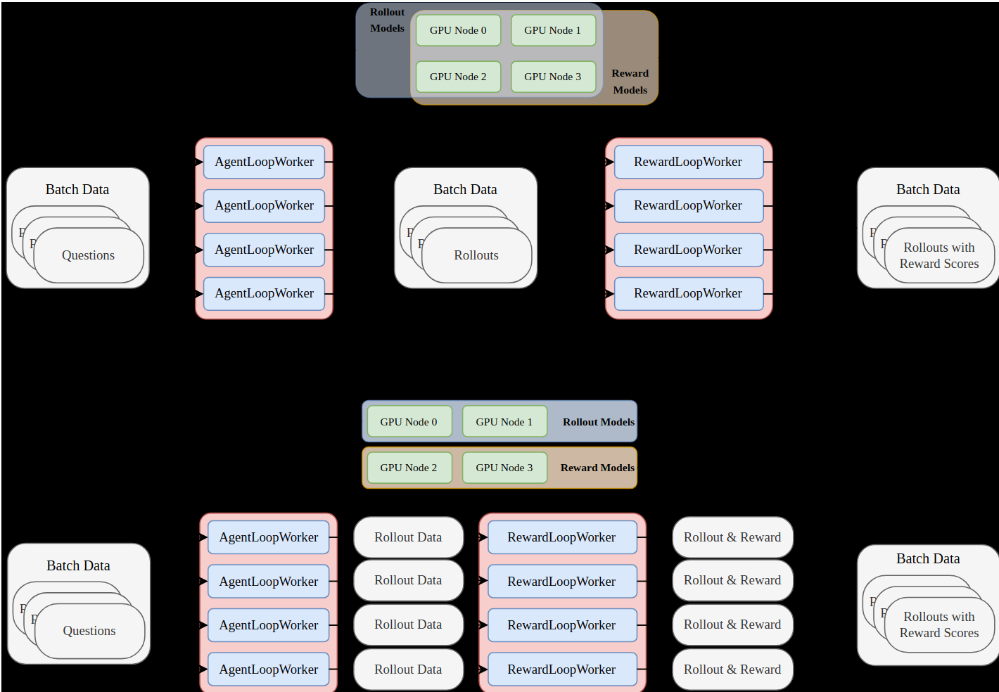

### **Standalone Mode**

In **standalone mode**, we directly launch one `RewardLoopWorker` for each `AgentLoopWorker` to handle reward computation independently\.


走节点亲和性调度。

```Python
# AgentLoopWorkerBase
use_reward_loop = True if self.config.reward_model.use_reward_loop else None
self.use_reward_loop = use_reward_loop
if use_reward_loop and not hasattr(self, "reward_loop_worker"):
    self.reward_loop_worker = RewardLoopWorker.options(
        scheduling_strategy=ray.util.scheduling_strategies.NodeAffinitySchedulingStrategy(
            node_id=ray.get_runtime_context().get_node_id(),
            soft=False,
        ),
    ).remote(self.config, self.reward_router_address)
```

**在该模式下，每个 agentloopworker 都会创建一个 rewardloopwoker，而每个 rewardloopwoker 内部会创建一个 rewardmanager，可以是 DAPORewardManager、RateLimitedRewardManager、 RemoteRewardManager 和用户自定义的等等。**

**DAPORewardManager 内部会调用真正的计算 reward 函数。对于 RemoteRewardManager 比较特殊，内部还可以创建 n 个 ray actor worker 来提高并发量。**


这种模式应该是大部分场景使用的模式。

### **Colocate Mode**

In **colocate mode**, we launch a `RewardLoopManager` to

1. launch reward model if enabled

2. manage multiple `RewardLoopWorker` instances to parallelize reward computation\.

Users can specify the number of workers by setting `reward_model.num_workers` in colocate mode\.


先启动一个中心控制器 `RewardLoopManager`

```Python
class RewardLoopManager:
    def _init_reward_loop_workers(self):
        self.reward_loop_workers = []
        num_workers = self.config.reward_model.num_workers # 默认值是和训练 worker 数一样多
        node_ids = [node["NodeID"] for node in ray.nodes() if node["Alive"] and node["Resources"].get("CPU", 0) > 0]
    
        for i in range(num_workers):
            # Round-robin scheduling over the all nodes
            node_id = node_ids[i % len(node_ids)]
            self.reward_loop_workers.append(
                RewardLoopWorker.options(
                    name=f"reward_loop_worker_{i}",
                    scheduling_strategy=ray.util.scheduling_strategies.NodeAffinitySchedulingStrategy(
                        node_id=node_id,
                        soft=True,
                    ),
                ).remote(self.config, self.reward_router_address)
            )
```

## AgentLoop

https://verl\.readthedocs\.io/en/latest/start/agentic\_rl\.html\#system\-components

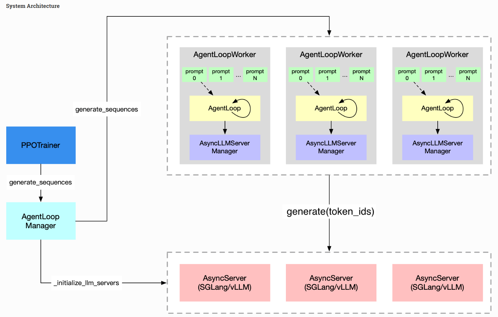

### AgentLoopManager

这个是最外层的 rollout 中心控制器。

```Python
class AgentLoopManager:
   def init():
       self._initialize_llm_servers()
       self._init_agent_loop_workers()
```

\_initialize\_llm\_servers 就是创建 n 个 servers。例如 SGLangReplica 和 VllmReplica。 一个 Replica 代表一个完整实例，例如一共 8 张卡， tp2，那么一共有 4 个 SGLangReplica，每个 SGLangReplica 内部会再启动 2 个 tp worker。

\_init\_agent\_loop\_workers 就是创建 m 个 loop worker。

作者这么设计，应该是为了方便配置不同的 n 和 m 值。两个对象完全独立。并没有说 n 一定等于 m，在共卡模式下，正常应该就是相同的，但是也可以配置为不同。


在每个 loop worker 都有一个配套的 AsyncLLMServerManager，如上图所示他是有 3 个独立的，但是注意：这三个独立的 AsyncLLMServerManager 都是管理所有的 SGLangReplica。这样才能实现 n 和 m 不一样的要求。


AsyncLLMServerManager 拿到了所有的 llm server 实例，因此选中某个实例后，可以直接调用 server\.generate 来生成响应。


最外层接口，一次生成过程仅调用一次

```Python
def generate_sequences(self, prompts: DataProto) -> DataProto:
    *"""Split input batch and dispatch to agent loop workers.*

*    Args:*
*        prompts (DataProto): Input batch.*

*    Returns:*
*        DataProto: Output batch.*
*    """*

*    *# Fix for Issue #4147: Always call wake_up() to ensure weight sync
    # The wake_up()/sleep() methods internally check free_cache_engine
    self.wake_up()
    if self.reward_model_manager:
        self.reward_model_manager.wake_up()

    chunkes = prompts.chunk(len(self.agent_loop_workers))
**    outputs = ray.get(**
**        [**
**            worker.generate_sequences.remote(chunk)**
**            for worker, chunk in zip(self.agent_loop_workers, chunkes, strict=True)**
**        ]**
**    )**
    output = DataProto.concat(outputs)
    # Fix for Issue #4147: Always call sleep() to ensure proper cleanup
    self.sleep()
    if self.reward_model_manager:
        self.reward_model_manager.sleep()

    # calculate performance metrics
    metrics = [output.meta_info.pop("metrics") for output in outputs]  # List[List[Dict[str, str]]]
    timing = self._performance_metrics(metrics, output)

    output.meta_info = {"timing": timing, **outputs[0].meta_info}
    return output
```

### FullyAsyncAgentLoopManager

配合 FullyAsyncAgentLoopWorker、FullyAsyncLLMServerManager、PartialSingleTurnAgentLoop 和 AsyncPartialToolAgentLoop 一起使用，实现全异步 RL。

```Python
class FullyAsyncAgentLoopManager(AgentLoopManager):
   async def generate_single_sample_async(
    self,
    sample: DataProto,
    partial_output_list: Optional[list[AgentLoopOutput]],
) -> tuple[list[AgentLoopOutput], bool] | tuple[DataProto, bool]:
*    *worker = self._select_best_worker()
    output_future = worker.generate_sequences_no_post.remote(sample, partial_output_list)
    return await asyncio.wrap_future(output_future.future()) 
    
   async def cancel(self):
        worker_cancel_tasks = [worker.cancel_agent_loops.remote() for worker in self.agent_loop_workers]
        rollout_cancel_tasks = [replica.cancel() for replica in self.rollout_replicas]
        await asyncio.gather(*rollout_cancel_tasks, *worker_cancel_tasks)

   async def resume(self):
        rollout_resume_tasks = [replica.resume() for replica in self.rollout_replicas]
        worker_resume_tasks = [worker.resume_agent_loops.remote() for worker in self.agent_loop_workers]
        await asyncio.gather(*rollout_resume_tasks, *worker_resume_tasks)

   async def wake_up(self):
        await asyncio.gather(*[replica.wake_up() for replica in self.rollout_replicas])

   async def sleep(self):
        await asyncio.gather(*[replica.sleep() for replica in self.rollout_replicas])
```

为了方便中断，新增了一些接口，同时对 loopworker 和 rollout server 进行操作。

```Python
async def generate_single_sample_async(
    self,
    sample: DataProto,
    partial_output_list: Optional[list[AgentLoopOutput]],
) -> tuple[list[AgentLoopOutput], bool] | tuple[DataProto, bool]:
    *"""*
*    Asynchronously process a single sample*

*    Args:*
*        sample: Single sample data*
*        partial_output_list: Optional[List[AgentLoopOutput]]: already rollout result.*

*    Returns:*
*        list[AgentLoopOutput]: Processing results*
*    """*
*    *worker = self._select_best_worker()
    output_future = worker.generate_sequences_no_post.remote(sample, partial_output_list)
    return await asyncio.wrap_future(output_future.future())
```

和 AgentLoopManager 一个最大不同是，为了好管理，这个 manager 只暴露了生成单条样本的接口，由外面再去控制整个 rollout 过程，这样 partial 更好处理。

### AgentLoopWorker

这个是 loop worker。里面初始化了 1 个 server\_manager 以及  1 个 RewardLoopWorker


对于一批 prompt，内部逻辑为：

```Python
async def generate_sequences(self, batch: DataProto) -> DataProto:
*    *config = self.config.actor_rollout_ref.rollout
    sampling_params = dict(
        temperature=config.temperature,
        top_p=config.top_p,
        repetition_penalty=1.0,
        logprobs=config.calculate_log_probs,
    )

    # override sampling params for validation
    if batch.meta_info.get("validate", False):
        sampling_params["top_p"] = config.val_kwargs.top_p
        sampling_params["temperature"] = config.val_kwargs.temperature

    tasks = []
    for i in range(len(batch)):
        kwargs = {k: v[i] for k, v in batch.non_tensor_batch.items()}
        tasks.append(
            asyncio.create_task(
                self._run_agent_loop(sampling_params, trajectory_info[i], trace=trace_this_sample, **kwargs)
            )
        )
    outputs = await asyncio.gather(*tasks)
    
   # 将所有 prompt 处理成一个大 batch
    output = self._postprocess(outputs)

    return output
```

后处理就是把所有内容都 concat 组成 batch，后续处理更高效。为了能够组成 batch，需要所有 tensor 都是一样长，因此在 \_run\_agent\_loop 中模型生成后都需要额外 pad，这个设计可能不能很好，后续会改。

```Python
def _postprocess(self, inputs: list[_InternalAgentLoopOutput]) -> DataProto:
    *"""Process the padded outputs from _run_agent_loop and combine them into a batch."""*
*    *# Convert lists back to tensors and stack them to create a batch.
    prompt_ids = torch.cat([input.prompt_ids for input in inputs], dim=0)
    response_ids = torch.cat([input.response_ids for input in inputs], dim=0)
    response_mask = torch.cat([input.response_mask for input in inputs], dim=0)
    attention_mask = torch.cat([input.attention_mask for input in inputs], dim=0)
    input_ids = torch.cat([input.input_ids for input in inputs], dim=0)
    position_ids = torch.cat([input.position_ids for input in inputs], dim=0)
    optional_outputs = {}
    if inputs[0].response_logprobs is not None:
        optional_outputs["rollout_log_probs"] = torch.cat([input.response_logprobs for input in inputs], dim=0)
    if inputs[0].routed_experts is not None:
        optional_outputs["routed_experts"] = torch.cat([input.routed_experts for input in inputs], dim=0)

    batch = TensorDict(
        {
            "prompts": prompt_ids,  # [bsz, prompt_length]
            "responses": response_ids,  # [bsz, response_length]
            "response_mask": response_mask,  # [bsz, response_length]
            "input_ids": input_ids,  # [bsz, prompt_length + response_length]
            "attention_mask": attention_mask,  # [bsz, prompt_length + response_length]
            # position_ids: [bsz, 3, prompt_length + response_length] or [bsz, prompt_length + response_length]
            "position_ids": position_ids,
            **optional_outputs,
        },
        batch_size=len(inputs),
    )

    scores = [input.reward_score for input in inputs]
    if all(score is not None for score in scores):
        prompt_length = prompt_ids.size(1)
        response_length = attention_mask[:, prompt_length:].sum(dim=1) - 1
        rm_scores = torch.zeros_like(response_mask, dtype=torch.float32)
        rm_scores[torch.arange(response_mask.size(0)), response_length] = torch.tensor(scores, dtype=torch.float32)
        batch["rm_scores"] = rm_scores

    non_tensor_batch = {
        "__num_turns__": np.array([input.num_turns for input in inputs], dtype=np.int32),
    }

    # add reward_extra_info to non_tensor_batch
    reward_extra_infos = [input.extra_fields.get("reward_extra_info", {}) for input in inputs]
    reward_extra_keys = list(reward_extra_infos[0].keys())
    for key in reward_extra_keys:
        non_tensor_batch[key] = np.array([info[key] for info in reward_extra_infos])

    # Add multi_modal_inputs to non_tensor_batch if any samples have them
    multi_modal_inputs_list = [input.multi_modal_inputs for input in inputs]
    if any(mmi is not None for mmi in multi_modal_inputs_list):
        non_tensor_batch["multi_modal_inputs"] = np.array(multi_modal_inputs_list, dtype=object)

    metrics = [input.metrics.model_dump() for input in inputs]
    # Collect extra fields from all inputs and convert them to np.ndarray
    extra_fields = {}
    all_keys = set(key for input_item in inputs for key in input_item.extra_fields)
    for key in all_keys:
        temp_arr = np.empty(len(inputs), dtype=object)
        temp_arr[:] = [input.extra_fields.get(key) for input in inputs]
        extra_fields[key] = temp_arr

    non_tensor_batch.update(extra_fields)
    return DataProto(
        batch=batch,
        non_tensor_batch=non_tensor_batch,
        meta_info={"metrics": metrics, "reward_extra_keys": reward_extra_keys},
    )
```

单条样本运行过程：

```Python
async def _run_agent_loop(
    self,
    sampling_params: dict[str, Any],
    trajectory: dict[str, Any],
    *,
    agent_name: str,
    trace: bool = True,
    **kwargs,
) -> _InternalAgentLoopOutput:
    with rollout_trace_attr(
        step=trajectory["step"],
        sample_index=trajectory["sample_index"],
        rollout_n=trajectory["rollout_n"],
        validate=trajectory["validate"],
        name="agent_loop",
        trace=trace,
    ):
        assert agent_name in _agent_loop_registry, (
            f"Agent loop {agent_name} not registered, registered agent loops: {_agent_loop_registry.keys()}"
        )
        
        # 可能是 SingleTurnAgentLoop，也可以是 ToolAgentLoop
        agent_loop_config = _agent_loop_registry[agent_name]
        
        # 不懂为啥每次都要实例化？ 是想每一次都可以动态修改 agent loop？
        agent_loop = hydra.utils.instantiate(
            config=agent_loop_config,
            trainer_config=DictConfigWrap(config=self.config),
            server_manager=self.server_manager,
            tokenizer=self.tokenizer,
            processor=self.processor,
            dataset_cls=self.dataset_cls,
            dataset_config=self.config.data,
        )
        output: AgentLoopOutput = await agent_loop.run(sampling_params, **kwargs)
        **return await self._agent_loop_postprocess(output, **kwargs) # _InternalAgentLoopOutput**
```

首先 agentloop 输出结构体为：

```Python
class AgentLoopOutput(BaseModel):
    *"""Agent loop output."""*

*    *prompt_ids: list[int]
    """Prompt token ids."""
    response_ids: list[int]
    """Response token ids including LLM generated token, tool response token."""
    response_mask: list[int]
    """Response mask, 1 for LLM generated token, 0 for tool response token."""
    response_logprobs: Optional[list[float]] = None
    """Log probabilities for the response tokens."""
    routed_experts: Optional[Any] = None
    """Routed experts for the total tokens."""
    multi_modal_data: Optional[dict[str, Any]] = None
    """Multi-modal data for multi-modal tools."""
    reward_score: Optional[float] = None
    """Reward score for the trajectory."""
    num_turns: int = 0
    """Number of chat turns, including user, assistant, tool."""
    metrics: AgentLoopMetrics
    """Auxiliary performance metrics"""
    extra_fields: dict[str, Any] = {}
    """Extra fields for dynamic addition."""
```

注意： 这个结构体是不管是单轮还是多轮的，代表一次 rollout 过程中的输出结构。如果是多轮，会自动拼接到一起。对于 agentloopworker 来说他是不关心是啥 agentloop 的。

为了高效处理，内部会转为 pad tensor

```Python
class _InternalAgentLoopOutput(AgentLoopOutput):
    *"""Internal agent loop output with padded sequences."""*

*    *model_config = ConfigDict(arbitrary_types_allowed=True)

    prompt_ids: torch.Tensor
    """Padded prompt token ids."""
    response_ids: torch.Tensor
    """Padded response token ids."""
    input_ids: torch.Tensor
    """Padded input ids(prompt_ids + response_ids)."""
    position_ids: torch.Tensor
    """Padded position ids."""
    response_mask: torch.Tensor
    """Padded response mask."""
    attention_mask: torch.Tensor
    """Padded attention mask."""
    response_logprobs: Optional[torch.Tensor] = None
    """Padded log probabilities for the response tokens."""
    routed_experts: Optional[torch.Tensor] = None
    """Padded routed experts for the total tokens."""
    multi_modal_inputs: Optional[dict[str, torch.Tensor]] = None
    """Multi-modal inputs for processors (e.g., pixel_values, image_grid_thw)."""
    extra_fields: dict[str, Any] = {}
    """Extra fields for dynamic addition."""
```

**\_agent\_loop\_postprocess 后返回的实际上是 \_InternalAgentLoopOutput 对象。**


后处理的目的是对 agentloop 输出进行各种 pad 和 reward 计算，然后转换为固定长度的 tensor 即可。后续当前类的 self\.\_postprocess\(outputs\) 会转为 batch 格式返回出去。

```Python
async def _agent_loop_postprocess(self, output, **kwargs) -> _InternalAgentLoopOutput:
    *"""Perform post-processing operations on the output of each individual agent loop."""*
*    *output.extra_fields["raw_prompt"] = kwargs["raw_prompt"]

    # Some AgentLoop may have already computed the reward score, e.g SWE-agent.

    # NOTE: consistent with the legacy batch version of generate_sequences that existed in the
    # deprecated vLLM SPMD rollout implementation.
    # prompt_ids: left padded with zeros (e.g., [0,0,0,0,1,2,3,4])
    # response_ids: right padded with zeros (e.g., [5,6,7,8,0,0,0,0])
    # input_ids: concatenation of prompt + response
    # Mask:
    # For example, if the prompt is [1,2,3,4] and the response is [5,6,7,(tool start)8,9(tool end),10,11,12]
    # - prompt_attention_mask: 0s for padding, 1s for tokens
    #   e.g., [0,0,0,0,1,1,1,1]
    # - response_attention_mask: 0s for padding, 1s for tokens
    #   e.g., [1,1,1,1,1,1,1,1,1,1,1,0,0,0,0]
    # attention_mask: concatenation of prompt_attention_mask and response_attention_mask
    #   e.g., [0,0,0,0,1,1,1,1(prompt),1,1,1,1,1,1,1,1,1,1,1,0,0,0,0(response)]
    # - response_mask: 1s for LLM generated tokens, 0 for tool response/padding tokens
    #   e.g., [1,1,1,1,1,1,1,(tool start),0,0(tool end),1,1,0,0,0,0]
    # - position_ids: sequential positions for tokens, starting at 0
    #   e.g., [0,0,0,0,0,1,2,3,4,5,6,7,8,9,10,11,12,13,14,0,0,0,0]

    # *TODO(wuxibin): remove padding and use tensordict.*
*    *self.tokenizer.padding_side = "left"
    prompt_output = self.tokenizer.pad(
        {"input_ids": output.prompt_ids},
        padding="max_length",
        max_length=self.config.actor_rollout_ref.rollout.prompt_length,
        return_tensors="pt",
        return_attention_mask=True,
    )
    if prompt_output["input_ids"].dim() == 1:
        prompt_output["input_ids"] = prompt_output["input_ids"].unsqueeze(0)
        prompt_output["attention_mask"] = prompt_output["attention_mask"].unsqueeze(0)

    self.tokenizer.padding_side = "right"
    response_output = self.tokenizer.pad(
        {"input_ids": output.response_ids},
        padding="max_length",
        max_length=self.config.actor_rollout_ref.rollout.response_length,
        return_tensors="pt",
        return_attention_mask=True,
    )
    if response_output["input_ids"].dim() == 1:
        response_output["input_ids"] = response_output["input_ids"].unsqueeze(0)
        response_output["attention_mask"] = response_output["attention_mask"].unsqueeze(0)

    response_mask_output = self.tokenizer.pad(
        {"input_ids": output.response_mask},
        padding="max_length",
        max_length=self.config.actor_rollout_ref.rollout.response_length,
        return_tensors="pt",
        return_attention_mask=False,
    )
    if response_mask_output["input_ids"].dim() == 1:
        response_mask_output["input_ids"] = response_mask_output["input_ids"].unsqueeze(0)

    response_logprobs = None
    if output.response_logprobs is not None:
        pad_size = self.config.actor_rollout_ref.rollout.response_length - len(output.response_logprobs)
        response_logprobs = torch.tensor(output.response_logprobs + [0.0] * pad_size).unsqueeze(0)

    response_mask = response_mask_output["input_ids"] * response_output["attention_mask"]
    attention_mask = torch.cat([prompt_output["attention_mask"], response_output["attention_mask"]], dim=1)
    input_ids = torch.cat([prompt_output["input_ids"], response_output["input_ids"]], dim=1)

    routed_experts = None
    if output.routed_experts is not None:
        total_length = input_ids.shape[1]
        length, layer_num, topk_num = output.routed_experts.shape
        experts_tensor = torch.from_numpy(output.routed_experts)
        routed_experts = torch.zeros(1, total_length, layer_num, topk_num, dtype=experts_tensor.dtype)

        # Calculate start position: left padding means original prompt starts at the end
        start_pos = prompt_output["input_ids"].shape[1] - len(output.prompt_ids)
        end_pos = min(start_pos + length, total_length)

        # Add boundary checks for robustness
        if start_pos < 0 or end_pos > total_length:
            raise ValueError(
                f"Invalid position range: start_pos={start_pos}, end_pos={end_pos}, total_length={total_length}"
            )

        routed_experts[:, start_pos:end_pos] = experts_tensor.unsqueeze(0)

    multi_modal_inputs = self._compute_multi_modal_inputs(output, input_ids)
    position_ids = self._compute_position_ids(input_ids, attention_mask, multi_modal_inputs)
    await self._compute_score(
        output,
        prompts=prompt_output["input_ids"],
        responses=response_output["input_ids"],
        attention_mask=attention_mask,
        input_ids=input_ids,
        position_ids=position_ids,
        kwargs=kwargs,
    )

    return _InternalAgentLoopOutput(
        prompt_ids=prompt_output["input_ids"],
        response_ids=response_output["input_ids"],
        input_ids=input_ids,
        position_ids=position_ids,
        response_mask=response_mask,
        attention_mask=attention_mask,
        response_logprobs=response_logprobs,
        routed_experts=routed_experts,
        multi_modal_inputs=multi_modal_inputs,
        multi_modal_data=output.multi_modal_data,
        reward_score=output.reward_score,
        num_turns=output.num_turns,
        metrics=output.metrics,
        extra_fields=output.extra_fields,
    )
```

### FullyAsyncAgentLoopWorker

```Python
class FullyAsyncAgentLoopWorker(AgentLoopWorkerBase):
    def __init__(
        self, config: DictConfig, server_handles: list[ray.actor.ActorHandle], reward_router_address: str = None
    ):
        self.server_manager = FullyAsyncLLMServerManager(config, server_handles)
        super().__init__(config, server_handles, reward_router_address)
        # A shared cancellation event for all agent loops running on this worker.
        # 取消事件
        self.cancellation_event = asyncio.Event()

    async def generate_sequences_no_post(
        self, batch: DataProto, partial_output_list: Optional[list[AgentLoopOutput]]
    ) -> tuple[list[AgentLoopOutput], bool] | tuple[DataProto, bool]:
        *"""Generate sequences from agent loop.*

*        Args:*
*            batch (DataProto): Input batch.*
*            partial_output_list: Optional[List[AgentLoopOutput]]: already rollout result.*

*        Returns:*
*            list[AgentLoopOutput]: List of agent loop outputs, one per sample in the batch.*
*        """*
*        *config = self.config.actor_rollout_ref.rollout
        sampling_params = dict(
            temperature=config.temperature,
            top_p=config.top_p,
            repetition_penalty=1.0,
            logprobs=config.calculate_log_probs,
        )

        # override sampling params for validation
        if batch.meta_info.get("validate", False):
            sampling_params["top_p"] = config.val_kwargs.top_p
            sampling_params["temperature"] = config.val_kwargs.temperature

        # by default, we assume it's a single turn agent
        if "agent_name" not in batch.non_tensor_batch:
            batch.non_tensor_batch["agent_name"] = np.array(["single_turn_agent"] * len(batch), dtype=object)

        if "index" in batch.non_tensor_batch:
            index = batch.non_tensor_batch["index"]
        else:
            index = np.arange(len(batch))

        trajectory_info = await get_trajectory_info(
            batch.meta_info.get("global_steps", -1), index, batch.meta_info.get("validate", False)
        )

        if not partial_output_list:
            # 新数据
            partial_output_list = [None] * len(batch)
        try:
            # 只有里面有一个被打断，就都算打断组
            tasks = []
            for i in range(len(batch)):  # 可能是单条样本的 prompt_k 份，不会是整个 global batch
                kwargs = {k: v[i] for k, v in batch.non_tensor_batch.items()}
                kwargs["output"] = partial_output_list[i]
                # 支持 partial agent loop
                tasks.append(
                    asyncio.create_task(self._partial_run_agent_loop(sampling_params, trajectory_info[i], **kwargs))
                )
            outputs = await asyncio.gather(*tasks)
        except Exception:
            logger.exception("_partial_run_agent_loop failed")
            raise

        is_cancel = any(output.extra_fields.get("is_cancel", False) for output in outputs)
        if not is_cancel:
            # 如果一组内数据都没有被取消，才算完成，否则还是要走取消分支
            output = self._postprocess(outputs)  # 组大 batch
            outputs = self._addition_process(output)  # 额外统计
        return outputs, is_cancel

    async def _partial_run_agent_loop(
        self,
        sampling_params: dict[str, Any],
        trajectory: dict[str, Any],
        *,
        agent_name: str,
        **kwargs,
    ) -> AgentLoopOutput:
        # Completed, return directly
        if kwargs["output"] is not None and not kwargs["output"].extra_fields.get("is_cancel", False):
            logger.info("In _partial_run_agent_loop, already completed, return derictly!")
            return kwargs["output"]
        try:
            with rollout_trace_attr(
                step=trajectory["step"],
                sample_index=trajectory["sample_index"],
                rollout_n=trajectory["rollout_n"],
                validate=trajectory["validate"],
                name="agent_loop",
            ):
                assert agent_name in _agent_loop_registry, (
                    f"Agent loop {agent_name} not registered, registered agent loops: {_agent_loop_registry.keys()}"
                )

                agent_loop_config = _agent_loop_registry[agent_name]
                agent_loop = hydra.utils.instantiate(
                    config=agent_loop_config,
                    trainer_config=DictConfigWrap(config=self.config),
                    server_manager=self.server_manager,
                    tokenizer=self.tokenizer,
                    processor=self.processor,
                )
                # 注意，会将 cancellation_event 传到 agent_loop 里面去，支持取消 agent loop
                output: AgentLoopOutput = await agent_loop.run(
                    sampling_params, cancellation_event=self.cancellation_event, **kwargs
                )
                if not output.extra_fields.get("is_cancel", False):
                    kwargs.pop("output", None)
                    # 如果这条样本没有被取消，则需要后处理
                    output = await self._agent_loop_postprocess(output, **kwargs)

                return output
        except Exception:
            logger.exception("Agent_loop run failed")
            raise

    async def cancel_agent_loops(self):
        *"""Set the shared cancellation event to stop all agent loops."""*
*        *self.cancellation_event.set()

    async def resume_agent_loops(self):
        *"""Clear the shared cancellation event."""*
*        *self.cancellation_event.clear()
```

### SingleTurnAgentLoop

```Python
@register("single_turn_agent")
class SingleTurnAgentLoop(AgentLoopBase):
    *"""Naive agent loop that only do single turn chat completion."""*

*    *def __init__(self, *args, **kwargs):
        super().__init__(*args, **kwargs)
        self.prompt_length = self.config.actor_rollout_ref.rollout.prompt_length
        self.response_length = self.config.actor_rollout_ref.rollout.response_length
        
        # 单轮为何有工具调用？
        # 原因是模型是想学会让模型调用工具即可，类似训练一个分类器，默认成功调用了工具就是 1 分
        # 而不会进行多轮训练
        tool_config_path = self.config.data.tool_config_path
        tool_list = initialize_tools_from_config(tool_config_path) if tool_config_path else []
        self.tool_schemas = [tool.tool_schema.model_dump(exclude_unset=True, exclude_none=True) for tool in tool_list]

    async def run(self, sampling_params: dict[str, Any], **kwargs) -> AgentLoopOutput:
        messages = list(kwargs["raw_prompt"])

        # 1. extract images and videos from messages
        # 读取真的图片信息
        multi_modal_data = await self.process_vision_info(messages)
        images = multi_modal_data.get("images")
        videos = multi_modal_data.get("videos")

        # 2. apply chat template and tokenize
        # 图片处理，调用 processor得到最终的 promt_ids
        prompt_ids = await self.apply_chat_template(
            messages,
            tools=self.tool_schemas,
            images=images,
            videos=videos,
        )

        # 3. generate sequences
        metrics = {}
        with simple_timer("generate_sequences", metrics):
            # 生成一次样本
            output = await self.server_manager.generate(
                request_id=uuid4().hex,
                prompt_ids=prompt_ids,
                sampling_params=sampling_params,
                image_data=images,
                video_data=videos,
            )
        response_mask = [1] * len(output.token_ids)
        
        # 构造输出返回
        output = AgentLoopOutput(
            prompt_ids=prompt_ids,
            response_ids=output.token_ids[: self.response_length],
            response_mask=response_mask[: self.response_length],
            response_logprobs=output.log_probs[: self.response_length] if output.log_probs else None,
            routed_experts=(
                output.routed_experts[: len(prompt_ids) + self.response_length]
                if output.routed_experts is not None
                else None
            ),
            multi_modal_data=multi_modal_data,
            num_turns=2,
            metrics=metrics,
        )
        return output
```

### ToolAgentLoop

这个类写的比较好，看起来比较舒服。

```Python
class AgentData:
    *"""Encapsulates all state variables for the agent loop. AgentData is passed to tool calling in case that*
*    tool may need to access full history state. **User can store any tool session data in `extra_fields`**."""*

*    *def __init__(
        self,
        messages: list[dict[str, Any]],
        image_data: list[Image.Image],
        video_data: list[tuple[torch.Tensor, dict[str, Any]]],
        metrics: dict[str, Any],
        request_id: str,
        tools_kwargs: dict[str, Any],
    ):
        self.messages = messages
        self.image_data = image_data
        self.video_data = video_data
        self.metrics = metrics
        self.request_id = request_id
        self.tools_kwargs = tools_kwargs

        # State variables
        self.prompt_ids: list[int] = []
        self.response_ids: list[int] = []
        self.response_mask: list[int] = []
        self.response_logprobs: list[float] = []
        self.turn_scores: list[float] = []
        self.tool_rewards: list[float] = []
        self.user_turns = 0
        self.assistant_turns = 0

        # Temporary state for tool calls
        self.tool_calls: list[FunctionCall] = []

        # Extra fields for dynamic addition, e.g., tool session data
        self.extra_fields: dict[str, Any] = {}
```

在多轮 agentloop 中间都是依靠 AgentData 进行流转，最终在转换为 AgentLoopOutput 返回， agentloopworker 无需感知是多轮还是单轮。同时也方便自定义，用户只要注册一个 agentloop，然后自己实现 run 方法就可以支持任意一个 agent 训练，改动很小。

```Python
async def run(self, sampling_params: dict[str, Any], **kwargs) -> AgentLoopOutput:
    messages = list(kwargs["raw_prompt"])

    # extract images and videos from messages
    # 真正处理图片
    multi_modal_data = await self.process_vision_info(messages)
    images = multi_modal_data.get("images")
    videos = multi_modal_data.get("videos")

    metrics = {}
    request_id = uuid4().hex # 确保多轮始终发给同一个 server
    tools_kwargs = kwargs.get("tools_kwargs", {})
    
    # Create AgentData instance to encapsulate all state
    agent_data = AgentData(
        messages=messages,
        image_data=images,
        video_data=videos,
        metrics=metrics,
        request_id=request_id,
        tools_kwargs=tools_kwargs,
        interaction=interaction,
        interaction_kwargs=interaction_kwargs,
    )

    # State machine loop
    state = AgentState.PENDING
    while state != AgentState.TERMINATED:
        if state == AgentState.PENDING:
            state = await self._handle_pending_state(agent_data, sampling_params)
        elif state == AgentState.GENERATING:
            state = await self._handle_generating_state(agent_data, sampling_params)
        elif state == AgentState.PROCESSING_TOOLS:
            state = await self._handle_processing_tools_state(agent_data)
        elif state == AgentState.INTERACTING:
            state = await self._handle_interacting_state(agent_data)
        else:
            logger.error(f"Invalid state: {state}")
            state = AgentState.TERMINATED
    
    # 把中间的所有 response_ids 拿出来
    # Finalize output
    response_ids = agent_data.prompt_ids[-len(agent_data.response_mask) :]
    prompt_ids = agent_data.prompt_ids[: len(agent_data.prompt_ids) - len(agent_data.response_mask)]
    multi_modal_data = {}
    if agent_data.image_data is not None:
        multi_modal_data["images"] = agent_data.image_data
    if agent_data.video_data is not None:
        multi_modal_data["videos"] = agent_data.video_data
    output = AgentLoopOutput(
        prompt_ids=prompt_ids,
        response_ids=response_ids[: self.response_length],
        response_mask=agent_data.response_mask[: self.response_length],
        multi_modal_data=multi_modal_data,
        response_logprobs=agent_data.response_logprobs[: self.response_length]
        if agent_data.response_logprobs
        else None,
        num_turns=agent_data.user_turns + agent_data.assistant_turns + 1,
        metrics=agent_data.metrics,
        extra_fields={},
    )
    output.extra_fields.update({"turn_scores": agent_data.turn_scores, "tool_rewards": agent_data.tool_rewards})
    return output
```

pending \-\> 生成阶段

```Python
async def _handle_pending_state(self, agent_data: AgentData, sampling_params: dict[str, Any]) -> AgentState:
    *"""Handle the pending state: prepare the prompt and start generation."""*
*    *prompt_ids = await self.apply_chat_template(
        agent_data.messages,
        tools=self.tool_schemas,
        images=agent_data.image_data,
        videos=agent_data.video_data,
    )
    agent_data.prompt_ids = prompt_ids
    return AgentState.GENERATING
```

生成 \-\> 其余状态

```Python
async def _handle_generating_state(
    self, agent_data: AgentData, sampling_params: dict[str, Any], ignore_termination: bool = False
) -> AgentState:
    *"""Handle the generating state: generate model response and check for tool calls."""*
*    *add_messages: list[dict[str, Any]] = []

    with simple_timer("generate_sequences", agent_data.metrics):
        output = await self.server_manager.generate(
            request_id=agent_data.request_id,
            prompt_ids=agent_data.prompt_ids,
            sampling_params=sampling_params,
            image_data=agent_data.image_data,
            video_data=agent_data.video_data,
        )

    agent_data.assistant_turns += 1
    agent_data.response_ids = output.token_ids
    # response_ids 加到 prompt_ids 上面，作为下一轮输入
    agent_data.prompt_ids += agent_data.response_ids
    # mask 很重要
    agent_data.response_mask += [1] * len(agent_data.response_ids)
    if output.log_probs:
        # logprobs 也要加起来
        agent_data.response_logprobs += output.log_probs

    if output.routed_experts is not None:
        # 专家每次都会重算返回全量的，因此只保存最后的就行
        agent_data.routed_experts = output.routed_experts

    # 检查退出条件
    if not ignore_termination and len(agent_data.response_mask) >= self.response_length:
        return AgentState.TERMINATED
    if self.max_assistant_turns and agent_data.assistant_turns >= self.max_assistant_turns:
        return AgentState.TERMINATED
    if self.max_user_turns and agent_data.user_turns >= self.max_user_turns:
        return AgentState.TERMINATED

    # Extract tool calls
    _, agent_data.tool_calls = await self.tool_parser.extract_tool_calls(agent_data.response_ids)

    # Determine next state
    if agent_data.tool_calls:
        # 转换为下一阶段工具调用
        return AgentState.PROCESSING_TOOLS
    else:
        return AgentState.TERMINATED
```

工具调用 \-\> 生成/退出

```Python
async def _handle_processing_tools_state(self, agent_data: AgentData) -> AgentState:
    *"""Handle the processing tools state: execute tool calls and prepare tool responses."""*
*    *add_messages: list[dict[str, Any]] = []
    new_images_this_turn: list[Any] = []  # Local variable instead of agent_data attribute

    tasks = []
    tool_call_names = []
    # 支持多个工具同时触发
    for tool_call in agent_data.tool_calls[: self.max_parallel_calls]:
        tasks.append(self._call_tool(tool_call, agent_data.tools_kwargs, agent_data))
        tool_call_names.append(tool_call.name)

    with simple_timer("tool_calls", agent_data.metrics):
        responses = await asyncio.gather(*tasks)

    # Process tool responses and update multi_modal_data
    # Removed: agent_data.new_images_this_turn = []
    for tool_response, tool_reward, _ in responses:
        # Create message from tool response
        if tool_response.image or tool_response.video:
            # Multi-modal content with structured format
            if not getattr(self.processor, "image_processor", None):
                raise ValueError(
                    "Multimedia data can only be processed by `processor`, but the processor is None. "
                    "This error is often caused if you are using a LLM model but your tool returns multimodal "
                    "data. Plase use a vlm as the base model."
                )
            content = []
            if tool_response.image:
                content.append({"type": "image"})
            if tool_response.video:
                content.append({"type": "video"})
            if tool_response.text:
                content.append({"type": "text", "text": tool_response.text})
            message = {"role": "tool", "content": content}
        else:
            # Text-only content
            # 如果工具执行错误，则也会返回 Error when executing tool: 
            # 让模型知道工具调用错了
            message = {"role": "tool", "content": tool_response.text or ""}

        add_messages.append(message)

        # Handle image data
        if tool_response.image:
            # Add new image data
            if isinstance(tool_response.image, list):
                # Ensure all elements in the list are valid image objects
                for img in tool_response.image:
                    if img is not None:  # Add a check to ensure the image is not None
                        new_images_this_turn.append(img)  # Using local variable
            else:
                # Ensure the image is not None
                if tool_response.image is not None:
                    new_images_this_turn.append(tool_response.image)  # Using local variable

        # Handle video data
        if tool_response.video:
            # Currently not supported, raise informative error
            logger.warning("Multimedia type 'video' is not currently supported. Only 'image' is supported.")
            raise NotImplementedError(
                "Multimedia type 'video' is not currently supported. Only 'image' is supported."
            )

        if tool_reward is not None: # 过程 reward
            agent_data.tool_rewards.append(tool_reward)

    agent_data.messages.extend(add_messages) # 用于分析可视化啥的

    if self.tool_parser_name == "gpt-oss":
        logger.info("manually format tool responses for gpt-oss")
        tool_response_text = build_gpt_oss_tool_response_text(add_messages, tool_call_names)
        response_ids = await self.loop.run_in_executor(
            None, lambda: self.tokenizer.encode(tool_response_text, add_special_tokens=False)
        )
    else:
        # 如果包括图片了，则已经考虑了图片新的 token id 了
        response_ids = await self.apply_chat_template(
            add_messages,
            images=new_images_this_turn,  # Using local variable
            videos=None,
            remove_system_prompt=True,
        )

    if len(agent_data.response_mask) + len(response_ids) >= self.response_length:
        return AgentState.TERMINATED
    # Update prompt_ids and response_mask
    
    # 还支持调用图片工具，训练时候应该要特别处理
    if new_images_this_turn:
        if agent_data.image_data is None:
            agent_data.image_data = []
        elif not isinstance(agent_data.image_data, list):
            agent_data.image_data = [agent_data.image_data]
        for img in new_images_this_turn:
            agent_data.image_data.append(img)
    
    # 全部当做 prompt 作为下一轮生成输入
    agent_data.prompt_ids += response_ids
    # 注意 mask
    agent_data.response_mask += [0] * len(response_ids)
    if agent_data.response_logprobs:
        agent_data.response_logprobs += [0.0] * len(response_ids)
    # 注意： 工具调用是当做 user 输入给 llm 的，因此是 user_turns + 1
    agent_data.user_turns += 1
    return AgentState.GENERATING
```

工具调用具体处理过程：

```Python
async def _call_tool(
    self, tool_call: FunctionCall, tools_kwargs: dict[str, Any], agent_data: AgentData
) -> tuple[ToolResponse, float, dict]:
    *"""Call tool and return tool response."""*
*    *tool, instance_id = None, None
    try:
        # *TODO: append malformed tool_call to the prompt: invalid function name or arguments*
*        *tool_name = tool_call.name
        tool_args = json.loads(tool_call.arguments)
        tool = self.tools[tool_name]
        kwargs = tools_kwargs.get(tool_name, {})
        instance_id, _ = await tool.create(create_kwargs=kwargs.get("create_kwargs", {}))
        tool_execution_response, tool_reward, res = await tool.execute(
            instance_id, tool_args, agent_data=agent_data
        )
    except Exception as e:
        # 工具调用可能有异常，自动告诉模型弄错了
        logger.warning(f"Error when executing tool: {e}")
        return (
            ToolResponse(
                text=f"Error when executing tool: {e}",
            ),
            0.0,
            {},
        )
    finally:
        if tool and instance_id:
            await tool.release(instance_id)

    tool_response_text = tool_execution_response.text
    if tool_response_text and len(tool_response_text) > self.max_tool_response_length:
        # 执行工具后结果如果超长，需要截断，减少上下文
        if self.tool_response_truncate_side == "left":
            tool_response_text = tool_response_text[: self.max_tool_response_length] + "...(truncated)"
        elif self.tool_response_truncate_side == "right":
            tool_response_text = "(truncated)..." + tool_response_text[-self.max_tool_response_length :]
        else:
            length = self.max_tool_response_length // 2
            tool_response_text = tool_response_text[:length] + "...(truncated)..." + tool_response_text[-length:]

    # Create ToolResponse from tool execution result
    tool_response_kwargs = {"text": tool_response_text}

    # Add multimedia data if present
    for attr_name in ["image", "video"]:
        if hasattr(tool_execution_response, attr_name):
            attr_value = getattr(tool_execution_response, attr_name)
            if attr_value is not None:
                tool_response_kwargs[attr_name] = attr_value

    return ToolResponse(**tool_response_kwargs), tool_reward, res
```

### PartialSingleTurnAgentLoop

后续会合入 main code，目前还在 recipe code 中

```Python
@register("partial_single_turn_agent")
class PartialSingleTurnAgentLoop(AgentLoopBase):
    async def run(self, sampling_params: dict[str, Any], **kwargs) -> AgentLoopOutput:
        # 是否有之前被打断的数据
        output: Optional[AgentLoopOutput] = kwargs.get("output", None)

        messages = list(kwargs["raw_prompt"])
        param_version = kwargs.get("param_version", 0)

        metrics = {}
        request_id = uuid4().hex
        image_data = (kwargs.get("multi_modal_data") or {}).get("image", None)

        param_version_start = param_version
        param_version_end = param_version

        if not output:
            # 第一次生成，基于 message 生成 prompt_ids
            # *TODO(baiyan): it is supposed to use the correct processor,*
*            *#    *but I found the async training would hang if use_correct_processor=True.*
*            *#    *so we use the tokenizer to tokenize the prompt for now.*
*            *use_correct_processor = False
            if self.processor is not None and use_correct_processor:

                def get_prompt_ids():
                    raw_prompt = self.processor.apply_chat_template(
                        messages,
                        add_generation_prompt=True,
                        tokenize=False,
                        **self.apply_chat_template_kwargs,
                    )
                    model_inputs = self.processor(text=[raw_prompt], images=image_data, return_tensors="pt")
                    return model_inputs.pop("input_ids").squeeze(0).tolist()

                prompt_ids = await self.loop.run_in_executor(None, get_prompt_ids)
            else:
                prompt_ids = await self.loop.run_in_executor(
                    None,
                    lambda: self.tokenizer.apply_chat_template(
                        messages, add_generation_prompt=True, tokenize=True, **self.apply_chat_template_kwargs
                    ),
                )
        else:
            # 是被之前打断的 output
            if output.extra_fields.get("is_cancel", False):
                # Resume the paused sample,
                # add the result directly after prompt_ids,
                # and reset generate_sequences metric
                # 重新 prefill 并进行生成
                prompt_ids = output.prompt_ids + output.response_ids
                metrics["generate_sequences"] = output.metrics.generate_sequences
                # 版本
                param_version_start = output.extra_fields.get("param_version_start", param_version)
            else:
                # verl 是以组为单位，因此可能在一组中只有个别是被打断的，不是被打断的说明完成了，直接返回
                # In the same batch of samples,
                # some are canceled and some are not.
                # The samples without partial rollout are returned directly.
                return output
        with simple_timer("generate_sequences", metrics):
            # 支持被打断的生成
            response_ids, response_logprobs, is_cancel = await self.server_manager.generate_for_partial(
                request_id=request_id, prompt_ids=prompt_ids, sampling_params=sampling_params, image_data=image_data
            )
        if not output:
            response_mask = [1] * len(response_ids)
        else:
            # Pause the sample to be resumed, add the output result to response_ids, and reset response_mask
            # 重新组织数据
            # 这个是最开始的真的 prompt_ids，下次进入这个函数时候会临时把 prompt_ids = output.prompt_ids + output.response_ids
            prompt_ids = output.prompt_ids
            response_logprobs = output.response_logprobs + response_logprobs  # 追加
            response_ids = output.response_ids + response_ids  # 之前的 response_ids 和当前的追加
            response_mask = [1] * len(response_ids)
        if len(response_ids) >= self.response_length:
            is_cancel = False  # 达到最大长度，直接完成，不管是否被取消了

        return AgentLoopOutput(
            prompt_ids=prompt_ids,
            response_ids=response_ids[: self.response_length],
            response_mask=response_mask[: self.response_length],
            response_logprobs=response_logprobs[: self.response_length],
            num_turns=2,
            metrics=metrics,
            extra_fields={
                "is_cancel": is_cancel,  # 标记当前数据是否被打断的
                "param_version_start": param_version_start,
                "param_version_end": param_version_end,  # 我猜这个版本更新是权重更新那边控制的
            },
            # multi_modal_data={"image": image_data} if image_data is not None else {},
        )
```

### AsyncPartialToolAgentLoop

```Python
@register("async_partial_tool_agent")
class AsyncPartialToolAgentLoop(ToolAgentLoop):
    # async def run(self, sampling_params: dict[str, Any], **kwargs) -> AgentLoopOutput:
    async def run(
        self, sampling_params: dict[str, Any], *, cancellation_event: asyncio.Event = None, **kwargs
    ) -> AgentLoopOutput:
        *"""*
*        Main entrance, supports interruption/recovery*
*        Returns:*
*            AgentLoopOutput: Include the is_cancel flag*
*        """*
*        *param_version = kwargs.get("param_version", 0)

        # 1. check whether is the partial task
        output: Optional[AgentLoopOutput] = kwargs.get("output", None)
        if output and output.extra_fields.get("is_cancel", False):
            # 读取之前保存的 data 和 state
            agent_data, state = self._restore_from_output(output)
            logger.info(f"[PartialToolAgent] Resuming from {state.value}")
        else:
            if output and not output.extra_fields.get("is_cancel", False):
                # Completed, return directly
                return output

            # 第一次生成，准备数据
            agent_data = await self._init_agent_data(kwargs, param_version)
            state = AgentState.PENDING
            logger.info("[PartialToolAgent] Start from scratch")

        # 2. run state machine
        state = await self._run_state_machine(agent_data, state, sampling_params, cancellation_event)

        # 3. bulid output
        if state == AgentState.TERMINATED:
            # 如果任务已完成
            return self._build_completed_output(agent_data, param_version)
        else:
            # 如果任务被中断取消，需要保存现场，方便 resume
            # build cancelled output
            return self._build_cancelled_output(agent_data, state)

    async def _init_agent_data(self, kwargs: dict, param_version: int) -> AgentData:
        messages = list(kwargs["raw_prompt"])
        image_data = copy.deepcopy(kwargs.get("multi_modal_data", {}).get("image", None))
        metrics = {}
        request_id = uuid4().hex
        tools_kwargs = kwargs.get("tools_kwargs", {})

        # Create AgentData instance to encapsulate all state
        agent_data = AgentData(
            messages=messages,
            image_data=image_data,
            metrics=metrics,
            request_id=request_id,
            tools_kwargs=tools_kwargs,
        )

        # additional param version record
        agent_data.extra_fields["param_version_start"] = param_version
        agent_data.extra_fields["param_version_end"] = param_version

        return agent_data

    def _restore_from_output(self, output: AgentLoopOutput) -> tuple[AgentData, AgentState]:
        *"""restore AgentState and AgentData from output"""*
*        *agent_data = output.extra_fields.get("agent_data", None)
        agent_state = output.extra_fields.get("agent_state", None)
        if agent_data is None or agent_state is None:
            raise ValueError(f"Unexpected situation: agent_data is {agent_data}, agent_state is {agent_state}")
        return agent_data, agent_state

    async def _run_state_machine(
        self,
        agent_data: AgentData,
        state: AgentState,
        sampling_params: dict[str, Any],
        cancellation_event: asyncio.Event = None,
    ) -> AgentState:
        *"""*
*        State machine.*
*        Currently, interruptions are only supported to occur in the GENERATING state or other states have ended.*
*        """*
*        *# State machine loop
        while state != AgentState.TERMINATED:
            # 为防止被打断后一直调用生成，在被打断后，必须走这个分支，否则很奇怪
            if cancellation_event and cancellation_event.is_set():
                logger.info(f"[PartialToolAgent] Cancellation detected. Interrupted before/at state: {state.value}")
                return state  # 直接返回，
            if state == AgentState.PENDING:
                state = await self._handle_pending_state(agent_data, sampling_params)
            elif state == AgentState.GENERATING:
                # 核心改动
                state = await self._handle_generating_state_partial(agent_data, sampling_params)
            elif state == AgentState.PROCESSING_TOOLS:
                state = await self._handle_processing_tools_state(agent_data)
            else:
                logger.error(f"[PartialToolAgent] Invalid state: {state}")
                return AgentState.TERMINATED

        return AgentState.TERMINATED

    async def _handle_generating_state_partial(
        self, agent_data: AgentData, sampling_params: dict[str, Any], ignore_termination: bool = False
    ) -> AgentState:
        *"""*
*        Handle GENERATING state, support partial rollout*
*        """*
*        *add_messages: list[dict[str, Any]] = []

        with simple_timer("generate_sequences", agent_data.metrics):
            # partial interface
            if self.enable_partial_rollout:
                # 支持中断
                response_ids, log_probs, is_cancel = await self.server_manager.generate_for_partial(
                    request_id=agent_data.request_id,
                    prompt_ids=agent_data.prompt_ids,
                    sampling_params=sampling_params,
                    image_data=agent_data.image_data,
                )

                if is_cancel:
                    # Save the generated parts
                    agent_data.response_ids = response_ids
                    agent_data.prompt_ids += agent_data.response_ids
                    agent_data.response_mask += [1] * len(response_ids)
                    if log_probs:
                        agent_data.response_logprobs += log_probs
                    if not ignore_termination and len(agent_data.response_mask) >= self.response_length:
                        # If response_length has reached the limit,
                        # it is considered to have ended normally.
                        agent_data.assistant_turns += 1
                        return AgentState.TERMINATED
                    # 如果生成被打断了，那么下一个状态依然是生成
                    return AgentState.GENERATING
            else:
                # original generate interface
                output = await self.server_manager.generate(
                    request_id=agent_data.request_id,
                    prompt_ids=agent_data.prompt_ids,
                    sampling_params=sampling_params,
                    image_data=agent_data.image_data,
                )
                response_ids = output.token_ids
                log_probs = output.log_probs
        
        # 说明没有被打断，可以继续执行
        agent_data.assistant_turns += 1
        agent_data.response_ids = response_ids
        agent_data.prompt_ids += agent_data.response_ids
        agent_data.response_mask += [1] * len(agent_data.response_ids)
        if log_probs:
            agent_data.response_logprobs += log_probs

        if not ignore_termination and len(agent_data.response_mask) >= self.response_length:
            return AgentState.TERMINATED
        if self.max_assistant_turns and agent_data.assistant_turns >= self.max_assistant_turns:
            return AgentState.TERMINATED
        if self.max_user_turns and agent_data.user_turns >= self.max_user_turns:
            return AgentState.TERMINATED

        # Extract tool calls
        _, agent_data.tool_calls = await self.tool_parser.extract_tool_calls(agent_data.response_ids)

        # Determine next state
        if agent_data.tool_calls:
            return AgentState.PROCESSING_TOOLS
        elif self.interaction_config_file:
            return AgentState.INTERACTING
        else:
            return AgentState.TERMINATED

    def _build_completed_output(self, agent_data: AgentData, param_version: int) -> AgentLoopOutput:
        *"""build completed output"""*
*        *# 处理所有数据，转换为最终输出格式，不管是单轮还是多轮
        response_ids = agent_data.prompt_ids[-len(agent_data.response_mask) :]
        prompt_ids = agent_data.prompt_ids[: len(agent_data.prompt_ids) - len(agent_data.response_mask)]
        multi_modal_data = {"image": agent_data.image_data} if agent_data.image_data is not None else {}
        output = AgentLoopOutput(
            prompt_ids=prompt_ids,
            response_ids=response_ids[: self.response_length],
            response_mask=agent_data.response_mask[: self.response_length],
            multi_modal_data=multi_modal_data,
            response_logprobs=agent_data.response_logprobs[: self.response_length]
            if agent_data.response_logprobs
            else None,
            num_turns=agent_data.user_turns + agent_data.assistant_turns + 1,
            metrics=agent_data.metrics,
            extra_fields={},
        )
        output.extra_fields.update(
            {
                "turn_scores": agent_data.turn_scores,
                "tool_rewards": agent_data.tool_rewards,
                "is_cancel": False,
                "param_version_start": agent_data.extra_fields["param_version_start"],
                "param_version_end": param_version,
            }
        )
        return output

    def _build_cancelled_output(self, agent_data: AgentData, state: AgentState) -> AgentLoopOutput:
        *"""build cancelled output"""*
*        *return AgentLoopOutput(
            prompt_ids=[],
            response_ids=[],
            response_mask=[],
            multi_modal_data={},
            response_logprobs=None,
            num_turns=0,
            metrics=agent_data.metrics,
            extra_fields={
                "is_cancel": True,
                "agent_data": agent_data,
                "agent_state": state,
            },
        )
```

### AsyncLLMServerManager

n 个实例，每个实例同时管理所有 llm server。

```Python
class AsyncLLMServerManager:
    *"""*
*    A class to manage multiple OpenAI compatible LLM servers. This class provides*
*    - Load balance: least requests load balancing*
*    - Sticky session: send multi-turn chat completions to same server for automatic prefix caching*
*    """*

*    *def __init__(self, config: DictConfig, server_handles: list[ray.actor.ActorHandle], max_cache_size: int = 10000):
        *"""Initialize the AsyncLLMServerManager.*

*        Args:*
*            config (DictConfig): YAML config.*
*            server_handles (List[ray.actor.ActorHandle]): OpenAI compatible LLM server actor handles.*
*            max_cache_size (int, optional): max cache size for request_id to server mapping. Defaults to 10000.*
*        """*
*        *self.config = config
        self.server_handles = server_handles
        random.shuffle(self.server_handles)

        # Least requests load balancing
        self.weighted_serveres = [[0, idx, server] for idx, server in enumerate(self.server_handles)]
        heapq.heapify(self.weighted_serveres)

        # LRU cache to map request_id to server
        self.request_id_to_server = LRUCache(maxsize=max_cache_size)
     
     # 如果当前请求已经发送过，直接发给之前的
     # 否则基于最小堆取一个 server 进行推理，目前来看，这个和轮循也没有啥区别吧
    def _choose_server(self, request_id: str) -> ray.actor.ActorHandle:
        # *TODO: implement server pressure awareness load balancing*
*        *if request_id in self.request_id_to_server:
            return self.request_id_to_server[request_id]

        _, _, server = self.weighted_serveres[0]
        self.weighted_serveres[0][0] += 1
        heapq.heapreplace(self.weighted_serveres, self.weighted_serveres[0])
        self.request_id_to_server[request_id] = server
        return server

    @rollout_trace_op
    async def generate(
        self,
        request_id,
        *,
        prompt_ids: list[int],
        sampling_params: dict[str, Any],
        image_data: Optional[list[Any]] = None,
        video_data: Optional[list[Any]] = None,
    ) -> TokenOutput:
*        *server = self._choose_server(request_id)
        output = await server.generate.remote(
            request_id=uuid4().hex,  # use new request_id for each turn
            prompt_ids=prompt_ids,
            sampling_params=sampling_params,
            image_data=image_data,
            video_data=video_data,
        )
        return output
```

## New Training Engine

https://github\.com/volcengine/verl/pull/1977

为了方便支撑各种训练引擎， verl 重构了这个模块，后续会废弃当前的 fsdp\_workers\.py

## Trace Rollout Generation

https://github\.com/volcengine/verl/pull/2345

感觉很有用，后续可以抄一下。

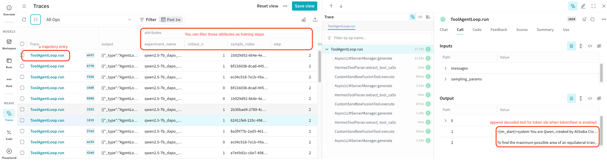


