# xtuner 训练相关

# 论文

MiniMax\-01 https://github\.com/MiniMax\-AI/MiniMax\-01/

Kimi 1\.5

# Torch 显存

https://pytorch\.ac\.cn/docs/stable/notes/cuda\.html\#cuda\-memory\-management


可以使用 [`memory_allocated()`](https://pytorch.ac.cn/docs/stable/generated/torch.cuda.memory_allocated.html#torch.cuda.memory_allocated) 和 [`max_memory_allocated()`](https://pytorch.ac.cn/docs/stable/generated/torch.cuda.max_memory_allocated.html#torch.cuda.max_memory_allocated) 来监视张量占用的内存，并使用 [`memory_reserved()`](https://pytorch.ac.cn/docs/stable/generated/torch.cuda.memory_reserved.html#torch.cuda.memory_reserved) 和 [`max_memory_reserved()`](https://pytorch.ac.cn/docs/stable/generated/torch.cuda.max_memory_reserved.html#torch.cuda.max_memory_reserved) 来监视缓存分配器管理的总内存量。调用 [`empty_cache()`](https://pytorch.ac.cn/docs/stable/generated/torch.cuda.empty_cache.html#torch.cuda.empty_cache) 会释放 PyTorch 中所有**未使用**的缓存内存，以便其他 GPU 应用程序可以使用这些内存。但是，张量占用的 GPU 内存不会被释放，因此它无法增加 PyTorch 可用的 GPU 内存量。

- max\_memory\_allocated 表示当前进程内 tensor 占用的最大显存

- [`max_memory_reserved()`](https://pytorch.ac.cn/docs/stable/generated/torch.cuda.max_memory_reserved.html#torch.cuda.max_memory_reserved) 表示当前进程内缓存分配器分配的最大显存，包括 cuda context, allocated，和没有被使用但是没有归还给 cuda 的碎片化显存


一旦调用 emtpy\_cache 就会释放 PyTorch 中所有**未使用**的缓存内存，导致 [`max_memory_reserved()`](https://pytorch.ac.cn/docs/stable/generated/torch.cuda.max_memory_reserved.html#torch.cuda.max_memory_reserved) 减少，但是也不是等于 max\_memory\_allocated。

可以设置 export PYTORCH\_CUDA\_ALLOC\_CONF='expandable\_segments:True' 来让碎片化显存合并为大 tensor，从而在 reserved 中可以方便后续大 tensor 申请，而不容易 OOM。


# Ray

https://docs\.ray\.io/en/latest/?utm\_source=ray\_io\&utm\_medium=website\&utm\_campaign=nav\&\_gl=1\*1ef7i09\*\_gcl\_au\*MTY0NTI5OTU2OC4xNzQxODUwMjk1


# Verl 理解

要先理解两个最核心概念

https://github\.com/zhaochenyang20/Awesome\-ML\-SYS\-Tutorial/blob/main/rlhf/verl/readme\.md

## 单控制器和多控制器模式

以最熟悉的 PyTorch 分布式来理解，最典型的 DDP/FSDP 模式\(SPMD\) 就是多控制器模式，每张卡上面都包括了控制和计算逻辑，每张卡只负责自己应该处理的部分，并通过点对点或者集合通信进行互操作。

官方写法为：**将控制逻辑分散到多个专门的控制器中，每个控制器负责处理特定的模块**。

优点：**单个控制程序的管理压力降低，系统更加鲁棒可扩展。**

缺点：**控制逻辑分散在多个程序中，实现复杂，难以调试。**


之前的 DP 就是典型的单控制器模式。专门有一个控制进程rank0，负责数据分发给其余 rank，计算完成后，在控制进程合并，效率较低，而且会出现严重的内存不均衡问题。

**优点：架构清晰，容易理解，所有逻辑集中在一处，便于维护和管理；**

缺点：如果有大量的数据分发合并操作，效率低下。


**在一个复杂的工作流程中，single controller 只有一个程序负责管理，而其他的子模块只负责执行。所有控制逻辑都写在唯一 controller 上，实现简单，便于调试。然而，single controller 所承担的控制压力巨大，一来，通讯强度大而效率堪忧，二来，倘若 single controller 崩溃，整个系统将彻底失效。反过来，multi controller 则有多个控制程序来管理不同的子模块，每个子模块仍旧只负责执行自己的功能。如此一来，单个控制程序的管理压力降低，系统更加鲁棒可扩展。然而，控制逻辑分散在多个程序中，实现复杂，难以调试。**


Verl 采用了单控制器和多控制器混合模式。在最上层采用单控制器\(相当于 main 只有在一个进程有\)，然后在 main 进程里面通过 ray 启动 n 个 remote 进程，每个进程是 1 个 gpu，多个进程可以组成一个通信组，例如 fsdp，在 fsdp 进程组内部就是标准的多控制器模式。


这个只是理论上的说法，实际上只要知道他是单控制器模式就可以，因为用了 fsdp 自然就是多控制器模式，无需特别强调。

## **Hybrid Engine** 

这个要基于 ppo 算法来理解。

**在 RLHF 流程中，actor model 的 generation 和 rollout 占据了绝大多数运行时间（在 veRL 是 58\.9%）。并且，由于 PPO 是 on\-policy 算法，经验（experiences）必须来自于被 train 的模型本身，因此，rollout 和 training 是必须串行的。如果这两者使用不同的资源组，比如 rollout 用 2 张卡，而 training 用 4 张卡，rollout 的时候 training 的资源闲置，training 的时候 rollout 的资源闲置，无论如何都会浪费大量的计算资源。由此，veRL 将 training 和 rollout engine 放置在同一个资源组中串行执行。training 时，将 rollout engine 的显存回收（offload 到 CPU 上 或者直接析构掉），rollout 时，再将 training engine 的显存释放掉。这种将 actor model 的不同 engine 放置在同一个资源组上的方案，就称为 hybrid engine。**

这里的引擎说的是训练和推理引擎。之前最主流的 openrlhf 框架，采用如下做法：

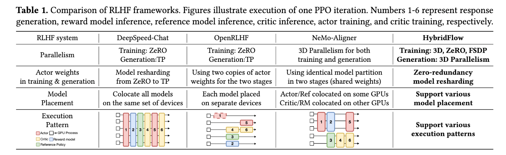

Actor 模式的训练引擎和推理引擎计算过程分到了两个不同的组\(每个组可以包括很多卡，通过 shared 方式管理\)里面。而混合引擎的意思就是将两个引擎放到同一个组里面。

简单来说就是将 actor 模式的所有控制和计算引擎都放到一个组里面，而不是分开的。


但是结合最近实践来看，这种做法不是最合理的。

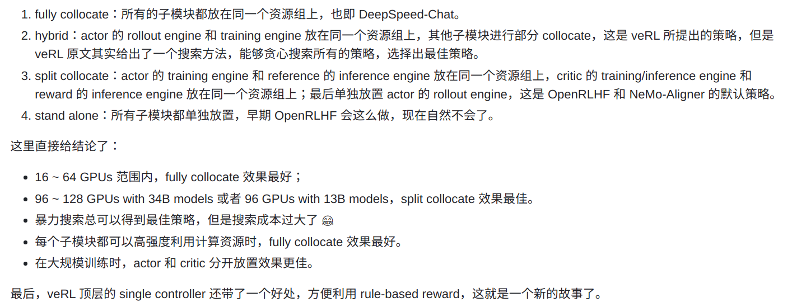

在模型比较小的时候，full collocate 比较好。而 verl 的代码实现其实非常灵活，可以实现上述所有情况，写的非常好。


**由于模型在不同角色之间切换（例如从 actor 切换为 generator），需要不同的参数切分逻辑，所以 VeRL 也设计了一套高效切换的策略，名为 Zero redundancy model resharding。**


# MTP


第一种实现;

https://github\.com/PaddlePaddle/PaddleNLP/blob/develop/paddlenlp/transformers/deepseek\_v2/modeling\.py\#L1871


# all\_to\_all\_single

假设输入 shape 是 4，同时 world\_size=4，那么 all\_to\_all\_single 结果如下。将每个输入切分为 world\_size 份，然后将 rank0聚合所有 index=0 的数据；rank1 聚合所有 index=1 的数据

假设输入 shape 是 4，同时 world\_size=2，那么 all\_to\_all\_single 结果如下


# PP 流水线并行

## ScheduleGPipe

GPipe: Efficient Training of Giant Neural Networks using Pipeline Parallelism

https://arxiv\.org/abs/1811\.06965

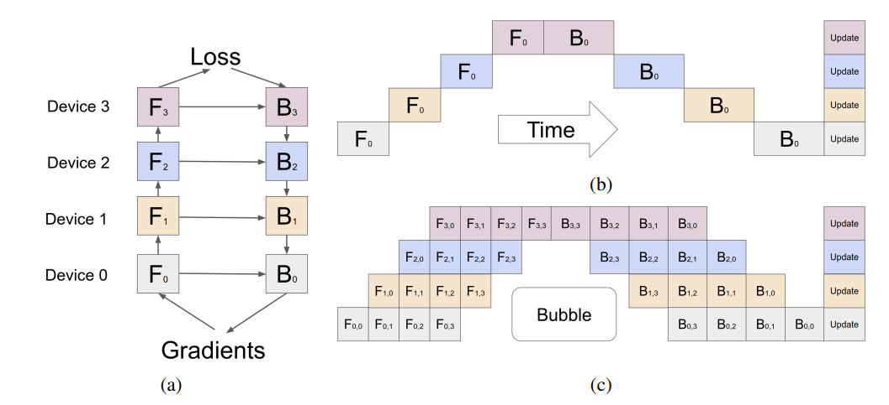

```SQL
--pp-size 2 \
  --pp-mb 2 \
  --mirco-batch-size 4 \
  --pp-schedule GPipe \
```

每个 pp rank 的会将数据切分为 2 个独立的 batch 进行运算


args\_recv\_info

```SQL
# pp rank0
({0: (<torch.distributed.pipelining.stage._RootArgPlaceholder object at 0x7f37b9765450>,), 
1: (<torch.distributed.pipelining.stage._RootArgPlaceholder object at 0x7f37b9764430>,)
```

0 和 1 代表前后两个 batch，由于是 rank0, 不需要介绍数据，因此是 placehold

```SQL
# pp rank1
{0: (_RecvInfo(input=recv_for_1_from_0, source=0, shape=torch.Size([2, 2047, 2048])),), 1: (_RecvInfo(input=recv_for_1_from_0, source=0, shape=torch.Size([2, 2047, 2048])),)
```

从 rank0 接收指定 shape 的数据。


act\_send\_info

```SQL
# key 是表示输出的第 0 个参数，要发送给 stage 1 也就是 rank1
{0: [1]} # rank0 意思 rank0 数据发送给 rank1

{0: []} # rank1, rank1 是最后一个不需要发送
```


grad\_recv\_info

```SQL
# rank0 要接收梯度
(_RecvInfo(input=recv_grad_for_0_from_1, source=1, shape=torch.Size([2, 2047, 2048])),)

# rank1
()
```


grad\_send\_info

```SQL
[]
[0] # rank1 的梯度要发送给 stage0
```

## Schedule1F1B

PipeDream\-Flush schedule

https://arxiv\.org/pdf/2006\.09503v3

Memory\-Efficient Pipeline\-Parallel DNN Training

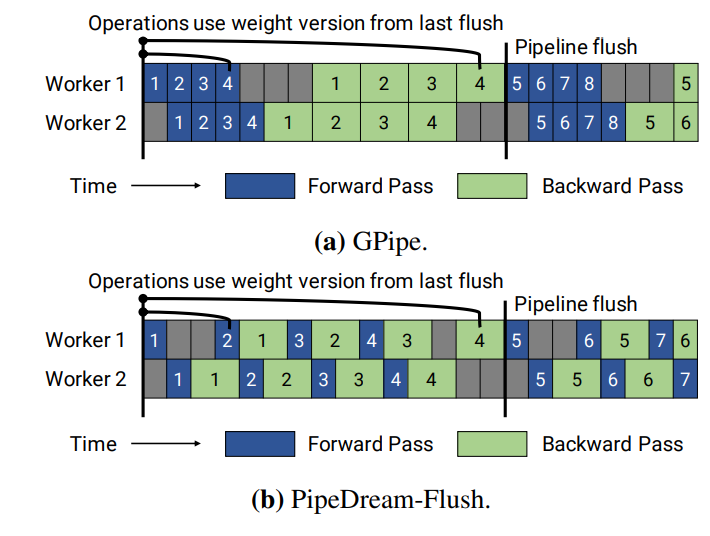

假设 pp=2，也就是分成 2 个 stage，那么 1F1B 会分成 3 个阶段， pp0 会先 warmup 2 次 foward，pp1 会 warmup 1 次 forward, 然后进入稳态阶段， 1 backward\+1 forward 多次；最后进入 Cooldown 阶段完成所有 backward 计算过程。

```SQL
pp_size = 4
pp_nmb = 9
```

```SQL
0F1,0F2,0F3,            0F4,0B1,0F5,0B2,0F6,0B3,0F7,0B4,0F8,0B5,0F9,0B6,    0B7,   0B8,  0B9,
    1F1,1F2,        1F3,1B1,1F4,1B2,1F5,1B3,1F6,1B4,1F7,1B5,1F8,1B6,1F9,1B7,    1B8,   1B9,
        2F1,    2F2,2B1,2F3,2B2,2F4,2B3,2F5,2B4,2F6,2B5,2F7,2B6,2F8,2B7,2F9,2B8,    2B9,
            3F1,3B1,3F2,3B2,3F3,3B3,3F4,3B4,3F5,3B5,3F6,3B6,3F7,3B7,3F8,3B8,3F9,3B9,
```

实际上执行流程，中间空格表示等待

```SQL
0F1,0F2,0F3,0F4,            0B1,0F5,0B2,0F6,0B3,0F7,0B4,0F8,0B5,0F9,0B6,    0B7,   0B8,  0B9,
    1F1,1F2,1F3,        1B1,1F4,1B2,1F5,1B3,1F6,1B4,1F7,1B5,1F8,1B6,1F9,1B7,    1B8,   1B9,
        2F1,2F2,    2B1,2F3,2B2,2F4,2B3,2F5,2B4,2F6,2B5,2F7,2B6,2F8,2B7,2F9,2B8,    2B9,
            3F1,3B1,3F2,3B2,3F3,3B3,3F4,3B4,3F5,3B5,3F6,3B6,3F7,3B7,3F8,3B8,3F9,3B9,
```

self\.\_stage\.\_prepare\_forward\_infra\(self\.\_n\_microbatches, args, kwargs\)

用于计算 self\.args\_recv\_info 和 self\.act\_send\_info

\_prepare\_backward\_infra 用于计算  self\.grad\_recv\_info


RANK 0: 

0B2 前，接收 1B2 同时发送 0F5, 执行 0B2

0F6 前，啥也不用，执行 0F6

0B3 前，接收 1B3，同时发送 0F6,执行 0B3


RANK1:

1B2 前，接收 2B2 同时发送 1F4, 执行 1B2

1F5 前，接收 0F5,同时发送 1B2，执行 1F5, 速度很快

1B3 前，接收 2B3，同时发送 1F5,执行 1B3


上面图不太好绘制，假设 pp=4 nmb=6，空泡率是 43\.75%，如果 pp=16 nmb=64，那么空泡率是 36%，注意这个空泡率还没有考虑由于通信和计算无法折叠带来的额外开销。理论上如果无法重叠，则应该把通信时间算到空泡率里面。


上述要能够 work，需要 attn 前向时间要大于 a2a 时间，但是是不可能的。backward 时间是否会大于 a2a 时间也不确定？应该差不多可以，以能盖住为例：

也就是说如果没有双模型备份，那么由于 forward 计算较快，通信很慢，还是有一大段时间有气泡。

# Domino

https://github\.com/microsoft/DeepSpeed/blob/master/blogs/deepspeed\-domino/README\.md

## ScheduleInterleaved1F1B

https://arxiv\.org/abs/2104\.04473v5

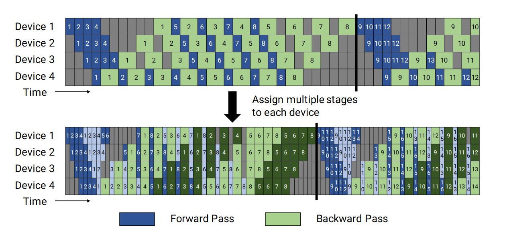

```SQL
--pp-size 4\
  --pp-mb 8 \
  --mirco-batch-size 8 \
```

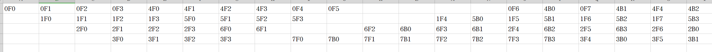

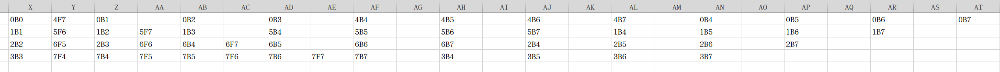

XFY 中的 X 表示第几个 stage，Y 表示第几个 mirco bs。

从上述可以看到，把 bs=8 的数据切分成了 8 份，每一份上 bs=1。

上述虽然 pp\-size 等于 4，但是由于采用的是 Interleaved1F1B 因此实际上会将模型切分为 8 个 stage，其中 stage0 和 4 都在 pp0 上，stage1 和 5 都在 pp1 上\.\.\.

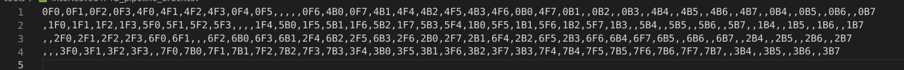

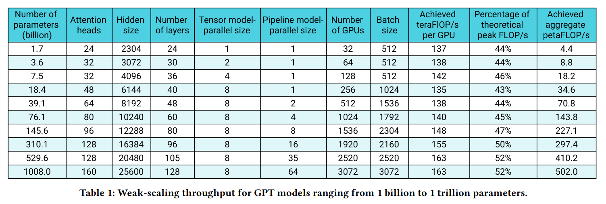

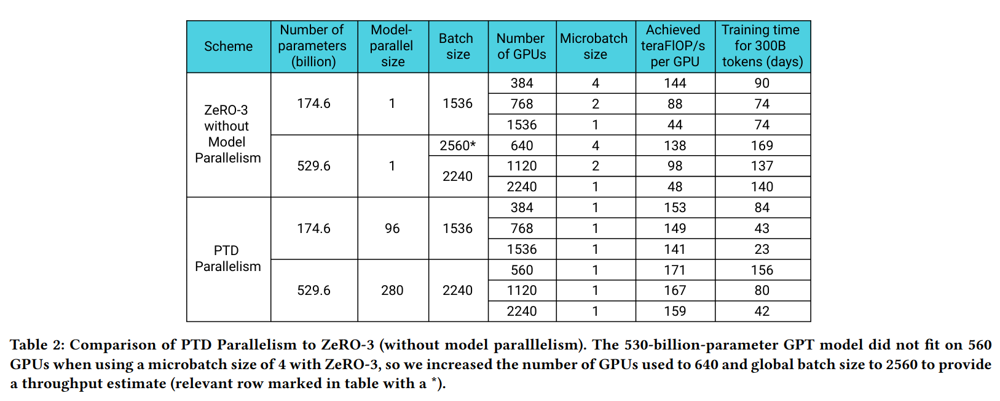

## ScheduleLoopedBFS

Breadth\-First Pipeline Parallelism

https://arxiv\.org/abs/2211\.05953v2

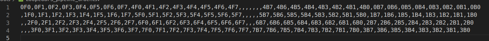


## InterleavedZeroBubble

ZB1P

Zero Bubble Pipeline Parallelism

https://arxiv\.org/abs/2401\.10241


## ZBVZeroBubble

https://arxiv\.org/abs/2401\.10241

第 6 部分

作者还有相关论文：https://arxiv\.org/pdf/2405\.15362

https://huggingface\.co/spaces/sail/zero\-bubble\-pipeline\-parallellism

## DualPipe

专门针对超大 MOE，针对开启 EP 场景下的一次 forward，可以简单分成 4 大块

1. Attention F

2. All\-to\-All dispatch 聚合不同专家的 token 到一起，然后分发

3. MLP 专家计算

4. All\-to\-All combine 将分发后计算结果进行重新组合，确保和之前顺序不变

假设上面就是一个 layer，那么一共有 60 个 layer，也就是 for 循环重复 60 遍上述过程即可


在超大 MOE 情况下，假设 1 和 3 的计算时间等于 2 和 4 的通信时间\(这个已经是优化后的了，实测 all\-to\-all 通信时间远大于计算时间\)，那么就会导致每次 forward 其实就有一半的时间在等待，GPU 利用率非常低。

而且随着卡数增多，通信时间肯定是会再次增加，这样就无法再次 scale up 了，问题会越来越严重。因此要解决核心问题就在于通信和计算要能够完全重叠。


而 deepseek 实现的核心就是下图，可以看到，他们说计算和通信可以完全折叠，相当于就没有通信。他这个图画的有点难理解，我们按照上面 4 个步骤来分析流程。

首先要实现完全重叠，需要两个前置条件：

1. 模型需要两个备份

2. 需要有 micro bs 来确保数据独立

下来分析运行流程：

1. A模型备份的第一个micro batch Attention F

2. 接下来应该是 A模型备份的第一个micro batch 的 All\-to\-All dispatch，如果是这样则会阻塞计算。所以应该在此时进行 All\-to\-All dispatch 通信的同时；进行 B 模型备份的第一个micro batch MLP 专家的输入 backward

3. 接下来应该是 B 模型备份的第一个micro batch MLP 专家的权重 backward，此时要同时进行 

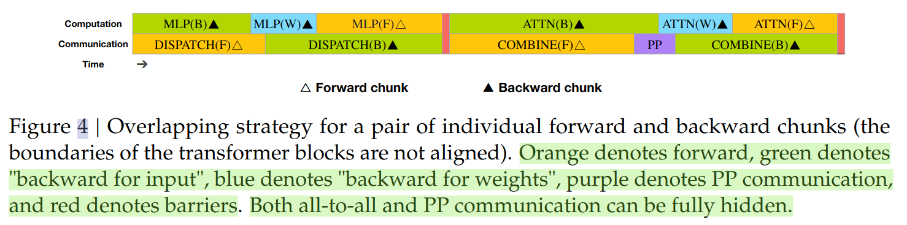


假设每个 pp  rank 里面就一层 layer

上述假设 forward 和 backward B 时间是一样的，在 2 计算完成后，第 3 步不需要再次进行 all\-to\-all 通信，因为应该已经缓存下来了。

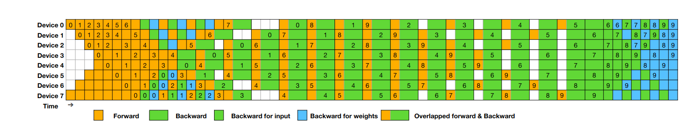

注意： 橙色和绿色是不同的模型备份，而且也是不同的 batch，彼此之间没有依赖。

实际上运行流程应该是上图。1 和 2 代表当前是第 1/2 个模型备份在运行。需要注意：

1. all\-to\-all 通信算子的时长需要能够被正确盖住，否则也有问题

2. 在对 mlp 或者 attn 的 input backward 后，可以理解发起 combine b 的通信，而在 mlp 或者 attn 的 w backward 时候由于有缓存不再需要进行额外的 combine  通信，所以 backward 拆分为 2 个部分是有好处的，但是不知道如何实现？

3. Deepseek 论文中只有一个 pp 通信，实际上应该有 2 个吧？ forward 一个，backword 也有 1 个？


实际上如果 backward 要分成 2 次，那么实现复杂度非常高，比较难写，因此第一版应该是考虑 full backward 情况

5 就是 backward 只算一遍的流水线图。


Dualpipe 基于 **Chimera: Efficiently Training Large\-Scale Neural Networks with Bidirectional Pipelines**

https://readpaper\.com/pdf\-annotate/note?pdfId=4665308471009230849\&noteId=2656663597925056512

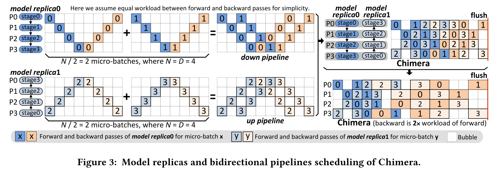


# 理论基础

InternLM2 7B,20B,100B模型的tgs可以估成3500, 600, 140，用100B除一下tgs就是gpu时了。


https://github\.com/pytorch/torchtune/issues/1758 显存减少方案。

https://pytorch\.org/tutorials/intermediate/optimizer\_step\_in\_backward\_tutorial\.html很重要的文档


https://github\.com/linkedin/Liger\-Kernel model kernel 全换，速度提升，显存减少。

# FP8

## SmoothQuant

https://arxiv\.org/abs/2211\.10438

[mp\.weixin\.qq\.com](https://mp.weixin.qq.com/s?__biz=MzU2NzkyMzUxMw==&mid=2247548105&idx=1&sn=6257dcb8fbacac733fdc6dc4983468ed&chksm=fd19426b618229adc90a42bc7edb883343b30072f3bb82467a2aa4682e502d465271810b2785&mpshare=1&scene=1&srcid=1023oTHg8Pqh5mMfNG7TRgdt&sharer_shareinfo=beb11a57cb431f5596c714047966ba52&sharer_shareinfo_first=4ca7b3fa70eb09e159e4b69c56970375&exportkey=n_ChQIAhIQe7avgMVNGF8feuKVrR4K6hL5AQIE97dBBAEAAAAAAKQGDJfQzeUAAAAOpnltbLcz9gKNyK89dVj0TC4v3kbf3zXH%2F7eAsh1%2FxfZdvnXnZyppTz61H8SvQapdb8MPg2PylVbAT83NMKk%2BNMArb6cxDC3%2BUoTT7UXrwwixRKS6hE6DCTE5MqpWCp4dDHs6%2F%2BWoric3NUCPfZ30v8jxCH0Tc%2FJeUKVm%2FZyEufl2OkTRj83xaR%2FC3IuQs8kwIo%2B16Vflwp43EMWObLbVYlqhMkAX3LLLUIZDRI7RKAzNmsEJoUcbI8zuh7fgQDZnmjFyQYSxcdqYkotiP4SsNHoVGdYpywsaNXFovwTCpJHZvw%3D%3D&acctmode=0&pass_ticket=XnDIgu4efgryPs1yxAMlJh%2B0cnQ72yYM4R6ySQC7k2avsZC%2F6fybi2%2FcBuscLTO2&wx_header=0#rd)

随着 FP8 的引入，其 Tensor Core 算力是 FP16 的两倍，为探索更大规模的模型提供了算力支持

具体来说，FP8 的优势包括：对于计算密集型算子，FP8 的 Tensor Core 相对于 BF16/FP16 能提供两倍的算力，从而大大缩短计算时间；对于 Memory Bound 的算子，FP8 格式所需的数据量更少，可以节省缓存量，加快计算；如果将通信算子中的数据类型也替换成 FP8，也可以获得一定的加速。最后，FP8 训练的模型可以更好地与推理相结合，因为如果模型在训练时的精度是 FP8，那么可以更快地部署到推理侧，而不需要额外的 PTQ 量化过程。

```Python
*How can block_size represent different granularities?*
*  let's say we have a Tensor of size: (3, 3, 10, 10), here is the table showing how block_size represents different*
*  granularities:*
  
*   granularity type       |     block_size*
*     per_tensor           |    (3, 3, 10, 10) scale-factor 是 (1,1,1,1)*
*     per_axis (axis=0)    |    (1, 3, 10, 10) scale-factor 是 (3,1,1,1)*
*     per_axis (axis=1)    |    (3, 1, 10, 10) scale-factor 是 (1,2,1,1)*
* per_group (groupsize=2)  |    (3, 3, 10, 2) scale-factor 是 (1,1,1,5)*
* per_group (groupsize=2) for axis = 3 | (3, 3, 2, 10)*
```

假设 tensor 是 *\(3, 3, 10, 10\)*

- pre\_tensor 将整个 tensor scaled 出一个值

- pre\_axis 也就是 pre\_channel 沿着特定维度进行 scaled

- pre\_group 对某个或者某几个通道合并进行 scaled 


## 其他

https://developer\.nvidia\.com/zh\-cn/blog/fp8\-llm\-app\-challenges/

https://developer\.nvidia\.com/zh\-cn/blog/fp8\-precision\-performance/

https://developer\.nvidia\.com/zh\-cn/blog/nvidia\-gpu\-fp8\-training\-inference/

https://arxiv\.org/pdf/2209\.05433v2

https://docs\.nvidia\.com/deeplearning/transformer\-engine/user\-guide/examples/fp8\_primer\.html

在 H100 的第四代 Tensor Core 中，支持任意的 FP8 格式矩阵的乘法 （[E4M3](https://zhida.zhihu.com/search?content_id=225782898&content_type=Article&match_order=1&q=E4M3&zhida_source=entity)xE4M3, [E5M2](https://zhida.zhihu.com/search?content_id=225782898&content_type=Article&match_order=1&q=E5M2&zhida_source=entity)xE5M2, E4M3xE5M2, E5M2xE4M3，然后会进行累加到 FP32 和 FP16 的数据格式之中。

fp8有两个规格，E4M3

- E4M3：符号位\(1位）、指数部分（4位）、尾数部分（3位），表示范围\+/\-448和`nan`

- E5M2：符号位\(1位）、指数部分（5位）、尾数部分（2位），表示范围\+/\-57344, \+/\-`inf`, `nan`

下图展示不同数据类型能表示最接近0\.3952的形式

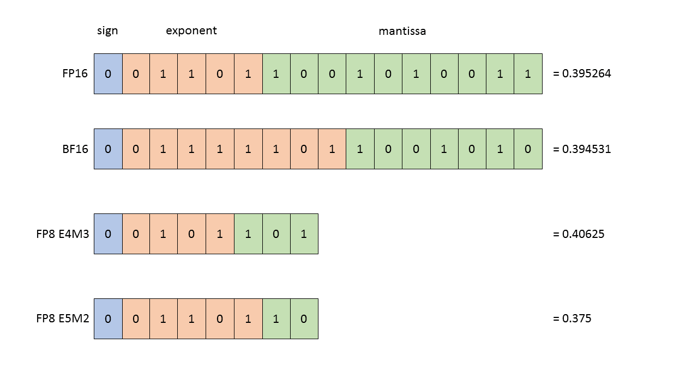

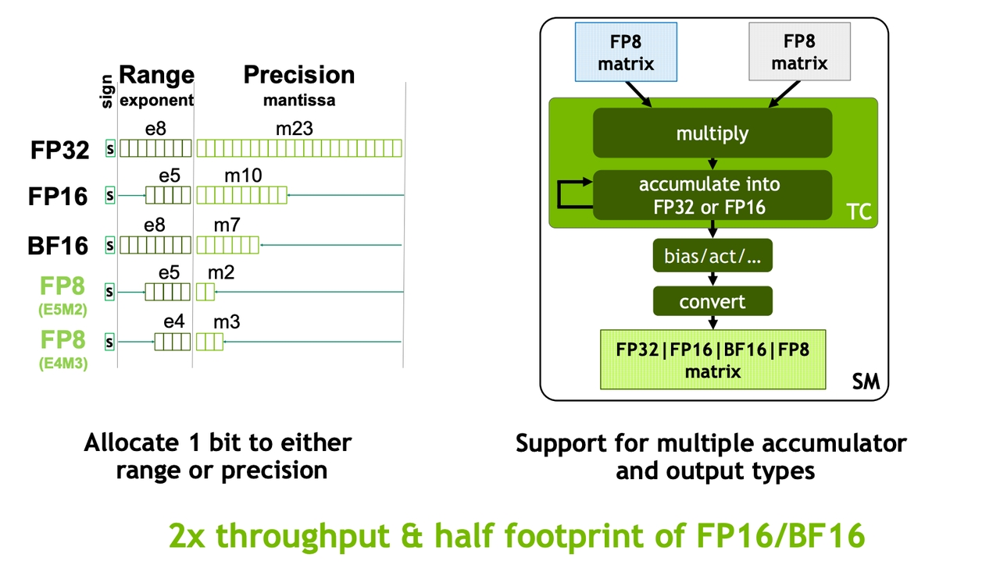

**Per\-Tensor 量化：**找到整个 Tensor 中的最大值，而为了减少找全局最大值带来的 memory consumption, 这里提出了一个基于一个 window, 即找到一个局部的最大值，然后再在这个局部最大值添加一个 margin 在作为 scaling factor

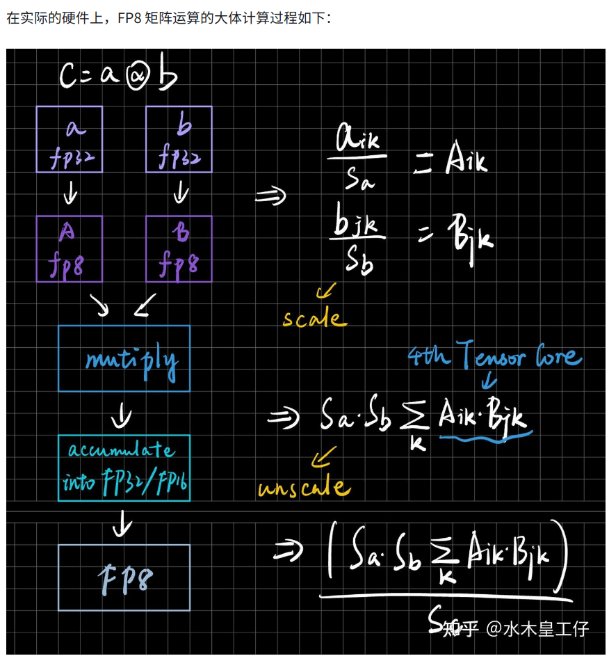

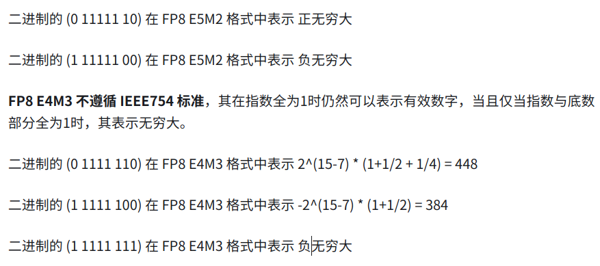

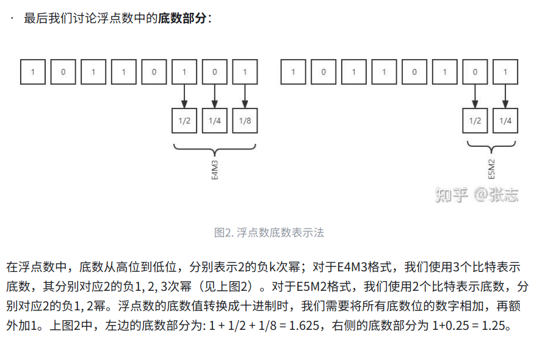

所以实际上可以手动算出，如果 fp32=0\.414，那么在 fp8 里面能够表示的值是啥。

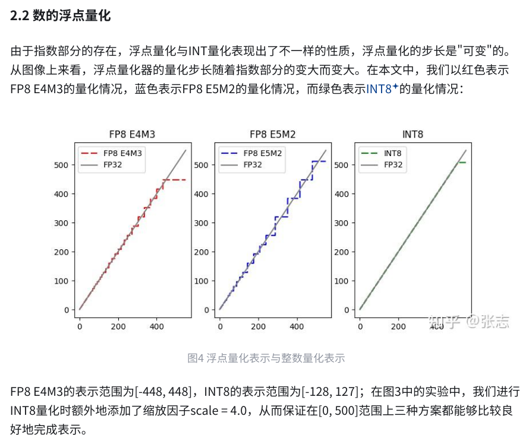

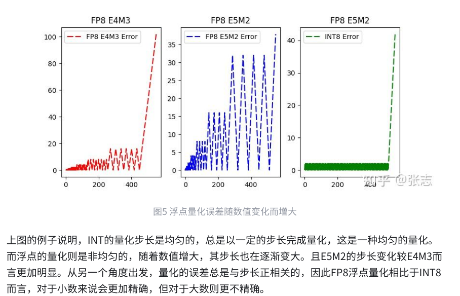


# FSDP

https://www\.yiyibooks\.cn/arxiv/2304\.11277v2/index\.html

# FSDP2

https://github\.com/pytorch/pytorch/issues/114299


# Training Ultra Long Context Language Model

https://arxiv\.org/abs/2408\.16978

# Cuda Stream

https://pytorch\.org/docs/stable/notes/cuda\.html\#cuda\-streams

CUDA 流是属于特定设备的线性执行序列。通常情况下，您不需要显式地创建一个流：默认情况下，每个设备使用其自己的“默认”流。

每个流中的操作按照创建的顺序进行串行化，但不同流中的操作可以并发执行，且执行顺序不受限制，除非使用了显式的同步函数（如 `synchronize()` 或 `wait_stream()`。

当“当前流”是默认流时，PyTorch 会在数据移动时自动执行必要的同步，如上所述。然而，在使用非默认流时，确保适当的同步是用户的责任。

```SQL
**cuda** **=** **torch.device(**'cuda'**)**
**s** **=** **torch.cuda.Stream()**  *# Create a new stream.*
**A** **=** **torch.empty((**100**,** 100**),** **device=cuda).normal_(**0.0**,** 1.0**)**
**s.wait_stream(torch.cuda.default_stream(cuda))**  *# NEW!*
**with** **torch.cuda.stream(s):**
    **B** **=** **torch.sum(A)**
**A.record_stream(s)**  *# NEW!*
```

`torch.cuda.Stream.wait_stream()` 调用确保在我们开始在S流上运行 `sum(A)` 之前，`normal_()` 执行已经完成。`torch.Tensor.record_stream()` 确保在 `sum(A)` 完成之前不会释放 `A`。您还可以在稍后的时间手动等待流，使用 `torch.cuda.default_stream(cuda).wait_stream(s)`（请注意，立即等待是没有意义的，因为这会阻止流执行与默认流上的其他工作并行运行）。


每个反向 CUDA 操作在与其对应的正向操作相同的流上运行。如果您的正向传递在不同的流上并行运行独立操作，这有助于反向传递利用相同的并行性。

反向调用相对于周围操作的流语义与任何其他调用相同。反向传递会插入内部同步，以确保即使反向操作在多个流上运行，也能实现这一点，如前一段所述。

# 解码

https://huggingface\.co/blog/zh/how\-to\-generate

# Ring Attention

以 head=5/8/16 dim=128 为例，假设 ring=4，随着原始序列变成，forward 误差会逐渐变小，bwd 最大误差始终不变。

```Java
==========================4==========================
forward_max: 0.015625, bwd_max: 0.015625
==========================132==========================
forward_max: 0.0078125, bwd_max: 0.03125
==========================196==========================
forward_max: 0.00390625, bwd_max: 0.03125
==========================1092==========================
forward_max: 0.001953125, bwd_max: 0.03125
==========================3908==========================
forward_max: 0.00390625, bwd_max: 0.03125
==========================8836==========================
forward_max: 0.001953125, bwd_max: 0.03125
==========================8900==========================
forward_max: 0.0009765625, bwd_max: 0.03125
==========================8964==========================
forward_max: 0.0009765625, bwd_max: 0.03125
==========================18052==========================
forward_max: 0.00048828125, bwd_max: 0.03125
==========================22404==========================
forward_max: 0.00048828125, bwd_max: 0.03125
==========================63620==========================
forward_max: 0.000244140625, bwd_max: 0.03125
==========================63940==========================
forward_max: 0.00048828125, bwd_max: 0.015625
```

其中 fwd 和 bwd 最大值大概是 4\.5 左右。


https://zhuanlan\.zhihu\.com/p/718486708 核心

不同于现有的在环状结构中重叠通信和计算的 CP 实现（Liu et al\., 2023a），我们的 CP 实现采用了一种基于 all\-gather 的方法，首先对关键（K）和价值（V）张量进行 all\-gather，然后计算本地查询（Q）张量块的注意力输出。尽管 all\-gather 通信延迟在关键路径中被暴露，但我们仍然采用这种方法，主要有两个原因：（1）基于 all\-gather 的 CP 注意力更容易和灵活地支持不同类型的注意力掩码，例如文档掩码；（2）由于使用了 GQA（Ainslie et al\., 2023），所传输的 K 和 V 张量远小于 Q 张量，因此暴露的 all\-gather 延迟很小。

这个新方案已经和 ring attention 没有啥关系了。 这个方案要做的事情比较明显：


varlen flash attention 可以输入一个序列中包括 n 个子序列的情况，计算出来的结果就是完整的。如果我们对整个序列进行切分，那么唯一要考虑的就是由于会切断 n 个子序列，那么针对 mask 情况要对每个切断的子序列重新计算 cu\_seqlens\_q，cu\_seqlens\_k，max\_seqlen\_q 和 max\_seqlen\_k 这 4 个输入值。一旦算对了，那么直接调用  varlen flash attention 接口，返回的子序列结果就已经是对的。


注意一个问题，因为代码并没有进行修正，因此要确保每个段计算的就是对的。假设 q 是某个子序列的中间部分，此时 kv 则必须是当前子序列的全量序列，否则计算结果肯定不对。


如果想在这个基础上使用  2d\-attention 则需要确保 ring\-degree 切分时候不能把子序列切断了。假设一共 8 张卡，sp\-ulyess=4,ring\-attention=2，数据长度是 \(b,800,h,d\)，首先将数据在序列维度切分为 8 份，变成 \(b,100,h,d\)，然后在 4 张卡内部进行 sp\-ulyess 操作，变成 \(b,400,h/4,d\)，此时要注意，这个 400 必须是 800里面被切分为 400 中的完整子序列，也就是这个 400 必须是完整的序列，否则后面计算有问题。

然后对这个  \(b,400,h/4,d\) 采用新的 ring attention 计算，具体过程就是在 ring group 组内进行 kv all\-gather，然后基于 cum\_seq\_len 进行重新选择正确的 kv 序列进行计算，最后进行 cat，得到 \(b,800,h/4,d\) 的结果，最后在进行一次 cat，得到 \(b,800,h,d\)。


上述做法对代码的改动最小，但是其实如果随便切也是可以的，只不过要提前把 ring\-group 内的 cum\_seq\_len 算出来，也就是说 ring=2 的话，原先 800 的 cum\_seq\_len 要变成两个 400 的 cum\_seq\_len，这样就没有一点 padding。


Online normalizer calculation for softmax

基础中的基础

https://zhuanlan\.zhihu\.com/p/683714620 zigzag\_ring\_attention

https://coconut\-mode\.com/posts/ring\-attention/

https://zhuanlan\.zhihu\.com/p/668888063

https://courses\.cs\.washington\.edu/courses/cse599m/23sp/notes/flashattn\.pdf

https://jcf94\.com/2024/02/24/2024\-02\-24\-flash\-attention/


Striped Attention: Faster Ring Attention for Causal Transformers


Blockwise Parallel Transformer for Large Context Models

https://readpaper\.com/pdf\-annotate/note?pdfId=4794480874141777921\&noteId=2468268364024519424

Ring attention 基础


Ring Attention with Blockwise Transformers for Near\-Infinite Context

https://arxiv\.org/abs/2310\.01889v4

# Varlen Ring Attention

时刻0： rank0 \-rank0; rank1 \-rank1; rank2 \-rank2; rank3 \-rank3

时刻1： rank0\- rank1; rank1\-rank2;rank2\-rank3;rank3\-rank0

时刻2：rank0\-rank2;rank1\-rank3;rank2\-rank0;rank3\-rank1

时刻3：rank0\-rank3;rank1\-rank0;rank2\-rank1;rank3\-rank0

在时刻 3 会出现负载不均衡。

Zz 切分方式，假设 rank =4，其实要切分为 8 份才行。运行方式不变。

时刻0： rank0 \-rank0; rank1 \-rank1; rank2 \-rank2; rank3 \-rank3

时刻1：rank0\- rank1; rank1\-rank2;rank2\-rank3;rank3\-rank0

时刻2：rank0\-rank2;rank1\-rank3;rank2\-rank0;rank3\-rank1

时刻3：rank0\-rank3;rank1\-rank0;rank2\-rank1;rank3\-rank0

虽然也会出现负载不均匀，但是应该是每个卡计算量会更接近？


要尽量确保在一个 packing 内的数据都是一样长。而不仅仅是要求所有 dp 的最长的非常接近。

# Reducing Activation Recomputation

https://arxiv\.org/pdf/2205\.05198

Reducing Activation Recomputation in Large Transformer Models


张量级模型并行性增加了通信需求，并引入了更小、性能更低的矩阵乘法，使得在大量设备上拆分模型是低效的。因此，张量级模型并行性通常仅限于与高速带宽连接的相对较小的 GPU 组

流水线并行性需要存储几个微批次的激活以减少流水线气泡。因此，管道并行性只能帮助存储模型参数和优化器状态所需的内存，并且不能在保持高设备利用率的同时减少激活所需的内存。因此，激活的存储很快成为扩展大型变压器模型的关键问题。

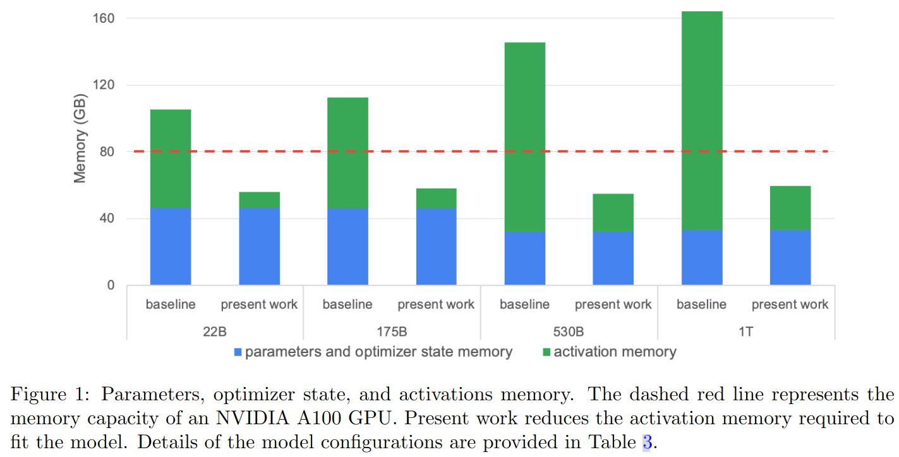

作者发现全激活 checkpoint 大概会带来 30% \~40% 的计算负担。


与其存储用于反向传播的激活值，传统上是重新计算这些激活值，这样可以节省内存，但会增加冗余计算。在这项工作中，我们表明大部分冗余计算是没有必要的，因为我们可以在不需要它的情况下有效减少内存消耗。我们提出了两种新颖且非常简单的技术：序列并行和选择性激活重新计算。结合张量并行，这些技术几乎消除了重新计算激活值的需求。

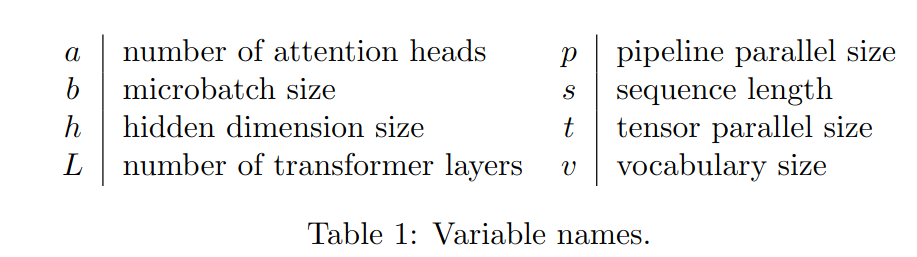

论文里面有对 Transformer 激活值的详细分析。

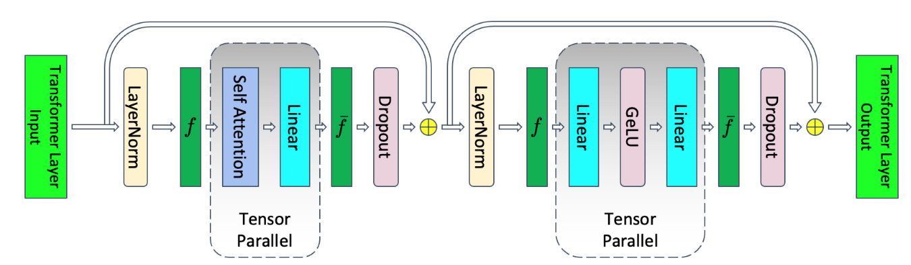

Tp 是用于 attention 内部，layernorm\+dropout 是不用的，在 tp 情况下会负责到多个卡上，相当于这部分激活也复制了，这些op不需要大量的计算，但需要大量的激活内存，一共 10sbh。要减少激活，可以对这部分进行 sp 操作。

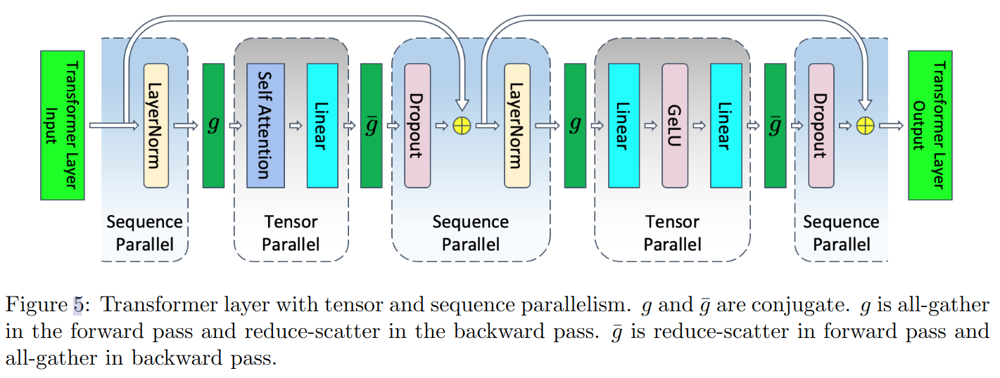

沿序列维度划分减少了激活所需的内存。这种额外的并行度引入了新的通信集合，这些集合将充当序列和张量并行区域之间的转换器。

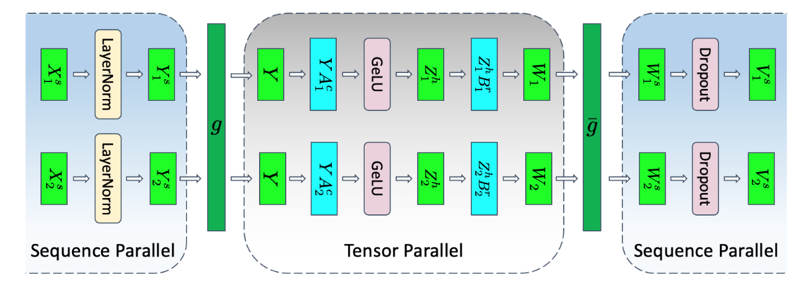

对于输入序列，先在序列维度进行切分，每个 sp 只计算一部分，这样激活值就不会有重复。在计算完成后引入 all\-gather 操作，这样看起来只是避免了额外的 tp 次 layernorm\+dropout 的激活，通过引入 g，天然的可以和 tp 联合使用，通信成本没有增加多少。

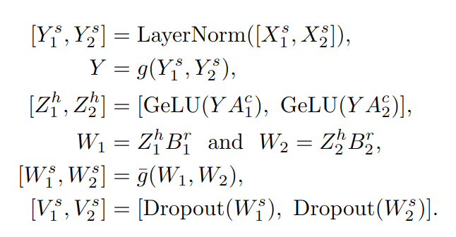

**选择性激活**

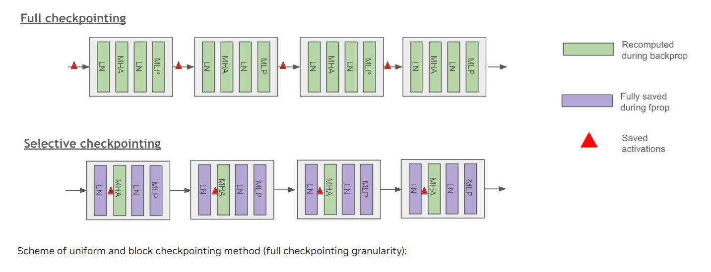

选择性激活重计算是指的将占用激活内存很大但是重计算量不大的 op 进行 checkpoint，正常都是整个 layer 进行 checkpoint，现在只在 MHA 部分采用，其余部分不用，这个做法可以节省 70% 显存，但是速度不会下降多少。

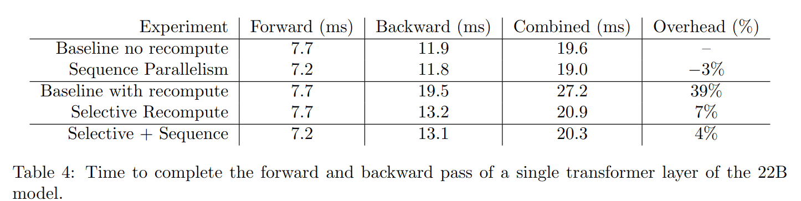

# **Context parallelism**

https://docs\.nvidia\.com/megatron\-core/developer\-guide/latest/api\-guide/context\_parallel\.html

https://zhuanlan\.zhihu\.com/p/698447429?utm\_psn=1775574311425835008 详细说明

类似序列并行方案。NVIDIA Megatron 中采用的序列并行方案。

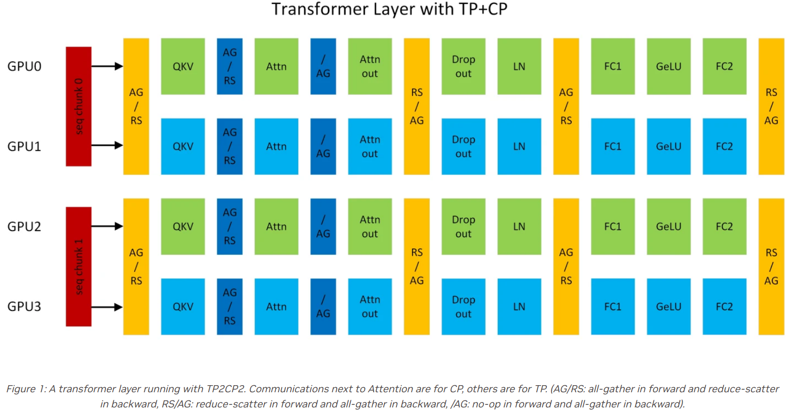

- gpu0 和 gpu2 构成一个 cp 组，也就是说这两个 gpu 上构成一个完整的输入序列

- gpu0 和 gpu1 构成一个 tp 组，也就是说这两个 gpu 构成一个完整的模型

假设在这个模型运行前，输入 shape 是 \(100,4\)，那么 gpu0 数据为 \(50\_0, 2\_0\)，gpu0 数据为 \(50\_0, 2\_1\), gpu2  \(50\_1,2\_0\),GPU3 \(50\_1,2\_1\)


GPU0:  先进行 gather 变成 \(50\_0,4\) 然后在 tp 组上进行计算，得到 QKV 输出 \(50\_0, 2\)，在计算 attn 前为了得到正确结果，需要采用 ring attention 点对点通信，经过 atten 后输出为 \(50\_0,2\),然后再计算 attn out 得到 \(50\_0,4\)；在计算 dropput\+ln时候，不需要完整序列，因此可以再进行序列切分，重新变成 \(5\)


上下文并行（“CP”）是一种在序列长度维度上进行的并行化方案。与之前的序列并行（SP，就是Reducing Activation Recomputation in Large Transformer Models里面提到的方案）仅拆分 Dropout 和 LayerNorm 激活序列不同，CP 在序列维度上对网络输入和所有激活进行分区。在 CP 中，除了注意力模块（例如线性层、LayerNorm 等）外，所有模块都可以正常工作，因为它们没有跨标记操作。对于注意力模块，每个标记的 Q（查询）需要与同一序列中所有标记的 KV（键和值）进行计算。因此，CP 需要在 GPU 之间进行额外的全收集操作，以收集完整的 KV 序列。相应地，在反向传播中，应对 KV 的激活梯度应用 reduce\-scatter 操作。为了减少激活的内存占用，每个 GPU 在前向传播中仅存储一个序列块的 KV，并在反向传播中再次收集 KV。KV 通信发生在一个 GPU 及其在其他 TP 组中的对应 GPU 之间。全收集和 reduce\-scatter 在底层被转换为环拓扑中的点对点通信。交换 KV 也可以利用 MQA/GQA 来减少通信量，因为它们对 KV 仅有一个或少量的注意力头。

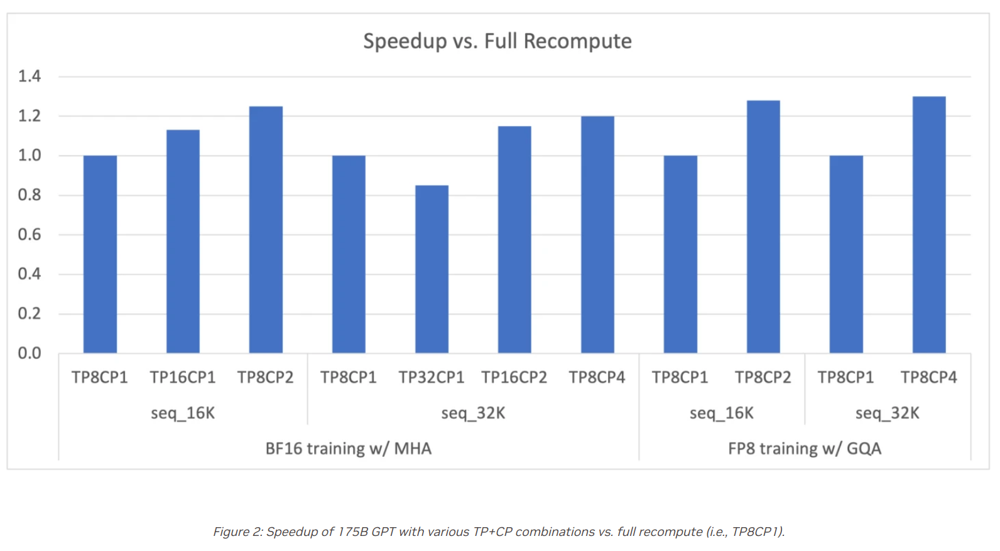

# LoongTrain

https://arxiv\.org/pdf/2406\.18485

LoongTrain: Efficient Training of Long\-Sequence LLMs with Head\-Context Parallelism


InterEVO 组提出来的。

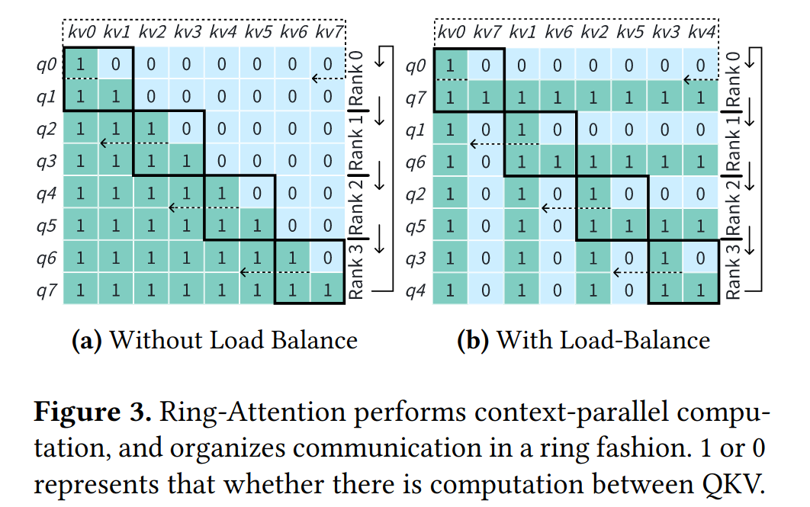

这个图绘制的非常清楚易懂。在不同的时刻，attention mask 是不一样的，因此需要特殊处理。

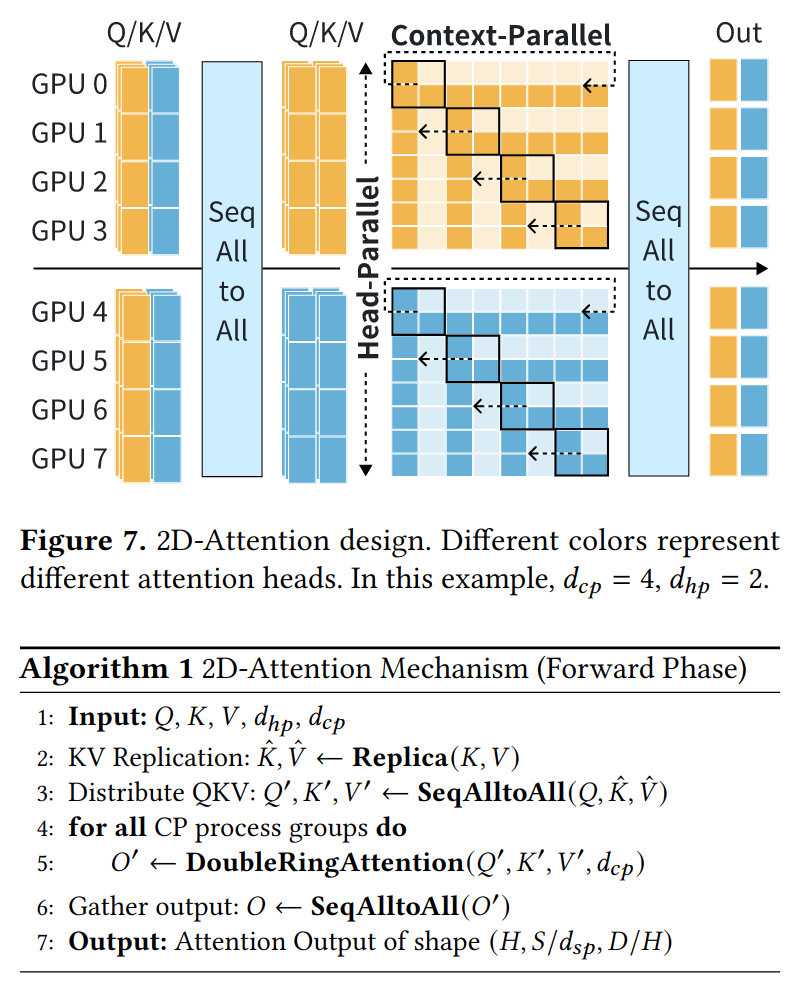

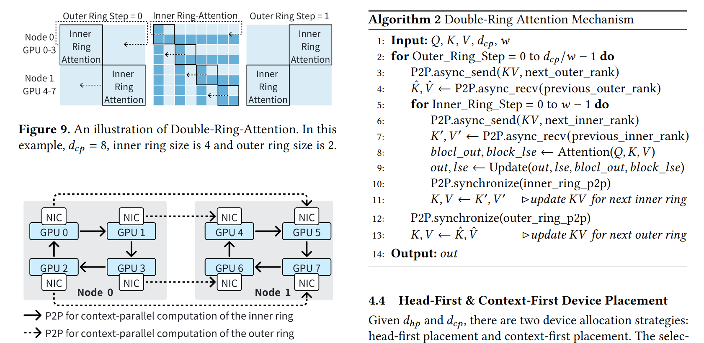

所谓的 double ring attention 主要是想省掉一点节点间通信。假设 ring degree 是 8，分布在 2 个节点上，要完成最终计算需要环形运算 8 次，由于每次都有节点间 p2p 通信，因此每次通信时间是固定的，是最慢的那个。

如果采用 double ring attention，那么可以将这个 degree=8 分成外循环 2，内循环 4，这样虽然会多两次 p2p 通信，但是总共是 2 次 p2p 节点间通信\+ 4x2=8 次 p2p 节点内通信。总的通信成本还是降低了。计算过程类似 1 次 p2p 节点间通信\+ 4 次节点内通信 \+1 次 p2p 节点间通信\+ 4 次节点内通信。

# USP

Usp: A unified sequence parallelism approach for long context generative ai

https://arxiv\.org/abs/2405\.07719v5

https://github\.com/feifeibear/long\-context\-attention

内部有不少经验性结论。

更一般的做法是： 假设总的 sp 为 16，那么是将数据直接切分为 16 份，然后在节点内采用 sp\_ulysses=8 进行 all to all，最后采用 ring degree=2 进行节点间点对点通信。


1. If the head number is enough, Ulysses outperforms Ring\-Attention\. The All\-to\-All communication of Ulysses is highly efficient within a single machine, with a very low overhead ratio\. In contrast, Ring splits computation and communication, which increases the overall of computation time, and even with complete overlap, it is slower than Ulysses\.

2. QKV packed \(`LongContextAttentionQKVPacked`\) is better than the QKV no packed \(`LongContextAttention`\) version, with the difference becoming more pronounced as the sequence length decreases\. MAQ and GQA can only use the no packed version\.

3. Among the variants of the Ring\-Attention implementation, `zigzag` and `stripe` perform better than `basic`\. Typically, zigzag is slightly better than stripe, but as the sequence length increases, the difference between zigzag and stripe becomes less noticeable\. It is worth noting that both zigzag and stripe have specific layout requirements for the sequence dimension\.

4. Hybrid parallelism works well to heterogeneous network devices\. For example, on an 8\-GPU L20 setup, the optimal performance is achieved when ulysess\_degree is set to 2 and ring\_degree is set to 4\.


Some best practices are listed here:

1. We suggest using Unified\-SP in place of SP\-Ring and SP\-Ulysses, as it encompasses the capabilities of both while offering additional benefits\.

2. DP \(data parallelism\) vs SP: We suggest prioritizing the use of DP over SP if possible\. Only when the batch size \(bs\) is insufficient for partitioning should one consider whether to employ SP

3. Utilizing SP, it should always be used in conjunction wit ZeRO\-1/2\.

4. Unified\-SP has lower communication cost than Tensor Parallel with megatron\-lm sequence parallelism \(TP\-sp\)\! You can use Unified\-SP to replace TP for better speed\. However, now switching TP \(tensor parallelism\) to SP\+ZeRO2 cannot increase the sequence length in training\. SP\+ZeRO3 can train a similar sequence length as TP\-sp\. We suggest that SP may have an advantage over TP when employing GQA in terms of communication cost, as GQA can reduce the communication cost of SP without affecting TP\.

5. Setting a higher parallel degree of SP parallelism is possible, which may need to set a large ring degree when the head number is limited, to train a long sequence across a greater number of computational devices\. But TP could not be set a high parallel\.

# Striped Attention 

https://arxiv\.org/pdf/2311\.09431

# LONGVILA

https://arxiv\.org/abs/2408\.10188v3

LongVILA: Scaling Long\-Context Visual Language Models for Long Videos

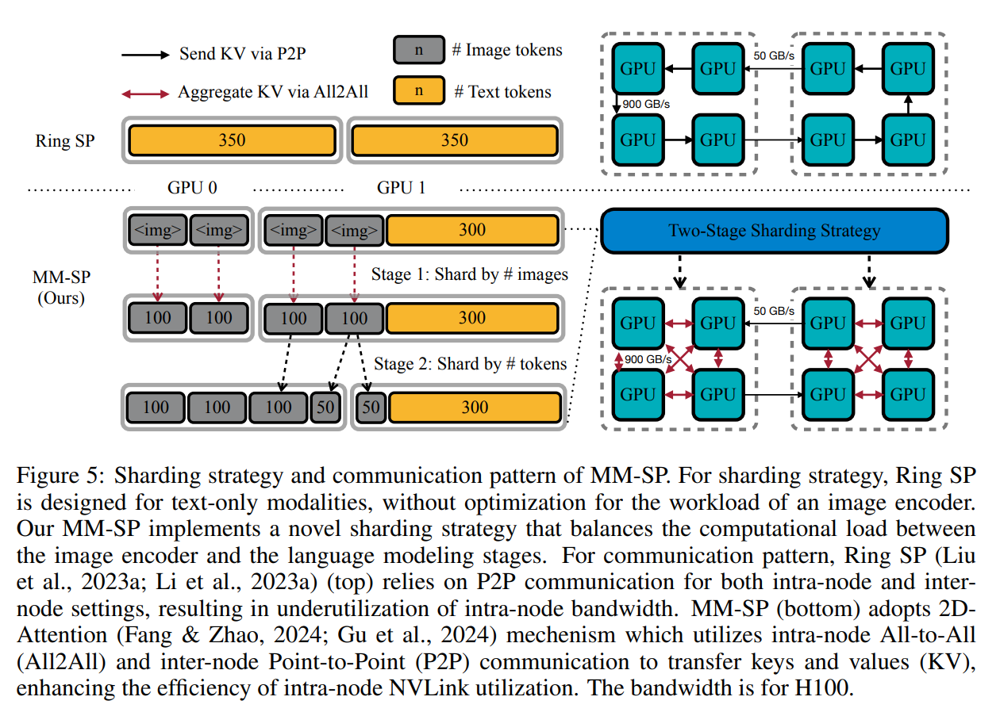

如上半部分所示，RIng\-SP 并没有用于多模态，而且 ring attention 计算时候就是环形做法。

下半部分是本文所采用的 MM\-SP，首先在 vit 运行前不同 GPU 采用的是图片级别平衡，而不考虑 text token 是否平衡，在 vit 运行完成后，图片 token 转换为 text token，此时就不用区分模态了，此时在采用 text token 间平衡切分即可。并且在节点内采用 sp\-ulyess，节点间采用 sp\-ring 策略，这样可以提高通信速度。

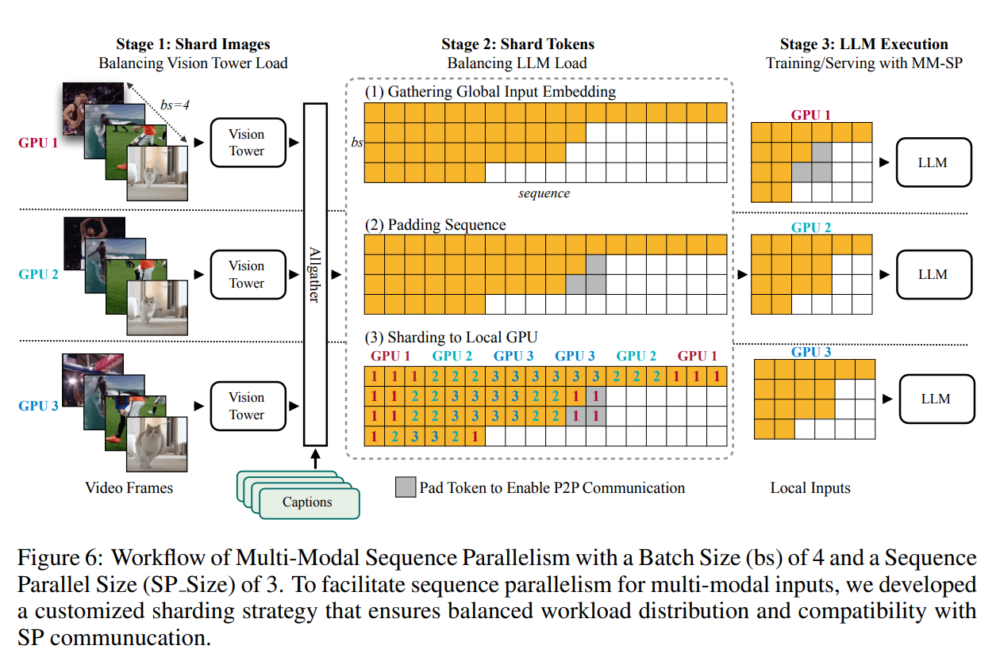

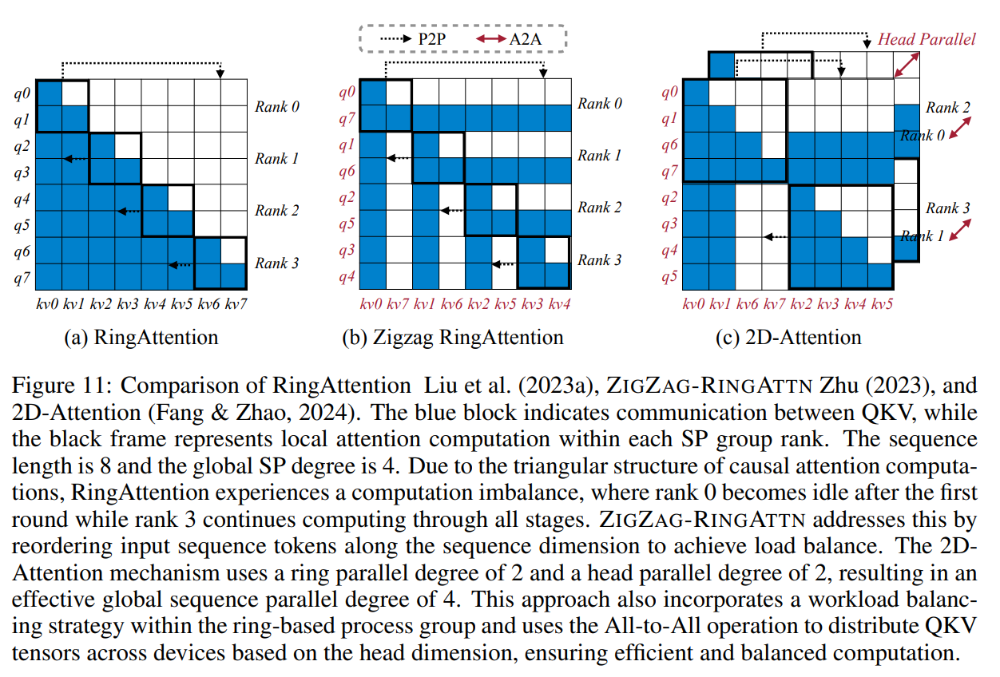

这个图很关键，要仔细理解。


# PP

https://huggingface\.co/docs/transformers/v4\.15\.0/en/parallelism

https://huggingface\.co/docs/transformers/main/en/perf\_train\_gpu\_many\#efficient\-training\-on\-multiple\-gpus

## GPIPE

https://pytorch\.org/tutorials/intermediate/pipeline\_tutorial\.html

https://www\.bilibili\.com/video/BV1v34y1E7zu/

https://readpaper\.com/paper/2901299405

https://zhuanlan\.zhihu\.com/p/613196255

就是把 batch size 数据再进行精细切分而已，超参数是 micro\-steps M，论文强调，如果 M\> 4K 那么空闲时间可以忽略，k 是卡数。假设 4 张卡，那么 M 可以是 16，也就是把之前单卡 bs 数据切分为 16 份。


torchgpipe torch 官方实现 https://arxiv\.org/pdf/2004\.09910


## 1F1B\-PipeDream

流水线并行根据执行的策略，可以分为 F\-then\-B 和 1F1B 两种模式。之前讲述的朴素流水线并行以及GPipe都是F\-then\-B模型，而后续讲述的 PipeDream 则是 1F1B 模式。


F\-then\-B 模式，先进行前向计算，再进行反向计算。

F\-then\-B 模式由于缓存了多个 micro\-batch 的中间变量和梯度\(如果不用 active checkpoint 的话\)，显存的实际利用率并不高。

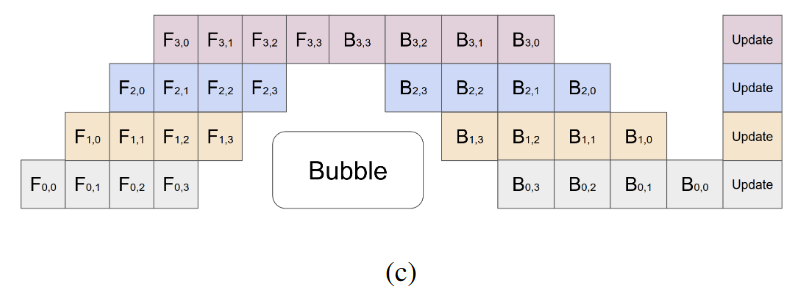

以上图为例，假设原先是单卡，bs 是 8 \(0\~7\)，现在变成 4 张卡，每张卡分成 4 个 micro\-batch，也就是每张卡每次 forward 是 2 bs，并且模型均匀切分到 4 张卡上

- 在 t0 时刻，第一张卡处理 \(0\~1\) 数据，其余卡空闲

- 在 t1 时刻，第一张卡处理 \(2\~3\) 数据，第二张卡处理\(0\-1\) 数据

- \.\.\.

- 在 t7 时候，第 4 张卡开始进行针对 \(6\~7\) 数据进行 bp 反向计算，注意，此时此时他需要 \(6\~7\) 数据的 forward 输出值才能算

- 在 t8 时刻，第 4 张卡开始进行针对 \(4\~5\) 数据进行 bp 反向计算，注意，此时此时他需要 \(4\~5\) 数据的 forward 输出值才能算

- 在 t9 时刻，第 4 张卡开始进行针对 \(2\~3\) 数据进行 bp 反向计算，注意，此时此时他需要 \(2\~3\) 数据的 forward 输出值才能算

- 全部计算完成后，统一进行参数更新即可


从上面 bp 过程可以发现，对于第1张卡，虽然每次只算一部分，但是由于后续 BP 时候也是要分成 4 步算，所以他实际上要把前 4 次跑的激活值或者说中间结果保存下来，这就会缓存了多个 micro\-batch 的中间变量和梯度。用了 active checkpoint 后就可以不用缓存，但是后续 bp 时候这个部分要重算了。

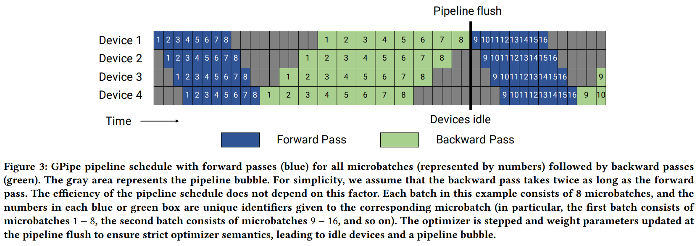


**1F1B （在流水线并行中，pipeline stage 前向计算和反向计算交叉进行的方式）流水线并行方式解决了这个问题。在 1F1B 模式下，前向计算和反向计算交叉进行，可以及时释放不必要的中间变量。他采用的是  default non\-interleaved 1F1B schedule**

和 GPipe 是同时期论文，但是因为做的更加精细，l理论上效果更好，但是实现上更加复杂，所以影响力不如GPipe。

Memory\-Efficient Pipeline\-Parallel DNN Training

https://arxiv\.org/abs/2006\.09503

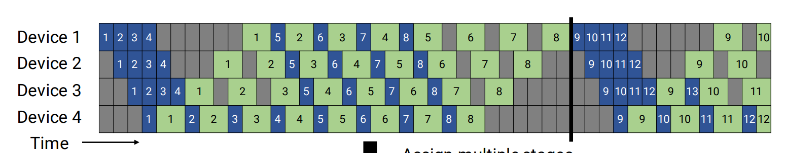

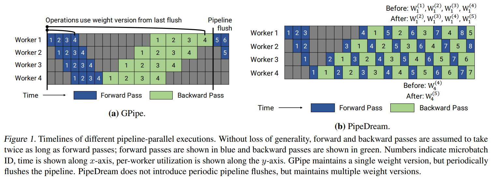

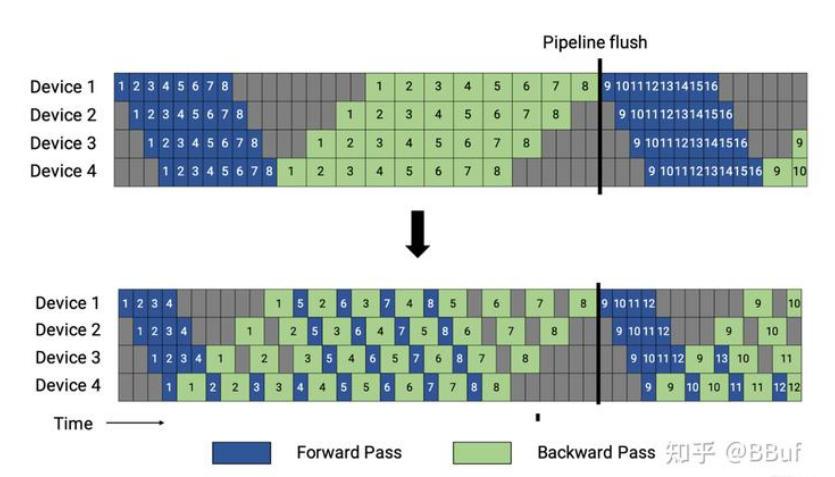

对于GPipe来说流水线中最长驻留了 m \(上图是 8\)个未完成的 micro batch\. 而 1F1B 则限制其最多驻留流水线深度 p \(上图是 4\) 个未完成的 micro batch，如此形成了上图中的下半部分的流水线。这个流水线的特点是一个迭代的时间没有变化，但是  p≪m ，所以驻留的未完成的 micro batch极大减少，减少了显存峰值。（**重点是减少了显存的峰值，但是气泡还是不变**）

链接：https://zhuanlan\.zhihu\.com/p/681363624


由于1F1B没有减少气泡大小，只是降低了显存占用峰值，所以后续Megatron\-LM里在1F1B的基础上做了Interleaved 1F1B的优化，减少了流水线气泡，也就是VPP。

Efficient Large\-Scale Language Model Training on GPU Clusters Using Megatron\-LM

https://arxiv\.org/pdf/2104\.04473

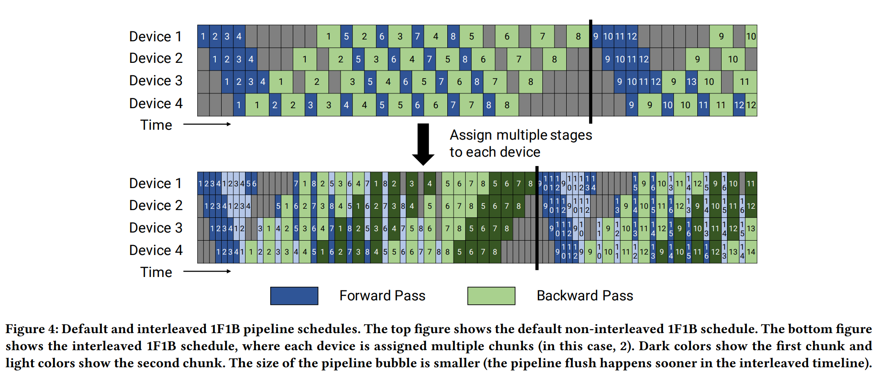

VPP的 idea 是让 micro batch （micro batch size 更小）更多来减少气泡，并且让一个 device 虚拟成 v 个 device，从计算 1个连续的 layer 段（有 xx 个 layer）变成计算 v 个不连续的 layer 段（每段 layer 数量为 x/v）。比如之前 1F1B 时 device 1 负责 layer 1\~4，device 2 负责 5\~8，在 Interleaved 1F1B 下 device 1 负责 layer 1\~2 和 9\~10，device 2 负责 3\~4 和 11\~12，这样可以让流水线中每个 stage 更小，因而下个 stage 的等待时间更短，气泡更小。需要注意的是， m 需要是 p 的整数倍

比如上图所示，

- t0: micro batch 0 \+ layer1\~4

- t1:micro batch 1 \+ layer1\~4

- t2:micro batch 2 \+ layer1\~4

- t3:micro batch 3 \+ layer1\~4

- t4: 由于在 t3 时候 device3 计算的是 micro batch 0 \+ layer 1\~4 的输出值，此时 device0 就可以基于这个输出开始算 micro batch0\+ layer5\~8 了

可以发现由于切的更细，并且虚拟设备更多，会导致 gpu 空闲时间更少了，但是点对点通信量增加了不少。

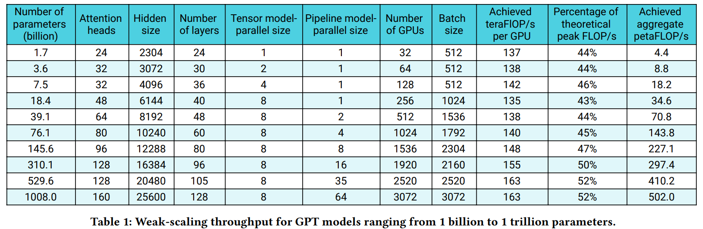

**可以看出，低于 18b 模型没有开启 pp 的必要，直接用 tp 就行了。**


https://www\.bilibili\.com/video/BV1nB4y1R7Yz/?spm\_id\_from=333\.788

https://www\.bilibili\.com/video/BV1tY411g7ZT/?spm\_id\_from=333\.788

# MONO\-INTERNVL

https://arxiv\.org/pdf/2410\.08202


# 参考文献

[深入理解 Megatron\-LM（1）基础知识](https://zhuanlan.zhihu.com/p/650234985)

[深入理解 Megatron\-LM（2）原理介绍](https://zhuanlan.zhihu.com/p/650383289)

[\[细读经典\]Megatron论文和代码详细分析\(1\)](https://zhuanlan.zhihu.com/p/366906920)

# DTensor

https://docs\.pytorch\.org/docs/stable/distributed\.tensor\.html

https://dev\-discuss\.pytorch\.org/t/dtensor\-status\-design\-and\-looking\-forward/2749

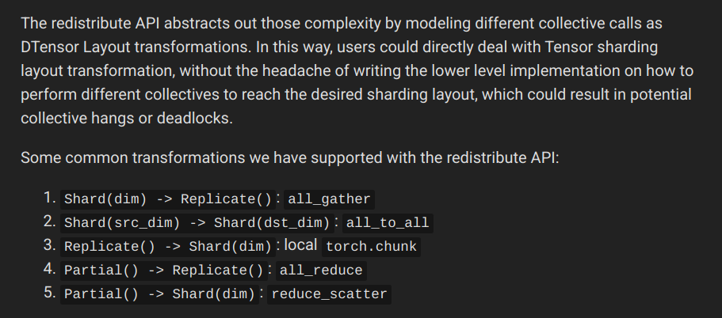

要记住这种布局。其余都好理解，partial 可能难理解点。

## **Partial（部分聚合）**

- **定义**: Partial 表示张量的每个设备存储的是张量的部分结果（通常是某种聚合操作的中间结果），需要进一步的全局通信（如 all\-reduce）来得到完整的张量。

- **特点**:

    - 每个设备存储的不是完整的张量，也不是张量的切片，而是某种中间状态。

    - 常用于分布式训练中的梯度聚合。

    - 需要额外的通信操作（如 reduce 或 all\-reduce）来合并结果。

- **示例**: 假设有一个张量 `[1, 2, 3, 4]`，在 2 个设备上进行 Partial 分布：

    - 设备 0 存储 `[1, 2]` 的部分和（如 `3`）

    - 设备 1 存储 `[3, 4]` 的部分和（如 `7`）

    - 最终通过 all\-reduce 得到全局和 `10`。

- **通俗理解**: Partial 就像每个人（设备）分别计算了一部分账单的金额，最后需要大家把金额汇总起来，得到总账单。


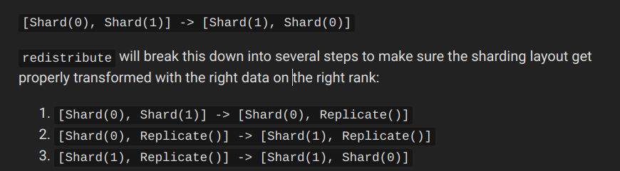


https://github\.com/pytorch/pytorch/issues/88838

https://github\.com/pytorch/pytorch/blob/main/torch/distributed/tensor/README\.md


# TP

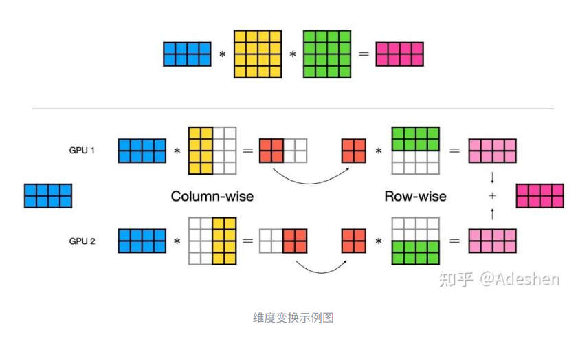


需要先看 Megatron\-LM 论文

https://arxiv\.org/pdf/1909\.08053


https://github\.com/pytorch/examples/tree/main/distributed/tensor\_parallelism

https://pytorch\.org/tutorials/intermediate/TP\_tutorial\.html

https://github\.com/pytorch/pytorch/issues/89884

https://discuss\.pytorch\.org/t/distributed\-w\-torchtitan\-introducing\-async\-tensor\-parallelism\-in\-pytorch/209487 TP 也可以通信和计算重叠,加速训练\.


1. PyTorch 的完全分片数据并行（FSDP）已经具备将模型训练扩展到特定数量 GPU 的能力。然而，当涉及到在模型大小和 GPU 数量方面进一步扩展模型训练时，会出现许多额外的挑战，这可能需要将张量并行与 FSDP 结合使用。随着世界规模（GPU 数量）的不断增加（超过 128/256 个 GPU），FSDP 的集合操作（如 allgather）受到环路延迟的主导。通过在 FSDP 之上实现张量并行/序列并行，FSDP 的世界规模可以通过仅在主机间应用 FSDP 来减少 8 倍，从而同样减少延迟成本。

2. 当达到数据并行性限制时，由于收敛和 GPU 内存的限制，您无法将全局批量大小提高到超过 GPU 数量，张量/序列并行是唯一已知的“粗略估算”全局批量大小并继续使用更多 GPU 扩展的方法。这意味着模型大小和 GPU 数量都可以继续扩展。

3. 对于某些类型的模型，当局部批量大小变小时时，TP/SP 可以产生更优化的矩阵乘法形状，以提高浮点运算（FLOPS）的效率。

那么，在预训练时，达到这些限制有多容易？截至目前，预训练一个拥有数十亿或数万亿个标记的大型语言模型（LLM）可能需要几个月，即使使用数千个 GPU。

在大规模训练 LLM 时，总是会遇到限制 1。例如，Llama 2 70B 在 2000 个 GPU 上训练了 35 天，在 2000 规模上需要多维度并行。

当变压器模型变得更大（如 Llama2 70B）时，也会迅速遇到限制 2。由于内存和收敛约束，即使局部批量大小为 1，也无法单独使用 FSDP。例如，Llama 2 的全局批量大小为 1K，因此在 2000 个 GPU 上无法仅使用数据并行。


张量并行是一种用于在多个GPU上适配大型模型的技术。例如,在将输入张量乘以第一个权重张量时,矩阵乘法相当于按列将权重张量拆分,将每一列单独与输入相乘,然后将单独的输出连接在一起。这些输出然后从GPU传输并连接在一起以获得最终结果,如下所示:

1. 将权重张量按列拆分为多个子张量,分布在不同的GPU上。

2. 在各自的GPU上,将输入张量与对应的权重子张量进行矩阵乘法运算。

3. 将各个GPU计算得到的中间结果张量传输回主机,并将它们连接在一起得到最终的输出张量。

这种方法可以充分利用多个GPU的并行计算能力,从而在保持模型精度不变的情况下,大幅提高大型模型的训练和推理效率。它广泛应用于深度学习等需要大规模计算的领域。

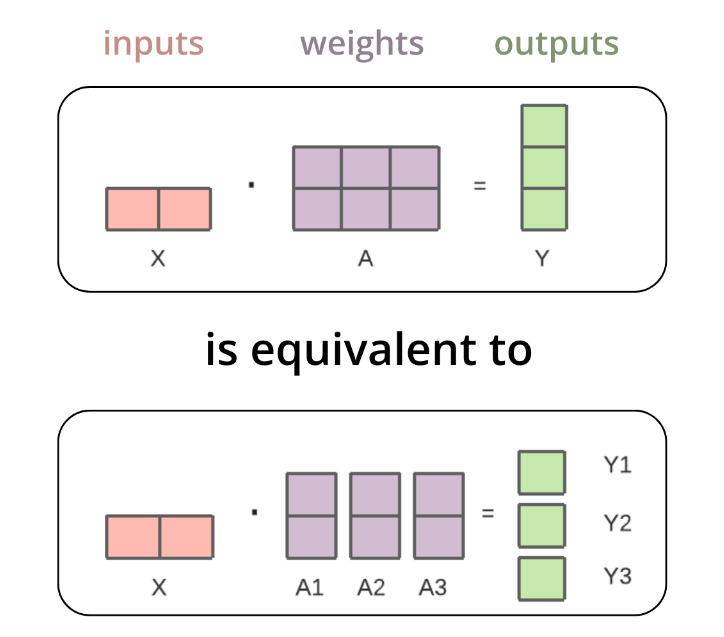

https://pytorch\.org/tutorials/intermediate/TP\_tutorial\.html

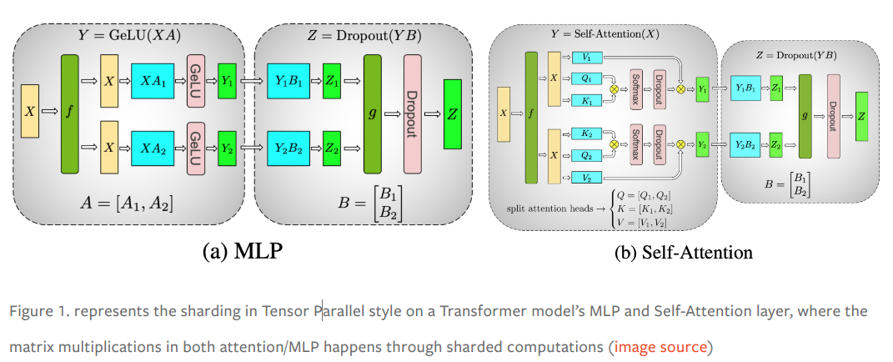

MLP 层是在权重维度进行切分，Self\-Attention 是在 Attention Head 维度进行切分。


# 新代码


# 旧版代码

## pack\_to\_max\_length

将数据集打包到最大长度，提升训练效率。

```Python
# 因为用了 batch map 因此输入和输出条数不一样了。
def pack_dataset(dataset, max_length, use_varlen_attn, shuffle_before_pack,
                 map_num_proc):
    if shuffle_before_pack:
        dataset = dataset.shuffle()
        # ***flatten_indices***() to write your ***dataset*** in contiguous chunks of data and have optimal speed before switching to an iterable ***dataset***.
        dataset = dataset.flatten_indices(num_proc=map_num_proc)
    dataset = dataset.map(
        Packer(max_length, use_varlen_attn=use_varlen_attn),
        batched=True, # 默认的 batch size 是 1000
        num_proc=map_num_proc)
    return dataset
```

首先需要理解 dataset\.map 中 batched=True 的含义

https://huggingface\.co/docs/datasets/en/about\_map\_batch

此处由于要 pack，因此必须要选择 batch map，否则可能数据都不够。

```Python
class Packer:
    """Pack multiple pieces of data into one."""

    def __init__(self,
                 chunk_size=2048, # 将数据打包成这个固定长度
                 use_varlen_attn=False,
                 drop_last=False):
        self.chunk_size = chunk_size
        self.residual = {'input_ids': [], 'labels': []} # 类似全局对象，在某一个进程中始终共享，但是不同进程肯定是隔离的，类似线程池
        self.drop_last = drop_last

    def __call__(self, batch):
        # 把输入的 batch size 条数据按照 key 合并到一起
        concatenated_samples = {
            k: v + list(chain(*batch[k]))
            for k, v in self.residual.items()
        }
        
        # 计算当前 batch 中每个 key 的数据长度
        total_length = len(concatenated_samples[list(
            concatenated_samples.keys())[0]])
         
        # 多了就要切
        if total_length >= self.chunk_size:
            chunk_num = total_length // self.chunk_size
            result = {
                k: [
                    v[i:i + self.chunk_size] for i in range(
                        0,
                        chunk_num *  # noqa: W504
                        self.chunk_size,
                        self.chunk_size)
                ]
                for k, v in concatenated_samples.items()
            }
            # 剩下的样本会留着，下一个 batch 来的时候会把些数据和新数据合并
            # 也就是说这个做法，只可能会丢掉最好的一点数据而已，影响不大
            self.residual = {
                k: v[(chunk_num * self.chunk_size):]
                for k, v in concatenated_samples.items()
            }
        else:
            # 少了则，要么全部丢了，要么保留(此时最后的数据就不是固定长度了)，因此长度可能不是 chunk size
            if self.drop_last:
                result = {k: [] for k, v in concatenated_samples.items()}
            else:
                result = {k: [v] for k, v in concatenated_samples.items()}
            # 注意这个很重要，因为下一次进入这个函数时候，这个对象是可以获取的 
            self.residual = {k: [] for k in concatenated_samples.keys()}
        return result
```

Pack 对象是作用于 input\_ids 和 labels。因为 input\_ids 是包括一次对话的输入和输出，因此可能会出现输入被截断或者输出被截断的现象。但是因为都是 next one token 预测所以没啥影响？

## default\_collate\_fn

通过上面处理，大部分数据都是等长的，不管是否等长，default\_collate\_fn 里面都要进行处理，确保长度一定一致。

```Python
def default_collate_fn(instances: Sequence[Dict],
                       pad_index: int = DEFAULT_PAD_TOKEN_INDEX,
                       return_hf_format: bool = False,
                       use_varlen_attn: bool = False):
    input_ids, labels = [], []
    for example in instances:
        input_ids.append(torch.LongTensor(example['input_ids']))
        labels.append(torch.LongTensor(example['labels']))

    ori_length = [len(ids) for ids in input_ids]
    if len(instances) > 1: # 多条数据
        input_ids = pad_sequence(
            input_ids, batch_first=True, padding_value=pad_index)
        labels = pad_sequence(
            labels, batch_first=True, padding_value=IGNORE_INDEX)
    else:
        # 只有一条数据，转换为 torch 格式
        input_ids = torch.stack(input_ids)
        labels = torch.stack(labels)

    # Some tokenizers have the same eos token and pad token, so input_ids
    # cannot be masked directly based on the pad token id.
    attention_mask = torch.zeros_like(input_ids).bool()
    for i in ori_length: # 不考虑 padding 位置
         attention_mask[:i] = True

    bs, seq_len = input_ids.shape
    position_ids = torch.arange(seq_len).unsqueeze(0).long().repeat(bs, 1)

    data_dict = {
            'input_ids': input_ids,
            'attention_mask': attention_mask,
            'position_ids': position_ids,
            'labels': labels
     }
    return {'data': data_dict, 'data_samples': None}
```

## Flash Attention 

是通过 dispatch 方式将原生 attention 替换为 flash attention 或者 SDPA

```Python
def _prepare_for_flash_attn(cfg, llm_cfg):
    cls_name = type(llm_cfg).__name__
    SUPPORT_SDPA_ATTN = ('LlamaConfig', 'GemmaConfig', 'MistralConfig',
                         'MixtralConfig', 'Qwen2Config', 'Qwen2MoeConfig',
                         'Starcoder2Config', 'Starcoder2Config',
                         'Phi3Config')
    SUPPORT_FLASH_ATTN2 = ('InternLM2Config', 'LlamaConfig', 'GemmaConfig',
                           'MistralConfig', 'MixtralConfig', 'Qwen2Config',
                           'Qwen2MoeConfig', 'Starcoder2Config',
                           'Starcoder2Config', 'Phi3Config')

    torch_dtype = torch.bfloat16 if (
        torch.cuda.is_available() and torch.cuda.is_bf16_supported()) \
        else torch.float16

    if getattr(cfg, 'attn_implementation', None) is not None:
        # Flash Attention 2.0 only supports torch.float16 and
        # torch.bfloat16 dtypes
        if cfg.attn_implementation == 'flash_attention_2':
            cfg.torch_dtype = torch_dtype
    elif SUPPORT_FLASH2 and cls_name in SUPPORT_FLASH_ATTN2:
        cfg.torch_dtype = torch_dtype
        cfg.attn_implementation = 'flash_attention_2'
    elif SUPPORT_FLASH1 and cls_name in SUPPORT_SDPA_ATTN:
        cfg.attn_implementation = 'sdpa'

    return cfg
```

也可以通过直接指定配置来设置。上述只是替换配置而已。真是替换是下面这个函数。

也就是说只要你指定了用 flash attention 就一定会换掉 attention，除非不在支持列表里面。不管你是否用了 varlen atten 和序列并行。

```Python
def dispatch_modules(model, use_varlen_attn=False):
    check_transformers_version(model)

    model_name = model.__class__.__name__.lower()
    if 'internlm2' in model_name:
        dispatch_internlm2_attn_forward(model, use_varlen_attn)
        if USE_TRITON_KERNEL: # 为了加速计算
            dispatch_internlm2_rmsnorm_forward(model)
        replace_internlm2_rote(model) # 为了确保精度正常
    elif 'internlm' in model_name:
        dispatch_internlm_attn_forward(model, use_varlen_attn)
        if USE_TRITON_KERNEL:
            dispatch_internlm_rmsnorm_forward(model)
        replace_internlm_rote(model)
    elif 'llama' in model_name:
        dispatch_llama_attn_forward(model, use_varlen_attn)
        if USE_TRITON_KERNEL:
            dispatch_llama_rmsnorm_forward(model)
    elif 'phi3' in model_name:
        dispatch_phi3_attn_forward(model, use_varlen_attn)
        if USE_TRITON_KERNEL:
            dispatch_phi3_rmsnorm_forward(model)
    elif 'baichuan' in model_name:
        dispath_baichuan2_norm_head_forward(model)
        dispath_baichuan_7b_attn_forward(model)
        dispath_baichuan_13b_attn_forward(model)
    elif 'yi' in model_name:
        dispatch_yi_attn_forward(model)
    elif ('mistral' in model_name) or ('mixtral' in model_name):
        dispatch_mistral_attn_forward(model, use_varlen_attn)
        if USE_TRITON_KERNEL:
            dispatch_mistral_rmsnorm_forward(model)
        replace_mistral_rote(model)
        if 'moe' in model_name and is_deepspeed_zero3_enabled():
            set_mixtral_moe_blocks_z3_leaf_modules(model)
    elif 'cohere' in model_name:
        dispatch_cohere_attn_forward(model, use_varlen_attn)
        dispatch_cohere_layernorm_forward(model)
    elif 'qwen2' in model_name:
        # qwen2 and qwen2moe
        dispatch_qwen2_attn_forward(model, use_varlen_attn)
        if USE_TRITON_KERNEL:
            dispatch_qwen2_rmsnorm_forward(model)
        if 'moe' in model_name and is_deepspeed_zero3_enabled():
            set_qwen_moe_blocks_z3_leaf_modules(model)
```

### replace\_internlm2\_rote

这个函数主要做的事情是确保 InternLM2RotaryEmbedding 里面的计算都是 float32 的，否则精度可能会有损失。

原先的写法：

```Python
class InternLM2RotaryEmbedding(nn.Module):
    def __init__(self, dim, max_position_embeddings=2048, base=10000, device=None):
        super().__init__()

        self.dim = dim
        self.max_position_embeddings = max_position_embeddings
        self.base = base
        inv_freq = 1.0 / (self.base ** (torch.arange(0, self.dim, 2).float().to(device) / self.dim))
        self.register_buffer("inv_freq", inv_freq, persistent=False) # 核心代码

        *# Build here to make `torch.jit.trace` work.*
        self._set_cos_sin_cache(
            seq_len=max_position_embeddings, device=self.inv_freq.device, dtype=torch.get_default_dtype()
        )

    def _set_cos_sin_cache(self, seq_len, device, dtype):
        self.max_seq_len_cached = seq_len
        t = torch.arange(self.max_seq_len_cached, device=device, dtype=self.inv_freq.dtype)

        freqs = torch.einsum("i,j->ij", t, self.inv_freq)
        *# Different from paper, but it uses a different permutation in order to obtain the same calculation*
        emb = torch.cat((freqs, freqs), dim=-1)
        self.register_buffer("cos_cached", emb.cos().to(dtype), persistent=False)
        self.register_buffer("sin_cached", emb.sin().to(dtype), persistent=False)

    def forward(self, x, seq_len=None):
        *# x: [bs, num_attention_heads, seq_len, head_size]*
        if seq_len > self.max_seq_len_cached:
            self._set_cos_sin_cache(seq_len=seq_len, device=x.device, dtype=torch.float32)

        return (
            self.cos_cached[:seq_len].to(dtype=x.dtype),
            self.sin_cached[:seq_len].to(dtype=x.dtype),
        )
```

上面的代码意思是基于预设的 max\_position\_embeddings 提前缓存所有的位置编码系数。初始化时候算的是在 flota32 上计算的，在运行时候转为 bf16 输出。

但是如果用户更改了 max\_position\_embeddings 或者说运行时候的 seq\_len 大于 max\_position\_embeddings，此时就要重新计算。

所以虽然模块在初始化时候是 float32 的，但是在 deepspeed 初始化引擎时候会把类型强制改成 bf16，导致重计算时候  \_set\_cos\_sin\_cache 是在 bf16 上算，长上下文会出现上界精度损失。

Deepspeed 修改模型类型，如果是 zero3 则会在 from\_pretrain 时刻进行，否则是在 engine\.init 时候。

修改为下面写法就可以避免精度损失：

```Python
class InternLM2RotaryEmbedding(torch.nn.Module):

    def __init__(self,
                 dim,
                 max_position_embeddings=2048,
                 base=1000000, # 改这个参数就可以实现线性外推
                 device=None):
        super().__init__()
        self.dim = dim
        self.max_position_embeddings = max_position_embeddings
        self.base = base
**        # 核心就是把 inv_freq 不设置为 buffer，deepspeed to model 时候就不会改这个参数了**
        self.inv_freq = 1.0 / (
            base**(torch.arange(0, dim, 2).float().to(device) / dim))

        # Build here to make `torch.jit.trace` work.
        self.max_seq_len_cached = max_position_embeddings
        t = torch.arange(
            self.max_seq_len_cached,
            device=self.inv_freq.device,
            dtype=self.inv_freq.dtype)
        freqs = torch.einsum('i,j->ij', t, self.inv_freq)
        emb = torch.cat((freqs, freqs), dim=-1)
        self.cos_cached = emb.cos()
        self.sin_cached = emb.sin()

    def forward(self, x, seq_len):
        # x: [bs, num_attention_heads, seq_len, head_size]
        if (seq_len > self.max_seq_len_cached
                or self.cos_cached.device != x.device
                or self.cos_cached.dtype != x.dtype):
            self.max_seq_len_cached = seq_len
            assert self.inv_freq.dtype == torch.float32
            t = torch.arange(
                self.max_seq_len_cached,
                device=x.device,
                dtype=self.inv_freq.dtype)
            freqs = torch.einsum('i,j->ij', t, self.inv_freq.to(t.device))
            emb = torch.cat((freqs, freqs), dim=-1).to(x.device)
            self.cos_cached = emb.cos().to(x.dtype)
            self.sin_cached = emb.sin().to(x.dtype)
        return (
            self.cos_cached[:seq_len, ...],
            self.sin_cached[:seq_len, ...],
        )
```

在 llama 模型里面其实已经处理了，所以这些模型就不需要 hack 掉。

```Python
class LlamaRotaryEmbedding(nn.Module):
    def __init__(self, dim, max_position_embeddings=2048, base=10000, device=None, scaling_factor=1.0):
        super().__init__()
        self.scaling_factor = scaling_factor
        self.dim = dim
        self.max_position_embeddings = max_position_embeddings
        self.base = base
        inv_freq = 1.0 / (self.base ** (torch.arange(0, self.dim, 2, dtype=torch.int64).float().to(device) / self.dim))
        self.register_buffer("inv_freq", inv_freq, persistent=False)
        # For BC we register cos and sin cached
        self.max_seq_len_cached = max_position_embeddings
        t = torch.arange(self.max_seq_len_cached, device=device, dtype=torch.int64).type_as(self.inv_freq)
        t = t / self.scaling_factor
        freqs = torch.outer(t, self.inv_freq)
        # Different from paper, but it uses a different permutation in order to obtain the same calculation
        emb = torch.cat((freqs, freqs), dim=-1)
        self.register_buffer("_cos_cached", emb.cos().to(torch.get_default_dtype()), persistent=False)
        self.register_buffer("_sin_cached", emb.sin().to(torch.get_default_dtype()), persistent=False)

    @torch.no_grad()
    def forward(self, x, position_ids):
        # x: [bs, num_attention_heads, seq_len, head_size]
        # 不用缓存了，强制计算
        inv_freq_expanded = self.inv_freq[None, :, None].float().expand(position_ids.shape[0], -1, 1)
        position_ids_expanded = position_ids[:, None, :].float()
        # 在长上下文时候，值比较大，bf16 精度不够
        # Force float32 since bfloat16 loses precision on long contexts
        # See https://github.com/huggingface/transformers/pull/29285
        device_type = x.device.type
        device_type = device_type if isinstance(device_type, str) and device_type != "mps" else "cpu"
        with torch.autocast(device_type=device_type, enabled=False):
            # 核心代码
            freqs = (inv_freq_expanded.float() @ position_ids_expanded.float()).transpose(1, 2)
            emb = torch.cat((freqs, freqs), dim=-1)
            cos = emb.cos()
            sin = emb.sin()
        return cos.to(dtype=x.dtype), sin.to(dtype=x.dtype)
```

### max\_position\_embeddings

这个是用于 rope 的，用于指定最大上下文长度。

- 如果 base 训练时候最大是 4k，那么可以设置为 4k

- 如果基于 base 再训练，数据大于 4k，例如变成了 8k，则需要重新设置这个参数，相当于位置编码参数进行了线性插值，然后再训练就会更好。如果数据变成了 8k，但是 max\_position\_embeddings 还是 4k，代码不会报错，但是估计性能很差，因为位置编码都没有见过

- 如果只是超过一点点，则可以不改，应该影响不大


修改 max\_position\_embeddings 后续的逻辑为：

1. 重新计算 scaling\_factor，线性缩放

```Python
current_max_length = getattr(llm_cfg, 'max_position_embeddings', None)
scaling_factor = float(
    math.ceil(max_position_embeddings / current_max_length))
cfg.rope_scaling = {'type': 'linear', 'factor': scaling_factor}    
```

2. Hf 里面会基于这个 rope\_scaling，重新初始化旋转 emb，自动选择 InternLM2LinearScalingRotaryEmbedding

```Python
scaling_type = self.config.rope_scaling["type"]
            scaling_factor = self.config.rope_scaling["factor"]
            if scaling_type == "dynamic":
                self.rotary_emb = InternLM2DynamicNTKScalingRotaryEmbedding(
                    self.head_dim,
                    max_position_embeddings=self.max_position_embeddings,
                    base=self.config.rope_theta,
                    scaling_factor=scaling_factor,
                )
            elif scaling_type == "linear":
                self.rotary_emb = InternLM2LinearScalingRotaryEmbedding(
                    self.head_dim,
                    max_position_embeddings=self.max_position_embeddings,
                    base=self.config.rope_theta,
                    scaling_factor=scaling_factor,
                )
```

- 一般如果训练完成后，想有更好的线性外推，可以选择 InternLM2DynamicNTKScalingRotaryEmbedding，纯部署用

- 如果线性插值后要训练，那可以选择 InternLM2LinearScalingRotaryEmbedding

- 应用场合不一样

## Varlen Attention

必须要 flash attention 才支持，目前是通过 dispatch 实现的。

- 如果开了 use\_varlen\_attn 那么目前只支持 batch=1，原理上实现任意 bs 没问题

- 如果想增加 bs，可以增加 max\_length，相当于等价加大了

- 既然用了 varlen，那么 pack\_to\_max\_length 必然要开

https://blog\.csdn\.net/qq\_16555103/article/details/138287633

- 函数通过 `cu_seqlens_q` 和 `cu_seqlens_k` 参数接收每个序列的累积长度,可以有效处理变长序列的情况

```Python
def flash_attn_varlen_func(
    q, # 输入的 query 张量,形状为 (total_q, nheads, headdim),其中 total_q 是批量中所有查询token的总数,nheads 是注意力头数,headdim 是每个注意力头的维度
    k, # 输入的 key 张量,形状为 (total_k, nheads_k, headdim),其中 total_k 是批量中所有 key token的总数,nheads_k 是 key 的注意力头数,headdim 是每个注意力头的维度
    v, # 输入的 value 张量,形状为 (total_k, nheads_k, headdim),其中 total_k 是批量中所有 key token的总数,nheads_k 是 key 的注意力头数,headdim 是每个注意力头的维度
    cu_seqlens_q, # 批量中每个查询序列的累积长度,形状为 (batch_size + 1,),数据类型为 torch.int32,用于从 q 中索引相应的位置
    cu_seqlens_k, # 批量中每个 key 序列的累积长度,形状为 (batch_size + 1,),数据类型为 torch.int32,用于从 k 和 v 中索引相应的位置
    max_seqlen_q, # 批量中最大查询序列长度
    max_seqlen_k, # 批量中最大 key 序列长度
    dropout_p=0.0, # Dropout 率,在评估(evaluation)时应设置为 0.0
    softmax_scale=None, # softmax 缩放因子,默认为 1 / sqrt(headdim)
    causal=False, # 是否应用因果注意力掩码,用于自回归(auto-regressive)建模
    window_size=(-1, -1), # 用于实现滑动窗口局部注意力,(-1, -1) 表示无限制上下文窗口
    alibi_slopes=None, # 用于添加注意力分数偏置,形状为 (nheads,) 或 (batch_size, nheads),数据类型为 fp32
    deterministic=False, # 是否使用确定性反向传播实现,比非确定性实现稍慢但使用更多内存,前向传播始终是确定性的
    return_attn_probs=False, # 是否返回注意力概率,仅用于测试,返回的概率可能不具有正确缩放
    block_table=None # 可选的块表,用于分块稀疏注意力
):
    """
    解决问题: 计算变长序列的注意力输出,其中 query、key 和 value 是分开的张量。支持多查询注意力(MQA)和分组查询注意力(GQA)。
    注意事项:
    - dropout_p 应在评估时设置为 0.0。
    - 支持多查询注意力(MQA)和分组查询注意力(GQA),通过将 K、V 的注意力头数设置为少于 Q 的注意力头数来实现。Q 的注意力头数必须能被 K、V 的注意力头数整除。
      例如,如果 Q 有 6 个注意力头,K、V 有 2 个注意力头,那么 Q 的头 0、1、2 将关注 K、V 的头 0,Q 的头 3、4、5 将关注 K、V 的头 1。
    - 如果 causal=True,因果掩码将与注意力矩阵的右下角对齐。
      例如,如果 seqlen_q = 2 且 seqlen_k = 5,因果掩码(1 = 保留,0 = 掩码)为:
        1 1 1 1 0
        1 1 1 1 1
      如果 seqlen_q = 5 且 seqlen_k = 2,因果掩码为:
        0 0
        0 0
        0 0
        1 0
        1 1
      如果掩码的一行全为零,输出也将为零。
    - 如果 window_size != (-1, -1),则实现滑动窗口局部注意力。位置 i 的查询将只关注位于 [i + seqlen_k - seqlen_q - window_size[0], i + seqlen_k - seqlen_q + window_size[1]] 范围内的 key。
    - 可以通过提供 block_table 参数来启用分块稀疏注意力。
    返回值:
    - out: 注意力层的输出张量,形状为 (total, nheads, headdim),其中 total = total_q。
    - softmax_lse [可选,如果 return_attn_probs=True]: 每行的 QK^T * scaling 的 logsumexp 值,形状为 (batch_size, nheads, seqlen),即 softmax 归一化因子的对数。
    - S_dmask [可选,如果 return_attn_probs=True]: softmax 的输出,可能具有不同的缩放,形状为 (batch_size, nheads, seqlen, seqlen),还编码了 Dropout 模式(负值表示该位置被丢弃,非负值表示该位置被保留)。
    """
    return FlashAttnVarlenFunc.apply(
        q, # 输入的 query 张量
        k, # 输入的 key 张量
        v, # 输入的 value 张量
        cu_seqlens_q, # 批量中每个查询序列的累积长度，类似 0 59 78 400 1024
        cu_seqlens_k, # 批量中每个 key 序列的累积长度
        max_seqlen_q, # 批量中最大查询序列长度 上述序列中，原始最长序列长度
        max_seqlen_k, # 批量中最大 key 序列长度
        dropout_p, # Dropout 率
        softmax_scale, # softmax 缩放因子
        causal, # 是否应用因果注意力掩码
        window_size, # 用于实现滑动窗口局部注意力
        alibi_slopes, # 用于添加注意力分数偏置
        deterministic, # 是否使用确定性反向传播实现
        return_attn_probs, # 是否返回注意力概率
        block_table, # 可选的块表,用于分块稀疏注意力
    )
```

```Python
def flash_attn_wo_mask(
        query_states,
        key_states,
        value_states,
        dropout_p=0.0,
        softmax_scale=None,
        causal=True,
        window_size=(-1, -1),  # -1 means infinite context window
):
    attn_output = flash_attn_func(
        query_states,
        key_states,
        value_states,
        dropout_p=dropout_p,
        softmax_scale=softmax_scale,
        causal=causal,
        window_size=window_size)
    return attn_output
```

对于没有用户指定的任意 mask 场景，可以调用 flash\_attn\_func 函数实现高效 attention。


对于有 attention mask 场景，flash attention 也是通过 varlen attention 接口实现的

```Python
def flash_attn_w_mask(
        query_states,  # bs, q_len, nhead, h_dim
        key_states,
        value_states,
        **attention_mask**,
        causal=True,
        dropout_p=0.0,
        window_size=(-1, -1),  # -1 means infinite context window
):
    batch_size, q_len = query_states.shape[:2]
    query_states, key_states, value_states, indices_q, \
        cu_seq_lens, max_seq_lens = upad_qkv(
            query_states, key_states, value_states, attention_mask, q_len)

    cu_seqlens_q, cu_seqlens_k = cu_seq_lens
    max_seqlen_in_batch_q, max_seqlen_in_batch_k = max_seq_lens
    attn_output_unpad = **flash_attn_varlen_func**(
        query_states,
        key_states,
        value_states,
        cu_seqlens_q=cu_seqlens_q,
        cu_seqlens_k=cu_seqlens_k,
        max_seqlen_q=max_seqlen_in_batch_q,
        max_seqlen_k=max_seqlen_in_batch_k,
        dropout_p=dropout_p,
        causal=causal,
        window_size=window_size)
    attn_output = pad_input(attn_output_unpad, indices_q, batch_size, q_len)
    return attn_output
```

https://github\.com/lm\-sys/FastChat/blob/main/fastchat/train/llama\_flash\_attn\_monkey\_patch\.py\#L13


一个非常简单的例子演示 varlen attenion 输入组织过程

```Python
# varlen attention 结果可视化

# 假设一共有 12 个样本，每个样本的序列长度为 2~5 内随机，希望变成序列长度都是 10 的var len 序列进行训练

# 1. 生成原始数据
import random
from itertools import chain
import numpy as np
import torch

random.seed(42)
n_samples = 12
chunk_size = 10
max_seq_len = 5
min_seq_len = 2
data = []
for i in range(n_samples):
    seq_len = random.randint(min_seq_len, max_seq_len)
    data.append([i] * seq_len)
# [[0, 0], [1, 1], [2, 2, 2, 2], [3, 3, 3], [4, 4, 4], [5, 5, 5], [6, 6], [7, 7], [8, 8, 8, 8, 8], [9, 9], [10, 10], [11, 11]]
print(data)

# 2. 假设一次性全部输入，然后进行打包，截断处理
concatenated_samples = list(chain(*data))
# [0, 0, 1, 1, 2, 2, 2, 2, 3, 3, 3, 4, 4, 4, 5, 5, 5, 6, 6, 7, 7, 8, 8, 8, 8, 8, 9, 9, 10, 10, 11, 11]
print(concatenated_samples)

residual_cumulative_len = [0]
for input_id in data:
    residual_cumulative_len.append(
        residual_cumulative_len[-1] + len(input_id))
# [0, 2, 4, 8, 11, 14, 17, 19, 21, 26, 28, 30, 32]
print(residual_cumulative_len)  # 计算每个原始序列的累积长度

total_length = len(concatenated_samples)
chunk_num = total_length // chunk_size

# 截断
out_res = []
for i in range(0,
               chunk_num * chunk_size,
               chunk_size):
    result = concatenated_samples[i:i + chunk_size]
    out_res.append(result)
# [[0, 0, 1, 1, 2, 2, 2, 2, 3, 3], [3, 4, 4, 4, 5, 5, 5, 6, 6, 7], [7, 8, 8, 8, 8, 8, 9, 9, 10, 10]]
print(out_res)  # 剩下的暂时不考虑

# 计算每个序列的累积长度和位置编码
ptr_l = 0
cumulative_len = []
for chunk_idx in range(chunk_num):
    length_train = (chunk_idx + 1) * chunk_size
    ptr_r = np.searchsorted(
        residual_cumulative_len, length_train, side='left')
    if residual_cumulative_len[ptr_r] == length_train:  # 是否当前指向的前序所有数据长度和正好是一个chunk的长度
        cumulative_len_cur = \
            residual_cumulative_len[ptr_l:ptr_r + 1]
        ptr_l = ptr_r + 1
    else:
        cumulative_len_cur = residual_cumulative_len[
                             ptr_l:ptr_r] + [length_train]  # 如果不是，则需要截断到当前chunk的长度 0 58 74 ... 2043 2048
        ptr_l = ptr_r
    cumulative_len_cur = [  # 减掉之前chunk_idx个chunk的长度，确保数据是连续的，并没有截断
        num - chunk_idx * chunk_size for num in cumulative_len_cur
    ]
    if cumulative_len_cur[0] != 0:
        cumulative_len_cur = [0] + cumulative_len_cur

    cumulative_len.append(cumulative_len_cur)  # 相当于是 batch 维度了

# [[0, 2, 4, 8, 10], [0, 1, 4, 7, 9, 10], [0, 1, 6, 8, 10]]
print(cumulative_len)

position_ids = []
for cumulative_len_cur in cumulative_len:
    index_cur = []
    for i in range(len(cumulative_len_cur) - 1):
        index_cur.extend(
            list(
                range(cumulative_len_cur[i + 1] -  # noqa: W504
                      cumulative_len_cur[i])))
    position_ids.append(index_cur)
# [[0, 1, 0, 1, 0, 1, 2, 3, 0, 1], [0, 0, 1, 2, 0, 1, 2, 0, 1, 0], [0, 0, 1, 2, 3, 4, 0, 1, 0, 1]]
print(position_ids)

max_seqlens = []
for c_len in cumulative_len:
    c_len = torch.IntTensor(c_len)
    max_seqlen = (c_len[1:] - c_len[:-1]).max().item()
    max_seqlens.append(max_seqlen)
print(max_seqlens)  # [4, 3, 5]

# attn_output_unpad = flash_attn_varlen_func(
#         query_states,
#         key_states,
#         value_states,
#         cu_seqlens_q=cu_seqlens_q, # cumulative_len
#         cu_seqlens_k=cu_seqlens_k, # cumulative_len
#         max_seqlen_q=max_seqlen_in_batch_q, # max_seqlens
#         max_seqlen_k=max_seqlen_in_batch_k, # max_seqlens
#         dropout_p=dropout_p,
#         causal=causal,
#         window_size=window_size)
```

## 序列并行

原理： **DeepSpeed Ulysses**

https://arxiv\.org/abs/2309\.14509

[readpaper\.com](https://readpaper.com/paper/4804612925926932481)

主要用于长序列训练场合。

DeepSpeed\-Ulyses 核心在其沿序列维度划分输入数据，并采用高效的全对全集体通信进行注意力计算。

DeepSpeedUlysesses 沿参与 GPU 之间的序列维度划分单个样本。然后，在注意力计算之前，它在分区查询、键和值上使用全到全的通信集体，以便每个 GPU 接收完整的序列，但仅适用于注意力头的非重叠子集。这允许参与的 GPU 并行计算不同注意力头的注意力。最后，DeepSpeed\-Ulyses 采用另一个全对全的方法沿注意力头收集结果，同时沿序列维度重新划分。

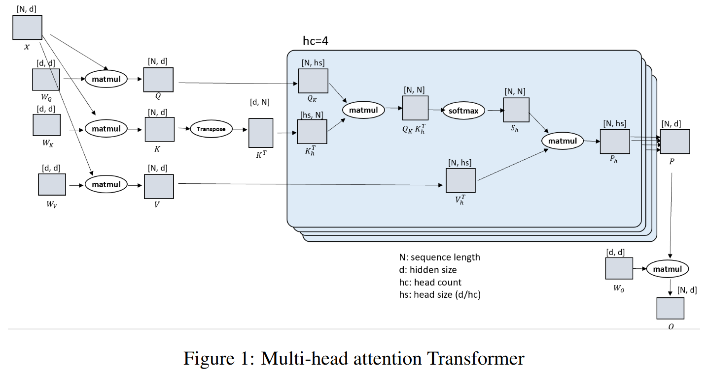

上述为原始的 MH Attention 计算过程。

- 对 x 分别进行投影，得到 QKV 矩阵

- 假设 hc=4，那么就是把 QKV 矩阵的隐含层维度切分为 4 份，每一份单独进行自注意力计算

- 计算完成后，将 4 份拼接起来得到 P

- 经过输出层映射得到 O

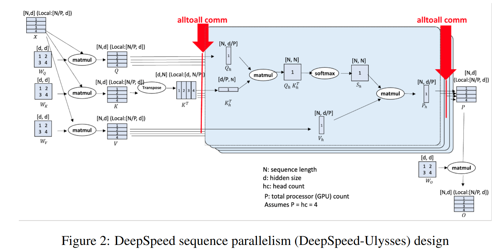

上述是序列并行核心原理。

~~P 是分片数，假设序列长度是 32k，单卡 bs=2，P=4，那么原先每张卡的 bs=2，len=32k，现在变成了每张卡的 bs=8，len=8k。然后假设分片个数等于 head 个数。~~

~~为了简化逻辑，假设 bs=1，N=32k，P=4，那么就是把 32k 分成了 4 个 8k 的序列，可能跨卡了。~~

- ~~假设原始输入是 \(32k,d\)，现在变成了 \(4, 8k, d\)~~

- ~~每个 8k 单独进行投影得到 QKV \-\> \(4, 8K, d\)~~

- ~~通过 all\-to\-all 通信，Q 变成了 \(32k, d/4\) 正好变成了 head 个数~~

- ~~经过自注意力计算，输出 \(32k, d/4\) 然后再通过 all\-to\-all 通信，又变成 \(4,8k,d\)~~


可以看到自注意力模块的计算中，计算量有减少。从上述可以看到，上述有限制：序列切分数必须要能够被 head count 数整除，并且序列切分数最大不能超过 head count。这会限制应用，比如 7b 模型 head count 数不大，此时序列并行数就无法开大，导致 7b\+ 超长序列训练不了。当然序列切分数必须要被 gpu 数整除，否则无法均分到不同卡上。


序列并行的分布式进程初始化部分理解，核心是要确保某一条数据必须分到某几个卡上，这样后续切分后才能正确通信，如果乱切，后面无法通信还原

```Python
import torch.multiprocessing as mp
import os
import torch
from torch import distributed as dist

_SEQUENCE_PARALLEL_GROUP = None
_SEQUENCE_PARALLEL_WORLD_SIZE = None
_SEQUENCE_PARALLEL_RANK = None

_DATA_PARALLEL_GROUP = None
_DATA_PARALLEL_WORLD_SIZE = None
_DATA_PARALLEL_RANK = None


def main(functions, world_size=2, backend='gloo', start_method='spawn'):
    try:
        mp.start_processes(init_process,
                           args=(world_size, functions, backend),
                           nprocs=world_size,
                           start_method=start_method)
    except Exception:
        raise RuntimeError('----failed-----')


def init_process(rank, world_size, functions, backend='gloo'):
    *"""Initialize the distributed environment."""*
*    *os.environ['MASTER_ADDR'] = '127.0.0.1'
    os.environ['MASTER_PORT'] = '29505'
    os.environ['RANK'] = str(rank)

    if backend == 'nccl':
        num_gpus = torch.cuda.device_count()
        torch.cuda.set_device(rank % num_gpus)
        device = 'cuda'
    else:
        device = 'cpu'

    dist.init_process_group(
        backend=backend, rank=rank, world_size=world_size)

    assert dist.is_initialized()
    world_size: int = dist.get_world_size()

    sequence_parallel_size = 4
    num_sequence_parallel_groups: int = world_size // sequence_parallel_size
    rank = dist.get_rank()

    global _SEQUENCE_PARALLEL_GROUP
    assert _SEQUENCE_PARALLEL_GROUP is None, \
        'sequence parallel group is already initialized'
    # 假设一共 32 张卡，sequence_parallel_size=4，也就是要分成 8 个组
    # ranks = [0,1,2,3],[4,5,6,7],[8,9,10,11],[12,13,14,15],[16,17,18,19],[20,21,22,23],[24,25,26,27],[28,29,30,31]
    # 此时 sp world_size=4, sp group0=[0,1,2,3]
    # 如果此时 get_world_size()=4, get_rank()=0,1,2,3, 也就是 gpu0 4 8 12 16 20 24 28 都是 rank0
    # 后续会将每条长序列分成 4 份，后续的 all-to-all 是在这 4 份内进行的，也就是上述的 ranks 集合内部通讯，而不是全部 32 张卡通讯
    for i in range(num_sequence_parallel_groups):
        ranks = range(i * sequence_parallel_size,
                      (i + 1) * sequence_parallel_size)
        group = dist.new_group(ranks)
        # 每个组内部构成 1 个新的group，后面方便通讯
        if rank in ranks:
            _SEQUENCE_PARALLEL_GROUP = group

    global _DATA_PARALLEL_GROUP
    assert _DATA_PARALLEL_GROUP is None, \
        'data parallel group is already initialized'
    all_data_parallel_group_ranks = []
    start_rank = 0
    end_rank = world_size
    # 分布式通信一开始是知道一共 32 卡的，他的 rank 是 0-31
    # 现在进行了新建_DATA_PARALLEL_GROUP内部组，在这个新建内部组的作用域内，gpu0~31 实际上一共对应 rank0~8 而不是 rank0~31

    # 假设一共 32 张卡，sequence_parallel_size=4
    # ranks = [rank0,rank1,... rank7],[rank0,rank1,... rank7],[rank0,rank1,... rank7],[rank0,rank1,... rank7]
    # ranks = [0,4,8,12,16,20,24,28],[1,5,9,13,17,21,25,29],[2,6,10,14,18,22,26,30],[3,7,11,15,19,23,27,31]
    # 此时 dp world_size=8 dp group0=[0,1,2,3]
    # 如果此时 get_world_size()=8, get_rank()=0,1,2,3,4,5,6,7, 也就是 gpu0 1 2 3 都是 rank0, gpu4 5 6 7 都是 rank1
    # 上述这种切分方法，就可以将某一条数据都分到 gpu0 1 2 3 上，因为 rank 相同

    # data sampler 需要保证 _SEQUENCE_PARALLEL_GROUP 内的数据一样，也就是前面的 [0,1,2,3] 里面的数据是一样的，这样才能将一条数据切分为 4 份而不出错
    # 假设一共 32 卡，数据一共 100 条，world_size 为 32，之前的逻辑是第 0 条数据给 rank0, 第 1 条数据给 rank1,,, 第 31 条数据给 rank31,第 32 条数据给 rank0
    # 现在由于 world_size 变成了 8，因此第 0 条数据给 gpu0 1 2 3, 第 1 条数据给 gpu4 5 6 7, 第 2 条数据给 gpu0 1 2 3, 第 3 条数据给 gpu4 5 6 7
    for j in range(sequence_parallel_size):
        ranks = range(start_rank + j, end_rank, sequence_parallel_size)
        all_data_parallel_group_ranks.append(list(ranks))
        group = dist.new_group(ranks)
        # 每个组内部构成 1 个新的group,rank 从 0 到 7
        if rank in ranks:
            _DATA_PARALLEL_GROUP = group

    for func in functions:
        func(device)


def ddp_demo(device):
    sp_rank = dist.get_rank(group=_SEQUENCE_PARALLEL_GROUP)
    sp_world_size = dist.get_world_size(group=_SEQUENCE_PARALLEL_GROUP)

    dp_rank = dist.get_rank(group=_DATA_PARALLEL_GROUP)
    dp_world_size = dist.get_world_size(group=_DATA_PARALLEL_GROUP)

    global_rank = dist.get_rank()
    global_world_size = dist.get_world_size()

    print(f'======{global_rank}/{global_world_size}, {sp_rank}/{sp_world_size}, {dp_rank}/{dp_world_size}=====', flush=True)


if __name__ == '__main__':
    functions = [ddp_demo]
    total_gpus = 32
    backend = 'gloo'

    main(functions, total_gpus, backend, start_method='spawn')
```

由于每条训练数据的长度可能不尽相同，我们需要将数据进行 Pad 以使得序列长度可以被 sequence\_parallel\_world\_size 整除，这样一条长数据才能被均等地分发给不同的 GPU 上。Pad 后，我们需要对长序列均等切分，代码都在 `default_collate`n 里面。


确保输入数据能被序列并行长度seq\_parallel\_world\_size 整除，否则有问题。

```Python
def pad_for_sequence_parallel(tensor, padding_value, dim=-1):
    length = tensor.shape[dim]
    seq_parallel_world_size = get_sequence_parallel_world_size()
    if length % seq_parallel_world_size == 0:
        return tensor

    pad_num = seq_parallel_world_size - (length % seq_parallel_world_size)
    pad_shape = (*tensor.shape[:dim], pad_num,
                 *tensor.shape[dim + 1:]) if dim != -1 else (
                     *tensor.shape[:dim], pad_num)
    pad = torch.full(
        pad_shape, padding_value, dtype=tensor.dtype, device=tensor.device)
    tensor = torch.cat([tensor, pad], dim=dim)
    return tensor
```

以上就是数据处理相关代码，后面的所有代码都在 sft\.py 里面了。


开始训练前，要把数据进行分组，其实就是一条数据切分为 4 条

```Python
def _split_for_sequence_parallel(data):
    # attention mask should not be split
    ARGS_NEED_TO_SPLIT = ('input_ids', 'labels', 'position_ids')
    sp_group = get_sequence_parallel_group()
    for key in ARGS_NEED_TO_SPLIT:
        val = data.get(key, None)
        if val is not None:
            # `dim` is 1 as the shape of tensor is (bs, seq_len, ...)
            data[key] = split_for_sequence_parallel(
                val, dim=1, sp_group=sp_group)
    return data
```

可以看出，并不是说 batch size 变成了，实际上 batch size 没有变，只是同样的 dataset 时候，global iter 数变长了 4 倍而已，因为有 4 张卡的数据其实是完全一样的。只是每个 rank 取自己需要的部分而已。

Sp 应该有好几种实现，例如可以通过增加 batch size 来实现，但是可能容易 OOM。

```Python
def split_for_sequence_parallel(input, dim: int, sp_group: dist.ProcessGroup):
    *"""Splits the input tensor along a given dimension for sequence parallel.*

*    Args:*
*        input: The input tensor to be split.*
*        dim: The dimension along which the tensor should be split.*
*        sp_group: The sequence parallel process group.*

*    Returns:*
*        The split tensor corresponding to the current rank's chunk.*
*    """*
*    *world_size = dist.get_world_size(sp_group) # 4
    if world_size == 1:
        return input

    rank = dist.get_rank(sp_group)
    dim_size = input.size(dim) # 序列长度
    assert dim_size % world_size == 0, (
        f'The dimension to split ({dim_size}) is not a multiple of '
        f'world size ({world_size}), cannot split tensor evenly')
    
    # 切分为 4 份
    tensor_list = torch.split(input, dim_size // world_size, dim=dim)
    # 不同 rank 取不同的份
    # 这个操作可以确保 gpu0-1-2-3/gpu4-5-6-7 取的是相同数据的不同位置，实现一个数据分成了 4 份
    output = tensor_list[rank].contiguous()
    # 某一张卡上数据的序列长度就缩小了 4 倍
    return output
```

这个 reduce\_sequence\_parallel\_loss 操作只是为了确保开和不开 sp 打印的 loss 值是一样的，即使没有这个代码，逻辑也是正确的\(前提是 bs 一样\)。

再没有开 sp 时候，假设某一个样本的 loss 是 0\.8，现在分成了 4 份，那么可能 loss 是 0\.9 1\.0 0\.9 1\.0，经过在 sp 组内进行 reduce mean 操作，就变成了\(0\.9\+1\.0\+0\.9\+1\.0\)/4=0\.8，4 张卡的 loss 都是 0\.8。

```Python
def _compute_sequence_parallel_loss(self, data):
    data = self._split_for_sequence_parallel(data)
    outputs = self.llm(**data)
    labels = data['labels']
    num_tokens = (labels != -100).sum()
    sp_group = get_sequence_parallel_group()
    loss = reduce_sequence_parallel_loss(outputs.loss, num_tokens,
                                         sp_group)
    return {'loss': loss}
```

真正的 sp attention 计算都是在 dispatch 模块内部

```Python
@sequence_parallel_wrapper
def flash_attn_wo_mask(
        query_states,
        key_states,
        value_states,
        dropout_p=0.0,
        softmax_scale=None,
        causal=True,
        window_size=(-1, -1),  # -1 means infinite context window
):
    attn_output = flash_attn_func(
        query_states,
        key_states,
        value_states,
        dropout_p=dropout_p,
        softmax_scale=softmax_scale,
        causal=causal,
        window_size=window_size)
    return attn_output
```


```Python
def sequence_parallel_wrapper(local_attn):

    def sequence_parallel_attn(query_states, key_states, value_states, *args,
                               **kwargs):
        training = kwargs.pop('training', True)
        enable_sequence_parallel = (
            dist.is_initialized() and get_sequence_parallel_world_size() > 1
            and training)
        if enable_sequence_parallel:
            query_states, key_states, value_states = \
                pre_process_for_sequence_parallel_attn(
                    query_states, key_states, value_states)

        out = local_attn(query_states, key_states, value_states, *args,
                         **kwargs)

        if enable_sequence_parallel:
            out = post_process_for_sequence_parallel_attn(out).contiguous()

        return out

    return sequence_parallel_attn
```

需要先理解 *all\_to\_all 算子*

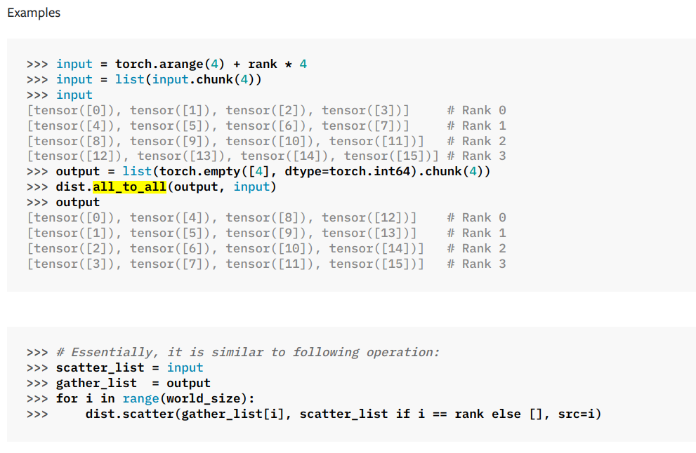

all\-to\-all 通信非常高效，没有任何冗余通信。

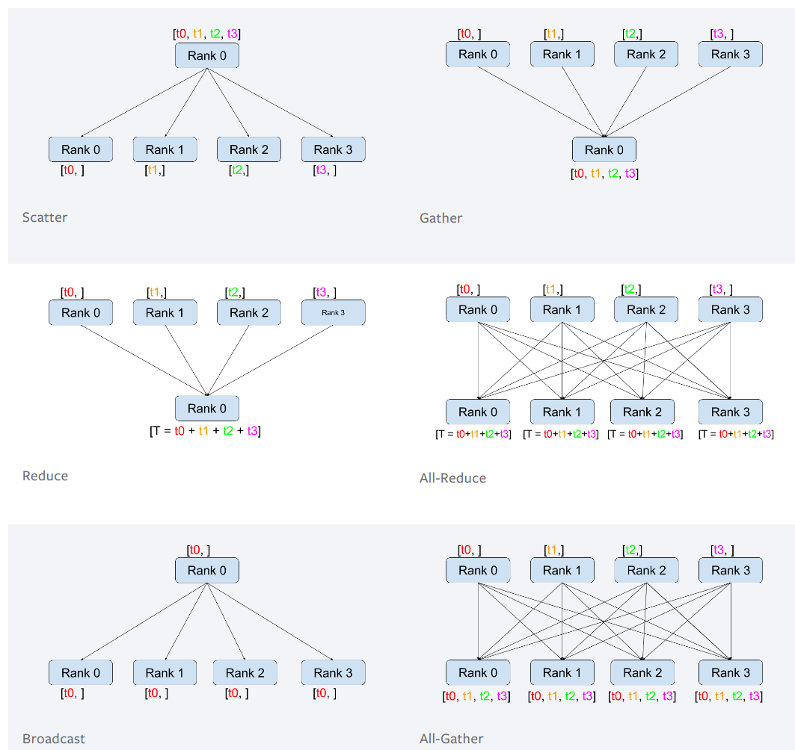

all\-to\-all

```Python
def _all_to_all(
    input: Tensor,
    world_size: int,
    group: dist.ProcessGroup,
    scatter_dim: int,
    gather_dim: int,
):
    input_list = [
        t.contiguous()
        for t in torch.tensor_split(input, world_size, scatter_dim)
    ]
    output_list = [torch.empty_like(input_list[0]) for _ in range(world_size)]
    dist.all_to_all(output_list, input_list, group=group)
    return torch.cat(output_list, dim=gather_dim).contiguous()
```

假设 rank=2, 也就是说 gpu0 有一个 shape 是 \(3, 4\) 的矩阵，gpu1 也有一个 shape= \(3,4\) 的矩阵，

在第 1 维度进行 scater，然后在第 0 维度进行 gather

- 在每个 rank 上，把自身的 \(3,4\) split 为 \(3,2\), \(3,2\)

- 定义两个 shape 均为 \(3,2\) 的 output tensor，用于存储输出

- 然后在 0 维度 cancat 变成 \(6,2\)

呈蝴蝶状

上述是 2x2 的数据通信，下面是 3x3 的数据通信，类似于蝴蝶状通信网

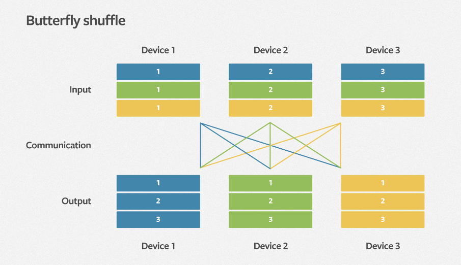

```Python
import torch.multiprocessing as mp
import os
import torch
from torch import distributed as dist

def main(functions, world_size=2, backend='gloo', start_method='spawn'):
    try:
        mp.start_processes(init_process,
                           args=(world_size, functions, backend),
                           nprocs=world_size,
                           start_method=start_method)
    except Exception:
        raise RuntimeError('----failed-----')

def init_process(rank, world_size, functions, backend='gloo'):
    """Initialize the distributed environment."""
    os.environ['MASTER_ADDR'] = '127.0.0.1'
    os.environ['MASTER_PORT'] = '29505'
    os.environ['RANK'] = str(rank)

    if backend == 'nccl':
        num_gpus = torch.cuda.device_count()
        torch.cuda.set_device(rank % num_gpus)
        device = 'cuda'
    else:
        device = 'cpu'

    dist.init_process_group(
        backend=backend, rank=rank, world_size=world_size)

    for func in functions:
        func(device)

def ddp_demo(device):
    rank = dist.get_rank()
    input = torch.rand(3, 4).cuda()
    print('orig:', input)
    input = list(input.chunk(2, dim=1))
    input = [in_.contiguous() for in_ in input]
    output = [torch.empty_like(input[0]).cuda()]*2
    dist.all_to_all(output, input)
    print('inputs=',input, '\noutputs=',output)
    print('out:', torch.cat(output, dim=0))

if __name__ == '__main__':
    functions = [ddp_demo]
    total_gpus = 2
    backend = 'nccl' # 只能在集群用

    main(functions, total_gpus, backend, start_method='spawn')
```

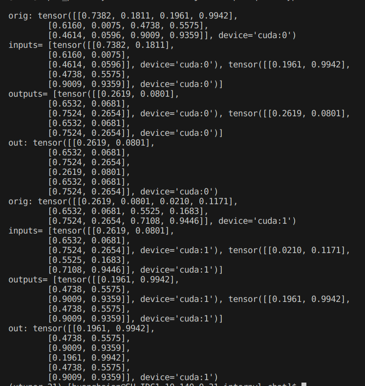

# PPO

https://zhuanlan\.zhihu\.com/p/645225982 最好，理解的比较好

https://zhuanlan\.zhihu\.com/p/677607581 代码讲解的比较清楚


强化学习主要是指导训练对象每一步如何决策，采用什么样的行动可以完成特定的目的或者使收益最大化。不需要提前准备数据标签，这是和监督学习最大区别。


**\( 1 \) \- Value Based \-**

基于每个State下可以采取的所有Action，这些Action对应的Value, 来选择当前State如何行动。强调一点这里面的Value并不是从当前State进入下一个State，环境给的Reward，Reward是Value组成的一部分。但我们实际训练时既要关注当前的收益，也要关注长远的收益，所以这里面的Value是通过一个计算公式得出来的，而不仅仅是状态变更环境立即反馈的Reward。因为Value的计算较为复杂，通常使用[贝尔曼方程](https://zhida.zhihu.com/search?content_id=190350918&content_type=Article&match_order=1&q=%E8%B4%9D%E5%B0%94%E6%9B%BC%E6%96%B9%E7%A8%8B&zhida_source=entity)

强调一点这里面的Value值，在强化学习训练开始时都是不知道的，我们一般都是设置为0。然后让Agent不断去尝试各类Action，不断与环境交互，不断获得Reward，然后根据我们计算Value的公式，不停地去更新Value，最终在训练N多轮以后，Value值会趋于一个稳定的数字，才能得出具体的State下，采取特定Action，对应的Value是多少

**代表性算法：Q\-Learning**


**\( 2 \) \- Policy Based \-**

Policy Based策略就是对[Value Based](https://zhida.zhihu.com/search?content_id=190350918&content_type=Article&match_order=2&q=Value+Based&zhida_source=entity)的一个补充，

**说明：** 基于每个State可以采取的Action策略，针对Action策略进行建模，学习出具体State下可以采取的Action对应的概率，然后**根据概率来选择Action**。（如何利用Reward去计算每个Action对应的概率里面涉及到大量的[求导](https://zhida.zhihu.com/search?content_id=190350918&content_type=Article&match_order=1&q=%E6%B1%82%E5%AF%BC&zhida_source=entity)计算

**代表性算法：** Policy Gradients


**\( 3 \) \-Actor\-Critic \-**

AC分类就是将Value\-Based和Policy\-Based结合在一起


如何才能找到最优策略呢？直觉上来看，如果我们在状态St时能够知道下一步状态St\+1所有候选到达最终状态的累积收益，那么就很容易选择当前应该采取的动作从而达到最优的收益了。强调的是累积收益，而且是预期的累积收益，还没有开始行动就已经推测了。

收益有一个折扣因子，是因为考虑到距离越远的策略选择对于当前状态的影响越小，所以乘以折扣因子。


贝尔曼等式`Bellman Equation`的基本思想是：某个*起点的值（Q值或者V值）等于希望在该点得到的奖励，加上下一个点的值（Q值或者V值）。*

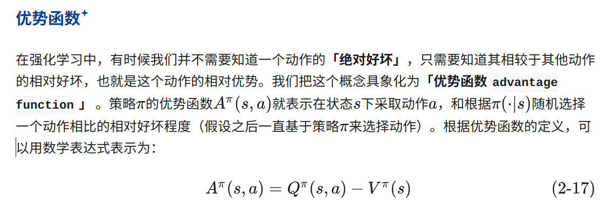

PPO 算法是 AC 算法的改进。

发现Actor\-Critic的思想和图像上的生成对抗网络GAN有着异曲同工之妙，都包含两个网络，其中一个网络负责决策，另一个网络负责评价。Actor\-Critic 和 GAN 遵循着相同的结构，这个结构包含两个相继的部分：

> 一个用于生成动作（或图像），第二个用一个分数来评估这个生成动作（或图像）的好坏。然后，选择一个优化函数使得第二部分能够准确评估，并通过**第二部分反向传播梯度到第一部分来保证它生成的是我们想要的**。
> 
> 


A2C（Advantage Actor\-Critic）是一种有策略的actor\-critic算法，它使用Advantage函数来更新策略。 该算法实现简单，可以处理离散和连续的动作空间。

PPO（Proximal Policy Optimization）是一种[策略算法](https://zhida.zhihu.com/search?content_id=221593412&content_type=Article&match_order=2&q=%E7%AD%96%E7%95%A5%E7%AE%97%E6%B3%95&zhida_source=entity)，它使用信任域优化的方法来更新策略。 它在具有高维观察和连续动作空间的环境中特别有用。 PPO 以其稳定性和高样品效率而著称。

假设 0 是起点， 1 是预期终点，上面绘制了 4 条路径，其中有一条失败了，有 3 条成功了，但是也能看出哪一条更好。

强化学习的目的是通过训练，给定任意起点0，都能以最快的速度达到终点1，也就是找到最佳路径。而实现的核心在于如何评估路径，特别是评估每一步的好坏，反应在数学层面就是  value 如何建模。

假设在某个位置，理论上就有 Vt\_\{上下左右\} 4个值用于评估在 Vt 时刻每个 action 的收益。在下一时刻也有 Vt\+1\_\{上下左右\} 。在最后达到 1 终点的时刻，所有的 Vlast\_\{上下左右\} =0。


强化学习是要找到最优路径，因此这个 V 不能是眼前收益，因为如果只看眼前的话**\(其实你也没法只看眼前收益，因为你并没有每一步的标签，你也很难给标签，标签只有到了终点才知道这个路径可行\)**，很可能会导致立刻陷入局部最优，我们要关注的是整个路径的全局收益最大化。

因此上面的 Vt\_\{上下左右\}  表示的是在 t 时刻某个 action 的总收益，那么必然可以想到 Vt\_\{上下左右\} 和 Vt\+1\_\{上下左右\} 一定有所关联，因为总收益包括了未来的收益，这是一个递归的公式，因此有：

**Vt =Rt\+ 折扣因子\* Vt\+1**

理解这个公式很重要。

R\_t 可以表示眼前收益，折扣因子是因为未来收益对当前总收益的影响会弱一点，因为你不可能预测的超级远且准确。

以绿色线为例，从后往前推导

- 当前处于 1 状态，VT\_所有方向=0, 不管从哪个状态进入 1 状态都是成功，因为 R\_T 所有方向=1

- 当前处于 2 状态  从状态来看是从左边进入 2 状态的，并且下一个状态是上，因此 V\_T\-1=R\_\{T\-1\}\_左\+ V\_T上

- 当前处于 3 状态 从状态来看是从左边进入 3 状态的，因此 V\_T\-2=R\_\{T\-2\}\_左\+ V\_T\-1右

- \-\-\-

- 当前处于最开始状态，此时是初始状态， R\_0 无所谓设置为0，下一个状态是往右边走，因此 V\_0=R\_0\_任意\+ V\_1右，因此 V\_0 时刻当前策略收益等于从某个方向进入这个状态的眼前收益 R\_0 \+ 从这个状态往下一个状态走的预期总收益 V1

可以看出每一条路径都可以算出一个完整的每个时刻的 Vt。


如果我们有上帝视角，能够知道在任何一个状态下的 V 值，那么推理时候就非常简单，只要在每个状态下都走最大 V 对应的方向就可以了。但是我们知道这实际上是不知道的，因此我们可以引入 critic 网络进行学习预测这个 V。

但是 critic 网络预测也没有实际标签，幸好我们有上面公式，我们可以再引入一个 reward model 用于离线计算眼前收益，这样基于 t 时刻的预测收益\+眼前收益=t\+1 时刻的预测收益来构成 mse loss 就可以训练了。

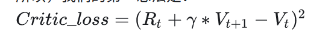

上面是 ctitic 网络的学习过程，但是 actor 策略模型也需要学习的，他的目标是找出最佳路径，实际上就是找出能使得 V 收益最大的路径。

因此最简单的设计为：

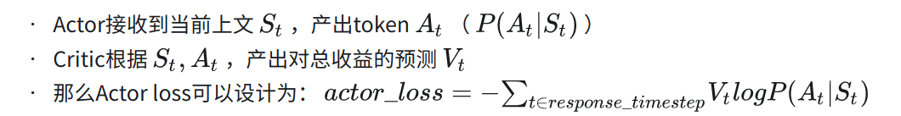

以上是最原始的想法，然后要对这些 loss 进行改进，这就属于强化学习里面很多的理论改进了。

例如 A2C 算法里面引入了优势的概念。


假设我们有训练好的结果 reward model，actor 模型生成 bs 个数据后，利用 reward 进行打分，选择一个阈值假设是 0\.8，大于 0\.8 的设置 label=1，否则是 0，然后利用这个信息梯度更新 actor 模型是可以做的，但是这样会导致梯度信息非常少，而且可能无法正常训练，因为可能初始化模型不太行，导致生成的数据都没有达到 0\.8，那基本上就训练不起来了，训练过程会出现严重不平衡问题。

因此我们要的是能够对每一步进行打分的模型，这个模型是通过学习自动进化的，actor 模型越强，critic 模型预测的收益就越准确。


https://zhuanlan\.zhihu\.com/p/111895463 入门路线，非常详细推荐。


但更多的时候，我们并不能单纯通过眼前的R来衡量一个动作的好坏。来看下面一个例子：

假设，10天之后进行期末考试，我们今天有两个选择： 1\. 放弃吧，我们玩游戏！我们每天可以获得\+1心情值； 2\. 决心努力一搏，我们开始学习吧！每天我们\-2心情值。

从这10天看，我们肯定是选择【1\.玩游戏】。因为10天后，我们虽然考试没过，但至少收获10天的快乐。

但事实上，我们再看远一点： \- 因为挂科，接受老师怒吼攻击！心情值马上减5； \- 父母因为我考得好成绩，给了更多的零用钱。心情值加200点。

因此，我们必须用长远的眼光来看待问题。我们要把未来的奖励也计算到当前状态下，再进行决策。


https://zhuanlan\.zhihu\.com/p/109498587

评估动作的价值，我们称为Q值，它代表了智能体选择这个动作后，一直到最终状态奖励总和的期望； 

评估状态的价值，我们称为V值：它代表了智能体在这个状态下，一直到最终状态的奖励总和的期望。

对于Q值和V值的定义非常非常重要。对QV的清晰理解，是理解强化学习中几乎所有算法的基础


强化学习的目的是最大化 Q 值或者 V 值，只要一个达到最大，另一个就会达到最大。


几乎所有的强化学习算法都涉及到对价值函数的估计——这些函数是状态V（或状态\-动作对Q）的函数，用于估计代理在给定状态下的好处（或在给定状态下执行某个动作的好处）。这里的“好处”是通过可以预期的未来奖励来定义的，或者更准确地说，是通过预期回报来定义的。当然，代理在未来可以预期获得的奖励取决于它将采取的动作。因此，价值函数是相对于特定的行动方式来定义的，这些方式被称为策略。

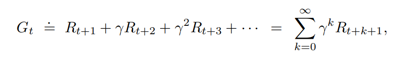

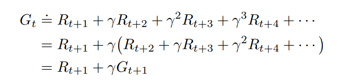

在 t 时刻的收益 return 等于后续每个时刻的带有折扣因子的 Reward 值的总和。

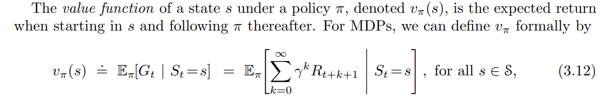

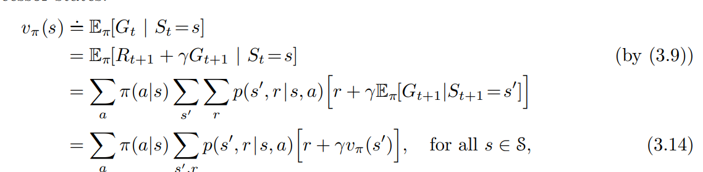

状态值函数表示在当前状态中，沿着当前状态出发达到的所有状态的概率乘以进入下一个状态的值的期望。表征的是类似平均值的概念。

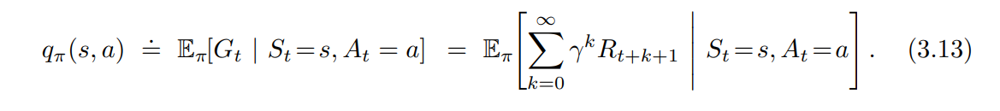

状态\-动作值函数表示在当前状态中执行某个动作后所带来的收益。

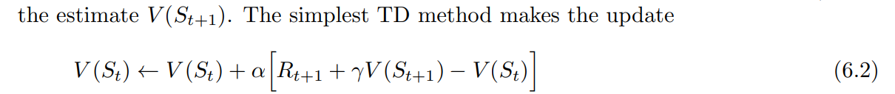

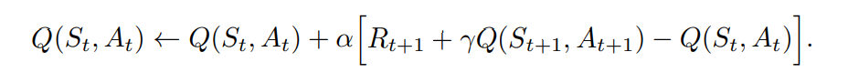


QV 可以相互转换：

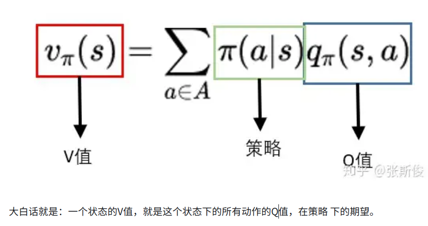

某个状态下的 V 值等于，当前状态下所有动作的 Q 值在当前策略下的期望。

换算到 LLM 里面，假设 actor 模型生成了 a b c d e \.\.\. 这个路径序列\(词表个数假设是 10\)，那么在 e 时刻的 V 值=

策略模型\(生成a \| a b c d e\)的概率 \* Q收益\(基于 a b c d e 再生成 a\) \+actor 模型\(生成b \| a b c d e\)的概率 \* Q收益\(基于 a b c d e 再生成 b\)\+策略模型\(生成c \| a b c d e\)的概率 \* Q收益\(基于 a b c d e 再生成 c\)\+\.\.\.\.

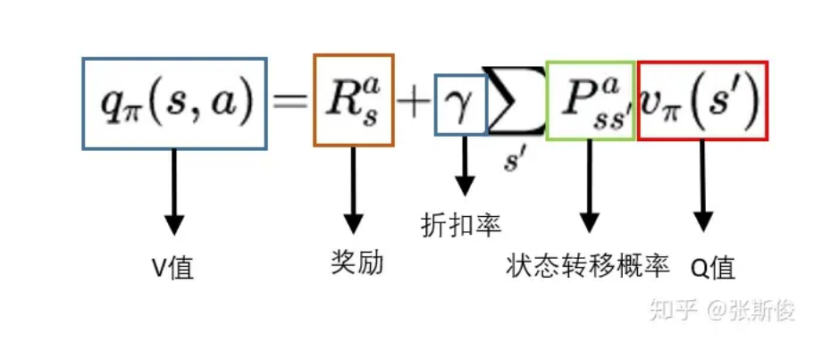

这个公式标反了，q 表示 q 值。最后那个红框表示下一个状态的 V 值。上述公式的意思是： 在当前状态下执行某个动作的收益Q=在当前状态下执行某个动作后的眼前收益\+ \(执行某个动作后进入状态1的概率\*进入状态1的收益\+执行某个动作后进入状态2的概率\*进入状态2的收益\+\.\.\.\)。

在 LLM 里面，假设已经生成了 a b c d，下一时刻生成了 e，这个生成概率就是状态转移概念。


并且因为是马尔科夫链，可以从当前时刻的 v 到下一个时刻的 v 建立联系

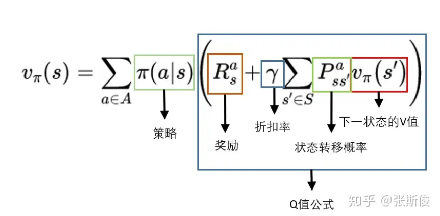

这个公式才是最重要的，这样就不用关系 q 了，相当于不存在 q 函数。

当前状态的 v 值=策略模型在当前状态下执行动作 a 的概率\* \(在当前状态下执行动作a 的眼前奖励\+折扣因子乘以进入下一个状态的 v 值\)。

在 LLM 里面稍微有点不同，因为模型已经生成了序列，这个路径其实已经固定了，因此不存在啥状态转移概率，而是一个 one\-hot 矩阵，以 a b c d 生成序列为例，生成 a b c d 的路径就是一个策略，在这个策略中， c 时刻的状态值等于在当前状态下生成 d 的概率乘以\(在 c 时候生成 a 的奖励\+ 折扣因子\* 当前策略下进入 d 状态的值\)。在该状态下不会生成除了 d 以外的数据因此没有所谓的两个求和符号。


基础的 Actor\-Critic 中，Critic 输出 Q值用于策略梯度的计算。但这种方式也有跟 policy gradient 中类似的问题，就是High variance。为了解决这个高方差的问题，可以采用引入一个baseline的方式，即在计算期望的时候用累计奖励减去一个 Baseline ，这样做的好处是可以让梯度减小，因此梯度下降的步子也就更平缓，从而使训练过程更稳定 。

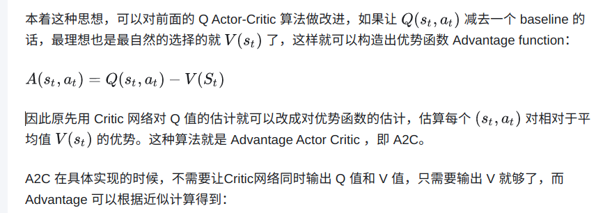

因此 A2C 是直接估计 V 值。


q 函数就是 critic 模型，用于估计在当前状态下预测下一个特定词的总收益，状态转移概率由 actor 模型生成。


Actor\-Critic，其实是用了两个网络：

两个网络有一个共同点，输入状态S: 一个输出策略，负责选择动作，我们把这个网络成为Actor； 一个负责计算每个动作的分数，我们把这个网络成为Critic。

大家可以形象地想象为，Actor是舞台上的舞者，Critic是台下的评委。

Actor在台上跳舞，一开始舞姿并不好看，Critic根据Actor的舞姿打分。Actor通过Critic给出的分数，去学习：如果Critic给的分数高，那么Actor会调整这个动作的输出概率；相反，如果Critic给的分数低，那么就减少这个动作输出的概率。

在AC中的Critic，估算的是V值，而不是 Q 值。强化学习里面的 PPO 只有 2 个模型，而不是 4 个。并没有 ref model 和 reward model。他的 reward 是要根据 buffer 实时更新估计的。

优势函数的作用是为了增加策略更新的稳定性，避免策略更新过于剧烈而导致优化过程不稳定。在计算近端比率裁剪损失时，**使用优势函数可以帮助控制裁剪幅度，从而限制策略更新的幅度**。

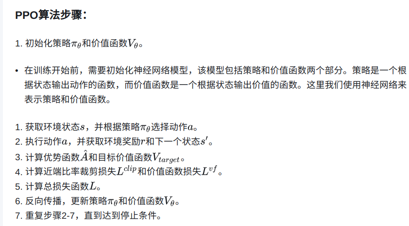

1 和 2 步骤应该是执行多次的，并不是执行一次动作就更新参数。

PPO2算法一共需要定义三个神经网络，其中的actor部分网络有两个，一个是老策略pi\_old，另一个是新策略pi\_new；critic部分网络就只有一个。


PPO算法由于使用重要性采样，重要性采样要求前后两个分布距离很近，因此PPO必须是小步快跑，否则会导致理论失效


V值关注的是我现在在这个位置有多好

Q值关注的是如果我在这个位置做这个动作，会有多好


时序差分算法 TD 是核心。蒙特卡洛算法每次探索都要走到目的地才行，TD 只要有一次走通就行了。


`on policy`算法与`off policy`算法的区别就在与进行采样的网络和用来参数更新的训练网络是否是一个网络。PPO 是一种`on policy`的算法，`on policy`算法要求训练的网络参数一更新就需要重新进行采样然后训练。但PPO 有点特殊，它是利用重要性采样方法来实现数据的多次利用，提高了数据的利用效率。


近端"proximal"指的是在优化过程中，新的策略应该与旧的策略保持接近或相似，以避免过大的策略更新可能导致的性能崩溃。

PPO 的进端就是这个含义，


什么是 N\-step 方法，在N\-step方法中，代理在进行策略更新前会等待N个时间步，然后使用这N步中累积的奖励来更新价值估计。

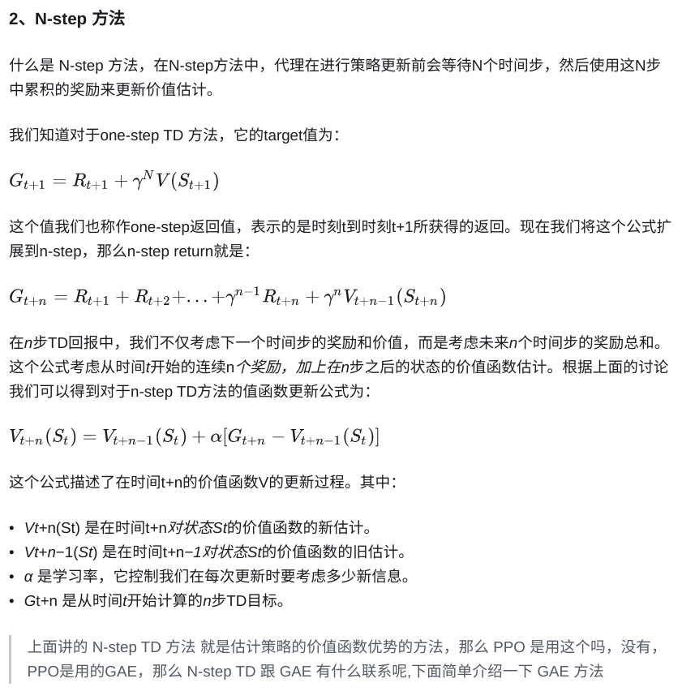

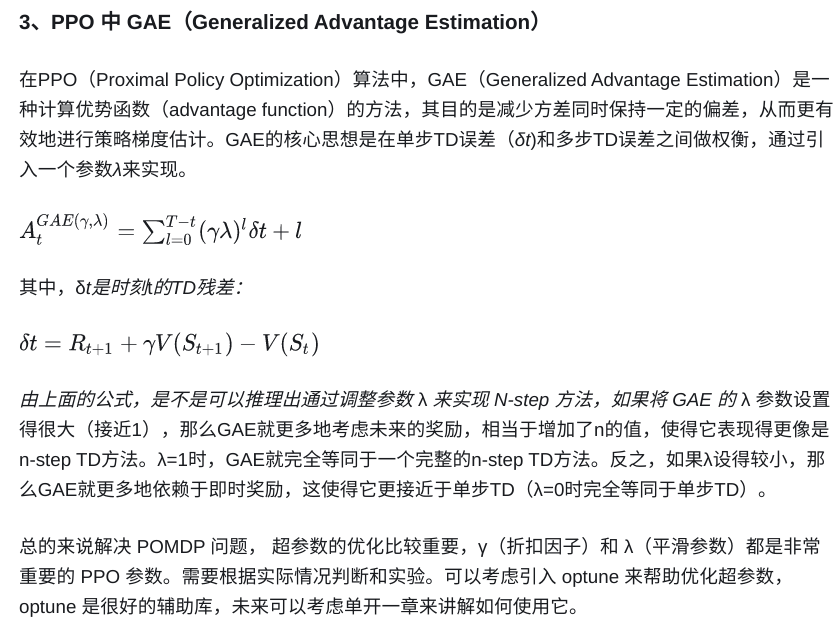

我们用的实际上是 PPO2

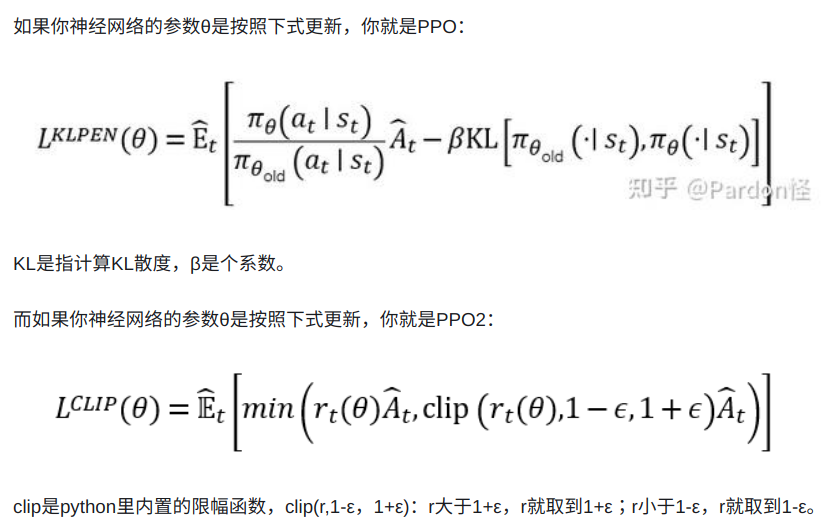

理解 PPO 需要先理解 AC 和 A2C 算法，但是前提是 Policy\-Gradient 。

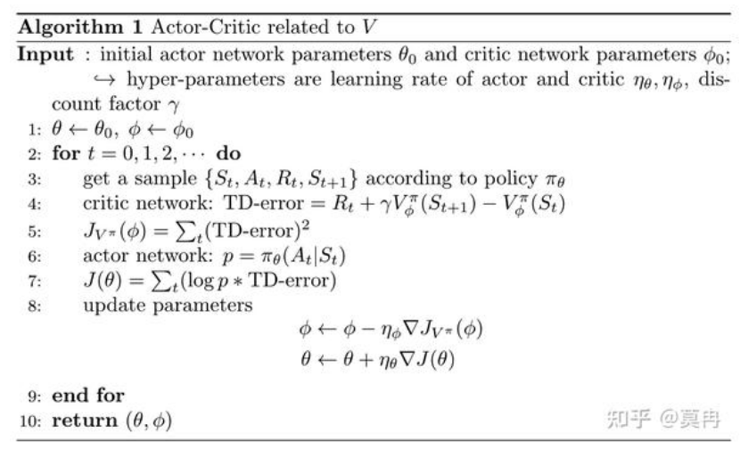

在强化学习中，如果同时学习策略函数和值函数，则这种方法一般称为actor\-critic methods。其中actor指学习策略函数，critic指学习值函数。

GAE 广义势能函数是为了减少普通AC算法中策略梯度的偏差而设计的，确保优势有正有负，可以有效的降低 policy gradient 的方差。

如果优势函数大于零，则说明该动作比平均动作好，如果优势函数小于零，则说明当前动作还不如平均动作好。


对于强化来说，目的是找到一个最优策略模型，使得它的动作轨迹累计回报值最大。自然会有一个策略模型，这里称作为Actor，它的输入是当前的状态信息state，输出为动作action。如果没有评价网络critic的话，那就只能利用轨迹的累计回报来更新参数了，一条轨迹更新一次，效率较低。所以有人想出来，对于特定的状态和动作，直接给出一个评价值，用来指导actor的优化方向，也就是每一步都想办法给一个反馈。


所有强化学习算法的最终目的均是“找到能够让奖励值最大的的策略，即最优策略”。基于策略梯度的方法是指直接对策略进行模型建立及优化的一种迭代方法。


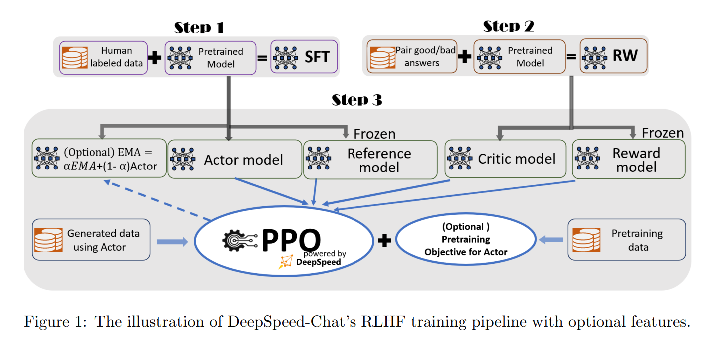

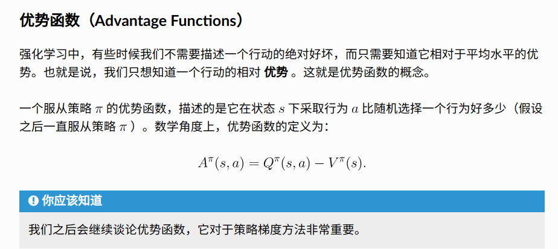


Reinforcement Learning》 by David Silver

https://www\.davidsilver\.uk/teaching/

https://datawhalechina\.github\.io/easy\-rl/\#/chapter5/chapter5 蘑菇书

https://spinningup\.readthedocs\.io/zh\-cn/latest/spinningup/rl\_intro\.html 重点


# Reward\-bench

专门用于评估 reward model 也可以评估 dpo 后的模型,就是直接比胜率即可,非常简单\.

# GC

gc\.**get\_count**\(\)[¶](https://docs.python.org/zh-cn/3.13/library/gc.html#gc.get_count)

将当前回收计数以形为 `(count0, count1, count2)` 的元组返回。

count 0 表示从上一次调用 gc\.collect 开始到目前为止，新创建了多少对象。已经去除了已经被释放的对象引用。

如果这个数一直在增长，则说明没有触发垃圾回收机制。

如果 count2 也一直涨，说明有内存泄露，因为最后一代始终无法回收。


gc\.**get\_stats**\(\)[¶](https://docs.python.org/zh-cn/3.13/library/gc.html#gc.get_stats)

返回一个包含三个字典对象的列表，每个字典分别包含对应代的从解释器开始运行的垃圾回收统计数据。字典的键的数目在将来可能发生改变，目前每个字典包含以下内容：

- `collections` 是该代被回收的次数；也就是当前代已经进行了多少次垃圾回收

- `collected` 是该代中被回收的对象总数；表示当前代回收对象总是

- `uncollectable` 是在这一代中被发现无法收集的对象总数，当前带无法回收对象总数，可以判断是否内存泄露。

触发 gc 时刻，程序会暂停，因此如果 gc 回收非常频繁且耗时，那么程序就会非常卡顿。


在 Python 的垃圾回收机制中，每一代的垃圾回收时间并不一定相同。具体来说：

1. **年轻代（Generation 0）**：这一代的垃圾回收通常比较频繁，因为新创建的对象大多数会很快变成垃圾。由于年轻代的对象生命周期短，垃圾回收的速度较快。

2. **中间代（Generation 1）**：这一代通常会较少地进行垃圾回收。由于年轻代的对象如果存活下来会被提升到中间代，垃圾回收的时间可能会较年轻代稍长。

3. **老年代（Generation 2）**：这一代的对象存活时间较长，因此垃圾回收的频率最低，但每次回收的时间可能会较长，因为需要检查更多的对象。

总的来说，垃圾回收的时间受多种因素影响，包括对象的数量、存活时间以及内存的使用情况。因此，不同代的垃圾回收时间通常是不一样的。


原则上三个代的回收阈值分别是 700 10 10，但实际上第三代触发回收是比较复杂的，不是完全依靠这个阈值控制。


- 开始时候三个代的引用对象数都是 \(0,0,0\)

- 假设经过一次运行后，变成 了 \(600,0,0\)

- 再经过一次，超过了 700 ，假设是 770，那么就会触发一次第一代垃圾回收，假设回收正常，则变成 \(0,1,0\)

- 再次经过 n 次第一代h回收后，假设变成了 \(0,11,0\)

- 假设再一次新生代对象达到 701,则会变成 \(0,12,0\) 此时触发一次第二代垃圾回收，变成 \(0,0,1\)

- 再次经过无数次迭代后，假设变成了 \(0,11,11\)，理论上下一次就会触发老年代的更新，但是实测发现并不是，可能会变成 \(0,11,34\) 这种，也就是不一定会触发老年代回收

- 实测发现可能到 36 时候触发一次，最终变成 \(0,0,0\)


看文档，第三代因为是最老代，其实他的阈值是忽略的，不受这个阈值控制。


然后在每一代垃圾回收中，可以通过 gc\.get\_stats\(\) 判断总共进行了多少次垃圾回收，总共回收了多少对象，是否有无法回收的对象等信息。


Dataloader 中，每个进程的 gc 都是独立的。

```Python
import torch
from torch.utils.data import DataLoader, Dataset
import gc
import time


def print_gc_status(flag):
    gc_count = gc.get_count()
    gc_stats= gc.get_stats()
    print(f" {flag} {gc_count}, {gc_stats}")


# 定义一个简单的数据集
class SimpleDataset(Dataset):
    def __init__(self, size):
        self.data = [torch.randn(10) for _ in range(size)]

    def __len__(self):
        return len(self.data)

    def __getitem__(self, idx):
        print_gc_status('idx')
        return self.data[idx]


# 创建数据集和数据加载器
dataset = SimpleDataset(size=1000000)
dataloader = DataLoader(dataset, batch_size=4, num_workers=2, pin_memory=True, persistent_workers=True)

# 训练循环
for epoch in range(1):  # 进行两轮训练
    print(f"Epoch {epoch + 1}")
    for index, batch in enumerate(dataloader):
        # 模拟一些计算
        _ = batch.sum()

        # 打印 GC 状态
        print_gc_status(f'main[{index}]')
        time.sleep(0.001)

    # 手动调用垃圾回收
    # gc.collect()
    # print("After gc.collect():")
    # print_gc_status()
    # print("-" * 40)
```

# InternTrain 异常处理逻辑

```SQL
enable_pytorch_expandable_segments()
if gpc.config.get("set_per_process_memory_fraction", False):
    torch.cuda.set_per_process_memory_fraction(0.95)
if gpc.config.get("MP_SPAWN", False):
    torch.multiprocessing.set_start_method("spawn")
```


```SQL
try:
    # load batch data
    batch, train_iter = load_new_batch_with_train_state(
        train_dl=train_dl, train_iter=train_iter, train_state=train_state
    )

except DatasetRunOutError:
    dataset_run_out_signal = torch.tensor(1, dtype=torch.int32, device=get_current_device())
```

**一旦数据输出有错误，则保存权重**

```SQL
dist.all_reduce(dataset_run_out_signal, op=dist.ReduceOp.MAX, group=dp_group)
if dataset_run_out_signal:
    if gpc.is_rank_for_log():
        logger.info(f"Dataset run out at batch {batch_count}. Saving checkpoint...")
    ckpt_manager.try_save_checkpoint(train_state, force=True)

    break
```

优化器策略是标准的 torch amp

```SQL
if found_inf:
    if gpc.is_rank_for_log():
        logger.warning("Overflow occurs, please check it.")
    self.zero_grad() # 梯度清 0， 跳过更新
    return False, norm_groups
```

# XPuyu 新旧 pack 逻辑对比

- 最原始版本称为： orig

- orig 上从 pack 的取最长子集作为标准改成整个 token 里面总的 patch 数：patch

- 在 orig 基础上确保在随机性足够情况下尽可能解决 pack\-size: orig\-buffer

- 在 patch 基础上应用上述逻辑： patch\-buffer


以 internvl2\-mpo 为例进行测试。

以 internvl2\-mpo\-2b 模型，且 2 张卡在 dsw 上测试，训练 265 iter \(还没有达到稳定\)

- Orig: e2e tgs 为 5501，训练 iter 总数为 134541

- Patch: 5696，训练 iter 总数为 134541

- Orig\-buffer: 6065，训练 iter 总数为 114714

- Patch\-buffer: 6166，训练 iter 总数为 114714

因此，训练总 iter 数减少了 \(134541\-114714\)/134541=14\.7%，每个 iter tgs 提升了 \(6166\-5501\)/5501=12\.1%，因此整体提升了 26\.8%


以 internvl2\-mpo\-8b 模型，且 24 张卡在 dlc 上测试，训练 200 iter \(还没有达到稳定\)

- Orig: e2e tgs 为 2627，训练 iter 总数为 11212

- Patch: 2686，训练 iter 总数为 11212

- Orig\-buffer: 2972，训练 iter 总数为 9560

- Patch\-buffer: 3004，训练 iter 总数为 9560

在 8b 模型上整体提升 14\.7%\+ \(3004\-2627\)/2627=29%


# 内存分析


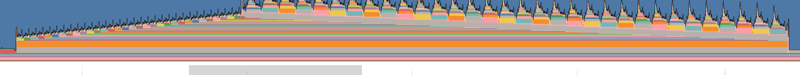

有两条线横跨了整个周期，不合理。

```SQL
for layer_id, transformer_block in model.layers.items():
        if pp_enabled:
            # For PP, do not reshard after forward to avoid per-microbatch
            # all-gathers, which can be expensive and non-overlapped
            reshard_after_forward = False
        else:
            # As an optimization, do not reshard after forward for the last
            # transformer block since FSDP would prefetch it immediately
            reshard_after_forward = int(layer_id) < len(model.layers) - 1
        fully_shard(
            transformer_block,
            **fsdp_config,
            reshard_after_forward=reshard_after_forward,
        )
    fully_shard(model, **fsdp_config, reshard_after_forward=True)
```

这种切分规则不合适，因为他把 model\.output 和 model\.embeding 封装到一起了。在第一次 forward 时候会 all\-gather 一次聚合参数，就是咖啡色部分。但是因为有：

```SQL
*In forward with implict prefetching, to overlap the current copy-out*
*with the next all-gather, we save a reference to the current all-gather*
*result to free after the next copy-out.*
```

因此会额外对  model\.output 和 model\.embeding  进行 copy\-out，会额外占据 2g 显存。这个 2g显存一直无法释放，需要等待 backward 完全才可以。

如果分成 2 个 fsdp 模块，那么model\.output 将会在开始 backward 时候就释放，可以节省 1g 峰值显存。

所以如果某个对象占据显存多，最好分的细一点。

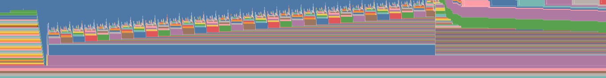

就是如上的样子。


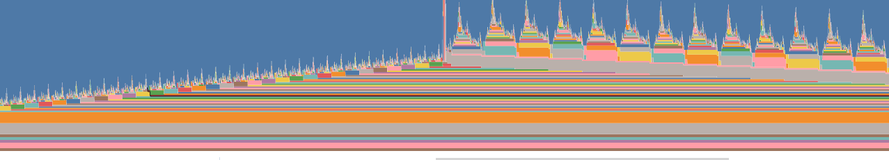

这样是 checkpoint 保存的东西，在当前层 backward 后就可以释放掉。这些是比较合理的。


同样的，在 xpuyu 中不合适的切分策略也会参数问题

```SQL
model.tok_embeddings.apply(param_init_fn)
model.norm.apply(param_init_fn)
fully_shard(
        model,
        mesh=dp_mesh,
        mp_policy=mp_policy,
        reshard_after_forward=reshard_after_forward)
# output 单独一个 fsdp,每个 layer 单独一个 fsdp
```


一个 fsdp 模块 all\-gather\+ copy out 参数要释放，需要等整个 fsdp 运行完成才可以

```SQL
with train_context(optional_context_parallel_ctx):
    pred = model(input_ids)
    loss = loss_fn(pred, labels)
    # pred.shape=(bs, seq_len, vocab_size)
    # need to free to before bwd to avoid peaking memory
    del pred
    loss.backward()
```

而 model 的 root fsdp 的 copy out 显存其实一直无法释放，因为 loss \-\> pred \-\> model 形成了链式引用。只有当 loss\.backward 执行完成才能释放。所以就会出现上述有线条横跨整个周期。

如果把 output/embeding 单独封为一个 子 fsdp，然后 root fsdp 其实是啥也没有\(即使横跨也是一点点显存\)，那么基于上述分析就可以节省很多显存。

上述分析好像也不合理，因为 layer 和 layer 之前也有相互引用，为啥就没有这个 copy out 呢？

# Internlm 2\.5\-7b mem profile 分析


相应代码和分支：

https://gitlab\.pjlab\.org\.cn/openmmlab/bigmodel/xpuyu/\-/tree/hha/profile\_dense

https://github\.com/hhaAndroid/xtuner/tree/dense\_mem\_profile


## 8k orig 20\.7g 5000

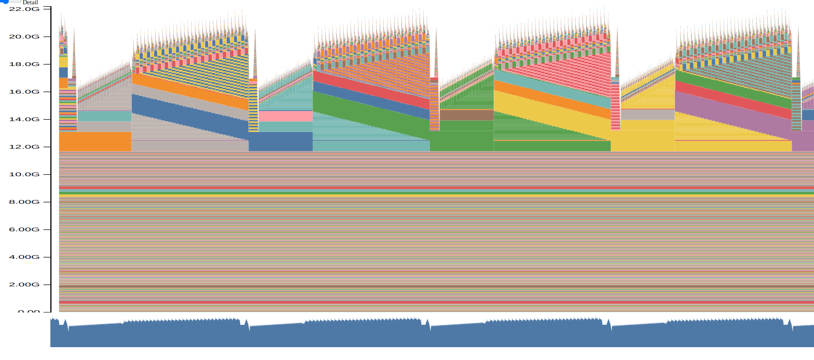

## \+ del logits 

8k orig 19\.3g 5000

以第二个峰值显存为例，绿色横跨两次 forward 的是因为 logits 显存没有回收，一共 1\.4g\(1x8192x92544x2\)/1e9

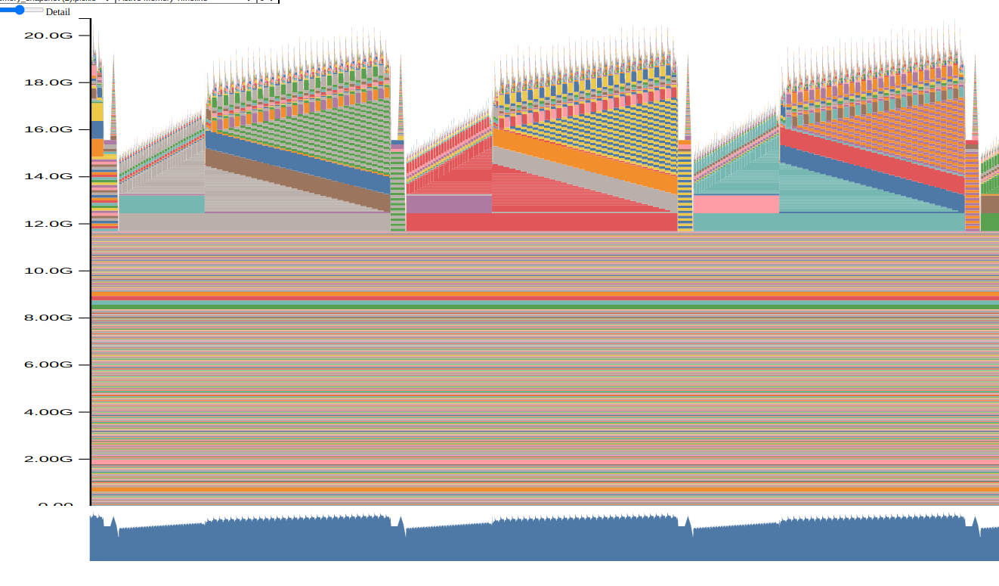

## \+ output/embeding/norm 单独封装为 fsdp

8k orig 18\.5g 5000

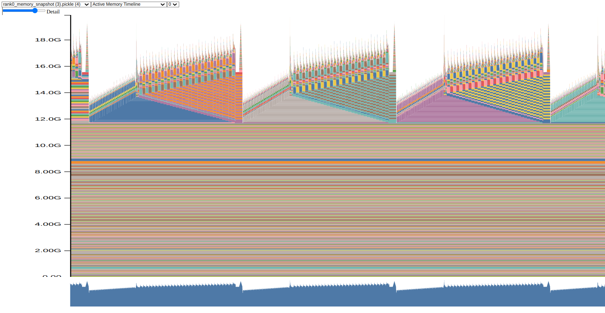

相比于上面的图，可以看到减少了一条很长的红色线和一条仅仅横跨 forward 的紫色线。

- 红色线是 output 权重，4096x92544x2=732m

- 紫色线是 embeding 权重，因为他和 norm 绑定到一起导致要 forward 完成才能释放，也是 732m

经过修改后可以少掉两套线，减少峰值显存 732m\(核心在于红色线\)。

从上图来看，在 backward 阶段也可以少掉 output\+embeding 的 all\-gather 参数，但是因为少掉后峰值显存是在最后所以导致并没有介绍 1\.4g。

## \+liger

8k orig 18\.1g 5000

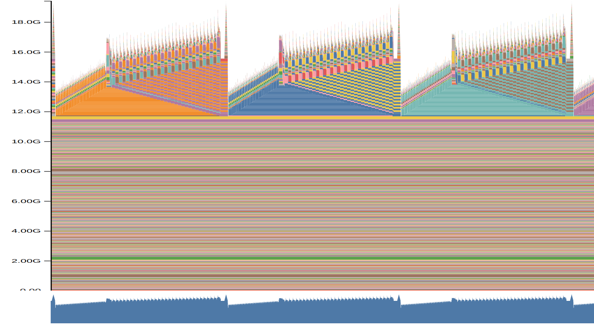

注意：由于 liger 要对 output weight 单独操作，因此 fsdp 切分规则要修改为将 output\+norm 放到一起，否则会报错

```SQL
model.output.apply(param_init_fn)
model.model.norm.apply(param_init_fn)
fully_shard(
        [model.model.norm, model.output],
        mesh=dp_mesh,
        mp_policy=mp_policy,
        reshard_after_forward=reshard_after_forward)
```

放大细节：


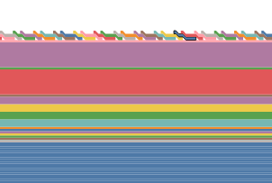

在开始 Backward 时候，峰值显存在不开启 liger 时候会额外多 1\.4g\+1\.4g\+1\.4g vs  723M

3个 1\.4g 都是** torch\.\_C\.\_nn\.cross\_entropy\_loss** 内部包括 forward\+backward 所产生的显存。

而 liger 写的比较好，实际上只需要一个 bf16 的输入，额外加一点点中间 backward 所需要的变量而已。

因此这个地方就可以节省 3x1\.4g\-723m=3\.5g。


那为啥整体显存仅仅节省了 0\.4g？原因是峰值显存是最后一层 backward 后 optimizer\.step 的显存。可以预见，如果序列变长，就可以省的更多。

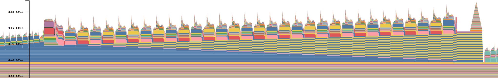

可以预见，如果将 optimizer\.step 和 backward 融合，那么这个地方的峰值显存就可以节省了。


## 其余说明

- 显存看起来一直在涨是合理的，因为在 forward 中参数的 grad 是 none，随着从后向前开始计算得到 grad，这个 grad 显存会一直在，从而看起来显存一直在涨。但是同时因为 backward 当前层完成后，checkpoint 所占显存也要释放，因此这里有个权衡问题。

- 在序列比较短时候，checkpoint 所释放的显存比 grad 增加的少，看起来就是显存一直涨

- 但是如果序列比较长，checkpoint 所释放的显存比 grad 增加的多，看起来就是显存一直下降

# Internlm3\-moe\-mid mem profile 分析

```SQL
HF_DATASETS_OFFLINE=1 TRANSFORMERS_OFFLINE=1 /cpfs01/shared/llm_razor/huanghaian/miniconda3/envs/torchtitan/bin/torchrun --nnodes=1 --nproc_per_node=8 tools/fsdp2_pretrain_moe_interntrain_ep_microbatch.py \
    --llm None \
    --mem \
    --train-cfg official_Kepler_MoE_20B_A3_8gpus.py \
    --work-dir work_dirs/debug_mem/ --log-interval 1 --seed 42 --checkpoint-interval 5000 --hf-interval 2000 --max-keep-ckpts 2  \
    --hidden-size 5120 --intermediate-size 3072 --num-hidden-layers 4 --vocab-size 128512 --num-routed-experts 64 --num-experts-per-tok 8 \
    --ep-size 4 --selective-recompute 1.0 \
    2>&1 | tee -a "work_dirs/debug3/training_log_moe.txt"
```

## Orig

ep8\-64/8\-32g\-l8  tgs 9700

log 显示 33\.6g, mem profile 显示 38\.2g 

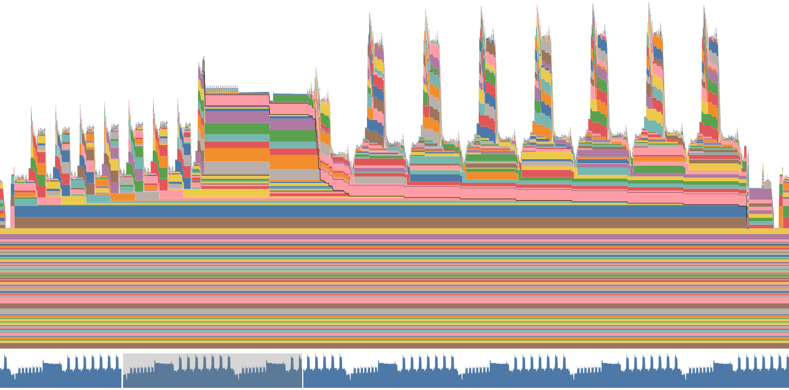

```SQL
for i, block in enumerate(llm.model.layers):

            fully_shard(
                block,
                mesh=hsdp_device_mesh if hsdp_device_mesh is not None else experts_fsdp_mesh,
                mp_policy=mp_policy,
                reshard_after_forward=reshard_after_forward,
            )
        
        fully_shard(llm,
                     mesh=hsdp_device_mesh if hsdp_device_mesh is not None else experts_fsdp_mesh,
                     mp_policy=mp_policy,
                     reshard_after_forward=False)
        llm.set_modules_to_forward_prefetch([llm.model.layers[0]])
        for layer_cur, layer_next in zip(llm.model.layers[:-1], llm.model.layers[1:]):
            layer_cur.set_modules_to_forward_prefetch([layer_next])
```

## 新 fsdp

ep8\-64/8\-32g\-l8\-new\-fsdp  tgs 9700

log 显示 31\.2g, mem profile 显示 35\.9g 

节省 2\.5g

节省的部分是 output\+embeding 的 all\-gather 参数，5120x128512x2x2= 2\.5g

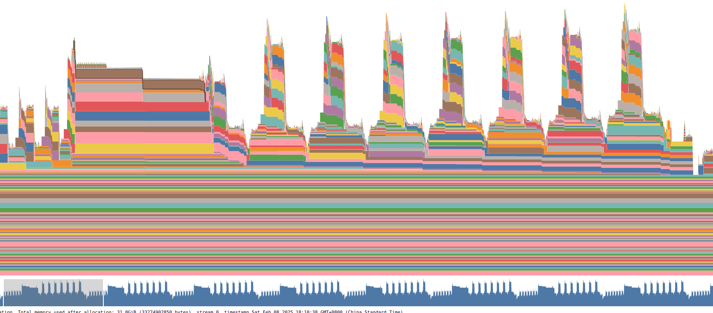


```SQL
for i, block in enumerate(llm.model.layers):

            fully_shard(
                block,
                mesh=hsdp_device_mesh if hsdp_device_mesh is not None else experts_fsdp_mesh,
                mp_policy=mp_policy,
                reshard_after_forward=reshard_after_forward,
            )
        
        # fully_shard(llm,
        #             mesh=hsdp_device_mesh if hsdp_device_mesh is not None else experts_fsdp_mesh,
        #             mp_policy=mp_policy,
        #             reshard_after_forward=False)

        fully_shard(llm.model.tok_embeddings,
                    mesh=hsdp_device_mesh if hsdp_device_mesh is not None else experts_fsdp_mesh,
                    mp_policy=mp_policy,
                    reshard_after_forward=reshard_after_forward)

        fully_shard([llm.model.norm, llm.output],
                    mesh=hsdp_device_mesh if hsdp_device_mesh is not None else experts_fsdp_mesh,
                    mp_policy=mp_policy,
                    reshard_after_forward=reshard_after_forward)

        fully_shard(llm,
                    mesh=hsdp_device_mesh if hsdp_device_mesh is not None else experts_fsdp_mesh,
                    mp_policy=mp_policy,
                    reshard_after_forward=reshard_after_forward)

        # llm.set_modules_to_forward_prefetch([llm.model.layers[0]])
        for layer_cur, layer_next in zip(llm.model.layers[:-1], llm.model.layers[1:]):
            layer_cur.set_modules_to_forward_prefetch([layer_next])
```


