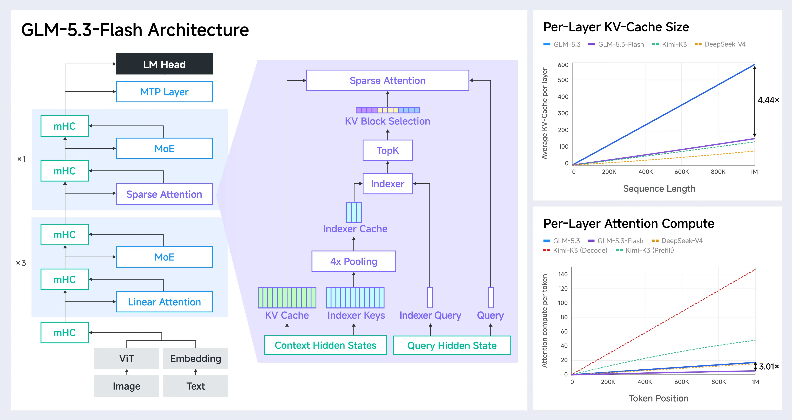

# GLM-5.3-Flash 技术解析：模型特点、效率复算与架构对比

> 整理日期：2026-08-27  
> 主要资料：Z.ai 官方博客、Hugging Face 公开配置、Transformers 参考实现。  
> 说明：文中的基准结果属于官方报告；`3.01×`、`4.44×` 的拆解包含依据公开配置进行的近似复算，不代表官方公布了完全相同的计算表。

## 1. 全局概览

### 1.1 一句话定位

GLM-5.3-Flash 是 GLM-5 系列首个原生多模态模型。它采用 `320B` 总参数、`18B` 激活参数的稀疏 MoE 架构，通过混合 KDA 线性注意力与 DSA 稀疏注意力、IndexPool、mHC，以及面向国产 AI 芯片优化的推理系统，试图在接近旗舰模型能力的同时显著降低调用成本。

它更适合作为高频、低成本的默认工作模型；旗舰版 GLM-5.3 则更偏向少量但复杂、要求能力上限的长程工程任务。

### 1.2 核心规格

| 项目 | GLM-5.3-Flash |
|---|---:|
| 总参数量 | 320B |
| 每 token 激活参数量 | 18B |
| 文本主干层数 | 45 |
| Hidden size | 4096 |
| 注意力头数 | 64 |
| Attention 结构 | 34 层 KDA Linear Attention + 11 层 DSA Sparse Attention |
| Attention 排列 | 大体为 `3 × Linear + 1 × Sparse` 循环，末尾为 Linear |
| Routed Experts | 288 |
| 每 token 路由专家数 | 8 |
| Shared Experts | 1 |
| DSA Top-K | 2048 |
| IndexPool | 每 4 个 indexer key 池化为 1 个 |
| MTP | 1 层 |
| 视觉塔 | 24 层 ViT，1024 hidden，16 heads，14×14 patch |
| 预训练语料 | 官方称为 30T-token 多模态语料 |
| 最大上下文 | 官方实验与部署面向 1M token |

作为对照，GLM-5.2（与 GLM-5.3 共用 base model）为 `744B` 总参数、`40B` 激活参数和 78 层主干，全部采用 MLA/DSA 稀疏注意力，并通过每四层共享一次检索结果的 IndexShare 支持 1M 上下文。

### 1.3 博客中的主要亮点

#### 能力与成本

官方报告称，GLM-5.3-Flash 在 Artificial Analysis Intelligence Index v4.1.1 中得到 57 分，折扣后每项任务成本约为 0.045 美元；其智能水平过去通常需要约 10 倍成本。

部分代表性结果如下：

| Benchmark | GLM-5.3-Flash | GLM-5.2 | Claude Opus 4.8 |
|---|---:|---:|---:|
| Terminal Bench 2.1 | 84.3 | 81.0 | 85.0 |
| DeepSWE v1.1 | 63.4 | 46.2 | 58.0 |
| Toolathlon Verified | 78.4 | 59.9 | 76.2 |
| AutomationBench | 48.8 | 26.2 | 41.0 |
| Agents' Last Exam | 26.3 | 20.4 | 27.0 |
| OfficeQA Pro | 62.4 | — | 48.9 |

在内部 Z.ai Code Bench 中，最高推理强度下 GLM-5.3-Flash 为 29.0，Claude Opus 4.8 为 29.5。应注意，这些分数和成本结论主要来自厂商自己的测试；实际效果会受 Agent 框架、token 预算、推理强度、上下文管理和任务分布影响。

#### 极致推理效率

官方采用“每个 head、每层平均”的归一化口径比较不同规模的模型，并报告：

- 相比 GLM-5.3，每 token Attention Compute 约降低 `3.01×`；
- 平均每层 KV Cache 约降低 `4.44×`；
- 320B 总参数与 GLM-4.5 的 355B 接近，但激活参数从 32B 降至 18B，层数从 92 降至 45。

这里的 `3.01×` 和 `4.44×` 都只是 Attention 子系统的归一化指标，不能直接等同于端到端吞吐提升或整模型显存下降。

#### 原生多模态与视觉编程闭环

模型不只是识别图片，还面向“看见结果后继续行动”的视觉 Agent 场景。官方训练流程覆盖：

1. 编写或修改前端、游戏、3D 仿真代码；
2. 运行并观察实际渲染结果；
3. 判断布局、交互与视觉效果是否正确；
4. 根据视觉反馈继续修改；
5. 用真实 GUI 操作路径做 Agent 验证。

因此，“原生多模态”的主要价值不只是 ViT 本身，而是视觉数据进入了预训练、Agent 轨迹、环境反馈强化学习和测试时自我改进闭环。

#### 国产 AI 芯片上的大规模部署

官方称模型已运行在由数万张国产 AI 加速卡组成的集群上。推理栈基于 SGLang 定制，并结合：

- Encode–Prefill–Decode 分离式调度；
- W8A8 量化；
- INT8、FP8、BF16 混合 Cache 量化；
- Linear Attention 与 LM Head 的节点内张量并行；
- ReplaySSM；
- Layer Split；
- 针对显存带宽和通信带宽的算子优化。

官方报告同硬件上的端到端服务性能相比初始基线提高约 3 倍。这里的 3 倍是系统工程结果，不应与架构图中的 Attention Compute `3.01×` 混为一谈。

## 2. 官方架构图与效率曲线



从图中可以读出三个重点：

1. 文本主干以三层 Linear Attention 加一层 Sparse Attention 为基本循环；
2. Sparse Attention 的 indexer key 先经过 `4× Pooling`，再执行 Top-K 和 KV Block Selection；
3. 在 1M token 位置，GLM-5.3 与 Flash 的平均每层 KV Cache 端点约为 `600` 对 `135`，Attention Compute 端点约为 `18` 对 `6`，对应图中的 `4.44×` 和 `3.01×`。

图中纵轴没有给出足以直接还原全部实现细节的单位，因此下面分别用公开维度和增长规律做近似复算。

## 3. `3.01×` Attention Compute 大致怎样得到

### 3.1 GLM-5.3 的主要开销

GLM-5.3 与 GLM-5.2 使用同一个 base model。其 78 个主干层基本都是 MLA/DSA Sparse Attention，并通过 IndexShare 让每四层共享一次 indexer 结果。

若 token 位置为 $N$，则每层平均的 indexer 扫描可以近似写为：

$$
C_{\text{index, 5.3}}(N) \approx \frac{1}{4}C_{\text{index}}(N)
$$

DSA 还需要在 Top-K 选中的 2048 个 token 上执行真实的 Query–Key 匹配和 Value 聚合：

$$
C_{\text{DSA}} \propto K(d_q+d_v),\qquad K=2048
$$

所以其每层平均成本可以写成：

$$
C_{5.3}(N)
\approx
\frac{1}{4}C_{\text{index}}(N)+C_{\text{DSA}}(2048)
$$

第一项随上下文位置 $N$ 线性增长，第二项在 Top-K 固定时近似为常量。这也解释了图中 GLM-5.3 曲线为什么整体近似线性，而不是传统 dense attention 那种每个 decode token 都扫描全部真实 KV 的高成本形式。

### 3.2 Flash 的混合 Attention

Flash 的 45 层中：

$$
\frac{11}{45}=24.4\%\quad\text{是 DSA Sparse Attention}
$$

$$
\frac{34}{45}=75.6\%\quad\text{是 KDA Linear Attention}
$$

对于 DSA 层，IndexPool 先把四个相邻 indexer key 池化成一个：

$$
N\rightarrow\frac{N}{4}
$$

因此 Flash 的每层平均 Attention 成本可以近似写成：

$$
C_{\text{Flash}}(N)
\approx
\frac{11}{45}
\left[
C_{\text{index}}\left(\frac{N}{4}\right)
+C_{\text{DSA}}(2048)
\right]
+
\frac{34}{45}C_{\text{KDA}}
$$

这里的 $C_{\text{KDA}}$ 与完整历史长度不成正比：KDA 将历史压缩进固定大小的 recurrent state，decode 阶段主要是状态读取、衰减和更新。

### 3.3 为什么是约 3 倍，而不是 4 倍或 4.1 倍

如果只看“需要执行稀疏检索的层比例”，Flash 只有 $11/45$ 的层运行 DSA，似乎可能获得接近 $45/11\approx4.09$ 倍的下降。但真实计算中还有：

- 34 个 KDA 层的状态更新成本；
- DSA 选中 2048 个原始 token 后的真实 Attention；
- IndexPool 的加权池化和尾部处理；
- gate、归一化、选择与索引管理；
- 不同 kernel 的具体 FLOPs/MACs 统计口径。

这些不会随 DSA 层数同比消失，因此最终比例从理想化的约 4 倍回落到图中的：

$$
\frac{C_{5.3}(1\text{M})}{C_{\text{Flash}}(1\text{M})}
\approx
\frac{18}{6}
\approx 3.01
$$

这也是目前最稳妥的复算方式：公开结构能解释曲线的增长形式和数量级，但官方没有公开完整算子级计数表，不宜把某个自行假设的 KDA 常数写成唯一官方公式。

### 3.4 换算到整模型时应注意什么

官方图已经按“每 head、每层平均”归一化，没有计入 Flash 只有 45 层，而 GLM-5.3 有 78 层这一额外差异。

如果只做非常粗略的 Attention 总量换算：

$$
3.01\times\frac{78}{45}\approx5.22
$$

这表示整模型 Attention 子系统可能有约 5 倍的理论量级差异。但它仍不代表端到端速度快 5 倍，因为完整推理还包含：

- QKV 和输出投影；
- MoE 专家计算与路由；
- 张量并行和专家并行通信；
- 权重读取和显存带宽；
- batch、量化、投机解码与调度开销。

## 4. `4.44×` KV Cache 大致怎样得到

### 4.1 GLM-5.3 的逐 token Cache

GLM-5.3/5.2 的公开配置包括：

- `kv_lora_rank = 512`；
- `qk_rope_head_dim = 64`；
- `index_head_dim = 128`；
- IndexShare 每四层共享一个 indexer。

忽略对齐和元数据后，每个 token、每层的“等效缓存维度”可以近似写成：

$$
D_{5.3}
\approx
512+64+\frac{128}{4}
=608
$$

三项分别表示：

1. 512 维 MLA latent KV；
2. 64 维 RoPE key；
3. 按四层摊销的 indexer key。

这与架构图在 1M 上下文端点约为 600 的蓝线数量级吻合。

若按 BF16 估算，仅把这些等效元素转换成字节：

$$
608\times2=1216\ \text{bytes/token/layer}
$$

实际推理引擎可能采用 FP8/INT8 Cache、吸收式 MLA kernel、页式缓存和额外对齐，因此这里主要用于解释比例，而不是直接预测显存占用。

### 4.2 Flash 的 DSA 层 Cache

Flash 的公开配置包括：

- `kv_lora_rank = 512`；
- `qk_rope_head_dim = 0`，即 Sparse Attention 的 MLA Cache 没有额外 RoPE key；
- `index_head_dim = 128`；
- `index_kpool = 4`。

一个 Sparse Attention 层的等效逐 token 缓存维度约为：

$$
D_{\text{Flash, DSA}}
\approx
512+\frac{128}{4}
=544
$$

但 45 层里只有 11 层需要这种随序列长度增长的 MLA/DSA Cache，因此只看 DSA 层摊销：

$$
\bar D_{\text{Flash, DSA}}
\approx
\frac{11}{45}\times544
\approx133
$$

这已经非常接近图中 1M 位置约 135～140 的紫线。

### 4.3 KDA 层为什么不能完全算成零

KDA 不保存每个历史 token 的独立 K/V，但仍需保存固定大小的 recurrent state，以及短卷积、gate 等状态。

以最主要的矩阵状态做数量级估算：

$$
64\ \text{heads}\times128\times128
=1{,}048{,}576\ \text{elements/layer}
$$

BF16 下约为 2 MiB/层/序列。这一大小不随上下文线性增长，因此在 1M token 时摊到每个 token 很小，但并非严格为零。再计入卷积状态、对齐和 indexer 实现细节后，Flash 的曲线会略高于只算 DSA 所得到的约 133。

于是：

$$
\frac{D_{5.3}}{\bar D_{\text{Flash}}}
\approx
\frac{608}{137}
\approx4.44
$$

也可以直接从图中端点近似理解为：

$$
\frac{600}{135}\approx4.44
$$

### 4.4 `4.44×` 的主要贡献来自哪里

贡献从大到小大致为：

1. **34/45 的 KDA 层没有随上下文线性增长的逐 token KV Cache**；
2. **只有 11/45 的层使用 MLA/DSA Cache**；
3. **IndexPool 将 indexer key cache 压缩约 4 倍**；
4. **Flash Sparse Attention 不再单独缓存 64 维 RoPE key**；
5. **层数本身从 78 降到 45**，但官方每层平均图没有把这一点计入 `4.44×`。

若极粗略地乘上层数差异：

$$
4.44\times\frac{78}{45}\approx7.70
$$

这可以作为 Attention Cache 总量的理论量级参考，但不能替代真实推理引擎的显存测量。

## 5. GLM-5.3-Flash 的整体模型结构

### 5.1 多模态输入

文本经过 embedding，图像或视频经过独立 ViT。视觉塔把 patch 特征投影到与语言模型一致的 4096 维，并替换输入序列里的 image/video placeholder。随后，视觉 token 和文本 token 一起进入同一语言主干。

因此，它的“原生多模态”不意味着像素直接进入语言 Transformer；从结构上仍属于成熟的：

```text
Vision Encoder + Projector + Decoder-only LLM
```

路线。原生性的主要含义更偏向联合多模态预训练和后训练，而非取消视觉塔。

### 5.2 45 层混合 Attention 主干

公开 `layer_types` 显示，主干由 34 个 KDA Linear Attention 层和 11 个 DSA Sparse Attention 层组成，大致排列为：

```text
L  L  L  S
L  L  L  S
...
L
```

其中：

- KDA 通过固定大小状态建模局部与连续依赖，decode 成本不随完整上下文线性增长；
- DSA 通过轻量 indexer 从全局历史中找出相关位置，再读取真实 MLA KV；
- 两者组合的目标是让大部分层保持低成本，同时让少量层保留精确的全局检索能力。

### 5.3 MoE

模型共有 288 个 routed experts，每个 token 选择 8 个专家，并有 1 个 shared expert。前三层使用 dense FFN，后续主要使用 MoE FFN。

这使总参数达到 320B，但每个 token 实际激活约 18B。总参数决定知识容量，激活参数更接近单 token 的主要计算成本，不过真实成本仍包含共享层、Attention、路由和通信。

### 5.4 mHC

模型采用 Manifold-Constrained Hyper-Connections（mHC）替代简单的单路 residual connection。其目标是为深层网络提供更丰富的残差连接和信息混合，同时用流形约束控制数值规模与训练稳定性。

从架构图看，Attention 与 MoE 子层前后都通过 mHC 连接。公开配置中的 `hc_mult = 4` 表明内部维护了多路连接状态。当前博客更强调它对 scaling efficiency 的提升，没有给出足以在本文中完整复现的训练消融，因此这里不进一步量化其收益。

### 5.5 MTP 与 LM Head

主干之后同时连接 LM Head 和一个 MTP 层。MTP 用于预测后续多个 token，可配合投机解码提高接受长度和 decode 吞吐。Flash 公开配置为一个 next-token prediction 辅助层；实际服务收益取决于推理引擎是否启用相应 MTP 路径。

## 6. GLM-5.3-Flash 与 GLM-5.2/5.3 的结构差异

GLM-5.3 在 base model 上与 GLM-5.2 相同，提升主要来自后训练。因此下面把 GLM-5.2/5.3 视为同一旗舰 base architecture。

| 项目 | GLM-5.2 / GLM-5.3 base | GLM-5.3-Flash |
|---|---:|---:|
| 总参数 | 744B | 320B |
| 激活参数 | 40B | 18B |
| 主干层数 | 78 | 45 |
| Hidden size | 6144 | 4096 |
| Attention | 78 层 MLA/DSA | 34 KDA + 11 MLA/DSA |
| 稀疏检索优化 | IndexShare | IndexPool |
| DSA Top-K | 2048 | 2048 |
| KV LoRA rank | 512 | 512 |
| QK NoPE dim | 192 | 256 |
| QK RoPE dim | 64 | 0 |
| Routed experts | 256 | 288 |
| 每 token routed experts | 8 | 8 |
| Residual 结构 | 常规 residual 路线 | mHC |
| 多模态 | 主要为文本旗舰 base | 原生图像/视频多模态 |

### 6.1 DSA 专项对比

两者的 DSA 都以“MLA 主 Attention + 轻量 Indexer + Top-K 稀疏选择”为基础，Indexer 只负责选择位置，真正的内容交互仍由 MLA 的 Q/K/V 和 Softmax Attention 完成；具体差异如下。

| DSA 项目 | GLM-5.2 / GLM-5.3 base | GLM-5.3-Flash |
|---|---:|---:|
| DSA 使用范围 | 78 个主干层基本全部使用 | 仅 11/45 层使用，其余 34 层为 KDA |
| DSA 层位置 | 连续分布于整个主干 | 第 3、7、11……43 层，每三个 KDA 层后插入一个 |
| 主 Attention | MLA + DSA | MLA + DSA |
| Query heads | 64 | 64 |
| Query LoRA rank | 2048 | 1536 |
| KV LoRA rank | 512 | 512 |
| Q/K NoPE dim | 192 | 256 |
| Q/K RoPE dim | 64 | 0 |
| Q/K 总维度 | 256 | 256 |
| Value head dim | 256 | 256 |
| 位置编码 | 192 维 NoPE + 64 维 RoPE | 完全 NoPE，依靠因果可见性和上下文化 hidden state 表达顺序 |
| Indexer heads × dim | 32 × 128 | 32 × 128 |
| Indexer 候选单位 | 单个原始 token | 每 4 个相邻 token 组成的 pool |
| Top-K 过程 | 直接选择 2048 个 token | 先选择 512 个 pool，再展开为约 2048 个 token |
| 跨层检索复用 | IndexShare：每四个 DSA 层共享一组 Top-K 结果 | 当前配置均为 `full` indexer，各 DSA 层独立检索 |
| 最终内容读取 | 对选中的原始 token 执行 MLA/Softmax Attention | 对展开后的原始 token 执行 MLA/Softmax Attention |

因此，Flash 并不是简单在 GLM-5.2 DSA 上增加 IndexPool：它保留了 MLA + Indexer + Top-K 的基本框架，但将跨层 IndexShare 改为序列维度的 IndexPool，同时降低 Query rank、移除 Q/K 的 RoPE 部分，并把 DSA 从全层结构改成少量间隔层结构。

设计哲学上的变化是：

- GLM-5.2/5.3 依靠“每层都具有全局稀疏检索能力，再跨层共享 indexer”维持长上下文质量；
- Flash 依靠“大多数层做低成本状态建模，少数层负责全局检索”来降低长期服务成本；
- Flash 不是简单蒸馏或缩小隐藏维度，而是重新设计了 Attention 层配比、索引结构、残差连接和视觉入口。

## 7. IndexPool 与 GLM-5.2 IndexShare 的区别

最核心的区别是：

> IndexShare 在“层”这一维共享检索结果；IndexPool 在“序列”这一维压缩检索候选。

| 项目 | IndexShare | IndexPool |
|---|---|---|
| 所在模型 | GLM-5.2 / GLM-5.3 base | GLM-5.3-Flash |
| 压缩维度 | 跨 Transformer 层 | 沿 token 序列 |
| 基本方法 | 四层共用一次 Top-K 下标 | 四个相邻 indexer key 池化为一个 |
| Indexer 频率 | 每四个 DSA 层运行一次 | 每个 Flash DSA 层独立运行 |
| 每次检索候选 | 仍约为 $N$ | 约为 $N/4$ |
| 最终真实 Attention | 2048 个原始 token | 512 个池展开为约 2048 个原始 token |
| 主要收益 | 减少 indexer 运行次数 | 减少每次 indexer 的扫描与缓存 |
| 潜在约束 | 四层不能独立选择位置 | 以四-token 小块为检索粒度 |

### 7.1 IndexShare

```text
第 1 层：Indexer → Top-K indices
第 2 层：复用同一组 indices
第 3 层：复用同一组 indices
第 4 层：复用同一组 indices
```

它省掉了四层中三层的 indexer dot product 和 Top-K，但每层自己的 MLA latent KV 仍然存在，所以不会让主 KV Cache 同比例缩小。

### 7.2 IndexPool

```text
原始 token: A B C D | E F G H | I J K L
索引池:       Pool 0 |  Pool 1 |  Pool 2
```

每个池通过学习出的 gate 和位置参数，对四个 indexer key 做加权平均：

$$
\bar{k}_j=\sum_{r=0}^{3}\alpha_{j,r}k_{4j+r}
$$

在 `index_topk = 2048`、`index_kpool = 4` 时，实现会先选择：

$$
2048/4=512\ \text{个池}
$$

随后把每个池展开回四个原始 token，得到约 2048 个真实位置，再从普通 MLA KV Cache 中读取这些 token。当前尚未凑满四个 token 的尾部会被直接附加，避免最新内容不可见。

所以 IndexPool 压缩的是“用于找位置的索引”，不是将最终被读取的四个原始 token 内容平均掉。

### 7.3 两者的直观类比

- IndexShare：第一位研究员列出 2048 本相关书，后面三位研究员沿用书单；
- IndexPool：每四本相邻的书做一张摘要卡，先搜索摘要卡，选中后再取出对应四本原书。

理论上两种技术可以组合，但 Flash 的公开配置中各 DSA 层的 indexer 类型为 `full`，即这些稀疏层分别检索；它主要依赖 IndexPool，而不是 GLM-5.2 式的跨 DSA 层 IndexShare。

## 8. 视觉塔结构

### 8.1 GLM-5.3-Flash Vision 配置

| 项目 | 数值 |
|---|---:|
| ViT depth | 24 |
| Hidden size | 1024 |
| MLP intermediate size | 4096 |
| Attention heads | 16 |
| Patch size | 14×14 |
| Temporal patch size | 2 |
| Spatial merge | 2×2 |
| Vision output size | 4096 |
| Projector intermediate size | 10240 |

其主要流程是：

```text
图像/视频
  → Conv3D Patch Embedding（2×14×14）
  → 24 层双向 Dense ViT
  → 2×2 Conv Downsample
  → Patch Merger / SwiGLU Projector
  → 4096 维视觉 token
  → 插入语言模型输入序列
```

### 8.2 与最原始 ViT 的区别

视觉 Block 本身仍然是成熟的 ViT 结构：

$$
x'=x+\operatorname{MHA}(\operatorname{Norm}(x))
$$

$$
x''=x'+\operatorname{MLP}(\operatorname{Norm}(x'))
$$

它并没有使用文本主干的 KDA、DSA、IndexPool 或 MoE。不过，它也不是固定分辨率分类 ViT，主要工程差异包括：

- 用 `Conv3D(2,14,14)` 统一图像和视频 patch embedding；
- 支持动态分辨率和不同长宽比；
- 使用基于 $T,H,W$ 网格的视觉 RoPE；
- 对每个 Attention head 的 Q/K 做 RMSNorm；
- 不使用 CLS 分类头，而是输出完整 patch token 序列；
- 通过 $2\times2$ spatial merge 将送入 LLM 的 token 数减少四倍；
- 使用更重的 4096→10240→4096 SwiGLU projector 完成视觉—语言映射。

以 448×448 图像为例：

$$
(448/14)^2=1024\ \text{patches}
$$

经过 2×2 合并后：

$$
1024/4=256\ \text{LLM visual tokens}
$$

这一步同时降低 LLM prefill、Attention 和后续 KV Cache 成本。

## 9. 与 Qwen3.5 Vision/VL 的 ViT 对比

结论是：两者属于同一种动态分辨率 VLM 视觉塔范式，宏观结构乃至模块组织都高度相似，但不是完全相同的 ViT。

共同点包括：

- Conv3D 图像/视频统一 patch embedding；
- temporal patch size 为 2；
- 动态 $T,H,W$ 网格；
- 非因果 Dense ViT Self-Attention；
- 视觉 RoPE；
- $2\times2$ spatial merge；
- 视觉 token 投影到语言 hidden size；
- 用视觉 embedding 替换文本序列 placeholder；
- 无额外 cross-attention 模块。

主要差异如下：

| 设计 | GLM-5.3-Flash Vision | Qwen3.5 Vision |
|---|---:|---:|
| ViT 层数 | 24 | 27 |
| Vision hidden size | 1024 | 1152 |
| Attention heads | 16 | 16 |
| Patch size | 14 | 16 |
| Temporal patch | 2 | 2 |
| Spatial merge | 2×2 | 2×2 |
| Vision MLP size | 4096 | 4304 |
| Block Norm | RMSNorm | LayerNorm |
| Q/K Norm | 有 | 无 |
| 视觉位置编码 | Grid RoPE | 可插值绝对位置 embedding + Grid RoPE |
| Vision MLP | SiLU/SwiGLU 风格 | GELU |
| Patch Merger | Conv downsample + SwiGLU projector | 四 patch 拼接 + GELU MLP |

同样输入 448×448 图像时：

- GLM：$32\times32=1024$ patches，合并后 256 visual tokens；
- Qwen：$28\times28=784$ patches，合并后 196 visual tokens。

所以 GLM 在同分辨率下的视觉 token 数约为 Qwen 的：

$$
\frac{256}{196}\approx1.31
$$

即多约 31%。这可能保留更多小字、UI 控件和图表细节，但也增加视觉编码和 LLM prefill 成本。另一方面，Qwen 的视觉塔为 27 层、1152 hidden，单个视觉 token 的编码器更深更宽。

两者的设计取向可以粗略概括为：

- Qwen3.5：较大的视觉编码器、较大的 patch、较少的 LLM visual tokens；
- GLM-5.3-Flash：较小的视觉编码器、更细的 patch、较多的 visual tokens，并使用更重的 projector。

因此，GLM-5.3-Flash 的视觉差异化并不主要来自一种全新的 ViT Attention，而更可能来自：

1. 14×14 patch 带来的视觉粒度；
2. 动态分辨率和视频统一编码；
3. 视觉到语言的强 projector；
4. 30T 多模态预训练；
5. 视觉编程、自我验证和 GUI Agent 强化学习。

## 10. 总结

GLM-5.3-Flash 的核心不是单纯“小型化 GLM-5.3”，而是一次围绕低成本长上下文和多模态 Agent 的结构重组：

- MoE 从 744B/40B-active 收缩至 320B/18B-active；
- 层数从 78 降到 45；
- 用 34 个 KDA 层承担低成本连续状态建模；
- 仅用 11 个 DSA 层负责精确全局检索；
- 用 IndexPool 压缩 DSA indexer 的序列长度和索引缓存；
- 用 mHC 改造残差连接和扩展稳定性；
- 加入原生图像/视频 ViT，并通过视觉 Agent 数据形成“观察—行动—验证”闭环；
- 通过国产芯片与推理栈协同优化把架构收益转化为服务成本优势。

`3.01×` 主要来自混合 Attention 与 IndexPool 对长上下文扫描的削减；`4.44×` 的最大来源则是大多数 KDA 层不再保存随上下文线性增长的逐 token KV。IndexPool 对 indexer cache 的四倍压缩是重要补充，但不是全部 KV Cache 降幅的唯一来源。

## 11. Transformers 源码解读：文本 Attention 的训练 Forward

本节只解释 `modeling_glm5_next.py` 中两种文本 Attention 在**全序列训练**时的 forward：

- `Glm5NextTextLinearAttention`：KDA；
- `Glm5NextTextAttention`：MLA + DSA + IndexPool。

不讨论 MoE、mHC、视觉塔、MTP、语言模型输出头及生成流程。源码入口分别是：

- [KDA 模块与 forward](https://github.com/huggingface/transformers/blob/main/src/transformers/models/glm5_next/modeling_glm5_next.py#L584)
- [KDA 的 chunk 训练实现](https://github.com/huggingface/transformers/blob/main/src/transformers/models/glm5_next/modeling_glm5_next.py#L482)
- [DSA Indexer 与 IndexPool](https://github.com/huggingface/transformers/blob/main/src/transformers/models/glm5_next/modeling_glm5_next.py#L736)
- [MLA/DSA 主 Attention forward](https://github.com/huggingface/transformers/blob/main/src/transformers/models/glm5_next/modeling_glm5_next.py#L1064)

### 11.1 记号与关键配置

后文统一使用：

| 符号 | 含义 | GLM-5.3-Flash 数值 |
|---|---|---:|
| $B$ | batch size | 训练配置决定 |
| $T$ | sequence length | 训练配置决定 |
| $D$ | 文本 hidden size | 4096 |
| $H_L$ | KDA heads | 64 |
| $d_L$ | KDA head dim | 128 |
| $H_A$ | DSA/MLA query heads | 64 |
| $d_q$ | DSA 每头 Q/K dim | 256 |
| $d_v$ | DSA 每头 V dim | 256 |
| $R_q$ | MLA query LoRA rank | 1536 |
| $R_{kv}$ | MLA KV LoRA rank | 512 |
| $H_I$ | Indexer heads | 32 |
| $d_I$ | Indexer head dim | 128 |
| $P$ | IndexPool size | 4 |
| $K$ | 最终选择的原始 token 预算 | 2048 |

输入到某个 Attention 模块的张量记为：

```text
x: [B, T, D] = [B, T, 4096]
padding_mask: [B, T]
```

虽然模型外围使用 mHC 保存四路 hidden stream，但进入本节所讨论的 Attention 之前，Decoder Layer 已经完成 mHC 的输入混合和 RMSNorm；所以 KDA/DSA 模块本身看到的仍是普通三维张量 `[B,T,4096]`。

### 11.2 层调度：什么时候走 KDA，什么时候走 DSA

`Glm5NextTextDecoderLayer.__init__` 根据 `config.layer_types[layer_idx]` 实例化不同的 Attention：

```python
self.self_attn = (
    Glm5NextTextLinearAttention(config, layer_idx)
    if self.block_type == "linear_attention"
    else Glm5NextTextAttention(config, layer_idx)
)
```

Flash 的 45 层调度大致是：

```text
layer 0, 1, 2   : KDA
layer 3         : DSA
layer 4, 5, 6   : KDA
layer 7         : DSA
...
layer 40,41,42  : KDA
layer 43        : DSA
layer 44        : KDA
```

即 34 个 KDA 层和 11 个 DSA 层。两类 Attention 接收相同形状的输入，并都返回 `[B,T,4096]`，因此可以在 Decoder Stack 中直接交替排列。

训练时传入两类模块的 `attention_mask` 都是 `[B,T]` 的布尔 padding mask：

- KDA 的因果性由 causal convolution 和 KDA 状态递推结构保证；
- DSA 的 indexer 根据 query 位置显式排除未来 token，然后将选中位置转换成 Attention mask。

### 11.3 KDA：训练 Forward

#### 11.3.1 一张流程图先看懂

`Glm5NextTextLinearAttention.forward` 的全序列训练路径可以简化为：

```text
x [B,T,4096]
  │
  ├─ padding 位置清零
  │
  ├─ q_proj / k_proj / v_proj
  │      各自 [4096 → 8192]
  │
  ├─ 拼接为 [B,24576,T]
  │
  ├─ kernel=4 的 depthwise causal Conv1D + SiLU
  │
  ├─ 拆成 Q/K/V
  │      各自 [B,T,64,128]
  │
  ├─ forget gate g [B,T,64,128]
  ├─ input gate  β [B,T,64]
  │
  ├─ chunk KDA，chunk_size=64
  │      → core_out [B,T,64,128]
  │
  ├─ output gate [B,T,64,128]
  ├─ per-head gated RMSNorm
  │
  └─ flatten + o_proj [8192 → 4096]
         → output [B,T,4096]
```

#### 11.3.2 Q/K/V 投影与短因果卷积

KDA 使用 64 个 head，每个 head 128 维，因此：

$$
H_Ld_L=64\times128=8192
$$

三个独立线性层先生成：

```text
Q_raw = q_proj(x): [B,T,8192]
K_raw = k_proj(x): [B,T,8192]
V_raw = v_proj(x): [B,T,8192]
```

源码将它们拼接并转置：

```python
mixed_qkv = cat([Q_raw, K_raw, V_raw], dim=-1).transpose(1, 2)
# [B, 24576, T]
```

随后执行 `kernel_size=4`、`groups=24576` 的 depthwise causal Conv1D，再应用 SiLU：

$$
\widetilde{z}_{t,c}
=
\operatorname{SiLU}
\left(
\sum_{r=0}^{3}w_{c,r}z_{t-r,c}
\right)
$$

这里每个 channel 有自己的长度为 4 的时间卷积核，但不同 channel 不在卷积中混合；跨 channel 的信息混合已经由前面的 Q/K/V 线性投影完成。

这一层短卷积给 KDA 加入了非常便宜的局部顺序归纳偏置：当前 token 的 Q/K/V 在进入长程状态更新之前，先融合当前及最近三个位置的信息。

卷积输出再拆回：

```text
Q, K, V: [B,T,64,128]
```

#### 11.3.3 Forget gate：每个 head、每个通道决定保留多少旧状态

forget gate 使用低秩投影：

```text
x [4096]
 → f_a_proj [4096→128]
 → f_b_proj [128→8192]
 → reshape [64,128]
```

因此每个 token、每个 head、每个 key channel 都有独立的遗忘强度：

```text
g: [B,T,64,128]
```

Flash 配置的 `gate_lower_bound=-5.0`，对应源码中的安全有界分支。可将其近似写为：

$$
g_{t,h,c}
=
-5\cdot\sigma
\left(
e^{A_h}(f_{t,h,c}+b_{h,c})
\right)
$$

所以：

$$
-5<g_{t,h,c}<0
$$

真正乘到状态上的保留系数是：

$$
\lambda_{t,h,c}=e^{g_{t,h,c}}\in(e^{-5},1)
$$

这不是“整个 head 共用一个遗忘率”，而是每个 head 的 128 个 key channel 可以按 token 分别决定记忆衰减速度，这正是 KDA 相比粗粒度 gated linear attention 更细的地方。

#### 11.3.4 Input gate：决定当前 token 写入多少

另一个投影直接从输入生成每个 head 一个标量：

$$
\beta_{t,h}=\sigma(W_\beta x_t)
$$

形状为：

```text
beta: [B,T,64]
```

$\beta$ 控制当前 token 对状态的写入强度；$g$ 控制旧状态各通道衰减多少。两者作用不同。

#### 11.3.5 KDA 的核心递推到底在做什么

为了直观理解，先忽略 batch 和 head 下标。每个 head 维护一个状态矩阵：

$$
S_t\in\mathbb{R}^{128\times128}
$$

源码逐 token 参考公式等价于以下四步。

第一步，按 key channel 衰减旧状态：

$$
\widetilde S_t
=
\operatorname{Diag}(e^{g_t})S_{t-1}
$$

第二步，用当前 key 查询旧状态里已经记住的 value：

$$
\widehat v_t=k_t^\top\widetilde S_t
$$

第三步，计算“当前真实 value 与旧记忆预测”的误差：

$$
\Delta_t=\beta_t(v_t-\widehat v_t)
$$

第四步，沿当前 key 方向把误差写回状态，并用 query 读取：

$$
S_t=\widetilde S_t+k_t\Delta_t^\top
$$

$$
o_t=\frac{q_t^\top S_t}{\sqrt{128}}
$$

它可以被理解成一个在线的关联记忆：

- $k_t$ 是“地址”；
- $v_t$ 是这个地址应该对应的内容；
- 状态先预测该地址已有的内容；
- Delta Rule 只把预测误差写回，而不是无条件叠加整个 $k_tv_t^\top$；
- $q_t$ 再从更新后的状态中读取结果。

这种“先擦除旧的错误关联，再写入新的残差”能缓解普通线性 Attention 不断累加导致的记忆冲突。

源码在进入 KDA kernel 后会用 FP32 进行关键状态运算，并对 Q、K 做 L2 normalization，以减少长序列训练中的数值漂移。

#### 11.3.6 为什么训练使用 Chunk KDA

上面的逐 token 递推最容易理解，但如果训练长度为 $T$，直接写 Python 循环会完全失去 GPU 并行性。

训练 forward 实际调用 `chunk_kimi_delta_attention`，默认：

```text
chunk_size = 64
```

它把序列整理为：

```text
[B,H,T,128]
 → [B,H,num_chunks,64,128]
```

实现思路是：

1. 在每个 64-token chunk 内计算 $g$ 的累积和，从而一次得到任意两个位置之间的累计 decay；
2. 根据 $\beta k_ik_j^\top$ 和 decay 构造 chunk 内的下三角修正矩阵；
3. 并行计算 chunk 内的因果贡献；
4. chunk 与 chunk 之间只传递一个 $128\times128$ 的状态矩阵；
5. 将跨 chunk 的旧状态贡献和 chunk 内贡献相加。

因此它在数学上仍然实现前面的 KDA 递推，但把“每个 token 串行”改造成“chunk 内矩阵并行、chunk 间状态递推”。Transformers 文件中的 Python 版本是可读 fallback；实际环境可以由装饰器替换为 FLA/Triton kernel。

#### 11.3.7 输出门控与投影

KDA core 输出为：

```text
core_out: [B,T,64,128]
```

模型从原始输入再生成一个逐通道 output gate：

```text
x [4096]
 → g_a_proj [4096→128]
 → g_b_proj [128→8192]
 → reshape [B,T,64,128]
```

`Glm5NextTextRMSNormGated` 对每个 head 的 128 维输出先做 FP32 RMSNorm，再乘 sigmoid gate：

$$
y_{t,h}
=
\operatorname{RMSNorm}(o_{t,h})
\odot\sigma(z_{t,h})
$$

最后将 64 个 head 拼成 8192 维，并投影回 4096：

```text
[B,T,64,128]
 → [B,T,8192]
 → o_proj
 → [B,T,4096]
```

### 11.4 DSA：训练 Forward

GLM-5.3-Flash 的 DSA 层可以拆成两条并行支路：

1. **MLA 主支路**生成真正参与内容交互的 Q/K/V；
2. **轻量 Indexer 支路**只负责决定每个 query 应该看哪些 token。

最终仍然执行标准 scaled dot-product Attention，只是 mask 仅允许 Top-K 选中的位置参与。

#### 11.4.1 一张流程图先看懂

```text
x [B,T,4096]
  │
  ├──────────── MLA 主支路 ────────────┐
  │                                    │
  │  Query: 4096→1536→64×256           │
  │  KV:    4096→512→64×(256+256)      │
  │                                    │
  │  Q [B,64,T,256]                    │
  │  K [B,64,T,256]                    │
  │  V [B,64,T,256]                    │
  │                                    │
  └────────── Indexer 支路 ────────────┤
                                       │
     index Q [B,T,32,128]              │
     index K [B,T,128]                 │
       → 每 4 个 K 做 channel-wise pooling
       → [B,ceil(T/4),128]
       → 32 个 index heads 打分
       → head 权重聚合
       → 每个 query 选 512 个 pool
       → 展开为约 2048 个原始 token
       → 构造因果 Top-K mask
                                       │
  QKᵀ/√256 + sparse mask               │
       → softmax → 加权 V              │
       → [B,T,64×256]                  │
       → o_proj [16384→4096]           │
       → output [B,T,4096] ────────────┘
```

#### 11.4.2 MLA Query 路径

Query 使用低秩两段投影：

```python
q_resid = RMSNorm(q_a_proj(x))
q = q_b_proj(q_resid)
```

形状变化为：

```text
x:       [B,T,4096]
q_resid: [B,T,1536]
q:       [B,T,64×256]
       → [B,64,T,256]
```

也就是先将 4096 维输入压到 $R_q=1536$，归一化后再展开成 64 个 256 维 query head。`q_resid` 同时会交给轻量 indexer 生成 index query，使“选位置”和“真正做 Attention”共享一部分 Query 表示。

#### 11.4.3 MLA Key/Value 路径

Key/Value 也先经过低秩压缩：

```python
compressed_kv = kv_a_proj_with_mqa(x)
k_pass = RMSNorm(compressed_kv)
expanded = kv_b_proj(k_pass)
k_nope, value = split(expanded)
```

Flash 配置中：

```text
kv_lora_rank    = 512
qk_nope_dim     = 256
qk_rope_dim     = 0
v_head_dim      = 256
```

因此训练 forward 的形状是：

```text
x:          [B,T,4096]
k_pass:     [B,T,512]
expanded:   [B,T,64×(256+256)]
K:          [B,64,T,256]
V:          [B,64,T,256]
```

这里“MLA 压缩”的重点是参数化路径先经过 512 维 latent；在当前 Transformers 训练 forward 中，执行 Attention 前仍会把它展开成完整的 per-head K 和 V。

另外，Flash 的 `qk_rope_head_dim=0`，`Glm5NextTextModel` 也给 Attention 传入 `position_embeddings=None`。所以这 11 个 DSA 层的主 Q/K 路径是 **NoPE Attention**：没有额外 RoPE 维度。序列顺序来自因果可见性以及前后 KDA/DSA 层形成的上下文化 hidden states。

#### 11.4.4 Indexer Query 和 Key

Indexer 不直接复用主 Attention 的 64×256 Q/K，而是构造更轻的检索空间。

Indexer Query：

```text
q_resid [B,T,1536]
 → wq_b [1536→32×128]
 → q_index [B,T,32,128]
```

Indexer Key：

```text
x [B,T,4096]
 → wk [4096→128]
 → LayerNorm
 → k_index [B,T,128]
```

注意 index key 每个 token 只有一份 128 维向量，由 32 个 index query heads 共享；这比为主 Attention 的 64 个 head 分别生成 256 维检索 key 便宜得多。

#### 11.4.5 IndexPool 在训练 forward 中具体做了什么

序列按有效 token 每四个组成一个 pool。对于第 $j$ 个 pool 的四个 token，源码额外生成：

```text
gate_scores: [4,128]
APE:         [4,128]
```

然后沿 pool 内四个位置做 softmax：

$$
\alpha_{j,r,c}
=
\operatorname{softmax}_{r}
\left(
s_{j,r,c}+a_{r,c}
\right)
$$

$$
\bar k_{j,c}
=
\sum_{r=0}^{3}
\alpha_{j,r,c}k_{j,r,c}
$$

这里有个容易忽略的细节：$\alpha$ 不是“每个 token 一个标量权重”，而是对 128 个 key channel 分别学习池化权重。不同 channel 可以从四个 token 中选择不同的信息。

池化后：

```text
k_index:  [B,T,128]
pool_key: [B,ceil(T/4),128]
```

只有四个位置都有效的完整 pool 才进入 Top-K 候选；不足四个 token 的当前尾部稍后以原始 token 形式直接加入。

#### 11.4.6 Pool 如何打分并变回 2048 个 token

32 个 index query heads 分别和 pool keys 做点积：

$$
r_{t,h,j}
=
\operatorname{ReLU}
\left(
\frac{q^{I}_{t,h}\cdot\bar k_j}{\sqrt{128}}
\right)
$$

随后从当前 hidden state 产生 32 个 head mixing weights：

$$
w_{t,:}=W_wx_t/\sqrt{32}
$$

把 32 个 head 的分数加权合成每个 pool 的最终分数：

$$
s_{t,j}=\sum_{h=1}^{32}w_{t,h}r_{t,h,j}
$$

对于 query $t$，只有满足以下条件的 pool 才能参与 Top-K：

- pool 内四个 token 都不是 padding；
- pool 的最后一个 token 位置不晚于当前 query。

第二条保证了只要一个 pool 被选中，展开后的四个 token 就全部满足因果性，不会看到未来位置。

因为最终原始 token 预算是 2048，而每个 pool 包含 4 个 token，所以先选：

$$
K_{pool}=2048/4=512
$$

个 pool，再展开为：

$$
512\times4=2048
$$

个原始 token 下标。最后额外附加最多三个尚未组成完整 pool 的可见尾部 token。

#### 11.4.7 从 Top-K 下标构造主 Attention mask

Indexer 返回的逻辑结果大致是：

```text
topk_indices: [B,T,2048～2051]
```

其中无效位置为 `-1`。`build_attention_mask_from_topk` 用 `scatter_add_` 将这些下标转换为：

```text
sparse_mask: [B,1,T,T]
```

对每个 query 行：

- 被选中的 key 位置为可见；
- 其他位置被屏蔽；
- padding 和未来 token 已经在 indexer 中被排除。

随后 MLA 主支路执行标准 Attention：

$$
A
=
\operatorname{softmax}
\left(
\frac{QK^\top}{\sqrt{256}}+M_{topk}
\right)
$$

$$
O=AV
$$

形状为：

```text
Q: [B,64,T,256]
K: [B,64,T,256]
V: [B,64,T,256]
O: [B,T,64,256]
```

最后拼接 64 个 head，经：

```text
o_proj: 64×256=16384 → 4096
```

得到：

```text
output: [B,T,4096]
```

#### 11.4.8 训练时梯度经过哪些路径

`Glm5NextTextIndexer.forward` 在 Transformers 源码中带有 `@torch.no_grad()`。因此，在这份参考实现里：

- hard Top-K 下标本身不可导；
- 标准语言模型损失不会通过选中下标反传到 indexer 的 `wq_b`、`wk`、pool gate 和 head weights；
- 梯度仍会通过选定位置上的主 MLA Attention，正常更新 Query、KV 和输出投影；
- 预训练好的 indexer 在普通下游训练中相当于固定的离散路由器。

这描述的是当前 Hugging Face 文件的实际 autograd 行为，不代表官方从零预训练 indexer 时只使用语言模型主损失。Indexer 的专门训练或蒸馏目标并未在这个 `modeling_glm5_next.py` 中实现。

#### 11.4.9 Flash 当前配置没有使用跨层 Top-K Share

`Glm5NextTextAttention` 是一个通用实现，支持某层的 `indexer_type="shared"` 时复用上一层的 Top-K 结果。

但 GLM-5.3-Flash 公布的 `indexer_types` 全部为 `full`，所以 11 个 DSA 层在当前配置下各自执行自己的 indexer。源码里的 `prev_topk_indices` 共享分支主要是框架为其他配置预留的能力，不是 Flash 当前 checkpoint 的实际路径。

### 11.5 KDA 与 DSA 的训练逻辑对照

| 维度 | KDA | DSA |
|---|---|---|
| 层数 | 34 | 11 |
| 输入/输出 | `[B,T,4096]` | `[B,T,4096]` |
| 主要历史表示 | 每 head 一个 128×128 状态 | 当前序列的完整 per-head K/V |
| 核心机制 | decay + Delta Rule 状态更新 | IndexPool + Top-K + 标准 Softmax Attention |
| 局部建模 | kernel=4 causal depthwise conv | 由选中 token 与上下文化 hidden state承担 |
| 全局精确检索 | 间接压入固定状态 | 显式选择约 2048 个原始 token |
| 位置机制 | 状态递推天然有序 | NoPE Q/K + causal Top-K mask |
| 训练并行 | 64-token chunk 内并行 | Q/K/V 和 indexer 全序列并行 |
| 归一化 | Q/K L2Norm；输出 gated RMSNorm | Query/KV latent RMSNorm；index key LayerNorm |
| 输出投影输入 | 64×128=8192 | 64×256=16384 |

两者的分工可以概括为：

- KDA 用低成本固定状态持续汇总序列，大量部署在网络中；
- DSA 每隔三层出现一次，让模型重新访问少量但精确的原始历史位置；
- KDA 提供便宜的连续记忆，DSA 提供不经过状态压缩的内容检索。

### 11.6 全序列训练 Attention 总伪代码

下面把非 Attention 逻辑全部省略，只保留 45 层中的分支关系：

```python
x = normalized_hidden_states                  # [B,T,4096]

for layer_idx in range(45):
    if layer_types[layer_idx] == "linear_attention":
        # ----- KDA -----
        x_masked = zero_padding(x)

        qkv = concat(
            q_proj(x_masked),
            k_proj(x_masked),
            v_proj(x_masked),
        )                                     # [B,T,24576]

        qkv = depthwise_causal_conv4_silu(qkv)
        q, k, v = split_heads(qkv)             # each [B,T,64,128]

        g = bounded_channel_forget_gate(x_masked)
                                                # [B,T,64,128]
        beta = sigmoid(beta_proj(x_masked))     # [B,T,64]

        y = chunk_kda(q, k, v, g, beta, chunk_size=64)
                                                # [B,T,64,128]
        y = gated_rmsnorm(y, output_gate(x_masked))
        attn_output = o_proj(y.flatten_heads()) # [B,T,4096]

    else:
        # ----- MLA + DSA -----
        q_resid = rmsnorm(q_a_proj(x))          # [B,T,1536]
        q = q_b_proj(q_resid)                   # [B,64,T,256]

        kv_latent = rmsnorm(kv_a_proj(x))       # [B,T,512]
        k, v = split(kv_b_proj(kv_latent))      # each [B,64,T,256]

        index_q = index_q_proj(q_resid)         # [B,T,32,128]
        index_k = norm(index_k_proj(x))         # [B,T,128]

        pool_k = channelwise_pool_every_4(index_k)
                                                # [B,ceil(T/4),128]
        pool_scores = indexer_score(index_q, pool_k, x)
        pool_scores = mask_padding_and_future_pools(pool_scores)

        selected_pools = topk(pool_scores, k=512)
        selected_tokens = expand_each_pool_to_4_tokens(selected_pools)
        selected_tokens += visible_incomplete_tail

        mask = indices_to_attention_mask(selected_tokens)  # [B,1,T,T]
        y = softmax(q @ k.transpose(-1, -2) / sqrt(256) + mask) @ v
        attn_output = o_proj(y.flatten_heads()) # [B,T,4096]
```

### 11.7 Hugging Face 参考实现的边界

阅读源码时需要区分“数学语义正确”与“长序列训练工程上高效”。

#### KDA 路径

KDA 的 Python fallback 清晰表达了 chunk 算法，但仍包含 chunk 间循环和若干显式矩阵操作。源码通过 kernel decorator 允许替换为 FLA/Triton 实现；实际大规模训练通常依赖融合 kernel，而不是直接依赖 Python fallback 获得最终吞吐。

#### DSA 路径

当前 `build_attention_mask_from_topk` 会实际创建：

```text
selected_counts: [B,T,T]
mask:            [B,1,T,T]
```

Eager 路径随后还会先计算完整的 $QK^\top$，再添加这个 mask。SDPA 虽然接收布尔 mask，但标准实现也不等同于按 Top-K 索引直接 gather 的定制稀疏 kernel。

因此，这份 Transformers 实现适合：

- 理解模型结构；
- 检查数值和功能正确性；
- 中短序列微调或测试。

它并不能仅凭这个 `[B,T,T]` mask 路径复现官方在百万 token 训练中宣称的 DSA 显存与计算优势。真正高效的训练实现需要让 kernel 直接根据每行 Top-K indices 读取选中 K/V，避免物化完整的 $T\times T$ mask 和完整 Attention 矩阵。

这也是源码注释中 DSA 目前仅支持 SDPA/Eager、而普通 Flash Attention 无法直接表达“每个 query 行拥有不同离散 Top-K key 集合”的原因。

## 12. 多模态 Processor：与 Qwen3.5-VL/Qwen3.6 的差异

先给结论：GLM-5.3-Flash 与 Qwen3.5-VL/Qwen3.6 的多模态 Processor 属于同一种整体范式。它们都会把图片和视频动态缩放并切成时空 patch，经 `2×2` spatial merge 后，再把视觉特征对应的占位 token 展开到文本序列中。

真正显著的差异主要有四项：

1. GLM 使用 `14×14` patch，Qwen 使用 `16×16` patch；
2. GLM 的图片和视频帧共用 `<|image|>` 特征 token，依靠视频区间和 `mm_token_type_ids` 恢复模态身份；
3. Qwen 为图片、视频分别使用 `<|image_pad|>` 和 `<|video_pad|>`；
4. 两者的视频时间戳、帧采样方式、视觉长度预算以及 Jinja 对话协议均有明显区别。

Qwen3.6 并没有单独的 `Qwen3_6Processor` 实现。其 checkpoint 仍然复用 `Qwen3VLProcessor`、`Qwen2VLImageProcessorFast` 和 `Qwen3VLVideoProcessor`，因此下面将 Qwen3.5-VL 和 Qwen3.6 放在同一列讨论。

### 12.1 Processor 主流程对比

| 维度 | GLM-5.3-Flash | Qwen3.5-VL / Qwen3.6 |
|---|---|---|
| Processor 类 | `Glm5NextProcessor` | `Qwen3VLProcessor` |
| 图片占位符 | `<|image|>` | `<|image_pad|>` |
| 视频初始占位符 | `<|video|>` | `<|video_pad|>` |
| 图片边界 | `<|begin_of_image|>...<|end_of_image|>` | `<|vision_start|>...<|vision_end|>` |
| 视频边界 | 整段使用 `<|begin_of_video|>...<|end_of_video|>` | 每个时间片分别使用 vision start/end |
| 图片/视频视觉 token | 最终共用 `<|image|>` | 分别使用 image/video token |
| 模态类型生成 | GLM 自定义区间扫描 | `ProcessorMixin` 按 token ID 直接判断 |
| 默认文本参数 | 不 padding，不返回普通 token type，返回 `mm_token_type_ids` | 相同 |
| 视频元数据 | 默认返回，用于构造时间戳 | 相同 |
| 图片占位 token 数 | `prod(image_grid_thw) / merge_size²` | 相同 |

两者图片占位符展开的核心代码具有相同语义：

```python
merge_length = image_processor.merge_size**2
num_image_tokens = image_grid_thw.prod() // merge_length
expanded_placeholder = image_token * num_image_tokens
```

例如：

```text
image_grid_thw = [1, 40, 60]
merge_size = 2
```

那么最终需要：

$$
N_{vision}
=
\frac{1\times40\times60}{2^2}
=600
$$

个视觉占位 token，用来和 Vision Tower 输出的 600 个 merged 特征逐位置对齐。

所以从“视觉特征数量如何映射进文本序列”来看，两套 Processor 非常接近；区别主要在具体使用什么 special token，以及如何表达图片、视频和时间。

### 12.2 最关键的区别：GLM 共用 `<|image|>`

Qwen 对图片和视频使用不同的特征 token，展开后的序列大致是：

```text
图片：
<|vision_start|><|image_pad|>...<|image_pad|><|vision_end|>

视频：
<0.0 seconds><|vision_start|><|video_pad|>...<|video_pad|><|vision_end|>
<0.5 seconds><|vision_start|><|video_pad|>...<|video_pad|><|vision_end|>
```

因此只看 token ID，Qwen 就能判断某个位置是图片还是视频：

```text
<|image_pad|> -> image
<|video_pad|> -> video
```

GLM 的图片序列是：

```text
<|begin_of_image|><|image|>...<|image|><|end_of_image|>
```

而一个视频会被展开为“视频区间内的一组带时间戳图片块”：

```text
<|begin_of_video|>
    <|begin_of_image|><|image|>...<|image|><|end_of_image|>0.0 seconds
    <|begin_of_image|><|image|>...<|image|><|end_of_image|>0.5 seconds
<|end_of_video|>
```

换言之，Jinja 最初产生的单个 `<|video|>` 只是等待 Processor 替换的临时占位符。执行 `replace_video_token()` 后，视频特征位置也变成了 `<|image|>`，原始 `<|video|>` 不再承担逐特征对齐的职责。

这使 GLM 必须重写 `create_mm_token_type_ids()`：

```python
starts = np.cumsum(array_ids == self.video_start_id)
ends = np.cumsum(array_ids == self.video_end_id)
is_video_modality = starts > ends

mm_token_types[
    (array_ids == self.image_token_id) & is_video_modality
] = 2

mm_token_types[
    (array_ids == self.image_token_id) & (~is_video_modality)
] = 1
```

最终约定为：

```text
0 = 普通文本
1 = 视频区间外的 <|image|>，即静态图片
2 = 视频区间内的 <|image|>，即视频视觉特征
```

`starts` 和 `ends` 分别统计当前位置之前出现过多少个 video start/end token。当 `starts > ends` 时，当前位置仍处于一个尚未闭合的视频区间内。

Qwen 不需要重写这段逻辑。Transformers 的通用 `ProcessorMixin.create_mm_token_type_ids()` 可以直接执行：

```python
mm_token_types[np.isin(input_ids, image_token_ids)] = 1
mm_token_types[np.isin(input_ids, video_token_ids)] = 2
mm_token_types[np.isin(input_ids, audio_token_ids)] = 3
```

因此，两种设计可以概括为：

> Qwen 使用“不同特征 token 区分模态”；GLM 使用“相同特征 token + 所在区间区分模态”。

### 12.3 图像预处理差异

| 参数 | GLM-5.3-Flash | Qwen3.5-VL / Qwen3.6 |
|---|---:|---:|
| 图像处理器 | `Glm5NextImageProcessor` | `Qwen2VLImageProcessorFast` |
| `patch_size` | 14 | 16 |
| `temporal_patch_size` | 2 | 2 |
| `merge_size` | 2 | 2 |
| 单个最终视觉 token 的近似空间覆盖 | `28×28` 像素 | `32×32` 像素 |
| 归一化 | OpenAI CLIP mean/std | mean/std 均为 0.5 |
| 最小图片视觉 token | 16 | 约 64 |
| 最大图片视觉 token | 8000 | 约 16384 |
| 额外尺寸调节 | 支持 `patch_expand_factor` | 当前路径没有对应参数 |

经过 `2×2` spatial merge 后，一个最终视觉 token 的空间覆盖近似为：

$$
\text{coverage}
=
(\text{patch\_size}\times\text{merge\_size})^2
$$

所以：

$$
\text{GLM coverage}=(14\times2)^2=784
$$

$$
\text{Qwen coverage}=(16\times2)^2=1024
$$

对相同输入分辨率，忽略 resize 和边界对齐误差：

$$
\frac{N_{GLM}}{N_{Qwen}}
\approx
\frac{1024}{784}
\approx1.306
$$

即 GLM 大约会产生多 `30.6%` 的视觉 token。更细的空间切分理论上更有利于保留小字、细线条和局部细节，但也会增加 Vision Tower 和语言模型需要处理的视觉序列长度。

Qwen 配置中的：

```text
shortest_edge = 65536
longest_edge  = 16777216
```

在这里实际承担的是像素面积预算。按照每个 merged token 近似覆盖 `32×32=1024` 个原始像素换算：

$$
65536/1024=64
$$

$$
16777216/1024=16384
$$

所以 Qwen 的配置大致对应 `64～16384` 个图片视觉 token；GLM 则直接通过 `min_image_tokens=16`、`max_image_tokens=8000` 指定 token budget。

动态 resize 算法也略有不同：

- GLM 将 token budget 换算为时空像素预算，对高宽做 patch/merge 对齐，再通过二分搜索寻找尽量保持原始比例且满足预算的画布；
- Qwen 将高宽对齐到 `patch_size×merge_size` 的倍数，并根据像素预算按平方根比例放大或缩小；
- Qwen 显式拒绝极端宽高比输入；GLM 当前实现没有完全相同的宽高比检查；
- GLM 额外提供 `patch_expand_factor`，可进一步控制 patch 预算。

### 12.4 视频预处理与时间戳差异

| 维度 | GLM-5.3-Flash | Qwen3.5-VL / Qwen3.6 |
|---|---|---|
| 视频处理器 | `Glm5NextVideoProcessor` | `Qwen3VLVideoProcessor` |
| 默认目标采样率 | 2 FPS | 2 FPS |
| `temporal_patch_size` | 2 | 2 |
| 最大帧数 | 2048 | 768 |
| GLM token / Qwen 像素预算 | 最大约 240K 视觉 token | 通过视频总像素预算控制 |
| 采样方式 | 围绕目标 FPS 按时间轴选帧，必要时用均匀索引修正 | 确定目标帧数后用 `linspace` 均匀选帧 |
| 时间戳来源 | `metadata.timestamps[::2]` | 根据选中帧索引和 FPS 计算 |
| temporal patch 时间 | 更接近每两帧中的第一帧 | 对该 patch 首尾帧时间取平均 |
| 时间戳相对视觉块的位置 | 视觉块之后 | 视觉块之前 |
| FPS 缺失 | 实际视频采样阶段要求较严格；占位符展开时可警告并回退到 24 FPS | 警告并回退到 24 FPS |

Qwen 在 `_calculate_timestamps()` 中根据选中的原始帧下标计算时间。对于一个 temporal patch，它使用该组首尾帧时间的平均值，然后生成：

```text
<0.3 seconds><|vision_start|><|video_pad|>...<|vision_end|>
```

GLM 则读取：

```python
timestamps = metadata.timestamps[::2]
```

也就是按照 `temporal_patch_size=2` 每隔两个原始时间戳取一个，并生成：

```text
<|begin_of_image|><|image|>...<|end_of_image|>0.0 seconds
```

因此，两者虽然都以两帧组成一个 temporal patch，但写给 LLM 的文本时间并不完全相同：Qwen 更接近两帧的中心时间，GLM 更接近该组第一帧的时间。

GLM 的默认视频预算明显更大。它支持更高的最大帧数，并给视频配置了很高的视觉 token 上限，更偏向长视频与高信息密度输入；Qwen3.5/3.6 当前 checkpoint 的默认视频帧数限制相对保守。

需要注意，`max_frames` 和视觉 token 上限控制的是不同维度：前者约束时间轴长度，后者还同时受到每帧空间分辨率影响，不能只根据最大帧数直接判断最终序列长度。

### 12.5 Jinja 多模态模板差异

#### 12.5.1 对话协议

GLM 使用：

```text
[gMASK]<sop>
<|system|>...
<|user|>...
<|assistant|><think>...
```

Qwen 使用 ChatML：

```text
<|im_start|>system
...
<|im_end|>
<|im_start|>user
...
<|im_end|>
```

因此两者并非只需要替换图片 token：system/user/assistant 边界、思考内容和工具调用格式都属于不同的模型文本协议。

#### 12.5.2 Jinja 只负责放置初始占位符

GLM 模板先产生：

```text
<|begin_of_image|><|image|><|end_of_image|>
<|begin_of_video|><|video|><|end_of_video|>
```

Qwen 模板先产生：

```text
<|vision_start|><|image_pad|><|vision_end|>
<|vision_start|><|video_pad|><|vision_end|>
```

此时每个媒体对象只有一个核心占位符。`apply_chat_template(..., tokenize=True)` 后面的 Processor 流程，才根据 `image_grid_thw` 或 `video_grid_thw` 把单个占位符展开成与视觉特征数量一致的 token 序列。

#### 12.5.3 视觉对象编号

Qwen 模板支持 `add_vision_id`，可以在多媒体对象前自动加入：

```text
Picture 1:
Picture 2:
Video 1:
```

GLM 模板没有对应的自动编号逻辑。应用层如果希望显式编号，需要自行在文本内容中添加。

#### 12.5.4 System 消息中的多模态内容

Qwen 模板明确检查 system message：如果其中包含 image 或 video content，会主动抛出模板错误。

GLM 模板没有同样的显式限制，其内容渲染宏在模板层面可以为不同 role 输出视觉标记。不过这只表示“模板没有拒绝”，不等同于官方一定使用 system-image/video 数据训练过模型；实际使用仍应优先遵守官方推荐的数据格式。

#### 12.5.5 思考模式

GLM 模板支持：

```text
reasoning_effort = low / high / max
clear_thinking
```

并会将 reasoning effort 写入 system prompt。添加生成提示时通常以：

```text
<|assistant|><think>
```

开始 assistant 回合。

Qwen 使用 `enable_thinking` 控制是否创建 thinking 区域；Qwen3.6 又增加了 `preserve_thinking`，允许保留历史 assistant thinking，而不是只保留最后一个用户请求之后的思考内容。

#### 12.5.6 工具调用协议

GLM 的工具调用格式大致为：

```text
<tool_call>
tool_name
<arg_key>key
<arg_value>value
</tool_call>
```

工具结果使用单独的：

```text
<|observation|>
```

角色返回。GLM 模板还包含按 `tool_call_id` 组织结果、工具引用和延迟加载等逻辑。

Qwen 的格式大致为：

```text
<tool_call>
<function=tool_name>
<parameter=key>value</parameter>
</function>
</tool_call>
```

工具结果则使用 `<tool_response>`，放在 ChatML user turn 内。这个差异虽然不属于 Vision Tower，但会直接影响多模态 agent 数据最终送进模型的完整文本序列。

GLM 模板中还能看到 audio 类型的标记分支，但当前 `Glm5NextProcessor` 只声明了 image processor、video processor 和 tokenizer。模板能够输出 audio marker 并不代表当前 Transformers 实现已经具备完整的音频特征提取与模型输入路径。

### 12.6 Qwen3.5 与 Qwen3.6 的实际区别

在当前 Transformers 和官方 checkpoint 配置中，Qwen3.6 与 Qwen3.5 共享模型架构和 `model_type`，没有新增独立的多模态 Processor：

```text
Qwen3VLProcessor
Qwen2VLImageProcessorFast
Qwen3VLVideoProcessor
```

两者的关键视觉预处理参数也相同：

```text
patch_size          = 16
temporal_patch_size = 2
merge_size          = 2
image_mean/std      = [0.5, 0.5, 0.5]
```

逐行比较两份官方 `chat_template.jinja`，可见的主要变化是：

1. Qwen3.6 增加 `preserve_thinking`，可选择保留较早 assistant 回合中的 thinking；
2. 工具参数序列化更统一：字符串保持原样，其他类型按 JSON 输出。

图片、视频标记以及 vision placeholder 协议没有显著变化。因此从多模态输入预处理角度，可以把 Qwen3.6 看成继续沿用 Qwen3.5-VL 的 Processor 协议，而不是更换了一套 Vision Processor。

### 12.7 整体判断

如果只问“GLM-5.3-Flash 的多模态 Processor 是否与 Qwen3.5-VL 相同”，更准确的说法是：

> 二者的动态分辨率、时空 patchify、spatial merge 和占位符展开流程高度同构，但最终序列协议并不相同。GLM 将视频组织成一组带时间戳的图片块，让图片和视频复用 `<|image|>` 特征 token，再通过视频边界和 `mm_token_type_ids` 恢复模态身份；Qwen 则从开始到结束都使用独立的 image/video token。除此之外，GLM 采用更小的 patch、更大的长视频预算和不同的时间戳表达方式。Qwen3.6 在多模态 Processor 上则基本等同于 Qwen3.5。

## 参考资料

1. [GLM-5.3-Flash: Frontier Intelligence, Flash Cost](https://z.ai/blog/glm-5.3-flash)
2. [GLM-5.2: Built for Long-Horizon Tasks](https://z.ai/blog/glm-5.2)
3. [GLM-5.3: Frontier Coding with Emergent Cyber Capabilities](https://z.ai/blog/glm-5.3)
4. [GLM-5.3-Flash Hugging Face 配置](https://huggingface.co/zai-org/GLM-5.3-Flash/blob/main/config.json)
5. [GLM-5.3-Flash Processor 配置](https://huggingface.co/zai-org/GLM-5.3-Flash/blob/main/processor_config.json)
6. [Transformers GLM-5.3-Flash 参考实现](https://github.com/huggingface/transformers/blob/main/src/transformers/models/glm5_next/modeling_glm5_next.py)
7. [GLM-5/5.2 Base 配置](https://huggingface.co/zai-org/GLM-5/blob/main/config.json)
8. [Qwen3.5-397B-A17B 配置](https://huggingface.co/Qwen/Qwen3.5-397B-A17B/blob/main/config.json)
9. [Transformers Qwen3.5 参考实现](https://github.com/huggingface/transformers/blob/main/src/transformers/models/qwen3_5/modeling_qwen3_5.py)
10. [DeepSeek-V4 Transformers 架构学习笔记（写法参考）](https://github.com/hhaAndroid/DeepSpec/blob/hha_lastday/hha_code/deepseek_v4_transformers_architecture_notes.md)
11. [Transformers Glm5NextProcessor](https://github.com/huggingface/transformers/blob/main/src/transformers/models/glm5_next/processing_glm5_next.py)
12. [Transformers GLM-5.3-Flash 图像处理器](https://github.com/huggingface/transformers/blob/main/src/transformers/models/glm5_next/image_processing_glm5_next.py)
13. [Transformers GLM-5.3-Flash 视频处理器](https://github.com/huggingface/transformers/blob/main/src/transformers/models/glm5_next/video_processing_glm5_next.py)
14. [Transformers Qwen3VLProcessor](https://github.com/huggingface/transformers/blob/main/src/transformers/models/qwen3_vl/processing_qwen3_vl.py)
15. [Transformers Qwen2-VL 图像处理器](https://github.com/huggingface/transformers/blob/main/src/transformers/models/qwen2_vl/image_processing_qwen2_vl.py)
16. [Transformers Qwen3-VL 视频处理器](https://github.com/huggingface/transformers/blob/main/src/transformers/models/qwen3_vl/video_processing_qwen3_vl.py)
17. [Transformers ProcessorMixin](https://github.com/huggingface/transformers/blob/main/src/transformers/processing_utils.py)
18. [GLM-5.3-Flash Chat Template](https://huggingface.co/zai-org/GLM-5.3-Flash/blob/main/chat_template.jinja)
19. [Qwen3.5-27B 图像预处理配置](https://huggingface.co/Qwen/Qwen3.5-27B/blob/main/preprocessor_config.json)
20. [Qwen3.5-27B 视频预处理配置](https://huggingface.co/Qwen/Qwen3.5-27B/blob/main/video_preprocessor_config.json)
21. [Qwen3.5-27B Chat Template](https://huggingface.co/Qwen/Qwen3.5-27B/blob/main/chat_template.jinja)
22. [Qwen3.6-27B 图像预处理配置](https://huggingface.co/Qwen/Qwen3.6-27B/blob/main/preprocessor_config.json)
23. [Qwen3.6-27B 视频预处理配置](https://huggingface.co/Qwen/Qwen3.6-27B/blob/main/video_preprocessor_config.json)
24. [Qwen3.6-27B Chat Template](https://huggingface.co/Qwen/Qwen3.6-27B/blob/main/chat_template.jinja)
25. [Transformers Qwen3.5/Qwen3.6 文档](https://github.com/huggingface/transformers/blob/main/docs/source/en/model_doc/qwen3_5.md)
