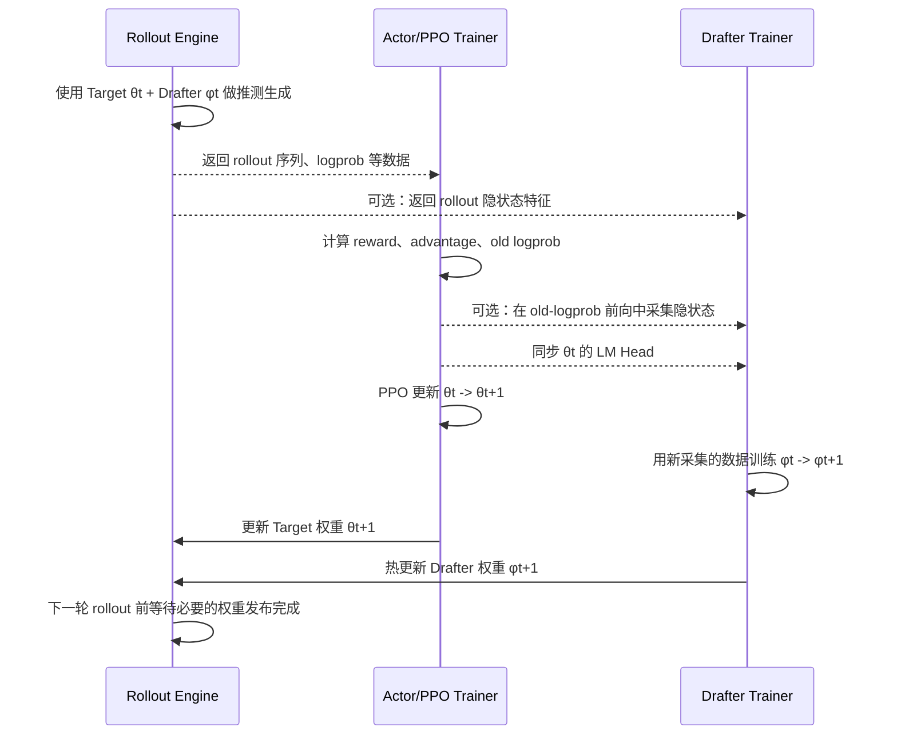

# verl-SpeCo 训练模式中文解读：Online、Collect Only 与 Offline

> 本文面向希望理解 verl-SpeCo 工作机制、但不一定熟悉推测解码（Speculative Decoding）实现细节的读者。
>
> 官方发布博客：[Faster Draft Model Training: verl-SpeCo 0.1.0 Adds Native DSpark Support and Unlocks Standalone Training](https://verl-project.github.io/posts/2026-08-13-verl-speco-release/)
>
> 本文结合上述博客和当前仓库实现整理。博客发布于 2026 年 8 月 13 日；本文分析的仓库代码还包含博客发布后合入的少量更新，因此具体配置和兼容性应以当前仓库为准。

## 1. 先说结论

verl-SpeCo 所说的 **online training**，不是在线训练 RL 主模型——主模型本来就在正常做 PPO/GRPO 等强化学习训练——而是：

> 在 RL 主模型训练过程中，持续收集当前主模型在真实 rollout 数据上的隐状态等特征，周期性训练一个更小的 Draft Model，再把新版 Draft Model 热更新回 vLLM/SGLang rollout 引擎。

更准确地说，它是一种与 RL 伴随运行的、周期性的 Draft Model 在线蒸馏或协同训练（co-training）。

verl-SpeCo 一共提供三种训练模式：


| 模式             | 当前实现的运行入口与数据来源                  | Actor 是否更新      | 是否训练 Draft Model       | 是否运行投机 rollout | 是否立即更新 rollout 引擎     |
| -------------- | ------------------------------- | --------------- | ---------------------- | -------------- | --------------------- |
| `online`       | PPO/Ray 训练流程中的 rollout/actor 前向 | 是               | 是，在 PPO 作业内周期性训练       | 是              | 可以                    |
| `collect_only` | PPO/Ray 训练流程中的 rollout/actor 前向 | **默认仍然更新**      | 否，只将特征写入 Feature Store | **当前标准入口中是**   | 否                     |
| `offline`      | 独立任务读取已经保存的 Feature Store       | 否，没有 Actor 训练流程 | 是，作为独立训练任务             | 否，没有 rollout   | 否，产出 checkpoint 后另行部署 |


这里必须区分两个容易混淆的概念：

- `collect_only` 表示“只收集 Drafter 特征，不在 PPO 作业中训练 Drafter”；
- 它**不表示**“只做推理、冻结 Actor、跳过 RL 更新”。

当前实现仍然进入上游 `RayPPOTrainer.fit()`。因此，如果没有用其他配置或代码显式冻结 Actor，`collect_only` 期间 Actor 仍会正常执行 PPO/GRPO 更新。

### 1.1 三种模式都必须开启投机解码吗

**算法上不必须，当前标准实现中 online 和 collect_only 被配置开关绑定为需要开启，offline 则完全不运行投机解码。**

从监督数据角度看，训练 Drafter 真正需要的是 Target Model 产生的 token、hidden states、loss mask，以及算法所需的 logits/logprob 等信息。普通 Target-only 自回归生成也能产生这些信息，不需要先有一个正在工作的 Drafter。

但当前在线调度代码把“启用 Drafter worker/特征采集 hook”定义为：

```text
drafter.enable == true
AND
drafter.enable_drafter_training == true
```

其中 `drafter.enable` 同时又是 rollout 侧开启 Drafter/投机解码的开关。因此当前标准入口表现为：


| `drafter.enable` | `enable_drafter_training`  | 当前行为                                                    |
| ---------------- | -------------------------- | ------------------------------------------------------- |
| `false`          | 任意值                        | 普通 Target-only rollout；不会启用 SpeCo 在线采集和训练闭环             |
| `true`           | `false`                    | 使用一个固定 Drafter 做投机 rollout；只记录 rollout 指标，不在线训练 Drafter |
| `true`           | `true`，`mode=online`       | 投机 rollout + 特征采集 + Drafter 训练 + 权重发布                   |
| `true`           | `true`，`mode=collect_only` | 投机 rollout + 特征采集落盘；不训练、不发布 Drafter                     |


所以对于 `collect_only`：

- **从原理上说**，只用正常 Target Model 生成和前向就足够；
- **从当前仓库开箱即用的代码路径说**，关闭 `drafter.enable` 会连同特征采集 hook 一起关闭，因而标准 `collect_only` 示例仍然加载一个初始 Drafter 并运行投机解码；
- 这是当前实现的开关耦合和数据采集入口设计，不是 Drafter 蒸馏在数学上的必要条件。

`offline` 比较特殊：官方脚本中仍会设置 `drafter.enable=True` 和 `enable_drafter_training=True`，用于满足 Drafter trainer 的模型初始化配置，但独立训练任务不会启动 vLLM/SGLang rollout，因此没有实际投机解码。

如果希望“冻结 Target、不开投机解码、只采集训练特征”，需要一个解耦的 Target-only collector，或者修改当前启用条件，让特征采集不再依赖 `drafter.enable`。仅仅把 `drafter.enable=False` 并不能在现有标准入口中得到这一效果，因为那会直接退化为普通 verl 训练，同时不再写入 Drafter Feature Store。

可以把三种模式理解为：

```text
online:
RL rollout -> 收集特征 -> 训练 Drafter -> 热更新 Drafter -> 继续 RL rollout

collect_only:
对每个 PPO step：
Actor θt rollout -> 收集 θt 特征 -> 写入 Feature Store -> PPO 更新为 θt+1
重复上述过程，直到该 PPO 采集作业结束

offline:
读取 Feature Store -> 独立训练 Drafter -> 保存 checkpoint
```


## 2. 背景：为什么需要 Draft Model


### 2.1 推测解码解决什么问题

大语言模型自回归生成时，通常一次只能确定一个新 token。推测解码引入一个更小、更快的 Draft Model：

1. Draft Model 一次提出一个或多个候选 token；
2. Target Model 对这些候选进行批量验证；
3. 接受与 Target Model 分布一致的候选，拒绝或修正不一致的候选；
4. 如果一次能连续接受多个 token，就减少了昂贵的 Target Model 调用次数。

Draft Model 的价值不在于替代 Target Model，而在于尽量准确地猜中 Target Model 接下来会生成什么。

在默认的精确验证配置下，Draft Model 只影响生成速度，不应改变 Target Model 的最终采样分布。仓库默认关闭有损推测采样，配置见 `[speco_base.yaml](./verl_speco/config/speco_base.yaml)`。

### 2.2 为什么固定 Drafter 在 RL 中容易失效

如果 Target Model 是固定模型，可以提前离线训练一个 Drafter，然后长期使用。但 RL 训练中的 Actor 会不断更新：

```text
Actor θ0 -> θ1 -> θ2 -> θ3 -> ...
```

一个只针对 `θ0` 训练的 Drafter，可能逐渐跟不上新的 Actor 分布。具体表现是：

- Draft Model 提议的 token 越来越不符合当前 Actor；
- Target Model 拒绝更多候选；
- 平均接受长度下降；
- 推测解码的加速收益逐渐消失。

Online 模式要解决的核心问题，就是让 Drafter 在 RL 训练期间持续追踪这个不断变化的 Target Model 和 on-policy 数据分布。

## 3. Online 模式：与 RL 一起运行的完整闭环


### 3.1 系统中有哪些模型和组件

Online 模式至少涉及三个逻辑组件：

1. **Actor/Target Model**
  - 由 verl 正常执行 PPO、GRPO 等训练；
  - 决定 rollout 的真实目标分布；
  - 也是 Draft Model 的教师模型。
2. **Rollout Engine**
  - 通常是 vLLM 或 SGLang；
  - 同时持有可服务的 Target Model 和 Draft Model；
  - 负责推测生成、候选验证和 rollout 数据生产。
3. **Drafter Trainer**
  - 使用 FSDP/FSDP2 风格的分布式训练；
  - 接收 rollout 或 old-logprob 阶段采集的特征；
  - 周期性优化 Draft Model；
  - 生成待发布的 Drafter 权重快照。

仓库的整体架构图见 `[docs/assets/speco-architecture.svg](./docs/assets/speco-architecture.svg)`。Online 模式的主要调度入口位于 `[SpecoRayPPOTrainer](./verl_speco/trainer/speco_ray_trainer.py)`，Drafter worker 实现位于 `[SpecoWorker](./verl_speco/workers/speco_worker.py)`。

### 3.2 一次 RL step 中实际发生什么

下面用 `θt` 表示当前 Actor/Target Model 权重，用 `φt` 表示当前 Drafter 权重。




进一步拆开来看：

#### 步骤 1：用当前 Target 和 Drafter 做 rollout

Rollout Engine 使用 `φt` 提出候选，用 `θt` 验证候选。它最终输出 RL 正常需要的 prompt、response、token、logprob 等数据，同时记录推测解码的接受长度等指标。

这一步仍然是标准 RL rollout，只是生成过程由 Drafter 加速。

#### 步骤 2：采集 Drafter 训练特征

verl-SpeCo 支持两类主要采集位置。

**路径 A：从 Rollout Engine 采集**

推理引擎在生成时直接返回用于 Drafter 训练的特征。这种路径贴近实际 rollout 分布，但需要推理引擎具备对应的隐状态采集能力。

**路径 B：从 old-logprob 计算中采集**

PPO 本来就需要用 Actor 对 rollout 序列执行前向计算，以得到 old logprob。verl-SpeCo 可以在这次前向中注册 hook，额外抓取目标层隐状态，从而复用已有计算。

代码会选择需要采集的样本和 token 位置，在 TP/SP 等并行布局下合并对应的 hidden rows，然后通过 CPU tensor 或 Ray ObjectRef 把数据路由到 Drafter worker。相关 hook 位于 `[_speco_online_fit_hooks](./verl_speco/trainer/speco_ray_trainer.py)`。

典型训练特征包括：

- `input_ids`；
- prompt/response 边界；
- loss mask；
- 一个或多个目标层的 hidden states；
- Target Model 最终层 hidden states；
- hidden state 对应的原始 token position；
- 某些算法需要的辅助 logits、logprob 或路由信息。

这些数据不是越多越好。多层 hidden states 的体积可能远大于 token 数据，因此配置中提供了：

- 每步每 replica 最大采集样本数；
- 每步最大采集 token 数；
- 每个样本的 hidden-state window 大小；
- front/random 等窗口选择策略；
- 采集周期与采样比例。


#### 步骤 3：同步与该批特征匹配的 Target LM Head

仅有最终层 hidden state 并不能得到完整的 Target logits，还需要对应版本的 LM Head：

```text
target_logits = final_hidden_state x target_lm_head^T
```

因此，在准备训练 Drafter 时，verl-SpeCo 会从更新前的 Actor 取出 Target LM Head，并同步给 Drafter Trainer。

这里的版本一致性很重要：如果 hidden state 来自 `θt`，却使用 `θt+1` 的 LM Head 重建教师分布，监督信号就会出现隐蔽的错位。实现会先把 LM Head 暂存在 CPU，允许它的分发与 Actor update 部分重叠，再在 Drafter 激活时应用到设备上。相关逻辑见 `[_speco_start_target_lm_head_weight_sync](./verl_speco/trainer/speco_ray_trainer.py)`。

对于大词表模型，同步完整 LM Head 成本很高。项目还支持只同步训练实际需要的词表行，以减少通信和显存开销。

#### 步骤 4：主 Actor 正常进行 PPO/GRPO 更新

主模型仍然走 verl 原有的训练流程：

```text
θt --PPO/GRPO update--> θt+1
```

verl-SpeCo 没有把 Drafter loss 加到 Actor loss 中，也不会用 Drafter 替代 reward 或 advantage。两套训练目标相互独立：

- Actor 优化 RL 目标；
- Drafter 学习模仿和预测 Actor。

因此，所谓 co-training 是调度、数据和权重发布层面的协同，而不是把两个模型拼成一个联合 loss 反向传播。

#### 步骤 5：周期性训练 Drafter

Drafter 通常不是每个 RL step 都训练，而是由配置控制周期。例如共享默认配置中：

```yaml
collect_interval_steps: 5
training_interval_steps: 5
step: 10
```

含义大致是：每 5 个 RL step 采集/触发一次，每次触发执行 10 个 Drafter optimizer steps。具体示例脚本可能覆盖这些默认值。

一次触发的内部过程是：

1. 激活 Drafter 模型和优化器；
2. 必要时从 CPU 把 FSDP shard、optimizer state 搬到 GPU/NPU；
3. 应用暂存的 Target LM Head；
4. 从当前数据或 DataBuffer 取 batch；
5. 执行若干次 forward、loss、backward 和 optimizer step；
6. 生成用于发布的权重快照；
7. 清理训练状态，并按配置把模型和优化器重新 offload 到 CPU。

具体执行过程见 `[SpecoWorker.train_drafter](./verl_speco/workers/speco_worker.py)`。

需要特别注意：虽然 worker 方法是异步接口，但当前主调度路径会等待 Drafter 训练结果。因此 Drafter 训练通常仍会增加 RL step 的关键路径时间。主要可重叠的部分是部分 Target LM Head 同步，以及可配置的异步权重发布。

#### 步骤 6：更新 rollout 中的 Target 和 Drafter

Actor 更新完成后，上游 verl 会把 `θt+1` 更新到 Rollout Engine。verl-SpeCo 把 Drafter 发布安排在 Target 更新之后，再将 `φt+1` 热更新到推理引擎。

热更新不是简单地随便执行一次 `parameter.copy_()`。它需要处理：

- vLLM/SGLang 参数命名差异；
- tensor-parallel shard；
- fused parameter；
- dtype 转换；
- IPC 或共享内存传输；
- CUDA Graph 或 NPU graph 状态；
- generation pause 与更新前后 flush；
- 多个 rollout worker 的一致完成。

如果使用异步发布，下一次 generation 开始前仍会等待尚未完成的 Drafter 更新，避免新一轮 rollout 读到半更新状态。

### 3.3 Drafter 到底在学习什么

这不是 PPO，而是以 Target Model 为教师的监督学习或蒸馏。不同 Drafter backend 使用不同目标。

#### 一个更通俗的理解：GRPO Actor + on-policy 蒸馏 Drafter

可以把 Online 模式概括为：

> Actor/Target 正常做 GRPO/PPO；Drafter 在 Actor 产生的 on-policy 轨迹上做监督学习或知识蒸馏，并周期性回到 rollout 引擎中加速下一阶段的数据生成。

假设 `training_interval_steps=N`，可以把整个过程理解为：

```text
前面若干 RL step：
Actor/Target 持续执行 GRPO/PPO 更新
Drafter 暂时保持不变

到达 Drafter 训练触发 step：
1. 用当前 Target θt 做 rollout / old-logprob
2. 收集 θt 的 token、hidden states、final hidden 或 logits
3. 同步与这些特征匹配的 θt LM Head
4. Actor 正常执行 GRPO/PPO：θt -> θt+1
5. 单独训练 Drafter：φt -> φt+1
6. 将 Target θt+1 更新到 rollout engine
7. 将 Drafter φt+1 更新到 rollout engine
8. 使用新 Target 和新 Drafter 开始后续 rollout
```

这里的 `N` 是调度周期，不表示 Actor 在前 `N` 步停止更新。Actor 通常每个 RL step 都正常训练；只有 Drafter 在达到采集和训练周期时才被触发。实际是否采集、训练和发布，还分别受 `collect_interval_steps`、`training_interval_steps` 和 `publish_interval_steps` 控制。

需要再次注意版本关系：触发 step 中复用的是 Actor update 之前 `θt` 的 rollout/old-logprob 特征，因此训练后的 Drafter 主要拟合 `θt`，而下一轮 rollout 的 Target 通常已经是 `θt+1`。这就是 Online 模式中前文提到的一步或一个周期的 Drafter 滞后。

#### 训练 Drafter 时，Target 完全没有梯度

Drafter 训练阶段不是 Actor 和 Drafter 的联合反向传播。两者拥有独立的模型状态、optimizer 和梯度图：

```text
Actor/Target：
GRPO/PPO loss -> Actor optimizer -> 更新 θ

Drafter：
预先采集并 detach 的 Target features/logits
    -> supervised/distillation loss
    -> Drafter optimizer
    -> 更新 φ
```

在 Drafter backward 期间：

- 完整 Target Model 不参与反向传播；
- Target hidden states 已经在采集阶段 detach；
- Target LM Head 作为冻结的教师输出层使用；
- 从 Target 复用的 embedding 通常也被冻结；
- 梯度只更新 Drafter 自身的网络、projector、Markov Head 等可训练参数；
- Drafter loss 不会传回 Actor，也不会改变 GRPO/PPO 的 reward、advantage 或 policy loss。

因此所谓 co-training 不是把两种 loss 相加后做一次联合 backward，而是两套训练过程的交替调度：

```text
Actor 用 RL 持续变化和提升
        |
        v
产生新的 on-policy 轨迹和教师特征
        |
        v
Drafter 用监督蒸馏追踪 Actor
        |
        v
加速下一阶段 Actor 的 rollout
```

“GRPO Target + on-policy SFT Drafter”可以作为第一层直觉，但更准确的名称是：

> **GRPO/PPO Actor + on-policy teacher/feature distillation Drafter。**

之所以不直接称为普通 SFT，是因为 Drafter 的监督目标除了 next-token CE，还可能包含 hidden-state regression、Target 分布蒸馏、多 token/block prediction，以及 DSpark 的 Markov dependency 等专用目标。

常见目标包括：

- 下一 token 或多 token 的交叉熵；
- 对 Target hidden state 的特征回归；
- 对 Target logits/probability distribution 的蒸馏；
- block 内多个位置的加权 loss；
- 专用的并行预测、Markov 或置信度目标。

因此它与普通 SFT 的区别是：

```text
普通 SFT：
文本 token -> next-token CE -> 训练语言模型

Drafter 训练：
文本 token + Target hidden/logits/结构化位置
          -> 特征回归、分布蒸馏或 block prediction
          -> 训练专用 Draft Model
```


### 3.4 以 DSpark 为例

博客重点介绍了 DSpark。DSpark 不是逐 token 独立地预测下一个 token，而是围绕 anchor 构造固定长度 draft block，因此训练数据必须与推理语义完全一致。

主要技术点包括：

1. **Block-wise 数据对齐**

   - 正确组织 anchor；
   - 对齐 block 内前序 token；
   - 对齐目标 token 和有效监督位置；
   - 让 block 第一个位置也能参与训练。

2. **Markov Head**

   - 显式利用 block 内已经出现的 token；
   - Vanilla Head 使用低秩 token 转移结构；
   - Gated Head 再使用当前 hidden state 动态控制 Markov 信号。

3. **draft model CE 与分布蒸馏联合优化**

   - CE 学习正确目标 token；
   - L1 loss 约束 Drafter 与 Target 的完整输出分布；
   - 对 block 前部位置赋予更高权重，因为早期 token 的正确率更影响连续接受长度。

4. **大词表计算优化**

   - full-vocabulary CE 最直接，但代价高；
   - restricted CE 和 sampled CE 只计算所需词表行；
   - 需要完整分布蒸馏时再按需重建完整概率分布。

#### 3.4.1 Anchor 到底是什么

Anchor 不是特殊词表 token，也不是一个需要学习的参数。它是从一条长序列中选出的一个位置，表示：

> Target Model 已经确认到这个位置，Drafter 接下来要从这里开始提出一个未来 token block。

假设原始序列为：

```text
A B C D E F G H I
```

选取 `D` 所在位置作为 anchor，block size 为 4。在推理语义中，`A B C D` 是已经确认的前缀，Drafter 应该从 `D` 之后开始提出 `E F G H`：

```text
已知前缀：A B C D
anchor：       D
未来 block：    E F G H
```

DSpark 对应的训练布局可以简化成：

```text
Drafter block 输入：  [D] [MASK] [MASK] [MASK]
监督目标 target：     [E]   [F]    [G]    [H]
Markov 前序 token：   [D]   [E]    [F]    [G]
```

各位置的含义是：

```text
位置 0：根据 Target 上下文和 D，预测 E
位置 1：根据 Target 上下文和 E，预测 F
位置 2：根据 Target 上下文和 F，预测 G
位置 3：根据 Target 上下文和 G，预测 H
```

并行 backbone 一次产生整个 block 的基础 hidden/logits；轻量 Markov Head 再使用前一个 token 为对应位置添加 logit bias。训练时通常用真实的前序 token 构造 Markov 监督，推理时则使用 Drafter 实际采样出的前一个 token。

#### 3.4.2 为什么不能直接使用普通 next-token 训练

普通自回归语言模型的训练和推理都是逐 token 的：

```text
A B C D       -> E
A B C D E     -> F
A B C D E F   -> G
A B C D E F G -> H
```

预测 `F` 时模型已经看到了真实或刚生成的 `E`，预测 `G` 时又已经看到了 `E F`。但 DSpark 的并行 backbone 希望通过一次前向同时产生整个 block 的基础预测。在这次前向中，后面位置不能提前看到尚未生成的真实未来 token。

所以训练时必须显式规定：

- 已确认前缀在哪里结束；
- 哪个真实 token 用来启动 block；
- 每个 draft 位置允许看到哪些 Target 上下文；
- 哪些未来 token 必须被 mask，避免标签泄漏；
- 每个位置的 label 和 Markov 前序 token 分别是谁。

Anchor 就是定义这条信息边界的坐标。如果直接套用普通 next-token CE，训练时可见的信息和 DSpark block 推理时可见的信息不同，会造成 train/inference semantic mismatch。

也可以对序列中每个位置都构造 block，但每个 block 仍然隐含一个 anchor。实际实现随机采样 `num_anchors` 个有效起点，是为了避免穷举所有起点带来的计算和显存开销。一条序列因此可以提供多个训练 block：

```text
A | B C D E
A B | C D E F
A B C | D E F G
A B C D | E F G H
```

竖线左侧是已确认前缀，竖线前最后一个 token 就是该 block 的 anchor。不同 block 通过 attention mask 相互隔离，并使用 loss mask 排除 padding、无效 token 或不应监督的位置。

#### 3.4.3 为什么强调 block 第一个位置也参与训练

DFlash 风格的 block 可以简化为：

```text
block 输入：[anchor] [MASK] [MASK] [MASK]
监督位置：    跳过      是      是      是
```

第 0 个位置用于放置 anchor，本身不预测未来 token。DSpark 的 anchor-first 或 `sample_from_anchor` 语义则是：

```text
block 输入：[anchor] [MASK] [MASK] [MASK]
监督目标： [next 1] [next 2] [next 3] [next 4]
监督位置：    是        是       是       是
```

Anchor token 仍然是条件，但它占据的第 0 个 block 位置用于预测第一个未来 token。这样 block size 为 4 时可以训练并提出 4 个未来 token，而不是把一个位置只用于复制或承载 anchor。

本仓库中的 DSpark 对齐关系是：

```text
anchor token：x[a]
labels：      x[a+1], x[a+2], ..., x[a+K]
prev tokens： x[a],   x[a+1], ..., x[a+K-1]
```

对应实现见 [`DSparkTrainingModel`](./verl_speco/backends/dspark_trainer_backend.py)。

#### 3.4.4 Anchor 是所有投机解码都需要的吗

不是。所有推测解码都有“当前已确认前缀在哪里结束”的逻辑概念，但不一定在训练中显式采样 anchor。

| Drafter 类型 | 是否通常显式使用 sampled anchor |
| --- | --- |
| 传统小语言模型 Drafter | 否，按普通自回归 next-token 方式训练和生成 |
| N-gram speculation | 否，主要依据已有 token 匹配候选 |
| EAGLE 系列 | 通常不称为 anchor，使用 hidden-state shift、多步或 tree 对齐 |
| MTP heads | 通常按未来预测深度对齐 |
| DFlash | 是，block-parallel/diffusion 构造需要明确起点 |
| DSpark | 是，继承 DFlash block backbone，并加入 anchor-first 与 Markov 语义 |
| Domino | 是，沿用 DFlash 类 block 构造 |
| P-EAGLE | 使用自己的并行 depth/COD 采样语义 |

因此，Anchor 是 DFlash、DSpark、Domino 这类 block-wise parallel drafter 的核心训练构造，不是所有 speculative decoding 算法的统一训练方式。

进一步阅读可参考 [DSpark 论文](https://arxiv.org/abs/2607.05147)、[DFlash 论文](https://arxiv.org/abs/2602.06036) 和 [vLLM Speculators 的 DSpark 说明](https://github.com/vllm-project/speculators/blob/main/docs/user_guide/algorithms/dspark.md)。

其他算法如 EAGLE、DFlash、Domino 和 P-EAGLE 共享同一套在线采集、调度、分布式训练和发布框架，但具体模型结构与 loss 由各自 backend 决定，代码位于 [`verl_speco/backends`](./verl_speco/backends)。

### 3.5 数据是新鲜的，但发布时仍存在模型版本差

这里需要区分两个概念：**训练数据的新鲜度**和**Drafter 发布时与 Target 的版本差**。

#### 数据新鲜度

假设 `collect_interval_steps=5`、`training_interval_steps=5`，第 5 个 RL step 触发 Drafter 训练。该 step 使用当时最新的 Actor/Target `θt` 做 rollout 或 old-logprob，并立即收集 `θt` 的特征。因此在不使用历史 DataBuffer 的情况下，这批数据就是当前 step 最新的 on-policy 数据，并不是五步以前的旧数据。

```text
第 5 步开始时的最新 Target：θt
当步 rollout/old-logprob：     θt
当步采集的 hidden/LM Head：   θt
```

`training_interval_steps=5` 表示 Drafter 每 5 步触发一次，不表示第 5 步仍然使用第 1 步缓存的数据。只有显式启用跨 step DataBuffer、从最近若干步采样时，训练 batch 才可能包含更早的特征。

#### 发布时的版本差

版本差来自同一个 trigger step 内的操作顺序：特征采集发生在 Actor update 之前，随后 Actor 执行一次 GRPO/PPO update，最后才训练和发布 Drafter。

```text
1. 用 θt rollout / old-logprob
2. 收集 θt 的 hidden，并同步 θt 的 LM Head
3. Actor update：θt -> θt+1
4. 用内部一致的 θt 特征和 θt LM Head 训练 Drafter：φt -> φt+1
5. 下一轮 rollout 使用 Target θt+1 和 Drafter φt+1
```

所以更准确的描述不是“第 5 步训练用了陈旧数据”，而是：

> Drafter 使用当步最新、内部版本一致的 `θt` 数据完成训练；但在它发布时，Actor 已经又更新了一次，因此下一轮服务组合通常是 `Target θt+1 + 拟合 θt 的 Drafter φt+1`。

这是一份 Actor optimizer step 的版本差，而不是采集数据过期。之所以不直接采集 `θt+1`，是因为那需要在 Actor update 后用新模型对序列再执行一次 Target forward，不能再直接复用当步已有的 rollout/old-logprob 计算。

#### 训练间隔带来的累积偏离

如果 Drafter 每 5 步更新一次，那么刚发布时通常只相差刚才那一次 Actor update；随后 4 个 RL step 中 Actor 继续更新，而 Drafter 保持不变，到下次触发前二者的版本差会逐渐扩大。下次触发时，Drafter 又使用该时刻最新的 on-policy 特征追赶一次。

```text
触发后：Drafter 约拟合前一个 Actor 版本
中间步骤：Actor 持续更新，Drafter 不变
下次触发：使用最新当步数据重新追赶
```

因此调度周期仍然是一个权衡：

- 训练/发布越频繁，Drafter 越贴近当前 Actor，但额外开销越大；
- 周期越长，训练开销越小，但周期后半段的 acceptance rate 可能下降；
- 使用历史 DataBuffer 能扩大样本量，但会额外引入旧教师分布。

在精确验证模式下，这种版本差通常不会破坏生成正确性，因为不匹配的候选会被 Target 拒绝；它主要影响接受长度和端到端性能。

## 4. Collect Only 模式：只采集，不在 RL 作业里训练

`collect_only` 把在线闭环拆成“数据生产阶段”。它利用 RL/PPO/Ray 作业中的 rollout 或 Actor 前向产生特征，但不会启动在线 Drafter 优化和权重回灌。

需要特别强调：当前代码中的 `collect_only` 只关闭 Drafter training，并不会关闭 Actor training。官方独立训练示例的第一阶段也是一次短 PPO/vLLM run，而不是一个独立的、冻结 Target Model 的纯推理采集程序。

所以它的真实时序通常是：

```text
RL step t:
使用 Actor θt rollout -> 采集 θt 的特征 -> PPO 更新为 θt+1

RL step t+1:
使用 Actor θt+1 rollout -> 采集 θt+1 的特征 -> PPO 更新为 θt+2

......
```

只要 `collect_interval_steps` 命中，后续 RL step 仍会继续收集。因此最终 Feature Store 可能包含来自多个 Actor 版本和多个训练阶段的数据，而不是只对应一个固定 checkpoint。

流程如下：

```text
Target Model / RL rollout
          |
          v
采集 input_ids、mask、hidden states、辅助特征
          |
          v
按 shard 写入 Feature Store
          |
          v
生成 manifest 和统一 schema
```


### 4.1 Feature Store 保存什么

verl-SpeCo 的 Feature Store 基于分片 PyTorch 文件，通常包含：

- input IDs；
- loss mask；
- Target hidden states；
- hidden position 和对齐信息；
- 可选的 logits/logprob 等算法辅助字段；
- 算法、模型路径和 schema 等元数据。

它还支持：

- 按 step flush；
- 每个 shard 的容量限制；
- manifest；
- 严格 schema 校验；
- 训练侧 shuffle、repeat 和 prefetch；
- 使用 `verl-speco-inspect-features` 在正式训练前检查数据。

实现见 `[feature_store.py](./verl_speco/trainer/feature_store.py)`。

### 4.2 为什么要单独提供 Collect Only

它解决了在线闭环中“数据生产、训练试验和资源调度绑死”的问题。

采集一次之后，同一份特征可以用于：

- 比较不同学习率、batch size 和训练步数；
- 比较不同 Drafter 架构；
- 排查 token/hidden 对齐问题；
- 重现实验；
- 在另一组专用 GPU/NPU 上训练；
- 避免每次调参都重新运行昂贵的 Target Model rollout。

它的代价是数据一旦固定，就不能自动跟随之后持续变化的 Actor。若特征来自 RL 早期模型，用它训练出的 Drafter 未必适合 RL 后期的 Actor。

反过来，如果目标是给一个**固定** Target Model 训练 Drafter，也要避免误以为设置 `mode=collect_only` 就自动冻结了 Actor。更稳妥的做法是使用明确冻结 Actor 的采集配置，或者实现/使用只运行固定模型 rollout 的特征生成入口，并确认整个采集期间 Target checkpoint 没有变化。

这一点还会影响离线蒸馏的一致性：Feature Store 虽然记录了 `global_step`、`target_model_path` 和部分 LM Head fingerprint 等元数据，但并没有为每条样本保存一份完整的 Target LM Head。如果离线训练使用某个固定 LM Head 重建教师分布，而 hidden states 实际来自多个不断更新的 Actor 版本，就可能出现 teacher hidden 与 LM Head 版本不完全匹配。因此，混合多版本数据应当是有意识的实验选择，而不能把它当作固定 Target 数据集来理解。

### 4.3 更新前特征是否适合训练最终 Drafter

这个问题必须区分 Online 和 Offline 两个目标。

#### 场景 A：Online co-training

在 RL step `t` 中，rollout 和 old-logprob 都发生在 Actor update 之前，因此拿到的是 `θt` 的 hidden states。Online 路径会同时同步 `θt` 的 Target LM Head，保证这批 hidden 和用于重建 teacher logits 的 head 属于同一个模型版本：

```text
训练数据：θt 的 hidden/token
教师 Head：θt 的 LM Head
训练结果：φt+1
下一轮 Target：通常已经是 θt+1
```

这套监督信号内部是一致的，但发布后的 Drafter 对下一版 Actor 存在一步或一个训练周期的滞后。只要 Actor 单步变化较小，这可以作为工程近似；精确 speculative verification 又能保证错误提案被拒绝，所以主要影响 acceptance 和速度，而不是生成正确性。

如果要求 Drafter 严格匹配更新后的 `θt+1`，就需要在 Actor update 后用 `θt+1` 对序列再做一次 teacher-forcing forward，重新生成 hidden/logits，再训练 Drafter。这会增加一次主模型前向及相应通信，并进入训练关键路径。当前实现选择复用 rollout/old-logprob 的更新前计算，实质是在一致性与额外成本之间做取舍。

#### 场景 B：Collect Only + Offline，为最终 Actor 训练一个 Drafter

如果目标是为 RL 完成后的最终 Actor `θT` 训练一个固定 Drafter，那么收集整个训练轨迹中的：

```text
θ0、θ1、θ2、...、θT-1 的 hidden states
```

再在 Offline 阶段统一使用某个固定 `target_model_path` 的 embedding/LM Head，并不是严格版本一致的方案。尤其当 `use_logits=False` 时，Offline backend 会把保存的 final hidden state 输入从 `target_model_path` 加载的 LM Head 来重建 teacher logits；如果二者来自不同 Actor 版本，监督分布可能发生偏差。

当前官方 `collect_only` 示例：

- 运行一次短 PPO 作业；
- Actor learning rate 非零；
- `use_logits=False`；
- Feature Store 记录 `global_step` 和模型路径等元数据，但没有为每个 step 保存完整、可恢复的 LM Head checkpoint。

因此，若把该示例直接解释为“为最终 Actor 构建严格匹配的离线蒸馏数据集”，是不够严谨的。Actor 学习率很小、采集作业很短时，版本差异可能有限，但这只是近似条件，不是严格保证。

#### 更严谨的最终模型采集流程

如果目标明确是服务最终 Actor `θT`，推荐流程是：

```text
1. 完成 RL，得到最终 Actor checkpoint θT
2. 冻结 θT
3. 使用 θT 对目标文本/轨迹执行 rollout 或 teacher-forcing forward
4. 只保存 θT 的 aux hidden、final hidden、token/mask
   或直接保存与每条样本匹配的 teacher logits
5. Offline 训练 Drafter，并从同一个 θT checkpoint 加载 embedding/LM Head
6. 将所得 Drafter 与 θT 一起部署和评测
```

如果确实希望利用多个 RL 阶段的数据，则至少应显式记录并处理 teacher version。可选方案包括：

- 按 Actor checkpoint/global-step 分开 Feature Store；
- 每个版本使用匹配的 LM Head；
- 保存自包含的 teacher logits，减少离线重建时对固定 LM Head 的依赖；
- 明确把目标定义为训练一个覆盖多个 Actor 版本的通用 Drafter，并单独评测它在最终 `θT` 上的 acceptance。

所以，更新前特征并非一概“不合理”：它适合低成本的 Online 近似；但如果目的是离线训练一个严格匹配最终 Actor 的 Drafter，只收集最终权重对应的特征会更合理。

## 5. Offline 模式：独立的监督蒸馏训练

`offline` 完全不需要正在运行的 PPO 作业。它读取 `collect_only` 已经写好的 Feature Store，作为一个普通的分布式训练任务运行。

```text
Feature Store
     |
     v
独立 torchrun / 分布式 Drafter Trainer
     |
     v
gradient accumulation + optimizer steps
     |
     v
周期 checkpoint + 最终 Drafter checkpoint
```

项目提供独立入口 `verl-speco-draft-train` 和配置 `[draft_trainer.yaml](./verl_speco/config/draft_trainer.yaml)`。训练循环会：

1. 初始化单机多卡或多机分布式环境；
2. 根据 `speculative_algorithm` 选择 Drafter backend；
3. 校验并读取 Feature Store；
4. shuffle、循环取样和预取数据；
5. 执行 gradient accumulation 和 optimizer step；
6. 定期保存 checkpoint；
7. 写出最终 checkpoint。


### 5.1 它像 SFT 吗

从工程形式上看很像：固定数据集、监督 loss、独立训练、输出 checkpoint。

但从学习目标看，它更接近知识蒸馏或特征蒸馏，而不是普通 SFT：

- 教师 Target Model 是固定的；
- 数据不仅有 token，还有教师 hidden states 或 logits；
- 学生是专用 Drafter，而不是完整对话模型；
- 目标是提高 speculative acceptance，而不是直接提高任务 reward；
- 不涉及 reward、advantage、value model 或 PPO clipping。


### 5.2 什么时候 Offline 更合适

以下场景优先考虑 `collect_only + offline`：

- Target Model 是固定的，不做 RL；
- 想为某个 Qwen/Llama checkpoint 训练 Drafter；
- 需要反复调 Drafter 超参数；
- rollout 集群和训练集群的硬件资源不同；
- 希望让特征采集与训练失败彼此隔离；
- 需要可重复的数据集来调试算法。


## 6. 三种模式如何选择


### 选择 Online

适用于：

- Actor 在 RL 中持续变化；
- 固定 Drafter 的 acceptance 明显随训练下降；
- 能接受 Drafter 训练进入部分 RL 关键路径；
- 推理引擎支持目标算法的在线权重更新。

重点观察：

- `drafter/spec_decode/mean_acceptance_length`；
- rollout 时间；
- Drafter 训练和发布耗时；
- RL step 总耗时；
- Drafter 各位置准确率和 loss；
- 主任务 reward/accuracy 是否保持一致。


### 选择 Collect Only

适用于：

- 先建立可复用的 Drafter 特征数据集；
- 在线训练成本或风险暂时不可接受；
- 需要比较多个 Drafter backend；
- 需要稳定复现数据对齐问题。

重点观察：

- Feature Store schema 是否一致；
- hidden rows 与 token positions 是否严格对齐；
- 是否有 NaN/Inf；
- shard 数量、大小和 flush 是否正常；
- 特征来自哪个 Target checkpoint 和 RL 阶段。


### 选择 Offline

适用于：

- 已经有合格的 Feature Store；
- 训练固定 Target Model 的 Drafter；
- 希望独立调参或使用专用训练资源；
- 当前 rollout runtime 尚不支持在线 Drafter 服务。

重点观察：

- 训练配置是否与采集 schema 匹配；
- Target 模型、tokenizer、词表和 LM Head 是否匹配；
- checkpoint 能否被目标 vLLM/SGLang 版本加载；
- 离线 validation acceptance 是否能转化为真实 rollout 加速。


## 7. 核心技术难点


### 7.1 Token、Hidden State 与 Label 的语义对齐

这是最关键、也最容易产生静默错误的部分。需要同时处理：

- left/right padding 与 remove-padding；
- prompt 和 response 边界；
- hidden 第 `i` 行监督哪个 token；
- pre-norm 与 post-norm；
- 多层 hidden 的层号和拼接顺序；
- TP/SP 下 hidden rows 的重组；
- block-wise 算法中的 anchor 和有效位置。

这类错误经常不会导致程序报错，而是表现为 loss 能下降但 acceptance 不提升。

### 7.2 移动教师与版本一致性

Actor 在不断更新，训练样本、hidden state、LM Head、rollout Target 和 Drafter checkpoint 都有自己的版本。系统必须知道：

- 这批 hidden 是哪个 Actor 产生的；
- 重建 teacher logits 时用了哪个 LM Head；
- 当前 rollout engine 上是哪版 Target；
- 待发布 Drafter 是在哪批监督数据上训练的。

verl-SpeCo 通过 global step、Target LM Head 同步和发布顺序降低版本错配，但周期性训练仍然天然存在一定滞后。

### 7.3 隐状态数据量与通信成本

假设采集多个层、序列长度为 `L`、hidden size 为 `H`，特征规模大致与 `layers x L x H` 成正比，远大于只保存 token ID。

因此必须控制：

- 采样率；
- 单步样本数；
- 单步 token 数；
- hidden window；
- CPU copy；
- Ray ObjectRef 粒度；
- Feature Store shard 大小。

过度采集可能让 Drafter 得到更多数据，却拖慢整个 RL pipeline。

### 7.4 显存和资源复用

Actor、Target rollout、Draft inference 和 Draft training 都可能争用设备内存。verl-SpeCo 默认在 Actor 对应的 resource pool 上创建 Drafter worker，并提供：

- FSDP/FSDP2 shard；
- parameter offload；
- optimizer offload；
- Target LM Head 延迟搬运；
- 训练后清理；
- 部分 NPU/HCCL 特殊处理。

频繁 offload 可以降低峰值显存，却增加主机内存、PCIe/HCCS 传输和激活时间。保留模型驻留则更快，但更容易 OOM。

### 7.5 推理引擎热更新

在线发布必须兼容 vLLM/SGLang 的真实参数布局和执行状态，包括 TP shard、fused weight、graph capture、sleep/wakeup、IPC/SHM 等。更新过程既要快，也要确保所有 rollout worker 使用完整一致的权重版本。

这部分往往比“把 Drafter loss 跑通”更难工程化。

### 7.6 Online 的净收益判断

Online co-training 只有满足下面的不等式才有端到端价值：

```text
推测解码节省的 rollout 时间
    >
特征采集 + 通信 + Drafter 训练 + 激活/卸载 + 权重发布开销
```

官方 README 展示的一个 Qwen3-8B EAGLE3、vLLM-Ascend/NPU、100-step 实验中，co-training 相比 baseline 获得约 20% rollout 加速和约 11% 端到端加速，同时没有观察到准确率回退。这个结果说明在线适配可能有效，但它是特定模型、硬件和配置下的结果，不能直接外推到所有 Drafter 和集群。

实际部署时不能只看 Drafter loss，也不能只看 acceptance；最终指标应是端到端 RL 吞吐和完成训练所需的总资源成本。

## 8. 配置项的直观含义

核心配置位于 `[verl_speco/config/speco_base.yaml](./verl_speco/config/speco_base.yaml)`。下面列出最值得先理解的一组：


| 配置                                       | 含义                                      |
| ---------------------------------------- | --------------------------------------- |
| `drafter.enable`                         | rollout 时是否启用推测解码 Drafter               |
| `drafter.enable_drafter_training`        | 是否创建并启用 Drafter trainer workers         |
| `training.mode`                          | `online`、`collect_only` 或 `offline`     |
| `collect_hidden_states_from_sgl`         | 是否从对应 rollout 采集路径获得隐状态                 |
| `collect_hidden_states_from_old_logprob` | 是否复用 old-logprob 前向抓隐状态                 |
| `collect_interval_steps`                 | 每隔多少个 RL step 采集一次                      |
| `training_interval_steps`                | 每隔多少个 RL step 训练一次 Drafter              |
| `training.step`                          | 每次触发执行多少个 Drafter optimizer attempts    |
| `publish_interval_steps`                 | 每隔多少步准备并发布 Drafter 权重；`0` 通常表示每次成功训练后发布 |
| `publish_async`                          | 是否异步调用 rollout 权重更新；下一轮生成前仍会处理未完成发布     |
| `use_data_buffer`                        | 是否使用跨 RL step 的内存数据缓冲区                  |
| `sample_last_n_steps`                    | 从最近多少个 RL step 的数据中采样                   |
| `feature_store.path`                     | Collect Only/Offline 使用的持久化特征目录         |
| `draft_update_pause_generation`          | 热更新时是否暂停 generation                     |
| `target_lm_head_row_restricted_sync`     | 是否仅同步需要的 Target LM Head 行               |


配置之间存在约束，不能孤立调整。例如 old-logprob 采集频率、训练频率、DataBuffer 和发布频率共同决定数据新鲜度与额外开销。

## 9. 算法与运行时支持不完全相同

仓库目前提供 EAGLE-1、EAGLE-2、EAGLE3、DFlash、DSpark、Domino 和 P-EAGLE 等 Drafter trainer backend，但“可以训练”不等于“已经能在所有 rollout engine 上在线服务”。

例如：

- 某些算法只支持 vLLM；
- 某些算法同时支持 vLLM 和 SGLang；
- GPU 与 Ascend NPU 需要不同运行时版本和算子路径；
- P-EAGLE 当前可以训练，但本 overlay 尚未接好对应的 parallel-drafting rollout runtime。

在选择 Online 模式之前，应同时确认：

1. 训练 backend 是否支持；
2. rollout engine 是否支持该 Drafter；
3. 热更新路径是否支持；
4. vLLM/SGLang/vLLM-Ascend 版本是否匹配。

最新兼容性矩阵请以仓库 `[README.md](./README.md)` 为准。

## 10. 推荐的理解方式

可以用下面三个类比记住三种模式：

- **Online**：学生跟着正在进步的老师上课，隔几节课复习一次，然后立刻回到生产环境协助老师。
- **Collect Only**：只把老师上课时的讲义、思路和答案记录下来，暂时不训练学生。
- **Offline**：学生拿着已经保存的讲义，在独立教室里反复练习，最后交付一个 checkpoint。

如果 Target Model 固定，只想为一个 Qwen/Llama checkpoint 训练 Drafter，通常没有必要真正更新 RL Actor：应使用明确冻结 Target/Actor 的特征生成过程来构建 Feature Store，再进行 Offline 蒸馏。当前仓库提供的 `collect_only` 示例复用了短 PPO 作业，`mode=collect_only` 本身并不负责冻结 Actor，这一点需要额外处理。

如果 Actor 在 RL 中持续变化，而固定 Drafter 的 acceptance 不断下降，Online 模式才体现出最大的价值。

## 11. 参考资料与代码入口

- 官方博客：[verl-SpeCo 0.1.0 发布介绍](https://verl-project.github.io/posts/2026-08-13-verl-speco-release/)
- 项目总览与兼容性：[README.md](./README.md)
- Online PPO 配置：[speco_trainer.yaml](./verl_speco/config/speco_trainer.yaml)
- 共享 Drafter 配置：[speco_base.yaml](./verl_speco/config/speco_base.yaml)
- Online 调度与 hook：[speco_ray_trainer.py](./verl_speco/trainer/speco_ray_trainer.py)
- Drafter worker：[speco_worker.py](./verl_speco/workers/speco_worker.py)
- Drafter 基础训练器：[base_trainer.py](./verl_speco/trainer/base_trainer.py)
- Feature Store：[feature_store.py](./verl_speco/trainer/feature_store.py)
- Offline 训练循环：[draft_training_loop.py](./verl_speco/trainer/draft_training_loop.py)
- 各算法训练 backend：[verl_speco/backends](./verl_speco/backends)
- 独立训练示例：[run_qwen3-8b_drafter_separate_training.sh](./examples/run_qwen3-8b_drafter_separate_training.sh)
